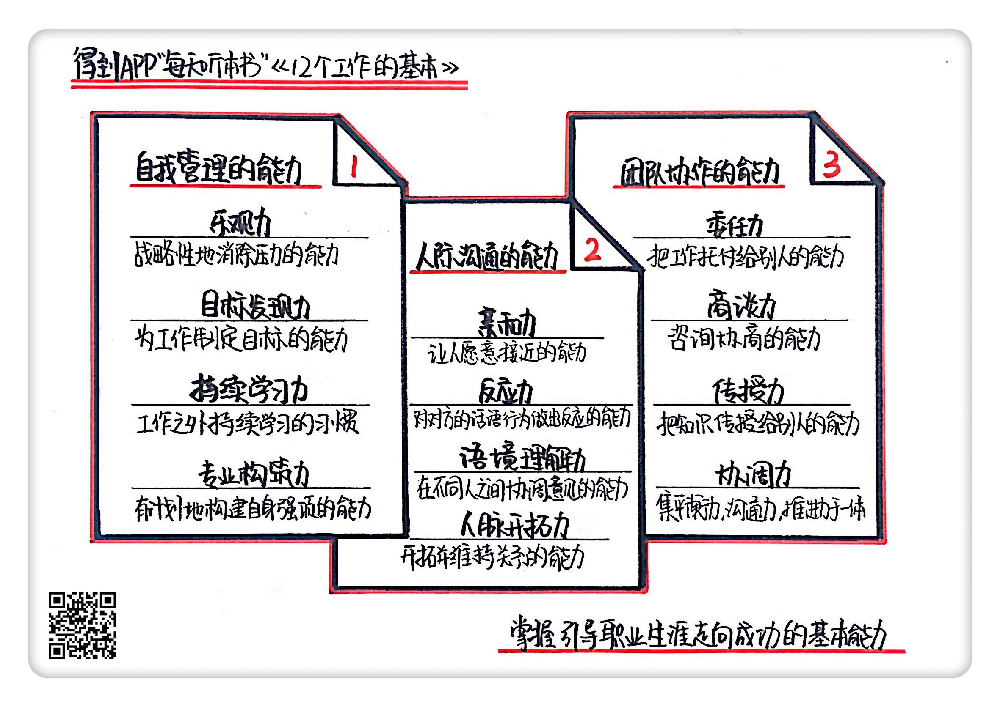

# 《12个工作的基本》| 戴亚伶解读

## 关于作者

大久保幸夫，1990年创立被称为“日本第一人力资源公司”的瑞可利研究所，并就任所长。此外，还担任了法政大学研究生院客座教授，专攻人才管理、劳动政策和职业设计。 

## 关于本书

《12个工作的基本》这本书讲述了12种引导职场生涯走向成功的基本能力，并详细阐述了如何通过掌握这些核心的能力，进而解决职场生涯中遇到的种种困境。 

## 核心内容

本书思想核心是：如何掌握引导职业生涯走向成功的基本能力。3个方面：**自我管理**、**人际沟通**、**团队协作**。12种基本的工作能力：<u>乐观力</u>、<u>持续学习力</u>、<u>目标发现力</u>、<u>专业构筑力</u>、<u>亲和力</u>、<u>反应力</u>、<u>语境理解力</u>、<u>人脉开拓力</u>、<u>委任力</u>、<u>商谈力</u>、<u>传授力</u>、<u>协调力</u>。 

## 前言

你好，欢迎每天听本书，今天为你解读的是《12个工作的基本》。这本书在中国已经加印了两次，由“得到”每天听本书栏目为你率先解读。这本书的中文版大约有12万字，我会用大约23分钟的时间，为你讲述书中精髓：如何掌握引导职业生涯走向成功的基本能力？

在我们步入社会以后，工作就占据了我们大部分时间，并在一定程度上决定我们的人生是否幸福。几乎每个人都有自己的职业理想，而实现这些理想需要具备一定的能力。一说到能力，人们往往只看重学校品牌、资格认证等因素。然而，决定职业生涯成功与否的关键，既不是学校品牌代表的高学历，也不是资格证书这种体现技术的东西，而是能帮你提升内在竞争力的基本能力。那么，这些基本能力究竟有哪些？我们又该如何掌握呢？今天给你讲的这本《12个工作的基本》就很好地回答了这些问题。

这本书的作者是来自日本的职业研究专家大久保幸夫。他创立了瑞可利职业研究所，并就任所长。瑞可利研究所被称为“日本第一人力资源公司”，每年都会发布求职报告和职业调研数据，在相关领域里有着很高的知名度。在研究所里，大久保幸夫取得了不少专业研究成果，并结合自身的工作经验，写出了这本在日本畅销十年的经典职场书。在这本书中，大久保幸夫并没有过多地制定问题解决方案，而是引导读者迅速建立正确的工作认知，并逐步养成影响职业生涯的基本能力。

下面，我会从自我管理、人际沟通、团队协作这三个方面，给你介绍对应的基本能力。

 

## 第一部分

先来看看**自我管理**对应的基本能力，它包括<u>乐观力</u>、<u>持续学习力</u>、<u>目标发现力</u>和<u>专业构筑力</u>四种能力。

首先，我们来了解一下<u>乐观力</u>的概念。乐观力是一种面对工作压力时，有适合自己的处理方法，能够战略性地消除压力的能力。不管在工作还是在生活中，我们都会感受到一些大大小小的压力。因此，<u>学会处理压力</u>也是重要的工作能力之一。病理学家汉斯·塞利认为压力可以分为两种，一种是能促进成长的积极压力，另一种是遏制发展的消极压力。我们<u>需要调节的是消极压力</u>，因为它会给我们带来不良的影响。那么，我们应该如何应对消极压力呢？大久保幸夫给我们提供了两种方法，一种是直面压力，一种是消极回避。直面压力就是对压力根源进行分析和反省，或者向别人直接倾诉压力。消极回避就是把错误归咎于他人，或者通过发泄来转换心情。

而乐观力表现在积极思考，这也是应对压力最有效的方式。把所有的经历都当成学习教材，就是一种与压力战斗的积极方法。我们都听过一个有关工人砌墙的故事。三个工人在建筑工地上，有人问他们在做什么。第一个工人说：“没看到吗？我在砌墙。”第二个人说：“我在建大楼。”第三个人说：“我在建一座美丽的城市。”十年之后，第一个工人还在砌墙，第二个工人已经成了建筑工地的管理者，第三个工人则是这个城市的领导者。所以，第三个工人就是拥有乐观力的人。

其次，我们来了解一下<u>目标发现力</u>的概念。目标发现力是指为工作制定目标的能力。就是说，我们要先发现问题，再以解决问题为目标。日语中有个词叫“待命族”，说的是依赖上司指令办事的人。变成待命族有很多原因，比如，有个太过武断、不接受下属想法的上司，或者是个人害怕失败。如果你不知不觉地变成了待命族，那么你就会失去主动决定工作目标的能力。

每个公司都会确立企业发展目标，而不会帮助个人决定职业发展目标，因此，员工需要自己来确定应该达成的目标。那么如何确定目标呢？从大的方面来说，我们要有梦想，并将梦想以现实的方式落实。当梦想落实成具体目标的时候，它就不再变得遥远了。从小的方面来说，就是树立解决当下问题的小目标。比如说，我们可以改革日程表，把时间划分成多个小份，然后逐一确定要实现的目标。这不仅能帮我们养成设定目标的习惯，还能帮我们养成限时完成工作的习惯。

此外，我们还可以事先预想工作如何展开，展开后会得到什么样的收益。通过收益的激励，我们在实际工作中就能攒足干劲，自然就知道自己接下来该怎么做。在这个过程中，我们要学会联合上司一起思考自己应该完成的目标，因为他们会给出不少中肯的建议，这些都有利于提高目标发现力。

接着，我们来了解一下<u>持续学习力</u>的概念。持续学习力是指，**在工作之外也要养成持续学习的习惯**。在中小学阶段，学校会通过作业和测验来要求学生学习，让学生们掌握基本的学习能力。直到进入大学，自主学习的阶段才算是真正到来。但进入社会不久，曾经学习的科目基本被忘得一干二净，也派不上用场，这就是“学习的剥落”现象。大多数人不是不想学习，而是不知道怎么去学习、要学些什么，这是我们在参加工作之后面对的最主要的问题。我们所说的学习，不是简单地考个资格证书或者考个研，而是学习一些能拓展自己工作领域的知识。<u>如果不知道从什么地方开始学习，不妨从阅读相关领域的书籍开始</u>。

那么，如何养成持续学习的习惯呢？上面提到了目标发现力，这项基本能力告诉我们，<u>所有有计划的学习都是从制定目标开始，确切地说是制定近期目标</u>。然后在此基础上集中精力学习，同时在日程表上记录学习进度。光只是学习还是不够的，还需要把记住的知识亲口说出来，并加以灵活运用。因为记住的知识如果不立刻重现，就容易忘掉，所以应该尽量在24小时内说出来。即使在工作中找不到活用的场合，也可以对家人、朋友或同事说，这有利于巩固知识。

最后，我们来了解一下专业构筑力的概念。<u>专业构筑力</u>是一种有计划地构建自身强项的能力。过了30岁，所有人都会面对一个工作上的课题，那就是构建自己的专业性。我们在这里所说的专业性，不单单局限于某一领域的专家，而是还能延伸到其他领域上。正如真正的专业同行是气脉相通的。不管是设计者、研究开发者，还是技能者，这些专家中的专家就算去做销售，也是一流的。在构筑专业性之前，我们首先要确定自己的专业领域。确定专业领域要考虑三个选择标准：<u>第一，要尽量选择已经积累大量经验的领域；第二，要确定这项专业是否有用武之地；第三，要选择能在短时间内成长的领域</u>。

确定好自己的专业之后，那么如何构建自己的专业性呢？就是要兼顾理论和实践两个方面。只有做到既能将理论运用到实际，又能从理论上说明实践经验，才称得上专业。理论可以通过阅读专业书籍等形式自学，实践只能通过实际业务积累经验。除了学习和实践之外，我们还要养成每天查阅相关新闻和事件的习惯，随时掌握该领域的一切动态。此外，最好与其他专家建立人际关系网，因为信息除了公开流传，还会通过人际关系网进行私密传递。

好，这就是今天给你讲的第一个内容：自我管理对应的基本能力。我们来总结一下：自我管理对应的能力包括乐观力、持续学习力、目标发现力和专业构筑力四种能力。乐观力是一种面对工作压力时，有适合自己的处理方法，能够战略性地消除压力的能力，它需要我们学会积极思考。目标发现力是指为工作制定目标的能力，它需要我们学会分步骤实现自己的目标。持续学习力是指在工作后养成持续学习的习惯，它需要我们学会有计划性地学习。专业构筑力是一种有计划地构建自身独特强项的能力，它需要我们通过学习和实践来构建自己的专业性。

## 第二部分

下面，我们来说说人际沟通对应的基本能力，它包括亲和力、反应力、语境理解力和人脉开拓力四种能力。

首先，我们来了解一下亲和力。亲和力是一种让人产生亲近、愿意接触的能力。一般有亲和力的人笑起来特别有感染力，他们听人说话时也很有礼貌，这类很容易给周围的人留下好印象。跟这类人相处也会很轻松，彼此之间的距离也会缩短，有利于促进交流。此外，具备亲和力也是成为政治家的利器。比如，有“政治家摇篮”之称的松下政经塾，已培养出众多年轻政治家。而掌门人透露说，自己是通过运气和亲和力来选拔学生。因为有亲和力的政治家，才能吸引选民主动投票，提高国民支持率。

既然亲和力这么重要，那么我们应该如何培养亲和力呢？在工作和生活中养成随意寒暄的习惯，是培养亲和力的第一步。我们可以换个角度思考，如果有人主动向你打招呼说“你好”，脸上还带着微笑，你听到后也会不自觉地产生打招呼的冲动。当我们发工作邮件的时候，也要带着日常寒暄，否则会给人造成唐突和粗鲁的印象。

除了寒暄，我们还要练就属于自己的招牌微笑。最常用的方法就是，在镜子前练习表情，并仔细观察这些表情会给人留下什么样的印象，最后创造出自己的招牌微笑。当然，我们还可以模仿身边有亲和力的人，观摩他们的说话方式和行为举止，有意识地不断重复练习，渐渐地就能变成自发行为。

其次，我们来了解一下反应力的概念。反应力是指对对方的话语和行为做出反应的能力。它是一种最基本的交流能力。人与人之间的交流，除了通过口头表达，还有表情、动作等肢体表达。而后两者显得尤为重要，如果不能熟练运用，就无法实现顺畅交流。心理学家梅拉宾曾经做过一个实验，探究一个人判断他人对自己态度的关键依据是什么。得出的实验结果是，表情占55%，声音占38%，言谈占7%。由此可见，在很大程度上，我们是根据表情来判断对方是如何看待自己的。同样的，我们也需要做出相应的表情来回应对方，以便给对方留下好的印象。这就是涉及反应力的培养。

反应力不仅能体现自己的态度，还能决定信息收集的能力。有些人边听人说话边点头，这样的人非常善于倾听，总能得到一些额外的信息。那么，如何训练自己的反应力呢？我给大家介绍几种实用的交流手段。第一个就是“点头”。点头看似是一个很简单的动作，但它产生的效果是很大的。它不仅能向对方传达我正在听你讲、我对你的话感兴趣，还能诱使对方继续说下去。第二个就是“提问”。提问大概可以分为反驳、确认、展开三种方式，反驳是指出自己的疑问，确认是说出自己的理解，展开是提出类似的问题。这些都有利于加深对内容的理解，提高信息的收集能力。

接着，我们来了解一下语境理解力的概念。语境理解力是指在不同背景或语境的人之间协调意见的能力。在职场工作中，我们不可避免地需要“传话”，将上司的话传达给下属，将A同事的话传达给B同事，这时，语境理解力的重要性就凸显出来了。传话不是一字不差地简单转述，而是需要我们揣摩不同人的语境，再转换成合适的说法。那么，如何提高语境理解力呢？

第一，要跟语境不同的人多交流。我们可以跟不同年龄、不同专业领域、不同国籍的人频繁交谈，想尽一切办法让彼此理解对方的想法，然后拉近彼此之间的距离。在这样不断积累交流经验的过程中，语境理解力就能得到很好的锻炼。

第二，要学会探究说话人隐藏的心情和需求。就像营业员在接待顾客时，不仅仅要关注对方说了什么，更重要的是思考对方为什么这么说。语言中没有透露的部分，就要通过想象发言人的背景去理解。

第三，要养成在各种场合整理论点的习惯。比如，我们要在会议结束后整理出本次会议的论点，等到下次开会时就能针对问题本质进行讨论了。

最后，我们来了解一下人脉开拓力的概念。人脉开拓力是一种开拓业务伙伴，并与之维持关系的能力。随着年龄的增长，人脉将变得越来越重要。尤其当职务到了某个层次，人脉就成了必需品。那么，如何拓展人脉呢？首先我们要了解人脉的含义，不是任何一个人都可以称为人脉，我们要看对方是否拥有工作需要的信息，能不能成为我们工作上的伙伴，对于提高自己的品性和教养有没有帮助。当有人满足以上三点时，我们就可以主动去约见他了。之后，还要经常创造见面的机会，最好在初次见面时就铺垫好下次见面的理由，然后顺理成章地借助机会加深关系。此外，听讲座和参加会谈也是一个增加人脉的好机会，我们可以在讲座和会谈结束后，设法创造能够长谈的机会，而不是仅仅交换名片了事。

好，这就是今天给你讲的第二个内容：人际沟通对应的基本能力。我们来总结一下：人际沟通对应的基本能力包括亲和力、反应力、语境理解力和人脉开拓力四种能力。亲和力是一种让人产生亲近、愿意接触的能力，它需要我们训练自己的行为举止。反应力就是对对方的表达做出相应的反应的能力，它需要我们学会恰当地表现我们的反应。语境理解力是指在不同背景或语境的人之间协调意见的能力，它需要我们跟人反复沟通，以此来理解不同人的语境。人脉开拓力是一种开拓业务伙伴，并与之维持关系的能力，它需要我们有技巧地约见并维持人脉。

## 第三部分

接下来我们来看看团队协作对应的基本能力，它包括委任力、商谈力、传授力和协调力四种能力。

首先，我们来了解一下委任力。委任力是指把工作托付给别人的能力。工作中的人大致上可以分为两种人，一种是被人驱使的人，一种是驱使别人的人。如果身居管理职位那么驱使别人工作是必备条件。就算不是部门领导，若想完成大型项目也要依靠团队合作，需要适当地把一些工作交给别人完成。如果一个人始终无法掌握委任力，就无法肩负重任，因为他只能在十分有限的范围内实现成果。

其实，与独自完成工作相比，交给别人做的难度更大，因为你必须把自己了解的东西详细地讲给他听，直到对方也能明白，这样才能把工作托付给他。中途还要不时地检查工作进度，确保对方能妥善处理。所以，很多人为了避免麻烦不愿意给别人委任工作，因为别人可能会摆臭脸，更重要的是，万一别人做得不够好，自己还得重新做一遍。但长此以往，这些人就会出现负担过重的状态，最终导致工作效率低下。

那么，如何掌握委任力呢？第一，要信任别人的能力。我们要学会准确判断别人的强项和弱项，并且确信对方有能力做这份工作。尤其是把工作委托给具有高度专业性的人，这种信赖的能力更是不可或缺的。第二，我们把工作委托给别人之前，要提前制定计划，并把整份工作分解成若干个部分。这样不仅能节约时间，还能实现高质量工作的量产化。

其次，我们来了解一下商谈力的概念。商谈力是一种咨询协商的能力，主要表现为善于倾听，并能与别人一同思考问题。随着经验的积累和专业性的加强，有些管理者就逐渐听不进陌生人说话了，并单方面把自己的想法强加给对方。如果采取这样的态度，就不会有人愿意和你商谈。在现在年轻人眼中，理想的上司要能详细阐述工作的意义，要能认可下属的优点，要能耐心地提供建议，帮助下属迅速进步。这种理想的上司就是所谓的“职业顾问型”上司，也是今后管理者的理想形象。即使离开管理职位，我们也要具备一定程度的咨询能力。当今时代信息已经饱和，仅凭个人的力量进行对比研究，以此选择商品或服务，已经变得很困难了。在这种情况下，如果你具备专业知识和咨询技能，就会成为社会需要的人才。

我们在这里说的商谈力，主要是向自己的部下或后辈提建议。简单来说，商谈力建立在彼此信赖的基础上，要充分认同对方的价值观和特性，并提供专业的建议来让对方做出决定。

那么，如何培养商谈力？简单来说，就是掌握四个基本步骤：第一个步骤，我们要试图理解对方的处境、价值观、能力、爱好等，建立对对方的信赖感；第二个步骤，我们要摸索建立同一个目标，这样对方才能对你产生信赖感，愿意倾听你的建议；第三个步骤，我们再基于专业知识，做出详细的说明；第四个步骤，让对方做最终的决定，我们不要强加干涉。

接着，让我们来了解一下传授力的概念。传授力是指，把自己掌握的知识或技术教给别人的能力。在大学里，即使是优秀的研究者，也未必是优秀的教育者。也就是说，自己拥有知识和把知识传授给别人是两码事。为什么有些人自身具备优秀的专业能力和技术，却不能培养人才？原因很简单，因为他们缺乏传授力。

那么，如何掌握传授力呢？第一，我们要学会处理传授方与受教方的关系，传授方要尽量跟受教方形成平等的伙伴关系。也就是说，我们把传授方与受教方的关系理解成简单的职务分担，双方一同思考、一同执行、一同享受成果，这样才是最理想的关系。第二，传授方要有意识地跟受教方建立和谐关系。如果双方说话的节奏很合拍，彼此的动作就会很相似，表达也会趋向一致，这样就容易产生情感共鸣。

第三，传授方应该发挥聆听和提问的能力，不要滔滔不绝地说出所有的东西。因为有时候传授方提供的建议并不是对方需要的，多说无益。第四，传授方要学会夸奖和责备的技巧。当受教方掌握了我们传授的知识和技能时，我们要给予认可和夸奖，这样会激发对方的学习欲望，同时也能增强对方的自信心。而责备技巧的关键在于就事论事，不要涉及点评对方的品行方面。直接告诉对方哪里做得不好，并向对方提出有建设性的意见，直到对方做出积极的回应。

最后，我们来了解一下协调力。协调力是一种综合能力，它集平衡力、沟通力、推进力于一体。在大久保幸夫看来，协调者正是知识社会的象征性工作，是各个行业和领域都不可或缺的人才。协调者首先要具备相应领域的专业知识和人脉，然后要善于发现对方的需求，一边教学，一边制定最完善的计划。而且当涉及多方利益的时候，协调者需要居中协调，妥善地加以引导，促使众人达成共识，确定同一目标。也就是说，如果你能达到具备协调力的水平，就拥有了最高的可雇佣性。但协调者不同于专家。专家经常会给人难以接近的印象，他们说话也有些高深莫测。而协调者是站在专业的角度上，聆听各方需求，并以浅显易懂的语言表达出来，同时还要思考最合适的计划。因此，协调者需要集自我管理能力、人际沟通能力和团队协作能力于一体。

好，这就是今天给你讲的第三个内容：团队协作应对的基本能力。我们来总结一下：团队协作应对的基本能力包括委任力、商谈力、传授力、协调力四种能力。委任力是指把工作托付给别人的能力，它需要培养对别人的信任感。商谈力是一种咨询协商的能力，主要表现为善于倾听并能与别人一同思考问题，它需要学会聆听的技巧。传授力是把自己掌握的知识或技术教给别人的能力，它需要学会处理传授方与受教方的关系。协调力是一种综合能力，集平衡力、沟通力、推进力于一体，它需要掌握自我管理能力、人际沟通能力和团队协作能力的对应的所有能力。

## 总结

好了，我们再来回顾一下今天讲过的内容，如何掌握引导职业生涯走向成功的基本能力。

引导职业生涯走向成功的12种基本能力并不是各自为政，而是相互关联的。一种能力会成为另一种能力的基础，而协调力是其余11种能力的综合。我们可以将这12种能力大体分为自我管理能力、人际沟通能力和团队协作能力。自我管理的能力主要包括乐观力、持续学习力、目标发现力和专业构筑力四种能力。这些能力都是针对自身方面提出来的，我们需要通过积极思考、持续学习、制定目标、加强专业性来掌握这四种能力。人际沟通的能力主要包括亲和力、反应力、语境理解力和人脉开拓力四种能力。这些能力是针对他人方面提出来的，我们需要通过练习亲和度、训练反应、多与人沟通、筛选人脉来掌握着四种能力。团队协作的能力主要包括委任力、商谈力、传授力、协调力四种能力。这些能力是针对集体方面提出来的，我们需要通过培养信任感、练习咨询能力、提高聆听技巧来掌握这四种能力。

撰稿：戴亚伶

脑图：摩西

转述：于浩
