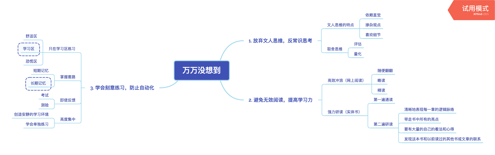

# 万万没想到

## 关于作者
本书的作者**万维钢**是前物理学家、科学作家，毕业于中国科技大学，现为得到专栏《精英日课》全职作者，每天追踪西方精英在经济、社会、科技、管理学等领域的思想新突破，解读英文世界的好书好文、好思想。他的文章充满理性和智慧，经常引发网民热议，成为话题焦点。

## 关于本书
《万万没想到》提倡“用理工科思维理解世界”，以科学的视角解读生活。书中通过严谨的科学实验得到的结论，颠覆了原本存在于常人思维中的错误观念。在颠覆的同时，还提供了获得理性理解世界的方法和技巧，对于我们评判新知识，提升辨别力，具有很强的指导意义。

## 核心内容
这本书中的精彩内容很多，我们从如何改变认知思维提升自己这个角度出发，挑选三个重点内容讲述如何灵活运用理工科思维。这三个内容分别是**放弃文人思维，反常识思考；避免无效阅读，提高学习力；学会刻意练习，防止自动化**。

## 前言
你好，欢迎每天听本书，今天为你解读的是《万万没想到》。这本书的中文版大约是25万字，我会用大约23分钟的时间为你讲述书中的精髓：怎样用理工科思维提升自己。

生活中，很多人都有这样的疑问：同样的环境、相似的能力、一样的努力，但为什么别人能成功，而我不能呢？难道是自己不够努力，或者努力得不够吗？其实不成功的理由并不是因为不够努力，而是没有掌握适当的方式方法。**没有技巧的努力是一种无效的努力，也并不能带给你更多的成功**。你需要的，是一种全新的思维和实用的方法。今天我们讲的《万万没想到》这本书，就教给了我们一种科学有效的思维方式。

这本书倡导用理工科的思维理解世界，以科学的视角解读生活，并为人们提供了提升自己的新方法。作者万维钢是前物理学家、科学作家，毕业于中国科技大学，现在是得到专栏《精英日课》全职作者。《万万没想到》这本书正是精选了万维钢的部分文章和书评，对如何理解和运用理工科思维进行了解读和诠释。

介绍完这本书的基本情况和作者概况，那么下面，我就为你来详细讲述书中的内容。这本书中的精彩内容很多，今天我们从如何改变认知思维提升自己这个角度出发，挑选三个重点内容为你解读。这三个内容分别是放弃文人思维，反常识思考；避免无效阅读，提高学习力；学会刻意练习，防止自动化。

## 第一部分
我们就先来看看第一个重点内容：**放弃文人思维，反常识思考**。

首先，什么是文人思维？这是本书中提到的一个概念。文人思维是一种带有主观性的原始思维，倾向于用感性的思维去理解世界、解释问题，而理工科思维则可以通过评估、量化进行反常识思考，从而得出理性的结论。

文人思维主要有三大特点，一是依赖直觉，二是掺杂观点，三是喜欢细节。这三个特点也正是文人思维与理工科思维最大的差别所在。

我们先来说第一个特点，**依赖直觉**，这是人类进化的结果。诺贝尔奖得主丹尼尔·卡尼曼在他的名著《思考，快与慢》书中，把人的思维系统分为“系统1”和“系统2”。系统1属于直觉，能够自动运作，能迅速对事物进行分辨；而系统2则不同，是需要我们集中注意力进行的复杂计算。这种机制是人类长期进化的结果。在人类的进化过程中，总会遇到来自外在的风险，比如猛兽、天灾等等，如果大脑还要集中精力进行复杂计算，那么活命的概率就相当低了。而且，思考、计算是需要消耗大量能量的，这对于物质匮乏的智人来说，明显得不偿失。于是，人类便进化出依赖直觉的方法，根据经验，立即决策，做到防患于未然。由于这种思考方式只关注表象，不够严谨，所以得出的结论只能是估计、大约，甚至是经验之谈。

比如说喝酒，很多人都会说天冷喝点白酒暖暖身子。从表面上看，酒后浑身发热，给人一种增加热量的假象。但事实上，酒精在体内分解所产生的热量极小，酒后有发热的感觉是因为酒精能刺激血管扩张，加快新陈代谢，所以给人一种增加了热量的假象。这个时候体内散热加快，如果真正供给热量的糖、脂肪和蛋白质供应不上，就进入寒冷的环境中工作或锻炼，很容易发生伤风、感冒，甚至引发其他疾病。所以，在寒冷状态下的人应多吃含糖、脂肪和蛋白质的食物来增加热量，而不是喝酒。那我们为什么会有喝酒热身的认识呢？这就是因为文人思维在作怪，从事物的表面现象出发，习惯于相信直觉给出的快速答案，因而也容易被直觉误导，犯下错误。理工科思维则不同，它*时时刻刻强调严谨，要求全面地、细致地、客观地考察问题，习惯于靠数据、计算和实证来解决问题*。

文人思维的另一特点是**掺杂观点**。掺杂观点的表现很多，我们选其中一个比较显著的表现来说。比如“确认偏误”？我们用“疑邻盗斧”这个故事来帮助我们来理解这个概念。这个故事是说一个人怀疑邻居偷了自己的斧子，便怎么看怎么像，但找到了斧子后，却怎么看怎么也不像了。由此我们可以看出，确认偏误的错误之处在于，在一开始认定的结果基础上，去寻找的新的证据来证明自己的观点。所以，文人思维有一种先入为主的主观表象，通常把复杂问题简单化，标签化，以为自己找到的那个价值和工具就是解决问题的万能钥匙，事实上却使问题本身更复杂，更混乱。这与理工科思维有着明显的不同，理工科思维根据不同的人、不同的环境应对不同的诉求，并随时根据新情况调整策略。

**喜欢细节**，是文人思维的又一特征。在《万万没想到》这本书中，万维钢称之为“具体思维”。他认为，自古以来至现代社会，人类的活动范围仅限于自己所属的小部落或者小村庄，很多人一生去过的地方也不会超过一天的路程。我们熟悉每一个有可能与之打交道的人，而这些人的总数加起来也不是很多。这种生活模式对大脑的演化产生了巨大的影响。当我们需要做决定的时候，我们考虑的是具体的事、具体的人和他们具体的表情。这就使得长期以来，我们习惯于依赖自己固有的经验，而不会做出理性的分析。比如，我们不会把钱借给一个名声不好的坏人，但我们愿意把钱借给众所周知的好人。

值得注意的是，文人思维喜欢将通过依赖直觉、掺杂观点、喜欢细节得出的结论称之为“常识”，并四处宣扬，用来指导实践。如果你倚仗这些众所周知的常识看待事物，分析问题，就习惯性地进入了一个逻辑陷阱。在这个陷阱中，你会想当然地认为“大家知道并且都认同”的一定是对的，不再试图进行客观地观察和分析，也不再推理和查找问题的另一面，甚至忘记了问一句“为什么”。这个问“为什么”就是反常识思考，对常识进行科学的质疑。这种质疑的方法就是理工科思维，它使我们能够辨别并且灵活地运用常识，突破常规的限制，发现真正的问题。

那么在生活中，我们又该如何训练自己的理工科思维呢？《万万没想到》给我们提供了解决办法：取舍思维。取舍思维英文称为“trade off”，意思就是鱼与熊掌不能兼得，两个好东西我不可能都要，那么我愿意牺牲（off）这个，来换取（trade）那个。这里面包含两个因素，一是评估，二是量化。

先来看评估。要进行取舍思维，首先知道每一个事物的利弊。凡事有利必有弊，而利弊都不是无限大的。文人思维喜欢关注在某个点上。比如在超市买东西，遇到促销的商品，使用文人思维的人就会关注到“便宜”这个点，从而产生购买冲动。特别对于一些自己喜欢的东西，无论付出多少代价也要千方百计买回来。而理工科思维则不同，会通过利弊进行分析，综合考量，然后再做决定。生活中，我们经常会看到“每天只要3元钱，抽油烟机抱回家”之类的广告，诱导消费者购买。这种战略被称为 PAD 战略，英文是 pennies-a-day，翻译过来就是每天一便士。这种战略能够降低消费者对价格的敏感度，诱导消费者对价格作出不合理的评价和判断。对于消费者来说，这就是典型的文人思维在作怪，当我们把价格按日进行比较的时候，就会产生价格便宜的印象，但是如果使用理工科思维进行全面评估，便能够认清事实，避免上当。

再来看量化。决策之前，对目标或任务进行评估，通过量化输入和预计输出，得出量化的分析结果，从而作出理性的决定。这是理性的思考方法，也是科学的决策方法。我们来举个众所周知的例子：田忌赛马。那时候的赛马分为上中下三个等次，而田忌的赛马与齐王相比，每个等次都比齐王同等级的马略逊一筹。以往，田忌总是用同等级的马对阵齐王，结果每次都以大败收场。这时，孙膑出现了。他首先对形势进行了评估，通过考虑双方调整赛马的对阵次序，对结果进行量化思考。双方各有3个等次的赛马，按照排列组合计算，每方都有6种出场顺序。双方合在一起，就有36种出场顺序。而在这36种排序中，田忌有6种组合方式可以获胜。最终，孙膑采取了其中的一种，第一局田忌以牺牲三等劣马的办法，使齐王的一等良马没有发挥出它的最大效能；第二局和第三局，则分别以高等马对阵齐王的下等马，最终取得了整体的胜利，使得自己的局部优势变成了整体优势。这是理性决策的方法，也是量化思考的力量体现。

这就是今天给你讲的第一个内容：放弃文人思维，反常识思考。对于文人思维通过依赖直觉、掺杂观点、喜欢细节得出“常识”，我们要通过理性的评估和量化进行分析，然后做出科学的取舍决策。

## 第二部分
接下来我们再说第二个内容：**避免无效阅读，提高学习力**。

阅读是获取知识的有效途径，但是泛泛而读，只能是蜻蜓点水，无法获得更深刻的知识认知。怎样才能进行科学地阅读，在阅读的精度和深度上有所突破呢？《万万没想到》书中教给我们用理工科思维进行科学阅读的技巧。这两个技巧分别是：**高效冲浪**和**强力研读**。

首先来看*高效冲浪*。顾名思义，高效冲浪是指提高网络阅读的效率和深度。网络信息量大、知识储备丰富，但是也有很多鸡肋信息，鱼目混杂，信息含量不大。如果一条一条地全都看过去，费力费神还得不到真正的知识交付，而且现在网络阅读容易造成读者注意力分散，很难把阅读网页的短期记忆升级为知识。怎样才能改善这一问题？本书借鉴《时代周刊》对新书评价等级的标注方法，提出了由粗到细的精读方法。这个方法包括三个步骤：随便翻翻、略读和精读。

我们先看第一步，随便翻翻。首先把与我们阅读主题相关或相似的文章在浏览器中，用新的标签页一一打开，而且只点不读，直到把所有想看的文章都点过为止。这种做法如同综艺节目的海选环节一样，让每个打开的页面在一起竞争，然后用一个相对比较低的门槛快速淘汰绝大部分候选者。这样，我们就能够直接跳过一些不符合标准的页面，减少时间的浪费。第二步就是略读。针对已经打开的那些通过随便翻翻挑选出来的页面，一条一条地快速浏览其中的内容，一旦看到值得仔细读的内容，就把它临时保存下来，这样就能快速处理掉鸡肋信息，而且还能加深印象。最后一步就是精读。能够到达这一步的文章已经非常少了，每天也只有那么几篇而已。这时我们便可以找空闲时间把他们仔细读完，而且一旦发现内容确实不错，可以使用印象笔记等软件进行在线保存，方便日后查找使用。这种阅读方式能够对阅读内容进行类比、遴选，避免我们浪费时间阅读品质较差的文章。

高效冲浪是提高网上阅读效率的好办法，强力研读则是针对实体书的阅读方法。强力研读的目的在于把书中的精华内容提取出来，进行消化吸收。

怎样进行强力研读呢？方法很简单，就是一本书读两遍，而且最好读完一遍马上再读一遍。其中，第一遍是正常通读，不能追求速度快，慢慢欣赏作者的精妙思想和有趣故事即可。读第二遍的时候，就要尽量避免挨个字读，还要把书中作为例子的故事跳过去。为什么要读两遍？这是因为在第一次读的时候，我们往往会陷入作者的思想之中，没有更多的余地去产生别的想法。只有当你读第二遍的时候，才能对书中的观念拿出自己的想法和理解。简单点说，第一遍读是为了陷进去，第二遍读是为了跳出来。

所以，第二遍才是强力研读的关键。怎样在读第二遍的时候“跳出来”呢？书中给出的答案是做好读书笔记，读一章、记一章笔记，直到读完为止。怎样才算是好的读书笔记呢？在记录的过程中，要牢记好读书笔记的四个要求：一是要清晰地表现每一章的逻辑脉络；二是要带走书中所有的亮点；三是要有大量的自己的看法和心得；四是发现这本书和以前读过的其他书或文章的联系。通过记录读书笔记，我们才会真正理解书中的脉络，领会作者的真实用意，充分消化吸收书中的观点，最终成为我们自己的见解和知识。

这就是今天给你讲的第二个内容：避免无效阅读，提高学习力。好的学习方法能够让人迅速提高知识获取速度，甚至达到事半功倍的效果。高效冲浪和强力研读两种方法对于拓展阅读的深度和效率非常管用。

## 第三部分
上面为你讲述了放弃文人思维、反常识思考以及提高阅读效率、做到会学习两个内容，下面来为你说说最后一个重点：**学会刻意练习，防止自动化**。

为了保持竞争优势，很多人信奉的教条就是练习、练习、再练习，直到练习一万小时，但是这种高强度的重复练习很容易引发一种倾向，那就是行为的“自动化”。这种“自动化”就是一种肌肉记忆，只会在一种情况下发生，那就是在我们把一件事练熟之后。比如开车，不会开车的人需要注意力高度集中，而开熟了的人基本上可以一边打电话一边开，甚至你问他怎么开的，他都说不清楚。

《万万没想到》书中提到过一个例子，中超江苏舜天队前主教练德拉甘曾经在一次记者采访中提到，中国球员只会机械地练习下底传中，结果到了联赛里，很多球员不管队友身边站了多少防守队员，也不往旁边看一眼，直接就按照习惯一踢，传丢一次不算，还会接连犯同样的错误。于是，这种训练足球的办法把运动员给练废了。为什么会发生这种情况？这是因为自动化可以让你待在舒适区，你会待在这个舒适区不思进取。所以，想要把自己变成高手，光知道练习“一万小时”的口号没有任何意义，我们需要的是一种有效训练方法。这种方法就是佛罗里达大学心理学家安德斯·埃里克森提出的“刻意练习”。本书作者万维钢将相关的理论进行了总结，形成以下四条法则：一是只在“学习区”练习；二是掌握套路；三是即时反馈；四是高度集中。

首先来看第一条法则：**只在学习区练习**。什么是学习区呢？心理学家把人的知识和技能分为层层嵌套的三个圆形区域：最里面一层是“舒适区”，是我们已经熟练掌握的各种技能；最外一层是“恐慌区”，是我们暂时无法学会的技能，夹在二者中间的则是“学习区”。需要注意的是，在舒适区做事，叫生活；在学习区做事，才叫练习。舒适区让我们满足于现状，恐慌区则让我们谈虎色变。如果我们止步于舒适区，就无法获得新知识、新技能、新成就；想要获得成功，就要学会挑战自己，离开舒适区，让自己在学习区进行练习，这才是有效的练习、有质量的练习。如果想要做到持续进步，那就强迫自己每天进步一点点，持续在学习区学习、工作。

第二条法则是**掌握套路**。套路是一种结构化、模块化的训练方法，比如下棋用的定式，编程用的固定算法，这些都是套路。普通人与专家的区别也正是套路的掌握和使用上。专家做的事情，就是使用有限的短期工作记忆，去调动自己几乎无限的长期工作记忆。而刻意练习，就是在大脑中建立长期工作记忆的过程。《万万没想到》书中用电脑配件来形容短期记忆和长期记忆的差别。短期记忆类似于电脑的内存，是指人脑在同一时刻能够处理的事情的个数，一般不会超过四个，这跟智商有关系，而且很难通过训练得到提高。长期记忆则不同，类似于计算机硬盘，存储了我们的知识和技能。在大脑里，长期记忆是以神经网络的形式运作，必须通过训练才能存储，而且具有高度的结构性。心理学家把这种结构称为“块”。

比如，一场棋局在普通人眼里就是一些看似杂乱摆放的棋子，而在职业棋手眼里这些棋子却是几个一组分成了很多块的，通过识别这些块，职业棋手可以很容易地记住棋局，甚至同时跟多人对弈盲棋。怎样才能快速掌握套路呢？关键在于把要训练的内容分成有针对性的小块，对每一个小块进行有针对性的重复练习。2011年的 CBA 比赛中，易建联有一个命中率相当高的跳投动作，叫做“金鸡独立”，为他在赛场上获得了更多进球，这个动作就是他有针对性重复训练的结果。

第三条法则是**即时反馈**。即时反馈的优点在于，能够随时确定练习方式的正确性，并及时加以纠正。换句话说，就是最好有个教练能够时时刻刻指出错误。要知道，在有即时反馈的情况下，一个人的进步速度非常之快，而且是实实在在的。如果在看不到结果的情况下进行练习，就等于没有练习：如果只是应付差事，你不但不会变好，而且会对好坏也不再关心。所以，从某种角度看，刻意练习的本质就是以错误为中心的练习。这就跟我们上学考试是一个道理，考试之前我们认为自己学得很好，学习内容都已经掌握了。可是一旦上了考场就发现好多东西自己并不理解，只是处于熟悉的状态，而熟悉并不等于理解。想要真正理解，唯一的办法是考试和测验，考试也是一种反馈，没有测验，你的知识只是幻觉。

美国大学篮球教练约翰·伍登曾经率领球队在12年内10次获得 NCAA 篮球冠军。心理学家在对他的训练课进行全程记录之后找出了他成功训练的秘密，在他给球员下达的2326条指令之中，6.9％是表扬，6.6％是不满，而有75％是纯粹的信息，也就是做什么动作和怎么做。他最常见的办法是三段论：演示一遍正确动作，表现一遍错误动作，再演示一遍正确动作。这样的训练就好比练武功，一招一式都需要有人随时纠正，若不对则马上改，以避免错误动作形成习惯动作。

第四条法则是**高度集中**。高度集中就是要求我们在练习的时候，排除外在干扰，保持高度专注。练习时间的长短并不是最重要的，真正的关键在于是否做到高度集中。如何才能做到高度集中呢？书中提供了两个行之有效的办法。一是创造安静的学习环境。据美国科学家研究得出结论，学生能够取得好成绩的原因在于他是在不受打扰的环境中单独学习。甚至差生在安静的环境中单独学习，成绩也能获得提高。二是学会单独练习。如果和一帮人在一起合练可能很有意思，也相对轻松一些，但是会分散精力，无法做到高度集中，从而在效率上大打折扣。从历史和艺术作品中我们也能看到高度集中的优势，成功的人大多都是通过“闭关修炼”“面壁十年图破壁”进行自己练习而获得成功。

## 总结
这本书就讲到这里，我们来总结一下。我们分享了《万万没想到》这本书中的三个内容：放弃文人思维，反常识思考；避免无效阅读，提高学习力；学会刻意练习，防止自动化。
首先，放弃文人思维，反常识思考。对于文人思维通过依赖直觉、掺杂观点、喜欢细节得出常识，我们要通过理性的评估和量化进行分析，然后作出科学的取舍决策。其次，避免无效阅读，提高学习力。好的学习方法能够让人迅速提高知识获取速度，甚至达到事半功倍的效果。高效冲浪和强力研读两种方法对于拓展阅读的深度和效率非常管用。第三，学会刻意练习，防止自动化。盲目地练习很容易让我们形成自动化的行为习惯，使我们安于现状不思进取，而刻意练习的方法，坚持只在学习区练习、掌握套路、用好即时反馈、保持高度集中，才能够让练习更加有效。

撰写：御风而来
脑图：摩西
转述：顾一菲
