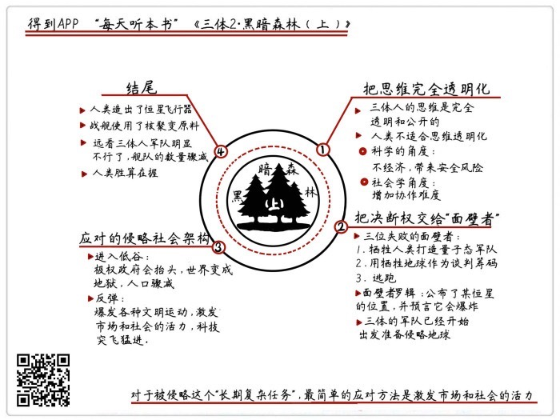
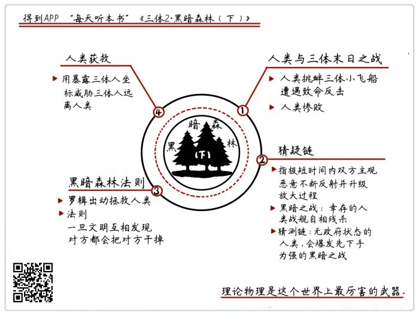

# 《三体Ⅱ：黑暗森林》| 怀沙解读

## 关于作者

刘慈欣，科普作家、高级工程师，被誉为“中国当代科幻第一人”。自上世纪90年代开始，他一边在发电厂担任计算机工程师，一边利用业余时间出版了13本小说集，连续数年获得中国科幻文学最高奖银河奖。2015年，凭《三体》获世界科幻界的最高奖项——世界科幻大会颁发的“雨果奖”，这是亚洲作家第一次获此殊荣。

## 关于本书

《三体》是刘慈欣创作的系列长篇科幻小说，由《三体》、《三体Ⅱ·黑暗森林》、《三体Ⅲ·死神永生》组成，讲述的是一个叫“三体”的外星文明与地球文明交流、搏杀以及各自兴衰的故事。这本书是“三体三部曲”的第二部，人类社会既临三体侵略外患、又陷政治制度内忧，但最终，科技全面勃兴，战舰蓄势待发。

## 核心内容

人类的科技被三体人锁死，行为被三体人监听，人类社会面对严峻的外星人入侵，决定实施“面壁计划”加以抵御。但面壁计划的执行困难重重，人类社会在三体人朝地球行进的日子里，经历了全面的大低谷和大繁荣两个时期，最终恢复信心，准备迎战。

## 前言

你好，欢迎你每天听本书，我是怀沙。我们接着说《三体》系列小说第二部，《黑暗森林》，这一部大概33万字，我们把它分成两段音频来说，现在是上半部分。

我们先来回顾一下《三体》第一部的内容。在离太阳最近的恒星上，有一种叫三体人的外星人。他们的科技领先人类很多，但是他们行星的自然环境特别恶劣，所以打算向地球殖民。三体人朝地球发射了一种叫智子的超级机器人，智子不光能锁死人类的科技，还能实时监控地球人的所有举动。在做好所有准备之后，三体人庞大的舰队杀气腾腾地朝地球出发了，大概在450年之后到达地球。

下面，我们一起进入《三体》系列小说第二部，《黑暗森林》。我们还是用三个思想实验，来概括第二部的内容。

## 上半部分

思想实验1:**如果人类社会变成一个思维完全透明的世界，是好事吗？**

我们先来看，为什么会提出这么一个奇怪的问题。在人类截获的地球叛军和三体人的聊天记录里，有一个重要信息，就是：三体人的思维，是完全透明的。在三体人那，想和说，是一个词儿。一个三体人在想什么，就一边用电磁波向所有三体人发布，每个人都能接收到。每一个三体人，都是一个永远不休息的电台，只要他没睡着，它就不停地用电磁波散播自己的思想过程。所以，三体人就是一个特别直来直去的种族，整个社会没有欺骗，没有虚伪，没有谎言。他们在知道人类竟然能隐藏自己的想法之后，三体人也吓了一跳，说你们太可怕了。

看到这，很多人就提出一个观点，就是三体人的透明思想，是一种更高级的文明架构方式。我们看人类社会，为什么有那么多丑恶现象，大部分都是因为欺骗、谎言，还有阴谋。甚至有人说，为什么是三体人欺负我们，不是我们欺负三体人，就是我们地球人还在使用这种人心隔肚皮的、落后的沟通方式。这个观点得到了不少人的支持，加上《三体》这本书在创投圈也很出名，很多企业就学会了，说我们要做一个内部信息完全透明的公司。

那我们就接着《三体》提出的概念，来试着推演一下，如果人类社会也变成一个思维完全透明的世界，所有真实的想法和信息都共享，是不是对人类有好处呢？对于这个实验，我们试着从科学和社会学的两个角度来分析。

首先，在科学的角度来说，我们可以给这个生理特点起个名字，叫——被动性全时段内心独白。这个技能肯定不利于人类。因为这么做非常不经济，要知道向外发出信息，是非常消耗能量的。你想，我们平时连续说一小时话都累，那如果一种生物，不停地向外发射电磁波，这个生物要吃多少东西，才能供养得起这么一个奢侈而又没用的行为。而且长期发射电磁波，会给个体带来很大的危险。比如说一个狙击手，要是这么老发电磁波，那就难以隐蔽。这是对个体不利的地方。

对于整个种群来说，如果每个个体都是这种话痨型的人格，每个人都是絮絮叨叨的，那这个种群筛选有价值信息的成本也变得剧高，会很大地降低种群的沟通效率，这肯定不是好事。所以，被动性全时段内心独白，这个技能从生物属性上看，是又耗能，又添乱。

接下来，我们从社会学来看。答案也是，对人类社会应该不是好事，因为它让人类协作的难度大大增加了。思维太透明了，什么话都直说，人类的很多协作不容易开展。举个例子，比如说谈恋爱，爱情其实也是一种协作，很多时候，很多爱情的开始，双方都没想得太清楚，但走着走着，感情越来越好，最后也是一辈子，挺好，也很有幸福感。但什么都直白了好吗？一个女孩说，我就是图你的钱，一个男孩说，我就是对你有生理需求，很多人是受不了的。结果就是大量的人注定孤寂一生。不光是爱情，我们的企业文化也一样，我们要给员工一个温暖振奋的目标，这样每个人上班的时候心情很好。因为我有好心情，协作效率就很高，最后就能成事。但如果什么都直说，那就没有人有梦想了，可能干劲一下就没了，那这对谁有好处呢？

说得再大一点，越是要把人类聚合成一个团结的组织，一个国家，一个民族，就越是需要一个又虚又大的共同目标。比如说我们要建立一个伟大的国家，但你能保证每个人都是真为了这个目标吗？有的人可能是真为了这个，有的人可能就是想多赚点钱，但是不要紧，没有必要分得那么清楚，只要能拢住更多的人一起往前走，就是有利于这个目标的实现的啊。所以，我们推理下来的结论是，三体人这种啥都透明的沟通方式，可能在三体行星的特殊的环境下，是可行的，但应该是不适合人类的。那我们不能一边享受着信息不透明的高效，同时又要求规避信息透明的缺点，那这就是求全责备了。

那做了这个思想实验之后，我们的收获是什么呢？它能让我们以后再碰到隐瞒、谎言、阴谋的时候，观点不那么简单。你也可能面对一些必要的隐瞒，一些白色灰色的谎言，甚至还有一定程度上的套路，你会是一个宽容的态度。这是我们的第一个思想实验，关于思维完全透明的社会。

下边我们回到小说里，接着讲故事。

思想实验2：**如果真有外星人入侵，我们应该把决断权交给谁？**

我们之前说了，三体人派了一个叫智子的机器人，任何时候都在监视人类。但智子唯一不能监视的，就是人类的思维。所以，针对这个特点，人类制定了“面壁者”计划。面壁者计划，说得简单点，就是打造人类有史以来最大的四个骗子。

先挑选出四个人类精英，给你最大的权力，你们说什么，人类就干什么。但是，你的所有动作都是为了演戏，演给智子和三体人看的。真实目的，你谁也别说，只有你自己心里知道，要把全人类也都骗过去，最后用一种所有人都想不到的方法把三体人打败。四个面壁者很快选出来了，前面三个面壁者都是牛人，都是非常成功的政治家，而且这三位拿出来的计划都非常狠，但是最后都失败了。只有第4个人没有失败，第4个人就是罗辑，也就是我们之前说过的，三体人唯一害怕的人。罗辑没失败的原因是，他根本没拿出任何计划。

我们先来看一下，前两个面壁者的计划是什么，还有是怎么失败的，这和我们这个段落提出的问题有直接关系。第一位面壁者，是美国前国防部部长。这个人很高大上，他用的战略也很高大上，他的计划是，用量子幽灵部队，去和三体人战斗。解释一下量子幽灵部队，这是一种小说里想象出来的武器。简单说，就是先用一种叫“球形闪电”的武器，攻击人类自己的军队，那人类的军队有可能会被打成量子态。量子态就可以理解成，一个人既在这里，也在那里，既是死亡的，也是活着的，所以，一个量子态的军队，就有点像一支死不了的幽灵部队。那这就很无敌了，大概就是这个意思吧。

客观地说，这个计划是值得一试的。因为打三体人，人类的常规军是一点用都没有的，那还真不如赌一把，万一真有量子态的军队呢，还真的可能有得一打。但很遗憾，这个计划被三体人识破了，三体人的应对办法非常简单，就是直接把这个计划给公布在互联网上了。公布之后，广大不明真相的民众就马上来围观，围观之后就是舆论哗然。反对的声音非常大，大家就说，啊，闹了半天你就是耗子扛枪窝里横啊，打自己人？亏你想得出来，那万一这些人没被打成量子态，就是直接被你真打死了呢？你就是这么拿我们的士兵当小白鼠的吗？反正就是一通质问。

国防部长赶紧出来解释，说我这不还执行呢吗，我就是这么想来着。再说啦，不是说好了，让我当面壁者，就都听我的吗？但人类作为一个群体，就根本不和他进行理性的对话，只是发情绪。因为社会舆论的压力实在太大，人类高层也出来干涉了，说，不行，要不你还是别这么弄了，不然我们的权力基础都不稳了。结果是，在强大的舆论高压下，国防部长最后开枪自杀了。当然他这个自杀的做法也很笨，等于是完全认输了。第一位面壁者，就这么报销了。

第二位面壁者是委内瑞拉总统。他的真实计划是，在水星背对太阳的那一侧，放很多颗氢弹。如果要是引爆这些氢弹呢，就能把水星炸得脱离自己的轨道，最后掉到太阳里去。然后在太阳肚子里就会发生各种链式反应，最后的结果是，地球也会被卷进去。所以，说白了，这个战术不是打三体人的，而是一个要挟性战术，只要你敢过来，我就炸水星，那地球也完蛋了。

这个计划，其实也是非常可行的。这个战术的逻辑就是，我是打不过你，但只要我有毁掉你想要的东西的能力，那我就有谈判筹码。经济学家诺斯说过一句话，一个系统里制度的建立，不是由双方的强弱关系来决定的，而是双方的谈判能力来决定的。而这个计划，就是为了拿到谈判的筹码。

但是，三体人把这个计划也识破了，而且三体人还是老办法，就是把你的计划公布到网上了。和上一次一模一样，老百姓又不干了，说，啊？这三体人还没看着一个呢，听说要先把太阳给炸了？太阳炸了，我们还能活的了吗？这次又是民意汹汹，结果，委内瑞拉总统在一次刚下飞机的时候，被一群愤怒的民众一拥而上，直接给打死了。等于说，这两个面壁者的失败，完全是因为民众的反对。说到这，我们要看一下我们这个思想实验的题干。

面对外星人的入侵，我们应该对普通大众信息透明吗？按照小说的情节看，作者给的答案可能还真是否定的。前两个面壁者的计划，可以说在这样一个烂局势下，几乎是最好的方案了。但只要让普通民众知道了你的计划，就可能有各种不理性的理由反对你，而且只要形成了一股民意汹汹的舆论，你的事情就办不成了。这股民意，它也不负责解决问题，它就只负责反对。至于什么办法行，那我不知道，我又不是政治家，你们再想别的办法。也就是因为三体人也明白这一点，他们的应对才那么简单，就利用你们人类内部的不团结就够了。

那我们再问一句，面对外星人的入侵，可能正确的方法是什么呢？还真的只能是把决定权交给少数人，给他极大的权力，天下一盘棋。再说得残酷一些，这个人甚至要决定哪些人能活，哪些人必须牺牲，在面对外星人入侵的时候，可能只有这样。那这个思想实验给我们的收获是什么呢？但愿我们不会真的遇到外星人入侵这种事啊，那在平时的生活里，如果一件事情，你根本就没什么信息量，对这个事情也根本没有经验，那可能你最正确的决定就是：相信那些信息比你完备，并且和你在一条船上的聪明人。请注意，这个人是不是和你在一条船上，这点非常重要。

这是第5个思想实验，面对像外星的入侵这样的大事，我们该怎么做科学决策。

下面先不说思想实验，接着把另外两个面壁者的故事说完。第三个面壁者，是欧盟主席，他拿出的计划叫——思维钢印。他的表面上的计划呢，是要研发一种叫思维钢印的机器，这种机器可以在人的大脑里强制性地输入观念。他是要给人类士兵都输入一个信念，就是：“在对三体的战争里，人类必胜”。那这么一来，就能得到一群魂斗罗一样的战士。当然，这只是幌子，其实他的真实计划是，在输入信念的时候，偷偷往思想代码里加一个负号，这样一来结果就是完全反了，就从人类绝对能够胜利，变成人类绝对会失败了。

说白了，欧盟主席的计划是一个怎么留住火种的计划。因为他认为，人类肯定是打不过的，与其这么拿鸡蛋碰石头，还不如像武侠小说里说的，保住“少林一脉”。这个计划，能确保无论到什么时候都有一群一心只想着逃跑的人。这个计划倒是成功了，但是三体人也不在乎你是不是留住了少林一脉。所以也懒得管他。这就是前面三位面壁者的情况。

说到这，我们要总结一下，其实这三个计划如果同时实施的话，还真的是很厉害的。我们看这里面，第一个是负责打的，第二是负责谈的，第三个是负责跑的。同时实施，鸡蛋放三个篮子里，每个都值得奋力一搏。那我们来看看第四位面壁者，也就是第二部小说的主人公罗辑。罗辑就是普通人一个，我们前面说了，他能当上面壁者，因为他是唯一一个三体人希望除掉的人。三体人谁也不怕，只怕罗辑。但是为什么，没有人知道。

只有一个可能的原因，就是罗辑是叶文洁女儿的高中同学，所以借着这个关系呢，罗辑曾经见过叶文洁一面。那次俩人见面一共就聊了半小时，但说了什么，人类不方便问，因为智子都听着呢，所以，人类就希望，但愿是什么特别厉害的信息吧，所以就让罗辑当了面壁者。这天，罗辑终于干了一个看起来像面壁者该干的事儿。

他让人类公布了一个宇宙里恒星系的位置，公布的方式是，公布了这颗恒星和其他恒星系的相对位置，比如，离A恒星多远，B恒星多远，如果有一个高级文明拥有宇宙三维立体全景图，就可以用这些信息到全景图里去进行大数据的匹配，就能筛选出这组信息说的是哪个恒星系。发完这个信息之后，罗辑预测说，这个恒星星系在未来会遭到毁灭性的打击。虽然所有人都觉得莫名其妙，但还是照着做了。罗辑干完这件事，就说他没啥要做的了，他要申请冬眠了。当时人类掌握了冬眠技术，罗辑说那个恒星什么时候爆炸了，什么时候叫他，然后就睡觉了。上面就是四个面壁者的情况。

在罗辑冬眠之前，人类又收到了一个大大的坏消息。哈勃望远镜在宇宙里，看见了三体人的舰队。在太阳系和三体人的恒星系之间，有一片星际尘埃带，这个星际尘埃带里突然出现了1000多条整整齐齐的飞船尾迹，就像人在雪地里走过留下的脚印一样。这下，三体人是千真万确地来了。人类就是这种眼见为实的性格，这下民众的反应就完全不一样了，政治格局一下子又紧张起来了。

接下来，我们就进入下一个思想实验。

思想实验3：**如果面对外星人的侵略，我们应该采取什么样的社会架构来应对？**

我们先来看小说里的故事是怎么发展的。看见三体人来了，这是一个非常重要的背景，因为社会一下达成了共识，现在不是你们科学家在预言了，而是真的来了。而且这次的外敌入侵和之前的全不一样，这个侵略者占领地球之后，是不会和我们发生民族融合的，人类就死定了。一旦形成共识，就会导出一个结果，就是极权政府会抬头。结果，整个世界进入了一次极权政府回归的潮流。

在文化上，政府开始管控文化。在经济上，就会开始推行平均主义，放弃自然经济，最后干脆使用配给制，粮食、物资全都由政府配给。结果，这样的政治体制和经济政策，带来一个结果，就是三体人还没来呢，人类社会自己先崩溃了。人类进入了一个叫大低谷的时代，先是经济崩溃了，各地银行出现挤兑潮，后来很多国家的政府宣布破产，结果一发不可收拾，各地进入无政府状态了。你看，人类本来是想振奋一下，往高处蹦一下，结果反而是一头栽倒在地上了。人类进入了一个从来没有过的黑暗时期，整整50年，地球变成了地狱，到处都是人吃人，暴徒横行，世界人口从83亿降到了35亿，死了50亿人啊。

这是这个思想实验的前半段，等于小说又在虚拟的情节里，把破坏自然经济的可怕后果又给我们演练了一遍。其实，这种亏人类吃得不少了，这个道理早就想明白了。当然这次也是情有可原，这不是外星人要来嘛，算是特殊情况吧，所以一时糊涂又给忘了。作者在小说里，讲述了一个可怕的故事，给我们又提了一次醒。

那我们再来看看这个思想实验的下半段，在大低谷的尾声，也就是2080年左右，人类世界开始触底反弹了，爆发了第二次启蒙运动，第二次文艺复兴。人类就是这样，经历了苦难之后，会出现一大拨哲人，进行一大拨反省。这次人类提出了一句掷地有声的口号，叫：“给岁月以文明，而不是给文明以岁月。”大概的意思是，宁可像一个人一样被三体人灭掉，也不能像蚂蚁一样赖活着。要是不文明，再有岁月也没意义，就是活得再长也没意义。

人类想明白这些之后，各国也都不搞集中生产了，也不教民众怎么做人了，每个人的心情都是，别跟我说什么战胜三体人，什么远大理想，别跟我扯这些，我们就想过好眼前的小日子，穿西装，看手表，文明一秒是一秒。

没想到，因为个体的解放，自由交易的恢复，整个社会的活力反而给调动起来了，全世界的经济也振兴了。经济一好，各种科技水准也追上来了。当然，智子还在上面封着人类理论物理的天花板，但是不影响各种应用技术突飞猛进。在接下来的这100年时间里，人类的文明蹭地一下就又站起来了，而且还反超了之前的科技水平。那这时候人类的信心就又回来了，说哎，我们本来是想最后过一段快乐文明日子的，现在反而更厉害了。那我们是不是应该研发一下战舰呢，试着打一打呢？结果，人类这一研究，就彻底厉害了，反而有了捍卫地球的信心了。关于人类的武器怎么厉害，等一会我们再说。我们先来看一下人类的这次经济和科技的振兴。其实也很好理解，政治上松绑，自然给经济释放了活力，经济繁荣之后，科技当然也就突飞猛进了。

这个段落，小说带着我们来了一次大畅想，这是一个涉及政治学、社会学和经济学的大型思想实验。我们来看，这段人类的历史一共180年，分成两块，前80年和后100年。前80年，人类主观上想富国强兵，但是结果反而是民穷财尽。后100年呢，人类在主观上是想顺其自然，结果反而是富国强兵了。这个事怎么和我们的直觉这么相反呢？

其实，这个事情的主要问题，就出在外星人降临地球的时间上。我们来做一个假设，如果三体人到达地球的时间不是400年，而是4年，那之前人类的做法可能情有可原，比如经济上施行配给制，军事上甚至强征公民入伍。当然可能结果还是打不赢，这么做是在短期内，能快速提升人类这个种族的战斗力的。因为在4年内迎战敌人，这个任务是一个“短期单一任务”，通过这样的社会资源配给方式，就可以最快地实现，而且会非常有效。

但是，如果任务是在400年的时间里，实现富国强兵，打败一个我们还没见过的敌人。那这就是一个标准的“长期复杂任务”，那怎么应对这种任务呢？其实还是那个最简单的方法——激发市场和社会的活力。目前人类找到的有效方式，就是让每一个人类个体自由地表达天性，想唱歌的唱歌，想娱乐的娱乐，把每个人的需求都卷入到社会协作里，这个社会才可能有科技上的创新。举个例子，怎么能造出更好的战舰，不是让每一个人去做科研，而是尊重每个人的需求，只有每个人都想要一台更薄更时尚的手机的时候，商人们才有动力去生产更薄的芯片，那我们的宇宙飞船才能用上更薄的，经过市场检验的好芯片。这个做法可能在一开始是有点反直觉的。但在小说里，我们看到，就是因为人类先用生理反应代替了理性选择，才绕了那么大一个弯路的。

所以，我们第6个思想实验，如果面对外星人的侵略，我们应该采取什么样的社会架构来应对？小说里给的回答是，这个问题不好说，我必须反问一个问题，这个外星人到底什么时候来呢？

## 总结

下面我们回到小说里去。人类经过了这次波折之后，反而变得厉害了。下面在我们这个音频的最后，我们就来看一下，人类战舰有多厉害。

人类的主战武器，叫恒星级飞船，是一种可以进行星际航行的超级战舰，长度大概是几百米，每艘战舰有2000多名船员，飞船可以以15%的光速前进，这个速度是超过了三体人的舰队的。人类战舰使用核聚变原料，总部在人类木星基地，舰队的机动性很强，完全可以驶出太阳系，到外层空间里截击三体舰队。恒星级战舰有可怕的破坏力。 这种恒星级战舰，已经服役的有2175艘，人类还在继续生产。而且，再反观三体人那边，明显已经不行了。人类一直在监视三体舰队，发现他们在穿过下一片星云物质的时候，舰队的数量已经从1000艘下降到300艘左右了，而且舰队的队形非常零散，非常混乱。这支破败的舰队将在200年后到达地球，如果它们还敢来的话，一定是来挨揍的。

说到这，《三体2·黑暗森林》的上半部分，就给你说完了。在下面的音频里，三体世界的一支小分队将光临太阳系，双方将发生第一次交战。

## 下半部分

你好，欢迎回来，我们接着说《三体》系列小说第二部，《黑暗森林》的下半部分。前面我们说到，人类在经过了一轮大低谷之后，迎来了一次大繁荣，人类造出了实力超强的星际舰队。而三体人那边，在长途星际航行里，自己就损失惨重了，现在已经只剩三分之一的舰队了，所以人类认为这场星际战争，是赢定了。

我们还是用三个思想实验来概括我们的整个音频。在进入这个音频的三个思想实验之前，我们来一段轻松的段落，我们来看看在小说里，人类繁荣强盛的未来是啥样子。

让世界发生重大改变的，主要是两个核心技术，一个是基因改造技术，一个是可控核聚变技术。首先，可控核聚变技术，使得能源就彻底不是问题了。人类说了几百年的省水、省电，全都彻底被淘汰了。电变成最不缺的东西了，在未来，电源就像是现在的 wif i信号一样，是无线充电的，只要电器进入电场马上就能供电。基因改造技术越来越强大，所有人类需要的粮食和经济作物，全是从工厂里生产出来的。人类给植物提供最强的全光谱的照明，超级基因水稻，在强烈的阳光照耀下，一礼拜就收一季。人类就彻底消灭了饥饿。

不需要开采石油了，不需开采矿产了，也不需要种粮食和作物了。人类也就不需要土地了，一些人类你争我夺了几百年的地方，突然就没人要了。传统意义上的地理因素变得越来越不重要，原来的传统国家也衰败了。世界政治格局里，兴起了一种新的政治实体，叫做舰队。舰队集中了最多的资源，最优秀的人才和最独立的观念，已经具备了一个国家的所有要素。国家本来就是一个想象中的共同体，所以舰队纷纷独立，三大舰队独立成了不同的国家。

上面就是人类在22世纪大致的情况。当时的人类，经济繁荣，军事强大，民众充满了必胜的信念。但是，事实真的像人类想象的这样，三体人已经完全不行了，就是来送死的吗？接下来，我们就要进入最惊心动魄的一个段落，来看看人类和三体人的第一次交战。这个段落，我们还是用一个思想实验的问题来概括。

思想实验1：**如果在理论物理水平上有差距的两个文明作战，会出现什么样的情景？**

可能听完这个题目，你已经觉得人类凶多吉少了。其实在小说的情节设定里，人类自己也把人品差不多败光了。人类做了两件特别自大、特别败人品的事情：第一件事，是人类发现三体人派了一艘速度特别快的小飞船来太阳系，这艘小飞船赶在三体人的大部队之前，马上就到太阳系了。人类呢，就非得认为人家是来找人类谈判或者投降的，这是第一，非常自大。

第二，人类为了炫耀武力，也是为了振奋士气吧，决定派2015艘人类战舰全部出发到太阳系的边缘，去截击这一艘三体人的小飞船。舰队出发的那天，2000多艘战舰组成了一个长方形的阵列，一起从木星基地起航，像一堵巨墙一样，向太空深处推进，去消灭一个压抑了我们整整两个世纪的敌人。地球上的人类，集体收看了舰队出发的直播画面，想起人类过去历经过的苦难，人类的情绪在这个点上一下子爆发出来了，很多人激动得嚎啕大哭，每一个人都因为自己是人类而感到无比自豪。没错，这次流着泪的目送，也成为诀别，等着人类的是一场惨败，而且是前所未有的惨败。

2000多艘恒星级战舰，在海王星轨道和三体人的小飞船相遇了。这是人类第一次看见来自三体世界的物质，这个三体探测器只有一辆卡车那么大，形状和一滴水滴一模一样，一头是圆的，另一头是尖的。尖头是尾巴，尾巴上有一个喷射口，圆的那头是脑袋。整个水滴表面非常光滑，就像一面镜子一样。在看见了人类舰队之后，水滴就不往前飞了，停在空间里，一副俯首称臣的样子。

人类也派了一艘小型飞船飞向水滴，水滴就原地静静等着，一动不动。人类的飞船飞到水滴跟前了，发现水滴也不说话，也不做任何动作，人类就给水滴做了一个简单的体检，量一量长宽高啊什么的，但在测量水滴的物质构成的时候，得到了一个惊人的结论，人类发现水滴表面的物质，就算把显微镜放大到一千万倍，显示的还是光滑的镜面，没有任何细微的分子构造。一下人就吓傻了，这就说明水滴的硬度是难以想象的。

突然，水滴的尾巴亮了，唰地一下就启动了，开始加速冲向人类舰队。只用了十几秒就杀到人类战舰跟前，因为水滴在雷达里是隐身的，所以人类战舰还啥也不知道呢。谁也没想到，水滴的攻击方式就是撞，就是跟你肉搏。它冲到第一艘人类战舰跟前，就直接从这艘战舰中间穿过去了，就跟穿过一块豆腐一样，而且穿过的位置正好是飞船的燃料舱，说明水滴不是乱撞的，它其实啥都懂。这艘战舰马上变成了一块通红的金属，因为穿过的一瞬间产生了巨大的热量，然后过了几秒，飞船开始大爆炸。

人类就有点蒙了，先是发现水滴没了，但是突然就有飞船爆炸。而且爆炸是一艘接一艘，水滴就开始继续穿越其他战舰。因为人类战舰跟麻将牌一样，整整齐齐这么摆着，水滴就这么一个一个穿，太方便了，连弯儿都不用拐，一秒一个。每一次都是精准地从战舰的燃料舱穿过。一分十八秒之后，整个人类舰队方阵第一列的100艘战舰全开始爆炸。各种飞船碎片朝其他战舰飞过去。

这时候，还活着的战舰的近战武器全部开火了，因为有各种碎片飞过来嘛，必须截击，就在第一和第二两个队列之间形成了一片炮火的屏障。船员都非常紧张，知道战舰在激烈地和什么东西驳火，但是对手是谁，大家完全不清楚。这时候，真正的死神水滴，已经飞到第二列舰队的身后了。根据事后的录像，水滴做了一个可怕的锐角调头，就是一瞬间拐了一个胳膊肘弯儿，突然转向170度，这个调头过程没有减速的，这一个动作人类就看傻了，完全超出了人类对物理学的理解。然后，水滴开始用它那个圆脑袋穿第二列的人类战舰。

1分20秒之后，人类的第二队列的100艘战舰全被穿过了，像一串鞭炮一样，开始爆炸。水滴再调头，开始穿第三队列的战舰。这时，人类舰队开始感觉不对，开始散开阵型，想要离开战场，但水滴也马上提速，第三排人类舰队也被穿过了。

这时候，第一艘人类战舰终于发现水滴了，朝水滴打出了人类反抗的第一枪，用的是高能伽马激光，打中了，但是水过鸭背，一点用也没有。另一艘战舰，用电磁轨道炮开火打中了水滴，就是用纯金属炮弹打中水滴了，水滴在被打中的那一下速度稍微慢了一点点，但是水滴马上感觉到了，它调整了一下推进力，马上恢复了速度。水滴那个圆圆的脑袋，一点也没受伤。它继续追杀人类，这个时候人类的战舰已经散得比较开了，但水滴在继续追杀人类战舰的时候，完美解决了所谓邮差问题，就是它选择的全是最佳路线，一点冤枉路也没走。

整个战斗持续了50分钟，人类一共打中水滴两次，唯一的战果，就是曾经在几秒钟的时间里改变了水滴的速度。人类的2000多艘战舰，除了7艘成功逃跑之外，剩下全部葬身火海。这一场战役，被人类称为末日之战。消灭人类所有战舰的，就是三体世界的一个小小探测器。那些还在半路上的三体人的大战舰，体积是水滴的几万倍，它们强大到什么程度，人类根本不能想象。这场仗是没法打了。人类100年的荣光和自信，被短短的50分钟完全打碎。

这个时候，让我们从小说里跳出来。让我们回到这个思想实验的题目，有科学层级差距的文明相互交战的结果是什么。结果就是，根本不可能打得有来有往，肯定是完全还不上手。人类这个时候才明白，这个世界上最狠的武器，其实是理论物理。这时候，我们再回头看三体人之前的智子封锁计划，可以说完美生效了。人类所有飞船的这些什么高速度啊，强火力啊，用四个字来概括，就是——奇技淫巧，这些应用技术根本没有用。而水滴的速度也不算快啊，和人类战舰差不多，而且战斗技巧可以说是冷兵器阶段，就是撞，只不过人家是用放大一千万倍之后还是光滑无缝隙的圆脑袋撞。对物质本质的理解，对粒子性质的分析，这才是根本的问题。

那这一个段落，给我们的收获非常简单，就是：如果你想在宇宙里和人打架的话，没啥不能没知识，没啥知识不能没有物理知识。还有，对于那些在物理层面你并不了解的事物，我们最好还是带着深深的畏惧。这就是我们的第一个思想实验。

上面就是末日之战，如果说末日之战把人类的所有荣光都打碎了，紧接着的一场战斗，就把人性最黑暗的一面暴露出来了。这场战斗叫做黑暗之战。下面我们进入第二思想实验。

思想实验2：**什么是猜疑链？**

在末日之战里，一共有7艘人类的战舰逃出来了。有之前没有参战的，也有趁乱逃出来的，这7艘战舰分成了两拨，一拨是5艘，朝太阳系的一个方向飞，另外2艘朝另外一个方向飞。黑暗之战就是在这7艘人类战舰之间爆发的。这7艘战舰知道，自己肯定是不能回太阳系了，因为你是军事目标，水滴第一个消灭你，而且地球呢，估计也早晚属于三体人了。所以眼前唯一的选择，就是到太空里找一个新的行星扎根。这个未来听上去太渺茫了，但这是唯一的办法了。

到宇宙里去安家，这个任务一设定，就马上出现了一个问题，燃料和飞船配件够不够。那马上又出现一个特别邪恶，但是谁都会想到的办法，就是我可以从其他的飞船那抢，所有飞船的型号都是一样的，燃料和配件都通用。但是，这个想法可能刚一升起来，马上就会被人的良知给压下去，因为这太反人性了，要是舰长下令杀害自己的同胞，以后他还怎么和整船的部下相处呢？但是，这里又有一个转折，只要是聪明人，他就会想，我只敢保证自己有良知，我怎么敢保证对方有良知呢？万一他突然下黑手了呢？那我是不是该做点什么。

你看，这么一考虑问题，就从原来的我先动手的那种错事，变成一种特别理直气壮的主动自卫了。同时，这又产生了一个新的推论，就是对方也明白这个道理吧，那他是不是也可能主动自卫啊，那我更应该自卫了吧。所以就变成，我必须干掉他了。这又升级了，但这个互相猜疑的链条还没有中断，对方也明白这个啊，那我就还得升级，变成干掉对方慢了都不行。

所以，这种主观恶意是不断在两边反射，而升级的过程。整个过程，从开始思考到想明白动手，聪明人可能一分钟都不用。这个就叫猜疑链，也是《三体》小说里原创的概念。意思就是两个原来并没有主观恶意的个体，只要有一方在想象里出现了一个小恶意，那就会被猜疑链快速放大。这个放大过程只有一个办法中断，就是某一方死了。打个比方，你马上就明白了，在生活里，如果你拿一个麦克风，把它对着播这个麦克风声音的喇叭的话，马上就会发出非常刺耳的噪音。这个在物理学上叫自激。自激和猜疑链的道理是一样的，一个最小的声音，进入这种像链条一样可以来回反射的机制里，就会变成巨大的噪音。

那我们回到小说里。我们看，这些战舰之间有微小的主观恶意吗？有，太有了。谁都想到了将来我的燃料和配件不够用，我可能需要抢。所以，一场自相残杀的战斗在人类战舰之间爆发了。战斗的结果是，远在太阳系两端的两拨人类战舰，最后都只有一艘活下来了。两艘战舰都装满了燃料和补给，各自朝太阳系外飞走了。这场自相残杀的战斗，就是黑暗之战。

这就是刘慈欣给我们模拟的一个非常揭示人性的思想实验。也让我们知道了这个叫“猜疑链”的概念。那我们看完这么可怕的情节之后，收获是什么呢？是小说在告诉我们，以后遇到这种情况，下手要快吗？当然不是，这个思想实验最大的目的，应该是告诉我们，建构一个有规则和执法者的世界有多重要。

其实在黑暗之战里，战舰在攻击之前，是算了一笔经济账的，我只需要付出一个导弹的代价，就能换取我的绝对安全，那这个性价比太高了，谁不干呢？但如果有明确的社会规则和一个强大的执法者在，那我付出的代价就是一个导弹，外加我会接受的惩罚。那每个人在动手之前，就都会过一下脑子了。那这种快速升级的恐惧导致的攻击就会被阻挡。所以说，我们得到一个结论，就是在无政府的状态下，就更容易出现这样的黑暗之战。

小说在这里安排这样的情节，是和后面的情节完美衔接的。因为如果我们继续追问一句，无政府状态的人类，会爆发先下手为强的黑暗之战，那无政府状态下的宇宙，会不会也是一样的道理呢？这个思路，就是我们的下一个思想实验，也是《三体2》这部小说最核心的一个大梗——宇宙的黑暗森林法则。增加了“猜疑链”的思想实验，和后面的内容也有机地联系起来了。

思想实验3：**宇宙里的黑暗森林法则。**

经过了末日之后，人类一下子就被打颓了，主要是精神崩溃了，各地的教堂和庙宇全都爆满。追求不了太阳系的和平，就追求一下内心的和平吧。这时候，一个人类的高官员突然找到罗辑，非常郑重地对罗辑说：罗辑先生，我们刚刚决定，恢复你的面壁者的身份。这里说一下，罗辑之前一直在冬眠状态，在末日之战之前他被叫醒了，因为当时人类觉得自己这么厉害，就把面壁者计划取消了。罗辑就成了一个普通的人，他也混在人堆里，看见了末日之战的可怕结果。

罗辑就问，你怎么又想起我来了？那位人类官员就说，因为我们注意到，之前被你公布的那个恒星系，被一种神秘力量毁掉了。我们人类也不知道你是怎么做到的，但你不用向我们解释，总之，现在人类全听你的了。罗辑的眼睛一下就亮了，这说明他的理论是正确的，那他就还有拯救地球的机会。

小说进行到这里，算是亮出了这部小说的核心大梗，也是《三体2》的标题：黑暗森林。也就是罗辑根据叶文洁跟他说的话，推导出的宇宙的规律，也正是这个宇宙规律，把人类救了。我们前面说过，叶文洁和罗辑见过一次面，对罗辑说了几句听不懂的话。叶文洁当时是这么说的：“小罗，我跟你说些想法，我担心没有机会了……你就当我随便说说，不管是哪种情况，我都尽了责任。”

你听，聪明人一听就知道这话不一般，因为说这话的是把整个地球都坑了的叶文洁啊。接下来，叶文洁就对罗辑说了四个概念，分别是两个公理和两个定义：

公理一：**生存是文明的第一需要**。

公理二：**文明不断增长和扩张，但宇宙中的物质总量保持不变**。

两个重要概念是：

第一，猜疑链。就是我们刚才说的概念。

第二，技术爆炸。

第一遍听的时候罗辑没听懂。但罗辑牢牢记住了，后来他就一直琢磨，他慢慢明白了，叶文洁说的那四个概念，是可以连成一句话的。首先，公理一，宇宙的总物质不变。这是啥意思？换句话说，整个宇宙就是一个零和博弈，谁也不能给宇宙的物质带来新增流量。所以说，你多一点，我就少一点，所以每个文明必须厮杀。

公理二，生存是每个文明的第一需要。任何一个文明的首要目标，都是为了延续自己的种族，而交流不是，所以为了生存，是可以放弃交流的。

下面，两个概念，技术爆炸。这个词的意思是，因为宇宙星际间的距离实在太遥远了，导致一个结果，就是当你在赶路的过程里，对方可能会一瞬间变得无比强大。人类就是一个很好的科技爆炸的例子，要不是人类被智子封住了，那人类科技发展的速度，简直就可以用爆炸来形容。

第四，猜疑链。这个我们刚才已经在讲黑暗之战的时候解释过了。所以，四个概念连起来就是这么一句话：由于宇宙是一个零和博弈，每个文明都是以生存为第一要务的，所以这是一个非常冷酷的战场。就算是其他文明再弱小，但随时可能发生技术爆炸，而且因为猜疑链的存在，所以，一旦文明互相发现对方，第一反应就是先把它干掉再说。

<u>整个宇宙就像是一个黑暗森林，一个无政府状态的森林，每个文明都是一位带枪的猎人。森林里虽然一片寂静，但谁都知道，黑暗里其实藏着很多文明。一旦有一个位置信息被公布出来了，就像黑暗的森林里出现了一点火光，那所有文明的第一反应就是，有鬼没鬼，打一枪再说。因为没有执法者，那子弹的成本太低了，开一枪能换来安全，换谁都会这么做的。</u>

在这个被公布位置的倒霉鬼倒下之后，整个森林就会又重回死一般的寂静。而之前，那个被罗辑公布了坐标的恒星，就是被这种攻击打掉的。这个道理，就是罗辑推导出来的宇宙的黑暗森林法则。而三体人为什么害怕罗辑，就是担心罗辑想明白过来这个道理，只要罗辑威胁用公布太阳系和三体恒星的坐标来要挟三体人，三体人就一点办法都没有。这个逻辑就是，我是消灭不了你，但可以我找人，消灭我们俩。那，最后罗辑是用什么办法，建立了这种要挟手段的呢？

## 总结

罗辑在重新当上了面壁者之后，领导了人类的雪地计划。雪地计划，听上去是一个非常废，非常没用的计划。它唯一的作用，就是预警。这个计划就是在太阳系的外圈，放一些核弹，然后在核弹外面，包裹一些物质。最后把核弹引爆，核弹炸开之后，这些物质不就被炸开了吗？就在太阳系的外圈弥漫成了一些黏糊糊的油膜物质。这时候，如果三体人从太阳系外面进来了，就会像有人踩到雪地上一样，在油膜物质里留下脚印，所以叫雪地计划。这个雪地计划唯一的功能，就是告诉人类：三体人进来了。就这么一个功能。

但知道它来又有啥用啊，又打不过。所以说没用嘛。但知道有人来了，总比不知道要好吧。反正也没有什么可以做的了，那就听罗辑的吧！然后，人类的希望，最后一个面壁者罗辑，每天就是各种研究图纸，仔细布置这些核弹的位置，沉浸在这个没什么意义的工作里。一年半之后，雪地计划完成了，所有的核弹都布置到了合适的位置上。只要引爆核弹，雪地计划就完成了。罗辑的想法哪有这么简单，其实，他已经建立了对三体人的威慑。

这天，罗辑走出家门，独自一人来到了一片墓地，他给自己挖了一个墓坑，然后躺进去，掏出了一把手枪，顶着自己的头说，三体世界，我要和你对话。他知道，智子会直播这个过程。罗辑接着说：“现在在我的手腕上，戴着一个生命体征监测仪，一旦我的生命终止，它就会向宇宙发射信号，引爆我安排在雪地计划里的核弹。一共是三千六百一十四颗核弹。这些核弹的位置不是随便摆的，在它们爆炸之后，排列成的图像，每一颗核弹，代表一颗恒星，它们组成的立体图形，就是三体恒星和太阳这两个恒星，和其他恒星的相对位置，就等于向全宇宙公告了我们两家的坐标……现在，我数三十秒，如果你们不理我，我就开枪。

十秒钟之后，罗辑面前忽然出现了三个球体，三个球体上都出现了两个相同的字：住手。

这是三体人在时隔近200年后，第一次和人类直接对话。罗辑说，要我住手，那照我说的做吧。三体人说：请讲。罗辑说：“三体舰队不得进入太阳系的边界。”三体人沉默了一会，回答说：“舰队行驶的速度太快，就算全力减速，舰队还是会冲进太阳系里。”“那就让三体舰队偏离太阳系。”三体表示更为难，说：“如果转向，舰队就会掠过太阳系进入荒凉太空，舰队就会是死路一条。这个指令需要最高长官确定。”罗辑说，“那就去请示最高长官吧。”在一段长达三分钟的沉默之后，三体人说：已经照你说的做了。

罗辑长长地松了一口气，把枪从自己的头顶上移开。从墓坑里站了起来，天上的小雨还没有停，但笼罩在人类头顶的200多年的乌云终于暂时散开了。凭借罗辑建立的黑暗森林威慑，地球人和三体人达成了一个平衡。

从此，人类和三体人进入了一个叫威慑纪元的年代。到这，《三体2·黑暗森林》就结束了。请注意，在现在的这个结局里，罗辑其实并没有把问题真正解决，他只是通过威胁手段达成了一个暂时的平衡。就像一个弱者突然掏出一个手榴弹，吓得大家都暂时不敢动了。这个局面是不稳定的，局势肯定会发生进一步的演化，但起码在这一刻对地球人是有利的，毕竟为地球人争取来了时间。在《三体》的下一部里，这个不稳定的格局还会发生改变。而且人类更命苦了，除了要和三体人继续战斗之外，还要面对宇宙里更可怕的东西。敬请期待下一集，《三体3·死神永生》。

撰稿、讲述：怀沙

脑图：摩西