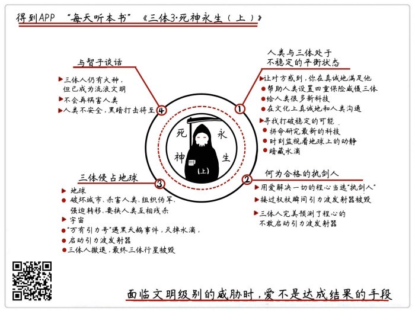
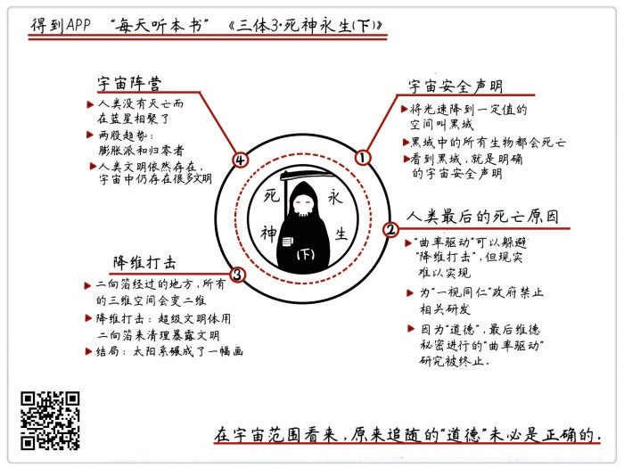

# 《三体Ⅲ：死神永生》| 怀沙解读

## 关于作者

刘慈欣，科普作家、高级工程师，被誉为“中国当代科幻第一人”。自上世纪90年代开始，他一边在发电厂担任计算机工程师，一边利用业余时间出版了13本小说集，连续数年获得中国科幻文学最高奖银河奖。2015年，凭《三体》获世界科幻界的最高奖项——世界科幻大会颁发的“雨果奖”，这是亚洲作家第一次获此殊荣。

## 关于本书

《三体》是刘慈欣创作的系列长篇科幻小说，由《三体》、《三体Ⅱ·黑暗森林》、《三体Ⅲ·死神永生》组成，讲述的是一个叫“三体”的外星文明与地球文明交流、搏杀以及各自兴衰的故事。这本书是“三体三部曲”的第三部，人类凭借黑暗森林威慑建立的平衡，将被伺机打破。

## 核心内容

在受到黑暗森林法则威慑后，三体人表现出了一个成熟文明的理性和克制，但从来没有放弃寻找拿回优势的机会。在人类选择执剑人失误后，三体果断展开了反击，将地球变为了他们的殖民地。外太空的一艘战舰成了人类仅存的希望，它将三体星的坐标公布在了宇宙中，三体恒星遭到了毁灭性的黑暗打击。太阳系不复存在，小宇宙无法独存，生于斯，灭于斯，大是大非的浩瀚宇宙，永恒的只有死神和面对死神的抗争。

## 前言

你好，欢迎你每天听本书，我是怀沙。今天来接着说《三体》的第三部《死神永生》。这本书大概38万字的内容。我们的音频会分成上下两部分，这一集是上半部分。

先来回顾一下前两部的主要内容。在离我们太阳最近的恒星上，有一种叫三体人的外星人，科技水平远远超过人类，他们一心要侵略地球。经过一番很复杂的较量，一位叫罗辑的中国人，成功利用宇宙的黑暗森林法则，在太阳系建立了一套可以随时暴露三体人恒星坐标的装置。人类就凭借着这个威慑，成功把三体人拉到了谈判桌前，让两个文明进入了一个彼此对峙的平衡状态。《三体2》的故事就终止在这个时刻。下面我们进入《三体》的最后一部，也就是《三体3·死神永生》的上半部分。

我们还是用三个思想实验讲述这个音频的内容。

## 上半部分

思想实验1：**如果两个敌对势力处于不稳定的平衡状态，那“强势”的一方应该注意些什么？**

我们先来看这个思想实验的题干，先来说一下什么叫“不稳定”的平衡状态，我们可以这么定义。就是在处于平衡状态下的其中一方，是很不情愿的，是很想改变现状的，只不过是暂时找不到办法，那这就是一个不平衡的状态。同时，我们就把“想改变现状”的那一边称为强势，觉得现状可以继续拖着的那方，称为“弱势”的一方。那我们看，在《三体2》的最后，罗辑就是靠黑暗森林法则，把三体人给拖住了。地球人是松了一口气，但是三体人是非常憋屈的，这就是一个非常典型的“不稳定平衡状态”。三体是强势的，人类是弱势的。

这里我们插一句，其实，在我们的生活里，也是大量存在着这种“不稳定平衡状态”的组合的，比如有的情侣、夫妻、公司合伙人、商家和供应商之间，董事会里面，都大量存在。表面上看着不错，但其实有一方是不情愿的，甚至弱势的那方自己都不知道。这种现象存在于各种关系里，那种大家都觉得对方很合适的团体可能是少数。

所以这个问题是挺有价值的，我们来看看小说里，三体人是怎么做的，总结一下，其实是两点：

1. 让对方感到，你在真诚地满足他。
2. 寻找打破稳定的可能。

第一点，真诚地满足对方。三体人这方面的事真是没少干。自从罗辑建立了黑暗森林威慑之后，人类上来就提出一个要求，就是：罗辑建立的这个靠核弹暴露位置信息的威慑手段太不靠谱了，万一核弹飘走了呢？所以我要你三体人帮我建立一个引力波的发射装置，为了我可以更好地威慑你。而且我要一次性建4个，3个固定的，1个移动的。可以吗？三体人一点也没犹豫，马上说可以。我帮你建三个，亚洲一个，美洲一个，欧洲一个，而且我还帮你建造一个移动的。于是，三体人在一艘叫“万有引力”的飞船上，建造了一个引力波发射器。

这里说一下，为什么是引力波，因为引力波很可能是宇宙最通用的通讯手段，它不受物质的阻挡，甚至可能穿越空间维度传播。它是宇宙里最靠谱的传递信息的手段。地球上的三个，就是三重保险，而万有引力号宇宙飞船上的，功能和上世纪美苏冷战时候的战略核潜艇很像了，就算地球上那三个引力波发射器都被你消灭了，只要我万有引力号在宇宙的不知道什么地方飘着，我对你就还有战略上的威慑力。

有了这四重保险，人类认为应该没问题了。好，这是三体人满足了人类的第一点。但是你可能会问，这么做，三体人心里愿意吗？请注意！这个问题不重要，重要的是，你们人类是不是感觉我三体人很真诚呢？只要你感觉到我真诚，那我就做对了。

接下来，地球人说，我要科技，给我科技。三体人马上说可以，给。而且嘴上和行动上是一致的，马上给！然后就扔过来一堆科技，全是人类被憋了200多年的基础科学，哇，物理学、数学、天文学，人类科学家一看，都是好东西，真东西，而且很硬，都有点消化不了，三体人还嫌人类慢，说你们学完没呢？我这还有呢，快点学。

人类这次，又感到了三体人的真诚。而且，三体人还在文化上真诚地和人类沟通。三体人就说，其实我们用智子看了你们这么多年，看也看出感情了，我们发现，我们还真是挺喜欢人类的文化的，很向往你们的生活，人类一开始当然不信啦，说别闹，怎么可能呢？三体人说真的，然后直接扔过来一个电影，三体人自己拍的电影，这个电影里讲的都是人类社会的故事，男主角女主角都是用三维动画做的，人类一看，电影的艺术水平还相当高，还在地球上公映了，非常受欢迎。

所以，你看，这个举动又让人类感觉他们很真诚。他们可能是真的喜欢我们的文化吧。但是请注意，三体人也不是那么良善的，他们所做的一切，就是我们说的这句话，让我们感觉真诚，但不是什么对人类好。那这么做的目的是什么？很简单，就是为了降低人的敌对心理。那好使吗？太好使了，经过这60年的交往，很多人类就真的认为，我们是不是真的有可能和三体人融合一下，找到一个办法，共同生活在太阳系呢？好，这是第一点。

第二点，听上去就让人感到三体人的可怕了。就是，三体人无时不刻地，在寻找打破这种平衡的可能。首先，三体人在自己的行星上，拼命研究最新的科技，他们知道自己之前吃亏就吃在飞船飞得太慢上了，如果不是要飞400年的话，也不会惹出这么多事来，必须提高飞船的航速。

很快三体人就取得了突破，他们掌握了光速飞行的技术。对人类绝对保密。还有，他们每时每刻都在监视着地球上的动静，一直在找人类黑暗森林威慑的一切可能的漏洞。同时，三体人在地球和太阳之间的一块太空垃圾里，藏了6个水滴，可以说是杀气腾腾的6个水滴，一旦有机会就能冲出来。但是这个机会实在是不好找，三体人和人类的这种你好我好的日子，一共过了60年，三体人这种分裂的性格，也坚持了60年。最后，三体人终于找到这个机会了，而且一次性把人类拿下了。

这就是我们这一段讨论的问题。作为不稳定平衡状态里“强势”的一方，三体人一边真诚地满足人类，一边在拼命找机会，而且最后成功了，可以说是交了一份满分的答卷。

那看完这个段落，我们的收获是什么呢？你可能会说，啊，这是教我们玩路子吗？是教我们先忍辱负重地憋着忍着，然后找到机会一次性翻脸吗？还真不是。因为这里有一个最大的区别，就是在小说里，三体人和人类在本质上，是不可调和的两个物种。但是我们平时生活里的那些情侣，合作伙伴，还有股东，毕竟不是三体人嘛，所以大家是没什么不能调和的本质矛盾的啊。

我们举个例子吧。比如说，你是个女生，你有一个很不靠谱的男朋友，但因为某个特殊的原因，你们俩暂时还真的分不开。那你的最差选项就是，一边抱怨一边试图改变他。而你的最优选项是，一边真诚地满足他，一边积极地让自己离得开他。这就是一种特别积极主动的人生。首先你长期对他好，有一定的概率，他自己会改变，或者会变得珍惜你，刚才说了，他毕竟不是三体人。如果他真是一点变化也没有，那对不起，我将来找到了更好的人，于情于理，我心里也不会有太多的愧疚。

我们看，三体人的这点就做得很好，我既然想明白了，目标是要真诚满足人类，那就痛痛快快，大大方方地满足你们，不要一边做一边心疼，或者老是自我暗示说，哎呀我多不容易啊，我多么忍辱负重，不要捏着鼻子，忍着恶心做这些事。你要是这样，对方一定会觉得你不真诚。那如果对方就是一点变化也没有，怎么办呢？第二条就是给这种情况准备的，一定不要放弃打破这种平衡的机会。说大白话，就是积极找下家。而且，要确保这样的行动一次性成功。这两种做法，一定要同时使用，才是最高效的。这样无论于情于理，你都没有亏欠对方。

这是我们的第一个段落。刚才我们是用三体人的视角来看这个问题，下面把视角切换到人类这边。

思想实验2：**一个合格的执剑人，应该具备什么性格？**

所谓“执剑人”，就是人类掌握黑暗打击按钮的那个人。这个角色其实跟美苏冷战时候，总统手里的那个核按钮很像。小说里，执剑人的手里，也拿着一个像权杖一样的东西，上面是发射引力波的按钮，要做的工作也很简单，就是一旦发现三体人违约，就按下按钮，与三体人同归于尽。刚才我们已经说过了，在人类的要求下，三体人建造了4个引力波发射器，确保在硬件上，威慑是可靠的，这是一个非常正确的决定。那接下来，就是要确保执剑人在性格上，要适合当执剑人。罗辑是第一代执剑人。在他的任期里，一切平稳。但罗辑已经100多岁了，人类社会认为，有必要更换一位执剑人。

在所有候选人里面，有两个候选人脱颖而出，一个叫程心，一个叫维德。程心是一个大美女，也是《三体3》的女主角，她是一个圣母一样的人，给人的感觉就是一个双鱼座的女生吧！她参加执剑人竞选的口号就是，爱是解决一切的手段，就算是和三体人的星际矛盾，也可以用爱来解决。民众就觉得，我们现在跟三体人关系这么好，而且打了这么多年仗，我们也确实烦了。所以程心的呼声很高。

另外一个人叫维德，他这人是一个不达目的绝不罢休的大叔，绝对是狮子座的那种性格，他是一个绝对的狠人。其实三体人特别害怕维德当上执剑人。但是民众在这个二选一的过程里，就选错了。程心呼声特别高，眼看就要当选。这时候维德就铤而走险了，他派了一个杀手搞暗杀，结果程心只是被打伤了，维德一下被判了30年监禁。程心反而获得了民众的巨大同情，最后以绝对优势当选了执剑人。然后，罗辑就交出了黑暗森林威慑，把控制着威慑权的那个权杖，交到了程心手里。

结果，程心接过来的下一秒。事情突然就变了。这就是三体人等了60年的机会，藏在太空里的6个水滴，飞快地冲出来，直接朝地球上的三个引力波发射器撞过去。说白了，三体人也没用什么计谋，他们就是赌程心不敢按按钮。这时候，程心刚接过权杖，还没明白是咋回事呢，周围就突然警报大作，所有警报都是告诉她，6个水滴正在全速冲过来，引力波发射器马上会要破坏了。程心就蒙了，她就问自己，这时候如果按下按钮，同时毁掉两个文明，又有什么意义呢？这和她爱的初衷是相违背的啊！最后，她干脆把权杖扔到地上去了。三体人完美地预测了程心的反应。

结果，地球上的3个引力波发射站同时被水滴撞毁了。同一刻，那艘装着引力波发射器的万有引力号战舰，也和地球失去联系了。说明三体人的袭击是同时发生的。就在短短的十几分钟之内，人类的威慑全部消失了。

这个时候，我们回头看一下。我们刚才提出的这个问题，一个执剑人应该具备什么性格。小说里其实给出了明确的答案，要是一个不讲情面、恪守信念的狠人。而不是一个老好人。那怎么界定狠人和老好人呢？我们给一个概念上的判断，狠人的定义，就是如果你伤害他，他一定会让你付出相应的代价，而且这代价是什么，是有清晰的规则的。但是老好人的定义，就是如果你伤害了他，他可能会因为宽容或者是软弱，不让你付出相应的代价的人。所以从这个定义来看，程心是最烂选项。

民众在这里犯了一个非常经典的错误，就是把要的结果当成了达成结果的手段。有句话叫，那些美好的东西，千万不要交给美好的人保护。不是说你们投票给一个看上去很有爱的领袖就能达成爱的结果。爱这种东西，有的时候是能解决问题，解决种族之间的矛盾是可以的，但在面临这种文明级别的威胁时，爱能干嘛啊？在这种时候，它是保护不了我们的。

程心这样性格的人，做朋友还行，她就根本不适合做任何形式的领袖。而我们能从这个段落里得到的收获，也是关于怎么塑造领袖人格的。领袖的一个重要素质，就是坚决地执行规则，哪怕在执行规则的过程里，有再大的阵痛，都是优先执行规则。只有长期这么对待事情，才能形成别人对你的一个可以预期的判断，这样的人才适合做领袖。

这是我们第二个思想实验。

下面我们先来讲一段故事。我们来看看三体人在黑暗森林威慑消失了之后，拿出了什么样的嘴脸。三体人的脸变得那叫一个快，说，没有威慑了是吧，那就听我的吧。这个时候，来地球已经两百多年的智子，成为了三体人在地球上的发言人，智子使用了一个人形机器人的形象，是一个非常漂亮的年轻日本女性。她对人类发言的时候，就是在代表三体世界的。

智子说，好，三体人舰队已经调头回来了，而且我们还从三体行星派出了第二拨移民船队。地球我们要定了。现在，你们四十亿人类全部都给我移民到澳大利亚去。消息一公布，人类都不动，等于大家都在观望。三体人说怎么我说了不算吗？派6个水滴把几个地球城市撞成了一片废墟，一下死了几十万人。这下人类害怕了。这个时候智子说，三体人现在公开招募500万地球治安军，说白了就是人类的伪军。结果人类很没出息，几亿人报名。地球治安军就拿着人类的武器，指挥着人类，用了半年时间，剩下的人类全都乖乖转移到澳大利亚去了。

但人类也有人坚决不服从，这些人就是地球反抗军。这些人在废墟里，在下水道里坚持战斗，但很可惜，他们只能和人类伪军作战，一个三体人也打不着。但他们的存在，维持了人类的尊严。罗辑老人也加入了反抗军，成为了反抗军的精神领袖。而人类的圣母程心，跟着人群到了澳大利亚。在澳大利亚，智子公开发表了一个讲话，人类才知道，澳大利亚的电源将被全部切断，不给粮食和任何补给，从现在开始，人类就人吃人吧。什么时候40亿人吃到只剩5000万人，我们再发粮食。在未来的计划里，我们只打算养5000万个人类。人类完全傻了，但是一点办法也没有，拳头最硬的就是老大。这个时候人类也终于明白过来，什么所谓的爱啊，那可能是我们需要的目的，但根本不是达成的手段。

但是，故事讲到这里，转折点马上就要出现了，因为要灭亡的不是人类，而是三体人。到底怎么回事？我们要把视角切换到宇宙里。拯救整个人类的，就是那艘带着引力波发射器的星际战舰——万有引力号。在水滴撞坏地球上的3个引力波发射器的时候，万有引力号正在外太空执行任务呢。但三体人派出了两个水滴，去监视万有引力号。12就在地球这边三体人和人类翻脸的时候，外太空的这两个水滴也同时接到了指令，把万有引力号同时干掉。但就在这个时候，人类人品大爆发，同时遇到了两个黑天鹅事件，就是这两个小概率事件让万有引力号活下来了。

第一个黑天鹅事件，是万有引力号和两艘水滴，一起进入了宇宙里的一片通讯盲区，就像一个没有手机信号的区域。所以，在这个盲区里发生的所有事情，外面的三体人是不知道的。第二个事件，是人类突然进入了一块四维空间的碎片。这个碎片就是随机地分布在宇宙里，万有引力号就是这么好运，被它碰上了。进入四维空间之后，人类就获得了一些很神奇的能力。

四维空间里的人，是可以对三维世界里的东西进行高维俯视的，比如你在四维空间里，看一个三维世界里的人，是能同时看见他的内脏、肌肉、血液的。这个人就像一个五颜六色的杂货铺一样，全部平铺在你面前。同时，四维空间里的人，还可以对这些三维世界的人进行高维触摸。比如一伸手，可以直接摸到对方的心脏上，这个过程不会破坏他的胸腔，因为你是从高维空间直接进入到低维空间的。也就是这么巧，就在这个时候，水滴接到命令，正要攻击万有引力号。人类对水滴发起了高维攻击。也就是在四维空间里，直接进到水滴的肚子里，从里边把水滴给毁了。水滴的外壳很坚硬，但是肚子里很脆弱。人类灭掉水滴，就是一个典型的所谓“高维打低维”的例子。

然后，万有引力号上的舰员开会一商量，一致认为，三体人和人类在地球上是扯破脸了。那万有引力号的职责，就是在这个时候实施黑暗森林报复。事关重大，战舰上的军人就进行了一个表决，他们可不像程心那么脆弱，表决的结果是，开启引力波发射器。也就是这个行为，把地球给救了。所以，万有引力号，向整个宇宙，公布了三体恒星的位置信息，三体人的恒星系马上变成了所有猎人瞄准的死亡之地。

宇宙里的事先说到这。我们把叙事的视角切换回地球。全体人类在澳大利亚突然得到一个消息，说是三体人撤了，地球治安军也解散了，所有人从哪来就回哪去。后来，大家才知道，这是因为万有引力号公布了三体恒星系的坐标，三体恒星系和太阳系这俩地方已经不能呆人了。三体人直接选择跑路了。

三年之后，黑暗打击如约而至，漆黑的宇宙里，突然出现了一颗明亮的小光点，直接击中了三体恒星，造成了恒星一系列大爆炸，三体行星被恒星吞没了。大概只有不到千分之一的三体人逃出来了，剩下的全部葬身火海。打击肯定是从一艘宇宙飞船上发出来的，因为开枪的那个位置没有任何天体的。飞船几乎是收到信号后马上开枪，一点时间也没耽误。就在三体人决定侵略地球的300年后，三体行星，被这个他看不上的人类，利用黑暗森林打击灭掉了。

但是，三体文明，并没有灭绝，我们一起进入这个音频最后一个思想实验。

思想实验3：**一个成熟的文明，应该怎样面对已经没有威胁的敌人？**

就在三体行星被毁的第三天，智子，也就是那个美丽的日本机器人。突然把程心和罗辑约到家里了。说是一起喝茶，老朋友叙叙旧。智子泡了三杯茶，用非常平静的语气，对罗辑和程心说了下面4层意思。算是她代表三体文明对人类最后想说的话。

第一层意思，向你们通报一下我们的情况。我们的行星被毁了。以后，我们就是宇宙里的一个流浪文明了。200年前出发的第一拨舰队和第二拨舰队，现在是唯一的三体人火种了。第二层意思，我们的智子也会从地球上撤离了。以后，三体人就再也不祸害你们地球人了，没有人监视你们了，你们的理论物理也没有天花板了。你们自己加油。第三层意思，不要以为你很安全，公布了我们的坐标之后，我们两个文明之间的通讯记录很快就被高等文明发现，黑暗打击很快会降临在你们头上，人类，请快跑。第四层意思，宇宙很大，彼此珍重，如果有缘的话，我们再见。

说完，智子微笑着，给程心和罗辑递上一杯茶。一杯淡茶，算是对这场星际战争的一个总结吧。说实话，罗辑和程心也没想到三体人最后说出这么一番话来。听完之后，突然对这个敌人，产生了一种复杂的情感。人类和三体人的关系，可以叫已经没有威胁的一双敌人。三体人在临走之前，还来了一个挺有水平的告别。我们基本可以用三个原则总结三体人对一个没有威胁的敌人的态度。

第一原则，无对无错。在最后的陈词里，三体人只说事实，没有任何一句是非判断。第二原则，无怨无恨。三体人完全没有提谁的损失大，谁的过失多，或者谁的未来更渺茫这些东西。而且三体人也没有报复和诅咒的行动，就是这么沉默地走了。任何坑你的事情，三体人都没做。第三原则，有礼有节。三体人走的时候，算是有一个正式的告别的。做事有头有尾，而且作为礼貌性的告别，而且最后留的话茬，不是凶巴巴恶狠狠，还带着一点点薄薄的情义。

所以三体人走的时候，留给人类的，是一个性格非常稳重，情绪非常平和的形象。而且留的都是活话，万一日后再见了，起码是好再打招呼的。你看，这种面对旧敌人的态度，和我们熟悉的方式完全不一样。用我们比较熟悉的观点来说这场战争，肯定是这种调调的，这就是三体侵略者搬起石头砸了自己的脚，最后得到这么一个下场，罪有应得！而且，是三体人你们先打我们的，你们这是一场不义的战争，而且，以后你就得永远低头认错，以后无论啥时候见面了，你就给我道歉。而且，只要我将来有机会，我一定要把你今天对我做的十倍地还给你，你等着，以后我们无论什么时候看见对方，我们都是仇人。

你看，刚才这种论断，就全是是非对错，全是怨恨，全是过去，没有一点未来。在宇宙生存面前，这些是非曲直，是最苍白的东西。如果一个文明老是揪住这些东西不放，那它就不是一个成熟的文明。

这些或许就是三体这个文明在离我们而去的时候，给我们的最后的一些收获。

就在智子马上要告别之前，罗辑突然开口了，他说，我能问一个问题吗？智子想了一会，点了点头。说，我回答你，完全是出于对您罗辑的敬重，但我只能回答，是、否，或者不知道。我的回答肯定是真实的。罗辑一字一句地问道：在宇宙里，有没有一种通用的安全声明，进而能避免黑暗森林打击呢？智子听了之后，明确点点头，说：有。

说到这，《三体3》上半部分的情节就结束了。那究竟这个神秘的安全声明是什么呢？人类又能不能躲开这次黑暗森林打击呢？《三体3·死神永生》的下半部分，也是三体三部曲的大结局，敬请期待。

## 下半部分

你好，欢迎回来，我们接着讲《三体》第三部，《死神永生》的下半部分。

在之前的内容里，三体人和地球人发生了一场长达300年的战争，最后，地球人借助宇宙里其他文明的力量，把三体人的行星打掉了，三体人从此就变成宇宙的吉普赛人了。但是，人类自己也暴露在了黑暗森林打击下，这个打击随时可能降临。下面，让我们一起进入《三体》第三部，下半部分，也就是整个三体的大结局。我们还是用思想实验的方式来解读，首先我们先来看第一个思想实验，也就是在上一部里罗辑向三体人提出的那个问题。

思想实验1：**在宇宙里，什么才是宇宙安全声明？**

罗辑向三体人提出了这个问题，但只得到了一个肯定的答案，具体怎么做，三体人是说什么也不回答了。人类就觉得非常着急，因为我们马上就要被黑暗森林打击了，有你又不说，话说一半最烦人。但就在这个时候，有另外一个人，把这个结果告诉了人类。这个人叫云天明。这个人其实是《三体3》的男主角。

我们往回介绍一下这个人，云天明是程心的同学，他其实一直暗恋程心来着，但很不幸云天明得了重病，在去世之前，他把自己的大脑给捐献出来了，干嘛去了呢？因为当时正是人类被智子监视的时候，人类就想着，你们三体人老监视我，那我也要发射一个什么东西过去监视你。就想试着发射一个人类大脑到三体世界去，这个大脑用的就是云天明的大脑。但是实验后来失败了，云天明的大脑飞到一半，就偏离了航向，等于说就把云天明的大脑弄丢了。人类就放弃这条路了。但是，人类没想到，这颗大脑，居然被三体人半道截获了。这是小说之前埋下的一个伏笔。

结果，就在智子请罗辑和程心喝茶的时候，智子突然说了，我们在走之前，还有最后一件事。程心，云天明想见你。云天明在三体世界的一切，全是谜，小说里一个字也没写。总之，云天明在三体世界混得还不错，反正混到了临走之前想见一眼女神，三体人同意的程度。但其实云天明是想借着见面的这个机会，向人类透露一些关键信息，一共是三个重要信息。其中一个就是，什么才是宇宙的安全声明。另外两个我们等会再说。我们先来看什么是宇宙的安全声明。云天明和程心是通过虚拟现实技术见面的，云天明一共对程心讲了三个童话，其实他把要说的事，非常巧妙地藏在故事里了。讲完故事之后，云天明就跟着三体人的舰队飞走了。

人类成功破解了云天明的故事，云天明给的答案是，宇宙里的安全声明，对于太阳系来说，那就是把光速从现在的每秒30万公里，降低到太阳系的第三宇宙速度之下，也就是降到每秒16.7公里以下，这么一来，光就飞不出太阳系了。这样的空间，叫做黑域。黑域和黑洞很像，区别就是黑域不会坍缩。对宇宙的其他文明来说，一看到这有一个黑域，就知道这是一个明确的宇宙安全声明，就没人对你进行黑暗森林打击了。这个就是发出安全声明的办法。那这条路人类可以走吗？不可以。因为如果人类真的能把光速降到这么慢的速度，那构成物质的原子的状态都会改变，人类是肯定不存在了。

那你可能会说，那我要知道这个干嘛，这条路也不能走啊。能不能走我不管，但你罗辑问的问题，就是有没有宇宙安全声明吗？现在告诉你了，有。是什么，是低光速黑域。但如果你再问，人类能不能在里面活，不能。那有没有能在黑域里活着的办法，没有。那你可能会说，这黑域不就等于自杀吗？没错，你说得太对了，这就是一种自杀。

小说这里的观点应该就是，在宇宙里，只有你死了，你才是安全的。那又涉及一个很根本的问题，就是什么是宇宙公认的死亡，这是作者提出的一个问题。怎么定义死亡，就算在地球上也是很有争议的。像人有脑死亡，有身体死亡，一朵花被你摘下来了，那它算不算死亡了？你看，在地球上都不好界定。那宇宙里的生物更多样性了，可能一个行星，或者一团星云都是一个生命，那我们怎么能确定它是不是死了呢？必须有一个统一的定义。小说里给的回答是，黑域就是宇宙公认的一种死亡方式。因为如果在一个区域里，光速降低到了连重力都跑不赢，那就会出现一系列后果，那这个区域不光是“黑”这么简单了。而是这个区域的物理规则全部概念，原子结构也会崩坏，这是一种物质层面上的毁灭。那就不是人类活不了的问题了，而是一切生物都活不了。

所以，安全声明，我们可以理解成是完成一种宇宙官方认可的自杀。谁要是变成黑域了，那就说明这个区域内的所有生物都死透了。当然，这只是刘慈欣给的回答，这个问题谁都可以给出答案。这就是我们最开始说的，刘慈欣在这里提出了一个很好的问题。我们接着回到小说里。人类听完之后，就有点无语，说好吧，黑域这个定义倒是挺有意思，但是，我这不想自杀啊，我们其实想问的，是怎么能不被人打死。

云天明不是还有另外两个童话吗，那就是回答你们怎么能不被打死的。这就是我们下一个要说的思想实验。

思想实验2：**最后把人类害死的，最可能是什么？**

随着故事的深入，小说的讨论的问题变得越来越刺激了。对于这个问题，小说给出的答案是，最后把人类害死的，很可能是道德。我们来看看，小说是怎么一步步得出这个结论的。云天明另外两个故事，说了两层意思：第一个意思说的是，同胞们啊，你们将面临的黑暗打击会是一种你们还没见过的，叫“降维打击”的可怕打击。但非常可惜，这一层意思人类没弄明白。

云天明的第二层是，怎么躲避这种可怕的“降维打击”呢，还是有办法的。你们要造一种叫“曲率驱动”的宇宙飞船，只有这种技术才能救你们，这个是你们科技的发展方向。非常幸运，这层意思人类理解了。但是虽然理解了，人类最后还是死了。

首先，人类集合了最精英的科学家，开始研究曲率驱动技术。但人们发现曲率驱动有两大问题。

第一个是科学问题，人们发现曲率驱动飞船在启动的时候，会在空间留下一些空间的褶皱，这种褶皱很难清除，高级文明一看就能看见，那就说明，这有人用曲率飞船了。所以反而更容易引起注意，招来黑暗森林打击。第二个是社会学的问题，人类发现造曲率驱动飞船会耗费大量的资源，就算造出来，也只能让一部分人走，那这就很不公平。而且前面也说了，飞船一启动就会留下痕迹，那剩下的那些人不就更容易暴露了吗？所以，这就变得了一个社会学难题，或者说道德难题，为了解决这个问题，人类政府决定一视同仁，干脆来了一个硬性规定，立法宣布，研发曲率驱动超光速飞船是违法的，大家都别用。等于就把云天明指的路，自己给堵上了。

这时候，之前的一个人物，维德又出来了。就是那个狮子座的大叔，他之前不是因为刺杀程心，被判了30年吗，现在刑满释放了，而且得到了程心的原谅。程心这个时候，是一个很有权力和资源的领袖，因为民众支持她。维德就想给程心打工，帮她打理一些公司上的事务。但程心知道这个人比较没底线，啥事都能干出来，就和维德做了一个约定，如果你做的事情，一旦危及了人类的生命，那我让你停，你马上就得停，你同意我，才用你，维德说行。

但维德有自己的私心，他表面上打理公司，实际上，他是在组织科学家，秘密研制曲率推动的飞船，而且还真的取得了不小的成果，马上就要成功了。但就在这个时候，维德的研究被政府发现了。联邦政府命令维德停止研究，维德坚决反抗，双方就开始武装对峙，一场大战一触即发。这个时候，程心又站出来了，程心的性格呢，自从之前犯了那么大一个错误之后，还差点把人类害死之后，当然是……一点也没改变。程心说了一句特别高大上的话，叫做人的生命是第一位的，你维德之前是怎么答应我的，马上放弃抵抗，向联邦政府投降。

这个时候，维德真的很无奈，他明知道自己坚持的东西是对的，但是程心祭出了一个大招，叫做道德。人的生命是第一位的，这个观点，谁敢反对呢？维德对程心说了一句意味深长的话，他说：“<u>失去人性失去很多，失去兽性失去一切。</u>”程心毫不犹豫地说，我选择人性。最后，维德竟然真的选择了信守承诺，可能在那个时代信守承诺比什么都重要吧，总之维德放下了武器了。

维德马上就被人类判了死刑，所有关于曲率驱动飞船的研究，全都停止了。故事发展到这里，联邦政府接管了维德的基地之后，把所有关于曲率驱动飞船的研究都中止了，科学家全部解散。最后代表法律和公正的联邦政府胜利了，程心在这个过程里完成了一次神助攻，但其实这是一个“神坑助攻”，程心这两次补刀，都非常致命。人类唯一应该坚持的正确方向，云天明明确给指出的那条路，曲率驱动飞船，就中断了。

我们来看，到底是谁中断了这个研究。其实不是政府，也不是程心，而是两个光荣伟大正确的概念，叫做公正和人性。这两个词一摆出来，支持它们的人的嗓门马上就高八度，怀疑它们的马上矮半截，这样的东西，我们就管它叫道德。最后把人类挡在曲率驱动飞船门外的，是人类自己创建的这种叫道德的东西。

那读完这段之后，我们的收获是什么呢？是小说在鼓吹放弃道德吗？当然不是，道德在绝大多数下一定是好的。但小说在借着维德的故事，其实在拷问道德的时效性问题，我们知道，所谓公正和人性，其实是在过去100年的时间，极大地促成了人类的进步的。说得功利一点，道德是帮助我们达成特定的社会架构的思想工具，但时间一长，这种工具就长在我们的大脑里了，不进步不更新了，那就容易犯错误，<u>一个地球格局下形成的道德观念，怎么能还适应一个星际文明呢？</u>

所以，小说给我们模拟了一个平时不常见的极端情况，面对一次针对人类的毁灭性打击，我们知道怎么躲开，我们有资源，有科学，有人才，有路径，但是我们没有一个跟得上这些的道德水准，所以我们最后被拍死了。

这是我们的第二个思想实验。下面我们来看看，最后降临的黑暗打击是什么样子的。

降维打击。

在宇宙里，有一个神秘的东西飞过来了，名字叫二向箔。它是一张小纸条那么大的东西，无色透明，凡是它经过的地方，所有的三维空间全部变成二维空间。

这种改变，是从物理底层上，改变空间的物理结构。有一个很形象的比喻，把降维打击解释成把苍蝇拍扁，这个意思是对的，但是如果较真，这个比喻有漏洞，因为无论你把苍蝇拍得多扁，它还是三维的，拍扁这个动作只是把苍蝇这张肉饼的高度值，拍得无限趋近于零，但苍蝇肉饼的高度这个维度，并没有消失。但降维打击的意思是，直接把你的一个维度给撤销了。那物质就会在粒子层面散架。当然，这种物理打击，也只存在于小说的想象里。

这里顺便说一句，“降维打击”这个词在创投圈也很常用，也是三体小说原创的。但是这个词的用法不是，谁从高处降下来，打另一个人的意思。而是从物理层面上，撤掉一个参数系统的意思，让对方的维度降低的意思。那如果我们这个世界被降维了，我们还能活吗？答案是不行的。所以对于太阳系的所有生物来说，这都是一个躲不开的必杀技。那是谁扔的这个二向箔呢？是一个比三体人还高级得多的超级文明。当然，这个高级文明在那些宇宙大神文明面前，只配当一个最低级的清洁工。他专门负责清理那些暴露了的文明。这个时候人类才知道什么叫天外有天、仙外有仙。

故事讲到这，地球和整个太阳系就迎来了最终的命运。这一年，是2354年，整个太阳系被二向箔碾成了一幅画。所有人类都走到了人生的尽头，人类在太阳系的文明，就此毁灭。但是，程心在最后关头逃出来了。下面，我们进入三体最后的大结局，也是我们最后一个思想实验。

思想实验3：**宇宙分为几个阵营？**

就在太阳系被毁灭之前，程心被人送上一艘飞船，有人对她说，这是一艘曲率驱动的飞船，去吧，远走高飞吧。这是维德之前研究出来的唯一一艘。程心就坐着曲率飞船，飞出了被二维化的太阳系。但是她已经没有地方可去，就像顾城的诗里说的：我该到哪里去啊，宇宙是这样的无边。这个时候，程心突然想到，自己和云天明最后一次见面的时候，俩人有过一个约定，说好了在一个叫蓝星的地方集合。所以程心就到了蓝星。

在蓝星上，程心见到了一个人类。他的名字叫关一帆。关一帆说自己就是来接程心的，人类没有灭绝，而且已经在宇宙中找到了适合生存的行星。原来，人类还在宇宙里有一点火种，就是当初那艘救了人类的万有引力号战舰，上面的几千人，最后找到一个行星，在上面落脚了。程心很高兴，决定跟着关一帆去人类的新家园看看，但就在两人正准备离开蓝星的一瞬间，飞船遇到了意外。在蓝星的附近，就有一片曲率驱动飞船留下的空间褶皱，两人的飞船被这个空间褶皱卷进去了。呆在这个褶皱里面，有点像黑洞，进去之后很难走出来，而且在里面时光流逝得很快。两个人就在这个褶皱里被困了16天，最后经过一番挣扎，还是逃出来了。

在黑洞里呆一会，等于外面的无数年，再出来的时候，发现时间已经过了1800万年。当时是18906416年。这个时候，程心和关一帆发现，原来在这1800万年的时间里，云天明来过蓝星，给程心留下了一个叫小宇宙的礼物。两个人找了找，发现蓝星表面有一个门框一样的东西，就像机器猫的那个任意门一样的东西。一推，门开了。门里面站着一个美丽的日本女子，是智子。智子向程心鞠了一躬，说：果然有缘再见了。请进吧，这是云天明给你们准备的第647号宇宙。

两人都蒙了，进去看了一下，里面是一个长宽高都是1公里的异次元空间，当你朝一个方向走到尽头的时候，会从另外一个边缘冒出来。这里面有山有水有河流。智子说，这里是一个绝对安全的小宇宙，它里面的物质都是从大宇宙那边拿过来的，但是它和大宇宙没有任何时间和空间上的关系。它就有点像一个游戏的私人服务器，规则你可以自己设定，但它和大宇宙之间是断网的。就是你那边大宇宙天崩地裂，在这个小私服里，你们俩还是可以躲进小楼成一统，过晴耕雨读的生活。这就是云天明留给程心和你的男朋友的一个安乐窝，智子是照顾程心的机器人管家。程心和关一帆，这一对孤男寡女，所以两人自然就好了，每天就在小宇宙里过小日子了，种种田，看看书。云天明留下了大量的三体人文献。

在看完了三体人的所有文献之后，关一帆和程心也理解了宇宙的整体格局。整个《三体》的宇宙观，也在这里全部展开。简单来说，宇宙里分成两股趋势，两股趋势的背后，也可能是两种自然规律，也可能是两个文明的联盟。但总之是两股趋势。

一股趋势，我们可以管它叫膨胀派，它可以说，代表了死神。这个趋势就是宇宙不停地膨胀，最后就会出现那个可怕的现象，就是物理学上的热寂。也就是所有的恒星都熄灭了，物质之间的距离都是无限远的，什么东西都和别的东西不挨着，没有生物，没有智能，这个宇宙就达到了熵的最大值，那宇宙就死了。而唯一能永生的，就是死神。而另外一种趋势，叫做“归零者”，它可以说，代表了生命。它的使命就是阻止宇宙继续膨胀，它不希望看见宇宙到最后尘归尘，土归土。让归零者最发愁的，就是宇宙不停地膨胀。所以，归零者在使用一切方法，希望改变宇宙膨胀的现状。

这天，程心和关一帆正在看书，智子突然跑进屋，说，大宇宙那边在发布广播，快去听。原来，是归零者正在大宇宙那边，向所有宇宙里的文明进行广播。三个人看着屏幕，广播是用各种不同的语言发布的，每一个语言都代表了一个文明。三个人就盯着这些看不懂的语言，在数到第一百三十万种语言的时候，忽然出现了三体人的语言，几秒钟后，地球的语言也出现了。哇，三个人高兴得大喊起来，这说明三体人和人类都还在大宇宙里活着呢，这两个冤家死对头，经过各种兴衰，各种别离，都撑到了公元1800万年，而且终于都挤进了归零者认为值得被通知的文明名单里。

当广播播到第150万种语言的时候，播送停止了。归零者发布的信息是：请听得到的文明们注意。大宇宙膨胀的原因，就是因为你们都从大宇宙里不停地偷物质，拿去建你们的小宇宙去了。现在，宇宙的物质总质量马上就要降到一个临界值了。再不把物质还回来的话，宇宙的膨胀都回不了头了。那我们就完蛋了，死神就赢了。所以，请听得到的文明，把你从大宇宙里拿走的物质还回来。我们要把宇宙重启一下，看看一切能不能好起来。

听完归零者的广播，关一帆和程心的心里，都升起了一种说不清的使命感，他们决定把物质还回去，自己也回到大宇宙里去。至于为什么这么做，不知道。这可能是一种冥冥中的召唤吧，我们从哪里来，也终将回到哪里去，无论生死，无论欢乐还是苦难，回到宇宙的大是大非里。这可能是人类这个从宇宙而生的物种，能对宇宙尽的最后一点责任吧。

最后，程心、关一帆，还有智子，就把云天明小宇宙里的物质全部归还了，三人也回到了一切都是未知数的大宇宙里。

说到这，《三体》三部曲，就给你说完了。

## 总结

那看完了这个100万字的长篇小说之后，我们能收获些什么呢？我们在整个音频的最后，帮你梳理一下。我们来点评一下《三体》里的四个人物，还有总结两点收获。

《三体》的整部小说，描写了四个主要人物，可以这么分类，分别是：

* 一个成功的好人，罗辑；
* 一个失败的好人，程心；
* 一个成功的坏人，叶文洁；
* 一个失败的坏人，维德。

我们先来看，一个成功的好人——罗辑。首先，罗辑他想干的事情干成了。作为一个面壁者，他成功建立了黑暗森林威慑，使命达成。再看罗辑的设定，典型的正面人物，有正义感，有担当，对爱情忠贞，对人类负责。这个人物，很像好莱坞电影的男主角，开始吊儿郎当，后来捍卫正义。虽然这样的任务不出彩，但小说的主人公也需要是这样的人物。

接下来，一个失败的好人——程心程心，她想做的事都没成，第一次她要用爱拯救人类，结果人类差点灭种。第二次她为了捍卫公平和人性，结果太阳系被毁灭。所以，程心的所有事情都是失败的。但程心是个好人，在生活里，我们都想有这么一个朋友，暖心、宽容，经常牺牲自己来帮助别人。作者用程心这个角色，给我们所有人上了一课，好朋友和领袖，是两套完全不同的评判标准。

接下来，一个成功的坏人——叶文洁。叶文洁想做的事成功了。她把三体人成功招过来了。但在作者的笔下，她肯定是坏人的形象，她的主观恶意很强，还杀了自己的丈夫，这些都是坏人的形象。但是不得不说，叶文洁是一个很好的审视者，或者说促进者。她强迫地球人往前走，被三体人打败或者打败三体人，叶文洁都接受，她唯一不能容忍的事情，可能就是地球人继续在错误的道路上原地打转。

最后，一个失败的坏人——维德维德做的事情都失败了，竞选失败了，刺杀失败了，科研也失败了。但是他的每次决策都是正确的。维德和程心，这两个人物成对出现，给了我们很好的借鉴价值。程心的失败告诉我们，很多事情，不能用直觉来判断。而维德的失败告诉我们，就算你的目标可能是正确的，程序合法这点也是非常重要的，如果使用错误的方法追求正确的事情，最后可能会落得悲剧的下场。

我们再看这四个主要人物，其实塑造得都很精彩。一般来说，把正面人物写得很好，把坏蛋写坏都不难，最难得的是把人写得很复杂，这点刘慈欣成功了。他成功塑造了一个正面的英雄式的人物，和三个有多个角度的人。

那看完了整部小说，其实我们可以总结收获的点，还是很多的，那有没有贯穿始终的收获呢？我觉得有两点，可以总结成两句话：

1. 要复杂，不要简单
2. 要前进，不要后退

我们先看第一点，要复杂，不要简单这点。小说讨论了大量的话题，有政治学、社会学、经济学，但看完之后，我们其实看不出作者有特别明确的倾向。换句话说，整本书对于任何一个观点，都没有拿出简单的判断。给我们的感觉就是，对于一件事情，如果我们问刘慈欣，你怎么看，他会回答我们三个字——看情况。这就是一种具体问题具体分析的世界观，而不是预设任何简单的观点。拒绝简单，拒绝非黑即白，这是贯穿《三体》整部小说的价值观。这也是唯一能护卫我们前行的价值观。就像万维钢的那个金句说的，无论你的信仰是什么，都不要信得很简单，这是一个非常复杂的物质，只有复杂能够应对复杂。

第二点，要前进，不要后退。我们身边有非常经典的争论，就是我们到底应该节奏慢一点，还是快一点；是应该更田园一点，还是更现代一点；是欲望少一点，还是欲望多一点。这是两个完全相反的思路。非常巧的是，这个宇宙也是这么分阵营的。刚才我们说了，一种叫熵增，也就是归零者害怕的热寂。很不幸，好像整个宇宙都是这样的，不然归零者也不会成天发愁。另外一种叫熵减，这是一个非常小的逆流，这就是生命。

全宇宙都在拼命变乱，只有生物在拼命把混乱变得有序。我们观察到的任何一种生物都是这样，只要你出生，吃饭，学外语，锻炼身体，繁育后代，你就是站在这个有序化的阵营的，也就是归零者这个阵营的。而换阵营的方式有，但只有一个，就是马上自杀。一个动物死亡之后，你身体里，被你绑架到生物这个阵营的原子，才能回归自然，回到它原本的物质阵营里去。所以说，宇宙，就像一台双向运动的自动扶梯，一边是向上运行，通向有序，另外一边是向下运动，通向无序。对不起，我们一出生就是在向上的电梯上的。但如果作为出生在上升电梯上的生物，却偏偏硬要往下走，我们将变成所有宇宙生物里，最荒谬的一个。

这是宇宙最好的阵营，这也是最好的时代。让我们珍惜眼前的生活吧，珍惜我们有一颗稳定的太阳，珍惜我们头顶没有智子的封锁，珍惜我们所爱的人不是一颗飞往外太空的大脑，珍惜我们读到的《三体》这么好的小说，它告诉我们，人类没有任何理由，不变得更强大，更文明，更美好。

撰稿、讲述：怀沙

脑图：摩西