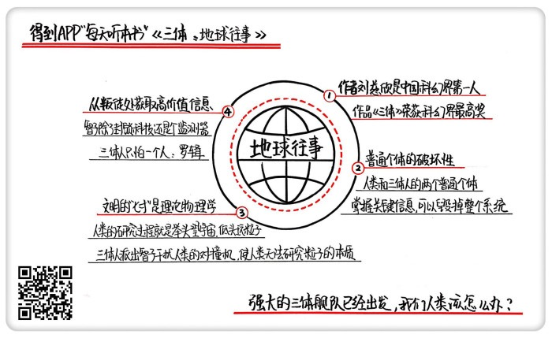

# 《三体：地球往事》| 怀沙解读

## 关于作者

刘慈欣，科普作家、高级工程师，被誉为“中国当代科幻第一人”。自上世纪90年代开始，他一边在发电厂担任计算机工程师，一边利用业余时间出版了13本小说集，连续数年获得中国科幻文学最高奖银河奖。2015年，凭《三体》获世界科幻界的最高奖项——世界科幻大会颁发的“雨果奖”，这是亚洲作家第一次获此殊荣。

## 关于本书

《三体》是刘慈欣创作的系列长篇科幻小说，由《三体》、《三体Ⅱ·黑暗森林》、《三体Ⅲ·死神永生》组成，讲述的是一个叫“三体”的外星文明与地球文明交流、搏杀以及各自兴衰的故事。这本书是“三体三部曲”的第一部，经刘宇昆翻译后获第73届雨果奖最佳长篇小说奖。   

## 核心内容

本书的思想核心是：对人性绝望的天文学家以太阳为放大器，向宇宙发射代表文明的信号，被临近星系的三体人截获，引发了三体人对地球的侵略之心。一小撮试图毁灭人类的成员与三体人勾结，成为了叛军，内外夹击之下，地球进入到了生死存亡的危机时刻。  

## 前言

你好，欢迎你每天听本书，我是怀沙。以后我在咱们每天听本书里，会集中精力给你说科幻。今天我们来解读的是《三体》三部曲。

《三体》已经非常出名啦，作者刘慈欣，也是中国科幻界毫无争议的第一人，而《三体》就是刘慈欣的代表作。2015年，《三体》第一部获得了世界科幻界的最高奖项，雨果奖。这是亚洲作家，第一次获得这个奖。《三体》的主题也非常刺激，大概讲的是一种叫三体人的外星人来侵略地球，然后地球人奋起反抗的故事。

但是，《三体》最大的价值不是讲了一个跌宕起伏的好故事，让人看得欲罢不能；不是得了什么奖，给中国拔份了。它最大的亮点是，它是一部有相当思想深度的作品。像马云、马化腾、李彦宏、雷军、柳传志、扎克伯格、奥巴马，全都公开表示过，他们是三体的粉丝。2016年，刘慈欣在接受杂志采访的时候说了一句话：“好多名人看完《三体》之后，过来问我的问题，根本就不是一个科幻小说家能回答得了的。”也就是说，很多人在看完《三体》之后，心里萌发了一种对终极问题的渴望。一个科幻小说，怎么会有这样的功能呢？

这是因为《三体》这部小说，可以被看做是一个“<u>思想实验大合集</u>”。这个观点不是我说的，是刘慈欣自己的观点。当然他的原话不是这么说的，他的原话是，“我只写可能的世界”。意思就是，刘慈欣希望在想象里设定一个极端的情况，然后沿着真实可能的逻辑推理，把可能发的故事写出来。

那我们再提炼一下这句话，其实这就是思想实验的意思。我们先来解释一下什么叫思想实验，它的定义是，使用想象力去进行那些在现实中无法做到的实验。由于所有事都是在脑子里想象出来的，所以做思想实验，就可以设定出特别极端的情况，你不用真的面对极端情况，就能用很低的成本想明白很重要的问题。历史上著名的思想实验，可能就是伽利略扔铁球的实验了。这个实验，在高中物理课上我们都学过。他在比萨斜塔上扔一大一小两个铁球，发现铁球是同时落地的。其实伽利略根本就没到塔上扔球，他就是在脑子里，把这个实验做了。如果这个事靠想就能明白，那就连爬到比萨斜塔上的这个成本也可以省了。

而我们的生活里，其实经常在做思想实验。很多人被迫做过那个经典的思想实验，就是：我和谁谁谁同时掉进水里了，那你先救谁呢？你看，这就是一个现实里不太会发生的极端情况，为什么人们很喜欢问这个问题？是因为他希望在不承担掉水里的风险的情况下，想知道他在你心里有多重要。所以，思想实验就是设定一个情节，用一个真实的故事，让你用最小的代价想明白一些事情。而《三体》的整个小说完美地做到了这点，所有的想象都是真实世界的推理，让你觉得故事里的一切，都是可能发生的。

我们这次讲《三体》三部曲，把将近100万字的作品，切割成了15个问题，也是15个思想实验。同时，听完这15个思想实验，《三体》三部曲的全部故事情节你就全知道了。故事听完了，你的思想也会跟着作者一起回答15个问题，你也能得到15个扎扎实实的收获。过去的时代，是谁知道答案谁牛的时代。而现在这个时代不一样了，很多问题的答案太复杂了，几乎没有正确答案。所以，那些能提出好问题的人是最牛的，是那些能用问题，把所有人的所有知识搅动起来，然后去无限接近真相的人。

我们先说第一部，《地球往事》，原书20多万字，我们把它概括成三个思想实验。第一个思想实验：在信息时代，一个普通个体能在多大程度上破坏系统？第二个思想实验：我们知道打蛇要打七寸，那，打一个文明的“七寸”，应该打什么地方？第三个思想实验：一旦发现系统出现叛徒，最应该做的事情是什么？

## 第一部分

实验1：**在信息时代，一个普通个体，能在多大程度上破坏系统**？

先亮一个结论吧，小说对这个问题的回答是：在信息时代，一个小小的普通个体，是完全可以毁掉一个系统的。在第一部的故事里，人类和三体人，这两个种族，都各自能被他们阵营里的一个普通个体害死。但是人类被坑得更惨。这两个人的名字分别是叶文洁和1379号三体人。在介绍这两个人之前，我们先介绍一下三体人的大致情况。在离太阳最近的恒星系里，也就是4.3光年之外的恒星系里，有外星人住着，就是三体人。三体人的科技超级厉害，完全超过了人类，但是他们有一个最大的心病，就是自己的行星特别不靠谱。

在他们的恒星系，一共有三个太阳，造成的结果就是，每个太阳都对三体行星有引力作用，这个就是数学上的一个经典问题，叫“三体问题”，也是小说题目的由来。“三体问题”很复杂，结论是，在三体世界，没有任何办法对未来进行精准预测。说大白话就是，没人知道明天会怎么样。可能明天，呼啦一下，三体人的行星就被三个太阳里面大的那俩吸走了，那三体行星表面就热死，没准哪天，又被三个太阳里的那个小弟吸走了，那这个行星就冷死，还可能，突然一下没弄好，老是这么拉拉扯扯的，行星就掉到某一个太阳里去了，那三体人就全玩完了。

所以，三体人就疯了一样想找到靠谱的行星，比如说绕着一个恒星转的行星，然后殖民过去。三体人就在宇宙里监听信号，非常认真地寻找线索，但他们一直不知道，其实在他们旁边，就有一个太阳和地球。

这是一个大背景。就在这个时候，我们人类这边的这个普通个体登场了，就是她把三体人惹过来的，真是把人类给坑惨了。叶文洁，是一位女士，中国人。叶文洁的父母是科学家。本来这是一个很理性的家庭，但叶文洁的父母在“文革”里被迫害死了，所以叶文洁就对人类特别绝望，同时叶文洁又是做科学工作的，她得到了一个便利的机会，能向宇宙发射信号。她就把地球的情况都发到宇宙里去了。这个信号可是三体人做梦都在找的啊。

结果，叶文洁发的信号就被一个叫1379号的三体人收到了。这个1379号算是三体世界的一个底层公务员吧，三体世界是一个特别极权的社会，底层公务员生活特别枯燥，加上这个1379号是一条单身狗，一辈子就是负责监听宇宙信号的，到最后人老珠黄了也没对象，就产生了很强的厌世情结。他就觉得，我这一辈子活得有啥劲呢？而且我们三体人还一心想殖民到外星上去，难道把这种生活方式推广到全宇宙吗？那这么做对吗？我们看，1379号的这种哲学思考当然无对无错，那对于三体人来说，他的这个想法就是错尽错绝了。因为这会耽误整个系统的未来啊。

就在这个时候，叶文洁的信号来了，信号里还附带了地球的信息。这个1379号一看，哇，一颗美丽稳定的行星，太好了，我这辈子就在找这个啊！但是对不起，我现在厌世了，1379号就做了一个特别不靠谱的事。他给叶文洁的回复，劈头就是三句话：不要回复，不要回复，不要回复。重要的事说三遍，我不管你是谁，你如果不回复，在你的这个信号来源上，是有无数颗行星的，我们还是不知道你具体在哪，就永远找不到你，永远找不到你的话，我们过的这种日子，就不会复制粘贴到你们那里去。但如果你回复了，我们是一定会侵略你的。

1379号刚写完这些，啪就发回给地球了。这个行为相当不靠谱，他把千年等一回的机会就这样放过去了，等于他代表所有三体人，做了一个不想活了的决定。结果这个信息刚发走，1379号马上就被捕了。三体人的首领就非常郁闷，以为这个线索就一定是断了，你1379号都这么说了，那傻子才回复呢。结果没想到，在这场比谁更不靠谱的比赛里，叶文洁赢了。其实，是在填补信息漏洞的制度比拼里，地球人败了。叶文洁那边一直没有被捕，所有地球人都不知道有一个叫叶文洁的人，在代表全人类，把三体人这头狼放进来了。

叶文洁收到之后也很吃惊，啊，真的有外星人，而且还是一个不靠谱的外星人，咋还让我别回复呢？这外星人挺有意思啊，还担心我们被侵略。那这不正好吗？我正好觉得人类没希望了，所以叶文洁就回复说，来吧，侵略我们吧，我来帮你们获得地球，我们的文明已经无力解决自身的矛盾了。但就在这个信息马上要发回去的时候，人类这边的信息补漏系统稍微起了点作用，一个领导发现了叶文洁在和外星人联系。叶文洁直接就杀人灭口了，而且为了保密，把自己的老公都捎带着给杀了。等于说，叶文洁是下定决心要把反人类这事进行到底了。

那4年之后，三体人那边就收到了叶文洁的回复，三体人一看都傻了，说还有这么傻白甜的生物吗？而且离得这么近，才4光年，那还说啥，用中国老百姓的话说，“不过了，马上上路吧”，把行星的所有的资源全都用在造飞船上，举三体人全部的力量，开始入侵地球。而人类这边，在相当长的时间里，只有叶文洁一个人知道这个事。

刚才说的这段，就是《三体》在时间线索上的最开始。这匹狼就是这么被放进来的，后来虐了人类几百年，死了几十亿人，所有的所有，都是从这开始的。那我们来看这个思想实验，叶文洁和1379号，两个无名小卒，就把各自的文明的命运揉搓了两遍。 那我们看，这种事在人类以前的时代，是不可想象的。在人类历史里，一个个体决定一个民族、一个国家的走向的事情，也不是没有过，但那些都是位高权重的关键人物，至少得是吴三桂这种人吧。你听说过，两个无名小卒，两人聊着天，就把两个文明的命运反过来调过去地改变了两次吗？这个在人类农业社会和工业社会都不会发生。所以一个信息通畅的时代，是赋予了普通个体极大的破坏力的。

而且这里顺便要说一句，《三体》小说里写的这个情节是完全符合逻辑的。霍金在接受采访的时候也说了同样的观点啊，不要和外星人瞎联系，等于霍金在逻辑上是挺了《三体》的。

那我们再看，为什么这一轮三体人赢了。我们刚才提了一嘴，是因为三体人及时修复了1379号的这个信息漏洞，而人类叶文洁这边没有补上，所以这点人类完败，也活该被侵略。而且这些关键信息的泄露过程，可能很无厘头。可能是在一个完全不起眼的节点上，通过一个非常普通的个体，以一个几乎荒诞的理由，在一个你不知道的时候泄露出去了。所以，第一个思想实验给我们的启发就是，那些关键信息，就是有可能让你满盘皆输的信息，一定要保护好。大到一个公司，小到一个家庭，不要让你的关键信息从任何可能的小地方透露出去。我们每个人、每个家庭、公司里有人对关键信息的安全马马虎虎，那你就给他讲讲《三体》的这段情节吧。这可是刘慈欣用人类被坑了的惨痛结果，给我们得出的结论啊。

这是第一个思想实验：**在信息时代，一个普通个体是可以毁掉整个系统的**。

## 第二部分

实验2：**我们知道打蛇要打七寸，那打一个文明的“七寸”，应该打什么地方**？

还是先亮观点，小说里给的答案很明确，打一个文明的七寸，就是打科技，再具体一点，就是打**基础科学**。下面我们看看小说是怎么得出这个结论的。刚才我们说到，三体人全副武装来侵略地球了，但是两个行星之间毕竟有4光年的距离，三体人的飞船，只能达到光速的百分之一，所以4光年要飞400年才能到。三体人考虑问题还是非常细致的。首先，三体人在飞船上，他们的科学进步是停滞的，因为飞船太小，资源也不够，没法一边飞一边研究，所以他们现在科学水平啥样，400年后到了地球还是啥样。

那地球人在这400年的时间里，科技会不会反超他们呢？三体人回顾了一下人类的历史，被吓坏了。答案是，不是超过的问题，而是超过多少的问题。你看，人类从旧石器到新石器，用了几百万年，但从冷兵器到热兵器，才用了几百年，然后从热兵器到核武器才几十年，那照这个加速度发展下去，400年后，那人类还不得登天啊，说不定人家冲出来，先把你给灭了。所以，三体人必须用什么东西，把地球人的科技锁住。

那怎么锁呢？三体人只做一件事情，就是打人类的基础科学。说白了，就是打那些看起来没有一点使用价值的科学。这个可能和我们的直觉相反，我们总觉得应该是打击我们的宇宙飞船技术，或者是激光技术、核弹技术。但三体人根本不在乎这些，它攻击的目标全是基础科学。其实这个道理说出来也很简单，打个比方你就懂了。就像我们现在要出发去侵略一群树林里的原始人，但路上要走400年，那在这400年的时间里，这个原始部落出什么事我们最害怕呢？你想，如果这帮原始人成天琢磨怎么提升弓箭的射程，或者怎么在箭头上涂抹哪种青蛙的毒药更厉害，那我们就很踏实，那随便弄，甚至还挺高兴的，因为这条路走到头也没前途。

但如果有一个原始人成天不务正业，老琢磨一些很没用的问题，比如说成天琢磨石头是什么构成的，木头是什么构成的。那我们就倾向于把这个人干掉，因为他可能是一个化学家。有了化学家，原始人就离造出枪近了一步。同时，如果这个部落里还有一个原始人，每天都研究几何和数学，那我们也倾向于把他干掉，因为他只要能计算抛物线和弹道，他就离造出炮近了一步。所以你看，我们从这个比方里，就能得出两个结论，我们不害怕对方科学的进步，我们害怕的是，敌对文明的科学站到了新的理论台阶上。而能让对方站到新台阶上的，是一开始看上去很没用的基础科学。

所以说，对于刚才提出的问题，怎么打一个文明的七寸，只要让一个文明的基础科学没有进展，就等于给这个文明封了一个天花板。只要你登不了台阶，那不管你在天花板底下怎么折腾，也不会出什么事。

那我们把角色转换一下，现在我们是原始人了，在三体人看来，人类现在是在一个什么层级呢？2017年，人类的理论物理学，是在大跨步前进的。人类的探索方向，就是极化的两个方向，一个是极大，一个是极小。极大靠望远镜，极小靠对撞机。先说望远镜，我们要感谢地球有一个晴朗的夜空，它能让我们用望远镜拼命向外看。这个看的过程，稍微说得不严谨一些，是一个看热闹的过程。看热闹的不怕事大，事情越大，我们的宏观理解就越广阔。所以我们专挑那些大事看，什么超新星爆炸，什么黑洞互撞，什么星系合并之类的，这些都是宏观上的现象。

但看完宏观的现象，我们怎么认识本质呢？答案是，回到微观世界。现在人类发现，整个宇宙有点像一个俄罗斯方块游戏，你别看宇宙那么复杂，但在本质上，可能就是由17种粒子，也就是17种俄罗斯方块一样的积木块儿拼成的，这就是现在的“粒子物理标准模型”，这个在“得到”App订阅专栏《卓老板聊科技》里讲了，感兴趣的话可以去听。这个理论认为，世界就是由17种粒子，通过一些规则相互拼接，拼出了整个宇宙。

所以，我们人类的研究过程可以用一句诗来概括，就是“举头望宇宙，低头玩粒子”。而说了这么多，其实是为了把我们研究粒子的机器引出来，这就是对撞机。对撞机就是把上帝给的这些俄罗斯方块儿，加速到很快的速度，让它们互相撞，在极端的条件下研究粒子的本质。

所以，绕了这么一大圈，我们的结论得出来了，人类这个文明的未来，或者说人类的七寸，就是在对撞机这个点上。如果没有对撞机，我们就傻了。因为我们不知道物质的本质是什么。没有对撞机，你再仰望星空，那就真是看热闹了。三体人就是这么做的。下面，咱们回到小说情节里。

三体人派出了一个叫智子的东西来封住我们的科学。智子是一个多功能的超级微型机器人，它质量只有一个氢原子那么大，所以智子可以被加速到接近光速，只要4年多的时间，就能飞到地球。智子的制造原理非常高大上，三体科学家先在9维空间里建造了一台叫智子的超级机器人。这个机器人结构很复杂，质量也很巨大，在建好之后，再把这台机器人从9维空间折叠到我们所在的3维空间里，折叠之后，就发生一个神奇的现象，就是这台机器人就只有一个普通的氢原子那么大了。就可以很方便被发送到地球上来。

智子最重要的作用就是干扰人类的对撞机。智子不能破坏对撞机，但是它可以捣乱，智子可以变成任何一种粒子，用光速在对撞机里穿来穿去，制造大量的假信息，那实验结果就是一团糟。对撞机一旦不好使，就给人类上了一层天花板。这是我们第二个思想实验的内容，一个文明的七寸，就是在它的基础科学上，再具体一些，就是在理论物理上。

那想明白这点对我们有什么收获呢？它能增加我们的智识，它能让我们理解人类文明进程推进的机制。如果你以后再听到有人说，花几十亿造一个什么对撞机，有啥用啊？你就告诉他，人类的福祉，子孙后代的未来，甚至有一天真的外星人来了，我们拿什么跟人家打，就是靠这些。如果你的孩子在物理方面有兴趣，那一定引导他，要告诉他物理不光是一个小球一个小车推来推去做题的，物理是人类的未来，这样他会更有兴趣。还有，我们在生活里，如果遇到物理学家，要记得请他们吃顿好点的饭，听他们聊聊他们在做的事情。好的，这是我们第二个思想实验。下面我们来看第三个。

## 第三部分

实验3：**一旦发现系统出现叛徒，最应该做的事情是什么**？

我们接着回到小说的故事里，我们之前说了叶文洁。她把三体人引进来了，还在地球上组织了一个叫地球叛军的组织，召集了一帮世界观很独特的人，目标就是配合三体人入侵地球。为了不让人类发现，这帮地球叛军买了一艘大邮轮，这船就不靠岸了，只在海上办公，各种和三体人来来回回地通信，等于说有很多聊天记录吧。天下没有不透风的墙，后来经过一番复杂的斗争，最后人类把叶文洁活捉了，知道了这个邮轮的存在。

这时候问题来了，面对叛徒，我们最应该做的事情是什么？小说给的答案是，干掉他们倒是其次，最重要的，是要<u>获得叛徒和对方的聊天记</u>录。

两个原因，第一，一个叛徒能从前所未有的客观角度，来对你进行判断，因为这话是要说给你的对手听的，所以比说给你听的更大概率是实话，你自己到底什么方面很强，什么方面很弱，这个反馈是有很高的价值的。第二，你能知道对手的重点是什么。中国围棋里有一句话，叫对手的要点，就是你的要点。说的是，棋下到一半，如果觉得局势不明确，那你就跳到对手的角度上，如果你是他，你最希望占到哪个点，那你就落子到那，对方一定很难受。这个道理在今天的商业竞争中也是通用的。从对手向叛徒询问了什么信息，你就能推算出对手的要点是什么。

所以说，发现系统里出现叛徒，第一反应千万不要是把叛徒抓出来，而是要先确保把聊天记录拿到。我们就来看看第一部最后非常精彩的一个段落，来看看人类是怎么拿到这个聊天记录的。首先，直接上船抓捕肯定是不行的，这帮地球叛军全是亡命之徒，和耗子一样警觉，一旦发现不对，马上就会删了聊天记录，然后集体自杀。最后，人类发现，找到了一个千载难逢的机会。就是，这艘船会在某一天通过巴拿马运河。

巴拿马运河是连接着太平洋和大西洋的运河，最窄的地方只有152米，和在河里航行没啥区别。人类就想出一个方案，就是在巴拿马运河的两边，架起两根高杆子，在杆子中间拉满直径纳米级的超强韧的细线，每隔50厘米一根，这些纳米丝用肉眼看不见，但它们比刀还锋利。如果一艘船从中间开过去，那船上的所有东西，包括船员，就会像切香肠一样，被切成不超过50厘米的肉段。人被切之后就失去行动能力了，来不及删聊天记录。而万一把电脑硬盘切了，切面会很整齐，数据可以恢复。

人类的这个计划非常成功，小说里有一个很形象的比喻，说在切割现场，这艘船就像一沓被向前推开的扑克牌一样。船被切成了一沓50厘米厚的薄片儿，所有地球叛军也都全部当场死亡。在船的废墟里，人类找到了珍贵的聊天记录，一共有28个G。人类打开这些资料，得到了两个非常非常重要的情报，整个后来的故事，全都和这两个情报直接相关。

第一个，智子那个东西，除了是来封锁人类科技的天花板的，还有一个重要功能，就是它是一个无死角，全天候超级监测器，可以说无处不在。人类说的每一句话，三体人都在看直播，而这个传播是超距的，信号不用飞四年，智子看到什么，三体人那边就看什么。第二个信息，就是在整个地球上，三体人只怕一个人，而且派了地球叛军各种暗杀这个人。这个人叫罗辑，很巧，就是罗辑思维的前两个字。但人类非常奇怪，因为罗辑就是一个33岁的普通中国男性，没有任何特殊的地方。但是，刚才说了，敌人的要点就是我们的要点。所以人类开始对罗辑高度重视。

这是我们要说的第三个思想实验。在系统内部发现叛徒，最重要的不是灭掉叛徒，而是获取高价值的信息。想明白这个问题的收获是，在生活里，在职场和创业过程里，是真的可能面对的，那我们要学人类，稳住，怎么能在叛徒不知道的情况下，查看他们在向对手传递什么信息，反推出对付敌人的办法。如果叛徒这个棋子用得好，你会变得比敌人更有利。

## 总结

那说到这，《三体》第一部，《地球往事》的主要情节，也就给你说完了。我们一共说了三个思想实验。

第一个思想实验：信息时代，一个普通个体能在多大程度上破坏系统？小说给的回答是，可以毁掉系统。关键信息一定要谨慎。第二个思想实验：打一个文明的“七寸”，应该打什么地方？小说给的回答是，打理论物理。如果我们平时见到物理学家，我们要尊重他们。第三个思想实验，一旦发现系统出现叛徒，最应该做的事情是什么？答案是，要获取叛徒和对手的聊天记录，对手想抢占的要点，就是你要抢占的要点。

《三体》三部曲之一，《地球往事》，就给你说到这了。我们来看一下局势吧，强大的三体舰队已经出发，大概在450年后，我们的子孙后代会面对这些异星侵略者。他们的科技比我们强，他们用智子封住了我们的科技，他们每时每刻都在偷听我们的信息，偷看我们的资料，那这个仗该怎么打呢？《三体》第二部《黑暗森林》，敬请关注。

撰稿、讲述：怀沙

脑图：摩西