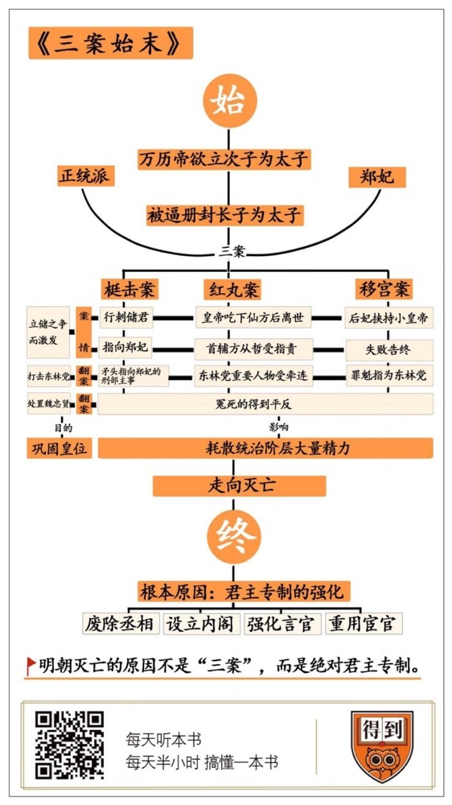

# 《三案始末》| 许诺解读

## 关于作者

温功义，出生于书香门第，年轻时就以才华闻名。他曾受过文学大师茅盾的指导，与许地山、戴望舒等名家有过交往。温功义饱读诗书，尤其擅长明史。几十年来，他一边过着闲云野鹤的隐居生活，一边将多年读史阅世的心得都汇聚到这本《三案始末》中。

## 关于本书

这本《三案始末》不仅厘清了明末宫廷三大奇案的来龙去脉，更揭示出了案件背后的政治图景和历史规律。围绕着三案所展开的权力斗争，以及案件展现出来的绝对君主专制制度，都是导致明朝灭亡的重要原因。书中的每个细节都有正史记载，杜绝了骇人听闻的野史传闻。同时，本书的语言明白晓畅，像讲故事一样娓娓道来，十分亲切。

## 核心内容

明末三案的本质，并不是是非之争，而是派系斗争。朝野上下，宫廷内外，无不牵涉其中。这些无休止的权力斗争，取代了财税、军事这些帝国命脉，成为统治阶级最为用心的事情。围绕着三案的斗争耗尽了明朝统治阶级的精力，成为压倒大明王朝这头骆驼的最后几根稻草之一。而在斗争背后，是明朝为了强化君主专制而采取的一系列制度安排：废除丞相，设立内阁，强化言官，重用宦官等。

## 前言

你好，欢迎每天听本书。本期为你解读的是《三案始末》，书中讲述了发生在明代晚期的三起宫廷大案。围绕着三案所展开的权力斗争，以及案件展现出来的绝对君主专制制度，都是导致明朝灭亡的重要原因。

这三起大案在当时的朝野上下掀起了阵阵风浪，皇帝，后妃，太监，百官，无不卷入其中，其中许多人还因此家破人亡。扑朔迷离的案情让明末三案，也就是“梃击案”“红丸案”和“移宫案”，成了地摊文学上的常客。但是长期以来，三案都被人们视为宫闱秘闻，真正深入的探讨却很少。作者温功义在这本《三案始末》中不仅厘清了三案的来龙去脉，更揭示出了案件背后的政治图景和历史规律。温功义这个人很有才华，他曾受过茅盾的指导，与许地山、戴望舒等名家有过交往。他饱读诗书，尤其擅长明史。他几十年来，一边过着闲云野鹤的隐居生活，一边将多年读史阅世的心得都汇聚到这本小书中。书中的每个细节都有正史记载，杜绝了骇人听闻的野史传闻。同时，他的语言明白晓畅，像讲故事一样娓娓道来，十分亲切。

接下来，我们就开始详细讲述这三起大案。首先让我们看看三案发生的背景，其次我们来看明末三案的余波和影响，最后我们来分析三起案件发生的根本原因。

## 第一部分

明朝晚期的宫廷中，暗流涌动。万历皇帝不喜欢皇长子朱常洛，而想立次子朱常洵为太子，这在当时已经是众所周知的事情。因为朱常洛是万历偶然临幸一名宫女后生下的，而朱常洵的母亲，是万历最宠幸的郑妃。但是在儒家文化中，关于谁能做太子、谁能继承皇位都是有一套明确规则的：正妻所生的孩子优先于其他妻子的孩子，这就是“立嫡”；如果正妻没有孩子，那年龄越大的就越有资格，这就是“立长”。万历的皇后没有孩子，作为长子的朱常洛理应继承皇位，而现在，皇上作为儒家礼教的最高代言人居然带头违反礼法，这成何体统。

为此，大臣们分成了三派：其中占大多数的是正统派，他们从维护礼法的立场出发，纷纷上书要求尽早册立皇长子朱常洛为太子；与此同时，也有一些投机分子，他们有意迎合皇帝和郑妃，并希望借此一步登天。除了这两派，还有一个骑墙派，他们人数不多，但大都位高权重，因此并不轻易站队，而是随着形势变化见机行事，保持着微妙的平衡。

万历皇帝年少时，对他的师父，同时也是大明朝的首辅张居正，可以说是言听计从，不敢违抗，也正因为如此，在他亲自掌权之后，就决心不再受臣子的摆布。对于正统派的要求，万历当然不肯答应，但也无法直接拒绝，于是只好采用拖延的办法。可是一拖好几年过去，也没有找到能够服众的理由去废长立爱。眼看着皇长子已经被拖成大龄男青年，万历无可奈何，勉强将朱常洛册封为太子。然而，立储的斗争非但没有平息，反而更加白热化了。郑妃和她的党羽越发卖力地想要扳倒太子，而正统派群臣们对郑妃等人的抵触也越发强烈。山雨欲来风满楼，三场大戏的帷幕就这样拉开了。

首先发生的，是梃击一案。万历四十三年，一个手持大棒的汉子趁着夜色闯进太子居住的慈庆宫，见人就打，在打伤了一个守门太监后被众人抓获。此案的核心争议点是：到底是郑妃授意刺杀，还是太子自导自演？是谁有这么大的胆子，敢于行刺当朝储君呢？从直觉上，行凶者背后最有可能是郑妃在指使，这里面的利害关系不用明说，大家都懂。但是仔细一想，会不会是太子朱常洛自己导演的一出苦肉计呢？一场失败的刺杀，对自己毫发无损，而郑妃就跳进黄河也洗不清了。在没有独立司法系统的明代，案情的审理变成了各方势力的角力，每一方都能从罪犯嘴里撬出自己想要的东西，事实因此而显得扑朔迷离。

几个刑部官员经过审理得出的结论是，犯人是个疯子，在老家受了委屈，来京城是为了上访伸冤的，闯进慈庆宫只是一个意外。犯人老家地方官的汇报，也与他们的审理结果吻合。但在正统派群臣看来，这不过是郑妃等人为了掩盖自己的罪行而编的故事而已。一个名叫王之寀的刑部主事偷偷审讯了犯人，得出的结论与前者大相径庭：此人不疯也不傻，而是被郑妃手下的太监收买，刺杀太子也是受他们的唆使。消息传出去，舆论大哗。刑部只好重新组织会审，得到的诸多线索，果然都指向郑妃。不过郑妃毕竟是万历皇帝的宠妃，她又是向万历哭诉，又是向太子求情，在求得谅解之后居然毫发无损地过关了。二十五年没有上朝的万历，带着太子面见了群臣，告诉他们此事到此为止，不要继续深究了。于是，在处决了一些小角色之后，轰动一时的梃击案暂告结束。

梃击案之后，就是红丸案。红丸案斗争的核心在于：是医疗事故，还是蓄意谋杀？这次，朱常洛没有了上一案中的好运气。万历皇帝去世之后，朱常洛顺利登基，但皇帝的宝座还没坐满一个月，他就不争气地病倒了。不过蹊跷的不是他的病，而是得病之后的治疗。先是太监崔文升给他开了泻药排毒，导致他腹泻不止。接下来，官员李可灼又献上了两颗成分不明的红丸，说是“仙方”。这两颗红丸下肚之后，朱常洛竟猝然离世。

朱常洛早年沉迷酒色，身体很差，当时医疗水平又有限，即使贵为皇帝，也经常依赖各种偏方来治病。明朝许多皇帝都长期服用所谓的仙丹，本来是想延年益寿，结果往往适得其反，所以朱常洛的猝死，并非一定是阴谋所致。但在朝廷中拉帮结派、互相斗争的大背景下，任何事情都会受到不同的解读。在立储问题上就形成的两派，从来都没有停下互相攻击，这下更是大有文章可做了。首辅方从哲受到群臣的指责，因为李可灼这个人就是他推荐给皇上的。郑妃也逃不掉众人的声讨，方从哲正是依附于她才做上的首辅，太监崔文升也曾经服侍过她。在巨大的压力下，方从哲不得不宣告退休，远离政坛，直到其他阁老出来说情，才勉强压住反对的声浪。红丸一案到此也算是告一段落了。

红丸一案尚未了结，又出了移宫一案，本案的主题是：抢夺皇帝，忠奸难辨。按照明朝宫廷惯例，乾清宫是皇帝专有的住所，只有皇后才有资格与皇帝在此同住。朱常洛的原配正妻早已去世，因此在他重病期间，他的一个侧室李选侍就跟着住进了乾清宫。但在朱常洛去世之后，这个李选侍却赖在乾清宫里不走了。她挟持了朱常洛的长子，也就是后来的天启皇帝朱由校，与群臣讨价还价，想给自己谋个太后的位子。而正统派大臣们坚持认为这不合礼法，拒绝让步。双方在乾清宫中对峙，甚至拉扯朱由校。直到朱由校登基的前一天，李选侍才心不甘情不愿地搬出了乾清宫。

移宫一案的案情并不复杂，但却有一个深远的后果。在忠奸难辨的环境中，昏聩懦弱的朱由校本能地认为，谁给自己找麻烦，谁就是奸臣，谁给自己排忧解难，谁就是忠臣，于是，一个名叫魏忠贤的太监获取了他的信任，并得以一飞冲天。在移宫案中，魏忠贤站在李选侍一边，为她出谋划策，与群臣结下了梁子。在那之后，他更是成为了朱由校打击东林党人的武器。

以上就是本次解读的第一部分，三案的背景和主要的案情。围绕着立储之争而日益激化的党争，是三案得以发生和扩大的土壤。太子遭遇刺杀，反而稳住了他的地位。新皇帝一命呜呼，尽管案情扑朔迷离，涉事者还是受到了惩处。群臣与后妃争夺小皇帝的过程，在小皇帝的心中留下了长长的阴影，为魏忠贤的崛起埋下了伏笔。

## 第二部分

在接下来的第二部分，我们将详细介绍三案的后续发展以及历史影响。随着时间的推移，这三起案件不但没有淡出人们的视野，反而越发走进聚光灯的中心，随着权力更迭，经历了两次大翻案。围绕着三案的斗争耗尽了明朝统治阶级的精力，成为压倒大明王朝这头骆驼的最后几根稻草之一。

第一次翻案的秘密，是魏忠贤打击东林党。所谓东林党，指的是一群出身江南的文官，因为其成员主要在东林书院讲学、谈论国事而得名。他们以儒家礼法为宗旨，是正统派大臣的中坚力量，在三案的斗争中出过很多力，也取得了相当大的战果。然而，这些胜利却只是暂时的，东林党的坐大让新上台的天启皇帝陷入了不安。他虽然是由大臣们拥立的，但继位之后，就像其他皇帝一样，他对文官集团总是以礼法约束自己感到极为不满。而魏忠贤作为一个太监，可以不受任何礼法的约束，打击教训那些不听话的大臣，为他换来一片清净，这是天启皇帝的小心思。而对于魏忠贤来说，打击东林党人，既是为皇帝分忧，也是一个铲除异己的好机会。

魏忠贤和他的党羽们进攻东林党的由头，正是给三案翻案。之前失势的各个派系纷纷开始要求重审三案。在魏忠贤的主持下，三案的结论全都来了个180度的大转弯：梃击案中，最先将矛头指向郑妃的刑部主事王之寀，反而被认定为幕后主谋，被投入监狱，受迫害而死，那些附和过他的人也纷纷受到论处；红丸案中，东林党的重要人物，如邹元标、高攀龙、李三才等人，都受到牵连；移宫案的罪魁，也被指为是东林党的杨涟和左光斗等人。通过给三案翻案，魏忠贤将东林党和文官集团中许多正直的大臣或是下狱，或是杀害，在朝野上下掀起阵阵腥风血雨。

然而，天启皇帝朱由校没活几年便撒手人寰，他的弟弟朱由检继位，成为明朝的末代皇帝——崇祯皇帝，三案也因此又翻了回去。这次翻案的本质，一言以蔽之，那就是崇祯皇帝要处置魏忠贤。在魏忠贤迫害东林党的过程中，东林党也试图进行反击，对魏忠贤的胡作非为多有弹劾，然而在天启皇帝的庇护下，魏忠贤不但没有被扳倒，反而越发强势，达到了一人之下、万人之上的地位。但随着新皇帝的继位，大权在握的魏忠贤对于崇祯来说，就是一个尾大不掉的祸患了。崇祯在才学和智勇上都比他哥哥强出许多，对于魏忠贤狐假虎威、打击异己的所作所为，他当然心知肚明。他也知道朝中有许多人对魏忠贤恨之入骨。他登基之后，弹劾魏忠贤的奏折果然如雪片般飞来。崇祯借着朝中大臣的呼声，火速查办了魏忠贤及其党羽，三案的结论也跟着翻了过来，冤死的大臣得到了平反和抚恤，被流放的人也被召回，官复原职。有了崇祯的支持，第二次翻案自然水到渠成。

不过，你可不要以为三案的反复到这里就结束了，事实上，只要各个派系的斗争还在继续，三案就免不了被拿来当成攻击对手的工具。直到北京沦陷后，在明朝残余势力组建的南明小朝廷里，因为三案而起的争执依然没有停歇，甚至引发内讧，让不同派系之间兵戎相见。三案的影响迁延数十年，直到南明朝廷覆灭，才算真的画上了句号。持续如此之久的明末三案，其影响也是深远而致命的，因为它们的本质并不是是非之争，而是派系斗争，朝野上下，宫廷内外，无不牵涉其中。无休止的权力斗争，取代了财税、军事这些帝国命脉，成为统治阶级最为用心的事情。

这些派系斗争所带来的结果是多方面的。对于皇帝来说，一个很好的效果就是，它保证了皇位的稳定。明朝二百七十多年历史中，既出现过严嵩这样强势的首辅，也出现过魏忠贤这样权倾朝野的宦官，但有意思的是，无论他们有多么煊赫，势力有多么庞大，都无法对皇帝形成真正的威胁，因为在他们之外，还有各种盘根错节的势力来制衡他们。无论你是正统派、投机派，无论是后妃还是太监，朝堂之上，宫廷之内，所有人都处于斗争中，从而形成了一种动态平衡。皇帝可以根据自己的心意，拉一派打一派，不让其中任何一支强大到威胁自己的程度。类似三案这样纠缠不清的宫廷大案，就成了派系斗争最好的抓手。

只不过，这些斗争耗散了统治阶层的大量精力，严重影响了行政系统的效率，让国家机器在面对内忧外患之时脆弱不堪。明朝原始的分权制衡有着巨大的缺陷，内阁、言官、太监等等系统之间的制衡过于繁复，以至于变成了无休止的扯皮。更重要的是，皇帝的意志才是这个权力天平上最大的砝码，他倒向哪一边，哪一边就会占据绝对的优势。在各派势力你方唱罢我登场的斗争中，所有人考虑的都是怎样合纵连横、攫取权力，如何提高行政效率、实现国家社会的良好治理就成了非常次要的问题了。明朝末年，农民起义此起彼伏，东北女真人的叛乱越演越烈，朝廷上下却像是把头埋进沙子里的鸵鸟，放着这些军国大事不去处理，一心投身于宫廷斗争。好不容易出现了孙传庭、袁崇焕这样的能臣名将，却又受到各种猜忌和排挤而无法施展才能。明朝的最终灭亡，就成了一个时间问题了。

以上是我们讲解的第二部分，明末三案的余波和影响。魏忠贤借着第一次翻案打击东林党；崇祯则把三案翻回来以收拾魏忠贤。这一来一回，波及甚广，朝廷上下都被折腾得筋疲力尽。无休止的派系斗争耗散了明朝统治阶层的精力，降低了国家机器的行政效率，是导致明朝灭亡的直接原因之一。

## 第三部分

如果继续深挖下去，明末三案以及此后绵延的派系斗争，其实也只是明朝绝对君主专制制度结下的恶果。明代废除丞相职位，皇帝大权独揽，这是其政治生态的底色，也是一切派系斗争的肇始。在最后一部分中，我们一起来认识一下三案背后，让明朝最终走向灭亡的绝对君主专制制度。

废除丞相这件事，可不仅仅是裁掉一个职位那么简单。丞相作为百官之首，拥有的权力相当之大，对君权也有很强的制约。朱元璋创立明朝之后，就深感丞相的存在对于自己的掣肘，在杀掉好几个丞相之后，他干脆永久废除了丞相制度，将决策大权全部收归己有，并因此而形成了一系列的制度后果。

首先是内阁制度的设立。偌大一个帝国里，军国大事千头万绪，一个皇帝即使有三头六臂，也处理不了那么多的政务。即使是像朱元璋这样精明强干的开国皇帝，也得把一些拟旨、批示之类的文书工作，交给一些学士或者讲官来做。这一职务类似于秘书，开始时既无定员，也没有定制，等到“靖难之役”后朱棣称帝，这一制度才确定了下来。这些学士的办公处所大多叫阁，比如文渊阁、东阁等等，于是这些人就被叫做阁臣，后来民间也把这些人叫做阁老。百官的奏章在呈送皇帝之前，内阁可以用黑笔在边上草拟意见供皇帝参考，这个叫做“票拟”，皇帝再用红笔亲自批阅奏章，这叫“批红”。

从这个流程上看，阁臣的权力还是很大的，尤其是阁臣中领头的那位，也就是我们常说的首辅，常常拥有与丞相相当的大权。当然，在大部分时候，阁臣与丞相相比，还是有一定差距的。首先，丞相有自己的府邸，府内有各种职位，俨然一个小朝廷，但阁臣只是几个孤零零的文官，为皇帝做些秘书性质的工作。再者，能做丞相者，必然是位极人臣，身居百官之上，而阁臣就不一定了，即使只是六七品的小官，只要得到了皇帝的赏识，或者是攀附上了宫里的红人，都是有可能入阁的。最后，宰相之职一般只有两人，而且还有主有次，因此权力很是集中，而阁臣通常少则四五人，多则七八人，最多的时候能超过十个，而且阁臣们也很难团结一致，他们为了争权夺利常常互相倾轧，难以真正制约皇帝的权力。

回到案情中来，我们不难看出，阁臣制度是如何分化百官、维系皇权的。在立储之争中，属于骑墙派的大多都是阁臣，因为他们既不能违逆万历皇帝，也不好得罪朝中的同僚百官，于是就只好见风使舵，相机行事了。在红丸案中，首辅方从哲本来就是因为攀附上郑妃才做的首辅，根基并不稳固，群臣一闹，他就只好挂冠而去了。内阁制度虽然一直延续至明朝的终结，但是其权责大小变化不定，它的兴废全看皇权的脸色。

另一个重要的变化在于言官制度。即使废除了丞相，朱元璋依然对大臣们不放心。他在此前各个朝代经验的基础上，设计了一套以监督、谏言为主要功能的言官制度。言官的级别不高，但是能够直接向皇帝上书，抨击弊政，因此在政坛上十分活跃。在朱元璋杀功臣、废丞相的过程中，深受儒家忠君思想熏染的言官群体起到了十分有效的助攻作用。但朱元璋没有料到的是，这群硬骨头的言官不但是制约权臣的利器，他们的舆论监督对于皇帝来说也是一种束缚。当明成祖朱棣夺取侄子帝位的时候，当万历想要废长立爱的时候，当魏忠贤只手遮天胡作非为的时候，冲在最前面反对的，往往就是这些言官。为此，最让皇帝、权臣和大太监们记恨的，就是那些跟自己过不去的言官。在三案中，许多言官挨了廷杖，坐了大牢，甚至丢了性命。

不过，这并不是说，言官制度真的有扭转乾坤、扶正天下的奇效。有些时候，他们对儒家礼法过于执着，甚至有些顽固不化，让本来有利于国家的改革胎死腹中。更多的时候，皇帝的大棒可以制服他们，权臣的封官许愿可以诱惑他们，不少言官成为权力斗争的马前卒。在三案中，不同派系的言官之间同样也是党同伐异，争斗不休。

还有一个更为重要的变化，是宦官受到重用。明代宦官的权势之大、为祸之深，在中国古代堪称一绝。其实这也是皇权加强的必然结果。一方面，即使有阁臣代为草拟意见，皇帝也很难有精力批阅那堆积如山的奏章，于是，给奏章“批红”的事情也慢慢交给太监们去做，皇帝就可以安心做个甩手大老板了；另一方面，皇帝对于群臣并不信任，需要通过种种非正式渠道来掌握百官的动态，约束他们的行为，这便有了锦衣卫、东厂西厂这些特务机关。尤其是东厂西厂，它们由皇帝的亲信太监负责统领，可以随意抓人，动用刑讯。掌握了如此大的特权，宦官们的跋扈可想而知。

重用宦官势必意味着皇权有旁落的风险，正因如此，在开国皇帝朱元璋留下的祖训中，他严格禁止宦官干政，甚至连让宦官读书识字都不允许。这个禁令一开始还得到比较好的执行，但到了明成祖朱棣时代，由于他是起兵造了侄子的反，得位不正，许多大臣都不肯顺从他，他在杀人立威之外，更觉得还是家奴性质的太监们好用，于是他不但让一些太监学习读书写字，批阅奏章，更把出使、镇守之类的要务交给太监们做，东厂设立之后，自然也是由太监负责。擅权的太监既给了皇帝偷懒的机会，又是给皇帝做一些脏活的“白手套”。

在三案中，我们也常常看到宦官的影子：梃击案中指使行凶的，是郑妃身边的宦官；红丸案中，宦官竟然可以给皇帝开药；在移宫案中，宦官们要么与群臣联手，要么给李选侍出谋划策，都起了不小的作用。在魏忠贤如日中天之时，朝中上下到处都是他的党羽。宦官对明代政治斗争的深度介入，可谓是贻害无穷。

从前面的回顾中，我们可以清晰地看到，明代的绝对君主专制制度是怎样衍生出了内阁制度、言官制度和强大的宦官体系。阁臣相比于丞相，权力大大下降，难以有效组织群臣，制约皇权。言官制度的强化，让明朝统治集团的内部斗争更加激烈。而过于强大的皇权给了宦官以干政的机会，贻害无穷。绝对君主专制虽然保证了君王一时的安宁，却也带来了无止境的派系斗争和王朝覆灭的必然命运。

## 总结

本期的解读就到这里，让我们再一起回顾一下这本书的精髓。万历中后期，朝廷的腐朽已经达到了极深的地步，各方面的矛盾也集中爆发：立储之争中，皇太子受到刺杀；新君继位刚一个月便暴毙而亡；后妃挟持小皇帝，与大臣们讨价还价……在接下来的天启、崇祯两朝，明末三案又两次翻案，波及无数。无休止的派系斗争耗散了明朝统治阶层的精力，最终导致了明朝的覆亡。而在斗争背后，是明朝为了强化君主专制而采取的一系列制度安排：废除丞相，设立内阁，强化言官，重用宦官。从这个层面上看，三案并非是明朝灭亡的原因，它们与明朝的灭亡一样，都是绝对君主专制所导致的结果。

撰稿：许诺

脑图：摩西

转述：宝木