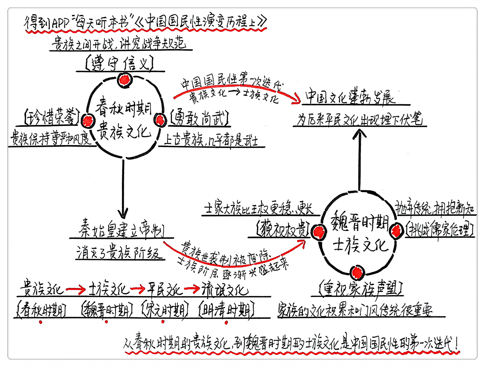
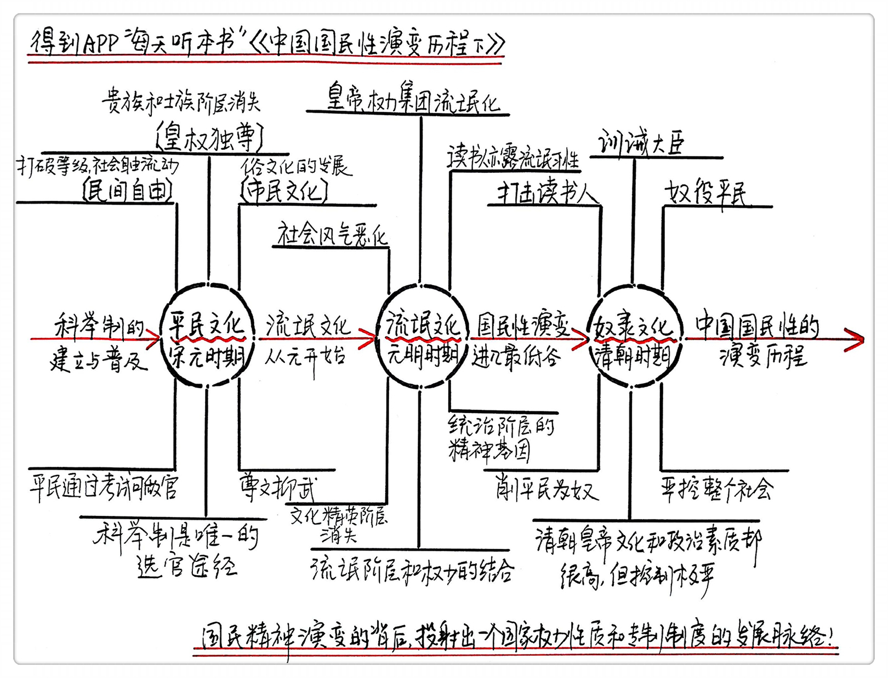

# 《中国国民性演变历程》Pro版 | 少文工作室解读

## 关于作者

张宏杰，清华大学的历史学博士后，师从著名历史学家葛剑雄先生。他原本是辽宁一家银行的普通工作人员，是中国民间著名的历史写手之一。作品有《大明王朝的七张面孔》《曾国藩的正面与侧面》《饥饿的盛世：乾隆时代的得与失》等，本本畅销。

## 关于本书

这是一本深入剖析中国国民性的书，与同类书籍相比，它没有满足于在抽象意义上谈论一般的国民性，而是在历史发展的宏观视野下，透视国民性演变的历史脉络，试图把握其中的规律，并且勾勒出这种演变历程和中国古代制度演进过程的因果关系，兼具历史的厚重感和纵深感。

## 核心内容

中国国民性并非一成不变，而是经历了从春秋时期的贵族文化、魏晋时期的士族文化、宋元时期的平民文化、元明时期的流氓文化，再到后来清朝的奴隶文化这五个发展阶段以及四次转折，每次国民性格的转换都和专制制度的发展具有直接的关系。

## 前言

你好，欢迎每天听本书。本期音频为你解读的这本书叫做《中国国民性演变历程》，这本书一共308页，我会分为上下两部分，一共60分钟左右的时间，为你说说这本书的精髓，揭示中国国民性演变的发展脉络，从春秋时代的贵族文化到魏晋时期的士族文化，再到宋元时期的平民文化，元明时期的流氓文化和清朝的奴隶文化以及每次国民性转换的内在逻辑。

我们先来听个故事。春秋时期，有一个著名战役“泓水之战”。讲的是宋国与楚国打仗，宋国军队列好了阵势，楚国军队渡过洪水来交战。宋国的军官对宋襄公说，楚国军队比我军人数多，我们应该趁他们正在渡河，马上发起进攻，那样楚军必败。可是宋襄公却回答说，不行，这样不符合战争规则，君子说敌人处于险地不能趁人之危，现在楚军正在渡河，我军就发起进攻，这样不合仁义。等楚军全部渡过河，列好阵，我们再进攻。结果楚军全部渡过河以后双方才开战。宋军因寡不敌众，落得大败，宋襄公也受了伤，第二年，悲惨地死去。

不知道你听了这个故事，会不会觉得宋襄公是愚蠢的？如果回到宋襄公所在的年代，你会发现，当时的人不但没有觉得宋襄公愚蠢，反而对他大加褒奖。比如，《史记》当中就这样评价宋襄公，说他虽然失败了，但是很多君子认为他值得赞扬，原话是，“宋襄之有礼让也。”宋襄公的形象是什么时候发生变化了呢？直到宋代苏轼写了《宋襄公论》，才开始以成败论英雄。当时苏轼明确指出兵败于楚，是宋襄公的最大罪过。到了现在，宋襄公的故事被写进了中学课本，不过可不是作为正面人物。那问题就来了，这同一件事，为什么古人的看法和现代人的评价会出现这样两个极端？今天讲的这本书就说了，这说明我们的国民性在漫漫历史长河中，发生了深刻的变化。

这本书的作者张宏杰是清华大学的历史学博士后，他的导师是著名历史学家葛剑雄先生。罗辑思维曾经推荐过好几本张宏杰的书，罗胖还说他是中国民间最著名的历史写手。他的历史读物可以说本本畅销。比如说《大明王朝的七张面孔》《曾国藩的正面与侧面》《饥饿的盛世：乾隆时代的得与失》等等。

既然这么高产，你可能会觉得他一定是个专职作家，其实还真不是。他的真实身份是辽宁一家银行的普通工作人员，原来只是业余时间写点东西在外面发表。但万万没有想到的是，他工作的这家银行的行长是他的忠实读者，后来才意外发现，原来自己崇拜的作者竟然是自己的下属，喜出望外之余，行长默许他一周只上一两天的班，其他时间就可以在家写作。由此可见，张宏杰的书写得有多精彩。今天我们要说的这本书，就是作者对中国国民性演变过程的一种探究，他发现，古代的中国人和现代的中国人似乎真的不是一个物种，按作者的话来说，从春秋到唐宋，再到明清，中国人的性格分别经历了贵族文化、士族文化、平民文化和流氓文化四个阶段，如同直跌下来的三叠瀑布，落差之大，让人惊讶。

在音频的上半部分，咱们就来聊聊春秋时期的贵族文化和魏晋时期的士族文化，包括它们形成的原因。明天再来说说平民文化和流氓文化。

## 上半部分

先说说贵族文化，它可谓是中国国民性的源头。我们经常听到一种观点，说你看人家西方，充满了贵族精神，我们的文化基因里就没有这个内容。其实并不是这样。作者说了，所谓的贵族文化主要表现在三个方面：第一，遵守信义；第二，珍惜荣誉；第三，勇敢尚武。在这三个方面，我们的古人其实一点都不逊色于西方人。

咱们先说第一点，遵守信义。西方有一个流传很广的故事。1688年，威廉三世征讨英国，从自己岳父詹姆斯二世手中夺取了王位。可是之后他又网开一面，故意在囚禁岳父的城堡前的大海上不设防备，让他岳父顺利乘船逃到法国。第二年，他的岳父就组织了一支精良的雇佣军在爱尔兰登陆。威廉三世不得不从英法战争中腾出手来对付卷土重来的岳父，虽然最后将詹姆斯赶回了法国，却因此在英法战争中失利。不过，似乎没有人因此批评威廉。人们经常拿这个例子来说明西方人遵守信义的贵族精神。

其实，倒不用光顾着赞叹西方贵族精神，咱们自己祖上就有这种贵族精神，开头提到的宋襄公，他的做法和这个威廉其实没有什么本质的区别。当然，你也可能会说，宋襄公只是个例，并不说明什么问题，真的只是个例吗？还真不是。这种讲究战争礼仪、遵守信义的情况其实在春秋时并不少见，《左传》中记载了宋国公子城与华豹之间的一场战斗。

双方相遇以后，华豹就准备好弓箭，向公子城射来，结果没有射中。华豹又重新搭箭上弦。公子城这个时候就不愿意了，对他大喊：“不要再射了，我们打仗不都是双方一人一箭吗？你射了我一箭，现在应该我射你一箭才对啊，你不守规则，太卑鄙了！”结果你猜怎么着，华豹听说以后竟然真的放下弓箭，老老实实的等公子城搭弓，结果可想而知，华豹就这样被射死了。而且当时的人觉得他这样做是以生命维护了武士的尊严。可见，当时宋襄公还真不是一个人在战斗。他这种把遵守信义看得比生命还重要的人还有不少。

《论语》里不也是说嘛：“君子无所争。必也射乎！揖让而升，下而饮。其争也君子。”（《论语·八佾》）翻译过来，意思就是：君子没有什么可争的事情。如果有所争，一定是射箭吧！相互作揖然后登堂；走下堂来，然后喝酒。那一种竞赛是很有礼貌的。

所以说，古代中国贵族之间打仗，还是很讲究战争规范的。比如，不能攻击已经受伤的敌人，不能擒获须发斑白的敌人，敌人处于险地，不能乘人之危，敌人陷入困境，不能落井下石，敌军没有做好准备，不能实施偷袭。你看，咱们古代也是有贵族精神的，拿来和欧洲的故事比较，也丝毫不会逊色。好，这就是我们说的贵族文化的第一个特点，遵守信义。

除了遵守信义，贵族文化还有一个很重要的地方在于贵族在任何时候都要保持尊严和风度，就是珍惜荣誉。1793年1月21日，法国大革命正值高峰的时候，路易十六和皇后都被送上了断头台，而皇后在上断头台的那一刻，不小心踩到了刽子手的脚，她下意识地说了句：对不起先生。你看，贵族文化的首要特质就是优雅，而此刻她的丈夫路易十六，面对杀气腾腾的刽子手，留下的也是一段坦然的遗言：我清白死去，我原谅我的敌人，但愿我的血能平息怨恨的怒火。可见贵族对自己荣誉和风度的珍视。几分钟后，路易十六和皇后便身首异处，两个世纪后，时任法国总统的密特朗在纪念法国大革命200周年的庆典上曾真诚表示，路易十六是个好人，把他处死是件悲剧。

其实，珍惜荣誉这一点在我们春秋时期同样也经常发生。比如最著名的孔子的学生子路，他在战争中阵亡，但临死前做的最后一件事竟然是系好被对手砍断的帽缨，正冠而死。有人可能说这是教条。其实，从另一个角度理解，国民性演变之后的国人已经完全无法理解春秋时期贵族精神对于仪表和荣誉的珍视了。好，这是我们说的贵族文化的第二个特点，珍惜荣誉。

除了遵守信义和珍惜荣誉，贵族社会还有一个特征就是特别崇尚勇敢。俄罗斯几乎每个贵族都会把孩子送去当兵，沙皇也经常御驾亲征。《战争与和平》这本小说里，就有这个画面，贵族安德烈将要走上战场抵抗拿破仑的侵略，他的父亲老公爵对他说：记住，儿子，你要是战死了，我会痛心，但如果你的行为不像我儿子，我会羞耻。最后安德烈在战场上负伤而死。

春秋时期的贵族也特别崇尚武力。上古贵族几乎都是武士，贵族男子也都以当兵为职业。所以古代六艺一定会有射箭这个科目。商鞅变法那个时代是奖励军功以破除爵位的世袭，楚康王继位五年没有战事，竟然认为是自己重大失职。这在今天可能也是难以理解的。这种尚武的精神一直影响了后代很久。一直到唐朝都还是这种风尚。比如李白十五学剑术，一射两虎穿。下马能饮酒，上马能杀敌。很向往建功立业，所以边塞诗很发达，好男儿当马革裹尸还。

不过后来，这种尚武的精神到了宋代以后就慢慢消失了。为了皇权的巩固，赵匡胤还限制武将的权力，贬低武官的地位，把武将排除在最高权力机关之外。为了在这个官僚体系当中形成一种激励机制，在官僚制度设计当中文官升官相当容易，而武官的晋升非常的缓慢，而且武将晋升当中比文官凭空多设了许多等级。所以武官见了文官总是自觉低人一等。与此同时，宋太祖还颁布了一条法令，京都士人和百姓均不得私蓄兵器。所以，整个宋代社会普遍就是一个扬文抑武的朝代。正是因为宋朝对武力的这种贬抑，所以导致中国人在历史上第一次不再以立功疆场为荣耀。

宋朝有人说了这么一句话叫“做人莫做军，做铁莫做针”。也就类似现在说考过司法考试却不要做律师一样。有人甚至说，即使是率兵数十万收复幽径十六州，也赶不上一个状元及第时候的荣耀。所以宋代男人开始失去了尚武精神，不再锻炼身体强健体魄立功疆场马革裹尸，而是沉醉在案头书牍之中，浅吟低唱。

所以，这个宋代男人越来越不男人，宋代人的性格越来越细腻，所以整个民族，就开始朝文雅方向发展，中国在一次又一次的对外战争当中经常败下阵来。宋代的文人很少到边塞去领略风沙，相反却充满了婉约。比如说最著名的“柳岸晓风残月”，凡是有这个市井之处必然能听到柳永词。所以宋代的这些文人慢慢的开始变得“为赋新词强说愁”。这个文艺青年可以说从宋代才开始慢慢的新生。所以，宋朝你看即便画画也不会画什么牡丹苍鹰，而是梅兰竹菊，都很婉约。

说到这我们总结一下，所谓的贵族文化主要表现在三个方面：第一，遵守信义；第二，珍惜荣誉；第三，勇敢尚武。在这三个方面，我们的古人其实一点都不逊色于西方人。但很可惜，春秋时代的贵族精神到了后来就慢慢衰落了，和西方的贵族精神开始分道扬镳，走上了另外一条截然相反的道路。你可能会觉得奇怪，这到底是因为什么呢？

作者说，主要的原因就在于，贵族阶层在西方一直保留了下来，一直延续到17世纪，而中国的贵族社会在公元前3世纪就已经基本消亡了，难怪我们现在想在社会里找那种真正的讲究教养和礼仪的贵族气质，并不容易呢。你可能又会问了，我们的贵族社会为什么会比西方早消失两千年呢？这是个好问题。我们结合这本书的内容给你慢慢掰开了、揉碎了说啊。

西方贵族阶层之所以能够延续，主要在于他们分家的方式，他们实行的是长子继承制，因为爵位和财产都没有办法一分十份继承下去。公爵不可能是十个儿子继承以后，个个是公爵，它只能传递一个儿子。有了爵位就必须有与之相配套的土地和财产，所以长子继承制就发明出来。这样也保证了贵族家族的财产能够保持高度的稳定。

但是中国社会不同啊，秦始皇在建立皇帝制度以后，就必须要彻底消灭贵族阶级。梁启超曾经说过，贵族是对皇权最有效的制约。秦始皇当然害怕了。因为相对皇权，贵族是多数，能防止专制的弊端，所以秦始皇的思想就是，全力的打击贵族，消灭贵族阶层。他使用的方式，不是西方的长子继承制，而是要求富家大族尽量分家。你可能听说过非常有名的一句话“民有二男以上不分异者倍其赋”，说的就是秦朝征税的方式，意思就是一家人有两个男人以上如果不分家的话，就要加倍征收赋税，而且秦始皇不再任用贵族当官，而训练大批的技术性官员。

这样就扫平了皇权和底层社会之间的一切障碍，把皇权拓展到了每一个细胞，每个人都平等的成为皇帝的奴隶。你看，我们实行的正好是和西方完全相反的继承制度，所以，这样把财产一分再分，哪里还有贵族阶层存在的经济基础了？就这样，中国的贵族阶层和与之相伴而生的贵族精神就开始消亡了。

现在我们可以对刚才提到的贵族社会做个系统总结。中国古代，尤其是春秋时代，和西方呈现出非常类似的贵族文化的特质，具体体现在三个方面：遵守信义、珍惜荣誉和勇敢尚武。但是，由于失去了阶层存在的经济基础，中国的贵族精神没有得以延续。因为中国社会，在秦始皇统一中国的时候，就提前进入了大一统的社会，所以，基于统治的需要，必须要通过分家等制度消灭贵族阶层，让皇权直接面对平民。而西方因为长子继承制的影响得以一直保留了贵族制度。所以，中国贵族比西方要早消失两千多年。

说完了中国社会的第一个阶段，贵族社会，接下来，我们聊聊中国社会的第二个阶段：士族社会。

贵族社会并不会一夜之间就消亡，贵族的确是没有了，官位爵位也不能世袭了，那接下来会怎样发展？平民社会的土壤还没有出现。因为，当时还没有发明公务员考试制度，还没有到隋炀帝发明的科举制出现的时候，那怎样选拔国家官员？汉代虽然是刘邦一介平民建立的社会，但强大的历史惯性决定了汉代不可能一步跨入平民社会，汉代发明的“荐举制”由此开始登上历史舞台。什么叫荐举制呢？所谓荐举，就是地方官推荐地方上的人才来当官。

你想啊，那地方官在荐举人才的时候，当然要从自己最熟悉的上层社会朋友之家寻找。每个人社会交往阶层不一样，熟悉的人当然是自己同层次的人。这就导致一个结果，官位基本上就被上层社会垄断，很少有老百姓当官的例子，阶层之间形成一种非常封闭的不流动的状态。

有人统计两汉地方官推荐人，也就是“举孝廉”一共一百八十四个人，其中出身官员贵族和地方豪强之家的占到了百分之七十五以上。一方面，官位都是由皇帝任命，不再是贵族继承。另一方面。荐举制又导致皇帝和平民之间的一个新的士族阶层，虽然高级官位不再是世袭的贵族，但是却由上层社会垄断，而下层社会人才很难跻身上层社会。中国社会开始出现贵族精神第一次下行，出现了整个社会的士族文化面貌。

门第从此是决定一个人社会地位的最重要标准，后来所说的“朝为田舍郎，暮登天子堂”，基本不可能在这个阶段出现。别说底层百姓了，就是中小地主在当时都是不入流的，一律划入庶族，也就是所谓寒门。士族和庶族之间是不通婚的，甚至都不能坐在一起。整个社会阶级固化非常严重。所以，尽管贵族世袭的制度被废除了，但士族社会其实还是一个半世袭的社会。

说起士族文化，最典型的当然还是魏晋时期。我们都知道有一句话叫做魏晋风度。这个时代的士族文化有三个重要的特点，重视家族声望、藐视权贵、挑战儒家伦理。我们接下来一个一个说。

第一个就是重视门第的选官途径。刚才已经说了，科举制还没有发明，而贵族世袭制又被废除，国家官僚体系怎么产生？当然就只能靠推荐。荐举制、九品中正制都是相关的制度设计。当时底层社会的教育还并不普及，大家知道孔子为什么是伟大的教育家吗？不仅仅因为他有很多精彩的思想，最重要的是他最早建立了民间教育体系，民办大学，有钱没钱都能跟他学习，这是最伟大的贡献，可毕竟孔子就这一个，教育资源在很长一段历史时期内都是被上层社会垄断的，结果就是只有上层社会比较有文化教养。

曾经有大臣问魏孝文帝说，为什么选官的时候那么重视门第呢？孝文帝说，大户人家的子弟就算没有什么特别突出的才能，但是长期受家族的教育和熏陶，通识礼仪、熟悉典章制度，当起官来应该更有优势。所以，就形成了路径依赖，贫寒子弟就越来越没有机会。所以大家看一下当时整个士族社会选拔人才，靠的根本都不是官员政客权力交易。

当时社会还没有买官鬻爵到这样一个地步，当时主要还是靠家族的声望，国民性还并没有堕落。一个家族的文化积累和门风传统是评价一个人的最重要标准。比如说北大的学风很好，所以北大学生的就业门路就比较宽，大概就是这样一个感觉。所以士族为了传承家族的精神，那么对家族教育非常的重视，世家大族为了保持自己的文化优势，殚精竭虑制造了各种各样的家戒家训门律门范，家长辞世的时候又会留很多的遗言遗律。所以像这样的家书家训，在魏晋南北朝时期就会特别特别的兴盛。

南北朝集大成者《颜氏家训》就是士族家族教育经典，所以为什么家训在南北朝时期特别流行，和这个是有很大关系的。所以总结一下，士族文化的第一个特征是，重视家族声望，在士族社会里，既然没有贵族阶级的世袭制度，出身家教森严的豪门大户就变得十分重要了，平民仍然没有机会登上历史舞台，整个社会的阶层基本都是固化的。

士族文化的第二个特征就是蔑视权贵。你可能知道魏晋时期有个人叫嵇康，是竹林七贤之一，他是出了名的藐视权贵。跟他同时期有个人叫钟会，他身出名门，二十九岁时就已当上了关内侯。关内侯是第二等爵位。钟会对嵇康敬佩有加，但是嵇康却拒绝和钟会交往。

《世说新语》这本书里说：钟会年轻时写完《四本论》一书，希望让嵇康指点下，可又怕嵇康看不上，情急之中，竟然跑到嵇康家门口，离得远远地，把书往院子里一扔，转头就跑。钟会声名显赫之后曾经再次造访嵇康，但嵇康仍然不加理睬，继续在家门口的大树下打铁，一副旁若无人的样子。钟会觉得无趣，正准备离开。嵇康在这个时候终于说话，他问钟会：“何所闻而来，何所见而去？”钟会回答：“闻所闻而来，见所见而去。”两个都是聪明人，嵇康的行为已经表明了不合作的态度，传说钟会因此对嵇康记恨在心，后来终于找了个机会把嵇康搞死了。嵇康临死前还弹了一曲《广陵散》，叹曰“广陵散于今绝矣”。后从容赴死。

为什么这个时代的很多文人敢于蔑视权贵，而且是一个普遍的现象？作者分析说，魏晋南北朝时期整个社会处在大动荡大变革的时代，在皇权不断更迭的这个背景之下，社会上的世家大族却保持了相对的稳定性。很多士族的富贵远远胜于皇族，虽然朝代更迭但社会势力是固定的，这也导致了天子只能和士族分享权力，有的世家大族甚至可以罢黜天子。他们文化教育好，然后又有自己的政治特权，同时经济方面有独立的庄园经济，所以在各个方面都可以和皇权平分秋色。比如东晋时候就有“王与马共天下”这个说法，在整个中国历史上，可以说唯一能够和皇权分庭抗礼的，就是魏晋南北朝时期的士族阶层了。

总结一下，士族社会的第二个特点，藐视权贵。魏晋时期，这个大一统的政治秩序被打破，很多的旧门人借这个门第的资本，就不再去对权力俯首帖耳，反正你这个皇帝换来换去的，可是我们一直都是世家大族、大户人家呀！所以，王权就变得不再具有权威，士家大族反而就变得更加有独立性，所以才会产生他们蔑视权贵这样一个社会风气。

接着这个原因，接下来的第三点挑战儒家伦理就好理解了。我们都知道，魏晋时期的文人是很蔑视儒家那一套礼教的，这一点和春秋时期截然不同。比如竹林七贤刘伶、阮籍、嵇康这些人。这个刘伶非常喜欢喝酒，他在当官期间，有一次突然来了兴致，竟然在官邸脱光了衣服一丝不挂的喝酒，有几个客人来访，他也不赶紧把衣服穿上，还继续光着身子喝。客人见他如此不雅就讥笑他，可是他却一本正经地反驳说：“天地就是我的房子，房子就是我的衣裤。你们进我的房子就是钻到我裤裆里来了，谁让你们钻进来？”不但不羞愧反而讥讽别人，为什么魏晋时期会形成竹林七贤这样放浪形骸，而不再受礼教约束的这样一种文人性格？就是因为当时政治权威崩溃，所以当初所确立的独尊儒术，这个儒家也就不可能再是唯一的价值体系。

可以说，魏晋时期是人类历史上在春秋战国时代之后，第二个价值失范礼崩乐坏的时代。既然儒家学说不能一统天下，谁都不愿意去信。而且，由于没有什么政治前途可以追寻，所以让当时的文人开始思考人生的意义。他们认为活生生的生命不应该被伦理教条束缚，儒家就被人们踩在脚下，所以人们追求心灵的自在和真性情的释放。这样竹林七贤纵酒谈玄，放任洒脱就在这个时代成为国民性的主要标识。所以在这样一个时期，这个玄学自然就获得了当时文人的青睐。

所以总结起来，士族社会的第三个特点，是挑战儒家伦理。魏晋时期，既然政治权威变得一点都不权威，反而是士族比皇权更加稳定，哪还有什么可以一统天下的意识形态啊，所以，各种思潮都开始百花齐放，儒家伦理受到挑战，名士大部分都要冲破礼法，率真自得，怪诞放任这种意识，表明他们要抛弃传统儒家哲学中过于固执的道德说教，用自己的生命意志支配行为。所以，也只有魏晋时期才会产生竹林七贤这样的奇葩。这个时候的社会虽然已经没有了贵族，但文人身上还是保留了很多贵族气。

咱们现在可以对士族文化做一个总结，魏晋时期应该说是中国文化的一次蓬勃大发展时期。政治上衰落，经济上凋敝，但文化上却无比辉煌。这个阶段发展到顶点的士族文化具有非常明显的几个特征：首先，是重视门第出身的选官途径。其次，是蔑视权贵的时代精神。第三，是挑战儒家伦理的士人风貌。如果说中国社会第一次大动荡，春秋战国催生了先秦诸子的文化盛世，那么中国社会的第二次大动荡时期魏晋南北朝，也见证了中国国民性由贵族文化到士族文化的第一次迭代，并且为后来平民文化的出现埋下了伏笔。

## 总结

上半部分内容就说到这里，咱们做一个简单的回顾。按照这本书的观点，我们国家的国民性格经历了春秋时代的贵族文化到魏晋时期的士族文化，再到宋元时期的平民文化以及明清时期的流氓文化的演化过程。

在最早的春秋时代，当时的贵族阶级重视名誉，勇敢尚武，而且人特别遵守信义，整个社会都充满了贵族精神，但是秦始皇建立的皇帝制度却要求在制度上消灭贵族阶级，这样一来，就在之后的魏晋时期催生出一种以门阀世家为代表的士族文化。因为世袭制度已经被废除，而凭借考试成绩选拔官吏的科举制度还没有被发明出来，所以，以出身、门第和联姻决定个人前途的门阀制度就成了主要的社会现象。老百姓仍然没有任何改变出身的上升通道，阶级固化比较严重。因为当时政权不稳，更迭频繁，而士族大家反而相对稳定，所以形成了士族阶层普遍蔑视权贵，冲破儒家伦理教条的一种社会风尚。既然没有了统一的意识形态，玄学、佛学等各种思想开始大量涌现，成了春秋时代以后第二个文化大繁荣时期。

下半部分我们会讲讲士族文化是如何过渡到宋元时期的平民文化，并进而在明朝彻底堕落为作者所形容的流氓文化之中的。

## 下半部分

欢迎回来，我接着为你解读《中国国民性演变历程》的下半部分。详细说说宋元时期的平民文化、元明时期的流氓文化和清朝的奴隶文化以及它们之间的转换逻辑。

先说说宋朝时期形成的平民文化。讲到宋元时期的平民文化，可能你会有个疑问，为什么平民文化是在宋代形成的呢？科举制不是隋朝就发明出来了吗？那个时候，老百姓就可以通过科举改变社会地位啊，为什么要到宋朝才形成平民文化呢？

任何文化的转换都不可能是一蹴而就的。比如秦末刘邦项羽之争，最终虽然代表平民文化甚至是流氓文化的刘邦打败了代表贵族文化的项羽，但贵族文化也不可能一下就过渡到平民文化，总还是要有一个过渡，所以在汉代就发明了荐举制，贵族文化借尸还魂，这才形成了士族文化。同样，尽管科举制在隋朝就已经被发明出来，但“百足之虫，死而不僵”，汉代荐举制的做法还有强大的历史惯性，也不可能一夜之间突然消亡。

所以，隋唐时期基本上还是一个半世袭的士族社会，门第出身还是非常重要，很多官二代还是可以根据父亲、祖父的身份，直接被授予官阶。而且，隋唐教育还不算普及，不像宋代到处都是民间书院，只有世家大族才有机会受到良好教育，就算放开科举，实际上考上的也没有几个贫寒子弟。客观上科举制度在隋唐两代也不可能成为当官的主要途径，为什么“一人得道，鸡犬升天”这种民间俗语恰好在这个时代出现，这绝不是偶然的，其实讲得就是出身的重要。

但宋代就不一样了，社会阶层开始流动了，科举也正式成为选官的主要甚至是唯一的途径了。只有这个时候，老百姓才真正掌握了改变命运的机会，可以进入上流社会并进而影响整个国民性格。宋代有一个神童，王安石非常欣赏，叫王洙，他写了一首诗，有两句特别有名，“朝为田舍郎，暮登天子堂”，讲的就是一个农民通过科举一夜之间改变命运的故事。而且这种事情在当时非常普遍。

听到这里，你可能又会问：为什么科举制偏偏在宋代成了当官的主要途径呢？那是因为赵匡胤本人特别担心自己的臣民和自己一样发动陈桥兵变，篡夺权位，所以对整个社会都加强了控制，尊文抑武，把所有其他功名利禄的途径全部关闭，要想当官必须皓首穷经，在书房里看书，通过文字而不是通过刀枪进行竞争，把整个民族的读书人的注意力都集中在背参考答案上，也让社会各个阶层可以通过考试自由流动，从而打消他们叛乱的动机，这样就能更好地控制社会，所以，宋代统治者对科举制相当地重视。只要不是残疾的人，都可以参加考试。如果你穷到没有办法筹集路费，国家还会给你发放补贴，资助你考试。

貌似开放的唐朝却做不到这一点，那个时候，如果你出身不好，甚至连考试资格都没有。李白不就是因为自己家很有钱，社会地位低贱，没有资格参加科举，才被迫走上了网红道路嘛。所以，你看，不要以为唐朝是个平民社会，科举制只是个摆设，唐代的进士平均每年就二三十人，宋代翻了十倍，每年两百多人。宋太宗在位时，科举入官者达到了近一万人。而且，北宋71名宰相中，科举出身的竟然多达64位。既然在宋代，读书就能改变命运，谁还会去造反啊？所以，能够改变底层百姓命运的科举制会让一个社会变得更加稳定。

正因为如此，国学大师钱穆才会把宋代看作中国历史一个非常重要的分水岭，他认为，秦朝以前是贵族社会，宋代以前是门第社会，而宋代以下开始成为纯粹的平民社会。所以，“就宋代言之，政治经济，社会人生，较之前代，莫不有变。”孙国栋在《唐宋之际社会门第之消融》这篇文章里也说：这种转换不仅是阶级消融的过程，也是社会组织转换的过程。

所以，总结一下，尽管隋朝就发明了科举制，但任何文化的转变都需要一个过程，直到宋代科举制才真正成为唯一的选官途径，宋朝统治者为了防止兵变，对整个社会都加强了控制，尊文抑武，取得功名利禄只能通过科举考试当官，所以，宋代平民才真正有机会通过考试进入上流社会，并最终形成一个阶层流动的平民社会。

那么这种平民文化有哪些特点呢？按照张宏杰先生在这本书里的说法，主要有以下几个方面：

第一，皇权独尊。我们上一期节目说过，秦始皇建立皇帝制度以后，第一件事就是消灭了贵族阶级，希望直接面对平民，但因为历史惯性太大而没有实现，反而出现了一个很庞大的和政府相抗衡的士族阶层。但宋代就不一样了，政治权力高度统一，再也没有世家大族和皇帝抗衡了，所以，宋代皇帝才可以对政治制度进行大幅度修改，而不会遇到什么阻力。所以，宋代我们就很少听说过皇权受到威胁的故事，权臣、外戚、宦官好像都没怎么听说过。这是第一个方面的影响，贵族和士族阶层的消失导致皇权独尊。

第二，民间自由。宋代以前，中国社会等级极为森严，以唐朝为例，说出来可能大家都难以想象。唐代实行里坊制，什么叫里坊制？就是城内每一里见方的街区就用高大的夯土坊墙围起来，所以，长安城有个大围墙，进到城里以后，还有一百多个封闭的小城墙，你以为骑匹马就能在长安城内撒足狂欢？想得美啊！你刚骑一会，就得经过一个小城墙，又得下来牵着马走，为什么要这样呢？还不就是为了有利于国家控制。这叫“虽有暂劳，奸盗永止”。意思是，麻烦是麻烦了点，可我还不是为了你好，以后咱们长安社会治安就好了啊。

这还不是最不方便的。唐代长安城内是不允许随便开设超市小卖部的，买东西必须到固定的两个市场，国家批准的东西二市，也就是东市和西市，也是围起来四米厚的高墙。咱们现在说的“买东西、买东西”，“东西”这个词就是从这里产生的。想象一下，如果你在家炒菜炒到一半没有酱油了，只能到东西二市去买，下楼可是买不到的。为了一瓶酱油来回走上十二里地，你会喜欢这样的生活节奏吗？唐代看起来开放，实际上对民间的控制是非常严格的。

但宋代就不一样了，别的不说，就拿《清明上河图》来说，汴梁那是多么的繁华，而且商铺林立，一览无余，根本没有什么几米厚的大城墙、小城墙，整个社会弥漫着浓厚的生活气息，和唐朝比起来，真的感觉更自由，更平等，很多人天天唱《梦回唐朝》，如果你知道了这个生活细节，估计你会和历史学家汤因比一样希望回到宋代。

还有，在宋代国家不再把人通过阶级，户籍固定在一个地方，人口开始大面积流动，所以，之前中国社会出现的所谓游侠，还都是很个体化的，但宋代开始就出现了江湖世界。原本分层的固定等级秩序被废除了，契约化的租佃制关系，较宽松的户籍制度，城乡分治的行政体系，平民徭役的废除以及科举制度的复兴，都赋予了宋代平民远远超过前代的人身自由，为这种流动性创造了条件。整个社会第一次成为一个相互流动的平面。

部分人群通过在江湖世界的不断迁移，创造了属于自身的社会维度，比如抢劫商旅和富翁的匪徒，江湖武侠世界也是宋代以后才开始出现，比如水浒传里梁山好汉智取生辰纲的故事。这是第二个平民文化的影响，打破了森严固化的社会等级，整个社会开始自由流动，既有纵向的阶层流动，也有横向的地域流动，从而使得社会更加充满生机。

第三个特点是市民文化。因为民间教育的普及，宋代民间书院非常之多，平民百姓接受教育之后，通过科举不断涌入上层社会，富于生活气息的底层文化与高雅的上层文化开始大面积接触。雅俗之间就没有了所谓严格的界限，中国文学终于开始在宋代开了以口语化为标志的民间语言写作的先河。成书于明朝的《水浒传》其实就是根据宋元时期的话本改编而成的。这种市民文化一直影响到了后来的中国社会。以元朝为例，大家看中国文学史，就会发现元代文化出现一个重大的转型，在唐宋时期一直处在主流地位的诗歌散文，到了元代一下子就失掉了主要优势。突然一下，下层文化和俗文化开始取代了雅文化成为主流，这当然和异族统治，蒙古人不了解和不推崇汉族文化有密切的关系。

汉族精致的上层文化诗词歌赋对蒙古人没有吸引力，他也欣赏不了，就像我们听不懂古典音乐一样，但是汉人的俗文化还是能欣赏。比如宋朝开始的白话小说，这些东西蒙古人是能懂得。最能吸引蒙古人的是戏台，蒙古人就算汉语不熟，也能看懂戏的内容，所以后来的很多文人为了讨好蒙古人，就写很多迎合他们口味的作品。正是这样，元朝的戏曲才能获得空前繁荣，当时的整个蒙古人审美观对元杂剧产生了深刻的影响，读书人既然不能参加科举，当然会大量投身于剧本创作。平民文化进一步占据了文化的主流地位。这是第三个方面的影响，宋元时期平民文化促进了俗文化的发展，更为平民喜闻乐见的白话小说和戏剧艺术开始出现。

说到这，宋代的平民文化就讲完了，我们来总结一下，宋代科举制成为唯一的选官途径，宋朝统治者为了防止兵变，对整个社会都加强了控制，尊文抑武，取得功名利禄只能通过科举考试当官，所以，宋代平民才真正有机会通过考试进入上流社会，并最终形成一个阶层流动的平民社会。平民文化有三个特点，第一是导致皇权独尊，第二是产生了民间自由，第三是促进了市民文化的发展。接下来，我为你讲解中国国民性演变的第四个阶段，流氓文化。

平民文化是怎样过渡到流氓文化的？这是一个非常重要的问题。张宏杰先生这本书里写到了很多原因。我帮你总结了以下这么几点：

第一点，中国文化精英阶层的消失。1276年，中国大宋王朝被掀翻，蒙古铁骑一直踏上了海南岛，从此建立了元朝。汉民族几十年的抗元战争，带来了一个最可怕的后果，汉民族最精英的人物被消耗掉了。比如说我们都非常熟悉的文天祥赋诗而死，陆秀夫负幼帝蹈海而亡。有句话叫“崖山之后无中华，明亡之后无华夏”，意思是说，中华文化受到了毁灭性的打击，中国的脊梁已经被打断，中国的精神已经灭绝。忽必烈就曾经发出疑问，说汉人每天在那里吟诗对唱到底有什么用啊？所以他们在屠城的时候就会要求保留工匠的生命，但是从来没有说要保证这些读书人的性命，所以在元朝战争当中大量的文化典籍就被毁掉了，名臣儒士也被残杀，精英文化阶层都消失了。

元朝建立以后，出于对汉族文化的畏惧心理，统治者切断了汉族士大夫的人生前途，科举制一度被取消，而且很多官必须由蒙古人当。所以当时汉族知识分子的地位第一次从“四民之首”跌到了“十丐九儒”的地步，十个乞丐当中有九个都是儒生。这是平民文化向流氓文化转换的第一个原因：中国精英文化的整体消亡。

第二个原因，统治阶层的精神基因。不得不说，元明时期的统治者在整体文化素质上是远逊于之前的宋朝和之后的清朝的。张宏杰先生在这本书里就用了“流氓气”这三个字来概括明朝的精神风貌。这话一点也不夸张。就拿皇帝来说，就没见过整体素质这么低端的一个皇帝群体。朱元璋出身流氓咱就不说了，看看他的子孙们，身上哪有一点贵族之气？比如，建了故宫，修了永乐大典的朱棣，有一次，大臣汇报说他的政敌的女儿们被糟蹋怀了孕，问朱棣怎么处置？朱棣竟然说那就养着，长大了做妓女，保准是个摇钱树。你看看，这哪里像个一国之君啊。活脱脱一个市井流氓的嘴脸！

这还不算啥，明朝还有个皇帝叫朱厚照。流氓皇帝是他的专有标签。在位短短十几年，收了一百多个流氓做义子。在扬州到处追逐处女和寡妇。他的继承者明世宗则是性变态，公开要大臣们进献春药，有时候一天临幸数十人。明朝官员以向皇帝进献房事秘术来争宠，胡宗宪因贪污被指控后，“献秘术十四，帝大悦。”“楚王好细腰，国人皆饿死。”一个国家统治阶级都是这个德性，你想想，这个国家还能好到哪里去？这是平民文化向流氓文化转换的第二个原因，统治阶层的精神基因开始迅速流氓化。

第三个原因，是流氓阶层和权力的结合。刚才说了，元朝作为异族，是不会信奉儒家纲常礼教的，统治阶级自己道德水平就不高，再加上又没有自己一套意识形态，儒家礼义又被废弃不用，结果全国上下道德水平迅速滑落，社会风气持续恶化，可以说是中国流氓化的整体开端。元代杂剧当中，泼皮无赖、贪官污吏、权势豪要、地痞流氓就成了主要角色。整个元代的社会风气极为落后和低下，儒家的纲常学说不再起到对社会的凝聚作用，所以手足相残、妯娌成仇、杀夫夺产、借货吓人，嫌贫毁亲等等，都是元代杂剧的主要情节。

你肯定听说过《窦娥冤》，虽然它反映的是东汉年间的民间故事，但是毕竟是元朝关汉卿所写，所以就夹杂了很多地痞流氓贪官污吏的情景。其中的主要角色张驴儿就是个流氓。元代流氓开始慢慢的进入官场，越来越多的汉人由于他们的社会地位极为低下，走不了正路就走邪路，所以就选择了攀附权贵。元代政治本来是以严格的种族区分为原则，但是由于每个等级的权力差别实在太大，比如当时规定汉人不能充任禁卫军，但是禁卫军又有种种特权，所以很多汉人就千方百计的钻营其间。

元代出现了流氓阶层和专制权力之间的高度结合，这个流氓就成了专制权力的工具和打手，慢慢的攀附官员权贵为他们办事儿、替他们驱使，所以慢慢的出现了一个特殊的土豪恶棍阶层。而在他们之下，又是那些充当打手的无赖流氓。当时元代的泼皮无赖多到连元朝皇帝都不得不专门派人研究对流氓横行的处理意见。有人说培养贵族需要三代，其实培养流氓也只需要三代，结果三代以后，中国人整体上的精神层面就开始流氓化，这就为明朝整个成为流氓王朝奠定了一个基础。

明朝这种情况不但没有好转，反而更加恶化，流氓化程度更深了。连读书人都会显露出流氓的习性出来。陈宝良写的《中国流氓史》中记载了明代一则笑话：凡市井之人相争斗，则曰，我雇秀才打汝！再比如大家都很熟悉的明代小说中最有名的人物西门庆，就是底层社会精英流氓化的典型代表。他虽然不过是破落商人之后，又不怎么读书，但因为有流氓手段，因此在地方上十分吃得开，通过行贿，买通了当朝太师蔡京，就轻而易举地由一介流氓变成一个暴发户。这种人在当时可绝对不在少数。

结果，上行下效，皇帝、权力集团都流氓化了，这老百姓还等什么？再讲究礼义廉耻就活不下去了。所以，民族性格就产生了一个非常可怕的转化。可以看看明朝流传开来的一些民间俗语，比如，要钱没有，要命一条，有钱就是爹，有奶便是娘。虱多不痒，债多不愁。这些俗语非常能够反映当时整个国民的精神风貌。二十世纪初，少年胡适到上海求学，在新式学堂里，他的历史课本是著名作家霍桑所写的《世界通史》，他发现，厚厚一本书中，只有两页介绍中国，而这两页中，关于中国人的习俗，霍桑是这样写的：“中国人都是骗子，嗜于行骗……”

这就是平民文化向流氓文化转化的第三个原因，就是流氓阶层和专制权力的高度结合。讲到这里，我们来总结一下第二部分内容，宋朝之后，汉族经过几十年的抗元战争，整个精英阶层消耗殆尽，元朝统治者层次很低，统治阶层的精神基因开始迅速流氓化，上行下效，社会风气持续恶化，也导致流氓阶层和权力的高度结合。所以说，元朝是中国国民性流氓化的整体开端。

中国国民性演化到明朝的流氓文化是不是就到了尽头了呢？还没有，我们下面来说说清朝。你看，首先，清朝皇帝政治素质都很高，这一点和流氓化的明朝皇帝简直没有可比性。其次，清朝皇帝文化素养也很高，这一点元朝统治者又无法望其项背。清朝的皇帝如饥似渴地学习汉文化，清朝皇子的教育制度可以说是中国古代最为严厉的，每天四点就要起床诵读四书五经。所以，你可能会觉得，清朝中国的国民性似乎一改之前一路下行的发展趋势，开始出现了某种程度的回光返照。

但实际上，张宏杰先生认为，结论恰恰相反，中国国民性经由贵族文化、士族文化、平民文化、流氓文化，而最终演化为清朝深入骨髓的是一种奴隶文化，成为中国国民性演变过程中的最低谷。为什么这样讲？因为贵族文化的对立面不是平民文化，而是奴隶文化。因为平民文化尚可以讲究独立人格，但奴隶文化之下，贵族精神里强调遵守信义、珍视荣誉和勇敢尚武的精神内核都完全被抽空，而丧失起码的人格尊严。

比如，满族占领北京的第二天，就发布了剃发令，要求汉人把受之父母，不敢毁伤的头发剃掉，留发不留头、留头不留发，进京这年年底，他们又开始大量圈地，汉人无缘无故被从土地上赶走，从土地的主人变成满族人的奴隶。不仅如此，为了将整个社会都纳入自己的严密控制体系之下，清朝统治者连儒学的人格追求，也作为打击对象。

清代皇帝就认为，一个大臣如果过于注重自身修养，过于在乎自身的名誉，就会妨碍他全心全意地为皇帝服务，妨碍他成为一个听话的奴才，为了彻底把大臣改造成奴才，雍正皇帝甚至提出一个重要观点，那就是大臣们不但不能图利，也不能好名，否则就很可能招来杀身之祸。这在清朝绝不是偶然现象，久而久之，很多大臣干脆不做思想者，只做执行人，按这本书说法，就是成为一个有才干，有风度，没思想，没坚守的奴才。春秋时期讲究人格尊严、珍视荣誉信义的贵族精神到了这个时候，才算完成了一次彻底的堕落。

对于奴隶文化这个部分，这本书并没有做过多的展开，我也就简单地介绍到这里。

## 总结

讲到这里，这本书的总体脉络已经梳理得差不多了，我们可以再做一个整体的回顾。

中国的国民性并非一成不变的，而是经历了从春秋时期的贵族文化到魏晋时期的士族文化，再到宋元时期的平民文化以及元明时期的流氓文化和清朝奴隶文化的一个演进过程。

这期间，每一次转换的逻辑都和中国社会的权力性质和专制制度有着密切的关系。比如，第一次从贵族社会到士族社会的转换，就是因为秦始皇建立了皇帝制度，需要废除贵族阶层；第二次从士族社会到平民社会的转换，就是因为科举制的建立和普及，造成了社会阶层的自由流动；第三次平民社会到流氓社会的转换，则主要是因为统治阶级的精神基因以及专制制度对流氓阶层的利用。

我们可以很清楚地看到，国民精神的演变并不是一个孤立的现象，它的背后其实投射出的是一个国家权力性质和专制制度的发展脉络。用一句简单的话来概括就是，有什么样的权力，就会有什么样的国民。所以，面对明朝流氓化的国民性格，我们也不用感到惊讶，法国学者贡斯当讲得就特别透彻：“专横的权力毁灭道德，因为缺乏安全感当然就不会讲道德了。”所幸，大国崛起的今天，我们的国民性又呈现出了一种截然不同的历史风貌，不过，这又是另一个话题了。

撰稿：少文工作室

脑图：摩西

转述：成亚