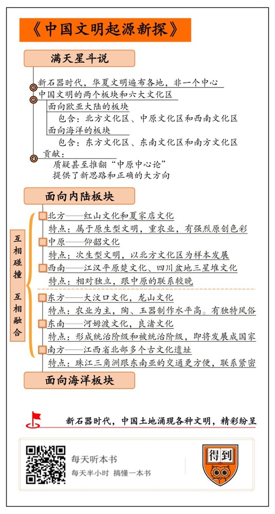

# 《中国文明起源新探》| 唐骋华解读

## 关于作者

苏秉琦，中国著名考古学家，有“考古学泰斗”之称。早年毕业于北平师范大学历史系，1952年在北京大学创立了中国第一个考古学系。苏秉琦主持过多项重要的考古发掘，并以毕生精力探索中国文明的起源，力图重建中国上古史。代表作有《苏秉琦考古学论述选集》《华人·龙的传人·中国人——考古寻根记》《中国文明起源新探》等，并主编多卷本《中国通史・远古部分》和《考古学文化论集》。

## 关于本书

《中国文明起源新探》最早于1997年由商务印书馆（香港）有限公司出版，2000年三联书店推出大陆版。这部著作可以看作苏秉琦的绝笔。书中，苏秉琦总结反思了一生的考古经验，以颠覆性的论述，阐述了自己对中国文明起源的思考，对考古学界、历史学界，甚至其他领域都产生了巨大影响。

## 核心内容

长期以来，主流观点认为，中国文明起源于黄河中游的中原地区即“中原中心论”。然而二十世纪七八十年代以来的考古研究证明，这个说法不靠谱。实际上，在新石器时代，中国各个区域都涌现出璀璨的古文明，从北到南、由东而西，随处可见。如果把中华大地比喻成天空，那么，这些古文明就是空中的星星，它们争奇斗艳，散发着夺目的光芒。这就是“满天星斗说”。经过数千年的变迁，这些散落在各处的星星，逐渐吸纳到地理优越的中原地区，交流融合。在这个基础上，诞生了中国最早的三个王朝——夏、商、周。中国文明，也就在这个过程中慢慢形成、成熟。

## 前言

你好，欢迎每天听本书。这期为你解读的是一本考古学著作，书名叫《中国文明起源新探》。

中国文明起源于黄河流域，这可能是很多人的“常识”了。但在这本书里，作者基于考古发现，对这个老问题，给出了一个新答案。他纠正了过去那种过分夸大中原古文化、贬低周边古文化的“中原中心论”，认为中国的文明起源其实是“满天星斗”。也就是说，在新石器时代，中国这片土地上涌现出了各种不同形态的文明，精彩纷呈。

既然作者要反驳的是“中原中心论”，我就先给你简单介绍一下这个说法。按照中原中心论的思路，中国文明起源于黄河中游，随后向周边扩散，最终传遍了整个中国。这个说法是怎么来的呢？1921年，瑞典考古学家安特生，在河南仰韶村发现了一处远古文化遗址，遗址里有许多石器和陶器，距今约6000年。这意味着在很早以前，这片区域就有人类生存，而且这些人已经掌握了一定的技术，发展出比较成熟的文明。因为遗址位于仰韶村，所以这个文明被称作“仰韶文化”。

在之后的几十年里，考古学家们又发现了大量仰韶文化遗址，而且这些遗址基本都在黄河中游一带，所以当时的人们认为，仰韶文化是中国最早的文明。相应的，黄河中游就被认定为中国文明的发源地，“中国文明起源于黄河中游”的说法也被正式提出来。由于黄河中游跟中原地区基本重合，所以，这种说法又被叫做“中原中心论”。

然而，随着考古工作的推进，新材料不断出来，考古学家发现，并不是黄河流域才有古文化遗址。实际上，东北、四川、长三角、珠三角等地都发现了古文化遗址，可以说是遍布全国各地。它们的历史不比仰韶文化短，取得的成果也不比仰韶文化低，有的甚至出现得更早。于是从20世纪七八十年代起，越来越多的考古学家和历史学家，对中原中心论提出了质疑，有的还尝试重新解释中国文明的源头。《中国文明起源新探》的作者苏秉琦，就是其中最有代表性的一位。

苏秉琦是中国现代考古学家，1909年生在河北，1997年在北京逝世，享年88岁。他在北京大学创立了中国第一个考古专业，一生都致力于考古研究。在考古学界，苏秉琦有“泰斗”之称，这本《中国文明起源新探》是他的绝笔。在这本书里，苏秉琦总结反思了自己一生的考古经验，推翻了“中原中心论”，进而提出“满天星斗说”来取代它，阐述了自己对中国文明起源的看法，对考古学界、历史学界，甚至其他领域都产生了巨大影响。

下面我们就来说一说，这本书究竟讲了什么？我会分成三部分来讲。首先，什么是“满天星斗说”。然后，按照这个说法，我们应该如何解释中国文明的起源。最后结合最新的考古成果探讨一下，今天，我们应该怎么认识和理解“满天星斗说”？

## 第一部分

首先需要确定一下年代，就是“满天星斗”这个现象，出现在什么时代？苏秉琦把它限定在新石器时代。考古学上的新石器时代，开始于大约1万年前，结束于距今约5000年前。在这5000多年的时间里，人类文明取得了重大突破：人类以石头、泥土为原材料，制作了越来越多的器具，特别是各种形式、各种色彩的陶器，成为新石器时代的标志；农业和畜牧业也出现在这个时期，人类学会了种植小麦、大麦、扁豆、豌豆等农作物，驯养猪、狗、牛、羊等家畜。从此，人类摆脱了四处漂泊、寻找食物的命运，过上了定居生活，依靠农业和畜牧业维持生存，扩大生产，这为文明的快速发展，准备了条件。所以在全世界各个地区，都出现了人类文明。反映在考古学上，新石器时代的文化遗址非常多，呈爆炸性增长，它们的文明水平，也比从前上升了一个台阶。

中华大地上同样如此。在新石器时代，中国各区域都涌现出了璀璨的文明。如果把中华大地比喻成天空，那么，这些文明就是挂在空中的星星。它们争奇斗艳，争相散发着夺目的光芒，这就是“满天星斗说”。它的具体含义是，在新石器时代，各种类型的古文明，遍布在今天中国版图上的各个地方，从北到南、由东到西，几乎随处可见。

看到那么多星星，你是不是有一种数都数不过来的眩晕感？如果把这个时期的文化遗址一个个罗列出来，什么仰韶文化、红山文化、河姆渡文化、良渚文化……就更令人晕头转向了。

好在，苏秉琦根据这些文化的特征和发展道路，进行分门别类。他把中国新石器时代的文化遗址分成了两大板块，一个是面向欧亚大陆的板块，一个是面向海洋的板块。这两大板块，每一个又都包含三大文化区，合起来总共是六个。这六大文化区构成了中国文明的基本盘。你看，这样一划分，思路就清楚多了吧。

## 第二部分

那么，这六大文化区是如何分布的呢？它们又是怎样塑造了早期的中国文明呢？下面讲的第二部分，我们就跟随苏秉琦的思路，去做详细的了解。

我们先来看面向内陆的板块。顾名思义，这个板块位于中国内陆地区，如果站到更高的层面，它属于亚洲腹地。就是说，这个板块跟中亚、西亚的交流比较多。起源于中东的古老文明，也是通过这条路与中国文明发生关系的。

面向内陆的板块又可以分成三个文化区，北方文化区、中原文化区、西南文化区。其中的中原文化区，前面说过，在黄河中游，是发现仰韶文化的地方。这里，我们不再做详细介绍，我们重点来看看北方文化区和西南文化区跟中原的关系。这个关系，简单地说，北方文化区是原生态的，它深刻影响了中原文化区。而西南文化区相对独立，它跟中原的联系，开始得比较晚。

从留存的古人类遗址中，能很明显地看出这种有趣的关系。例如，北方文化区发现了红山文化和夏家店文化，这两个古文化遗址，分布在内蒙古、辽宁和河北的交汇地带，包括今天的北京和天津。从时间上看，红山文化大约出现在五六千年前，比夏家店文化早一两千年，所以可能是它的前世。

考古学家发现，在这两个古文化里，农业都占据重要位置，人们靠农作物生存，饲养家畜作为辅助。这说明人们已经开始定居，生活变得稳定。而且越到后期，定居就越普遍，所以形成了很多村落。比如，辽宁喀左县已发现300多处古村落遗址，比现代居民点还要密集。这表明农业水平有了较大发展，能养活更多人口。

同时，考古学家还发掘出许多陶器、铜器、玉器，甚至是青铜器。我们知道，在古代，青铜器是身份和地位的象征，只有统治阶层才有资格使用。青铜器的出土，说明北方文化区在几千年前就形成了等级制度，有上层社会，有底层社会。根据这些线索，苏秉琦推断，北方文化区已经超越了原始社会，发展成国家，至少是国家的雏形。这在时间上，要比中原地区出现得早。

所以苏秉琦认为，北方文化区属于原生型文明，具有强烈的原创色彩。而一直被当做文明源头的中原文化区，其实是次生型文明，是在北方文化区影响下，以北方文化区为样本发展起来的。就是说，中原地区的仰韶文化，很可能是受北方文化区的影响，而成长、成熟起来的。苏秉琦的这个观点，对中原中心论无疑是沉重一击。

而另一个文化区，也就是西南文化区的考古发现，对中原中心论的挑战就更大了。西南，包括江汉平原和四川盆地两部分。江汉平原位于湖北省中南部。它的古文化以本土文化为主，外来因素只占少数。那么，江汉平原的本土文化是什么呢？苏秉琦认为是楚文化。

我们以为的楚国，是周代的诸侯国之一，但实际上，在被册封前，楚国独自发展了很长时间，和中原没有太多交集。例如，江汉平原发掘出几千个楚国墓地，它们的风格、随葬器具，和中原地区很不一样，有鲜明的楚文化特色。楚国这种独立性持续的时间相当长，而且非常顽强。一直到秦国统一天下，楚地仍然不服，这才有了“楚虽三户，亡秦必楚”的说法。意思是就算楚国只剩下三户人家，灭亡秦国的，也一定是楚国。果然，最终推翻秦朝统治的项羽、刘邦，都是原先的楚国人。

江汉平原的西面是四川盆地。远古时候，这是一个神秘地区，因为它四面环山，交通不便、环境封闭，形成了独特的文明形态。其中最引人注目的，就是三星堆。一般认为，三星堆文明起源于5000年前，延续了约两千年。三星堆出土了上千件青铜器、玉器、金器，它们的造型引起了人们的强烈兴趣。例如大立人青铜像，高2.6米、重180公斤，头戴高帽、相貌奇特，外形和东亚人非常不一样。在中国的其他文化遗址里，没有与之相似的。那三星堆究竟是本地的，还是外来的？这个问题，考古学家还在探索中，但可以肯定，中原文化区对它的影响很小。

到这里，面向欧亚大陆的板块就讲完了。你有没有发现，即便在同一个板块里，中原文化区都不算顶级大咖？以此类推，它对另一个板块的影响，也不会太大。

那么下面，我们就来说面向海洋的板块。这个板块在中国的沿海地区，也包含了三个文化区，从北到南排列，依次为，东方文化区、东南文化区和南方文化区。

由于受中原中心论影响，长期以来，这三个文化区的重要性被忽视了。人们以为，它们是在中原文化的熏陶下发展起来的。但是，半个世纪以来的考古成果，推翻了这种偏见。我们首先以东方文化区为例，它的中心区域在今天的山东省，根据考古发现，这个地方，在新石器时代就出现了两个有传承关系的古文化。

第一个是大汶口文化，距今约6000年，跟中原的仰韶文化几乎同步。在它之后，崛起了龙山文化，距今大约4000年。这两个古文化，都以农业为主，而且在陶器、玉器的制作上达到了很高水平，它们甚至发展到了铜石并用阶段。什么叫“铜石并用”呢？就是说石头仍然是主要的工具，同时，人类又初步学会了开采铜矿、冶炼铜器，所以开始使用铜器。这是新石器时代发展成熟的重要标志，接下来，随着青铜冶炼技术的提升，人类将进入青铜时代。

有意思的是，东方文化区还有一些独特的风俗，比如，人长到青春期的时候，要拔除一对牙齿。这在其他的中国史前文化中很少见。这说明，东方文化区有自己的风俗，绝对不是一句“受中原文化影响”就能概括的。

东南文化区同样如此。这里的东南，以长江下游和太湖为中心，包括安徽、江苏、浙江和上海。东南文化区的古文化遗址非常密集，其中最具有代表性的有两处——河姆渡文化和良渚文化。

河姆渡文化在浙江余姚河姆渡镇，最新的考古成果，把它的时间上限推到了7000多年前。这个资历可比仰韶文化还老。当然，河姆渡文化之所以重要，不只是因为它的资格。考古学家从河姆渡遗址中找到了大量的古代稻壳，这就说明，这个地区的古人，是把水稻当作主食的，这和以小麦为主的北方农业不一样。由此，导致了北方和南方在饮食习惯、风俗传统及生活方式上的显著差异。所以说，南北文化差异在远古时期就形成了。

另外，河姆渡文化的制陶技术，以及在陶器上绘制的图案，跟北方也不同。综合上面好几个特点，苏秉琦认为，河姆渡文化起源于东南本土，不是从中原传过来的。

比河姆渡文化晚出现的良渚文化，同样起源于东南本土。从生产力水平看，良渚文化已进入农业阶段，除了水稻，人们还种蚕豆、花生、芝麻等农作物。手工业也有一定发展，丝麻织品、象牙制品十分普遍。从社会结构看，良渚文化形成了社会等级制，有了贵族和平民的区分。考古学家发现，贵族的墓地宏大、精致，相反，平民的墓空间狭小、装饰简单。随葬品也很能说明问题：贵族的随葬品是玉器，并且越是重要人物，随葬的玉器种类越多、质量越高；平民的墓地里通常只有小型玉器，或者根本没有。我们知道，在古代，玉是主人身份、地位的象征。良渚文化对玉的使用有着严格规范，说明它形成了统治阶级和被统治阶级，即将从原始社会发展成国家。

最后来看南方文化区。它的地理范围，按照苏秉琦划定，从鄱阳湖流域到珠江三角洲，包括今天的江西、福建、台湾和广东。以前学者们认为，这片区域开发得比较晚，所以称它为“蛮荒之地”。但是1962年，考古学家在江西省北部发现了好几个古文化遗址，研究表明，这些遗址也诞生于新石器时代。至于珠江三角洲，它的古文化是不是独立起源，还不好说。不过，在古代，珠江三角洲跟东南亚的交通更方便，所以历史上，闽南和广东跟东南亚有着紧密的联系，受到的影响反而比中原地区更大。

到这里，两大板块、六个文化区，就都介绍完了。你可能会产生一个疑问：既然大部分文化区都是独立起源的，具有鲜明的本土特色，那么，它们是怎么汇聚成“中国文明”这片灿烂星空的呢？

这就要说到中原文化区的作用了。有必要强调下，苏秉琦质疑的是“中原中心论”，他认为中国文明诞生在黄河中游，然后向四周扩散这种说法，简单粗暴，不符合历史。但是，苏秉琦并没有否定中原地区在中国文明形成过程中的作用。

这个作用是什么呢？简单地说，中原地区像个大熔炉，文明不断涌进来，在里面互相碰撞、互相融合。我们所说的中国文明，就在这个过程中慢慢成形、成熟。打个形象的比方，古文化的星星汇聚起来，构成了中国文明这个灿烂星空。

中原地区之所以能起到这样的作用，和它的地理环境是分不开的。中原主要在今天的河南省西部，尤其是洛阳到郑州一带最为重要。摊开地图就会发现，这片区域的位置十分特殊：它的周围是崇山峻岭，只有中间一大块是平原，有着丰富的自然资源，适合发展农业。相比山区，平原的交通也方便得多，有利于贸易往来，聚集人气和财富。

然后我们惊奇地发现，中国的六个文化区，都是按照这个地理特点分布的。就是说，中原文化区被其他五大文化区围绕着，它是中心区域。所以古时候，中原地区有一个很牛的称呼：天下之中。天下的中央。

这样的地理位置带来了一个重要的影响，那就是，四面八方的文化都可以进来，因为从高处往低处走总是更容易一些。反过来，中原文化要跨过高山传到外面去，就有些困难。所以苏秉琦认为，根据这个地理条件，中原地区很难产生独立的文明，即便产生了，也容易被外来文化打断。而且，闯进来的外来文化不止一种。

我们以中国最早的三个王朝，夏、商、周为例。这三个王朝的统治中心都在中原文化区，然而，苏秉琦说它们都是“外来户”。夏朝人可能是从东南来的，商朝人可能来自东北，周人的发源地本来被认为是周原，即今天的陕西宝鸡，但新近的研究表明，可能还得往西面找。虽然夏商周的具体起源至今没搞清楚，不过可以肯定的是，黄河流域不是它们的老家。以此类推，比夏商周更早的仰韶文化，可能也不是在中原土生土长的。就算是，它的文明水平之所以发生了实质性飞跃，也是受到了其他文化的强烈影响。

尽管夏商周的统治者都是外来户，但是，它们在中原地区扎根，利用这里丰富的自然资源和优越的地理条件，不断提升自己的文明水平，并且最终，超越了原始社会，发展出了更高级的文明形态——国家。其中，周朝的作用又是最大的。为什么这样说呢？我们知道，夏朝和商朝，并不是秦汉那样的统一大帝国，它们的有效统治区域，局限在中原地区，对其他文化区的影响力，比我们想象的要小很多。一直到武王伐纣，周朝推翻了商朝，情况才发现了根本性变化。

周朝建立后实行分封制，就是把王室成员、功臣分到全国各地，在那儿建立诸侯国。其中有不少地方，从前并不受商朝的统治，所以这个分封的举动，相当于拓展领土。在这个过程中，六个文化区被纳入到统一的国家当中。具体来说，中原地区是周王室的核心区域，北方文化区建立了燕国；东方文化区建立了鲁国和齐国；东南文化区建立了吴国和越国；西南文化区的一部分，即江汉平原，建立了楚国，楚国后来又将南方文化区纳入到版图中；西南文化区的另一部分，即四川盆地，后来被秦国征服，成为中国文明的组成部分。

这样一分析，中国文明的起源和发展过程就比较清晰了。首先，在新石器时代，中国在东西南北各个方向，都诞生了发达的古文化。它们汇聚到中原这个大熔炉，交流融汇，形成了中国最早的国家——夏、商、周。这些王朝，利用丰富的资源和优越的地理条件，凝聚了强大的实力，反过来，把周边地区的古文化，吸纳到自己的国家组织中。中国文明，也就在这个过程中逐渐形成、慢慢成熟。这就是“满天星斗说”的完整含义。

## 第三部分

你可能要问了，苏秉琦的这个观点，到底有没有道理？这也是我们最后要延伸补充的内容：今天，我们应该怎么认识和理解“满天星斗说”呢？

首先我们要知道，《中国文明起源新探》这本书，是苏秉琦对20世纪70年代以前中国考古研究的总结和反思。那个时代，因为技术手段的局限，苏秉琦主要是根据出土陶器、青铜器来研究古文化遗址的，这必然有不足的地方。现在二十多年过去了，考古技术得到了很大提升，促成了很多新的考古发现，所以这本书里的一些说法，有必要做一些调整。其次，“满天星斗说”的贡献，是提供了新思路和大框架，在细节上肯定有不足的地方，苏秉琦对文化区的划分也不一定准确。尽管如此，“满天星斗说”依然有它不可替代的价值。

第一，它质疑甚至推翻了“中原中心论”。这本书出版前，主张“中国文明起源于黄河中游”的“中原中心论”，还是考古学界和历史学界的主流观点。“满天星斗说”出来后，对学术界产生了巨大冲击。学者们意识到，中原中心论确实简单粗暴，很多事情都解释不了。特别是最近二十年，中国考古不断出现重大进展。例如，考古学家对东南文化区的良渚文化有了更完整、更深入的了解，有学者提出，良渚文化已经上升到国家阶段，不再是原始社会。如果这个说法成立，将意味着东南文化区比中原文化区更早地迈入国家阶段，文明层次更高，那样的话，“中原中心论”就更站不住脚了。当下，“满天星斗说”已经得到了考古学家和历史学家的广泛认同，大家的思路是一致的。

第二，满天星斗说的大方向是正确的。苏秉琦的两个板块、六大文化区，究竟该怎么划，存在很多争议。但是整体而言，“满天星斗说”指明了一条路。其实，苏秉琦的观点并不孤独，比他更早的著名考古学家张光直就提出了“相互作用圈”的概念。张光直把中国新石器时代的文化分成七个部分，它们各自起源，相互影响，最终汇聚成中国文明。所以中国文明具有“多元一体”的特点。另一位著名历史学家许倬云，也很早就对中原中心论进行了质疑，他认为中国文明是“不断变化的复杂共同体”。值得一提的是，对张光直和许倬云的研究，苏秉琦晚年是知道的。他的“满天星斗说”，应该也受到他们的启发。因此可以说，苏秉琦、张光直和许倬云这三位学术大咖，思路是一致的。

近些年，“满天星斗说”又有了新的进展。考古学家许宏主持二里头遗址的发掘工作长达18年，他结合最新考古成果，把中国文明的起源分成三个阶段：满天星斗、月明星稀和皓月当空。满天星斗是沿用了苏秉琦的概念，指的是在新石器时代，全国各地都涌现出文明社会，璀璨夺目、热闹纷呈。之后，中原地区出现了文化发达、实力强大的政权，并最终建立起夏、商、周这样的王朝。中原王朝就像月亮一样，映照天空，许多独立的文明被它吸纳，天空变得“月明星稀”了。而等到秦国统一天下，汉朝巩固了中央集权制，夜空中就只有明晃晃的月亮。这就叫“皓月当空”。

可以看出，许宏的这个观点是对“满天星斗说”的细化和深化，也是后一代的考古学家，对前辈学说的继承和发展。这也表明，时至今日，“满天星斗说”依然有它的生命力，能够给年轻学者带来启发。

## 总结

《中国文明起源新探》到这里就讲完了，最后我们再来总结一下这本书的几个要点。

首先，我们说了什么是“满天星斗说”。考古证明，在新石器时代，黄河流域、长江流域、四川盆地、山东半岛、长江三角洲及珠江三角洲，都发展出了各自的文明。它们就像天上的星星，遍布中华大地的各个区域，璀璨夺目。

接着，我们具体说了中国文明的两个板块和六大文化区。这些文明，可以分成两大板块，每一个板块各自包含三大文化区。面向欧亚大陆的板块，它包含的文化区有北方文化区、中原文化区和西南文化区；面向海洋的板块，它包含的文化区有东方文化区、东南文化区和南方文化区。

说完了这几个文化区，我们又重点说了中原文化区的作用。中原文化区恰好被另外五大文化区围绕，它就像个大熔炉，各种文化聚集在这个熔炉里相互碰撞、互相影响，逐渐产生了中国最早的三个王朝——夏商周。这些王朝凝聚了强大的实力后，向外拓展，逐步把另外五大文化区吸纳到同一个国家组织当中。我们今天所说的中国文明，也就在这个多种文明互相融合的过程中，成形、成熟了。

最后我们说了“满天星斗说”的当代价值。虽然在细节上存在着一些错误，但大方向是正确的。随着中国考古学的不断进展，越来越多的证据表明，它比中原中心论更合理，更能解释中国文明的起源。

撰稿：唐骋华

脑图：摩西

转述：李璐