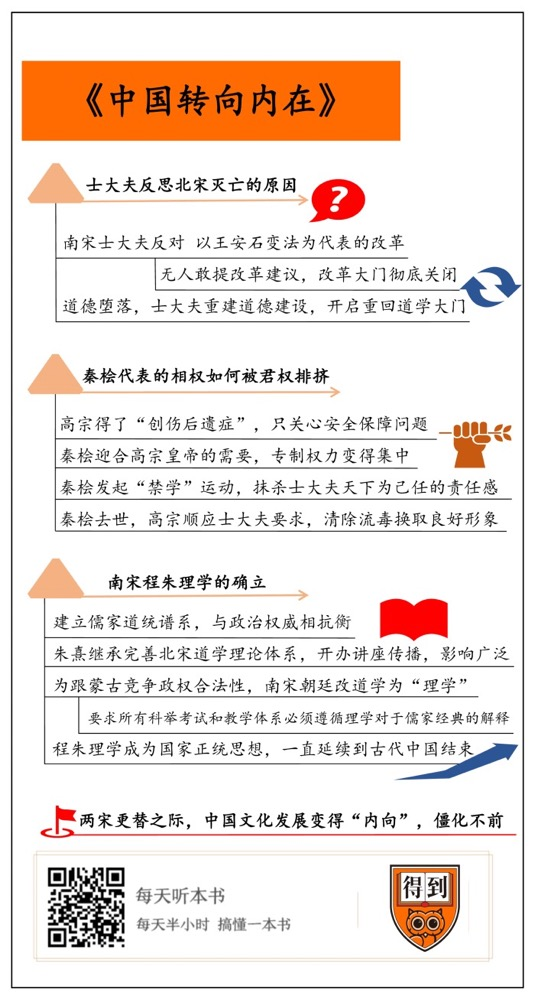

# 《中国转向内在》| 盛珂解读

## 关于作者

刘子健，世界宋史领域的顶尖专家，后任普林斯顿大学教授，出版多部研究宋代的著作，提出中国文化的根本转向发生在两宋之间，在学术界影响深远。

## 关于本书

在这本书中，刘子健由政治和文化之间的互动出发，认为是政治的变化造成为了文化的改变。进入南宋后，保守气氛弥漫在整个国家，君主集权不断加强，士大夫都对政治意兴阑珊，消极对待，道学成为正统思想之后，中国文化彻底转向内在。

## 核心内容

王安石的改革派为北宋的灭亡背了黑锅，无人再敢轻言改革。奸臣当道，秦桧独霸宰相位置十几年，其原因只不过是因为他摸透了高宗的心思。权相当道、君权独霸，士大夫对政治避之唯恐不及。蒙古国势力越来越强大，开始与南宋争夺道统，南宋无奈，只得将道学立为正统，希望借此掌握话语权，变革的大门从此彻底关闭。

## 前言

你好，欢迎每天听本书。这期为你解读的书是美国汉学家刘子健的《中国转向内在》。

在开始解读之前，我先问你一个问题：我们普遍认为，中国的唐朝是开放自信的，而晚清时代，中国闭关锁国、封闭保守。很显然，中国文化曾经发生过重大的转向。但你有没有想过，中国文化的这种由外向转内向的过程，是从什么时候开始的呢？很多人可能会说是唐宋之间，宋代以后中国就开始变得内敛柔弱了。但是，这本书会颠覆这种认识。作者刘子健指出，中国文化真正的转向其实发生在从北宋到南宋的过程中。正是在两宋更替之际，中国文化一步步失去了蓬勃发展的能量，变得“内向”，变得僵化不前。

听到这里，很多人会有一个问题，那就是，中国文化的转向为什么会发生在两宋之间？这就要从中国统治阶层的主体——士大夫身上，去找原因。

士大夫是中国古代社会的特殊现象，他们既是官员又是学者，参与政治、思想、文化的方方面面，他们身上承载着中国文化的特殊气质。这样，问题就变得具体了，这本书其实讲述的就是士大夫这个群体的转变：在北宋还开放多元，还能积极进取的士大夫阶层，怎么到了南宋就变得保守、内敛、封闭、僵化了？

作者给出的答案是两个字：恐惧。北宋灭亡的惨痛教训给南宋政权带来的恐惧，让南宋在政策和思想上变得越来越保守；南宋统治者在反思北宋失败时，将北宋以来的改革和进取精神，全盘否定，甚至不惜采取一种矫枉过正的策略，来维护帝国的统治。而正是这些策略，一步步扼杀了中国社会几百年来形成的开放和包容气质，中国从此转向了内向。

提出这个观点的刘子健教授，可是全世界宋史领域的顶尖专家。他1919年出生在上海，曾经就读于清华大学。抗战期间他参加过抵抗日军的活动。后来，刘子健赴美，在普林斯顿大学历史系当教授，他的研究领域主要就集中在宋代。本期为你解读的这本《中国转向内在》是他最重要的研究，书中提出中国文化的根本转向发生在两宋之间，这个观点影响深远，到现在都是学者们讨论的热点问题。

在本期的解读中，我们就来看看这个转向是怎么发生的。我把它分成了3步。首先，北宋的灭亡让南宋士大夫开始反思灭亡的原因，这个过程中保守主义者逐渐占了上风，以王安石代表的改革派背了黑锅。第二步，南宋的政治局势越来越保守，皇帝的专制权力逐渐扩张。这个部分，我们会主要讲讲著名的奸臣秦桧代表的相权，是怎么被君权排挤的。第三步，南宋士大夫别无选择只能提倡道德，士大夫的思想发生了根本转变。南宋道学，也就是程朱理学，从异端学说成了国家正统思想，一直延续到古代中国结束。

## 第一部分

在第一部的开始，我们先来回顾一下北宋是怎么灭亡的，这是一切发生的起点。北宋虽然也时刻面临着来自北方辽国的威胁，但是还不至于对帝国的统治造成根本打击。公元1125年，金国灭掉了辽国，开始了征服大宋的战争。他们一路南下，终于在1127年把大宋的两位皇帝，徽宗和钦宗，跟一大批皇室成员劫掠到北方。这个事件就是有名的“靖康之耻”，北宋王朝从此灭亡。在这场巨变中，宋徽宗的第九个儿子康王赵构幸运地逃了出来，他在南京登基称帝，继承了大宋政权，开启了南宋王朝。

你看，南宋王朝一开始就是在屈辱中诞生的。建立之后，军事上也节节败退。高宗刚刚建立的小朝廷在战火中四处逃亡，最危险的时候，甚至只能逃到海上避难。南宋朝廷建立不久，高宗皇帝就不顾身边大臣的反对，开始一次次派遣使臣向金国求和，把父母的奇耻大辱完全抛到脑后了。在1129年的求和文书中，他甚至非常谦卑地写到：目前的状况是，我们想要防御，却缺乏人力，想要逃跑，却又无处可藏，所以，只能乞求达成和解。高宗这样说，可以说是完全不顾廉耻了。

在这场巨变面前，一些士大夫也表现得非常卑劣可耻。这些人原本标榜忠诚和节操，结果在金兵逼近北宋都城开封的时候，他们居然主动投降，甚至逼皇帝出城，让皇帝成了俘虏。

皇帝昏庸懦弱，同僚毫无节操，这都让那些希望重振国家的士大夫受到了巨大冲击，他们越来越清晰的意识到，国家的强大不能只靠军事力量，拯救社会的唯一的出路是道德重建。所以，那些有责任感的士大夫，就开始认同北宋时道德保守主义者的看法，反对改革和变法。他们认为，北宋灭亡的原因正是王安石变法带来的制度变革。

宋神宗时，王安石在皇帝的支持下开始变法，希望通过制度改革增强国家力量，当时以司马光为代表的保守主义者就激烈地反对他。神宗去世以后，哲宗即位，司马光重新执政，废除了新法。因为哲宗的第一个年号是元祐，保守派就被称为元祐党人。我们可以说，在那之后宋代的历史，几乎就是以王安石为代表的改革派和以司马光为代表的保守派，也就是元祐党人，轮流主政的历史。

1093年至1125年，北宋覆灭前夕，元祐党人失势，改革派重新执掌朝政。只不过，这个时候的改革派，已经彻底失去了王安石变法的理想主义色彩，对制度改革毫不用心，道德上也无所顾忌，只关心党派斗争，关心怎么打压对手。特别是徽宗时期，蔡京专权，他借机极力打击保守派力量，把元祐、元符时期反对变法的司马光、苏轼等一共309人都定为奸党，甚至把他们的名字刻在石碑上昭告天下，想让元祐党人永远不能洗脱罪名，他们的子孙也永远不能在京城做官。这就是历史上著名的“元祐党籍碑”。

所以，南宋的士大夫一致认为，是改革派执政最终断送了国家的命运。在南宋初期的朝堂上，那些原本支持变法的官员一个个都噤若寒蝉，不敢出声，而保守派大多侃侃而谈，批评变法。他们先是批评蔡京，后来，高宗皇帝直接越过蔡京，把矛头指向王安石，说大家只知道蔡京的罪行，实不知国家的危机从王安石变法开始就已经开启了。有保守派官员甚至说，王安石的学术不灭，国家就永远不会复兴。朝廷首先把王安石的牌位从神宗的宗庙里请了出去，这就意味着不再承认他曾经享有的地位。接着又撤销了曾经封给他的爵位，并且把任命状从历史记录中删除，好像这件事情从来没有发生过一样。

从此以后，所有士大夫都对“变法改革”这个词避之唯恐不及，任何涉及改革的建议都成了离经叛道的言论。虽然南宋周围有很多强敌，急需做出一些积极有为的改变，但是，改革的大门还是彻底关闭了。保守主义者掌握了话语权，他们真诚地认为，制度上的变革不会带来什么好的结果，国家最需要的还是道德重建。这符合传统儒家的看法，当社会中的每一个人都得有道德的时候，国家自然就会强盛起来。为了重建道德，保守派士大夫想到的道路就是重新回到北宋的道学传统，回到人的内心去建立有道德的人格。

这就是本期解读的第一部分，士大夫把北宋灭亡的原因归结成了两个问题：一个是王安石变法为代表的改革，所以南宋初期就开始不断试图清除掉王安石变法的影响，所有人都不敢再提出改革的建议，改革的大门彻底关闭了；另一个原因是道德堕落，所以士大夫开始强调道德建设对于国家复兴的意义，开启了重回道学的大门。一道门关上，另一道门开启，这就是转向的开始。南宋王朝在后来的政治思想上越发矫枉过正，中国转向内在的过程也就完成了。

## 第二部分

那么接下来，我们来讲转向的第二步，皇帝集权让士大夫不得不自觉远离政治，只好把力气花在道德建设上。

我们在第一部分说了，士大夫对改革都战战兢兢，不敢提出建议。这时候南宋朝廷不断加强君主集权，让政治气氛变得更加严峻，士大夫变得越来越沮丧。他们想要改变政治，就只能把希望寄托在提高君主的个人道德上。

宋代以后，中国政治结构可以分为两股力量，一方是掌握绝对权力的皇帝，另一个是士大夫组成的官僚集团，领导这个官僚集团的是我们常说的宰相。这里说的宰相并不是一个固定的职位名称，而是泛指官僚集团的领袖。在各个朝代，很多职衔实际上都充当着宰相的功能。传统政治结构中，君主在名义上拥有绝对的权力，可以随意发布政令、罢免官员，但是在具体操作中，皇帝很多时候又不得不受到以宰相为核心的整个官僚集团的制约。政治权力是否集中，皇帝是否有充分的集权，就集中体现在皇帝与宰相的关系中。

南宋初期，因为军事上一直节节败退，主要负责朝政，制定军事政策的宰相几乎都束手无策，找不出什么好办法，于是就很容易受到对立派别的攻击。皇帝为了保全自己永远正确的形象，采取的策略就是不断撤换宰相，让他们当替罪羊。

南宋时期，皇帝掌握着绝对的控制权。这时，有一个人通过各种计谋当上了宰相，而且独霸相权十几年之久，这个人就是有名的奸臣秦桧。他的成功不是因为宰相终于被尊重，有了自己的权威，而恰恰是因为秦桧彻底迎合了高宗皇帝的需要。所以，秦桧的地位稳固反而说明专制权力变得更加集中了。

我们前面说了，高宗皇帝是北宋灭亡时侥幸逃脱出来的。在逃亡中，金人曾经渡过长江，威逼杭州，高宗最后不得不坐船逃到海上。中国历史上还从来没有一个朝廷曾经在大海上漂泊。他们在海上还遭遇了三天风暴，最远漂流到了福建的泉州，最后还是因为金国自己退兵才能死里逃生。这种颠沛流离的逃亡经历，深深地印在高宗的心中，成为他永远的创伤。这还只是外患，而内忧就更加深了高宗的恐惧。高宗刚刚在杭州重新建立政权不久，就遭遇了一场武将发动的兵变，迫使他暂时退位。虽然这场兵变最终平息了，但是从此以后，高宗开始不信任朝中的武官，时刻防备他们变得太强大。

这些经历让高宗得了“创伤后遗症”，他极度缺乏安全感，怎么保障安全几乎成了他唯一关心的问题。这成了一个契机，当秦桧成为宰相的时候，他体会到了皇帝的这种需要，就开始借此来扩大自己的权力。

秦桧先是向高宗表明，自己要促成南宋和金国的议和，但是，为了保证议和不被打断，他需要高宗皇帝给他彻底的信任。这种要求虽然加大了秦桧的权力，但是因为目的是议和，符合高宗的想法，所以得到了高宗的赞成。就这样，秦桧解决了外患的问题。接着，他就要想办法清除高宗担心的内部危机。他召回了在前线统领军队的三位大将，任命他们为枢密使，把他们的副将晋升成了新的将军。表面上看，这是提升了那三位大将的官职，而实际上却让他们离开了自己长久统领的军队，加强了朝廷对军队的控制。在这三名大将里，就有年轻善战的岳飞。这时候，只有岳飞直接表达了对于议和和调回的不满。后面的故事你肯定很熟悉了，秦桧以“莫须有”的罪名杀害了岳飞，造成了中国历史上一大冤案。但是，秦桧的种种作为，确实满足了高宗对安全感的强烈需要，这就让他越来越受到皇帝的青睐，更让他能够权倾朝野，一直占据宰相的位置。

南宋和金国的议和达成之后，秦桧就开始利用自己的权力清除异己。他把朝中的反对派都驱逐出朝廷，还发起了一次“禁学”运动，进行思想控制。秦桧的“禁学”其实跟清代的文字狱差不多，只是没那么彻底。他命令史官重写官方记录历史的“实录”，把里面对自己不利的内容删的删、改的改。他不仅改正史，还禁止私人写的历史作品传播，所有的出版物都要经过审查，通不过就要把书版毁掉。据说，秦桧临死之前还在制定一个53人的弹劾名单。

这些高压的政策，让当时大多数的士大夫更不敢参与政治讨论，感到惶惶不安。“一朝被蛇咬，十年怕井绳”，司马光的一位后人就被吓坏了，甚至不敢承认有些笔记是祖先司马光的作品。北宋以来好不容易才形成了士大夫以天下为己任的责任感和参与意识，在高宗和秦桧的高压政策之下，变得荡然无存。士大夫全都慢慢转向内在，再也没有以前那种积极进取的精神了。

在秦桧去世的时候，帝国的内忧外患已经暂时缓解，高宗皇帝的权力也巩固下来了。这时候，高宗开始顺应士大夫的要求，清除秦桧的流毒，换取自己在士大夫心目中的良好形象。秦桧终于还是没有摆脱前任那些宰相的命运，替皇帝背了骂名。

所以说，士大夫的转变本质上还是因为高宗不断加剧皇帝个人的集权。也正是这种个人集权，深深地刺激了当时的士大夫群体。他们发现，面对集权，反抗是徒劳的，唯一能指望的就是皇帝是个好皇帝。这样，士大夫就只能寄希望在好好教育皇帝，让他成为一个符合儒家期待的君子这一条出路。也就是说，想改革政治，只有从教育皇帝开始。这就是为什么朱熹和他以后的道学家们，不断希望教导皇帝能够“正心诚意”。这虽然看上去有些迂腐，但却是儒家传统士大夫在集权时代中唯一的选择。

你看，不管从哪个角度看，重塑道德已经成了士大夫必须去做，而且几乎是唯一能做的事。在这种情形之下，保守的理学一步步走上了历史的舞台，他们在北宋的时候还被看作是异端，到了南宋摇身一变，成了国家正统思想。这派的学者变得越来越保守，紧紧守护着前辈学者们开创的理论格局，努力维持着自己的正统地位，中国文化也就彻底地转向了内在。在第三部分，我们就来说说这个转变的过程。

## 第三部分

道学思潮，其实就是我们熟悉的理学，是在北宋时候兴起的，他们把自己定位成儒家正统思想的继承者，还仿效佛教的传法系统，建立起了一个儒家的道统谱系。这些人建立道统，一方面是为了证明自己的正当性，把那些跟他们理解经典的方式不一样的学说，都说成是错的。另一方面，他们还有一个目的，是为了跟皇帝所代表的政治权威相抗衡。你可能有点奇怪，为什么建立道统能对抗皇权呢？这是因为在他们看来，道统代表的是圣人的权威，掌握的是天地运行的规律。

其实南宋刚建立的时候，政府并没有承认道学的合法性。不过，它在民间传播的很好，很多士大夫也都信奉道学思想。那些本来就倾向保守的人接受了道学思想，认为自己拥有了道统的权威。这给了他们能够站在朝廷之外，批评朝廷政治的空间和权利。

南宋最重要的道学家是朱熹。不能不说，朱熹是个很有创造力的人。在学术上他取得了极大的进步，充分继承了北宋道学家们创造的理论体系，兼收并蓄，把这个哲学体系变得更加细致和完备。

因为对政治失望，他们还努力发展民间教育，在官办学校之外传播道学思想。他们中很多人四处奔波，举办公开的讲座，听讲的人不分高低贵贱，都可以参加。相反，官办的教育因为政治禁锢变得越来越僵化，学生们更多关心的是自己的私利，毫不关心学术。这样，教育的领导权慢慢就转移到了民间知识分子的身上，特别是那些充满理想主义的道学家们。道学思想开始由浙江、江西、福建等省份逐渐向全国各地传播，影响范围扩大到了现在的四川、湖北一代。

不过，这时候在官方看来道学还是异端邪说，因为道学家远离朝堂批评政治，生活方式也特立独行，让很多朝廷官员不满。1195年，道学被正式宣布为伪学，遭到了朝廷的禁止。朝廷甚至还下令，每一个参加科举考试的举人都要写一份保证书，证明自己和伪学无关。1197年的时候，朝廷更进一步公布了一份59个人的名单，宣布他们是伪学的领袖，南宋最重要的道学家朱熹，就赫然在列。然而，这样的禁令也已经无法阻挡道学的发展了，道学已经赢得了许多士大夫的心理支持，在民间有着广泛的基础。

道学的领袖朱熹1200年去世，他去世两天以后，朝廷取消了关于伪学的禁令。1212年，朝廷接纳了朱熹对于儒家经典《论语》和《孟子》的注释，这表明国家逐渐放宽了对道学的限制，但是此时仍然还没有接纳为国家的正统思想。

那么，一直被当作伪学的道学，后来怎么成了国家正统思想的呢？原因其实是跟蒙古国的政治竞争有关。1234年，新兴起的蒙古国消灭了金国，成为南宋最主要的敌人。在前一年，也就是1233年，蒙古人接纳了耶律楚才的建议，宣称自己是儒教帝国，还在北京重修了孔庙，试图在文化上跟南宋争夺政权的合法性。南宋为了竞争，不得不重申自己在道统上的合法地位，这时候，道学就成了有力的武器。南宋政府把北宋的五位重要的道学家配享孔庙，这个做法等于承认这五位道学家真正接续了孔子的真精神，也就等于南宋接受了道学对儒家道统的描述。他们还强调，道统随着程颢和程颐的弟子南来，传递到了江南，所以南宋才是继承了儒家正统的儒教国家。

为了更进一步统一思想，增加人民对南宋国家正统的信心，1241年的时候，朝廷举行了盛大的仪式，正式宣布道学为国家的正统学说。因为“道学”这个词，在以往的岁月里常常作为伪学被禁止，经历了太多的诋毁和污蔑，这时候再用这个词有些不太合适，所以朝廷把道学改名为“理学”。这就是我们今天熟悉的“宋明理学”的说法。从此，作为国家的正统思想，所有科举考试和教学体系都必须遵循理学对于儒家经典的解释。

道学历经波折，终于从朝廷认定的异端邪说，变成了天下读书人都要信奉的正统思想。但是，南宋朝廷希望借此重新振作国家精神的目的，却没有达到，也根本无力阻止蒙古帝国的扩张。1271年，忽必烈将蒙古国的国号改为大元，1279年，南下的元朝军队又把南宋朝廷逼到了海上，在广东崖山展开海战。这就是历史上著名的崖山之战。最后，宋军全军覆没，宰相陆秀夫背着皇帝赵昺投海自尽。两宋三百多年的统治彻底结束了，中国进入蒙古族统治的元朝时期。虽然是异族统治，但是，元朝在文化上继续承认儒学的正统地位，接受了理学。于是，理学作为官方学说一直延续到清代。

理学成为正统，说明这场向内的转变彻底完成了，而且一发不可回头。理学的基本特点，就是保守，不求革新，他们采取传统主义的立场，虽然也强调个体对天理的体会和理解，但是更重要的还是严谨地信奉儒家传统的经典。经历了北宋开创时期的开放和发展之后，后来的学者都信守老师的教诲和理论，所有新的发展都只是内部的理论完善，几乎没有实质性突破。

还有一点特别需要注意，那就是从理学变成正统的那一刻开始，它就注定变得越来越僵化。因为，假如理学还能保持异端的身份，远离朝堂，至少还能有批评和反思的空间。但是，一旦他们成为了正统，他们又只能空谈理论，拿不出什么具体的办法来解决具体的问题，结果就只能跟朝堂绑得越来越紧，沦为了稳定政权的工具。

以上就是第三部分的内容，为了保持正统地位，南宋朝廷最终承认了道学的正统地位。道学成为正统就失去了它的开放性和创造性，变得更加僵化不前。中国文化的转向到这里也就彻底完成了。

## 总结

这期的内容我们就讲完了，现在来简要的回顾一下。

《中国转向内在》这本书，通过描绘北宋到南宋之间的政治变化和文化领域的互动，希望能够说明为何中国文化在南宋开始转向了内在，变得更加内敛和僵化。书中把这种转向分成了3步。

首先是南宋开始之际，全国上下都认为是王安石变法以及变法带来的影响造成了北宋的覆灭，所以再也没有人敢轻易提出改革的建议。南宋初期的种种表现，又让士大夫们觉得，制度改革不能带来什么好效果，国家的强大更需要道德的建设，于是改革的大门从此彻底关闭了。

其次，相比北宋，南宋皇权更加集中，即使是秦桧这样控制朝政十几年的权臣，也没有获得跟皇权制衡的能力，他必须更好地为皇帝服务才能一直保持自己的地位。权力不断集中，让政治气氛愈发严酷，士大夫们都不敢发声，只能把希望寄托在未来皇帝的道德教育上。

最后，为了跟蒙古竞争政权的合法性，南宋朝廷不得不接受了道学的正统地位，这让政治和思想同时失去了创造的能力，变得更加僵化。

这本书其实是找到了古代中国历史最重大的拐点，从这里出发，分析了改变的原因。最后，我们再来说说这本书的价值。

相比于西方的汉学家，刘子健教授对中国传统文化的理解更深入，也就能更敏锐地捕捉到问题的关键。他明白中国的政治对思想文化有着决定性的影响，所以他聚焦在政治和文化的互动上，深入体会传统士大夫的内心世界，准确地刻画了南宋的政治和文化氛围。

更重要的是，刘子健教授在写作这本书的时候，有意识地反对历史研究领域中流行的唐宋变革论。唐宋变革论首先由日本学者提出，来解释中国历史的变化，主要观点就是认为，中国历史在唐宋之间发生了一次根本性的改变，开始由中世纪走向近代。刘子健认为，唐宋变革论其实是在用西方的历史发展阶段，来比附中国历史发展，背后预设了一个前提，就是人类历史的发展有一个共同的模式。但是人类文化的发展并没有一个放之四海而皆准的模式，把西方历史的发展规律看作是人类历史发展的普遍规律，仍然是欧洲中心主义的影响。今天，学术界反思这种看法的作品已经很多了。我们这期为你解读的《中国转向内在》就是其中的代表。

撰稿：盛珂

脑图：刘艳

转述：李璐