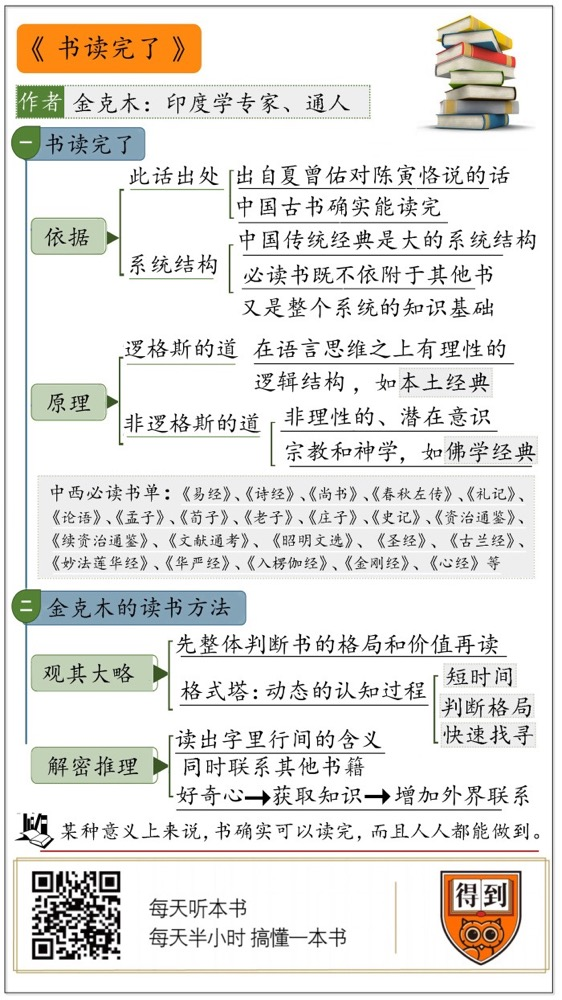

# 《书读完了》｜贾行家解读

## 关于作者

金克木（1912-2000），当代著名学者。祖籍安徽寿县，先后任教于湖南省立桃源女子中学和湖南大学、武汉大学哲学系教授。北京大学东方语言文学系教授。通晓多种语言，学贯中西，是北京大学“未名四老”之一。

## 关于本书

金克木是一代学术大家，读书与治学极广博又精深，让后代学者叹为观止。他的著作出版种类繁多，经后人整理，从他出版著作中精选可有关读书治学方法的文章50余篇，集结为《书读完了》。

## 核心内容

本书思想核心是：本书讲的是通才学者金克木的读书方法。说“书读完了”，其实是说要先建立必读书系统。该先读的书是：知识有系统结构，必读书的特征是既不依附于其他书，又是整个系统的知识基础。把中外文化中的这类书通读之后，就可以说是“书读完了”。中外文化都有两套体系，一套是偏重逻格斯的道，也就是理性的知识。另一套是非逻格斯的道，也就是非理性的、潜在意识活跃的范畴，主要是宗教和神学。按照这个标准，金克木还开列了佛教经典的必读书目。

其次，我们说了金克木的读书方法。第一种是观其大略，也就是先整体判断书的格局和价值再读。第二种是用解密推理的方法，读出字里行间的含义。读书的动力来自于人的好奇心，人们通过获取知识，来增加与外部世界的联系。

## 前言

你好，欢迎每天听本书，今天我为你解读的这本书的名字是《书读完了》——这话的口气可有点儿大，谁敢这么说呢？

如果中国学者里，有三五个人够资格，就很可能包括本书作者：当代著名学者、北京大学东方语言系教授金克木。他不仅精通英、法、德语和拉丁语，还通晓古印度的梵文。1960年，他和季羡林一起创办了北大梵文巴利文专业。季羡林的弟子钱文忠教授说：他上这个专业时，金克木已经不亲自授课了。学生想知道这位祖师爷的功夫，就请老师播放了一段他诵读梵文的录音。梵文是种“死语言”，学生们在朗读时，觉得这真是全世界最难听的语言。结果，金克木的朗读却如同水银泻地，起伏跌宕，神秘苍茫，让大家领教了为什么印度人说梵文是神的语言。钱文忠说，不久，全班的一半学生就提出来转系，很可能是受了打击：再怎么学，也没法把梵文学到金克木这种程度。

金克木是印度学专家。但读者们经常忘记他的本专业，只记得他是位兴趣广泛的思想家、一个“通人”。通人是中国古代对读书人的最高赞誉，就是整合了古今中外的知识之后，对各种现实问题，都能理解形成敏锐的洞察和深刻的思辨。金克木在世时，论研究视野，谁也没有他广阔：除了语言学和中外文化比较，他上至天文，下至地理，文史哲经、古今中外、自然人文，无所不谈。他于2000年去世，享年89岁，当时的很多学人都感慨：如今的学术分科越来越细，中国很难再有这样的“通人”了。

不过，“书读完了”这句话，也不是金克木说的，而是来自一件逸闻，我马上会说到。金克木是借这个题目，告诉读者：某种意义来说，书确实可以读完，而且人人都能做到。就看你读什么书、用什么方法。这也正是我在本期音频里要为你说到的两大类问题。

第一类问题是：什么叫“书读完了”，这话的依据是什么？背后的原理又是什么？

第二类问题是：同样读书，为什么金克木被称为通人，他用的是什么方法？另外，很多人担心，读书多了，会和真实生活脱节，那么，该怎么处理读书和现实的关系？

## 第一部分

咱们就来从第一个话题说起：书真的能读完吗？

先来说这句话的出处吧。历史学家陈寅恪回忆，他年轻时曾见过一个老学者夏曾佑，夏曾佑对他说：“你能读外国书很好。可惜我只能读中国书，都读完了，没得读了。”陈寅恪很惊讶，怀疑对方糊涂了。中国的典籍汗牛充栋，怎么可能读完呢？直到陈寅恪老了，才发现当年那句话有道理：中国古书确实能读完，较为重要的只不过几十种而已。不过，陈寅恪说的到底是哪几十种，今天无从查考了。

金克木说，很显然，陈寅恪和夏曾佑看出来中国古书之间存在的联系。中国传统经典是一个大的系统结构，有一些书是绝大部分书的基础。离了这些书，其他书就无所依附。这就像从《红楼梦》的本文中，产生了各种批注本和续作，又发展出庞大的“红学”体系，但读后面的书，前提是要读原著。对中国传统文化体系来说，必读书的特点是：它们不依附于其他书，而且还是阅读其他书的基础。如果按这个标准来看，不止中国文化可以读完，西方文化也可以读完。

我们先说中国古书的头绪是什么。首先要读的是古代文人从小要背的书，他们的思想和话语体系，是从这个知识系统里来的，不读就不知道他们在想什么。这里我得多说几句：其实，除了专注于学术的大儒，多数古代读书人的阅读量，连那几十种古代典籍都达不到。他们的阅读是围绕科举建立的。背的最熟的是朱熹注的《四书》，因为考试题从里面出。最常看的书叫“试录闱墨”，也就是八股文试卷的范本。考试不大涉及的就不好说了。明清很多两榜出身的文官，对《尚书》和《礼记》都不太熟悉，更不要说诸子百家和历史了。

所以说，你要是读完下面这些书，对传统文化的了解程度，起码超过清代的举人，这些书是：<u>《易经》《诗经》《尚书》《春秋左传》《礼记》《论语》《孟子》《荀子》</u>和<u>《老子》《庄子》</u>。不先读这十部书的话，读古代小说戏剧、包括鲁迅的杂文，都会有不明白的地方。

刚才这第一波，是进入中国传统文化的知识基础。如果读历史，必读书是<u>《史记》《资治通鉴》《续资治通鉴》</u>这三部，另外还有一部<u>《文献通考》</u>，它是宋元时代编纂的古代政治制度通史，可以和《资治通鉴》相辅相成。如果读文学类书籍，首先要读的，是南朝梁武帝长子萧统编选的<u>《昭明文选》</u>。读这套书，可以对从屈原到唐代以前文学形成整体印象。

这里我要插一句，介绍一下本书的来历。从上世纪八十年代开始，金克木在二十年里，陆续写过很多篇文章谈如何读书治学。这本书是对这类文章的汇总整理。他写这些文章的一个目的，是为了向年轻人传授读书方法。他提醒读者：这并不是提倡读经和复古，读这些书用不着咬文嚼字，死抠字句，只要做一般了解就可以。这些书里，除了《易经》《老子》，都有故事性、趣味性。加了注解之后，中学生就可以读懂，而且也不是都得看，太专业的篇目或者枯燥的内容，可以滑过去。把这些书通读一遍，其实用不了太长时间。

同样道理，西方文化也有基础必读书。首先要读的是<u>《圣经》</u>，没有《圣经》知识，几乎读不懂西方公元以后大部分的书，包括那些反宗教的或不涉及宗教内容的书。这就像了解阿拉伯文化，基础必读书当然得包括《古兰经》。另外，就是《圣经》出现之前，古希腊、古罗马时代的经典，比如柏拉图、亚里士多德。需要把它们和《圣经》对照阅读，因为这些书在《圣经》之后经过了重新整理。

你可能要说了：“咳，这不就是最基本的必读书单吗！哪套经典丛书不是这些呢？”别着急，我们的话题才刚刚开始。接下来，我们要说的是：这些必读书有什么样的深层次联系？这种联系，才是这张书单的奥妙所在。

开始之前，我们再来说个小轶事：当年，蔡元培在北大创办哲学系时，请了一位老学者讲课。讲了一年才讲到周公。冯友兰当时是系里的学生，金克木就问他“周朝以前哪有那么多可讲的？”冯友兰说那位老先生是从伏羲画八卦开始讲，光《易经》就讲了一年。照这个方法，要是讲完诸子，还不知道得多少年。于是，蔡元培请了年轻的“海归”胡适来讲。胡适的那本《中国哲学史》上卷，现在看很正常，因为它成了后来的学术传统。但在当时，这是石破天惊的结构。它用系统的学术史视角，打通了中国哲学和西方哲学的壁垒。这就是能不能看清深层次联系和关键性问题的区别。

金克木认为，要看清知识传统的内在联系，就要回到书籍形成的初期。各种文明的早期文献，肯定是出自掌握文字知识的人之手。在各大古代文明中，知识阶层的生活方式不同，思考问题的方式都不同，也就形成不同的风格。比如，古希腊的城邦政治，产生了相对自主的智者群体，所以他们能专注地思考“认识自己”这类课题。中世纪的欧洲处于政教合一，有一段时间，所有的识字者都在修道院，他们考虑和所书写，当然就以神学问题为主。金克木发现：古印度的识字者也是专注于宗教的，但表现和西方不同。在古印度，识字的人是婆罗门或者出家的沙门，他们靠施主供养，和政治关系不大。他们到了老年，会进入森林或者移居到恒河边上修行，所以也不大关心现世问题。

和这些文明相比，古代中国知识阶层的突出特点，就是和政治联系紧密。从巫术时代开始，识字的巫师就和政治首领关系密切。这一点，我们也有体会：在王朝时期，多数文人思考的，也是政治命题。所以说，读完几部早期儒家经典之后，很多后来的书确实可以不读。因为他们说来说去，论证的东西都差不多，反而缺少先秦时代那种勃勃生气。

你要是觉得刚才说的内容太简单、太基本，下面就开始进入抽象了。

在寻找中外文化根源的过程里，金克木对接了一对基础概念：西方的逻格斯和中国的道。逻格斯是古希腊哲学和西方神学里的基本概念。在希腊语里，它有语言的含义。语言不只是表达思想的工具，它本身就是思想、行为。所以，逻格斯又有语言、思想、行为合一的意思。另外，有意义的语言，一定合乎理性法则。所以，逻格斯在古典哲学里有规律和原理的含义。《圣经·约翰福音》的第一句是“太初有道，道与神同在，道就是神。”原文中的“道”，就是希腊语里的逻格斯。

西方的“逻格斯”被翻译成了中文里的“道”，就让我们感到了某种相通之处：老子讲“道”，孔子也说“天下有道”。在中西方文化体系里，都有偏重逻格斯的“道”的传统。这种传统建立在语言思维之上，有理性的逻辑结构——逻辑这个词，也是从逻格斯里衍化而来的。

不过，金克木发现，这种传统既不是文明一开始就有，也不是唯一的。在中西方，同时都有另一类非逻格斯的道。也就是来自人类潜在意识、非理性的道。它不能准确用语言表达。

可以说，中西方文化并不是“道不同，不相为谋”，而是各自存在两种不同的道。

我们先来说西方文化，为什么刚才说柏拉图是必读书？有一个重要原因：因为柏拉图的著作记载了苏格拉底的思想和言论。从苏格拉底开始，古希腊才确立理性的、逻格斯的道。比如，数学家毕达哥拉斯比苏格拉底早100年，身为哲学家和数学家，毕达哥拉斯应该最讲理性吧？其实他是个神秘主义者，把自己发现的勾股定理也看成出于神秘力量。金克木说，苏格拉底之前的很多希腊哲学家，思想方式都和印度佛经惊人相似，也就是说，是偏重于非逻格斯的。这种思想传统，在苏格拉底之后也没有消失。基督教信仰中很多东西，都不能用理性思维去解释，也不能完全用语言表达，就是因为属于非逻格斯的道。而且，这两种道也可以共存在一个人身上，比如牛顿就是一个虔诚的信徒。

中国的传统文化，也可以划分出逻格斯的道和非逻格斯的道这两种体系。金克木认为，产生自中国本土的经典中，都偏重于逻格斯。原因就是我们前面说的，中国古代文献的政治性都很强，追求集中性和全体性，是通过某种秩序，从全体落实到个体的。其中有六部最重要：就是《易经》《尚书》《春秋》《诗经》《论语》和《老子》，都在刚才的基础书单里。这六部书在逻格斯的结构性语言体系里，各有侧重：《易经》和《老子》是符号语言。《老子》虽然抨击当时的政治，但它提出来的是另一套政治见解和统治策略，也被汉、唐的皇家所推崇。《尚书》《春秋》代表的是官方语言。而《诗经》是官方和民间语言的艺术化结合，带有暗示性。

在中国传统文化里，偏重非逻格斯的道，几乎都是外来的。它们在中国语言里，也不叫道，而叫“法”，也就是佛法。佛法从汉代开始在西域流行，汉以后迅速扩展到中原，在思想质地上是从个体到全体，呈分散和无序状态，和中国原有的“道”是对立的。

金克木是国内研究佛学的权威专家之一，我们别错过机会，这里再追加一个问题：这些非逻格斯的道，也就是佛学经典，也能读完吗？金克木说：也能。很多人觉得佛经浩如烟海，主要还是不熟悉。佛经的总体体量并不算太大，在古代印度只是诸多宗教之一，也只代表印度社会文化的一方面。如果只以汉译本佛经来说，原文和译文还有很多交叉重复。去掉重复内容，以及一般人不需要了解的“仪轨”咒语部分，汉语佛经一共有四部4650卷，也就比中国的二十四史多一半左右。而且，按刚才的方法，可以先读其中的6部，下面列举一下：

第一部是<u>《妙法莲华经》</u>，它的思想中心是信仰。这部经讲说的是对佛法的信仰，不是讲佛法本身。既然说信仰属于非逻各斯，就是说不能分析，不能讲道理。第二部是<u>《华严经》</u>，它的思想中心是修行。仅有信仰还不是宗教，必须有修行。这部经记载了各种修行的法门和步骤。第三部是<u>《入楞伽经》</u>，前两部有对外宣传作用，这部属于内部高级读物，是神学中的哲学。第四部就是有名的<u>《金刚经》</u>，它是对话记录体，思想中心是“智慧”。这种智慧也是佛法特有的，是理性与非理性的统一，也就是逻各斯和非逻各斯的同一。第五部是<u>《心经》</u>，它是一篇短短的咒语体文章。思想中心是“秘密”，属于神秘主义。它还有音译本，按网络语来说，是谐音“空耳”版。第六部叫<u>《维摩诘所说经》</u>。是供非出家人读的，里面的故事和道理，普通人也能接受。

这么一说，让人望而生畏的佛经，也有了一个系统和了解途径。

## 第二部分

刚才的几个问题，是从“书读完了”这个话题开始的。实际讨论的是：中西方文化的知识基础是什么？判断依据又是什么？今天，这类宏观视角的意义更大：有了搜索引擎和人工智能算法，很多基础性研究可以不用人做了。我们需要记住的细节，不像以前那么多，可以通过以概念为单位的思考，提升思想的效率和质量。基础的学习能力不一定是“记得快”，而是知道“找什么”和“找来做什么用”。我们在读书时的困惑，也不再是“他为什么能记住”；而是“同一本书，为什么他就能读出不一样的东西”？

下面，我们就来说说第二部分内容：金克木为什么能读出不一样的东西，也就是他的读书方法。

关于金克木的自学能力，我再给你讲两件事。第一件是：金克木这位大学者，直到晚年填履历，学历一栏仍然只有“安徽寿县第一小学毕业”这一条。由于自幼庭贫，他上了一年中学就辍学，开始赚钱养家。他养家的方式，又是通过自学做编辑、当教员，从16岁开始，金克木在当地小学任教，之后从中学一直教到大学；从在湖南大学教外语，到去武汉大学教哲学，再到北大教梵文和印度学。

第二件事是：1939年，金克木27岁时，历史学家傅斯年送给他一本英文注解、拉丁文版的《高卢战记》。金克木看了一遍这本书附录里的拉丁文语法概要，就开始对着英文读拉丁文原文。他回忆这段经历时说“我一读就放不下了，一句一句地啃下去，越来兴趣越大，真是奇妙的语言，奇特的书”。把这本《高卢战记》看完，他的拉丁文就差不多学会了。他一直是学术界的怪杰，关于他的自学能力，有很多传说：有人说他在大学开法语课时还不会法语，只是比学生先自学了几节，也是教完了就会了。这其实是讹传。他朗读梵文也不是天才，而是在印度向婆罗门苦学了几年，一句一句学来的发音。

下面，咱们就来说金克木的两种读书方法。

第一种，他称为“格式塔”，这个名词是20世纪的一个心理学流派。“格式塔派”认为人类大脑的认知过程，是一个动态的整体。比如，婴儿辨别父母，不是单纯的条件反射，也不是靠分析特征，而是整体认知。这就像人对于美丑的认识，也不是依靠辨认五官细节，而是一看就形成印象。这个整体印象，并不等于局部的总和。读书也是这样，有经验的读者，尤其是在建立了刚才说的那种系统性认知之后，同样可以迅速对一本书做出整体判断，形成基本印象。这种方法，近似于诸葛亮读书的“观其大略”。也就是在短时间内，对书在知识体系里的定位，对全书的格局形成判断，能快速找到最有价值的部分。陶渊明所说的“好读书，不求甚解”，也可以理解成是领会主旨、不在细节上过分纠结。

第二种方法，他称为“福尔摩斯”解密法。金克木爱猜谜，喜欢看推理小说。读别人觉得枯燥的书时，也抱着解密心态，喜欢琢磨潜藏在字里行间的意思。这在中国传统的表述里，叫做“读书得间”，就是“当于无字处求之”，读出书本背后隐藏的含义。一本书讲的是什么，很重要，是怎么讲的，同样重要。这种方法的形式，就是先自己提出问题，再自己寻找答案。

就说我们最熟悉的《老子》吧，金克木也能用推理的方法，从字里行间读出不一样的东西来。

他先是列举了基本信息：《老子》开篇的“道可道”一章，一共有59个字。第一章去掉虚词，重复的字有道、名、无、有等10个。——这里我补充一下：《老子》有不同版本，金克木用的这个版本是以“道可道”开篇的。在马王堆出土的帛书版《老子》里，这一章出现在中间位置，文字也不完全一样。

我们就不说这段话的具体意思了，细分析的话，整个音频的时间也不够用。我们只说这段文字的表面线索。金克木提出的问题是：这些字为什么不断重复？

前面说过，《老子》是古代文化的符号密码。解密的切入点，就是同一个密码的出现频率。当时的书刻在简帛上，字体是大篆，人力物力成本都很高，用语一定要尽可能简洁。59个字里有10个字多次重复，那么，一定意义重大。

这一章的前面六句是工整的三对，比如第一句“道可道，非常道。名可名，非常名”。之后的两对句子，是前一句的继续推进。因为一环扣一环，所以才要不断重复。重复得频繁，说明思维的连贯性强，密度很大。另外，这六句之后的三句，是对之前的总结性陈述。这又说明什么特点呢？就是没有证明的过程，全部都是命题和结论。

从这种密度大、不讲逻辑的语言风格里，我们能读出什么潜在信息呢？就是老子的应用场景不是辩论，而是在小范围内，对自己的门徒讲话。也就是说，这本书是给特殊人群讲的哲学。在其他的场合和目的，文字思路就不会是这样。比如说，古罗马时代的那些著名演说词，演说者的目的，是让公民同意自己，所以就要使用逻辑论证和鼓动的话术。

《老子》代表了中国古代经典的主要特征：老师对门徒授课，再由学生把语录整理出来，留下来的都是纲领、语录。中国古书的另一种场景是游说君主，这类文章也同样不完全讲逻辑，会通过说段子、打比方，夸张和诡辩，让对方听得懂、愿意听。

读书解谜的一个常见方法，就是寻找文字背后的潜在关系，也就是人的潜台词。中国古书的一大特点，就是有丰富的潜台词。西方的语言学研究，习惯于把潜台词变成明确的语言。而中国人明白：潜台词就是潜台词，只可意会，不能说明。一旦变成明确文字，意思就会随之改变。这个道理并不玄，我们在社会交往里都有体会。潜台词说明白了，就成了《茶馆》里的“把那点意思，变成了不好意思”。

另外，读字里行间的含义，还需要联系其他的书。在《老子》里，道的对立面好像是“无道”。金克木说，其实，和《老子》中的道相对立的概念是“势”，也就是形势的势。在道家的另一部经典《列子》里，势是一种混沌的不可抗力。道是人可以认知和把握的，而势是无法认知、也讲不出什么道理来的。所以人为的努力往往事与愿违。你可能有印象，那个讲人改变自然的愚公移山故事，不正是出自《列子》吗？对了，这个故事来自《列子·汤问》一篇，它的本意就不是夸愚公坚持不懈。而是说愚公这种认不清自然的法子，笨到了让神都担心的地步——再说，神把山搬走了，不还是要堵别人家的大门口吗？

你看，金克木这种先“观其大略”、再细看字里行间的读书方法，是不是和我们的阅读不一样？

另外，他读书的动力也和一般学者不同。金克木觉得自己知识增长最快的时期，是年轻时在北大图书馆做职员。他当时抄下很多师生的借书条，当做自己的阅读索引。他回忆，当年读这些书，并不是想当大学者，而是出于单纯的好奇。照着学者的书单读书，就是想知道他们在想什么，在研究什么。金克木在这本《书读完了》里多次说到：教育是不可逆转的。好奇心是必须在儿童阶段培养的，定型了以后就再也难改了。高等教育只能进行增删，没法对好奇心做根本改变。关于我们提到的那些必读书目和读书方法，他还提醒说：青少年读书快，可以用“观其大略”的方法，把基础性的书都过一遍。不要被考试和作业压得太死，要保护好奇心。另外，读书的目的，是建立与外在世界的联系。人不止要读书，更要学会读人、读物。他读了一辈子书，也最会读书，还是觉得自己从人、从事物上学到的东西更多。通过读书建立的思考，也一定要返回到生活的具体问题上。

## 总结

好，关于这本《书读完了》，我们就介绍到这儿，总结一下：这本书讲的是通才学者金克木的读书方法。首先，我们说的是该先读什么书：知识有系统结构，必读书的特征是既不依附于其他书，又是整个系统的知识基础。把中外文化中的这类书通读之后，就可以说是“书读完了”。中外文化都有两套体系，一套是偏重逻格斯的道，也就是理性的知识。另一套是非逻格斯的道，也就是非理性的、潜在意识活跃的范畴，主要是宗教和神学。按照这个标准，金克木还开列了佛教经典的必读书目。

其次，我们说了金克木的读书方法。第一种是观其大略，也就是先整体判断书的格局和价值再读。第二种是用解密推理的方法，读出字里行间的含义。读书的动力来自于人的好奇心，人们通过获取知识，来增加与外部世界的联系。

撰稿、讲述：贾行家

脑图：摩西脑图工作室