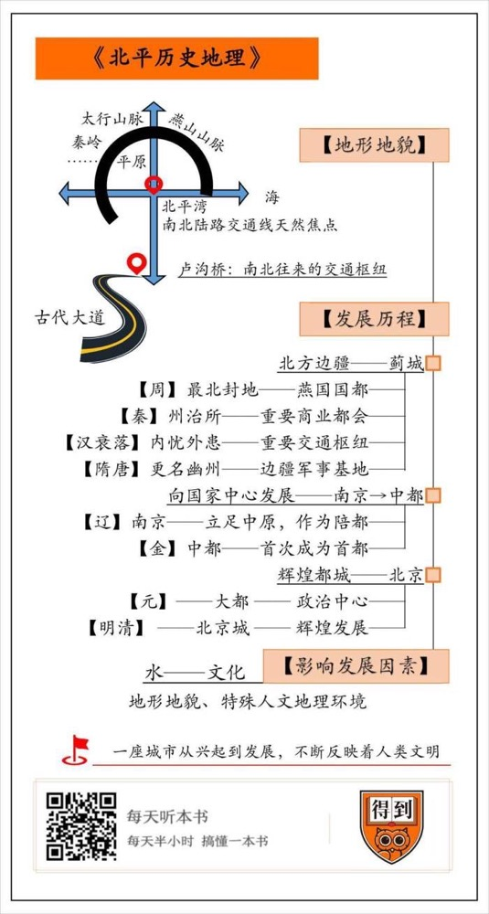

# 《北平历史地理》| 大象公会解读

## 关于作者

本书作者侯仁之先生是中国历史地理学科的奠基人、开拓者和学术泰斗。他1940年毕业于燕京大学，1949年获英国利物浦大学博士学位。学成归国后，侯仁之将历史地理学引入中国，在北大地理系设立相关课程，成为公认的“中国历史地理学第一人”。

## 关于本书

这本书是中国历史地理学界第一部关于城市历史地理的专著。本书对北京城的起源、发展以及历代水源的开辟方面的问题都做了系统科学的阐述，无论是在侯仁之个人的学术发展历程中，还是在中国历史地理学发展史上均具有重要的标志作用，而且对于今天的城市规划与保护来说，也仍然具有重要的参考价值。

## 核心内容

全书从历史地理的角度介绍了北京城发展的三个阶段：第一阶段是西周至隋唐的北方边疆之城，对应的是蓟城；第二阶段是，辽金时期形成中的国家中心，对应的是辽南京和金中都；第三阶段是元明清的王朝都城时期，也就是元大都和明清北京城。

## 前言

你好，欢迎每天听本书。本期为你解读的书是《北平历史地理》。这本书告诉我们，北京城的起源和发展是怎样的，北京怎样由一个边疆城市成长为国家中心、王朝都城。

今天要给你解读的这本书《北平历史地理》，不但有助于我们了解北京的历史地理知识，也是以北平为引子，讲述古代都城选址和城市发展的脉络。北平从先秦开始，只是中国北方边疆地区的一个较大型城市，但是因为靠近北方长城带，长期处于南方农耕文化和北方游牧文化的交流融合地带。不同文化集团之间的冲突与交流，慢慢促使北平城从早期的地方城市，逐渐上升为北部中国的政治中心，乃至全国的政治中心。这条地理的脉络，也是我们了解中国历史重要的视角。

作者侯仁之是中国历史地理学科的奠基人，这本书也是中国历史地理学界第一部关于城市历史地理的专著。1952年全国院系调整，侯仁之担任北京大学副教务长，并兼任刚刚成立的地质地理系主任。自此，“历史地理学”便正式出现在中国大学的课程设置中，侯仁之成为公认的“中国历史地理学第一人”。 可以说，无论对候先生个人的学术发展来说，还是在中国学科发展史上，这本书都有重要的标志作用。即使是在60多年后的今天，仍然有重要的学术价值。

侯仁之对北京的感情非常深厚。他在学术和生活方面，都分外关注北京的古迹。最著名的，要数侯先生保护莲花池的故事。如果没有侯先生的积极奔走，莲花池这个重要的地标在配合北京西站的建设时就被填埋了。根据侯先生的考证，莲花池是老北京的重要水系，“先有莲花池，后有北京城”，北京城起源的蓟城正是靠此形成定居点，后来的金中都也是依靠这处水源建的都城。最终，原本要建在莲花池上的北京西客站主楼东移了100米。下次你路过北京西站，如果时间充裕，不妨去参观一下莲花池公园，这是一个比北京历史更悠久的历史地标。

介绍完这本书的基本情况和作者，下面，我就为你详细介绍书中的内容。书中内容分为三大板块，是沿着北京城的发展史来叙述的，从西周一直写到明清。这三部分分别是：西周至隋唐的起始时期，北方的边疆之城；辽金时期的过渡阶段，形成中的国家中心；元明清的发展时期，辉煌的王朝都城。

不过，在展开之前，我们首先要关注一个问题，北京为什么在今天这个地方发展起来，它受到了哪些地形地貌方面的影响？

民国时的北平城的周围，有一个半封闭小平原，三面环山，一面开敞，这片小平原就是北平湾。在北平湾里有很深的沉积层，这个沉积层的厚度非常深。东城区的协和医院有一口水井，已经挖到200多米深，仍未没有达到下面的基岩。这片平原构成了北平城的基础。

北京不但是北平湾的中心，也是华北平原与北方的山地和高原之间，南北陆路交通线的天然交点。北面和东北面有燕山山脉，西面和太行山脉以及秦岭余脉相接，所有的交通线都经过这里。北京是从北向南的起点，也是从南到北的汇合点。

这一部分地形地貌和交通区位的分析非常重要，可以说是整篇论文的立足点。过去曾经有外国学者认为北京之所以在今天这个地方发展起来，是古代巫师占卜的结果，而现在便可以有理有据地反驳这样的观点了，北京的选址是有地理方面的科学依据的。北京地处北平湾，又有浑河和白河可以发展水利和水路交通。因此，北平城的原始聚落——蓟城选址在了这里，成为游牧草原到农耕平原最短天然通道的门户。

## 第一部分

下面让我们进入北平城发展史的第一部分，**西周至隋唐的起始时期，一座北方的边疆之城。**

蓟城，先秦时期燕国的国都，是今天北平城的前身。这里首先我们要了解一下周代的分封制度。此时的社会已发展为封建制，周天子并不直接管理整个国家，而是只统治他自己的领地——王畿地区。除此之外的地区，由各诸侯王在自己的封地进行统治。而燕国便是这样一个距离王权中心非常远的边陲封国，因为燕山的分隔，处于南方的中原农耕区和北方草原游牧区之间。燕国是当时最北的封地，也是最早兴建长城的诸侯国之一。

不过我们研究的重点，并不是燕国，而是它最有特殊意义的都城——蓟城。《礼记》中曾经记载，蓟最初也是分封诸侯国之一，后来被燕国所灭，蓟就变成了燕国的都城。这段历史尚有争议，但不管怎样，蓟城都是今天北平城所在地及附近最早形成的居民点。在《韩非子》《战国策》和《资治通鉴》中都有都城蓟以及燕国相关的记载，燕国在公元前三世纪取得了一系列的军事胜利，作为一个日益强大的诸侯国国都，蓟城的政治重要性正在逐渐提高。不过，为什么是蓟城呢？这里是最合适的边疆统治中心吗？

如果对当时的地理状况有一些了解，这个问题就可以得到很好的解答。蓟城的兴起，和华北平原最重要的古代交通道路密不可分。这条大道沿着气势雄伟的太行山——燕山山麓发展起来，与山脉平行。大道开始于中华文明的发源地、大平原的中西部，直到大平原的北端、疆域扩展第一阶段的尽头。这条大道经历了朝代的更迭，直到铁路时代的到来才不再使用。这条古道也正是平汉铁路，也就是现在京广线的前身。现在如果一个旅客从香港或者是广州出发，乘火车到北京，过了郑州北面的黄河大桥，便会踏上这条数千年前众多古代先民前往同样目的地时所走的道路。

这条古道穿越了山脉和湖泊之间的地区，是最易于通行的地方。整条线路揭示出了从南部的早期文化中心到北部北平湾之间所经由的一连串渡口的位置，其中最后一个，也是最难以渡过的就是浑河渡口，著名的卢沟桥就坐落在这里。建于12世纪的卢沟桥，被西方人称为马可波罗桥，现已成为一座伟大的历史丰碑，它也证明了这个古代渡口作为北平湾南大门的重要意义。

沿着这条古代大道经过的狭长地带，兴起了一系列重要城市，包括商代后期重要的都城殷，战国时期赵国都城邯郸，周代早期的地方政治中心，邢台和定县，以及我们研究的对象——燕国都城蓟。尽管蓟城的位置最靠北，但它并不是这条大道的终点。当时的燕国一直在征服并巩固其北方和东北方的领土，因此，也可以说蓟城其实是中原地区和边疆地区之间的交通枢纽。凭借着这样的地理优势，蓟城便成为了一个兴起的边疆封国的政治中心。

燕国的政治辉煌并没有持续很长时间，被秦吞灭后，蓟城变为州治所。州治所时期的蓟城也是重要的商业都会。北京和周边地区的枣子、栗子，还有东北特别的皮毛，都经由之前提到的那条古代大道运送到这里进行交易。

汉王朝衰落以后，随之而来的是内战及外族入侵，乱世持续了400年之久。蓟城先后处于不同的政权统治之下。北方游牧民族入侵的过程，恰好是中原王朝向北方和东北方扩张领土的反转，蓟城在这两个过程中，都是重要的交通枢纽。因此，从前燕开始，蓟城又成为多个政权的都城。

隋唐时期的蓟城，正式更名为幽州，因为优越的地理位置，也自然成为远征东北边疆的军事基地。为了运输军事必需品，隋炀帝在远征高句丽王国之前，下令凿人工运河，永济渠，将当时国家的中心洛阳与幽州连接了起来。这条运河是后来京杭大运河的前身，再加上比永济渠早两年开工的南方通济渠，江淮流域的物资都通过这条水上交通线运送到首都洛阳，再到军事基地幽州。幽州集中大量财富，变得空前繁荣。

唐朝时期，幽州依然是重要的军事基地。有一点值得一提，公元645年，唐太宗从东北战场回到幽州重振军备，为了悼念在战争中死难的将士，他下令在蓟城内修建一座寺庙，命名为悯忠寺。今天的法源寺，就是在悯忠寺的基础上修建的，这个寺庙，也成为确定蓟城或幽州旧址的最重要的证明。此外，在现在的广安门，还立着“蓟城纪念柱”和“北京建都纪念阙”的历史地标。这些都是根据侯仁之先生的考证建立的。

在著名的安史之乱中，安禄山正是坐镇幽州，在此举起了反叛的大旗，沿着早期中国先民走过的古代大道，返向西南而下，攻陷唐东都洛阳，并在数月之内占领了长安。安史之乱是唐朝由盛而衰的分水岭，契丹逐渐兴起。沙陀人石敬瑭灭后唐后，建立后晋，并在公元938年将燕云十六州献给契丹。燕云十六州中的“燕”，就是指幽州，因为后世宋代称呼幽州为“燕山府”，而“云州”就是今天山西大同的前身。幽州的地理位置对于中原防御来说至关重要，燕云十六州的丢失被认为是中国边疆史上最致命的错误。宋朝统治者一次次举兵收复失地，但均无功而返。契丹人抓紧时间在这片新的土地上安定下来，并将其作为进一步入侵中原的立足之地。幽州被确立为契丹的陪都，这也标志着这座古老城市开始进入一个新的时代。

以上就是北京发展的第一个阶段，作为边疆之城的重要中心城市，在这个时期，北京是中原王朝，北疆防御的前哨，也是中原地区向北方东北方征战的军事基地。

## 第二部分

契丹人占领幽州之后，北京成为了辽代的陪都，情况便发生了根本的变化，这里是游牧民族向南入侵的政治中心。下面我们来看第二个发展阶段，**辽金时期如何为北京成为国家中心铺平道路，以及这个城市自身经历了怎样的变化。**

公元938年，北京成为辽国的陪都，又因为在辽国疆域南部，因而被称为南京。由于有悠久的传统，另一个名字燕京可能更为人熟知。南京城的建制和唐幽州城很类似，大体是长方形，每面开两座门。皇城内殿宇众多，东北角伫立着燕角楼。侯先生介绍说，民国时期北平城南的西门内，仍有一条以燕角楼命名的小巷，可以相信这里就是辽代皇城的东北角所在地。现在，如果你路过广安门桥，可以看见桥下有一座石牌楼，正是“辽南京燕角楼故址”的纪念碑。

在将近200年的时间里，北京一直是辽的南京城。根据记载，辽南京的人口可能达到30万之多，虽然数字不一定确切，但当时的繁荣是显而易见的。

尽管契丹人吞并燕云十六州，并建立陪都长达两百年之久，但是他们并没有进一步南下。这是因为迁都开封的北宋，有物资丰饶的长三角支持，足以和契丹人抗衡。宋辽对峙，战争不断，但是一方始终未能征服另一方，直到比双方都更强大的女真人出现。

女真最早活动在松花江流域，原本属于契丹，最终日益强大，摆脱了契丹的统治。女真定国号为金，取黄金之意。在金朝的统治稳定之后，他们的第四个皇帝听从官员的建议，把首都从远在松花江上的会宁府迁移到了辽南京城的位置，命名为中都，意思是中心的都城。与此同时，金王朝还有四个陪都，分别是大定府、大同府、辽阳府和开封府。这是北京第一次成为真正的王朝首都，此前最多只是陪都。不过，金朝并没有强大到可以一统中原，南宋王朝在长江流域保持着独立的政权，它的首都临安，也就是杭州，与中都一直保持着争夺国家政治中心的竞争关系。

辽代没有在唐的基础上做太多改变，但到了金朝，金中都是在原址上建起来的一座全新的城市。金朝的宫殿极尽奢华，以至于当时到访过中都的汉人都指责说离经叛道。金朝营建宫殿时使用的各色琉璃瓦，在后世的中国古建筑中广泛使用。我们现在看到故宫黄、蓝、绿宫殿屋顶在阳光下熠熠生辉，就可以想象当时金朝的宫殿有多么的华丽壮观。

北京自从成为北方的政治中心，就一直面临着如何从南方获得经济支持这个问题。事实上，水路通达可能也是北京被选为金朝中都的一个原因。隋炀帝时期开凿的运河仍然是粮食运输的主要渠道，不同的是，大运河最末一段不再是卢沟河，因为这个时期卢沟河不再流经南城近郊。位于金中都正东24公里的通州成为了平原粮食的集散地，为了运送粮食，人工又挖开了高粱河和金口河，使得通州和中都之间能够水陆相连。

这几条运河的开凿是北京城市发展史上意义重大的事件。尽管卢沟河、高粱河在此前都曾经在北京近郊用于灌溉，不过都仅是服务于地方。而此次开凿沟通了北平湾和长江流域的大运河，这个系统不仅是漕运的生命线，也是联系北方政治中心和南方经济中心的重要纽带。自此，北京城不再是一个地区性的中心，它开始了向国家都城发展的新进程。

上面就是为你讲述的第二个方面的内容，北京在辽金时期的发展，如何为成为国家的中心做铺垫。

## 第三部分

下面让我们来看北京城发展的第三个阶段，**从元大都到明清北京城，北京作为王朝都城、帝国政治中心的辉煌首都历史。**

金中都的宫殿虽然华丽，但是时运不济，不久就被另一个游牧民族入侵者——蒙古人完全毁坏。这是唐朝灭亡以来第三个入侵中原的游牧民族。而且，蒙古人和此前的契丹人、女真人不同，他们是真正意义上的占领了全国，是中国历史上首次由非汉族统治者建立的全国范围的政权。

元朝首领忽必烈下令在中都东北修建一座新城，西方人称为汗八里，汉语里则叫做大都。元大都是这个统一大帝国唯一适合的都城，因为这个帝国既容纳了南方的农耕百姓，也容纳了北方的游牧民族。而大都的位置，也就是北京，是一个非常便捷的行政中心。从这里，蒙古人既可轻易的与故土保持直接联系，又可以对中原地区实施全面控制。

不过还有一个遗留问题是，为什么舍弃了金中都而选择建新城呢？马可波罗的游记里提到一个有趣的原因，虽然金中都庄严华丽，但是大汗有耳目禀报，将来城中会出现反叛，所以才决定另建新都，与旧都隔河相望。史料记载的众多金代宫殿楼宇多数已经不复存在，只有琼华岛尚存，就是现在北海公园中仍然伫立的那座岛屿。有史料证明，正是琼华岛的湖和岛引起了忽必烈的兴趣，他下令以这里为核心新建新的首都。

负责元大都规划的是汉族人刘秉忠，他负责规划的新城几乎体现了中国都城理想体系的所有特征。这些规划思想在《周礼》中就有所记载。比如周礼说“方九里，旁三门”，虽然元大都并非严格的正方形，北面的城墙上只有两座城门，而非三座，但是它确实保持了很理想的格局。再比如周礼还规定了“左祖右社”，元大都中最重要的建筑物，也正是这样排布的，皇宫位于中央，太庙在左边，也就是东方，社稷坛在右边，也就是西方。整个元大都主要街道的排列与理想规划几乎一致，周礼中提到的九经九纬的方格网道路系统得以完美的实现。周礼中的这些古代都城规划思想，虽然在汉唐都城中也有一定的体现，但都没有元大都实现得这样彻底。可以说，中国国都的规划思想，在元大都第一次得到充分实现。

蒙古人在中原的统治仅维持了很短的一段时间，随后的明清两朝均以元大都作为它们的永久性都城。也正是在这两个朝代，元大都更名为北京，进入了它的黄金发展时代。

元代政权覆灭以后，元大都也降级为普通府级行政区，更名为北平府，取平定北方之意。后来明太祖的第四子朱棣篡位后，又把都城从南京迁回他自己的封地，改北平为北京。迁都的原因，除去这里是燕王最先建立个人权威的地方，也是他充分意识到必须镇守北方边疆，才能确保国土安全。

燕王朱棣即位以后，对元大都皇城进行了重建，东扩了一部分。钟楼鼓楼也在原址稍微东边重建，东移的距离和皇宫东移的距离相等。也就是说，新的钟鼓楼仍然位于新皇宫的中线上。迁移中心的原因是，旧的中线被积水潭阻断，而现在新皇宫和新钟鼓楼之间没有任何地形上的障碍，可以从皇城北门到钟鼓两楼之间规划一条大道。这样的设计使得全城的南北中轴线更加突出。

1644年，清代统治者从明朝手中接管了保存完整的北京城，除了定期的修缮和增建宫殿之外，北京城已经无需大规模的新建了。因此，在清代，皇家以前所未有的规模在城外新建可以游览和休憩的皇家园林。正是由于他们持续的经营，如今的北京才得以拥有景色怡人的西北郊园林。从西山一直到万泉河一带的“三山五园”，在今天是北京重要的文化遗产。

北京的发展一直有赖于漕运。金朝时，作为中原北部的政治中心，要从华北平原上收集粮食。到了元明清三代，作为整个帝国的首都，经济上也一直倚重长江下游，政府一直在发展产粮大区长江流域至首都的内陆水道。从这一点来说，北京的地理位置确实要比汉朝的都城长安差一些。长安不仅是汉朝政府所在地，而且也位于国家产粮最多的农业区内。虽然元明清三代都有人建议通过引水灌溉，将北京周边开发成为密集种植的农业区，但是这一设想从未实现。大运河代表了人们为了弥补北京经济上的不足所付出的巨大努力。这一水利工程开始于金朝，在元朝大力发展，完工于明清。到了19世纪开端，随着蒸汽船和铁路的引入，交通运输的地理格局立刻改变，漕运系统就此终结。1911年，清王朝覆灭，北京城也进入了新的时代。

## 总结

说到这儿，《北平历史地理》这本书就为你讲述完了。下面，我们来总结一下为你分享的内容。

在一开始，我们说到了北平小平原上的地形地貌特点。以卢沟桥位置为代表的古代大道，正是一条南北往来的交通枢纽。这条古代大道，和最原始的北京周边定居点——蓟城的形成关系极大。

然后，我们介绍了北京城发展的三个阶段，第一阶段是西周至隋唐的北方边疆之城，对应的是蓟城；第二阶段是，辽金时期形成中的国家中心，对应的是辽南京和金中都；第三阶段是元明清的王朝都城时期，也就是元大都和明清北京城。

作者侯仁之先生着重研究了两大问题，一是北京的地理地位，二是北京的水道与给水问题。通过他的分析，我们可以看到，除了自然地形地貌，北京所处的特殊人文地理环境，也对它的发展有很大影响。北京靠近北方长城带，历史上是南方的文化和北方游牧文化的交流与融合地带。不同文化间冲突与交流，促成了北京从早期的地方城市，逐渐上升为北中国的政治中心，乃至全中国的政治中心。而后，作者对每一时期的城址，周边的河湖水系，都做了细致的分析，揭示了历代城市发展中如何寻找农业灌溉和漕运的水源，以及为此采取的相关水利工程措施。

现在看来，这一本写于1949年的著作完全经受住了时间的检验，至今在理论和实践方面都有重要的意义。相关的具体研究结论，也还在指引着今日的城市规划和保护工作。比如说，在北京的1953第一版城市规划中，北京水源问题如何解决就有赖于侯先生的研究，最后参考他的意见，修建了官厅水库。此外，侯先生也指出，只靠永定河还不能全部解决未来首都的用水。他建议重新考虑运用元代郭守敬的办法，将燕山的泉水，无论巨细，都考虑在引水计划之中。在现在，最新一版的北京城市规划，也同样提出“以水定产、以水定城”的规划指导原则。可见，水源的开发历来是北京城市发展中所面临的首要问题。

撰稿：大象公会

脑图：刘艳

转述：于浩