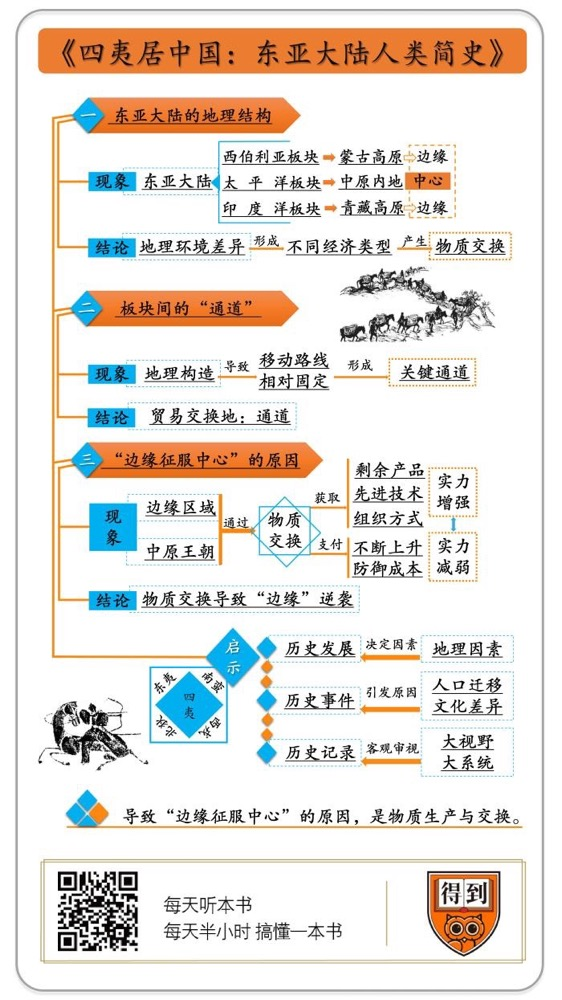

# 《四夷居中国》| 卞恒沁解读

## 关于作者

张经纬，上海博物馆馆员，人类学学者，专栏作家，译者。长期从事中国古代民族史与当代民族文化研究，力图突破世界各民族历史的局限，尝试全新的人类史写作。译有《石器时代经济学》《伊隆戈人的猎头》等多部学术作品。在《南方都市报》《南都周刊》《东方早报》《澎湃新闻》和《腾讯·大家》等平面及网络媒体设有专栏，定期向公众传播人类学知识。

## 关于本书

《四夷居中国：东亚大陆人类简史》是作者耗费五年之功完成的心血之作。本书不拘泥于历史文献，穿透时空的迷雾，对中国历史的旧现象提出了新解释。

## 核心内容

作者张经纬提出东亚大陆由三大板块构成，各大板块内部的人群拥有不同的经济类型。不同经济类型之间的物质交换引发了人口的迁移，这可以解释古代中国为何屡屡出现“边缘征服中心”的历史现象，也为中国早期国家的起源提出了新的假设。

## 前言

你好，欢迎你每天听本书。

有一种说法，我们都很熟悉，那就是古代中国的历史上频繁出现“边缘征服中心”的现象：西周是一个边缘的小国，结果征服了位于中心的商朝；秦国也是一个边缘的国家，结果统一了天下；隋唐帝国都和原本位于边缘的鲜卑族拥有深刻的渊源；元朝和清朝也都是位于边缘的少数民族建立的国家。为什么会出现这种现象呢？

关于这个问题，有各种回答。有的人说，是因为边缘地区的人群更为彪悍和勇猛，但你看汉朝也曾经把匈奴人打得落花流水啊。有的人说，是因为边缘地区的人群更容易进行组织制度上的创新，但你看蒙古人的组织制度其实非常粗疏，而且在建立元朝以后，因为制度建设迟迟跟不上，最后八十多年就灭亡了。

可见，过去的答案都有这样或那样的问题。今天给大家讲的这本书叫做《四夷居中国：东亚大陆人类简史》，作者在书中就提出了一个说法，给这个问题提出了一个新的解释。作者的观点可以概括成一句话：导致“边缘征服中心”的原因，是物质的生产和交换。

作者的思路可以拆解成以下步骤。首先，我们中国所处的东亚大陆，是由三个板块拼接在一起的，其中一个板块，就是中原王朝所处的农业地区。生活在其他两个板块的人群，对于中原王朝而言都是“边缘”人群。

其次，板块与板块之间，拥有一些固定的通道。位于通道附近的边缘人群，可以与中原王朝进行贸易，用一些特产来交换中原王朝的剩余产品，因此也和中原王朝保持着良好的关系。依靠中原王朝的剩余产品供应，这些边缘人群逐渐强大起来。

接着，中原王朝为了能够以尽量低的成本来维持自身的安全，就会再用剩余产品去雇佣这些强大起来的边缘人群，让他们协助自己，保卫边疆。

最后，这些边缘族群依靠这些农业产品，人口进一步繁衍，终于中原王朝再也支付不起雇佣他们的成本。一旦中原王朝发生内乱，这些边缘族群就可能乘机入主中原。这就是“边缘征服中心”的奥秘。

所以，我将通过以下几个重点，帮助你完成这场东亚大陆上的探险之旅：第一，作者将东亚大陆划分为哪三个板块；第二，什么是板块之间的“通道”，物质如何经由“通道”进行交换；第三，物质交换是如何导致“边缘征服中心”的。

## 第一部分

先看第一部分，作者将东亚大陆划分为哪三个板块。

作者认为，我们中国所处的东亚大陆，是由三个板块拼接在一起的。第一个叫做<u>西伯利亚地台板块</u>，也就是北方西伯利亚到蒙古高原的这块高地。第二个叫做<u>太平洋板块</u>，也就是汉人生活的中国内地，因为临近太平洋，所以叫太平洋板块。第三个叫做<u>印度洋板块</u>，也就是青藏高原这一带，因为靠近印度洋，所以叫印度洋板块。三个板块像齿轮一样，相互咬合在一起。

这样说你可能觉得有点模糊，不要紧，有一种说法你肯定印象深刻，那就是农耕民族和游牧民族之间的矛盾。在中国古代，北方的游牧民族经常南下入侵农耕民族的领地，为了防御游牧民族，中原的农耕民族就修建了长城。

这组矛盾其实是地理因素决定的，有一条分界线叫做400毫米等降水量线，在这条线的北边，降水量比较少，就成了游牧民族的故乡。而在这条线的南边，降水量比较多，就孕育出一个巨大的农耕文明。有意思的是，400毫米等降水量线和长城刚好是基本重合的，它是游牧地区和农耕地区之间的分界线。

这里的游牧地区，就是刚才说的西伯利亚地台板块，农耕地区，就是太平洋板块，再加上一个印度洋板块，就构成了完整的东亚大陆。印度洋板块也就是今天的青藏高原，这一板块虽然在纬度上和太平洋板块差不多，但因为海拔特别高，地理环境也独具特色。这一地区的人群包括两类人，一类是青藏高原北部的游牧部族，另一类是在河谷地区以河谷农业为生的人群。

你看，作者划分这三大板块，主要的依据是地理环境。不同的地理环境，会产生不同的“经济类型”，也就是人群对自然环境的适应方式。比如古人说的“南人乘舟，北人乘马”；今天我们说的，北方人爱吃面，南方人爱吃大米；北方有暖气，南方没暖气。这些说的都是北方和南方在经济类型上的差异。

这就回到了这本书的书名，《四夷居中国》。什么是“四夷”？四夷分别是东夷、西戎、南蛮、北狄。这其实来自早期中原地区的人群对周边地区人群的观察。比如《礼记》里说，东夷这个人群的特点是“披发文身，有不火食者”，披散着头发，身上有文身，不吃熟食。西戎这个人群的特点是“披发衣皮，有不粒食者”，同样披散着头发，身上穿着毛皮，不吃五谷。

你看，这里对“四夷”的描述，其实就是从他们对环境的适应方式入手的。穿什么衣服，吃什么食物，就是“四夷”的经济类型。早期中原地区的人群已经发现了，不同地理环境中的人群，会产生不同的经济类型。不同经济类型的人群之间，就可能发生物资的交换。农业经济相对于游牧、渔猎、采集这些经济类型而言，具有相对的优势，能够积累一定的剩余产品。从事农业的人群就会用剩余产品去和其他人群进行贸易，交换一些其他产品。

但进行贸易是需要道路的，所以这种交换一般都发生在固定的通道上，位于通道两侧的人群，尤其是位于板块之间通道两侧的人群，也就更容易参与贸易。于是一个新问题产生了，什么是板块之间的通道？

## 第二部分

关于板块之间的通道，作者从一位向导身上获得了灵感。这位向导是第一位在东亚大陆上进行连续旅行的人，也就是秦朝的始皇帝。在此之前，没有人能有这个条件，要么是没有足够的经济条件，要么是无法打破东亚大陆上的各种政治界限，把东亚大陆当作一个整体来加以观察。

作者从《史记》中对秦始皇出巡的记载入手，画出了秦始皇旅行的轨迹。他发现，秦始皇在许多时候都选择了相同的路径，比如他在公元前219年和前210年两次南巡的起点或终点，都选择了秦岭东段的“武关道”这一路径。同时，这条路径将秦朝的政治核心也就是渭河流域与陕西省西南部的汉水流域连在了一起。

作者由此意识到，古往今来人类的移动路线往往是固定的，这些相同的路径显然并不是巧合，而是地理上的构造决定的。人们到了一个地方，往往会发现有一条路走起来最为轻松简便。作者把这种路称为“通道”。

在东亚大陆的版图上，作者列出了许多通道，其中最重要，也最为我们所熟知的都是两大板块之间的必经之路，比如连结新疆和内地的河西走廊，连结西藏和内地的茶马古道，以及连结东北和内地的辽西走廊，这里坐落着著名的山海关。我们可以注意到，在这些通道上，曾经发生过大量著名的历史事件，而且这些事件都与不同人群和文化的碰撞有关。

比如河西走廊，这是内地通往新疆以及中亚的要道。汉代的张骞通西域，唐代的玄奘赴西天取经，清代的左宗棠收复新疆，都曾经过这条要道。在贸易的丝绸之路上，河西走廊也是必经之路。

比如茶马古道，虽然它在汉朝以后才开始知名，但事实上它是一条很早就被发现的群山之间的道路。内地和青藏高原上的人群通过这条道路，保持着密切的交流，也保持着长期的贸易关系。再比如辽西走廊，这里坐落着号称“天下第一雄关”的山海关。关外的女真人和关内的汉人，曾经在这条走廊两侧进行繁荣的贸易。

类似这样的通道纵横交错，在东亚大陆上铺开了一张联系网络，也就是一张相对固定的地图。不同人群就在东亚大陆上，沿着这些通道进行交流，从而谱写了东亚大陆的人类史。

那么，物质是如何经由这些“通道”进行交换的？

交换的前提是不同的经济类型。不同人群面对他们所处的自然环境，发展出了不同的适应方式，也因此发展出了不同的经济类型。他们生产出了不一样的产品，这种差异就会导致交换成为必要。所以，物质交换往往发生在不同经济类型的人群之间的通道上。

我们先来看一个较为久远的例子。西周有一本重要的历史典籍，叫做《穆天子传》，里面记载了周穆王生平的故事。里面说周穆王有八匹骏马，能够日行万里，拉着穆王到处巡视。这八匹骏马合称“八骏”，后来变成中国艺术史上的一个很重要的意象，徐悲鸿就有一幅名画叫《八骏图》。

除此以外，《穆天子传》中还提到一位名叫“造父”的御者，也就是替周穆王驾驶马车的人。造父还有一个后人叫做“非子”。另一本史书《竹书纪年》里记载，西周的周孝王即位以后，为了获得长期的马匹来源，曾经派兵攻打西戎。西戎是骑马的部族，他们恰恰生活在一个重要的通道也就是河西走廊附近。而这一时期的周人是渭河平原上的农耕部族，河西走廊也就成为周人和西戎之间进行物质交换的通道。

在周孝王的武力之下，西戎在周人面前臣服，开始为周朝提供马匹，交换的是周朝对他们的安全上的许诺。西戎之中的一支还开始为周天子养马喂马，这一支的首领就是非子。造父和非子都有一个重要的身份，他们是秦人的祖先。后来秦国的君主们，乃至统一天下的秦始皇，都是他们的后人。

到这里我们已经看出事情的全貌了：造父和非子都是秦人的祖先，造父擅长驾驭马匹，非子擅长养马和喂马，总之擅长和马打交道。这是因为秦人本就是西戎的一支。周孝王征服西戎以后，秦人就开始专门为周朝提供马匹方面的服务。因为这个原因，秦人也与周朝走得更近。

周朝扶植秦人，也是为了让秦人去帮助周朝防御西戎的其他部族，同时也监督西戎按时提供马匹。所以在经济上给秦人送去了更多的物资，在政治上对秦人加以拉拢和收买。秦人的某一任首领秦仲，曾经被周宣王封为大夫。这有点像今天的美国，在某些国家内部扶植自己的代理人。你看，在这个例子当中，河西走廊充当了周人和西戎之间物质交换的通道，交换的主要标的物是马匹。

我们再来看一个较为晚近的例子。辽西走廊是沟通中原和关外的要道。女真人生活的关外也就是今天的东北地区，在当时气候不太稳定，经常发生波动。女真人主要依靠渔猎和采集为生，过着自给自足的生活。

起初，作为一个农业帝国的明朝希望能够在关外推进农业生产方式，但因为气候影响，没有成功。后来在1406年，明朝为了购买马匹，在今天辽宁抚顺附近设置了马市，也就是进行马匹交易的市场。但事实上，马市本身除了交易马匹以外，还一直是女真与明朝交易各类特产的场所。女真在市场上交换的物品，有人参、兽皮、木耳等等，换来的是明朝的粮食、盐巴、铁锅等生活必需品。这也是一种通道上的物质交换，可以简化为人参和粮食的交换。

## 第三部分

好的，舞台的布景已经铺好，我们即将走向那个最后的谜底：物质交换是如何导致“边缘征服中心”的？

我们还是先来看西周的例子。到了西周最后一任君主周幽王的时候，周朝的对外用兵日益频繁，对于战马的需求也日益旺盛，导致对于西戎的物质索取超出了后者能够承受的限度，于是西戎不断入侵，周朝的西部边疆不断告警。这个故事的重点是周幽王上演了“烽火戏诸侯”的戏码，最后西戎的一支，也就是犬戎攻进西周的国都镐京，西周也就灭亡了。

西周为了马这种关键性的战略资源，对西戎过度索取，最终导致西戎的反叛和西周内部的坍塌。西周灭亡以后，周平王把国都迁到东边的洛邑，这就是著名的“平王东迁”，历史进入东周时期。

颇有意思的是，犬戎虽然灭亡了西周，但最终的获益者并不是犬戎，而是与西周物质交换最为频繁的秦人。与周朝的物质交换，使得秦人接受了周人的生产方式，开始从事农耕。秦人的数量逐渐繁衍，并且接受了周人的文化和组织方式，成为一支潜在的强大力量。

犬戎的入侵为秦人提供了千载难逢的机会。西周向秦人许诺，如果秦人能够打败入侵的犬戎，收复关中，那么关中就归秦人所有。于是秦人就开始大批东进，进入曾经属于西周的渭河流域，打败了犬戎，占据了这片土地，同时也驱使犬戎被迫东迁。秦人在渭河流域生根发芽，休养生息，这是他们从边缘走向中心的第一步，也是日后统一中国的前奏。

其实，西周自己也曾走过类似的历程。周人原本并不是一个完全的农耕部族，而是陇西岐山地区中的半游牧半农耕部族，拥有丰富的马匹资源，这种资源恰恰是商朝所渴望获得的。商纣王曾经软禁过周文王姬昌，当时一个归顺了周人的部族为了营救姬昌，向商纣王献上了美女、马匹和战车。后人多以为是美女起了关键作用，但从商朝对马匹的渴望来看，马匹和战车可能才是姬昌得以获释的关键。

获释后的姬昌被商朝授予看守西部边疆的权力，并且以马匹为主要交易品，与商朝保持了长期的物质交换关系。这与后来秦人和周人的关系如出一辙。来自商朝的剩余产品使得周人人数不断增加，并且向东扩展势力，商朝的金属农具等技术成果也不断被周人所掌握。周人的势力扩张到一定程度以后，和商朝的决战也就在所难免了。终于，商纣王在东征淮夷，也就是淮河沿岸的族群以后，国都朝歌出现前所未有的空虚。周武王姬发抓住这个时机，于是成就了武王伐纣的传奇故事。

我们再来看明朝和女真的例子，明末时期，关外的女真人是怎样和明朝成为不共戴天的仇敌，最终还打进山海关取而代之的。

前面说到明朝和女真在关外进行贸易，当时还是一派其乐融融的场景，为什么后来女真和明朝反目成仇了呢？你可能已经注意到了，女真用来和明朝交换的产品中，没有一样是农业经济的产物，而全都是渔猎和采集的成果。明朝鼓励女真拿这些产品来和自己交换，反而促进了女真人开始偏离农业社会的发展轨道，对农业生产不感兴趣，而专注于渔猎和采集，经济结构也就越来越畸形。

还有一个更为意外的结果，女真人原本是分散居住在关外各地的，明朝在关外设置了马市之后，女真人也就越来越多地集中居住在贸易通道的两侧，为了争夺贸易带来的财富，某些女真部落的酋长就建立了自己的武装，互相角逐。明朝为了节省自己的军事开支，也乐于通过授权的方式，授权某些酋长进行自治管理。

明朝这种实用主义的态度，进一步促使军事权力和贸易利润集中到少数有能力的女真酋长手中。当时女真有一个首领叫做王台，手下已经有了上万人，这对于明朝而言，显然不是什么好消息。而且，王台手下还有一个首领叫做觉昌安，他有一个孙子，叫做努尔哈赤。

你看，本来是正常的贸易，却生出这么多问题。而且历史进入十七世纪以后，随着小冰期的到来，气候日益干旱。明朝和女真都开始面临粮食短缺的问题。明朝这边粮食短缺，引起购买力的下降，对关外人参的需求也就随之下降了，毕竟人参不能当饭吃。女真那边粮食短缺，人参又失去了买主，就只能不断通过武力，想要冲进关内，抢夺物资。到了1644年，当饥饿的农民组成的起义军来到北京城下的时候，关外饥饿的女真人也不约而同地来到了山海关。

故事的结局，我们已经知道了。你看，秦人、周人和女真人的这三个例子，是不是惊人地相似。

在此我们做一个小结。处于关键通道上的边缘人群，通过与中原王朝的物质交换，获得了中原王朝的剩余产品、先进技术和组织方式，逐渐强大起来，并且获得中原王朝的授权，为其守卫边疆。而中原王朝为了支付这种不断上升的成本，实力却在相对减弱。一旦遇上时机，比如中原王朝发生内乱，边缘人群也就有可能取而代之，实现“边缘征服中心”的逆袭。

## 第四部分

作者提出的这个理论具有很强的解释力。下面我们要把它放到更广阔的世界，放到东亚大陆的三大板块当中去看，我们会发现，有很多历史问题都得到了解释。比如这两个问题：东汉末年，董卓的西凉军团是如何崛起的；鲜卑民族又是如何在魏晋南北朝时期，成为一股重要的势力的。

作者运用他的理论，给出了一个类似的解释。秦汉时期的中原王朝，都面临着来自北方匈奴的威胁。这是一个我们非常熟悉的故事，本质上也是太平洋板块和西伯利亚地台板块之间的矛盾。我们都知道，为了防御和打击匈奴，秦汉两代的帝王们都付出了不懈的努力。

秦汉两代中原王朝应对游牧民族的手段，可以分为三类。

第一类是秦始皇的做法。他为了防御匈奴，建造长城，直接动员大量人力戍边，迅速耗尽了大量剩余产品，这成为秦朝迅速崩溃的原因之一。第二类是汉武帝的做法，他吸取秦始皇的教训，在西北边境进行屯田，减少了食物在运输过程中的损耗，以支持他对匈奴的军事打击行动，成功逼迫匈奴逃往漠北。

但在匈奴逃往漠北以后，汉朝与匈奴的空间距离再次变得遥远，汉朝对匈奴的战争也出现了耗尽国力的趋势，以至于汉武帝在晚年幡然醒悟，下罪己诏，宣布休养生息。然而，逃往漠北的匈奴仍在不断地消耗汉朝的国力，以至于王莽宣布要厉行节俭的时候，能够获得百姓们的一致拥戴。

第三类是东汉光武帝刘秀的做法。东汉建国之际，匈奴卷土重来。东汉与匈奴的几次冲突，使东汉出现了新的财政危机。这时，大臣班彪，也就是《汉书》作者班固的父亲，提出了一个全新的对匈奴策略。这个策略可以用一句话概括，叫做“不劳师而币加”，说白了就是汉朝不必自己出兵，而是花钱收买其他族群来对付匈奴。收买哪个族群呢？主要就是河西走廊附近的羌人，和蒙古高原东部的乌桓以及鲜卑。这两个族群一西一东，刚好把匈奴围在中间。

在班彪的建议之下，光武帝设置了护羌校尉和护乌桓校尉，对羌人、乌桓和鲜卑进行管理，向他们的首领赐予官职，还定期给予经济上的资助。于是羌人、乌桓和鲜卑就暂时成为了东汉的雇佣军，协助东汉攻打匈奴。

公元89年，是东汉历史上值得纪念的一年。这一年，车骑将军窦宪率军出击北匈奴，东汉方面的兵力构成中，羌人、乌桓和鲜卑占了相当大的比例。据作者统计，东汉自身的兵力与外族雇佣军的兵力之比，达到了惊人的1:5。

这一战最后大获全胜，北匈奴投降者达二十余万人，其余向西逃走。东汉看似一举扫除了边患，实际上却埋下了更大的祸根。因为每年给这些外族雇佣军的赏赐，已经达到了一个惊人的数字。光是给鲜卑的资助，东汉的青州和徐州每年就要拿出两亿七千万钱。这些流往外族的物资，帮助他们发展壮大。而且在北匈奴逃走以后，鲜卑占据了他们的地盘，人口繁衍，日益强盛，事实上成为了第二个匈奴。

与此同时，河西走廊一带的羌人，因为长期协助东汉作战，形成了职业军人的传统，成为一个强大的军事组织。匈奴走后，日益强大的鲜卑和羌人，越来越不像东汉的雇佣军，而像是两个更为可怕的敌人。

事情发展到这一步，又开始向似曾相识的方向发展，只等出现一个新的历史契机。终于，东汉由于长期供养外族雇佣兵引起的国库空虚，以及地方官员的腐败，而爆发了黄巾起义。西凉军阀董卓率领着他那支羌人和汉人混合的军队趁机崛起，一度占据了京师，掌握了最高权力。而在后来的西晋灭亡以后，鲜卑成为中国北方最重要的一支力量，他们进入中原，建立了一系列政权。曾经统一中国北方的北魏和北周，都是鲜卑人建立的王朝。甚至隋朝和唐朝，也和鲜卑人摆脱不了联系。

这个故事和此前的周人、秦人的坐大，以及此后女真人的崛起，看上去是那么的相似。

小结一下，在这一小节里，我们使用作者的理论，解释了一段覆盖整个东亚大陆的历史。在这段历史中，中原农产区的东汉为了对付蒙古高原北部的匈奴，用物质交换的方式，去吸引河西走廊的羌人与蒙古高原东部的鲜卑来为自己作战。这种手法，非常类似于商人对周人的利用、周人对秦人的利用，以及明朝对女真的利用，其过程和结果都基本相似。作者的理论在整个东亚大陆的视野中，再一次得到了验证。

## 总结

说到这里，我已经为你拆解了作者的整个理论，并使用了书中的四个事例，来对这个理论进行验证。下面，我想分享一下我从中获得的三点启示。

首先，地理因素在历史发展中往往具有决定性的作用。地理条件是上天发到玩家手中的牌，这手牌打成什么样，固然要看玩家的能力，但终归不能摆脱地理条件的限制。因为地理条件是固定的，所以与地理条件相关的某些历史规律也是固定的。在类似的情况下，雷同的剧情总会不断上演。这种现象要到现代科技克服了地理因素的束缚之后，才能得到改变。

其次，人口迁移和文化差异，是许多重大历史事件的起因。我们看到的许多冲突乃至战争，背后不一定是个人的恩怨或者野心，往往是由于人口迁移的压力。文化的差异又往往是这种压力的来源，这里的文化不仅是语言、文字这些具体的事物，还包括更为根本的东西，那就是一个族群的经济类型，或者说得更直接一点，他们靠什么吃饭。

最后，我们作为中国人，读到的用汉字写成的历史文献，大多是古代的汉人们站在他们的立场上留下的记录，难免带有汉人中心主义的色彩。我们应当用更大的视野去审视中国所处的东亚大陆，去观察不同族群之间的互动，并将这些互动放进一个更大的系统去观察，才能获得对于过往历史的客观认识。

撰稿：卞恒沁

脑图：摩西 

转述：李璐