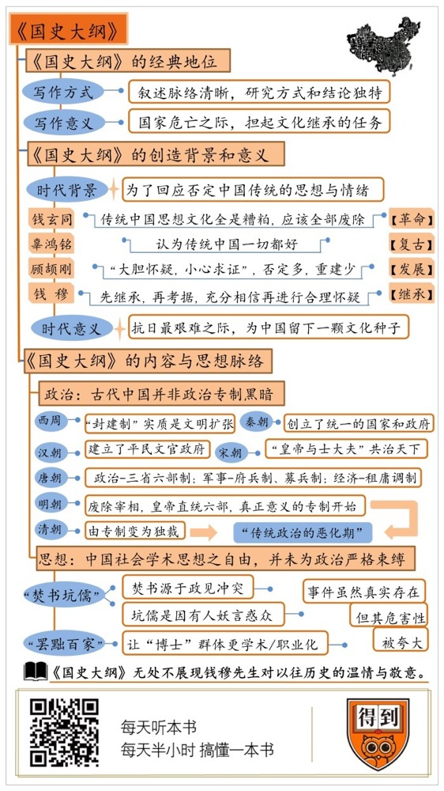

# 《国史大纲》| 段文强解读

## 关于作者

钱穆，中国现代著名历史学家、思想家、教育家。与吕思勉、陈垣、陈寅恪并称为“史学四大家”。

## 关于本书

这本书虽然写成于1939年，出版于1940年，但至今仍是影响最大的中国现代通史类书籍之一。史学家严耕望曾经评价道：目前所有各种中国通史中，仍以宾四先生的《国史大纲》为最佳。陈寅恪也曾评论书中的《引论》是“一篇大文章”。一本大纲体例的历史书，居然能获得如此高的评价和影响，这本身就是一件值得关注的事情。

## 核心内容

一、钱穆的史学思想和《国史大纲》的创作背景；

二、钱穆的思想和“时代意义”是如何在书中体现的？

## 前言

你好，欢迎每天听本书，今天为你解读的是一本史学名著，《国史大纲》，作者是钱穆先生。钱穆字宾四，笔名公沙、孤云，号素书老人、七房桥人，与吕思勉、陈寅恪、陈垣并称“史学四大家”，这本《国史大纲》是他的代表作之一。

这本书虽然写成于1939年，出版于1940年，但至今仍是影响最大的中国现代通史类书籍之一。史学家严耕望曾经评价道：目前所有各种中国通史中，仍以宾四先生的《国史大纲》为最佳。陈寅恪也曾评论书中的《引论》是“一篇大文章”。一本大纲体例的历史书，居然能获得如此高的评价和影响，这本身就是一件值得关注的事情。

我们都知道，中国人非常注重“历史”书写。在内容上，有《竹书纪年》《春秋》《二十四史》《资治通鉴》等名著。在体例上，编年体、纪传体、纪事本末体、通史、断代史更应有尽有。在清朝编纂的四库全书中，史部共收录2102种书籍，可谓是洋洋大观。20世纪之后，中国的历史书写就更是兴盛，据不完全统计，仅和《国史大纲》相同体例的书就不下50种，成书较早的有夏曾佑的《中国古代史》，内容较丰富的有李定一的《中国史纲》。而严耕望的评价，就是在这样的背景下做出的，可见《国史大纲》的独特地位。

一般来说，一本历史著作能获得独特的地位，主要有两种情况。第一，是开山立派。比如司马迁的《史记》是纪传体史书的巅峰，后来的《汉书》《后汉书》和其余的正史，最多在细节上小修小补。比如《汉书》开创了“断代史”的先例，大体还是只能跟随《史记》的脚步。第二，是在研究上开创了先河，比如《古史辨》和《万历十五年》就是“古史辨派”和“大历史观”的代表作。

那么，《国史大纲》属于那种情况呢？首先，这两点《国史大纲》都有。在新式通史类著作中，《国史大纲》虽然不是开山之作，却是叙述脉络最清晰的。用史学家王家范的话说，就是“无论分期系统，还是对每一时段特征的界定，往往能以数语笼括一代大局”。其次，书中也有很多独特研究方式和结论，这部分的具体内容，会在后文详细讲述。不过，虽然这两点《国史大纲》都具备，但这还不是最重要的原因，比这更重要的是它的“时代意义”，这个时代意义就是“为往圣继绝学”。简单来说，就是在国家危亡时候，担起树立历史精神和文化继承的任务。

正是因为有这样的时代意义，无论身处什么时代，读者依然透过晦涩的文字，感受到自己与历史的对话。 

接下来，我就通过两个部分，来解读这本《国史大纲》，读懂它的时代意义。第一部分，我们先来聊聊，钱穆的史学思想和《国史大纲》的创作背景，说一说他为什么要写这本书？第二部分，我们再来聊聊，钱穆的思想和“时代意义”是如何在书中体现的？也就是这本书的主干内容。

## 第一部分

我们先来说第一部分内容，《国史大纲》的创造背景。

这本书的写作，有两个时代背景，一大一小，我们先来说大的时代背景。

我们都知道，1840年爆发了“鸦片战争”。中国不仅在这场战争中战败，割地赔款，还开始遭受西方文明的强烈冲击。在冲击的过程中又发生了一系列的屈辱性战争，比如“第二次鸦片战争”“甲午海战”“八国联军侵华”等等。从前我们是天朝上国，现在居然被蛮夷打得满地找牙，这在观念上给中国人造成极大了的冲击。所以，李鸿章才说此乃“三千年未有之变局”。 

冲击之后，中国人就开始反思。反思大致经历了两个阶段，首先“师夷长技以制夷”。这种反思认为中国其实大体都很好，就工业、军事不行，所以只学习西方的技术就可以了。于是，就有了后来李鸿章、张之洞等人的“洋务运动”。不过，洋务运动虽然取得了一定成果，却是治标不治本，最终在甲午战争中一败涂地。此后，中国人开始了第二阶段的反思。这种反思认为，中国和西方的根本差距不在工业与军事，而在制度和文化，所以要对文化与制度进行改革，代表人物是康有为、梁启超、孙中山等。

总的来说，两个阶段的反思虽然没有完全达到预期效果，但都推动中国向前发展，是好事。但从清末民初开始，这种反思开始变得极端。很多人甚至认为，西方的技术、制度、思想、文化都是先进的，中国应该完全抛弃传统进行“西方化”。其中，最典型就是文学家钱玄同。他认为，传统中国思想文化全是糟粕，应该全部废除，而第一个应该废除的就是汉字。钱玄同有一段话非常有名，我给你念一下：欲使中国不亡，欲使中国民族为二十世纪文明之民族，必以废孔学，灭道教为根本之解决，而废记载孔门学说及道教妖言记载之汉文，尤为根本。

这段话的意思就是：要使中国进步，就必须废除儒家和道教，而废除这两项的办法，就是废除记载这些思想的汉字。当时，和他持有同样思想的人不在少数。当然，有全盘否定的，就是全盘支持的，比如有个学者叫辜鸿铭，他就认为传统中国一切都好，包括留辫子、纳妾、裹小脚。不过，当时站在钱玄同一边的人多，站在辜鸿铭一边的人少。

在这种思想氛围下，历史学也受到了影响。这里不得不提的两个人，就是钱穆与顾颉刚。顾颉刚是“古史辨派”的创立者，“古史辨派”也称为“疑古派”，思想核心，就是对于历史“大胆怀疑，小心求证”。比如，顾颉刚认为，中国史书中的上古历史，大部分都是臆造出来的，他就曾说治水的大禹并不存在，这个形象是从虫型的纹饰演化出来的。这个观点后来被简化成“大禹是条虫”。古史辨派的影响既有正面，也有负面，正面是推动了中国历史研究的发展，让我们能用更清晰的眼光看待历史记载；而负面则在于，对于上古史的态度是先全盘否定，再一点点重建。结果，否定得多，重建得少，这等于摧毁了原先的古史系统，这对中国文化，尤其是儒家文化产生了很大的冲击。这很符合钱玄同的思想和目标，所以他和顾颉刚的关系很好，对“古史辨派”的影响也很大。

如果说，顾颉刚对历史的态度是先否定，再重建的话，那钱穆就正好相反，他是先继承，再考据。也就是在对历史充分相信的基础上，进行合理的怀疑。比如，顾颉刚基本否定夏朝的存在，而钱穆则是大体上承认夏朝的存在，但对于很多具体的事件表示怀疑或干脆否定。比如，他在书中就说，夏朝的桀、商朝的纣，还有周朝的幽王，原本不是什么暴君，所谓的“劣迹”都是后人杜撰的。 所以，如果我们画一个“光谱”的话，钱玄同和辜鸿铭在两极，顾颉刚和钱穆都位于二者之间，顾颉刚偏向钱玄同，钱穆则偏向辜鸿铭。

听到这，你可能会觉得，这有什么，不就是学术态度不同吗？这个问题，可没有这么简单。他们四个人，分别扮演着不同的角色和使命。如果都用一个词来概括的话，钱玄同是“革命”，顾颉刚是“发展”，辜鸿铭是“复古”，钱穆是“继承”。“革命”必须要彻底，否则不足以推翻帝制王朝；“复古”也要彻底，否则就不是真正的复古；“发展”则需要先破后立，所以对于古史系统，顾颉刚先摧毁，再重建；而继承的关键，是找到过去与现在的关联。

这时候，中国在文化上的现状是，全面复古，则完不成现代化；全面否定传统，则中国不再是中国。这就是继承的意义，而钱穆一生都在尝试解决这个问题。这一点，从他很多著作的名称就可以看出来。比如，《国学概论》《中国文化史导论》《中国历代政治得失》《中国历史研究法》《中国文化精神》《中国历史精神》等等。而这本《国史大纲》就是最具代表性的著作，钱穆在引论中说，他写作这本书有两个目的，第一，简明且清晰的体现中国文化、社会的演进过程和真相；第二，能从历史中看到哪些是精华，哪些是问题，作为今后国家、社会发展的参照。说白了，第一点是在说“我们从哪里来”，第二点则是说“应该到哪里去”。对于以往的中国历史，钱穆认为应该存有一份温情与敬意，具体来说就是：不要视本国历史为无一点有价值，亦无一处足以使彼满意。我们不要认为自己是站在以往历史的最高顶点，而将我们当身种种罪恶与弱点，一切诿却于古人。

这就是《国史大纲》的第一个时代和意义。它的第二个时代意义，就跟具体的成书时间有关了。

前面说过，这本书写就与1939年，正是抗日战争最艰难的时期。钱穆原本在北大任教，七七事变爆发后，钱穆先随着北大，后随着西南联大辗转大半个中国。这段时间，可以说是抗战最灰暗的时期，华中、华南相继失陷，国民政府被迫迁往重庆，随后汪精卫又公开投敌，建立伪政权。当时，很多人都认为，中国可能战败沦陷，其中就包括钱穆。所以，在到达昆明之后，钱穆就在寺庙中专心写书，为的是，中国万一陷落了，这本书可以成为一颗文化的种子，让后人在追寻历史时有迹可循。这是，这本书的第二个时代背景和意义。

其实，无论是为了勾连古代与现代，还是为了给后人留下一颗文化种子，其核心还是“继承”二字。这部分的内容，差不多就可以结束了。但最后，我还想跟你聊一聊钱穆这个人。为什么在面对传统的时候，钱穆和钱玄同、胡适、顾颉刚那么不一样？除了理念不同之外，跟的身份也有关系。钱玄同是日本留学生，顾颉刚受钱玄同很大，而且一毕业就留任北大。他们说到底，都是上层的专业研究者。但钱穆，并不是留学生或高等学府出身，他原本就是一个普普通通的中学教师。他在中学教书十几年，后来因一本《先秦诸子系年》成名，受顾颉刚的推荐，才到北大任教授的。史学家余英时说过，史学家的责任有两个，一是史学专业的本身，一是史学对社会的责任。专业研究者出身的顾颉刚更注重前一种责任，而中学教师出身的钱穆更注重后一种责任，也就是让新一代对传统中国有所了解、接受、继承和反思。所以，就在钱玄同想推翻传统中国，重新“为天地立心”的时候，钱穆孜孜不忘的是如何“为往圣继绝学”。

所以，在诸多对钱穆的评论中，我认为思想家霍韬晦最为中肯。他说：在迷惘的时代，能够终生不渝地捍卫中国文化，并显示读书人的风骨，钱穆先生堪称楷模。

## 第二部分

在知道《国史大纲》的创作背景和意图之后，第二部分我们就来看看，这些内容在书中的体现。

在说具体内容之前，我们先来简单说一下这本书的形式。刚才我们说到，本书是在抗日战争期间写成的，这就给写作造成了很大的影响。首先，钱穆一行人从北京到昆明，属于避难性质，因此不可能携带大量的文献资料。其次，在战乱的年代，纸张也非常缺乏，而且当时钱穆已经离开学校，住进寺庙专心写书，写作条件整体比较差。第三，当时抗日战争形势恶劣，钱穆不知道中国还能支撑多久，所以希望尽快写成。在这种情况下，钱穆只得采取高度结构化的写作方式，就是把中国历史依照朝代划分，从上古一直到抗日战争时期。所以，重点谈论的是每一时期的政治、经济和思想，至于艺术、宗教、技术等，除了非说不可的内容，例如“佛教传播”等，其余则基本不提，或者一笔带过。所以，这本书才以“大纲”为书名。 而为了弥补书中缺失的内容，钱穆后来还写了《中国文化导论》《中国文化精神》等书。不过，这种“缺失”非但不是这本书的缺憾，反而造就了本书最大特点。

对于历史书写，思想家梁启超曾认为，古代中国的历史书写，就是人物谱牒，而不是真正的历史，他甚至还说：二十四史非史也，二十四姓之家谱而已。

对于“二十四史只是家谱”的言论，钱穆并不赞同，但对于历史必须探察“国民全体之经历，及其相互之关系”的观点，钱穆是非常同意的，这也是《国史大纲》的写作目标之一。钱穆在书中既不以人物为主，也不以事件为主，而是主要只讨论一个问题，就是社会变迁，这非常符合上面所说的标准。

下面我们就从政治和思想两个方面来看钱穆的思想脉络。

先说政治。前面我们提到过，辛亥前后，中国人对自身传统的反思，趋向于极端否定，认为“中国自秦以来二千年，皆专制黑暗政体之历史也。”用“专制黑暗”四字一笔抹杀。钱穆通过对传统中国政治制度演化过程的考察，提出“中国自秦以下二千年，只可说是一个君主一统的政府，却绝不是一个君主专制的政府。” 真正的专制独裁，是从明朝开始的。 

钱穆对这个问题的叙述，主要从西周开始。对于西周，书中说道：武王灭殷商，把黄河东、西两部更紧密的绾合起来，造成中国古史上更灿烂、更伟大的王朝。为什么说西周是更灿烂、更伟大的王朝？答案就在于“封建制”。我们都知道，中国地域广大，所以中国文明也不止有一个起源。所以，商朝和周朝其实是并存的关系，一个在东，一个在西。因此，武王伐纣并不是简单的政权兴替，而是文化融合。商的遗民并没有被赶尽杀绝，而是被封到宋地建国，融入周的文化和政治体系之中。宋国和周朝的关系，名义上是臣属，实际上却相对独立，这就是封建的核心。周朝的封建进程持续了很长时间，最终形成的封国有几百个之多。注意，这可不是说周占了那么大的领土，然后分给别人。封建实际上是一种文明扩张，具体形式分两种，一种是把不同的文明纳入体系之中，比如宋、吴、楚等国；还有一种，是对相对落后和人迹稀少的地区进行殖民和开发。所以，对于封建制，书中有两个评价，第一，这是一种有极大魄力的政治组织形式；第二，这是一种具有侵略性的武装移民与军事占领。而其结果就是，奠定了中国的地理基础和文化基础。正是在周朝奠定的基础上，几百年后秦朝才能建立统一的国家。

钱穆强调，秦朝的功绩是创立了统一的国家和政府。周代名义上是统一，实际上各诸侯国都是各自为政，而秦朝则真正建立了从上到下的直接统治模式。所以，书中对秦朝的定位是“统一政府之创建”。关于这一点，大家应该已经很熟悉了，所以就不展开了。我们重点说一说汉朝。书中说，汉朝在政治上最大的变迁，就是建立了平民文官政府。什么叫平民文官政府？在西汉中期以前，担任政府官员的人，要么是开国功臣及其后裔，比如名将周亚夫；要么是皇后一族的亲戚，比如名相窦婴。也就是说，这一时期的政府还被统治阶层垄断，而没有平民参与。这种情况到西汉中期才有所改变，功臣和外戚的没落让平民可以参与政治，所以汉武帝时期出现了第一个平民出身的宰相，就是公孙弘。书中对此评价极高，说道：以布衣儒术拜相封侯，此汉朝政制一绝大转变。这个转变对后世影响很大，发展到宋朝形成“皇帝与士大夫”共治天下的局面。

秦汉之后，中国经历了魏晋南北朝的分裂与昏暗，到隋唐时再度统一。在中国历代王朝中，钱穆对唐朝的评价是最高的，他曾经说过：唐朝的政治制度是它远超世界其他一切以往的伟大国家之所在。这个问题很复杂，这里只能作简单的综述。在中央政治上，汉朝的政府权力归于个人，比如丞相和“三公”，而唐代的三省六部制则归于机构，这样既可以限制皇帝专制，也可以预防宰相专权。在军事上，唐朝以前采取的是兵役制，也就是所有人都有当兵出征的义务，而且武器马匹都要自备。这不但影响了农业生产，还加重了平民负担。而唐朝前期采取的是府兵制，也就是设立专门的“军籍”，不用全民皆兵。后期则是直接采取募兵制，中国从此才算正式有了职业军队。而经济方面的租庸调制，则是简化了税收方式，减少了税收成本。

后来的宋朝，大体延续了唐朝的政策，但因为政府机构和军队的臃肿，造成了积贫积弱的局面，先后两次灭亡于游牧政权。明清时期则又是中国政治的一大转折，明朝废除宰相，皇帝直接领导六部，真正意义上的专制由此开始。所以，钱穆称这一时期为传统政治的恶化期，而清朝则比明朝更进一步，由专制变为独裁。所以，钱穆称清朝政府为“狭义的部落政权”。

这就是书中的政治脉络，从这个脉络中，我们就可以清晰的了解每一时期的政治关键和演变过程。同时也说明了，中国不是“自秦以下两千年内都是专制黑暗”，真正的专制独裁是从明朝开始的。所以，钱穆才说，那些一味指责古代中国专制黑暗的人，并不是真的了解中国历史。

前面讲的是钱穆在政治制度方面的观点，而在思想方面，钱穆的关怀也有具体所指。当时有很多人，在认定秦以后的中国都是专制黑暗的基础上，又认为“中国自秦以来二千年，思想停滞无进步”。对于这样的观点，钱穆也有话说。

在当时很多人的心目中，中国思想界有两个罪人，一个是焚书坑儒的秦始皇，另一个是独尊儒术的汉武帝。这两个帝王，一个烧毁了诸子百家的书籍，一个把儒家思想定于一尊，都压制了思想自由和学术自由，让此后的中国都陷在儒家的桎梏中，导致了近代的衰落。所以，民国时期的政治家于右任才评价汉武帝道：绝大经纶绝大才，功过非在戍轮台。百家罢后无奇士，永为神州种祸胎。你看，“永为神州种祸胎”这话多么重，完全将近代中国的种种弊端算在汉武帝的头上，没有一点“温情与敬意”。

对于这样的观点，钱穆基本持反对意见。例如，书中评价“焚书坑儒”时写道：焚书本起于议政冲突，坑儒亦为诽谤、妖言惑众。意思是，“焚书”和“坑儒”本来不是一回事，焚书是因为政见冲突，坑儒是因为有人妖言惑众，都和禁锢思想没什么关系。而对于“独尊儒术”，书中的评价很高，甚至说：“武帝一朝政治上重要改革，举其要者，第一是设立五经博士。”为什么钱穆对“独尊儒术”有这么高的评价，答案在下面这一段话中：“武帝从董仲舒请，罢黜百家，只立五经博士，从此博士一职，渐渐从方技神怪、旁门杂流中解放出来，纯化为专门研治历史和政治的学者。”也就是说，汉武帝罢黜百家，只是让“博士”这个群体更加学术和职业化了而已，并没有真的从社会层面禁绝其他派别的思想。顺便解释一下，古代的“博士”不是学位，而是政府认定和聘用的学术权威。所以，实际上“焚书坑儒”和“独尊儒术”这两件事虽然真的存在，但它的作用和危害性被后人夸大了。

既然“焚书坑儒”和“独尊儒术”都是被夸大了的，那么中国思想因此停滞两千年的说法也不能成立。比如，周朝有儒、墨、道、法的争鸣，西汉有董仲舒的“天人合一”，东汉有儒学清议，魏晋有玄学，唐朝有禅宗，宋朝时更是有王安石、陆九渊和朱熹，明朝有王阳明、顾炎武、黄宗羲等等。事实上，虽然我们常说古代中国是儒家社会，但儒家并不是一成不变的，宋朝的儒家和春秋的儒家有很大区别。因此书中才说：中国社会学术思想之自由，并未为政治严格束缚。

关于思想变迁的具体内容，非常复杂，不是我们一篇说书稿能说清的。但是，在钱穆看来，无论历朝历代的思想如何变迁和演化，它都有一个内核。钱穆在书中说：“古代士大夫有一种自觉精神，所谓自觉精神者，正是那辈读书人渐渐从内心深处涌现出一种感觉，觉到他们应该负担起天下的重任”。实际上，这句话的意思就是我们熟悉的那八个字，“天下兴亡，匹夫有责”。在钱穆看来，这就是中国的思想精神。所以，周代礼崩乐坏时，有百家争鸣；东汉政治腐败时，有儒林清议；北宋积贫积弱时，有范仲淹、王安石；南宋偏安一隅时，有朱熹；明朝衰落时，有东林党人；清朝衰落时，有变法派和革命党。在钱穆看来，中国自古至今绵延不绝，靠的就是这种思想精神。而这一点又和当时的背景密切相关，钱穆希望通过这本书来进一步唤起和激发这种思想精神，让中国度过日本侵略的难关。

所以，史学家余英时才说：钱先生为什么要在这个时候写《国史大纲》？因为他看到抗战时期，中国需要有一种共同的精神来回答，中国为什么不应当投降，不应当被侵略的问题。

而这就是钱穆作为一个史学家，在特殊时期主动担负的社会责任。只有理解了这一层之后，我们才能明白“对历史充满温情与敬意”的含义。它不仅是一种对历史的研究态度，更是一种深刻的责任和情怀。所以，什么是大师？大师不是惊世骇俗就可以了，更重要的是承担相应的社会责任。这就是钱穆给我们留下的背影，瞻望这个背影，会有一种“虽不能至，心向往之”的感觉。

## 总结

到这里，本期音频的主要内容已经讲述完了，最后再来总结一下。

首先，《国史大纲》的经典地位和它的成书背景息息相关。这本书有两个写作背景，第一个背景是在遭受西方文明强烈的冲击之后，中国内部普遍生出一种否定传统中国的思想与情绪，有人甚至认为连汉字都不应该保留。《国史大纲》就是对这种情绪做出的回应。第二个背景是，当时是抗日战争最艰苦的时期，钱穆甚至觉得中国有就此沦亡的可能性，所以要留下一部将来可以继绝存亡的书。

其次，在内容上，钱穆明确指出，古代中国在政治上并非专制黑暗，在思想上也并非停滞不前。他还进一步指出，中国人自古就有一种“天下兴亡，匹夫有责”的自觉精神，而他写这本书也是为了再次激励和唤醒这种自觉精神。也就是说，无论从那个角度来说，这本书都有极其丰富的内容，所以虽然这本书读起来比较吃力，但还是推荐你去读一读原著，真实的感受一下钱穆的温情与敬意。

撰稿：段文强

脑图：摩西脑图工作室

转述：李璐