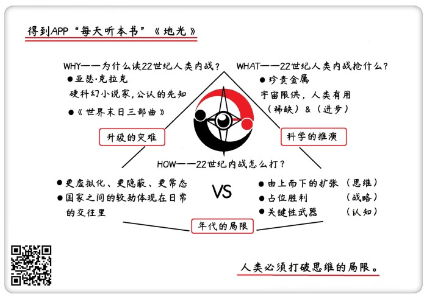

# 《地光》| 怀沙解读

## 关于作者

亚瑟·克拉克，世界现代科幻三巨头之一，硬科幻的代表作家，获过三个雨果奖和三个星云奖，是20世纪用科幻预言未来最成功的小说家。   

## 关于本书

《地光》是克拉克“地球末日三部曲”之一，在这本书里，他讲述了22世纪在人类之间发生了一场星际内战的故事。下个世纪的人类已经殖民了整个太阳系，但还是为了争夺资源，在不同利益群体之间发生了内战，经过一场发生在月球上的星际大战，地月联盟和行星联盟最终握手言和，人类过上了太平的生活。   

## 核心内容

本书的思想核心是：22世纪的人类开始殖民太阳系，但因为资源的问题太阳系被分为两派，一边是重金属资源丰富的地月派，一边是能从外太空补给地球的行星派。月球上被探明蕴藏巨大矿藏之后，一场争夺战在月球附近展开。  

前言

你好，欢迎每天听本书，我是怀沙。这次给你带来的是“地球末日三部曲”。作者是英国科幻作家亚瑟·克拉克。克拉克是现代科幻三巨头之一，世界上最著名的硬科幻作家。硬科幻的定义呢就是所有的故事情节，都是根据已知的科学知识或者科学理论推演得到的。

科幻作家不总是给我们带来好消息的，在这个系列里，我们来看看亚瑟·克拉克是怎么在想象里，让我们人类遭遇灭顶之灾的。“地球末日三部曲”是三个独立的故事，但是说的都是一件事，在未来，人类要完蛋了。面对末日，人类做了各种努力，有的拯救了地球，有的没成功。

老规矩，先给你说说为什么要听这套书——“地球末日三部曲”。

第一个理由来自作者。克拉克的身份，是世界闻名的硬科幻小说家。但从另外一个角度看，他简直就是一个先知。如果要评一个科幻小说家预测未来生活的准确程度，克拉克绝对是第一名。他在20世纪50-70代，可以说完整地预言出了我们今天每个人在科技环境下的生活方式，他预言了电子邮件、预言了搜索引擎、预言出了笔记本电脑，预言了人类会带着笔记本电脑移动办公。他还完整地描写出了人类飞向外太空的细节和执行流程。所以说，如果克拉克的想象力是风筝，那不管这个风筝飞得多远，它都是被科学这根绳子牢牢拽着的。这就是一种负责任的想象。那这样的想象中的人类末日，值得我们每一个人听一听。

第二个理由，我们知道，一般人能想到的地球末日也就是那么几种，什么核战争啊、外星人入侵啊等等。但克拉克一共设定了三个层级的末日，它把人类可能面对的末日排列成了三个层次，这三种灾难是一个不断升级的过程，分别是：人类和自己的矛盾，人类和环境的矛盾，人类和未知的矛盾。我也会用这个顺序给你解读这三部作品。在第一部，也就是我们这期音频要说的《地光》这本书里，讲的是人类内部的矛盾，这个矛盾还是比较容易解决的。但在第二部，《遥远地球之歌》里，讲的是环境的突变，这种毁灭就可怕多了。但是人类很厉害，给予了完美的应对。而在第三部《最后一个地球人》里，人类要面对来自未知的虚空的灾难，是一种未知的力量要毁灭你，人类根本无从反抗。

这三部小说，也是三个人类面对威胁挣扎反抗的故事。听完这三个音频之后，我们能感到人类的顽强，同时更能体会到宇宙的深邃。下边，我们就进入三部曲的第一部《地光》。

《地光》这部小说主要说的是22世纪人类之间的一场星际内战。简单说就是，两伙人类，为了抢东西，最后打起来了。我们这个音频会带着两个问题，来给你解读这部小说：第一个问题：如果22世纪的人类之间为抢夺什么东西而爆发了战争，最可能是抢什么东西呢？小说里给了一个答案，我们一起来分析一下，是不是有道理；第二个问题：如果22世纪的人类之间打了一场星际战争，那么这场战争会是个啥样子呢？下面，我们进入第一个问题：22世纪的人类抢什么？

## 第一部分

在电影《天下无贼》里，葛优有一句名言，叫21世纪最缺什么？人才。那22世纪人类最缺什么？克拉克在小说里给的回答：金属。

我们先来看一下小说的背景。在22世纪，人类变成了一个横跨太阳系的星际文明，在八大行星上都有殖民地。当时的人类，分成两个阵营。一个叫地月联盟，地球和月亮是一伙的。另外一个叫行星联盟，就是除了地球和月亮之外的所有其他行星组成了一个联盟，包括水星、金星、土星、木星、天王星、海王星等，它们一起，是一个联盟。 

照理说，这俩联盟有自己地盘啊，而应该没有矛盾啊。不，一种资源让他们打起来了，他们为了抢金属矿藏，动手了。行星联盟那边虽然占的地盘很大，那么多行星，但他们发现，他们占的那些行星上，几乎没有什么金属矿产。反而是地球和月亮上的金属矿产非常丰富。尤其是在月球的表面下，人类发现了厚度有100公里的金属矿层，各种金属矿产全有。行星联盟因为缺少金属，遇到各种问题，像经济停滞啊，还有工业发展缓慢啊。本来想通过贸易买金属，最后两边也没谈成，最后两边打起来了，爆发了战争。这就是克拉克想象的22世纪的世界格局。我们仔细分析一下，克拉克的这个设定合理吗？首先，亮个观点：非常合理。就算用我们今天人的视角来看，22世纪如果一定要抢资源的话，还真的可能是金属。

为什么会得出这个结论。我们可以简单回顾一下人类的抢夺史。人类在几千年的历史里，为了抢资源，发动过很多战争，包括抢吃的、抢人头儿、抢领土、抢财富、抢能源。后来，随着人类科学的进步，人类越来越发现，其实前面几样根本不用抢来抢去，大家抢最后一个东西，也就是抢能源，就是最高效的。因为人类的科学发达了，只要有了能源，吃的、人口、财富，就都好解决了。所以到了20世纪和21世纪，人类以抢东西为目的的战争，基本就只剩下抢能源了。

而现在科学家预计，21世纪，人类就很有希望彻底解决能源问题。解决的方案就是可控核聚变的技术，只要这个技术突破了，那大海里、月球上，核燃料有的是。那我们是不是出现一个问题？到了22世纪，我们人类是不是就什么都不用抢了呢？

不是。在现有的认知框架里，人类接下来抢的东西，应该会是珍稀的元素，也就是金属。金属对人类发展非常重要，同时又是一种严重限量供应的资源，给我们限供的不是哪个国家，而是宇宙。这就涉及到宇宙生产元素的机制了。我们大致可以这么说，在元素周期表上序号越靠后的元素，就越稀有，因为宇宙把它造出来越难。

我们这个宇宙刚出现的时候，是非常单调无聊的，只有氢元素和氦元素。但我们知道，现在地球上，一共有近百种元素。这些都是宇宙在后来一点点造出来的。而造这些元素的，就是恒星，恒星都是宇宙的炼金炉。恒星炼金炉生产的产品有三种，我们可以分别管它们叫便宜货、高级货和尖儿货。太阳平时生产的全是便宜货，太阳的所有工作就是把两个原子序数是1的氢原子，合在一起，让它们变成一个原子序数是2的氦。平时的太阳就只有这点本事，它生产的氦就是典型的便宜货。

但在太阳生命的最后阶段，它会变成一颗红巨星，就相当于太阳爆炸了，这时候太阳才能生产一些高级货。这个时候太阳肚子里的温度更高，压力更大，就能合成一些原子量更高的元素，比如说，能把6个氢原子和中子合体成一个原子核，变成原子序数是6的碳原子，或者把8个氢原子和中子合体，变成氧原子。但是红巨星的能力也是很有限的，它最多只能生产原子序数到26，也就是铁元素，之后的元素都生产不了了。只有质量大于太阳的1.44倍的恒星，才有资格发生二次爆炸，像一个二踢脚一样又炸一次，这个过程叫超新星爆发。超新星爆发提供的温度和压力，才能生产原子序数是26以上的金属，这时候，原子序数在26以上的尖儿货出现了。

所以，这个宇宙所有元素的大规律就是，原子序数，越往后，就越难生产出来。要合成像金银这样的元素，需要报废掉一个质量是8个太阳的恒星。宇宙就在用这么高昂的代价制造金属元素，它们都是恒星的舍利子，是这个宇宙最稀缺的东西。好，这是金属的一个特点，稀缺。而另一方面，在未来，排位靠后的元素应该会越来越有用。为什么这么说，这是我们在人类社会发展里看到的一个可能的规律。我们看，原始人最开始和水、火、土、石头、野兽这些东西打交道，那组成这些东西的元素就很简单，无非就是，碳氢氧氮磷，还有硅，我们看这些元素的原子序数基本都是30以下。这些元素也是人类和所有低级生命公用的元素。

但后来人类掌握了冶炼技术，会制造工具了，我们就能利用像铁、铜、铝这些元素了，这些元素的原子序数就是20-60之间。我们就能造汽车，造飞机，没有金属元素是不可能做到的。那只有人类在掌握了更高级的知识之后，我们才能用得上后面的元素，比如说造原子弹的铀元素和钚元素，原子序数分别是92和94，你看这就是人类又升级了。而到了21世纪，整个工业体系仰仗的元素就更多了。

你可以试一下，你把元素周期表打开，随便选一个原子序数100以上的任何一个金字边儿的，你可能读都不会读的元素，你百度一下，你都会发现，它一定在人类工业上占一席之地，甚至可能支撑一个行业。同时，它的价格一定不会太便宜。那这时候，我们回看整个人类的发展史，就是一个在元素周期表里往上爬格子的过程。一个文明能利用的元素在元素周期表里越靠后，就说明这个文明的层级越高。如果这个规律存在的话，我们人类在科技进步的过程里，对原子序数靠后的金属的需求量一定会变得越来越大。所以，我们用八个字来总结贵金属，就是：宇宙限供，人类有用。对于我们这个段落提出的问题，答案就是：22世纪，如果人类要因为抢东西而发生战争的话，那大概率上会是抢珍贵的金属。小说里的设定，是非常符合我们现在的科学认知的。

可能原来你看到金字边加一个字，你的第一反应是这东西和我没啥关系，但现在不一样了，你知道它是超新星爆发产生的元素，在未来还可能是对人类非常重要的元素。

下面我们进入第二个段落。标题是，22世纪的人类战争，会是什么样子呢？

## 第二部分

在说未来战争什么样之前，我们还是先来说小说的情节。刚才我们说到人类未来分成了两伙，准备为了抢金属而打仗。但是这本小说的主要情节，还不是描写这场大战，而主要是一个潜伏和反潜伏的故事。小说的主人公是一个地月联盟这边的情报人员，他奉命假装成一个工程师，到月球基地上去找一个叛徒，整个小说的主要情节就是在月球基地上发生的一个侦探小说，有很多人物和细节，我就不详细展开了。最后呢，叛徒算是找到了吧。但就在叛徒快找到的时候，两个联盟之间的一场大决战也打完了。等于这个情报工作没起到什么太关键的作用。

在小说的最后，描写了两个联盟之间的一场大决战，也是小说最高潮的地方。下边我们重点来说说这场战斗的细节。战斗发生的地点，月球表面。地月联盟在月球表面造了一个超级大炮台。为什么要建在这儿呢，因为这个炮台底下，有一个整整100公里深的金属矿床，这是全太阳系最富的金属矿。所以行星联盟必须把这打下来，而地月联盟，必须守住。

我们来看进攻方，是行星联盟的三艘超级战舰，就是浑身都是炮的那种。防守方呢，是一个超级炮台。战斗一开始，两边先用各种武器互射了一下，但不管是飞船还是要塞，都装了各种防护设备，所以这些常规武器，打来打去像挠痒痒一样，基本没啥用。最后，地月联盟这边把终极大招放出来了，是一种超级大炮，是整本小说最厉害的武器，小说的名字《地光》也是从这来的。这个超级大炮刚发射出来的时候呢，所有人都以为是一根从地面射出来的光柱呢，就像一个射向宇宙的探照灯似的。但这道光柱刚一碰到行星联盟的飞船，马上就把飞船的半个身子打掉了。原来，这个所谓的光柱是从地面发射出来一道液态金属棍，就是熔融态的高温的金属液体。它的攻击方法，就是物理攻击，有点像一根金箍棒，地月联盟就用这根几百米粗的大金属棒子在太空里扫来扫去，很快就把行星联盟的战舰给打败了。

那最后的结局就是，地月联盟赢了。这场仗打败之后，行星联盟那边也就服了，两边在火星的卫星上，签了一个火卫一条约，等于说，最后用和平的方式解决了这次宇宙矛盾，太阳系又重回了和平。这就是整个小说的大概情节。

我们再来看，我们第二段落的标题：22世纪的人类战争什么样？你可能会说，小说里不都描写了吗？在这里我们必须指出来。在我们今天看来，未来战争肯定不会是像克拉克笔下这么打的。甚至，我们可以说这场战斗方式，几乎是人类未来的战争的反例。

你可能会说，你凭什么质疑大师？原因很简单，因为这本书是1955年写的。这里要说一句，在所有能找到的这本书的中文版本里，出版商们都特意淡化了写作时间，都只说2013年出版的，这个做法理由也好理解，因为读者听说这是1955年的科幻小说，可能就不买了嘛。但如果不知道写作时间，对读者和克拉克都不太公平。因为这不是克拉克的局限性，而是那个年代的局限性。通过下面我们对原作的重新审视，我们也能清楚地看到，这几十年普通人的认知发生了多大的升级。

下边我们就说说，为什么人类未来的战争应该不是这样的。我们看小说里写的这场战争过程，可以总结成下面三个概念：第一，由上而下的扩张；第二，占位性胜利；第三，关键性武器。

下面我们一个个说。首先，我们要说，这部小说的原始设定，就不是很合理，至少是有很强的时代烙印。小说里说，发动战争的行星联盟，它的领地包括金星、木星、土星、海王星等一堆行星，因为这些行星上的工厂没有金属用了，然后发动战争来抢金属。听到这，你会不会感觉这个设定有点不合理，怎么会有一个国家，都已经在土星、木星、天王星和海王星建立了基地，然后回头发现，这个地方没有金属，然后被迫要打仗去抢金属，为了维持这么大的领土呢？

如果你也有这个疑问，说明你的思维模式是比较21世纪的。小说里的整个描述的，是先从顶端设定一个目标，再考虑落实的扩展。所以我们可以把它称为由上而下的扩张。但为什么克拉克设定出这么一个框架呢？这可能是时代的问题，当时的人还真可能是这么思考问题的。我们看，小说是1955年写的，往前推10年，人类刚打完二战，德国和日本这两个国家，不都是刚才这种由上而下的思维模式吗？德国是要统治全世界，日本是建设什么大东亚共荣圈，都是先把自己撑得很大，然后回头靠战争和抢资源来支撑啊。这不和小说里的设定一模一样吗？

这是往前看。而从1955年往后看10年，世界上也不缺这么思考问题的国家，当时苏联代表的阵营，还是这么一个从上而下的思考方式啊。而且1955年的时候，这种思维模式还是有相当的市场的，如果我们是生活在当时的人，真是看不太清哪边是正确的。克拉克写《地光》的时候，他才30多岁，他也比较喜欢理想先行的东西。所以在他的潜意识里，他也不知不觉地，设定了这么一个由上而下做事的行星联盟。

但是，如果用今天的视角去看太阳系殖民这件事，不会是这么一个先把步子迈出去，回头来填坑的过程的，一定会更渐进、更灵活。比如说，在一个行星发现我们必需的矿产了，今天人类的做法是，就让市场上的资本和人才自然地流入这个行星呗，等到矿采完了，那资本和人才就离开这里呗。干嘛非得为了死撑这么一个国家而打仗呢？我们看现在伊隆·马斯克殖民火星的计划，也是因为火星旅行有了商业价值，推动他的力量完全是商业行为。

这是克拉克小说里，和现在不符的第一点。从今天人们的思维模式出发，人类应该不会再用这种由上而下的扩张来占领宇宙。用今天的视角来看，克拉克描写的这场战争就没有必然存在的基础。

第二点，占位性胜利将退出历史舞台。我们先来解释什么是“占位性胜利”。医学上有一个概念叫占位性病变，一般指的都是肿瘤或者增生。我们借用这个词，来总结人类的战争史，在20世纪以前，人类几乎所有战争都是占位性胜利。就是我从物理的概念上，比如说，我把你的首都给占住了，或者把你一个要塞给占了，对不起，那我赢了，你败了。

为什么占位性胜利这么重要？两个原因。一直以来，人类还是一个非常重资产的社会架构，当时人类的财富、政府机构、人才，基本都集中在首都。比如刘邦把咸阳打下来了，那秦朝就完蛋了，或者奥斯曼土耳其军队把君士坦丁堡打下来了，东罗马帝国就完蛋了。因为首都一丢，可能整个帝国的主要财富和资产就都易主了。第二个原因是，人类几千年打的都是二维化战争，说白了，就是没有飞机的战争，大家都是在地图上推来推去。二维化战争，地形是个很大的问题，碰到一座山，一个悬崖，那就真是过不去。这就让要塞变得非常重要，经常是一个要塞守住了，就能守住一个国家，要塞一丢，就丢一个国家。像山海关一丢，中原就要丢。潼关一丢，关中就要丢，这样的例子很多。

因为这两个原因，导致人类的战争一直到二战后期，占位性胜利还是绝对的主流。那我们再回头看看克拉克描写的故事，还是带着浓浓的时代气息。最后一场大战，完全就是一个占位性胜负的大战。而且使用的还是人类世界军事史上非常经典的一个概念，叫做“战舰对要塞”，战舰对要塞，是一个典型的二维战争的产物，人类历史上打过很多战舰对要塞的战争。一般来说，战舰是打不过要塞的，小说的情节也把这个结局给我们重演了一遍。

这是小说的设定，如果我们站在今天的认知层次来看，22世纪的战争会是一次占位性胜负吗？应该不是。首先，人类现在不是重资产的社会了，你现在把旧金山给打下来了，苹果和google就属于你了吗？不会的，现在人类的资产是线上的、轻资产的和分布式的。占领具体的城市已经没有那么大的意义了。第二点是，人类基本告别二维化战争了，飞机、导弹、空降都是三维打击。何况小说里说的战斗是在宇宙里，宇宙是一个完全的三维空间，那怎么会有人固守关口呢？你地月联盟死守一个堡垒，好吧，借用一句电影台词，我有九种办法弄死你，反正肯定不是正面攻击你的堡垒。

所以，集中优势兵力猛攻敌人的要塞，取得占位性胜利，这也是一种比较过时的战争手段。这是克拉克时代局限性的第二点。

我们来看第三点，关键性武器。再来看一下这个结局。小说描写的最后一场大战，其实全程几乎就是地月联盟的这个金属大炮的表演，对方一点手也没还上。这里透露出一个典型的思维模式，关键性武器。小说是一个典型的超级武器决定论。我们看，1955年的世界不是也有一种超级武器吗，原子弹。1955年，当时全世界有三个国家有核武器，美国、苏联、英国。所以在克拉克的想象里，也给22世纪的地月联盟设定了一种一战定乾坤的超级武器，决定了整个太阳系的格局。

这个设定和我们今天的认知也不相符。看看现在的世界，哪个国家还靠超级武器称霸全球呢？现在人类的武器，越来越倾向于用来维持一个相互的平衡就可以了，因为财富根本不是靠抢出来的。而现在这个时代，最能创造财富的是一个健康的，能持续产生财富的关系网。举个例子，深圳的产业链配套网络，它是一个有生命的体系。而一个国家强盛或者衰弱，再也不是由一种什么炮，一场什么战役决定的了，国家的博弈均摊在各种各样的空间和参数里。所以说，小说里描写的，两个阵营找个地方，打一次会战，然后一翻一瞪眼，决定胜负，这种情况应该不会存在了。

22世纪的国家之间的“战争”会变得更隐蔽，更常态，更虚拟化。国家之间的较劲已经打薄和均摊到一切交易和一切接触的过程里了，经济、金融、债务、生产，每一个过程都在决定这两个国家的强和弱。

所以说，总结一下，克拉克描写的战争恰恰是22世纪战争最不会出现的样子，不会是因为自上而下的扩张，引发一个占位性战争，最后凭借关键性武器决定胜负。虽然克拉克是一位科幻大师，但我们还是得说，对不起，克拉克你预测的未来不一定对。

那想明白这些，对我们的生活还是很有用的。我们身边有很多人，还是在用小说里的情节这种思维方式。我们今天还经常能听到身边或者网络上，自上而下地认为，我们要成为什么什么，我们要占领哪里哪里，还有人说：谁谁谁那么嚣张，看我们的军队，推过去，把它首都占领了。或者看我们用什么什么武器，直接把它炸成一片焦土。那在你听完《地光》这本小说之后，你就要告诉他，哎哥们，过时了啊，你这是1955年的思维模式啊。

## 总结

说到这，《地光》这本书就给你说完了。回顾一下：第一，22世纪什么最贵？小说给出的答案，是金属。这个预测很有可能是准确的；第二，22世纪的人类内战怎么打？小说给出的答案恐怕有偏差。22世纪的战争，应该更虚拟化、更隐蔽、更常态化，战争甚至有可能消失了，国家之间的强弱转换，打薄到日常的交往里了。

这就是我们对“地球末日三部曲”第一本《地光》的解读。听完之后你可能会觉得，这个后半段怎么好像都是在给大师找茬呢？这个不是我们的目的。这个音频最希望达成的目的反而是提醒我们自己。

提醒我们每个现代人，今天的一些看法，在未来有可能是多么的局限。因为就算克拉克这样的大师，世界公认的先知，他都被牢牢地锁在一个年代的认知墙壁里。那我们的这些普通人对今天的看法，是不是更可能被锁在一个21世纪的思维的牢笼里呢？这就是重读经典的作用，它让我们更看得清我们是怎么一步步从过去进步来的，同时又让我们对未来，充满期待和敬畏。

撰稿、讲述：怀沙

脑图：摩西