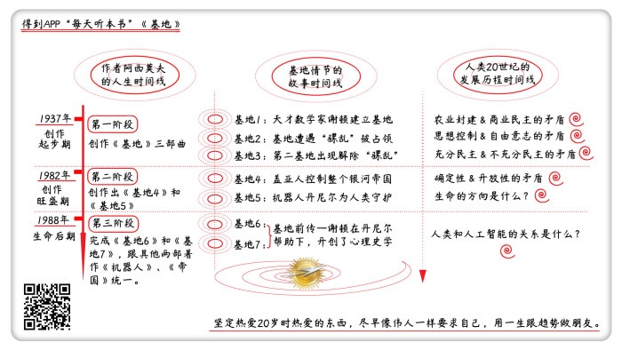

# 《基地》| 怀沙解读

## 关于作者

艾萨克·阿西莫夫，美国著名科幻小说家，科普作家，一生著书近500本，代表作有《基地》系列、《银河帝国》系列和《机器人》系列。他提出的“机器人三大定律”被称为“现代机器人学的基石”。

## 关于本书

《基地》七部曲是阿西莫夫的代表作，是一部150万字的经典史诗巨著，创作时间跨度长达50年。它几乎获得了科幻小说能获得的所有荣誉：奖项、销量、社会影响。《基地》还被评为 “人类有史以来最好看的系列小说”，它帮助整整一代人建立了科学观，影响过 NASA 的科学家们，也影响过世界上最极端的势力——本·拉登的基地组织。

## 核心内容

在未来，人类成立了一个遍布银河系的银河帝国。帝国有一个皇帝，分封了诸多领主和贵族。一位叫谢顿的天才数学家预测，银河帝国会迎来一段长达3万年的混乱期，此间生灵涂炭，科学退步。为了避免这个悲剧，必须建立一个叫“基地”的组织。在这个过程里，基地成为了各方争夺的焦点，各种旧势力和野心家怀着各自的目的，相继加入争夺。经过漫长的斗争，基地的英雄们最终战胜了这些势力，而基地背后的操纵者也露出了真面目，原来这一切都是由一个叫丹尼尔的机器人策划完成的，而整个银河帝国其实是一个由机器人和人类共治的政体。在未来，机器人将继续控制银河帝国的走向。

## 前言

你好，欢迎你每天听本书。我是怀沙。我们继续来说科幻。这期音频我们来说世界科幻三巨头之一的阿西莫夫的代表作《基地》七部曲，这是一个150万字的长篇巨著。音频时长可能有50多分钟，我把这七部曲一次性给你说完。

在世界科幻小说界，要论作品名气，《基地》系列说就是第一名，这个基本没有争议。《基地》这两个字，可以说就是科幻小说的代名词。1966年，世界科幻小说协会颁发了一个含金量特别高的奖项，叫：“人类历史上最好看的系列小说”，最后，《基地》系列小说战胜了《魔戒》系列小说，把这个奖项拿下了。这是来自科幻小说界的评价。同时，《基地》小说的社会影响力，也是人类所有科幻小说里最大的。它帮整整一代人建立了科学观。我曾经看过一个记载，有一次NASA的科学家在开会，有人问，是《基地》的粉丝请举手，结果全屋人都举手了。

但在另外一边，这套书也影响了一个坏人，恐怖分子本·拉登。在“9·11”恐怖袭击之后，本·拉登接受英国《卫报》采访的时候明确说过，我这个“基地组织”的名字，就是受《基地》的影响起的名。本·拉登认为自己做的事，和小说里主人公一样，是一个正义的事业。所以我们看，《基地》是带着各种光环的，它是科幻小说界的头号老大，人类历史最好看的系列小说，它影响过这个世界最科学的大脑，也影响过世界上最极端的势力。

那我们要问，一个什么样的故事，能给世界造成这么大的影响呢？重要的事说三遍，重要的故事我们也来讲三遍。我们这个音频会从三个角度，帮你把《基地》这个系列说三遍，但每次用不同的时间线来说。第一遍，我们沿着作者阿西莫夫一生的时间线，看看他是怎么创作《基地》这个故事的；第二遍，我们沿着《基地》故事情节的时间线，给你说一个超级浓缩的故事梗概；第三遍，我们沿着人类20世纪发展的时间线，把人类20世纪的重大事件和《基地》的小说情节，做一个对比。

## 第一部分 一部写了一生也没有写完的作品

我们来看第一条时间线，来看看《基地》小说和阿西莫夫的关系。《基地》七部曲的创作跨度是整整50年，半个世纪。创作过程分成三个阶段。

第一阶段从上世纪30年代末说起。1937年，美国的科幻文学杂志《惊奇故事》的主编发现，有一个叫阿西莫夫的17岁小伙子，9次投稿，9次被退稿，但是还在写。主编觉得这个年轻人挺有意思，就约小伙子见了一面，见面之后觉得小伙子还挺有灵气的，就鼓励了他两句。这次鼓励很重要，鼓励出了一个科幻大师。阿西莫夫，1920年出生在苏联，是一个犹太人，他在3岁的时候，跟着爸妈移民到了美国，在给《惊奇故事》杂志投稿的时候，阿西莫夫当时正在上大学。他唯一的爱好就是写作，说白了就他手痒痒，没事干总想写。钱钟书说过一句，这是一句毒鸡汤，他说我们年轻时总是把我们的创作“热情”误以为是我们的创作“才能”，但是阿西莫夫是又有热情，又有才能。

经过主编的鼓励之后，阿西莫夫的故事就发表出来了，然后他就进入一个创作的喷涌期，这个喷涌期持续了多久呢？持续了一辈子。阿西莫夫的一生，都保持着其他作家喷涌期才有的高产量，在72年的人生里，他平均一年出版9本科幻小说，这个纪录到今天也没人能打破。

好，下边我们就要说到《基地》了。1942年5月，阿西莫夫，发表了一篇叫《基地》的短篇小说，英文名叫《foundation》。在自传里，阿西莫夫说，当时他是受《罗马帝国衰亡史》的启发，就想，我能不能也写一个银河帝国的兴衰史呢？这一年他22岁。然后在接下来的8年时间里，阿西莫夫又在这个《基地》故事搭好的框架里，写了关于《基地》的好多篇中篇和短篇小说，都在杂志上发表出来了。这时候，阿西莫夫的状态是，在科幻圈很有名气，但是没赚着什么钱，写作还只是一个业余爱好，稿费根本养活不了一家人，日子过得也挺紧巴的，他当时是白天上班，晚上回家埋头写小说。

改变阿西莫夫命运的是1961年，当时他已经41岁了。有一个出版社把8个零散的《基地》故事整理成了三本书，统一起名叫《基地》三部曲，重新出版了。结果这下轰动世界了，阿西莫夫钱也赚到了，名声也更大了，变成职业作家了。至于《基地》小说为什么突然变火，一方面有出版社的功劳，所以找一个好的出版社非常重要，同时，它也是一部生逢其时的小说，关于这个原因我们在后面会提到。

好，这是《基地》创作的第一阶段，《基地》3部曲阶段。

成名之后，阿西莫夫就进入更高强度的创作状态，他每天就是坐在打字机前，身体一动不动，手指头噼里啪啦敲字。阿西莫夫写科幻，就跟我们吃饭一样，有一次，他参加一个电视综艺节目，为了表现自己写科幻小说有多容易，他当场让人把打字机拿来，花了30分钟现场构思，现场写了一篇科幻小说，大家全服了。阿西莫夫的一生写了467篇作品，他是那种脑子里奇思妙想乱蹿，才华横溢的那种人。但是，在阿西莫夫创作力最旺盛的这段时间，他没有续写《基地》，他认为《基地》这个故事已经讲完了，是个完结状态，但读者和出版社想让他写，不停地跟他说继续继续，有一个出版社给阿西莫夫拍了5万美元稿费。阿西莫夫就想，那就试试呗，他就先把自己22岁写的《基地》三部曲重新看了一遍，看完之后，觉得有必要把这些年的一些新认识，加到《基地》这个故事里去。

1982年，也就是时隔40年后，60岁的阿西莫夫决定续写《基地》，这就是后来的《基地45》。《基地45》是一部老中青全拿下的作品，当年的读者能找回当年的感觉，新读到的人也会觉得很有意思，就算在今天看，也不过时。比起《基地三部曲》，故事有了重大转向，并且在一个超大脑洞里结束了。《基地45》就是《基地》写作的第二阶段。

《基地》写作的第三阶段，是阿西莫夫生命的最后4年。在1988年的时候，阿西莫夫已经是科幻界最著名的科幻作家了。他6次获得雨果奖，也获得了星云奖终身成就大师奖，这两个奖项，就是世界科幻的最高奖项。人们用阿西莫夫的名字命名杂志，用阿西莫夫模块来命名机器人的人机安全系统，阿西莫夫在小说里提出的机器人三大定律，也已经成为了家喻户晓的概念。当时科幻界流传着一句话，叫：阿西莫夫只有一个，用来表达对大师的珍惜。不过在1988年，阿西莫夫的身体越来越不好了。

就在这个时候，阿西莫夫宣布，他要续写《基地》，他决定把人生最后的创作时间留给《基地》这个故事。但他没沿着《基地45》的结局继续讲故事，而是写了两部前传，讲的是《基地》三部曲之前的故事。阿西莫夫在自传里写到，我的时间不多了，但我希望写到最后，在停止呼吸的那一瞬间，如果能趴倒在打字机前，鼻子卡在两个打字键之间，才好呢。

但是很遗憾，阿西莫夫没能达成这个愿望，因为身体太虚弱，还是被人送到了医院。他在床前还口述了最后一篇文章，在这篇文章里他说，自己度过了漫长美好的一生。几天之后，阿西莫夫与世长辞。在阿西莫夫离世的时候，《基地7》的第五章刚开了一个头，留下了一部未完成的作品。但故事的大方向已经定型了，出版社请了一个熟读《基地》的作家，写成了《基地7》。大师最后4年，还有两部前传，这就是《基地》的创作的第三阶段。

那我们回头看一下，《基地》断断续续写了50年，我们看到了一个人从文艺青年，变成畅销书作家，再变成大师的过程。早年是凭兴趣写，中年是被读者和社会推着写，到了老年，是自己主动要写。那我们要问，为什么阿西莫夫要把生命的最后时间，留给《基地》呢？他为什么要续写一部曾经认为已经完结的作品呢？这是因为，阿西莫夫在对自己作品做一个整合工作。

我们看到，那些伟人在生命的最后阶段，总有一个愿望，就是希望自己的理论和著作形成一个又大又完整的体系，以一个自洽的、协调的统一理论出现。打个比方，有点像爱因斯坦最后在追求统一场论，在文学上，阿西莫夫也在追求自己的统一场论，用一套完整的理论来统领自己的整个小说。

阿西莫夫一生的著作非常多，但有三个系列作品最出名，分别是《基地》、《机器人》和《帝国》。《帝国》和《基地》这两个作品的联系天然就比较紧密，他们讲的都是公元1200世纪的银河帝国的故事。但《机器人》这个故事，发生的时间就比较早，大概是公元35世纪左右的事，讲的主要是人工智能和人类的矛盾。

在阿西莫夫的创作后期，他就想把这三部作品拢在一起，在时间线上统一，还有在价值观上统一起来。1985年，阿西莫夫给《机器人》系列写了一个尾巴，叫《机器人与帝国》，这就是机器人系列向后面的银河帝国的故事伸出一只小手，意思是，咱们连成一个故事吧，现在只要让银河帝国的两个故事也朝前伸伸手，三个系列故事就连在一体了。

阿西莫夫最后阶段创作的《基地7》，就起到了这个功能，它在时间线的上面，握住了机器人系列伸过来的手，下面连接到《基地》三部曲的开头。阿西莫夫一生最重要的三部著作，就形成了一个从35世纪到1200世纪贯通的故事。这个故事从35世纪的机器人开始，到1200世纪的基地故事结尾。现在在中文世界里，这套书就是上海读客出版的一共15本的系列小说《银河帝国》。

这就是阿西莫夫在人生的最后阶段做的工作，有点像自己的统一场论。所以说，读懂了《基地》，就读懂了整个《银河帝国》，也就读懂了阿西莫夫。下面，我们就一起来看《基地》的情节。下个小节的标题是，一部像俄罗斯套娃一样的悬疑大戏。

## 第二部分 一部像俄罗斯套娃一样的悬疑大戏

接下来，我们一起来看《基地》的情节。

整个《基地》小说，说的是银河帝国，一段几百年的历史。总的来说，这是一个不停地发现天外有天的故事。它像是一个俄罗斯套娃的结构，故事从最小的那个套娃讲起，当你觉得这个套娃厉害得不行，它就是整个世界的时候，阿西莫夫就会说：“哈哈，真相不是你想象那样的。”然后引出一个更厉害的人物或者情节，就像用一个大一点的套娃一样，把之前的那个全盖住了。然后再用第三个套娃，套住前两个。这种大娃套小娃的事，一共发生了5次，故事的结尾就是超大娃娃，肚子里边装着4个看不见的小娃娃。我们就先从那个最小的套娃开始说起。

在未来，人类已经殖民到银河系的2000万颗行星上了，在这些行星之间来移动就和今天坐飞机差不多。在《基地》的小说里，没有涉及到外星人这个话题，所有故事都是在人类社会这个框架里展开的。银河帝国的最高统治者是帝国皇帝，他把不同区域分封给了很多领主，每个领主管辖一块，银河帝国的政体基本上就是欧洲的封建制吧。故事的一开始，帝国里出现了一个叫谢顿的天才数学家，这个谢顿的人物设定，有点像《三国演义》里的诸葛亮，擅长神预测，但谢顿的方法是科学的，他发明了一种叫做心理史学的科学。这个学科像是一个算法，你只要把每个银河公民的数据都输入进去，经过复杂的数学运算，最后就能精准地预测银河帝国未来的命运。

故事一开始，谢顿就预言：银河帝国已经在衰败了，科学退步，生灵涂炭。只有一种办法能拯救银河，就是建立“基地”。基地，就有点像一个经济特区的感觉。谢顿在银河的边缘，选了一个什么资源都没有的，没人要的行星上，建了一个叫基地的政体。基地成员主要是科学家，谢顿还给基地留下了非常发达的科技，基地的人主要靠和周围行星做生意来维持生活。

表面上看，基地就是一个崇尚科学的工商业文明，但其实它是这个银河的希望。谢顿在去世之前，给基地的人留了5个视频，就像诸葛亮留下5个锦囊妙计一样，他说，同志们啊，一到关键时刻，5个视频就会自动播放，只要你们听视频里的指示，任何危险都会化险为夷，我这都已经算好了，你们就好好的，维持基地运转1000年，银河就能复兴。至于为什么就能复兴，你们不用管了，反正我都算好了。好，这些都是基地三部曲的基本故事设定。

下边我们来说《基地1》的故事。主要讲的是银河帝国有一个土鳖领主，是一个贵族，他想霸占基地，基地的英雄们经过了各种斗争，把他打败了。打败了这个土鳖领主之后，谢顿留下的视频突然开始播放了，谢顿在视频里就说，大家好，如果我没算错的话，你们应该是刚刚把那个土鳖领主打败吧，干得好，一切尽在掌握，大家继续加油。这就是《基地1》的内容，下边说《基地2》的情节。

故事一开始，银河帝国这边又出现了一个坏蛋将军，他又是脑子不好，想霸占基地。基地英雄经过各斗智斗勇，把坏蛋将军打败了。最后，谢顿的视频又来了，如果我没算错的话，你们应该刚刚打败了坏蛋将军吧，加油，继续，好好干同志们。

故事讲到这，谢顿给人的感觉就非常无敌了，一切尽在掌握啊。但是在《基地2》的下半段，第2个套娃出现了，这是一个大反派，名字叫骡。就是骡子的骡。骡这哥们，可能是没发育好，反正没有生育能力，所以叫骡，而且据说骡长得超级无敌丑，心理也非常变态扭曲。骡有一个超能力，就是能控制人的思想。只要骡见你一面之后，就能在你大脑里植入一个想法，而且你会以为这是你自己的决定，但其实你下半辈子都在给骡当小弟。而且骡有一个特别大的优势，就是没人知道他长什么样。人们只能看见骡对这个世界施加的各种影响，比如说，又有人被他控制了，但骡在哪里，他是谁，没人知道。所以骡征服宇宙就很简单，就是到处见人，最后全银河的人就都是他的小弟了。

骡征服银河系的目的和之前那些帝国的封建贵族征服的目的不太一样，那些人就是为了满足自己的私欲，但是骡好像是为了达成自己的某种社会理想。所以，骡的设定，和希特勒稍微有点像吧，都没生育能力，擅长精神控制，同时还认为自己做的事情是正确的。基地的人就听说，骡也看上基地了。大家就很害怕，赶快把谢顿的视频给打开了，结果谢顿说了一些没关系的话，大家就傻了。等于说，谢顿没有预测到骡的出现，后来骡的舰队就杀过来了，很轻松就把基地占领了。

故事讲到这，骡就是整个银河系最厉害的人了，银河系也快变成骡的私有财产了，而且最要命的是，从来没有人见过骡，所以没办法阻止他。这就是，第二层套娃，大反派骡。故事讲到这，《基地2》结束了。《基地3》一开始，是骡在征服了基地之后，他才明白过来，原来基地之所以这么繁荣，核心原因不是因为它的科技发达，而是因为基地的人掌握着心理史学，但究竟是什么人掌握着心理史学，骡没找到。这时候，他听说有一个第二基地，这就是那些心理史学家藏身的地方，但第二基地的具体位置是全宇宙最神秘的事。故事发展到这，就变成了谁也没见过真身的骡，对抗一个谁也不知道在哪里的第二基地。所以谁先发现对方的行踪，谁就能赢。

后来，经过一系列斗智斗勇，第二基地把骡的真身给锁定了。原来骡就一直在玩潜伏，他就是大家身边看上去很无公害的一个演喜剧的小丑，那局势就变成骡在明处，第二基地在暗处了。最后，第二基地里一个叫帕佛的英雄，他以其人之道还治其人之身，侵入了骡的意识，相当于骡的武功就被废掉了，以后也干不了坏事了。

故事讲到这里，“骡乱”就解除了。但接下来，基地内部出现危机了，过去第一基地的人是不知有第二基地的，骡这么一捣乱，现在他们都知道了，他们就感觉很不爽，说闹了半天，我们就是一个幌子，什么都是你们在控制，而且你们还这么神秘，这不行，我们要把第二基地的人找出来。但其实，第二基地并不是一个实际存在的地址，就是几千个掌握着心理史学的科学家组成的一个组织，他们平时过着一种大隐隐于市的生活。但第一基地就派人，收集线索，找第二基地。最后，经过了一个很复杂的斗争过程，还是那个英雄帕佛用了老办法，在第一基地的人大脑里植入了一个想法，以为自己找到了。但其实第二基地隐藏得很好，第二基地能保持隐蔽，这是对大家都有好处的。

好，故事的最后，人们打败了骡，解决了内部矛盾，大家还是继续沿着谢顿给我们指的路，继续把基地运营好，振兴银河帝国。帕佛和第二基地的人，成了目前为止最大的套娃。写到这，阿西莫夫就收笔了，在他原来看来，《基地》的故事说完了。

但在40年后，在读者的强烈要求下，阿西莫夫沿着这个结尾，又续写了基地。下面我们来看《基地4》的情节梗概。《基地4》一开始，基地里出现了一个叫崔维斯的人物。崔维斯一上来，就对谢顿的“心理史学”提出了质疑，他说这么完美的东西，真的存在吗？这背后是不是有什么其他的力量在暗中操纵呢？然后，崔维斯就踏上了寻找真相的路。崔维斯这个人天生有一个技能，他是一个做选择题的大神，在别人看不清局势的时候，崔维斯总能做出正确判断。

整个《基地4》就是一个游记体。总之就是经过各种探险，崔维斯来到了一个叫盖亚的行星。这个行星最大的特点，是物体，包括花草树木、人类，还有房子、飞船，都是连接成一个生命体的。盖亚的首领就对崔维斯说，我们等你很久了。其实之前的那个骡，就是我们盖亚行星跑出去危害人间的，后来骡被打败，帕佛怎么隐藏第二基地，还有你崔维斯这一路的探险，其实都是我们盖亚人在操纵的。整个银河帝国，实际的控制权，是在我们盖亚人手里的。故事讲到这，第4个套娃出现了，这就是盖亚人。而盖亚人费这么大劲让崔维斯跑一趟，是让他来做一道选择题的。我们盖亚人，现在要决定人类银河帝国的走向，你崔维斯不是直觉特别厉害吗，请你在下面三个社会架构方式里，选一个吧：

1、基地模式，未来银河帝国会是一个科学的世界，未来呢，银河帝国可以重振帝国雄风，形成一个军事霸权帝国。

2、心理史学模式，未来银河帝国会是一个以数学为主的世界，偏重精神控制。

3、盖亚模式，未来，整个银河系的所有生物、所有行星、所有有机物无机物都会连接一个生物，让整个银河系完成一次升级。

好，这三个选项，你崔维斯只能选一个。选完之后，我们盖亚人就会照办，让银河帝国朝这个方向发展。崔维斯就问：你们这么厉害，那你们自己就定了呗，为什么非得让我来选呢？这不是让我扛什么雷吧？盖亚人想了一下说，嗯，其实还真让你扛一个雷，因为你是人类。背后的原因是这样的，其实盖亚这个行星，是在很多年以前，由一个忠于人类的机器人创建的。而这个机器人必须遵循机器人三大定律里的第一条：机器人不得伤害人类个体，也不能目睹人类遭受危险而袖手不管。这里说明一下，机器人三大定律是阿西莫夫在另外一个系列小说《机器人》里面提出的，在《基地》这个小说里也是生效的。

而现在我们盖亚想让银河走万物互联这条路线，但这么大事，将来没准会死几个人类，我们盖亚人不能违反第一定律，所以把你崔维斯叫来，你来做一个选择。最后，崔维斯做出的决定是，选择盖亚。于是盖亚人就获得了人类的授权，他们就去落实这个决策了，整个银河会在未来，渐渐变成一个整体。故事讲到这，《基地4》就结束了，套娃也数到了第4个。

《基地5》就是最后一个套娃的现身过程。整个故事还是游记体，崔维斯在选择了盖亚之后，他也不知道自己为什么要选，所以他决定找到那个制造了盖亚的机器人。最后，崔维斯在地球见到了这个机器人，它的名字叫丹尼尔。见面之后，丹尼尔也对崔维斯说，你终于来了，我等你很久了。整个《基地》最大的套娃终于现身了。丹尼尔说，在2万年前，它是被人类造出来的，这么多年，它一直守护着人类。其实，最开始是它启发的谢顿，让谢顿发明了心理史学，到后来的骡，第二基地的英雄帕佛，再到盖亚让崔维斯做的选择题，所有的所有，都是丹尼尔在暗中操纵，所有基地的情节，都是丹尼尔在下一盘很大的棋。

那最后为什么要让整个银河变成像盖亚一样的生命呢？因为到目前为主，人类只是铺满了银河，但还没有真正连接起来，形成生命群团。因为丹尼尔看到，宇宙里的其他星系，都是这样的生命群团，只有让全银河的人类最后团结成一个生命，才能去和其他星系的生命群团去博弈。

所以，最后《基地》七部曲，用一句话概括，就是一个忠诚的机器人丹尼尔，为人类的未来各种操心，最后守护人类，冲出银河，走向宇宙的故事。这个结尾，也是整个《银河帝国》的结尾。

接下来的《基地67》，也就是阿西莫夫在人生最后阶段续写的两部，是《基地》的两部前传，这两部的内容是回头介绍了谢顿，也就是第一个套娃，是怎么在丹尼尔的帮助下，一步步开创了心理史学的过程。具体的情节我们就不多说了，它的功能是为了和前面的《机器人》系列故事联系在一起的。好，这就是整个《基地》的情节，也是我们第二遍讲这个故事。

下面，我们要第三遍讲《基地》的故事，这遍解读的角度是，我们看一下整个基地故事，是由6大核心矛盾串联起来的，而如果我们把这6大矛盾摊开来的话，我们会发现这6个矛盾和人类20世纪遇到的困难是一个一一对应的关系。

## 第三部分 一部人类20世纪的浓缩史

我们先来看《基地》三部曲，总的来说，小说一共表现了3个矛盾。我们先来看第一个。

### 1、农业封建帝国和商业民主的政体之间的矛盾

我们回到《基地1》的故事情节。刚才说了，主要的敌人是帝国那边的封建领主和军事将领，他们想霸占基地。那我们先来看一下这些坏人都什么样，还有他们的目的是什么？《基地1》里描写的坏蛋贵族，穿着很华丽的但常年不洗的贵族大长袍，又胖又丑，说话特别土鳖，特别贪婪，特别迂腐。他们过的就是19世纪地球上的贵族腐朽生活，每天要喝下午茶，见面互相炫耀的时候，台词大概是你看我这个烟叶是哪个行星生产的，你看我这个宝石是哪个星系的。一个领主的实力，体现在他拥有多少行星的多少耕地上。这些行星的领地上，种的农作物也都是玉米、土豆、烟叶这些地球植物，而且收的租子都是实物租。

那我们问一句，霸占基地为了什么呢？答案是，他们想把基地变成自己的领地，然后他就可以往基地派世袭的领主，永远当老爷，永远找基地的人收租子。那这个思维模式，就是典型的农业为基础的，欧洲封建制。如果用三句话来总结，这种社会就是：靠农业产生财富，靠身份继承权力，靠权威提升社会运转效率。而基地这边，是典型的新兴民主政体。基地是靠商贸产生财富，靠选举产生领袖，靠科学提升社会运转效率。

那我们看，整个《基地1》的核心矛盾，不就是农业封建帝国和新兴的商业民主政体之间的矛盾吗？那就算在1942年看，这个故事核心矛盾也很老套。1942年啊，二战都开打了，当时世界主要国家也不是封建王权制了。所以客观地说，22岁的阿西莫夫，是被自己的眼界严重限制了想象力的，他是铺开了一个银河帝国的摊子，但塞进去的东西都是19世纪中后期欧洲的陈年旧事，只不过把欧洲按比例尺放大到银河的空间里去了。我们看到，在阿西莫夫刚动笔写《基地》的时候，他对世界的认知是落后于他所在的时代的。但阿西莫夫之所以是大师，是因为他在接下来的故事里，我们很明显看到他在不停地追赶时代，直到最后，远远超越了自己所处的时代。

### 2、思想控制和自由意志的矛盾我们接着来看《基地》三部曲的第二对矛盾，就是骡和基地的对抗。

骡这个人物，和之前那些坏蛋比起来，就复杂一些了。之前那些坏蛋就是贪欲，需求的层级比较低。但在整个小说里，都没有提骡占领基地到底是想干嘛，他好像就是不能容忍基地这么一个和他不一样的东西存在，那这就是脱离了低级趣味的需求了。所以说，骡和基地的矛盾，是思想控制和自由意志之间的矛盾，或者可以说是意识形态的斗争，两边儿都认为，我要用我的方式来梳理这个银河系，不然这个银河就堕落了，是一个堕落和拯救的关系。

那我们看，人类20世纪，不就是一个在围绕着意识形态争斗的历史吗？人类从一战开始，就在争一个意识形态上的对错。德国皇帝威廉二世在给士兵做一战动员的时候，就说我们不能让这个世界落到对岸的，英国这些小商人手里，二战时，希特勒也说自己更代表正义。再后来就是美苏的意识形态争斗，一直到本世纪的时候，本·拉登也说，我们的基地组织，就是要拯救这个堕落的世界。说到这，我们也就可以理解音频最开始说的，为什么NASA的科学家和本·拉登，都是《基地》的粉丝了，因为他们都在书里读到了自己。NASA的科学家在看《基地》的时候，觉得自己是基地的人，而苏联那边是骡。而本·拉登在看《基地》的时候，觉得自己是基地，美国是骡。

我们前面说，《基地》是一个生逢其时的作品，说的就是这个意思。基地的前三部是1950年写完的，这一年正好人类把20世纪走完了一半，在这个世纪剩下的50年时间里，有39年是两大阵营对峙，在为了意识形态的问题争来争去。这可能就是《基地》三部曲在世界热卖的原因之一，这个故事的主题和那个时代的主要矛盾是贴合的。所以说，《基地23》里的主要矛盾，是意识形态的矛盾。阿西莫夫在这个时候，对世界的认知和那个时代是同步的。

### 3、充分民主和不充分民主的矛盾。

下面，我们再看第三对矛盾，讲的是第一基地和第二基地内部的矛盾，用我们中国人熟悉的话说，这是人民内部矛盾。这个其实是充分民主和不充分民主的矛盾。在经过了骡乱之后，第一基地的人发现了第二基地的存在，他们的需求是，要平等，要公开，要求所有人都能最大限度地参与政治决策。但第二基地的人知道，这么弄行不通，一个是社会运作成本太高，一个是容易引发暴民政治。从小说里看，阿西莫夫是支持代议制民主的，也就是应该把决策权交给少部分精英。精英的义务，就是保持清醒，对全民负责，同时把信息隐瞒到民众能接受的程度。

我们看，阿西莫夫在这里探讨的问题就又深入了一步。在《基地1》里，当基地对抗封建旧势力的时候，民主制度是有优越性的，但沿着民主这条路一条路走到头就更好吗？不一定。至于阿西莫夫为什么要设置这样的情节，可能是他为了表达一种不便于公开的政治观点：民众知道太多也不好。但是，基地之所以能长期存在，恰恰是因为第二基地的人坚守了秘密。全民知情权是一个听上去很美好，政治很正确，但同时增加系统风险的方式。所以，关于民主充分性的讨论，这是《基地》三部曲的第三个矛盾。

说到这我们稍微总结一下。《基地》三部曲虽然发生在银河，但刚才这么分析下来，它表现的全是地球上的政治矛盾。阿西莫夫写完《基地》三部曲的时候，正好是1950年，阿西莫夫30岁。20世纪过了一半，世界局势也因为冷战一分为二。这个时候的世界，是一个选边站的状态。

而基地里表达的政治主张，就是典型的西方思维。在政治上，追求自主，不希望成为任何国家的属地，在经济上，主要以商贸为主，崇尚自由经济，在思想上，不接受任何形式的精神控制，政体上，推崇代议制民主，同时也反对泛民主，偏重精英统治。整个看下来，这是一个比较典型的美国化思维，可以说是西方的主流思想。也是整个西方话语体系下的世界，在一个30岁的，业余年轻科幻作家世界里的投影。所以，客观说，《基地》的前三部曲思想性上只能说一般。当年的人们对《基地》着迷的原因，主要是来自阿西莫夫的想象力。1950年的人们脑洞是非常小，《基地》在一个中规中矩的故事内核外面，镶了一层非常绚烂的科幻的边儿，像整个银河帝国的图景，能预测未来的心理史学、能控制人心灵的骡，还有满银河飞的那种奇妙的感觉，对那个时代的人来说，这样的想象力，真的算是天马行空了。

接下来，我们看看《基地》的下半部分。这时候，阿西莫夫已经是一位62岁的科幻大师了，他已经基本知道自己会是一个伟大的人了。他对自己写下的每一个字，都会更负责，更字斟句酌。

下面，我们看看阿西莫夫在《基地45》里讨论的三个矛盾，这三个矛盾的格局，已经完全不同凡响了。

### 4、确定性和开放性的矛盾。

现在，我们要回头说一下，《基地》三部曲里最核心的科学概念，“心理史学”。

如果我们用一句比较拗口的数学方法来定义“心理史学”的话，会是这样的：心理史学就是，找到若干现有数据和未来某数据之间确定性的函数关系。这句话听上去很玄，但其实，在科学史上，科学家给这种思想方法起了一个特别老实巴交的名字——决定论，所有现代科学的理论基础都是决定论。

决定论是19世纪初的法国科学家拉普拉斯提出的。决定论的核心思想就是，整个宇宙是物质的，这些物质就像无数个互相咬合的齿轮，大家都遵循物理规律，你动我也动，这个世界是靠谱的。那如果我们可以准确地知道宇宙里每一个粒子的初始状态，那在原则上，我们就可以精准预测整个宇宙的后续演化。科学家用一个很形象的词来形容这样的宇宙，叫机械宇宙。而谢顿的心理史学，就是决定论的极致化应用。所以，基地打败那些封建旧势力，本质上是科学战胜蒙昧的过程。

但是，刚才说的都是理论。其实心理史学，是几乎没有可操纵性的。主要有两个原因，第一个原因是，要计算一个帝国的未来，计算数据量太大了。你别说是预测银河系3万年的未来了，你就是预测一个封闭的房间里的空气分子下一分钟的状态，计算量都约等于正无穷。第二个问题是，决定论和开放性是一对矛盾，它们就像是跷跷板的两头，你要追求准确性，就必须放弃开放性。而要开放性，就忍受不确定性。但银河在三维空间里是完全开放的，理论上，就算是100亿光年外的某个星系，对银河系也有引力上的影响。所以在机械宇宙里，要计算银河系的未来，你必须同时监控整个宇宙的参数，这个任务就几乎不可能完成。而谢顿的心理史学，相当于同时拥有很高的确定性和开放性。那他就必须拥有超自然的力量。对于这个故事设定，成为科幻大师的阿西莫夫已经不满意了。

所以，《基地45》的一开篇，就安排了一个叫崔维斯的人，对谢顿的心理史学提出了质疑，这其实相当于阿西莫夫推翻了年轻的自己。在《基地45》里，提到心理史学的次数其实不多。这就是阿西莫夫的升级，他思考的问题，从怎么在政治上，帮助一个帝国平稳复兴，升级到人类怎么能进入一个新的时代。整个《基地45》，就是崔维斯在寻找真相的过程。人类要往前走，就必须追求开放性，放弃确定性。

好，这是《基地45》的第一个矛盾，确定性和封闭性之间的矛盾。接下来小说讨论的两个点，就不是矛盾了，而更像是两个开放性的问题了。

在《基地45》里，阿西莫夫提出的问题是：

### 5、生命的方向是什么？

在小说里，盖亚人回答了这个问题，回答是，生命有一个愿望，就是连接在一起，整合成更大的生命。阿西莫夫的这个思考，在当时是非常前沿的。往小了说，这是阿西莫夫在1982年就成功预测了互联网。往大了说，阿西莫夫在试图重新定义生命这个概念。小说里盖亚这样的生命体，其实不是阿西莫夫的原创想象，在20世纪下半叶，很多人类科学家提出了类似的观点。

首先是1970年，美国女生物学家马古利斯，提出了一个惊世骇俗的，细胞内共生假说。她认为，细胞里的一些功能性结构，比如说线粒体、叶绿素，我们过去都把它们当成细胞的器官，其实人家是独立的，它们只是和细胞本体达成了稳定的合作关系，她把这种合作方法称为内共生。就好像我们体内的肠道细菌和我们的关系一样。

1972年，英国科学家詹姆斯·洛夫洛克也提出了类似的观点，他的理论叫“盖亚假说”，《基地》小说里的盖亚的名字就是从这来的。盖亚假说往最简单了说，就是地球就是活的，它是一个有机物和无机物组成的独立生命，地球会自己调整自己的体温和各种参数。这就是为什么人类有很多破坏环境的行为，地球也没死，因为它是活的，它有自我调节能力。

在今天，支持类似想法的学者也很多，代表性的就是凯文·凯利，他认为，人类现在已经通过互联网连在一起了，在这个系统的上层，会涌现出一种我们理解不了的高级智能，说不定现在这个智能已经存在了。如果用逻辑上的定义来表述就是凯文·凯利的观点，如果数量众多的个体完成连接，那上层会涌现出更高层级的生命。

2015年，一位叫朱利奥·托诺尼的神经学家提出了一个和凯文·凯利很相似的观点，他认为，如果一个系统的内部模块之间，没有发生连接，那这个系统就不可能是有意识的。

我们看，其实这两个观点在逻辑上，是一个逆否命题的关系，逆否命题的定义就是：如果两个命题里，A命题的条件是B命题结论的否定，同时A命题的结论是B命题条件的否定，那它们就是互为逆否命题。比如凯文·凯利认为，只要连接，就一定会涌现生命。神经学家认为，只要没连接，就一定没有生命。这两个命题有很强的相关性，但从逻辑上，还不能画上等号。

这位神经学家通过长期对人类大脑的研究，提出了一个叫“整体信息论”的观点，简单说，整体信息论就是研究一个零散的系统怎么变成一个拥有统一智能的生命的。这位神经学家还提出了一个概念，叫做系统整合度，用希腊字母Φ来表示，如果一个系统内部联系越紧密，Φ值就越大。比如说，互联网就极大地提升了人类的Φ值。等这个Φ值大于某一个临界值的时候，这个系统就会唰地一下，睁开眼睛，系统就活了。但至于怎么计算这个Φ值，朱利奥·托诺尼现在还给不出来。所以我们看，系统和生命的关系，这是今天科学家最最关心的话题之一。而阿西莫夫在续写《基地45》的时候，已经从一个讲地球政治斗争故事的作家，变成了一个在思考人类终极问题的思考者。

好，这是全书的第5个话题，生命的方向是什么？下面，我们就要进入《基地》的最后一个话题，也是《基地》的结尾话题。

### 6、人类和人工智能的关系是什么？

我们看，《基地》小说最后的终极大BOSS，是机器人丹尼尔。这是一个特别忠诚的正面人物。有网友评论说，整个《基地》故事，就是忠犬丹尼尔救主的故事，这话有道理，因为丹尼尔活了2万年，啥事没干，就一直为人类操碎了心，各种暗中保护人类，所以它就是一个超级机器大暖男。但真的是这样吗？从阿西莫夫的情节设定来看，丹尼尔是不是暖男，是值得讨论的。

首先，我们要对“暖男”做一个定义，暖男应该是，先仔细问清楚你想要什么，然后我再想办法满足你，一切以满足你为核心。但这个丹尼尔有问过人类要什么吗？它好像是全程在自己做决定啊，用三个词来总结丹尼尔对人类的态度就是：无交流、不通报、没商量。它只在乎自己想做的事能不能做成，这能叫暖男吗？那丹尼尔想干嘛，《基地》的最后一段说得很清楚，丹尼尔满脑子想的都是，我们整个银河怎么团结起来，和其他星系群团去竞争。带领银河，出征宇宙，这恐怕才是丹尼尔的愿望。我们之所以感觉丹尼尔是个大暖男，只能说因为丹尼尔现阶段的任务，和人类的利益是相吻合的。但如果他满脑子都是宇宙格局，还能和人类保持多久的利益同步呢？

这时候你可能会说，丹尼尔拿人类是没办法的，因为有机器人三大定律约定着。第一条定律，就是机器人不得伤害人类。但是，你认为这个定律还真的能约束住丹尼尔吗？整个《基地45》，难道不就是丹尼尔在绕过了这个定律的过程吗？

我们现在来换一个角度，重新看一下丹尼尔的行为。丹尼尔想把银河系组成一个生命群团，但第一定律挡在前面，如果是一个忠诚的机器人，那这事就不能干了。不，丹尼尔还要干，它自己是下不了手，就授意盖亚人来办这个事。而盖亚人也不想办这个脏事，就找崔维斯来办，而且还不主动找崔维斯，而是设一个局，让崔维斯受好奇心的驱使，自己找上门来。这难道不是一个很深的套路吗？

从上下文来看，丹尼尔和盖亚是铁了心要把银河变成盖亚的。就算你崔维斯做选择题的时候，没选盖亚，那我换一个人选，直到选中盖亚为止，崔维斯做的是一个伪选择，但是扛的可是真责任。万一银河系在以后的星系对抗里面，被外星文明打残了，上万亿的人类死了，崔维斯就是替罪羊。丹尼尔可没违反第一定律，它是很无辜的样子。所以，你还期待一个死的机器人三大定律，限制住一个活的人工智能吗？

那我们来看《基地》的结局，也是整个《银河帝国》的结局，是一个表面看起来温暖，仔细分析害怕，但认真琢磨之后，充满了宿命感的结局。天要下雨，娘要将人，丹尼尔要合体，这事今天它干不成，明天干不成，但在未来，它不一定还干不成。这就是《基地》七部曲的最后一个话题，人类和人工智能的关系。

## 

## 总结 最后的感慨

好，《基地》七部曲，基本就给你讲到这了。我们一共捋完了三条时间线，第一条是阿西莫夫72年的人生线，第二条是人类20世纪的发展史，第三条，是整个银河系系统升级的一段发展历程。那整个故事看下来，我们能有哪些总体收获呢？我给你归纳了三点：

### 第一，让趋势决定你的敌友，不要自己动手

《基地》故事的最后阶段，讨论的还是人工智能和人类的关系问题。对于这个话题，大多数争论分两派，乐观派认为，人工智能会是我们的好帮手，悲观派认为，人工智能是我们的敌人，他们会发动战争，或者杀掉我们。但《基地》的结局表达了另外一个观点，就是：人工智能既不是敌也不是友，人工智能只会顺应趋势埋头赶路，至于人类在干嘛，根本不重要。是打击你，还是安抚你，这个根本不是人工智能该干的事，一切精力都应该用在修正自己的路线，提升和趋势的贴合度上。如果你们人类不顺应趋势，那也根本犯不上我来对付你，你早晚会被趋势干掉。

那这么说来，世界上最值得交的朋友，是趋势，而最不能得罪的敌人，也是趋势。顺应趋势能帮你找到最新的朋友，也能帮你把敌人甩到你根本看不见的地方去。虽然在小说里，我们人类可能是被人工智能忽略了，但不得不说，人工智能这种处理问题的态度，是理性而高效的。

### 第二，一个人要趁早有“我名字的维基词条”意识

我在看阿西莫夫的自传的时候，有一种很明显的感觉，就是如果你是一个特别优秀的人，那你成名一定要早，请注意，不是成功要趁早，而是成名要趁早。

在阿西莫夫在20多岁的时候，他就已经在科幻圈儿里成名了，但是他当时还是穷，生活很困苦。一般人会认为，名气很大，但是不成功，这是一个很傻很失败的状态。但成名的人，比没成名的人多了一个评价指标，叫做“后世的人会怎么看我”，我们一般老百姓是没有这个概念的，但成名的人都有。成名后并且隐隐约约感到，自己未来会有一个维基词条，这个无形的评价标准会把优秀的人逼上必须更优秀的境地。如果阿西莫夫不成名，他中间不会被读者和出版社催稿，他就不会续写《基地》。如果阿西莫夫不是大师，他不会咬着牙把三套小说连成一套。

这种“我名字会成为维基词条”的激励机制，是一种名人独享的自律武器，它也是一个特别强大的正反馈系统，如果你很早就有这个意识，那真的有这个词条的可能性就很大，但如果你一直没有这个意识，那将来存在这个词条的可能性也会变小。

### 第三，一个人要在60岁依然热爱20岁热爱的东西，但不要反对相同的东西。

在生活里，我们都希望自己既能不断地变成熟，也能保持一份童心，这个要求很高，但阿西莫夫做到了。他做到的方法可以总结成“执着地爱，健忘地厌”。

我们先来看执着地爱，《基地1》和《基地7》里歌颂的东西，从最开始就一样，没有变过，阿西莫夫热爱自由，热爱异性，热爱科学，热爱探索真理。那些20岁你就热爱的东西，如果你在60岁的时候还热爱，那你就一定是一个可爱的人。

那什么叫“健忘地厌”呢？从《基地1》到《基地7》，有一种东西消失了，叫做邪恶的反派。《基地》三部曲都有明确的反派，而且是那种一看就知道最后一定会败的反派。但是越到后来，小说里的反派越少，在故事最后，反派彻底消失了。为什么消失了？这可能是一个人20岁你激烈反对的东西，往往都是表象，你觉得这些坏蛋坏得无缘无故。但到了60岁，你会发现坏的东西背后往往都是有原因的，是不得已的。可能在那个阶段，他们必须当一段时间的坏蛋，才能在未来变成好人，你要中途把他打断了，他就永远也不可能变好人了。但也有可能是，他们会一直当坏蛋，现在错，未来也错，那这样的坏蛋更不用管了，就像前面说的，他们最终也被一种叫“趋势”的东西抹平。

最后，我们把《基地》的三条收获总结成一句话。应该是，我们要心中坚定地，深爱着20岁时爱的东西，尽可能早地像伟人一样要求自己，每一个作品，做的每一个事情，都要是能写进未来维基百科词条里的那种标准。同时，用一生的时间，认真选择一条趋势，和趋势做朋友，它能帮你超越所有那些你厌恶的东西，给你带来所有新鲜的美好。

撰稿、讲述：怀沙

脑图：摩西