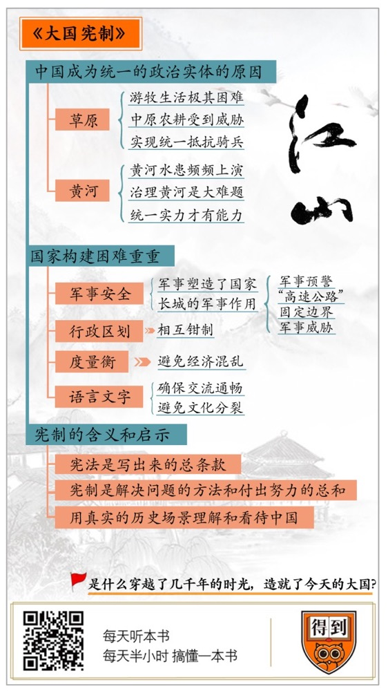

# 《大国宪制》| 段文强解读

## 关于作者

苏力，北京大学法学院教授。

## 关于本书

作者在这本书中，提出了一个我们因为习以为常，而忽略的问题。这个问题就是，作为一个政治实体的中国，究竟是怎么形成的？我们过去都在潜意识里认为，“中国”的存在是自然而然的事情，不需要讨论。但是，只要稍微观察一下世界上的其他文化区域，就会发现，单一“文化区”并不可以天然地孕育出国家，比如印度文化区、基督教文化区还有古希腊文化区都没有形成一个统一的政治实体。这能让我们能跳出原先的历史认知和格局，来重新审视我们的国家和历史：作为一个政治实体的“中国”，不是“自古以来”“自然而然”形成的，而是通过一系列的制度建设，最终构建成功的。

## 核心内容

一、作为一个“文化区”的中国，为什么会在公元前221年的时候，形成一个统一的政治实体。

二、在“构建”和“保持”国家的问题上，中国面临过哪些宪制难题，我们的老祖先又是如何解决这些困难的？

三、对于一个国家来说，“宪制”的真正含义是什么？这对我们重新理解中国，提供了怎样的认知和视角？

## 前言

你好，欢迎每天听本书，今天为你解读的是《大国宪制》，作者是北京大学法学院教授苏力先生。这是一本非常精彩的书，施展和罗胖都认为，这是一本被市场、被读者低估的书。那么，这本书为什么会得到这么高的评价？

有两个重要的原因，第一个原因是作者在这本书中，提出了一个我们因为习以为常，而忽略的问题。这个问题就是，作为一个政治实体的中国，究竟是怎么形成的？我们过去都在潜意识里认为，“中国”的存在是自然而然的事情，不需要讨论。但是，只要稍微观察一下世界上的其他文化区域，就会发现，单一文化区并不可以天然地孕育出国家，比如印度文化区、基督教文化区还有古希腊文化区都没有形成一个统一的政治实体。这是这本书第一个很有价值的地方，它让我们能跳出原先的历史认知和格局，来重新审视我们的国家和历史。

这本书得到很高评价的第二个原因在于，作者在书中完全是就“中国”论“中国”，也就是只考虑、讨论和分析古代中国的真实场景和问题，而不是用西方的政治理念和历史研究方法来解构中国。

过去我们熟悉的很多历史和政治名词，比如“封建主义”“民主”“专制”等，都是西方历史观念下的产物，对西方自身的历史而言，这种分析和研究是精确和有效的，在一定程度上也适用于中国。但是，中国和西方毕竟有着完全不同的历史，如果完全用西方的观念和研究方法来讲述中国历史，就会出现偏误。比如，西方的研究者习惯认为，“皇帝”或者“国王”是代表某一个阶层的统治者，因此，在他们的历史叙述中，往往很注重皇帝的出身。但很少有西方人能理解，皇帝对于中国这么大一个国家而言，不单单是一个统治者，还是一个承担非常重要社会职责的公共角色。所以，就“中国”论“中国”，我们才能理解真正的中国。

正是在这两个价值之下，我们才能通过这本书理解一个核心的问题：作为一个政治实体的“中国”，不是“自古以来”“自然而然”形成的，而是通过一系列的制度建设，最终构建成功的。

这里有必要解释一下这本书的书名“大国宪制”。这里的“大国”，指的就是中国，这里的宪制，说的不是我们国家的法律，而是建构我们这样一个大国，要进行的一系列制度设计，包括在政治、思想、文化、军事、经济等等各个方面的制度设计。

接下来，我就通过三个部分，来讲述本书的主要内容。第一部分，我们先来看看，作为一个“文化区”的中国，为什么会在公元前221年的时候，形成一个统一的政治实体。第二部分，我们再来看看，在“构建”和“保持”国家的问题上，中国面临过哪些宪制难题，我们的老祖先又是如何解决这些困难的。第三部分，我们最后来讨论一下，对于一个国家来说，“宪制”的真正含义是什么？以及这对我们重新理解中国，提供了怎样的认知和视角。

## 第一部分

我们先来说第一部分，中国为什么会成为一个统一的政治实体？

很多时候，我们读历史都有一个障碍，就是我们身为中国人看中国历史，就像站在院墙内看墙内的景色，看什么你都会觉得很自然，但只有当你对比墙外景色的时候，你才会发现，墙内的景色有多么特别。有可能方圆百里，就这么一个院墙，剩下都是荒山。有关中国政治统一的问题就是这样。我们都知道，中国至少在周朝的时候，就形成了成熟的“华夏文化圈”，然后过了几百年，秦朝才完成了“华夏文化圈”的政治统一。今天我们再回看这段历史，会觉得这是一件很自然的事情，但是就像刚才说的，在人类历史上，出现过的文化圈并不少，但能形成统一的政治实体的，并不多。

比如，大家比较熟悉的“古希腊”就从来不是一个政治实体，而是由无数个城邦组成的地理文化区。同样，罗马帝国在兴盛的时期，虽然有统一的政治实体，但是并没有相应的文化圈，所以罗马的最高宗教场所才叫“万神殿”，里面供着许多神，这些神并不是一个体系，而是分属于各种文化。而等到基督教将欧洲文化统一的时候，罗马帝国已经崩溃了，虽然历史上出现过很多尝试统一的人物，比如查理曼大帝和拿破仑，但是都不成功。所以，中国在很早的时候能实现政治统一，是一件值得详细说一说的事情。

关于这个问题，过去有一个很广泛的解释，就是说中国的地理环境，比较容易实现政治统一。而和中国差不多大的欧洲，就因为地理条件破碎，这一座山，那一条河，实现政治统一非常困难，而更利于地方自治。这个说法，听上去有道理，中国北有草原，东、南有大海，西南是青藏高原，西北是沙漠，内部空间封闭，可不是利于统一吗？但这只是表面上，如果你细致地分析一下，就会发现中国的地理环境，不仅不比欧洲好，还可能更恶劣。

比如，欧洲最大最高的山脉是阿尔卑斯山，而在中国境内，像喜马拉雅山、昆仑山、祁连山等山脉不知道比阿尔卑斯山高多少，太行山、巫山、五台山，也都跟阿尔卑斯山差不多。论河流的话，中国的长江、黄河都是世界排名长度前五的河流，而欧洲的第一长河伏尔加河和第二长河多瑙河，在世界上都排不进前十。所以，中国地理环境比欧洲地理环境更容易统一的说法，不成立。那么究竟是什么原因，让中国得以在较早的时期就形成了统一的政治实体呢？

主要原因有两个，第一是**草原**，第二是**黄河**。我们先来说草原，大家都知道，中国的万里长城是世界七大奇迹之一。在长城以北的地区，因为降水量不足，无法进行农业耕种，生活在这里的人们只好采用游牧的方式生活。这种生活方式有个特点，不仅单一低效，而且极不稳定。马、牛、羊从出生到成熟的过程，远比水稻、麦子要复杂和漫长，同时草原上气候恶劣，一场瘟疫或暴风雪就能造成大规模的牛羊死亡，所以，草原的生活是极其困难的。物资不够怎么办，只有抢，而被抢的就是中原的农耕区。

所以，中国在过去几千年中，一直面临着来自北方的强大军事压力，比如匈奴、突厥、蒙古等等。这种军事压力，异常的强大，在战国时期，赵国就曾经在一次战役中面对十几万匈奴骑兵，而在汉朝初年的时候，刘邦更是曾经被40万匈奴骑兵围困在白登山上。面对这样的军事压力，中华文明想要生存，就必然要组成一个强大的统一政治体才行，否则靠一两个诸侯国，是抵挡不住草原骑兵的。秦始皇统一中国的时期，也正是匈奴的军事力量不断增强的时期。

第二个原因是黄河。在习惯上，我们把黄河称为“母亲河”，但是，这个“母亲”的脾气不是很好。黄河虽然是世界第五长河，但是它的含沙量是世界第一，高达40%左右，而含沙量高就会严重影响下游河道，容易引起决堤，甚至改道之类的水灾。据不完全统计，过去两千多年中，黄河引发的水患高达1600多次，其中26次改道。每一次水灾都有会造成几万人、几十万甚至几百万人受灾。所以，治理黄河一直是中国历史上的一大难题。同样，面对这么大一条河流，小诸侯国是没有能力治理的，所以也必须依赖强大的政治实体的力量。这也是促使中国形成统一政治体的主要原因。

你看，虽然草原和黄河这两大原因，都是地理因素，但是，这种地理因素可不是地理决定论。不是说北方有草原，中原有黄河，就是促成中国政治统一的原因，这个原因，不是静态的，而是动态的。最开始生活在中国的人，不会觉得北方有什么麻烦，因为草原上也没几个人，也不会觉得，黄河很可怕，因为人少的时候，土地有的是，水灾来了也好躲，实在不行，我离远一点。这个问题不是马上就显现出来的，而是随着社会和文化的发展，不断升级的结果。

## 第二部分

现在，我们虽然知道了促成中国政治统一的两大原因，但是，有原因不一定有结果。欧洲虽然不用面对频繁的水灾，但是在面对游牧文明入侵的问题上，和中国的情况是一样的，那为什么欧洲仍然无法完成统一？所以，第二部分，我们就来看看，在形成统一的政治实体，也就是进行国家建构的过程中，有哪些困难，中国又是如何解决的？

一个国家，想要成立并长久地持续下去，不是解决一两个大问题就可以了，而必须解决一系列的具体问题。比如，印度之所以在很长的时间内，无法构建起一个国家，最主要的原因，就是它无法确保自己的军事安全，在几千年中印度不断地遭到北方的入侵。而罗马一直无法解决的问题是确保政治稳定，从诞生之初，一直到它灭亡，罗马政治体制换了很多次，这就造成了其内部政治极不稳定，以至于权臣辈出，国家分裂，甚至出现过“四帝共治”的局面。所以，每一个国家都要面临不同的“宪制”问题。我们就来看看，中国在国家建构中，究竟遇到了哪些具体问题，又是如何解决的？

首先说明一点，这是一本全面讨论传统中国宪制问题的书，所以书中涉及的领域非常多，作者在书中详细分析了家庭伦理、军事安全、行政区划、度量衡、经济模式、语言文字、科举制、皇帝等十多个宪制问题。其中有一些，比如家庭伦理、经济模式、科举制和皇帝，它们在传统中国的社会作用，大家都比较熟了，篇幅有限，我在这里就不多说了，如果你有兴趣，建议你看看原书。这里，我重点说说其中的四个问题，军事安全、行政区划、度量衡和语言文字。

先来说军事，刚才说到，在军事上，传统中国的最大威胁，是来自北方的游牧文明。而在和游牧文明长期对抗的过程中，中原地区一步步完成了政治统一。也就是说，对于传统中国来说，一开始并不是先有政治统一，再进行军事构建，而是在北方的军事压力下，中原先有军事构建的需求，然后在军事构建的过程中，不断地进行政治统一。从这个层面上来说，是军事塑造了国家，而不是国家塑造了军事。至少，从西周的政治分裂，到秦朝大一统的历史进程是这样的。

同时，军事对国家的影响和塑造还不仅仅在于政治层面，中原和草原之间的军事对抗，并不是一两场战役就能结束的，而是长达几千年的对抗过程。所以对于中原来说，想要保证国家安全，就必须维持一支大规模的常备军，而维持常备军的关键是要有足够的财力，没有财政支持，军队根本维持不下去。比如明朝灭亡的主要原因，就是财政匮乏，崇祯皇帝居然穷到向大臣伸手要钱。因此，早在春秋时期，国家就开始向民间直接征税。到了汉朝，汉武帝将盐、酒等贸易划归国营，由此又增加了一部分国家收入，此后的各个王朝都延续了这些经济政策。也就是在这种规模的财政收入基础上，才能确保自身的国家安全。

除了军队之外，长城对于传统中国的塑造也起到了非常关键的作用。过去，很多人都对长城有一个误解，认为长城是一个没有实际作用的政治象征，是统治者好大喜功的杰作。甚至很多专业的历史学家也持这种观点，比如美国的沃尔德隆、日本的杉山正明。因为，虽然修建长城的目的是抵御游牧文明，但它似乎从来都没有成功过。

这里其实有一个误区，无论长城多么雄伟壮阔，在实际的军事活动中，它仅仅是一个工具，就跟城墙一样，不是说城墙被敌人攻破了，城墙就没用。在真实的历史场景中，长城不仅仅是一道墙，起到阻隔的作用，它还有很多非常具体而实际的作用。最基础的作用，就是被称为“烽火狼烟”的军事预警系统，这种办法在今天看起来很土，但在现代通讯技术发明之前，这是世界上最高效的信息传递方式。

同时，长城宽阔的城墙，可以说是当时的高速公路，军队无需翻山越岭，而是直接在平坦开阔的城墙上行军，一路追踪狼烟，直接抵达事发地点。更重要的是，长城一旦建成，中原的边界就永久固定下来了。游牧文明虽然可以入侵长城，但是却无法占领长城，更无法控制长城内的土地，如果想控制长城和占据中原的土地，他们就必须放弃草原的生活方式，而进行中原化的改变。甚至在大多数时候，游牧文明都不能在长城附近活动，因为对他们来说，长城是一个固定的军事威胁，随时都有可能从关隘里冲出一支中原的军队。所以说，长城对传统中国的塑造和构建有很着重要的作用。

说完了军事，我再来说说内部的行政区划。如果你把中国地图和美国地图放在一起对比，就会发现一个很有意思的现象，就是美国州一级的行政区划都是规规整整，横平竖直的，但是中国省一级的行政区划，都是犬牙交错，很不整齐的。不仅不整齐，有些省的地理划分还很奇怪。比如在地理上，陕西南部的汉中地区，和四川、重庆是一体的，汉中和重庆可以作为四川的军事屏障，历史上它们曾经也属于一个行政区域，就是益州，但是，后来汉中就被有意地划到陕西。再比如河南省并不完全在黄河以南，而是横跨黄河。同样山东省也横跨黄河南北，而江苏省和安徽省则是横跨长江。

显然，这样的设计增加了行政的成本，难道说古人都头脑发热了。要知道，划分行政区划从来都是治国安邦的大事，既然这样，那为什么要有意作出这样犬牙交错的设计，而不是像美国那样简单的，横平竖直地划分？

原因很简单，中国太大了，在信息和交通都不方便的条件下，国家越大，中央政府对地方的控制就越难。因此，中央政府就要尽可能降低地方独立的可能性。最典型的例子就是四川，如果将汉中划归巴蜀，天府之国要自立为王就容易得多，历史上就有“天下未乱蜀先乱”的说法。于是，把汉中划归陕西，事实上形成了对四川的钳制，可保一方平安。这可以看作是传统中国，在行政区划方面的“宪制”思路。

说完行政区划，我们再来看看另一个容易被忽视的领域，就是统一“度量衡”。秦始皇统一度量衡，现在很多人都知道了，这个很重要，但你能说得上来，它为什么很重要吗？在真实的历史场景中，如果度量衡不统一，一个国家的建设根本无从谈起。

为什么这么说？首先，古代并没有现代社会那么发达的金融体系，没有信用货币，只有价值货币。比如，秦汉时期的货币，都是由相应价值的铜铸成的，所以秦朝的铸币叫“秦半两”，汉武帝时期的铸币叫“五铢钱”，“两”和“铢”都是重量单位。一枚“秦半两”的价值和半两铜相当。在这样的背景下，统一度量衡就不单单是计算问题了，如果度量衡不统一，货币体系根本无法建立，国家的经济就会产生混乱。另外，如果不统一货币，秦朝的官僚体制都没法建立。为什么这样说？因为最基本的一个问题是，如果不统一货币，官员的俸禄都没法发放，更何况在官僚体制的基础上，再去推行国家的税收和管理。因此可以说，没有统一的“度量衡”，国家运行就无从谈起了。

而除了度量衡之外，还有一个领域的统一也十分重要，就是语言和文字。我们都知道，在先秦时期，不仅度量衡不统一，连文字也不统一。这其实说明了一个现象，在几千年的历史进程中，不仅拼音文字会不断地演变，中国的方块字也会不断地演变。所以，在历史上，不仅秦始皇对文字进行过统一，历朝历代都在做文字的统一工作，具体方式就是编订字典。比如，汉代有《说文解字》，晋代有《字林》，宋代有《类篇》，明代有《字汇》，清代有《康熙字典》等等。

为什么要这么不遗余力地统一文字？这里要说的不是文字的文学价值，而是另外两个原因。第一，文字不统一，国家行政体系就没有办法运行，皇帝和官员之间都无法交流，还怎么治理国家。第二，如果任由文字变化，就会加重区域与区域之间的信息壁垒，时间长了，就会出现重大的文化分裂，国家也会因此分裂。所以，在过去几千年中，无论地方语音如何变化，文字始终是统一的。

那为什么不干脆把语音也统一了呢？不是不想，而是做不到。在古代，使用文字的毕竟是少数人，大约只有总人口的5%，好控制，但话是所有人都要说的，根本控制不过来，却又不能任由语言随意演化。所以古代中国政府退而求其次，通过各种办法，来统一官僚体系内部的语言发音，最终形成了“官话”。

“官话”，第一是为了让官僚体系内部信息交流通畅；第二，是给全社会树立一个标杆，你要在家种田，不会官话，没关系，但如果你想参加科举考试，成为社会精英，进入行政系统，就一定要掌握官话。这不仅仅是一个信息的问题，文字的统一和官话的推广是中国几千年来文化和思想统一的基础。所以，这也是“大国宪制”的关键部分。

以上就是书中详细分析的几个中国的宪制难题与解决办法。你看，历史上，无论是军事安全、行政区划还是度量衡和语言文字，在国家构建的过程中，都有我们过去想象不到的技术困难和实际意义，这些都是“大国宪制”的历史使命。

## 第三部分

在前面两个部分中，我们已经知道了“为什么有中国”，包括中国所遇到的外部挑战，构成一个国家要面对的主要问题和中国自身的解决办法。而在知道了这些内容之后，我们就可以回到这本书的根本问题，就是“宪制”上。第三部分，我们就来看看，所谓的“宪制”的根本含义，以及本书带给我们的启示。

在一开始的时候，我们就说过，这是一本被严重低估的书，这本书被低估的主要原因，就是在于“大国宪制”这四个字上。大国当然指的是中国，但是宪制是什么意思？是在说政治吗？还是在说宪法？这两个话题似乎有点冷僻。那能不能给这本书换个名字呢？还真不行，因为这本书的灵魂就在于“宪制”这两个字。

“宪制”是一个外来词，英文是 Constitution。同时，中文里的“宪法”一词，对应的英文也是 Constitution。不过，宪制和宪法的英文词源虽然相同，但这两个词的意思却完全不同。严格意义上的“宪法”这个词，是在美国独立之后才出现的，是指一个国家能写出来的，关于文化、思想、政治、军事的总条款，比如《美国宪法》。

但“宪制”不是指任何确定的条款，而是在说怎么用一系列制度、观念、习惯、道德、文化去构造，去建成一个国家。这些东西的总和，叫做宪制。比如，我们在第二部分中说到的，全部都属于宪制，却不一定能写进宪法。听完了前面的内容，相信你应该能分辨出来，签订《美国宪法》的制宪会议，只是美国国家构建的一个环节而已，而“独立战争”“南北战争”甚至“五月花号”都是美国宪制的一部分，是美国国家构成的关键环节。

宪法和宪制最大的区别在于，宪法记录的是一个静态的条款，是一种已经确定的事实，如果签订一个“宪法”，美国就能成立，那还用得着打独立战争吗？而宪制的重点，不在于那些已经确定的结果，而在于在这一结果出现之前，我们遇到的问题，找到的方法和付出的努力，也就是我们前两个部分中说到的那些内容。一句话，要了解美国，看《美国宪法》是没用的，必须回顾美国的“宪制”过程。同样的，了解中国也是一样。

这看上去好像是一个学术问题，但其实并不是，它涉及到一个如何理解历史的角度问题。我们在一开始就说到，这本书有两个价值，第一是提出和解答了一个被我们大多数人忽略的问题：为什么会有中国？这一部分内容，我们刚才已经说过了。还有一个价值，就是作者并没有用西方的研究方法来描述中国，而是回到中国历史独有的场景中去，就“中国”论“中国”。为什么不用西方的研究方法来看中国的历史价值呢？这是因为欧洲的历史研究方法，并不适用于中国。

比如，西方的历史研究法把欧洲的希腊、罗马时期定义为“奴隶社会”，希腊、罗马崩溃之后，欧洲就进入了封建社会，封建社会之后是资本主义社会，这是关于西方历史的“三段论”。而把这三段论运用在中国历史上的时候，就出现了很尴尬的局面。按照这个说法，中国应该跟西方一样，最早的社会是奴隶社会，于是夏、商、周都是奴隶社会；奴隶社会终结之后，就应该是封建社会，于是秦朝以后、民国之前的历史，就成了封建时期。尴尬的是，西方意义上的封建时代，说的是公元8世纪到15世纪的欧洲，当时的欧洲分为几百上千个诸侯国，没有实质上统一的国家。但是，如果按照这种方法，中国诸侯国林立的封建时期，主要是在周代，秦始皇统一天下之后，中国的“封建时代”就结束了，这就是欧洲的历史研究法不适用于中国历史的典型例子。而我们之所以直到今天还习惯称1911年之前的中国为封建社会，就是用西方历史研究套用中国历史场景的结果。

还有一个很关键的问题，就是关于传统中国“公民”问题的讨论。所谓“公民”，就是一个人作为政治共同体的资格或身份。一旦具有了这种“公民”身份就等于同这个共同体有了一定的责任、义务和权利。例如，作为一个中国公民，接受义务教育，既是权利也是义务。在中国古代政治中，是没有公民这么一个概念的，除了政治精英之外，一般的农民和商人似乎没有政治权利，而仅仅是“接受者”和“追随者”，于是，这成了很多人诟病中国政治的主要理由之一。但就像马克思·韦伯指出的那样，不仅传统中国社会没有“公民”，在近代以前，伊斯兰社会、印度社会和其他除了欧洲之外的社会都没有“公民”。因此，在人类历史上，没有“公民”是常态，有“公民”反而是非常态。

那能不能更进一步提一个问题，为什么传统欧洲社会会有“公民”这一概念？这本书的作者苏力老师认为，简单来说就是，平民和政府之间缺乏沟通渠道，因此为了确保平民有意愿和权利参与政治，欧洲社会只能从法律上强制规定每个“公民”都对国家有一定的责任、义务和权利。但在传统中国，政府和平民的沟通，是通过科举制来实现的，大部分通过科举制进入官僚系统的精英，不仅是平民出身，而且背后还有一个具有平民性质的大家族。因此，传统中国社会不需要在法律上专门定义一个所谓的“公民”，以实现政府与民间的交互与沟通。

你看，这本书能带给我们的，不仅仅是宪法和宪制的区别，也不仅仅是“为什么会有中国”的回答，而是让我们意识到了，过去我们在谈论历史的时候，总是带着现代人的傲慢和西方定义的视角，而忽略了真实的历史场景。这就是我们要说的第三部分内容。

## 总结

这本书的主要内容已经讲述的差不多了，最后我们再来总结一下。

我们在开头的时候说过，这本《大国宪制》是一本被低估了的书，而通过刚才的叙述，你大概能理解为什么会这么说。这本《大国宪制》表面上看，讨论的问题都很具体，甚至很细微，从军事到行政再到皇帝，还有科举、文化、宗法、封建等等。但实际上，这本书给了我们两个重新理解中国的视角。

第一就是在说，我们的祖先是怎么把那么多散碎的个人，细碎的社会、组织，拼接在一起，完成一个统一大国的构造，而且这个构造还非常强韧，可以穿越几千年的时光，才造就了今天这个大国。第二，就是这本书为我们评价中国文化的那些因素，找到了一个全新的标准，不用西方的那些坐标系，而是用我们自己的历史坐标。

通过这两个全新的视角，我们就能知道，中国这个国家在构建过程中的底层逻辑，然后重新理解和看待中国的历史。只有把这个过程梳理清楚了，我们才能知道，中国今天为什么会是这个样子，未来的中国，可能会是什么样子。

撰稿：段文强

脑图：摩西

转述：李璐