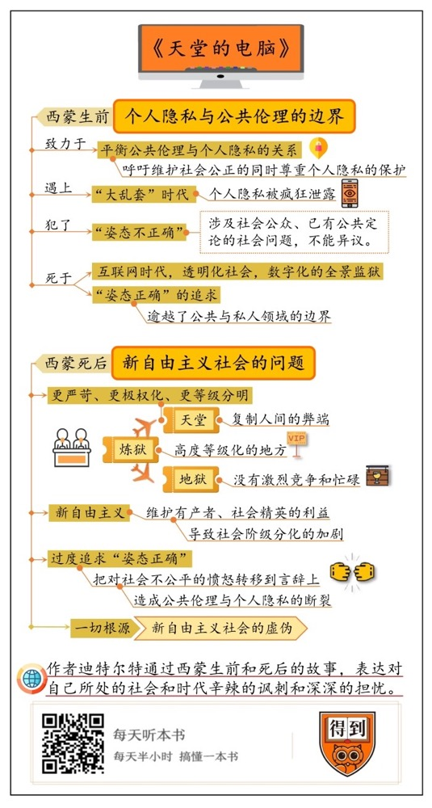

# 《天堂的电脑》| 李迪迪解读

## 关于作者

伯努瓦·迪特尔特（1960— ），法国小说家、随笔作家、音乐评论家。他的小说创作聚焦于网络时代的媒体事件和社会现象，荒诞、黑色幽默，发人深省。1997年出版的《幽默时光》获法兰西学院最佳短篇小说奖；2001年的《法国之旅》获美第奇奖。《天堂的电脑》是他2014年出版的作品，受到米兰·昆德拉的赞赏。

## 关于本书

主人公西蒙·拉罗什是法国公共自由委员会的负责人，他所在的机构致力于维护个人隐私与公共伦理的边界。讽刺的是，在一次采访前，他与记者闲聊时说的一句无心之言却被偷录，并被泄露到网上，因为其言辞姿态不够正确，令他遭到网络暴力，无处遁形。

与此同时，全世界互联网进入了一个叫“大乱套”的新时代，人们在电脑、手机和网络上的所有操作所有言论，全部被泄露无遗，私人领域与公共领域不再有界限。这在政界、商界、娱乐圈引发了巨大动荡，家庭分崩离析，友谊破裂，国际局势紧张。

西蒙面临绝境，他想要自杀，却意外身亡。他死后到达“彼岸”，却吃惊地发现死后的世界是人世间的翻版：天堂已经被新自由主义彻底改变，上帝无迹可寻，已经被“云”取代，生前所有言论是否姿态正确成为末日审判的标准，而地狱是一个类似第三世界国家的地方。

## 核心内容

在文学想象中，天堂是对人世间的超越，而地狱是最黑暗的人间。这本书却想象了这样一个世界：天堂是西方新自由主义社会的极致，而地狱则是一个全球化不曾染指的地方；而判定一个人是好人还是坏人，是该上天堂还是下地狱，靠的就是你活着的时候发表的一切言论是否“正确”，在互联网“云端”留下的一切数据是否“干净”。这是一本既现实又荒诞的书，它尖锐地提出了两个当下热门的社会议题：互联网时代，个人隐私与公共伦理的关系，以及新自由主义社会的虚伪。

本期音频将从两个方面为你解读这本书的主要内容。首先你将听到的是主人公生前的遭遇，我们来探讨下个人隐私与公共伦理的边界问题；然后你将听到的是主人公死后的遭遇，我们来聊聊新自由主义社会的问题。

## 前言

你好，欢迎每天听本书。这期为你解读的是一本刚刚出版中译本的小说，《天堂的电脑》。

听到这个书名你可能会觉得奇怪，天堂跟电脑能有什么交集呢？是啊，我们在文学作品中看过了太多对死后世界的想象，不管在东方还是西方，古代还是当代，地狱都是刀山火海，血泪油锅，是最苦难的人世间；天堂则是岁月静好，极乐永生，是对人世间的超越。但是，你有没有想过，倘若真有天堂地狱，此时此刻会是什么模样呢？今天的天堂里有没有电脑，有没有互联网呢？

这就是咱们讲的这本书开的一个脑洞了。它想象了这样一个世界：天堂早就与时俱进了，不但有电脑和互联网，而且，它还变成了一家公司。而判定一个人是好人还是坏人，是该上天堂还是下地狱，靠的就是你活着的时候发表的一切言论是否“正确”，在互联网“云端”留下的一切数据是否“干净”。这本书的主人公是个倒霉蛋，活着的时候因为私底下说了几句姿态不正确的话，而被全网声讨，最终被逼上了绝路。更讽刺的是，他在死后的世界中，又把生前的遭遇变着花样重复了一遍。

这本书的作者叫伯努瓦·迪特尔特，是个60后的法国作家。他的小说基本都是写网络时代的媒体事件和社会现象的，非常荒诞、黑色幽默，发人深省。法国文坛有四大文学奖：法兰西学院文学奖、龚古尔文学奖、费米娜文学奖和美第奇文学奖。迪特尔特的小说作品不多，但把这四大文学奖也拿了一半。《天堂的电脑》是他2014年出版的作品，受到了文学大师米兰·昆德拉的大力赞赏，被称为“法式黑镜”。

这是一本脑洞清奇，情节有趣的书，同时它探讨的社会议题也很当下，很深刻，概括起来有两个：第一个，是在数字时代，个人隐私与公共伦理的关系问题；第二个，就是新自由主义社会的问题。我想，它会是一本能引起你共鸣的书。

接下来，我就来为你解读一下这本书的主要内容吧。首先我要讲的是主人公生前的遭遇，我们来探讨下个人隐私与公共伦理的边界问题；然后我要讲的是主人公死后的遭遇，我们来聊聊新自由主义社会的问题。

## 第一部分

首先我们说第一个议题：个人隐私与公共伦理的边界。

这本书一共有五章，第一、三、五章分别写的是主人公死后的故事，二、四章就是他生前的故事。我们按时间顺序，先从他生前的故事讲起。

主人公就生活在我们这个时代。他叫西蒙·拉罗什，五十岁，是法国公共自由委员会的总负责人。公共自由委员会是个什么机构呢？它是一个政府部门，主要负责互联网时代对个人隐私的保护，比如，它每个季度都要发布有关保护私生活的社论，它要对隐私保护方面的争端和立法法案发表意见，虽然它的意见很可能也改变不了什么，但它必须存在，必须发声。西蒙就是这个机构的发言人。除了发表社论，他还经常到大学和电台、电视台演讲，接受媒体采访。西蒙很喜欢自己的社会身份，他出入国会，出差坐头等舱，享受各种特权，觉得自己是人生赢家。

这里，我要透露一个西蒙的小隐私给你，那就是，他有时候会上色情网站浏览图片，尤其迷恋一个叫娜塔莎的斯拉夫女孩。相信你也知道，女权主义运动在欧美，尤其是欧美发达国家搞了很多年，至今仍如火如荼，也取得了很好的成果。在这本书里也是一样。你不妨想想，在这样的环境下，西蒙这样一个身份的人，他在浏览色情网站的时候，会坦然自若吗？当然不会。他知道这些色情网站总部都设在第三世界国家，这些女孩很可能不满18岁。于是，他在浏览不雅图片的时候非常焦虑和恐惧，担心自己的行为会被泄露，担心女权主义组织会抨击自己，担心自己的妻子和儿子会知道这件事。

正在这时候，一个女权组织向社会发布了一封“反色情请愿书”。这个组织名叫“作为女人的我们”，这封请愿书呼吁大家尊重女性形象，关注淫秽图片对女性的性剥削，呼吁完全取缔色情网站。这个请愿活动引起了社会舆论的轩然大波，西蒙当然也参与了。他代表委员会发表了社论，表示了对女性的尊重和对女权运动的支持，同时他也提醒人们注意公共伦理与个人隐私之间的边界，强调网民的私生活不容侵犯。

这一天，一档著名的电台节目邀请这个女权运动的负责人来做节目，另外一个嘉宾是一个同性恋组织的负责人，两人的对谈完全没有分歧，在节目主持人看来，自然也就没什么爆点。于是，她随即邀请西蒙针对这场对话做个访谈，希望他的立场能为这个社会议题增加一点不同的声音。

结果，就在这里，西蒙出了乱子。他在录节目之前与主持人的闲聊中，随口说了几句话，表达了他对女权主义和同性恋平权运动的厌烦，结果不知被谁录了下来，还把这段视频一通剪辑，发到了网上。

接下来正式录制的节目里，西蒙重申了自己在社论中的观点，呼吁人们既尊重女性权益，抵制性剥削，也要尊重个人隐私；在打击非法网站的时候，也要保护个人信息。不过，已经没人在乎他说了什么了。网络上到处流传着他被偷录的小视频，标题是《公共自由委员会发言人受够了女人和同性恋》。网民们痛骂西蒙，呼吁将他开除公职。

这里我想插几句。把西蒙在节目开始前的闲聊拿出来做公共审判，显然是不正义的。你肯定听过伏尔泰这句名言：“我不赞同你的说法，但我誓死捍卫你说话的权利。”这句话意思是说，我是自由的，但我的论敌也有自由，自由的敌人也是自由的。伏尔泰是法国的哲学家和文学家，长久以来，法国践行着伏尔泰这句名言。不过，世界已经变了，伏尔泰已经成为过去。

以西蒙的社会身份，他这番吐槽在他所在的社会中，已经犯了“姿态不正确”的大忌。什么是姿态不正确呢？就是面对一些涉及社会公正、并且已经有了公共定论的社会问题，你不能有异议。比如全球变暖，如果你说全球变暖不是人类活动造成的，是地球的正常波动，那你姿态就不正确了。同样的还有种族歧视，难民问题，女权主义和同性恋问题。这是个挺敏感的问题，说实话，这种对姿态正确的强调，掩盖了人们内心深处真正的声音，那就是，很多人并不是发自内心地尊重女性，关心环保，对同性恋、难民、少数族裔也并不宽容，但他们不能说。说到底，姿态正确只是一种言说的政治，而不是实践的政治，人们只在乎你说了什么，而不在乎你有没有真的这样想，这样做。这必然会导致现代社会走向虚伪和分裂。

我们说回西蒙。他是个倒霉蛋，遇上了一个个人隐私被疯狂泄露的时代。西蒙发现，不知什么原因，自己的电子邮箱里开始冒出数百封几年前删除掉的邮件，这些僵尸邮件怎么都删不完。这还只是前奏。这种情况开始蔓延。很快，人们开始收到别人的僵尸邮件、删除了的短信、网页浏览记录和下载记录。结果，妻子收到了丈夫的私人邮件，发现丈夫有了婚外情，公民收到了政要的上网记录，发现政要上过色情网站，一国政府收到另一国政府的私密文件。简而言之，互联网进入了一个新时代，人们在电脑、手机和网络上的所有操作所有言论，全部被泄露无遗，私人领域与公共领域不再有任何界限，整个社会就像一个数字化的监狱，所有人监控所有人，审判所有人。这在政界、商界和娱乐圈引发了巨大动荡，家庭分崩离析，友谊破裂，国际局势紧张。

人们管这个时代叫“大乱套”时代。这是一个没有秘密的世界，一个完全透明的社会。人们发现，几乎没人能在“姿态正确”上能做到无可指摘，于是，一个致力于“姿态不正确”的组织顺势崛起了。这个组织叫“作为男人的我们”， 发起人模仿女权组织的方式，却跟她们完全对着干。他们擅长攫取公共情绪中的价值，也精通如何利用媒体和社交网络制造舆论，用擅长撒娇耍赖的方式把流量做大，获得了各种追捧。

总之，社会的价值极度混乱。姿态不正确的组织成了网红，西蒙却没有获得公众的丝毫谅解。他被人肉，即使躲到乡下也人人喊打，最夸张的是，他去酒店开房的时候，酒店居然为他提供了特殊服务：在大荧幕上播放了他浏览过的色情网站上那个叫娜塔莎的女孩的视频……他一打听才知道，谁都可以在网上查到他的这个秘密。这可吓坏了西蒙，自己隐藏最深，最恐惧的事情终于发生了！人们会说他是恋童癖，他维护个人隐私的公共言论会被当成以权谋私，他会被开除，家庭会破裂，再也没有翻身之日了……

绝望之际，西蒙决定自杀，不过，他毕竟还是个热爱生活的人。就在他回心转意，决定写一封道歉信，忍辱负重活下去的时候，他却意外身亡了。讽刺的是，他是在去拿一本书的时候不慎摔死的。那是他最喜欢的一本书，作者是伏尔泰，书名很讽刺：《老实人》。

西蒙生前的遭遇大致讲完了。这是一个数字时代的讽刺寓言。西蒙一生致力于平衡公共伦理与个人隐私的关系，呼吁社会在维护社会公正的同时尊重对个人隐私的保护，然而，在“大乱套”时代，他的个人隐私却被接连泄露，这导致他走向了死亡。可以说，他死于互联网时代，死于透明化的社会，死于数字化的全景监狱。除此之外，西蒙还死于社会对“姿态正确”的追求，这种追求逾越了公共与私人领域的边界，已经到了扭曲的地步。你不妨想想，它的社会根源在哪里呢？

## 第二部分

这就是我们第二部分的内容了，我要说的是作者对新自由主义的讽刺。在作者看来，新自由主义社会就是人们追求“姿态正确”的根源。

我们接着说西蒙死后的世界。这个世界像但丁写的《神曲》那样，有天堂、炼狱和地狱之分。

我们先来说天堂。西蒙是个基督教徒，按照教义，他死后，上帝会赦免他的一切过错，他满心以为自己会上天堂，结果却出现在一间等候大厅。这地方就像一个银行大厅，座椅是塑料的，又像旅行社，墙上贴着酷炫的海报，看上去像海岛度假村的广告，有高级大酒店、人工岛屿、帆船和小木屋，金色沙滩上写着“赢取天堂的海报”。西蒙这才明白，这海报里的度假胜地就是天堂，死去的人都要在这里排队等候。

这是一个全球化的世界。只有一种语言：英语。墙上贴着No Smoking，天堂海报上写的是英文，柜台办事员也只讲英文。如果你是个来自非洲的土著，或者来自西伯利亚的伐木工人，对不起，你也得先学会英文，才有机会“赢取天堂的门票”。

这也是一个高度“文明”的世界。等候大厅，秩序井然，柜台前有防弹玻璃，一切都用电脑管理，每个人都要填很多表格，跟人世间一样烦琐，填完表格，会被送去心理援助室，心理医生会让你跟自己在天堂的家人打视频电话，尽管西蒙并不想在死后回归他生前的家庭。

这还是一个透明的世界，一个数字极权主义世界。天堂早就人满为患，为了缓解人口压力，准入标准提升了不少，判断你是好人还是坏人，上天堂还是下地狱，不仅要看犯罪记录，还要看你生前的言行是否“姿态正确”。这就是所谓的末日审判。跟西蒙所处的那个“大乱套”时代一样的是，在这里，每个人生前所有的言行记录也都存在“云端”，没有任何隐私可言。天堂的管理部门能从互联网运营商那儿拿到西蒙的登陆详单，也能查阅他跟朋友的私人邮件，对每个人生前的一举一动一念一行，都明察秋毫。

面对这样一个上帝，西蒙去天堂的胜算自然就不多了，管理部门派了个律师给他。律师告诉西蒙，自己将对他进行有罪辩护，因为他有好几个黑历史：一个是他曾经在跟大学同学聚餐的时候说自己不相信是人类活动导致了全球变暖；一个是浏览未成年少女的色情图片；还有一个，是他曾在私人邮件中开了移民问题的玩笑。西蒙这才明白，自己所梦想的永生，非但没有保留人世生活的精华，还千方百计地模仿着人世间的糟粕。但是，他能怎么办呢？在这里，他连死的权利都没有了。

于是西蒙来到炼狱。所谓炼狱，就是介于天堂和地狱之间的地方，在这里，死去的人要经受试炼，才有上升或下降的机会。而在这本书里，炼狱是个类似航站楼的等候区域，有免税店，咖啡馆，餐吧，还有上网区，报摊，和私人沙龙。这里的人被称为旅行者，大家怀着去天堂的美好愿景，在这里打发时间，等着天堂空出位子来，好坐飞机去天堂。

炼狱也是一个高度等级化的地方。旅行者被分成三个等级：黄金级入选者，高级人士，和西蒙这样不属于任何类别的旅行者。黄金入选者有机会很快得到永生，高级人士要等上几千年，但可以去免税店购物，西蒙这种人则几乎没有任何机会，只能坐在咖啡馆里吃发硬的三明治。

就在这时，西蒙看见一个著名的跨国公司老板被人群拥簇着走过，西蒙知道，他也是刚刚去世，而他却无须排队等待，可以直接去VIP休息室。他这才知道，炼狱也是一个有特权的地方。为什么会这样呢？原来，天堂和西蒙所在的人间一样，早已变成了新自由主义的天堂。它曾经崇尚公平，但它的教义却被一群自由主义者所改变，他们是哈耶克、米尔顿·弗里德曼，罗纳德·里根……

什么是新自由主义呢？通俗地说，这是一套服务于资本主义的政治经济思想。践行这种思想的社会，是一个由社会精英建立的，尊重个人自由甚于追求平等，尊重市场逻辑甚于追求社会公平的社会。从20世纪80年代开始，新自由主义成为西方社会的主流思潮。任何思想都不是完美的。新自由主义的一个弊端就是，它主要维护的是有产者、社会精英的利益，这必然会导致社会阶级分化的加剧。

正是在这种社会背景下，人们格外强调“姿态正确”。这是因为，社会的发展正是建立在对第三世界、对社会底层的剥削的基础上的，新自由主义社会中，人们在言论上维护的，正是他们所伤害的。为弱势群体发声，这当然是一种“文明”的表现，但这种文明很多时候只是一种姿态，就像我们前面说的那样，它会造成表现与内心，言说与实践上的断裂，某种程度上是虚伪的。这应该很好理解，想想欧洲发达国家对难民的态度就可以了。简单来说，“姿态正确”把人们对社会不公平的愤怒转移到了言辞上，而他们真正应该愤怒的对象，其实是资本主义和新自由主义本身。

律师告诉西蒙，如今的天堂就是一家公司。由于名额紧俏，天堂的管理部门让死者之间形成竞争：每个死者都想改变自己的阶层，赢取天堂的门票，为达到目的，每个人都要施展自己的才能。不过，所谓自由竞争只是一种姿态罢了。有钱人和名人在死后世界仍然享有特权，只有暴发户才有机会上天堂，而死去的穷人可能连一句英文都不会说，就被送上了飞往“临时居所”的航班，在临时居所里重复着自己生前的贫穷生活，做着天堂的美梦。所谓“临时居所”，说白了，就是难民营；由于天堂没有时间，所谓的临时，其实就是永恒。听到这里，西蒙义愤填膺。

你看，死后的世界完全就是西蒙生前世界的复制品，只是更加不容辩驳，更加别无选择。在航站楼，西蒙给死去的母亲打了个视频电话。她老人家是天堂的居民，永远地待在泳池旁喝果汁，过着高度现代化又千篇一律的度假生活。再加上天堂禁烟禁酒，追求养生，健康饮食，在西蒙看来，这样的天堂实在无聊。

在等待期间，西蒙还见到了圣彼得。圣彼得是耶稣的十二门徒中的领头者，也是耶稣最信任和喜爱的门徒。在这本书里，他却是一个小丑般的人物。他告诉西蒙，上帝已经无迹可寻，变得越来越难以捉摸，似乎已经不关心生灵的命运，连他也不知道上帝去哪儿了，他和大家一样，也只能在网络中寻找答案，他暗示说，很可能，全知全能的“云”已经取代了上帝。

西蒙与圣彼得谈话后开了窍，他不再担心上帝的审判，决定在新自由主义的天堂门口，也就是炼狱航站楼，凭自己的本事放手一搏。他充满信心，相信自己一定能得到特权，进入VIP休息室。然而就在这时，他却等来了自己的判决。让他意外的是，他居然被判下地狱，而且没有上诉的机会。心如死灰的西蒙推开地狱大门，准备面对充满火焰和血泪的深渊，结果，地狱的情景再次让他大跌眼镜。

如果说天堂是西蒙生前所在世界的未来的话，那么，地狱就是西蒙生前所在世界的过去。这是一个旧世界，一个像第三世界的地方。被罚下地狱的人坐上唯一一班绿皮火车，沿途是前工业时代的田园风光，没有商业中心，也没有高速公路。这里不禁烟不禁酒，可以一头扎进地下酒吧痛饮到天明，也没有健康饮食的规矩，就算你胡吃海喝，五毒俱全，也不会再死一次。马路上危险重重。骑车的不戴头盔，食物不是冷冻的也没有塑料包装，男人搭讪女人也不会被投诉。全球化不曾染指这里。人们说着各种各样的语言，英语帮不上什么忙。每次与人打交道，你都要耐心学习对方的语言。

这是一个现代经济缺席的世界。如果说天堂和人间奉行的是市场逻辑，追求的是效益，那地狱就是懒汉的天堂，它执行的是老规矩，没有激烈的竞争，也没有你生产我消费的忙碌。这个世界有点落后，有点不方便，人们没有义务也没有抱负，没什么消费也没有贷款。在这里，西蒙仰望星空，灵魂终于得到了久违的平静。

故事到这里就结束了。总的来说，这本书最有趣的地方就是，它所呈现的死后世界完全颠覆了主人公和我们的想象，这个世界的天堂非但没有更好，反而复制了人间的弊端，还把这种弊端做到了登峰造极，而这个世界的地狱也没有更坏，相反，还让西蒙得到了解脱。对他来说，人世间和天堂都是让人无处遁形的数字监狱和新自由主义的虚伪世界，相形之下，下地狱简直可以说是个意外之喜了。

## 总结

好，这本书的内容就说为你解读到这里了。我们分别说了西蒙生前和死后的遭遇，生前，他死于姿态不正确的言论，虽然不正确，但那毕竟是他私下闲聊，泄露他隐私和审判他言论的人打着正义的旗号，其自身却并不正义。西蒙生前是不幸的，他遇上了公共生活与私人生活边界不存的“大乱套”时代，并死于这个时代公共审判的暴力。然而，他死后的世界却并没有更仁慈，反而更严苛、更极权化了，也更加等级分明。社会对姿态正确的过度追求，会造成公共伦理与个人隐私的断裂，这是一种言说的政治，而非实践的。而这一切的根源，就是新自由主义社会的虚伪。

还有一点我想简单说几句。西蒙所经历的死后世界，也就是书里所说的“后死亡生活”，用拉丁文说，是post mortem，谐音就是post-modern，后现代。这是作者的一个文字游戏。所谓后现代，就是传统信仰崩塌，不再有绝对真理。作者是在暗示我们，西蒙死后的生活，就是我们置身其中的后现代生活，在这个世界中，上帝无迹可寻，全知全能的“云”取代了上帝。这看似荒诞不经，仔细想来似乎也顺理成章。从这里，你可以看到作者迪特尔特对自己所处的社会和时代辛辣的讽刺和深深的担忧。

撰稿：李迪迪

转述：成亚

脑图：刘艳脑图工坊