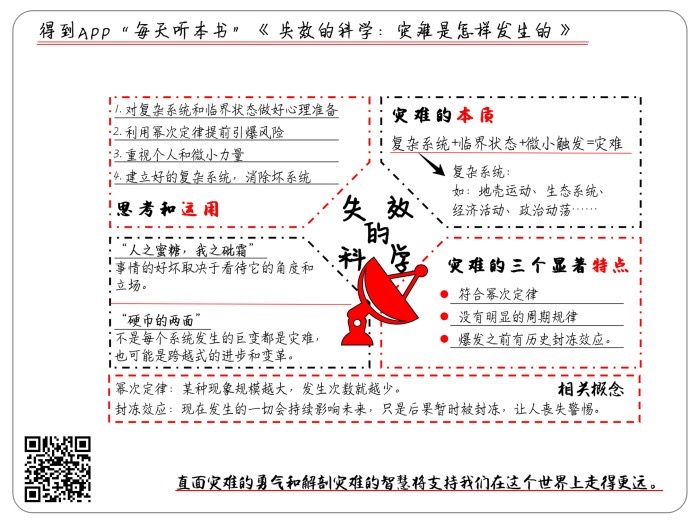

# 《失效的科学：灾难是怎么发生的》| 良舟工作室解读

## 关于作者

马克·布查纳，美国理论物理学家、科学作者，美国弗吉尼亚大学理论物理学博士，研究领域为非线性力学和混沌理论。《自然》杂志编辑，《新科学家》杂志特约编辑，《纽约客》和《自然物理》杂志专栏作家。

## 关于本书

在本书中，马克·布查纳讲述了科学家们努力寻求各类灾难源头的故事，得出一个出人意料的观点：科学无法有效地预测灾难。他运用理论物理的研究成果，用沙堆实验的模型来模拟灾难产生的源头和条件，观察总结了灾难的本质和显著特征，讨论灾难能给人们带来的启示。

## 核心内容

至今为止，科学不能有效地提预测和控制灾难。科学失效的根本原因在于灾难通常产生于复杂系统之中，而目前的科学手段尚未完全掌握复杂系统的运行机制。尽管如此，我们仍能够利用一个足够简单的模型——沙堆实验，来把握灾难的本质。大量发生过的灾难案例，呈现出了一些显著特征，也能够帮助我们更好的了解灾难。如果能换个角度看待灾难，我们将会获得如何应对灾难，追求幸福的技巧。  

## 前言

你好，欢迎每天听本书。本期为你解读的是《失效的科学》，副标题叫作《灾难是怎样发生的》。本书的作者叫作马克·布查纳，是一位美国的物理学家。这本书的中文版大约有300页，我会用大约21分钟的时间为你讲述书中的精髓：本书揭示了灾难的本质和特征，并和你探讨正确看待灾难的方式，让你能够从容面对生活中的重大变故。

这本书的标题好像有点儿耸人听闻，科学怎么会失效了呢？科学让我们从现象中寻找规律，形成理论，然后用理论预测和控制现象，来达到我们的目标。科学应该是人类最有效的一种工具啊。而且刚才我们介绍过，本书的作者是一位物理学家，也就是自然科学家，那么，一个科学家为什么要砸自己的招牌呢？事实上，正因为作者是科学界的内部人士，才更容易发现让科学失效的领域，那就是副标题所说的，灾难现象。这里的灾难是指会波及很多人、破坏性特别大的自然和社会事件。作者在书中用随笔的形式，夹叙夹议地讲了很多故事，证明科学并不能让我们找出灾难的规律，更别提预测和控制灾难了。换句话说，在灾难面前，科学有时也会失效。

一说这话，日本人民肯定要流泪了。大家都知道，自古以来，日本最典型的自然灾害就是地震，现代科学发展起来之后，日本科学家花了很大的功夫研究以往的地震记录，利用统计数据建立起模型，想找出地震的时间周期和地点模式。终于，在20世纪70年代末，地震学家拿出了一个具体的成果，他们说，一场8级左右的大地震将袭击东京和名古屋之间的东海地区。这是个什么地方呢？一说你就知道，1923年那场著名的关东大地震，就发生在东海地区。

日本负责灾难预防的官员决定要相信科学，于是，日本政府迅速建立了早期警报系统，一有任何风吹草动，地震评估委员会就赶紧召开紧急会议，决定是否关闭核电站、高速公路、学校和工厂等重要设施。当地普通民众也相当配合，从那时起，人民群众每年都在关东大地震纪念日那天进行地震演习。但一直到1995年，传说中的东海地震都没有发生，可以说大家白忙活了二十多年。

说实在的，只要不地震，白忙活二十多年也就罢了，可这场地震偏偏还是发生了，只不过发生在了大家一直没怎么关注过的神户地区。这就是1995年的阪神大地震。由于地震学家认为这里不太可能发生大地震，该地区的防震工作一直滞后于城市建设，城市里的消防设施不够完备，也没有提前准备好救灾方案。结果，只在一瞬间，占国民生产总值2%的巨额资产就在地震中消失了。所以说，地震科学家拿出的科研成果等于一句话：“说震的地方它不震，说不震的地方它偏震。”这就让人尴尬了不是？

话说到这，你肯定能想到更多类似的例子，比方说物种灭绝、战争爆发、金融危机……各路专家好像只能放马后炮，事后才出面做一番解释，而不能事先给我们准确的预测。这些专家是不是不敬业或者科研水平太低？这本书将会给你一个答案，让你更好地理解为什么现有的科学方法无法有效地预测灾难。

不过，我们今天的分享，并不仅仅是想让你对专家们多一点宽容，而是要借助这本书提供的观点和知识，达成三个目的：第一，让你理解灾难的本质；第二，向你介绍灾难的显著特点；第三，和你一起思考如何在生活中运用今天的收获。接下来，我们就按照这个顺序，分三个部分展开今天的分享。

## 第一部分

灾难的本质是什么。

要把握一个东西的本质，我们通常会先去了解它的根源，它是从哪里产生的。那么，灾难是从哪里产生的呢？本书作者告诉我们，**灾难是从“复杂系统”中产生的**。那复杂系统又是什么呢？其实，像地壳运动、生态系统、经济活动、政治动荡这一类事物，都是复杂系统。我们可以看出，这些系统有一个共同特点，那就是包含着千千万万个相互作用的因素，特别是在人类活动的领域，人通常既是观察判断者，又是游戏参与者，在一系列过程中，每个人的观点和行为又是随时变化、相互影响的，呈现出典型的相互纠结的网络结构。可以说，自然界和人类社会充满了复杂系统，我们就生活在形形色色的复杂系统当中。

你可能会问了，既然灾难从复杂系统中产生，我们又生活在各种复杂系统中，可为什么并没有天天遭受灾难呢？那是因为，要产生灾难，复杂系统必须先进入一种叫作“临界”的特殊状态，这时，一个小小的变化常常会引发很大的动荡。

复杂系统、临界状态，突然冒出了两个新概念，好像让人有点摸不着头脑。实际上，不但我们普通人很难理解，就连学术界也还没能把复杂系统彻底研究清楚。科学家们还在争论不休，不能给出一套权威的理论。本书作者马克·布查那当年读博士的时候，专门研究过复杂系统，他提出了一个模型，来帮助我们理解复杂系统和临界状态，这个模型叫作沙堆实验。

沙堆实验是这么进行的：让沙子一粒一粒地，不断地落到一个平面上，显然，沙子会慢慢向上累积，形成一座越来越高的小山。当然，事情不会永远这么发展下去。随着沙堆不断增大增高，它的边缘会越来越陡峭，下一粒落下的沙子很可能会引起沙堆崩塌。崩塌时，每一粒落下的沙子都促使沙堆越变越矮，越变越平坦，但到达某个时刻后，沙堆又会突然停止崩塌，每一粒落下的沙子又重新变成了沙堆增高的动力。显然，这个沙堆就代表一个复杂系统，新的沙子不断落进沙堆，代表这个复杂系统在运行；沙堆突然崩塌，代表灾难发生了。我们希望通过这个模型来搞清楚，沙堆什么时候会崩塌，也就是说灾难在什么情况下会发生。

为了找出答案，科学家用计算机模拟沙堆实验，他们从顶部俯视这个虚拟的沙堆，并根据不同部分的坡度涂以不同的颜色。在相对平稳、平坦的地方涂上绿色，在陡峭、易于崩落的地方涂上红色。他们发现，刚开始沙堆看起来几乎一片绿色，但随着沙堆增大，绿色区域中开始渗进了越来越多的红点。沙粒不断增加，分散的红点也不断增多，越来越密集，最终，红点连成了一张网络，布满了整个沙堆。

当沙堆布满了代表危险的红点时，就标志着这个系统进入了临界状态。这时，沙堆变得十分敏感，经不起一丁点新的刺激。在这种临界状态下，仅仅是一粒沙子的小小冲击，就很可能触发沙堆大规模崩塌，也就是说，系统中爆发了一场灾难。

就这样，利用沙堆实验，我们可以把灾难的本质总结成一条公式，那就是：**复杂系统+临界状态+微小触发=灾难**。

这么看来，灾难似乎一点也不神秘莫测，只要我们能断定某个系统是复杂系统，为它建立起模型，监测它是否到达了临界状态，不就能够做好预测和预防工作了吗？可惜，事情往往说起来容易做起来难。现实中能让我们操心的复杂系统可不像沙堆这么单纯，这么容易在计算机中模拟。绝大多数情况下，你根本不可能得到关于系统组成和运行的足够信息，而且，复杂系统在演化时，规则还会不停地变化。就拿城市里经常发生的堵车来说吧，某天早上出门，你不知道有多少车会和你开到同一条路上，也不知道一段时间之后，路上会出点什么事儿，会不会有临时的交通管制。由于信息不足，路况又不停地变化，今天会不会堵在路上，只能听天由命了。

退一步来说，即使针对沙堆实验这样一个相对简单的模型，科学家也不能对灾难进行准确的预测。他们曾经在计算机里做了几百万次模拟实验，也找不到沙堆崩塌的典型模式。当红点布满沙堆，系统进入临界状态时，下一粒沙子带来的后果并不确定，有时候只会带动几粒沙子随之滑落，有时候会引发一场包含无数沙粒的大崩塌。换句话说，不但复杂系统很复杂，它的临界状态也很狡猾，好像在对我们宣布：“我要搞大事了，但我不保证会搞出多大的事儿。”你看，“可能会出不知道多大的事儿”，这种结论对预测完全没有实际意义嘛。所以说，尽管科学家可以利用沙堆实验揭示灾难的本质，但复杂系统和临界状态的诡异特性，不是让人毫无觉察就是让人谎报军情。

不过，尽管目前的科学手段还不能有效地预测灾难，但科学家们努力对大量灾难现象进行了观察，并总结出了一些显著的特点。下面我们就来看一看灾难的三个显著特点：首先是灾难发生的规模和次数符合幂次定律，其次是灾难没有明显的周期规律，最后是灾难爆发之前有历史封冻效应。

## 第二部分

先看灾难的第一个特点，<u>符合幂次定律</u>。幂次定律是说某种现象的规模越大，它发生的次数就越少。也就是说，事件的稀有度和严重性之间呈反比关系。这个定律最早是由经济学家帕累托提出的，不仅对经济现象有效，几乎对生活中的各种现象都有效，比如说，如果你不小心摔碎了一个盘子，你会发现，大碎片的数量要比小碎片少得多，而且每当碎片重量增大一倍时，数量就要减少到1/6。

自然灾害的威力和频率也严格符合幂次定律。拿沙堆实验来说，如果某次崩塌中涉及的沙粒数目增加1倍，其发生的频率就下降到1/4。又比如，新闻里报道洪涝灾害时，常会用百年一遇、几十年一遇之类的形容词，用时间尺度来形象地说明灾情的严重程度。

总之，在任何一个复杂系统里，只要超过一定的临界状态，就一定会发生剧烈的改变，改变的尺度有大有小，不同尺度之间存在一定的比例关系。在这里，物理规律、自然规律和人类社会的规律奇妙地相互呼应了。

那么灾难的第二特点是，<u>没有明显的周期规律</u>。今天一开始我们说的，日本专家预测地震被狠狠打脸的故事，就是对周期循环最好的否定。日本是个地震多发的地方，有关地震的资料和数据足够丰富，政府和专家对地震也足够重视，如果地震这种巨大灾变能够有周期规律可循，阪神大地震想必是可以预测并做好防灾预案的。然而，地壳运动能量的积累和释放这个系统实在是太复杂了，用周期和循环的思路来进行预测，根本行不通。

由此，我们可以联想到另一个经常遭遇打脸的周期性预测——金融危机。拿老牌资本主义国家来说，英国早在1788年到1819年间，就频繁出现过经济危机，但它们的出现和交替是没有规则的。美国作为世界上的金融高手之一，虽然经历了1929年和1987年金融危机的惨痛教训，也没能预料到2007年的次贷危机。

实际上，第二次世界大战以后，各国用宏观调控政策深度干预经济，使得经济运行更加错综复杂。在当代，几乎不能用任何一种甚至几种因素去解释和预测经济周期的长短，也不能预见危机什么时候爆发，又会以什么形式爆发，对地区和全球的影响到底有多大。正如一位历史学家所说：一次又一次，历史被证明是一个糟糕的预言家。历史不会重复其自身，没有任何事会在绝对相同的条件下发生两次，也不会以完全相同的方式发生两次。

既然历史事件不会再现，它赖以发生的条件也不会再现，我们是否要把历史记录束之高阁呢？恰恰相反，我们更应该重视历史，因为历史对未来是有决定性作用的，正是历史事件推动着复杂系统一步步地进入临界状态，只不过，在这个过程中，会发生一种让人丧失警惕的情况，这就是灾难的第三个特点：历史的封冻效应。

在沙堆模型中，一粒沙子随机落下，然后沙堆渐渐地漫过那粒沙子，好像将其封冻在里面，同时，那粒沙子落在那个地方所产生的影响，也一直保留在沙堆当中。从这种意义上说，现在发生的一切永远也不会被冲刷掉，而是会持续影响未来的整个演化过程。事情的后果虽然只是被暂时锁住，却是改变未来发展的基础。换句话说，罗马不是一天建成的，骆驼也不是被最后那根稻草压死的。引申到我们的个人生活上，你会发现，很多恶果的最终爆发，都属于冰冻三尺，非一日之寒。比如近几年来总能看到一些青壮年上班族加班猝死的新闻。其实大家心知肚明，这个账肯定不能算到哪一两次的熬夜加班上。再比如说，在人际关系方面，要是你的哪个朋友突然跟你翻脸，估计他是忍了你很久啦。

所以，我们应该更注重历史事件对某种临界状态的促进作用，而不只是关注重大历史事件是否重现。

说到这里，相信你已经充分理解了这本书为什么会叫作《失效的科学》，知道了科学家们难以预测灾难的苦衷。我们还通过沙堆模型模拟灾难爆发，接触到两个新概念，复杂系统和临界状态，利用这两个概念，我们就能把握灾难的本质。通过观察和总结，我们还了解到了灾难的三个显著特点。

我猜，现在你可能会觉得有点沮丧了吧，因为世界上充满了难以把握的复杂系统，充满了最先进的科学手段都难以预测的灾难，人生太艰难了，我们却毫无办法。不过，这可绝对不是我跟你分享这本书的目的。接下来，让我们看看如何思考和运用今天的收获。

## 第三部分

我有两句话，能让你立刻走出今天这个“灾难片”的气氛。有一句话叫作“人之蜜糖，我之砒霜”。什么意思呢？一个事情的好坏取决于看待它的角度和立场。也就是说，对谁来说是好事？对谁来说是坏事？比如，物种灭绝一定是坏事吗？也不见得。恐龙灭绝对恐龙来说是灭顶之灾，可是对哺乳动物来说呢，那可是成为地球霸主的大好机会啊。

另一句话叫作“硬币的两面”，什么意思呢？我们不妨把复杂系统看成一枚硬币，它的一个面是灾难，它的另一个面呢？不就应该是和灾难规模相等但性质相反的事吗？那是什么事？天大的好事。前面说过，复杂系统是形形色色的，除了自然界中的，还有随着人类社会发展而建立起来的。不是每个系统发生的巨变都是灾难，也可能是跨越式的进步和变革。比如，前几年随着智能手机的普及，支付、社交和传播等复杂系统进入了临界状态，之后的变化既巨大又突然，但这些变化是积极的，不仅造就了许多行业英雄，也给普通人的生活带来了巨大的便利，现在你买个早点都不用带钱包了。

所以，我们阅读这本书，并不是为了灾难而关注灾难，而是为了更好地认识复杂系统，认识临界状态，这样才能更好地应对自然和社会中的巨大的变化，跟上好的变化，避开坏的变化。

具体来说，我们可以带着今天获得的知识和启发，尝试以下几种做法。

第一，对复杂系统和临界状态做好心理准备。世界普遍存在各式各样的复杂系统，一旦它们进入临界状态，大规模变动是不可避免的，必然有一个爆发在未来等待着我们。这时，个人的生命、财产安全，或者事业发展都会受到巨大影响。这就警示我们凡事充分考虑风险，做好风险防范，不要被眼前的风平浪静所麻痹，很可能在水面之下，酝酿着滔天巨浪。

第二，主动利用幂次定律。对于一些只能产生灾难的复杂系统，要学会适当提前引爆，用多次的小爆发释放能量，以免系统达到临界状态。据说，美国林业部门在预防森林火灾时，已经采取了偶尔放纵甚至主动引发中、小规模火灾的办法，这样可以清除随着树木增殖不断积累的易燃物质，也能让树木不那么密集，从而预防大型森林火灾。而在我们平时的人际关系中，要尽量及时沟通并解决矛盾，避免积累情绪和敌意。

第三，永远不要孤立地看待微小的力量和个人行为。如果某个复杂系统被组织成临界状态的话，即使最微小的力量也会产生巨大的影响。不断发展的社会就像那个沙堆，而此刻，也许在某个红色区域内有一粒沙粒将要滚落，也许这一粒沙子会碰巧落到适当的位置，继而引发一场巨大的雪崩。所以，个人是有力量的，我们要在自己关切的领域做个有心人，努力成为最后那粒沙子。反过来说，一个东西能不能引爆，有其自然的规律，有其形势上的积累。我们应该能想到，如果用在营销上，那么费尽力气去炒作和造势，也许不如仔细研究局面，学会借势。在个人成长方面，要努力多做一些意义重大，却未必立刻见效的事情。比方多读一本好书，多学一些技能。每一次的微小努力都可能是你蜕变的契机。

第四，如果复杂系统进入临界状态不可避免，那我们能不能来个斩草除根，彻底消除某些会带来恶果的系统，或者主动建立某些能产生好结果的系统呢？这一点也许很难仅凭个人的一己之力来实现，但这不妨碍我们群策群力，去发现和参与某些系统的消除和建立。人类社会不就是这样一点一点地走向进步吗？只要我们换个角度看待灾难，多多思考复杂系统和临界状态，就能得到一些对个人生活有益的启发，我相信，你能开动脑筋，把今天得到的知识更巧妙地运用到你的生活当中。

## 总结

说到这儿，今天的内容就聊得差不多了。下面，我们来简单回顾一下今天为你分享的内容。

首先，我们说到了为什么现代科学难以预测灾难。因为灾难的本质是复杂系统运行到临界状态之后的结果。用沙堆模型模拟这个过程，就能发现很难预测和控制复杂系统和临界状态。

其次，我们说到了灾难的三个显著特点，即灾难在规模和频率上符合幂次定律，灾难发生时没有明显的周期规律，促成灾难的因素有历史封冻效应。

最后，我们说到了要换个角度思考灾难，挖掘复杂系统和临界状态能带来的积极效果。我们还讨论了如何在生活中运用今天的收获，要学会对临界状态做好心理准备，利用幂次定律提前引爆风险，重视个人和微小力量，群策群力建立好的复杂系统，消除坏系统。

总之，灾难是无情的，科学不是万能的，但直面灾难的勇气和解剖灾难的智慧将支持我们在这个复杂的世界上走得更远。

撰稿：良舟工作室

脑图：刘艳

转述：徐惟杰