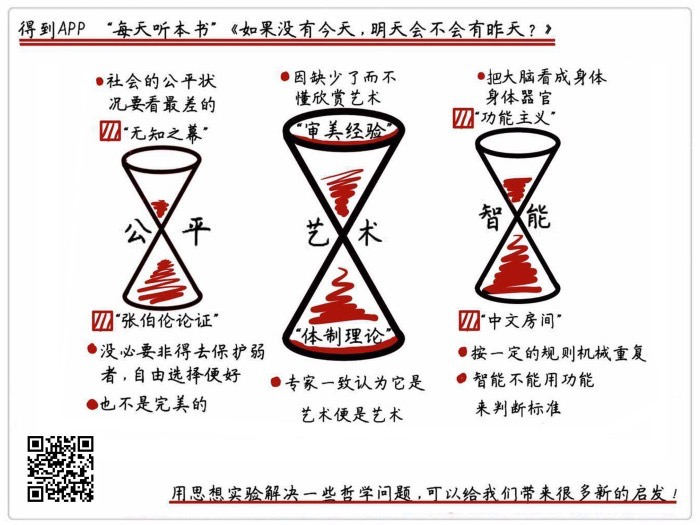

# 《如果没有今天，明天会不会有昨天》| 柴知道解读

## 关于作者

伊夫·博萨尔特，瑞士国家学术基金奖得主，柏林洪堡大学哲学博士。他在瑞士学术基金会开有哲学课，擅长从各种思想实验出发来教授哲学。

## 关于本书

本书选取了55个最精妙、最知名的思想实验，并且通过这些思想实验，介绍了多位哲学家和多个哲学流派的思想精髓。书的章节之间没有先后关系，主题涵盖极广，包含了幸福、知识、道德、公平、艺术、语言等多个方面的主题。作者以一种四两拨千斤的方式，剖析了许多难懂的哲学问题。 

## 核心内容

本书的精髓是，如何从思想实验的角度来认识哲学。思想实验的意思是，用想象力去进行的实验，所做的都是在现实中做不到的实验。

## 前言

你好，欢迎每天听本书。今天为你解读的是《如果没有今天，明天会不会有昨天？》。它的中文版大约18万字，我会用大约28分钟的时间，为你讲述书中精髓：如何从思想实验的角度来认识哲学。

这本书的书名听起来有点绕，其实它本来就是一个思想实验。思想实验的意思是，用想象力去进行的实验，所做的都是在现实中做不到的实验。假如没有今天，那明天会不会有昨天？这其实是在讨论时间问题。有一位基督教哲学家叫奥古斯丁，他就提了一个想法：他说大家都知道，时间是由过去、现在和未来组成的，但是，未来还没到，所以还不存在。过去的已经过去了，所以也不存在。而现在只是一个点，一点点延伸性都没有，无穷短，抓都抓不住，所以也不存在。那既然过去、现在、未来都不存在，那时间本身也不存在的，完全是我们人类自己主观想象出来的。

所以从书名你就可以看出，一个精巧的思想实验，可以提出非常犀利的问题。如果你能回答好这个问题，那你的理论就可以自圆其说。如果你回答不了，那一座理论大厦就会瞬间轰然倒塌。所以，思想实验就好比是阿基米德手中的那根棍子，只要找准角度和支点，就能四两拨千斤，撬动整个哲学大厦。

其实这类的思想实验，你平常可能也听过。比如那个著名的“电车难题”：假如你面前有一辆电车开来，铁轨上有5个工人。你只需要按下按钮，电车就会换道，但另一条铁轨上有1个工人。此时，你会选择按下按钮吗？这个思想实验很出名，对这个问题的不同回答，也体现了不同的哲学倾向，我们可以借此了解到康德、边沁等许多著名哲学家的理论。

今天我要讲的这本书，就是通过介绍各种各样的思想实验，用一种简单轻松的方式，带你了解一些哲学问题。书中涉及的知识面很广，在很多问题上都可以给我们启发。比如，战胜柯洁的围棋机器 AlphaGo 到底有没有智能？苹果公司为什么能多次引领全民审美？那些玄乎的当代艺术到底有没有价值？我们能不能实现完全的公平？读完这本书后，相信你能对这些问题有更深入的认识。

这本书的作者叫伊夫·博萨尔特，是一名哲学博士，还获得过瑞士国家学术基金奖。他平常自己也教哲学课，而且就是用思想实验的方式来教。所以这本书，他写得得心应手，非常精彩。

好，介绍完书和作者的概况，接下来，我就来为你详细介绍书中内容。我从书中挑选了一些最精彩、也最实用的思想实验，来和你讨论这几个问题：一是到底怎样才能实现公平？二是艺术到底是什么？三是机器人到底有没有智能？

## 第一部分

我们先来看第一个问题，到底怎样才能实现公平？

公平这个事情，可以说是人类，甚至是所有动物的共同追求。有科学家做了一个实验，他们养了两只很可爱的小猴子，给它们布置了同样的任务。第一只猴子完成了任务后，科学家就给它奖励一块黄瓜，另一只猴子完成任务之后呢，给它奖励一颗葡萄。那第一只猴子就不干了啊，葡萄那么甜，凭什么它拿葡萄我拿黄瓜？但毕竟是第一次，它只是表达了不满，没有太多抗议。之后这个实验又重复了一次，这次拿到黄瓜的那个猴子彻底不干了，直接把黄瓜扔了，敲地板，摇笼子，强烈抗议这种不公平的情况。

这个实验就说明，即使是猴子，都对公平这件事情非常敏感。我们人类就更是这样了，你想想，如果你周围有个同事，整天什么事都不干，拿的工资还比你高，那你是不是特别不爽？很多社会问题，背后其实也是同样的原因。这就是因为人人都有对公平的追求。

但到底怎么才能做到公平呢？这是一个非常复杂的问题。有一位哲学家，叫罗尔斯，他写了一本《正义论》，被认为是20世纪最重要的哲学作品之一。他在这本书里提出了一个实现公正的办法，也是一个思想实验，就是著名的“无知之幕”。

“无知之幕”是说，假设我们让你来为整个社会制定法律和各种制度，那怎么保证你不偏袒自己，制定出一个公平的制度呢？有个办法，就是给你蒙上一层“无知之幕”：就是说，让你不知道自己在这个社会中处于什么位置，不知道是穷还是富，也不知道自己是不是残疾，聪不聪明，从事什么职业，黑皮肤还是白皮肤，甚至是男是女，是同性恋还是异性恋，都不知道。

这就相当于，你虽然可以制定游戏规则，但是不知道自己是游戏里的哪一方。那这种情况下你就会想，万一我运气不好，成了这个社会里的弱者，那怎么办？所以为了保险起见，那我就会尽力制定出一个公平的、照顾到所有人利益，特别是照顾弱者利益的社会规则。这样万一我自己成了社会里的弱者，那也能得到公平的对待，也能过上还可以的生活。

其实“无知之幕”的这个思想实验的意思，就是说在制定政策的时候，要避免私人利益的干扰。这样制定出的政策，就能保证所有人都享有基本的权利。而且，这个政策会尤其照顾弱者的利益，罗尔斯特别强调，我们可以接受有条件的不公平，那这是什么条件呢？就是说，即使是最弱的人，都可以从这种不公平中获得利益，那我们才能同意。在“无知之幕”的情况下，这的确是合理的推论。

所以“无知之幕”得出的结论就是，一个社会的公平状况，要看过得最差的那个人，他过得怎么样。

这个思想实验，听上去好像是完美无缺了，很难挑出毛病。既排除了个人利益的干扰，又照顾弱者的利益，那还有什么可说的？所以不管“无知之幕”在现实中存不存在吧，是不是只要按照这个思想实验指明的路走下去，人类就能实现公正呢？很可惜，不是这样。举个例子：假如给你两个保险柜，你不知道里面分别装了多少钱，只知道第一个柜子里面可能装了100块钱，也可能装了1000块钱。第二个柜子可能装了200块钱，也可能装了400块钱。那这个时候，你应该挑哪个柜子呢？

按照罗尔斯从“无知之幕”这个思想实验里总结出的原则，你应该挑第二个柜子。因为这样可以保证，即使是最差的结果，你也能得到200块钱，等于是保护运气最差的人的利益嘛。但你心里肯定会犯嘀咕，选第一个柜子，你可能能拿到1000块钱啊。而且平均一下，选第一个柜子，概率上来讲你可以获得550块钱。但选第二个柜子，按概率看只能拿到300块钱。那罗尔斯让你选第二个柜子，这不是傻吗？

再举一个例子。地球上有70亿人，假设有两种情况：第一种情况是，所有人每天都赚10块钱，最弱的人也能赚到10块；第二种情况，最弱的那个人赚9块钱，其他人每个人都赚100块钱。你说哪种情况公平？按照无知之幕的原则，那就得让每个人都只赚10块钱。但这真的是公平吗？让我们所有人都去照顾那个最弱的人，所有人陪他一起受苦，这就是公平吗？恐怕不一定吧。

所以就有哲学家站出来反对罗尔斯，说“无知之幕”这个思想实验，看起来天衣无缝，其实根本不靠谱。比如有一位叫诺齐克的哲学家，他就反对罗尔斯，而且也弄了一个思想实验，叫“张伯伦论证”，这个张伯伦，就是NBA的那位著名球星，单场得过100分的那位。

诺齐克的思想实验是这样的：假如现在有一支 NBA 篮球队，所有球员的收入都一样，各种劳动保障也都齐全，总之我们能想象到的各种公平的条件，这个球队里都有。在这种情况下，我们就认定，这个球队里的分配状况是公平的。这个时候，球队老板想跟那位传奇球星张伯伦签约，老板给出的条件是，只要你来，那我们每卖出一张球票，就分给你1美元，如果一个赛季卖出100万张球票，那你就多拿100万美元。张伯伦一听，哎不错，就同意了，之后球队的比赛场场爆满，球队和张伯伦都赚了大钱，原来的球员钱也没少赚，大家都很开心。

但其实呢，现在这个球队里的分配状况，跟一开始我们认为公平的那个情况，已经不一样了。那你说，这个能让大家都开心的新状况，公不公平呢？诺齐克说，当然是公平的。因为在这个思想实验中，每个人都是自愿的，没有谁强迫谁，也没有谁的利益受到损害。所以，无论是一开始的情况，还是张伯伦来了之后的情况，都是公平的。

这个思想实验说明了什么呢？其实诺齐克在反驳罗尔斯，意思是说，你不要总想着去靠政策制定者，希望让他们去安排出一个合理的分配模式来，这个思路根本就是错误的。我们就应该学习刚才张伯伦的这个情况，把一切都交给市场，只要大家自愿，所有的选择都是自由的，无论最终出现什么结果，都是公平的。

所以公平并不在于要怎么分配，要保护弱者，还是照顾强者，诺齐克认为，这些都不对，只要大家自由选择自由交换，那结果就是公平的，没必要非得去保护弱者。那诺齐克的这个“张伯伦论证”是不是就完美了呢？其实也不一定。比如说，这个思想实验就没有考虑到“外部效应”的问题，也没考虑到财富过于集中所导致的社会问题，这里就不细说了。

上面就是为你讲的第一个重点内容，到底怎么样才能实现公平？我们从“无知之幕”和“张伯伦论证”这两个思想实验的交锋中就可以看出，公平问题极其复杂，很可能是一个没有答案的问题。即使是看似完美无缺、屏蔽了个人利益、照顾弱者的“无知之幕”，也没有办法实现完全的公平。

## 第二部分

那接下来，我来讲第二个问题：艺术到底是什么？为什么有些艺术我们看不懂？

请你先想象一个场景：假设你现在走进了一家艺术馆，看到第一幅画，画上全是红色，还有个标题，叫“观看红海”，你就想，哦，一片红色，这画的是中东那边的红海。然后你又去看第二幅画，结果这幅画跟上一幅一样，也是一片红色，但这次标题变了，叫“我的心情”，你就有点疑惑了。然后你去看第三幅画，还是一样，一片红色，这次标题叫“1975年的莫斯科红场”。之后你又看了好多画，除了标题不一样，画的内容都一样，都是一片红色。

如果你遇到这种情况，那你可能会觉得自己被骗了，想退钱。至少你会怀疑，这些玩意儿到底算不算艺术？这根本就是一片红色，谁都会画，挂在这里起个标题就是艺术了？

这个实验，就是美国的一位叫丹托的艺术哲学家提出来的。其实这种事情，在当代艺术界是很常见的。比如那位著名的法国画家杜尚，他就把男厕所里的小便器，签了个名，直接送进美术馆了，说这是艺术。还有美国的那位艺术家安迪·沃霍尔，就把一堆纸箱子摆在展览馆里，也说这是艺术。你说你找谁说理去？我们一般人听到这样的事情，即使嘴上不说，心里肯定也在想：这算哪门子艺术？这不就是这些大师拿来骗钱的嘛，反正他们随便画点啥，都有人在后面吹捧、拍马屁，说这是艺术。其实不光是我们这么想，很多艺术家也这么想，跟杜尚同时代的一位艺术家就质疑，说是不是哪怕杜尚把马粪撒到画板上，我们也说这是艺术？

这个问题如果让丹托来回答，那不好意思，这就是艺术。他不是拍马屁，我们来看看他的分析。他说你看，如果这个小便器不是在艺术馆里，而是放在男厕所里，你根本就不会注意到它，因为这太正常了。但是，如果把这个小便器放在艺术馆里，你就会问自己一个问题，“这件作品到底是要表达什么意思？”这个区别，就是艺术品跟日常用品的不同之处啊！什么是艺术品？就是它能够让我们理解到一点什么，能让我们谈论，这就是艺术品的本质。

所以按照这个定义，那无论是丹托在思想实验里提出的那些红色的画，还是现实中杜尚搬进艺术馆的小便器，那的确都是艺术。因为它引发了我们的思考，推动我们理解一些意义。

那是不是说，只要能传达意义，就是艺术呢？那也不是。来看个例子：有一位非常出名的挪威的画家，叫蒙克，他的代表作是著名的《呐喊》，就是画面上有个很抽象的小人，张大着嘴巴，表情很惊恐，有点像微信表情里的那个惊恐的小人。这幅画的色彩非常丰富，看上去特别有张力。所有人都公认，《呐喊》这幅画是名作，是艺术品。那如果非要问这幅画传达了什么意义，那可能就是一种情绪，一种压抑、恐惧、不太舒服的情绪。但你想，如果是一个婴儿在那里放声大哭，他传达出来的意义，也是压抑、恐惧、不舒服啊，那为什么婴儿的哭声就不是艺术，蒙克的画就是艺术呢？

这个问题，光靠上面的那个思想实验，就回答不了了。有一位英国的艺术批评家，叫贝尔，他回答了这个问题。他说什么是艺术？艺术的真正核心，不是它表达的内容，而是它的形式，就是既要有意义，也要用特别的形式来传达这个意义，这才是艺术。我们不能把形式跟内容分开。如果我们只看重意义的话，那你干脆别去艺术馆了，你也不用看画了，直接在家里看别人写的艺术赏析，这幅画表达了什么什么意义，想告诉你一个什么什么道理，不就行了吗？

你在家里看别人的评论，跟你去艺术馆里直接看真品，那肯定是不一样的。因为你在看作品的过程中，获得了一样东西，叫审美经验。这个审美经验，对我们的审美判断至关重要，它直接决定了我们能不能有好的审美品位。下面这个思想实验，就说明了这个道理：假如你得了一种病，叫“音乐情感缺失症”，就是你虽然能听出一首曲子里的音调、旋律、用了什么乐器，但你就是感觉不到音乐里的情感。别人一听就知道，这是一首欢乐的曲子，那是一首悲伤的曲子，但你就听不出来。那这个时候，你能不能体会到音乐里的美感呢？

这个思想实验，是一个叫西布利的英国哲学家提出来的。他其实就是想说，我们必须有一些感觉上的体验，也就是审美经验，才能理解美。比方说，如果你对音乐从来没有过感觉，那你就理解不了音乐里的美。如果你是色盲，只见过黑白，那你就没办法理解一幅画的色彩有多美。也就是说，如果你没有美感经验，从来没有体验过欣赏美的感觉，那你就没有审美判断。

当然了，不同的人看到同样的东西，感受也不一样，因为不同的人有不一样的文化背景，各种经历、知识、文化积淀都不同。所以我们经常说，审美没有对错之分，就是这个道理。但审美没有对错之分，并不是说所有人都跟专业人士一样，都具有很高的审美能力，不是这样的。为什么呢？因为专业人士经过训练，见多识广，人家审美经验多，你的审美经验少，看过的好东西太少了嘛。刚才说了，没有审美经验，就没有审美判断，体会不到美。

这个审美经验，其实就是一种门槛，欣赏美是需要门槛的。比如说著名的魔幻现实主义作家马尔克斯的代表作《百年孤独》，是人类公认的文学名著，但我可以保证，99%的人，根本看不出这部作品美在哪里。为什么？因为缺乏审美经验嘛。你需要看过很多文学作品，有很多的积淀，才能体会到这个作品好在哪里。你想想，这个例子，是不是跟刚才听音乐的那个思想实验一模一样？《百年孤独》的每个字你都看得懂，但你就是体会不到这个作品美在哪里。而且几乎所有的艺术都是这样，哪怕是最直观的绘画都是这样，大家都知道达·芬奇的《蒙娜丽莎》是名作，但是对于普通人来说，也只能感觉到，“哎，达·芬奇画得挺像的”。你能感觉到这幅画不错，但是感觉不到那种惊心动魄的、排山倒海的美感，为什么？一样的，没有审美经验，所以不懂艺术。这个说法听起来很残酷，但不好意思，现实就是这样。

明白了这个道理，你就能想清楚一些问题。比如为什么苹果手机每次更新系统，都会有很多人说，哎呀这个新图标不好看，但是过一段时间又觉得好看了呢？你不得不承认，苹果公司的设计专家，比你专业太多了，你的审美判断的确比人家差远了。为什么很多手机公司在开发布会的时候，要特地告诉你这个手机美在哪里，好看在哪里，你要怎么怎么看，才能发现这个手机的美？这不全是忽悠，因为普通用户缺少审美经验，就算是把艺术品放在他们面前，他们也感受不到美，所以要手把手来教。而且就算教了，普通人还是未必能感受到那种美。

所以，对于如何区分艺术品和非艺术品，还有一个非常简单粗暴的理论，你听了可能都哭笑不得。这个理论叫“体制理论”，很简单，就是说只要一个东西在艺术界被视为艺术，专家一致认为它是艺术，可以摆到展览馆里，那么这个东西它就是艺术。怎么样，是不是很霸道很不讲理？但听完刚才的内容，你可能也不得不承认，这个理论也是有道理的，谁叫我们普通人没有审美经验呢。

刚才讲的就是第二个问题，到底什么是艺术？为什么有些艺术我们看不懂？总结一下，对于当代艺术来说，能让你产生一种理解，让你去思考，那就是艺术。但光表达一个意义，这也不叫艺术，你还要用一种特别的形式来表现这个意义，才能叫艺术。如果要理解艺术的美，就要有一定的审美经验，这也是普通人和专业人士最大的区别之一，所以普通人经常理解不了艺术。

## 第三部分

接下来我们进入今天的最后一个问题，机器人到底有没有智能？智能是不是只能存在于人类的大脑里？

这两年最出名的人工智能，是一台下围棋的机器，叫 AlphaGo，它先后战胜了韩国高手李世石、目前世界排名第一的天才少年柯洁，还有一堆人类顶尖高手。围棋千变万化，是最复杂的棋类运动之一，被认为是人类最后的智慧堡垒。但现在，这个堡垒已经被人工智能彻底摧毁了。

每次人类棋手输棋之后，我们都能听到一种言论，说哎呀人工智能棋下得再好，他们也没有智能，就是一堆电子元件，永远也没有人类的感情。但是机器真的没有智能吗？先别急着把话说死，再看一个思想实验：我们的大脑，是由大概1000亿个神经细胞构成的，这每个神经细胞就相当于一条电路，接受到一个电流刺激，它就把这个电流刺激再继续传下去。好，那现在，我们把你大脑里面的一个神经细胞，换成人造的微型电路，它能发挥跟神经细胞完全一样的功能。那现在，你是什么感觉呢？还有没有情感？你肯定说，有情感，毕竟就换了一个细胞，那个微型电路功能也一样，所以一切正常。

好，那我们继续换下去，换100个，你的大脑是不是还跟以前一样？换1000个呢？1亿个呢？如果把1000亿个脑神经细胞全换掉，你就变成了一个机器人。但既然每个微型电路都在发挥跟神经细胞一样的作用，那你凭什么说这个机器大脑没有情感呢？

这个思想实验中，其实是隐含了这样的一种观点：一样东西，无论是大脑还是机器，有没有所谓的心智，是看它能发挥什么功能。如果它看见老虎就知道害怕，看见钱就开心，那它就有情感。具体这个功能是怎么实现的，都无所谓。其实也就是把大脑看成一个跟胳膊、腿没什么区别的身体器官，换个大脑，就相当于我们装了一个假肢。这种观念，就叫做“功能主义”。

这个观点很难反驳。再举一个例子，很多科幻迷都听说过著名的“图灵测试”，这是发明计算机的那位科学家图灵提出来的。这个测试就是说，我们怎么判断一台机器有没有人工智能呢？我们可以向它提问题，随便问各种问题，然后我们看它给出的回答，如果提问的人，分不清这是人还是机器的给出的回答，那就说明，这台机器跟人一样了，它就具有了智能。

听完这些“功能主义”的观点，现在再问你，AlphaGo 到底懂不懂围棋，你还敢那么确定地说它不懂吗？它能下赢李世石、柯洁，甚至5个顶尖棋手同时跟它下一盘棋，都赢不了它。那它不懂围棋，难道你懂？这个问题，你可能已经没信心回答了。但是，如果你问一位叫瑟尔的哲学家，他就敢说，没错，即使 AlphaGo 再赢柯洁100遍，它还是不懂围棋！这位瑟尔也提出了一个很巧妙的思想实验，来证明自己的观点，这个思想实验，叫“中文房间”。

假设有个完全不懂中文的老外，被关进了一个小黑屋里。这小黑屋里啥也没有，就一本英文手册，上面就说，假如有人给你小纸条，上面有这个中文符号，那你就把另一个中文符号的小纸条送出去。这样的规则有好多条，都写在这个手册里。然后，就有人从外面给这个老外递小纸条，然后老外就按照手册上的规则，给外面的人回小纸条。在房间外的人看来，这个房间里面的人非常懂行啊，完全能理解中文，每次给出的回答都很完美。但实际上，这个老外只是按照手册办事而已，他一个中文都不认识，甚至那些字是不是中文他都不知道。

中文房间这个思想实验，其实就是在反驳刚才图灵测试的那些功能主义观点。意思就是说，机器的确可能对很多东西做出反应，具有很多功能，但是这并不代表机器真的有智能。智能这个东西是很特别的，不能用功能来判断标准，哪怕是最好的机器，比 AlphaGo 还厉害，外表、反应完全跟真人一样，那它也不具有智能，还是跟中文房间里的老外一样，什么都不知道，只是按程序办事。

听到这里，你是不是暗暗松了一口气？还好还好，这些机器人没有智能，也没有感情。智能这么高级的东西，还是只能存在于我们人类的大脑里嘛。哎，如果你这么想，那可能又有点问题了。不信？那我来给你讲今天的最后一个思想实验：假如把一个手机植入到你的大脑里，你不用手，光靠大脑，就可以调动手机里的所有信息，不管是电话号码，还是维基百科，你只要动一下念头，就可以获得这些内容。那现在，这些信息就相当于你的记忆，成了你心智的一部分。那现在，我们把这个手机从大脑里拿出来，那么手机里的内容，还算是你心智的一部分吗？

提出这个思想实验的两位哲学家，一位叫克拉克，一位叫查默斯，他俩认为人的心智，不仅可以存在在大脑里，还可以放在大脑之外，叫“外部心智”。比如说刚才手机的这个例子，他俩就认为，重点不是这个手机是在大脑里还是在手上，只要你想查就能查到，并且也理解这个信息，那手机里的内容，就是你心智的一部分。所以不管是手机，还是你记东西的笔记本、日历，都可能成为人类智能的组成部分。

按照这个说法，人类的智能，就并不只是存在于大脑里，也可以放在外界环境中。这也从侧面给了我们一个启发，就是要善于利用身边的各种工具和信息，把它们变成你的外部心智。下次再有人让你放下手机，或者远离互联网，你就可以把这个思想实验告诉他。不夸张地说，各种互联网工具，现在已经成了人类智能的重要组成部分，我们要善用，而不是放弃。

刚才讲的就是今天的最后一个问题，人工智能到底能不能获得智能？智能是不是只能存在于人类的大脑里？从图灵测试这样的功能主义的角度看，人工智能只要能实现人类所拥有的那些功能，那我们就得承认，它的确具有智能。但如果我们进一步思考智能的定义，就会发现，并不能单纯地从功能的角度来定义智能，所以机器要想获得智能，不说不可能吧，也是一件难度极大的事情。但智能不一定只能存在于人类的大脑里，也可以存在在像手机这种外部心智中，对于现代人来说，就要善用这些外部心智。

## 总结

说到这儿，今天的内容就聊完了。我再来给你简单地总结一下。首先，我们用“无知之幕”和“张伯伦论证”两个思想实验，讨论了公平问题，发现即使是抛弃个人私利，保护弱者，也没有办法实现完全的公平。

然后，我们用两个关于当代艺术的思想实验，讨论了艺术和审美的问题，发现当代艺术并不是故弄玄虚，只要一个作品能让你产生思考，并且用一种特别的形式来传达意义，那它就是艺术品。无论是欣赏艺术，还是日常审美，都需要审美经验作为支撑。由于专业人士有更多的审美经验，所以他们在欣赏美和艺术方面，比我们要专业得多。

最后，我们用一个功能主义的思想实验，和一个叫“中文房间”的思想实验，讨论了人工智能的问题。从功能主义的角度看，只要一台机器能通过图灵测试，具有跟人类一样的功能，那它就具有智能。但如果再深究一层，我们又会发现，光是具备跟人类一样的功能，也不能说明机器就具有智能。此外，智能不光可以存在于我们人类的大脑中，也可以存在在手机这样的外部心智中。

希望今天介绍的这几个思想实验，能让你感受到哲学有多精妙，人类通过思考，可以走得有多远。

撰稿：柴知道

脑图：摩西

转述：成亚