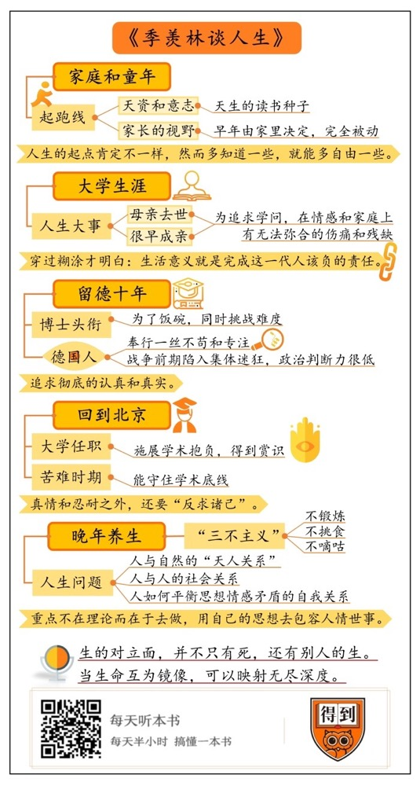

# 《季羡林谈人生》｜贾行家解读

## 关于作者

季羡林，北京大学资深教授，国际著名东方学家、印度学家、梵语语言学家、文学翻译家、教育家。学术研究领域主要有印度古代语言、中屯佛教史、吐火罗文译释、中印文化交流史、比较文学、文艺理论、东方文化、敦煌学、糖史等。

## 关于本书

本书是季羡林晚年的散文随笔代表作。学术大家季羡林先生结合九十多年的生活体验，谈对人生的意义与价值、缘分与命运、做人与处世、容忍、成功、知足、朋友、毁誉、压力、长寿之道、伦理道德等问题的感悟。

## 核心内容

本书思想核心是：季羡林不是国学大师，而是20世纪世界东方学的重镇、印度古学研究的巨擘、梵典翻译的大师、中西交通史的大家。他也想来不追求做“完人”，一直在坦诚地向世界袒露自己真实的思想和人生。在他的98岁人生旁边，开出来了一列什么样的感悟清单。没什么高深道理，只是他奉行的准则：人生的起点肯定不一样，然而多知道一些，就能多自由一些。我们总是要穿过糊涂才能逐渐明白：生活的意义，就是完成这一代人该负担的责任。要做事，就要追求彻底的认真和真实。在其中去确立“人和自然、人和人、人和自我”的关系。与人相处，真情和忍耐之外，要“反求诸己”，想想换成自己，能不能好到哪里去？季羡林谈古印度语言，我们听不太明白，但他说人生时，我们都懂。然而，这些道理要认真彻底去做才行。

## 前言

你好，欢迎你每天听本书，今天我为你解读的这本书叫《季羡林谈人生》。这本书很薄，是季羡林晚年的散文集。不过，我下面要为你讲的内容，还包括了季羡林全集前几卷的日记和回忆录，摞起来是很厚的几大本。目的只有一个：为你讲讲我读到的季羡林，到底是个什么样的人？如果只看他在这本书里对人生的感悟，不太容易知道：这些话是从何而来，又指的是什么？

有人说“名气是所有误解的总和”，这句话用在季羡林身上很合适。在我看来，公众对他的评价，基本上都是错的。

有人说他是国学大师，是大儒。这就是错的，季羡林是学问大家不假，但专业不是中国古代学术。他是国际知名的东方学者，也就是研究印度学、梵语语言学的，这是很冷僻的学科。他早年也是学外国文学、写散文小说起家的，从来不在国学或者新儒家的圈子里。他和另一位著名的东方学者，我为你解读过的《书读完了》的作者金克木不一样，金克木是擅长自学的通人，横跨多个学科，让人眼花缭乱；而季羡林是专精于自己的领域，他的学术成果众多，但都从古印度语言里生发而来，内力深沉精纯。打个不太恰当的比方：金克木像黄药师，季羡林像洪七公。季羡林全集有30卷，几千万字，我这次用的材料主要来自前8卷。后面大多是学术著作，看不太懂了。

还有人说：季羡林是位公共知识分子。这也不准确，他一生的大部分时间，都专注于研究学问。对于知识分子该不该介入社会活动，他一直很困惑，提醒后辈要讲“学术良心”，也就是要严谨治学，守住学者的本分。到晚年，他才逐渐谈人生和社会话题，但也不是公共视角，而是从个人回忆出发，说的既直白又恳切，几乎不套用理论。

至于“国宝”、“泰斗”之类的称呼，季羡林曾经严肃地要求社会为他摘掉这些帽子，还自己“一个自由身”。他本来一直过着冷清的书斋生活，在晚年才突然受到热捧，自嘲说“近年来季羡林走俏”，是“被‘打’成了学术泰斗”。这也没办法，在全社会渴望文化大师的时候，老一辈名家里，只有他硕果仅存，学界地位又高，还当过北大副校长。2009年，98岁的季羡林去世，是一个轰动性新闻，他的学生遗憾地说：整个告别仪式人潮汹涌，像是赶庙会，毫无肃穆可言。

那么，最适合的季羡林的标签是什么呢？说名气来自误解，就是因为我们太习惯用标签来理解别人、定义别人了。下面，我试着用季羡林最推崇的彻底真实态度，给你讲讲他的一生，请你自己体验完整的季羡林。

我把这些内容整理成了一份他的人生清单：左边一列内容，来自他的日记和回忆录。右边一列，大部分是他晚年随笔杂文里做的回顾和反思。如果给这份清单取个名字，可以借用他另一本散文集的书名《我的心是一面镜子》。他在九十岁时还是说：“什么叫人生？我不清楚。我看芸芸众生中，也没有哪个人真清楚。我们的诞生都是被动的。”生的对立面，并不只有死，还有别人的生。当生命互为镜像，可以映射无尽深度。这也是我为你讲这本书的目标：在季羡林的心灵历程里，照出我们自己的样子。

## 第一部分

我讲到这本书里的散文时，就要结合季羡林的自传了。他的自传也是好文章，他有个当之无愧的头衔：当代中国散文大家。大学者都是有性情、有人文关怀的，何况季羡林从大学时代就开始发表散文，前后写了八十年，一共两百多万字，形成了自己的文体风格。这些文章，可以说是学问在人生中的延展。

在我们这份清单的第一行，当然是季羡林的家庭和童年。我们来看他怎么形容：“我1911年8月6日，生于山东省清平县的一个小村庄。当时全中国的经济形势是南方富而山东穷。专就山东论，是东部富而西部穷。我们县在山东西部又是最穷的县，我们村在穷县中是最穷的村，而我们家在全村中又是最穷的家。”说得好像他家是全国最穷的。

其实他家也暴发过，他叔叔中过一次彩票，得了几千两银子。他父亲为耀武扬威，要盖全村最大的砖房，买不到砖，就扬言谁家愿意拆自家房的砖卖给他，他出几十倍的高价。重赏之下，必有勇夫，兄弟俩的这口恶气倒是出了，但我们也看出他们的做事风格了。于是，到季羡林出生时，家里又重返全村最穷的赤贫，一年只能吃到一两次白面。

季羡林是整个家族唯一的男孩，为了将来光大季家门楣，他六岁就离家，被叔叔接到济南去读书。他的成绩一直很好，考进了全省闻名的山大附中，校长是前清状元、有名的书法家王寿彰。这位状元可能从科举获得了灵感，规定：各班级的甲等第一名、各科成绩都在九十五分以上的，要给予额外褒奖。全校只有季羡林达标。那个额外奖励就是王寿彰写的几幅字和扇面，称他为“羡林老弟”。季羡林说，自己的整个高中时代，都为了维持这个虚荣而苦学，连续拿了六个学期第一。

他当时并没有想过深造，家里给他的规划是：报考邮政局，拿一个“铁饭碗”，熬上二十年，当个小官员。他是因为没有通过那次面试，才报考了大学，一下就被清华和北大同时录取了。季羡林说：我不是想当什么学者。只是因为想上大学“镀金”，容易抢到一只饭碗。

这一段故事，给我们一种启示：季羡林是天生的读书种子，这不用说。但他早年的一切都是由家里决定，是完全被动的。我们经常谈论孩子的起跑线，天资和意志力，可以说是第一道起跑线。人生而不平等，从这里就决定了。季羡林在这方面是一等一的。

至于家长的视野，那就是第二道起跑线了。我们可以拿季羡林和钱锺书作个比较，因为有的可比：他俩年纪相仿，前后入学清华外文系。季羡林说：“我们系能出钱锺书、曹禺这样的大师，当然不是一无是处。”钱锺书出身学问世家，父亲钱基博也是著名学者，写过《现代中国文学史》，做过圣约翰大学、清华大学的中文系教授。钱锺书入校时，不光才学过人，而且对学术界有通盘了解，对自己的学者生涯也早有规划。这样的条件，几乎没有第二个人。而季羡林是标准的寒门学子。他此后的道路，早就超出了家里的想象，眼前只有一片漆黑。这在表面上是信息的不同，实际上的区别是：他俩走上学者道路，有着必然和偶然之分；后来，也有自由程度的不同。以后我会选本合适的书，为你说说钱锺书和杨绛夫妇。他们相对季羡林这些同时代学者，总是显得从容自如，就是因为一直拥有更开阔的视野，选择多了一些。我后面还会再说到：早年的环境，影响到了季羡林的个人生活。

接下来，咱们再来看季羡林的第二行人生清单：他的大学生涯。我说他入校时眼前漆黑，不是不尊敬老先生。他有本当年的《清华园日记》就讲到，自己当时没有明确志向，还稀里糊涂地想去读数学系。他有一点很可敬，就是不遮掩自己。有人建议他，作为德高望重的名人，出版这本日记时最好删去一些不雅的话，像“（今天）去看清华对附中女子篮球赛。说实在的，看女人打篮球，其实不是去看篮球，是看大腿。附中女同学大腿倍儿黑，只看半场而返”。季羡林不同意，说自己就是如此，为什么不让人知道？他回忆自己的师长，也是同样的态度，说“中国古话：为尊者讳，为贤者讳。这道理我不是不懂。但为了真理，我不能用撒谎来讳。”

季羡林大学主修德文，但他认为对自己影响最大的两门课是：历史系教授陈寅恪的“佛经翻译文学”和中文系教授朱光潜的“文艺心理学”。他回忆：陈先生上课，任何废话都不说，先在黑板上抄写资料，抄得满满的，然后根据所抄的进行讲解分析，对那些一般人不注意的地方，提出崭新的见解，令学生觉得石破天惊。这种风范，对他产生了一辈子的影响。

大学时代，季羡林经历了两件人生大事。其一是母亲突然去世。他从小有个心愿，是将来赚钱以后，让母亲吃上白面，从此成了泡影。另一件事是作为家族单传的男丁，很早就成了亲，生儿育女，妻子比他大四岁。季羡林虽然没有推翻这段父母之命的婚姻，但也没怎么在家里呆过。他儿子季承说：“我刚出生3个月，他就去了德国。回国时，我都12岁了。他和我母亲的关系，等于是一直分居到死。他的内心当然很丰富，但对这个家庭没有感情。”季承认为：父亲从小寄居叔父家、婚姻中没有爱情等等原因，塑造出一种压抑、封闭而又孤傲的性格。当然，要我看，这是家务事中的一面之词，这种婚姻状况，也是那个年代的常见现象。季羡林能坚持到底，已经算相当正派了。提这一段是因为，季羡林父子间的纠纷，曾是很有名的公案。

季羡林直到晚年一在追悔说：“我千不该万不该离开了母亲。世界上无论什么名誉，什么地位，什么幸福，什么尊荣，都比不上呆在母亲身边。”对于个人家庭问题，他觉得：爱情是人生特定阶段的事，不值得花太多时间，更不能为此牺牲事业。总之，为追求学问，他在情感和家庭上，有无法弥合的伤痛和残缺。

在他的这行经历中，右面那栏“人生感悟”该填点儿什么呢？我觉得可以这么总结：人生总是要从糊涂、从朦胧里求明白。季羡林青年时代的日记，特别爱用一个词：“一塌糊涂”，既形容别人也形容自己。他说：对绝大多数人来说，人生既没有意义，也没有价值，只不过是在昏昏沉沉地追求一点儿享受，没想过自己为什么活。他是从被动到一塌糊涂，然后才在这本书里得出一个道理：人类的前途，在于朝一个共同理想努力。每一代人都有自己的一段路要完成。这像一条链子，每个环节本身微不足道，但这一点儿东西影响了整个链条。如果人生有意义，那就是这种对人类承前启后的责任感；如果人生有价值，那就是去完成自己这一代的任务。

这个观念，在季羡林留学前还没有成型。他当时只是不愿意放弃清华大学交换研究生的机会。家族对他的支持，是觉得这是中了“洋进士”，将来更能“大发特发”。于是，他留下了经济濒临破产的家，在1935年8月、24岁时远渡重洋，前往德国。原计划是留学两年，但谁也没想到，这一去就是十年。

我们再来看他这第三行人生清单。季羡林进的是有几百年历史的哥廷根大学，大数学家高斯曾经是这里的教授。这时，季羡林已经熟悉了学术圈的规则，想在两年里拿到德国的博士，基本上不可能。唯一的取巧办法，是用中国题目作论文。但季羡林的性格，真像他儿子所说，既孤傲又倔强。他说，“我立下大誓：决不写有关中国的博士论文。有的中国留学生在国外讲庄子、老子这些中国学问谋得博士头衔，让洋人大吃一惊，然而回国后讲康德、黑格尔，我不步他们的后尘。”

季羡林还说：我为什么非要一个博士学位呢？许多大学者，比如王国维、梁启超、陈寅恪、鲁迅，都没有博士头衔。可他们是天才，用不着学位。我不是这种人，没有金光闪闪的博士头衔，就会在抢夺饭碗的搏斗里失败。平凡人的心情，就是如此。写这段回忆时，季羡林早就被公众称为“大师”、“国宝”了，但还是有一说一。贫穷的记忆和家庭影响，让他在当时日记里，总是为饭碗问题惴惴不安。

但为了这个博士的含金量，他还是选了最难的梵文和巴利文，整个班上，起初就他一个学生，后来和其他年级合并，跟到最后的，还是只有他一个。梵文到底有多难啊？季羡林当年写道：“梵文真是鬼造的！文法变化极复杂，最要命的是例外，每条规则都有例外，例外之内还有例外，把人弄得如入五里雾中。左看右看，终于不知道应该从什么地方断开一个字，自己断开了，字典上也找不到。恨不能把书撕成粉碎。”他为此患上了失眠，几天几夜不能合眼，骨瘦如柴，你猜他的对策是什么？他写的是：“除了工作，还能作什么？我反正拼上了，你失你的眠，我偏工作。”他选的其他辅修课，也是吐火罗文、阿拉伯文、塞尔维亚-克罗地亚文这些小语种文学，季羡林一共精通十几种语言。他的博士论文是研究一部印度典籍里的动词变化。毕业以后，他留在哥廷根担任教员，听说他要回国，导师难过不已。

为什么他在德国要呆十年呢？咱们算一下时间就知道了：他赶上了二战，交通断绝，回不来了。季羡林说，童年自己只是吃糠咽菜，还能吃饱，真挨饿是在那个“要大炮不要黄油”的德国，这留下个病根：回国后的很多年，无论吃多少，他都感觉不出饱来。

十年的德国生活，留给季羡林一个行为准则：追求彻底的认真和真实。他认为：德国人能在短短一两百年里造就惊人的文化，是因为奉行一丝不苟和专注。有个著名的医学专家，面试学生时，拿出一副猪肝，问这是什么。学生看出来也不敢说啊。教授就给了个不及格，说：“医学工作者一定要看到什么就说什么。连这点勇气都没有，还当什么医生？”哥廷根遭到轰炸时，季羡林看到一个流体力学教授站在操场上，观察炸弹爆炸的气流是怎样摧毁墙壁的，自言自语说：“真是难得！我的试验室装配不起来这样的效果。”

季羡林也看到了德国人的另一面：他们在战争前期陷入了集体迷狂，政治判断力很低。二战期间，几乎没人质疑法西斯，都显得忘乎所以，洋洋自得。每隔半年，报纸和电台就说：某个邻国正在迫害德国人，于是全国沸腾，他们把出兵占领外国叫做“抵抗”。逐渐，大学里只有女生和前线下来的伤兵，教学楼的走廊上，终日回荡着双拐触地的清脆声响。几年后，这个天才辈出的民族，一夜之间沦为了战败国。

季羡林被大家误会成国学大师，也有个原因：他在晚年提出了“三十年河东，三十年河西”的说法，大意是：西方文化在现代出了问题；世界的未来，应该被“天人合一”的中国文化主导。我打算为你说完季羡林这个人之后，再为你解读一本他的东西文化比较。批评者认为，他的观点是出于民族情感，论据不足。我们看他这段经历就知道：不完全是。他亲历了德国的二战，对西方文化有自己的批判。他的道理，值得听一听。

## 第二部分

季羡林在晚年总结，人生问题不过是三大关系：人与自然的“天人关系”，人与人的社会关系，以及人如何平衡思想情感矛盾的自我关系。

1945年8月，季羡林34岁时，从德国回到了北京。这是我们为他划分的第四行人生清单。他当时的想法是不考虑那么多的关系，专注地施展自己的学术抱负。当时北大有个规矩，回国的留学生，无论学历和经历如何，最高只能定副教授。而季羡林创下了最快升任正教授的记录，同时还兼任东方语言系系主任。

有一个原因是：当时的校长胡适非常赏识他。胡适到了台湾时还说：“做学问就该像北大的季羡林。”胡适向来关注佛教思想史，那几年在和辅仁大学校长、宗教史学家陈垣争论一个考据问题：浮屠这个词——就是“救人一命胜造七级浮屠”的那个浮屠，母语是什么？是什么时候传入中国的？这涉及到一部佛经的真伪。他们的争论依据都是中国古代文献，季羡林写了一篇论文，直接从梵文、吐火罗文等古印度文献里考证出：汉语里是先有“浮屠”这个词，这是印度古代的方言；之后才有“佛”这个词，它起源于吐火罗文。季羡林从中推断出：佛教不是直接从印度传到中国，而是由中亚间接传来的。我们知道，这个结论太重要了。

从五十年代起，胡适和陈寅恪被大批判。季羡林是当时国内少数能保持沉默，守住学术底线的学者。那也是他人生里的一段苦难时期。对于这段时期，季羡林有一本《牛棚日记》，非常有名，我就不多介绍了。他在老年时说：自己在57岁的冬天之后，每一天都是多活的。这是什么意思呢？因为那时候，他差一点儿自杀。他事先也是用德国培养起来的严谨态度推理了这件事，他说：原以为离自己很远很远的事，现在出现在眼前。我平静地、清醒地、科学地考虑实现这个决定的手段和步骤，我想得很细致、很周到、很全面。就在他准备夜里翻墙出校门，到圆明园去吞安眠药时，却意外地因为有人觉得他态度不好，被拉去参加批斗了。他说，那晚的经历，让他毕生难忘。

这本书里，他回忆那段经历时，有点儿黑色幽默。说“我是因为态度坏，才捡了一条命”。之后的几年，他成了校园里人人见到都绕着走的人，有个女同事帮他推过一次车，让他感动得热泪盈眶，终生难忘。他后来被平反、任命为副校长时，没有对谁实施过报复，在这本书里，他分析自己的心理历程时说：我是倾向“人性本恶”的，我也知道坏人不会改好。但我能原谅他们中的大部分人。不是我度量大，是由于我反思：假如我处在他们的位置上，我的行动也不见得比别人好。人从本能上说，就是趋吉避凶的。他引《孟子》的话，说这是“反求诸己”。我理解，这不只是对他人宽容，也是在反思中解脱，不让仇恨绑架自己，更不让报复心耽误自己的学术研究。

季羡林不刻意追求长寿，他晚年的养生之道是“三不主义”：不锻炼、不挑食、不嘀咕。“不嘀咕”就是不过度关注健康，不纠结生死问题，他最喜欢陶渊明谈论生死的几句诗：“纵浪大化中，不喜亦不惧。应尽便须尽，无复独多虑。”八十岁以后，他每天清早四点起床工作，连续完成了《糖史》等几部开创性学术大作。

于是，我们在晚年这最后一行人生清单里看到了这样的一个季羡林：他的生活像清教徒一样简单，到老还穿着从德国带回来的雨衣，在被年轻人夸时髦时，他才发现，原来时尚潮流是五十年一轮回。他在校园里走，被新生误认为是老校工，让他照看行李，他也微笑着答应。他表面上安静严肃，内心却是滚烫的。他总结自己喜欢的性格是：“骨头硬，心肠软；怀真情，讲真话；不是丝毫不考虑个人利益，而是多为别人考虑；关键在一个‘真’字，要做性情中人”。

对于人和自然、人和人、人和自我这三个关系，他完成了最后的思考。他说，哲学家对这些问题的回答没有一样的，也捏不到一块儿去。重点不在理论，而在于去做，用自己的思想去包容人情世事。他自己的三条回答，都是平常话：对于人和自然：人要把自然看成伙伴，征服的姿态一定会有恶果。对于人和人：尊重社会的准则秩序，对善良之人报以真情和忍耐。对于自己：努力去除情感中的杂念。他在90岁时说：我是个呆板保守的人，工作就是爬格子。我只能保证我写出来的东西没有假冒伪劣。读了之后，能让人爱国，爱家乡，爱人类，爱自然，爱儿童，爱一切美好的东西。我活得太累了，但休息是不可能的，只能向前走，向前走……

## 总结

那么，我们最后来一起看看，在季羡林的98岁人生旁边，开出来了一列什么样的感悟清单。确实没什么高深道理，只是他奉行的准则：人生的起点肯定不一样，然而多知道一些，就能多自由一些。我们总是要穿过糊涂才能逐渐明白：生活的意义，就是完成这一代人该负担的责任。要做事，就要追求彻底的认真和真实。在其中去确立“人和自然、人和人、人和自我”的关系。与人相处，真情和忍耐之外，要“反求诸己”，想想换成自己，能不能好到哪里去？季羡林谈古印度语言，我们听不太明白，但他说人生时，我们都懂。然而，这些道理要认真彻底去做才行。说了这么多，对于该怎么评价他，你一定有了自己的答案。

季羡林说，如果真有个人，人人都说他好，此人一定是极端圆滑的人。他拒绝了社会给他的美誉，除了性格朴实、较真，也是种智慧。追逐虚名的人，大概没怎么想过：德不配位，名过其实，实在也是灾难。人的才德和社会地位之间，需要大致平衡。名誉地位太低，容易变得愤世嫉俗，性格乖张。但太高，且不说会成为众矢之的，心理也会逐渐变得既极度自大又极度自卑，越来越不正常。一般来说，社会地位稍低于真才实学，个人欲望低于实际能力，是最适合保持自在平和的。人们觉得谦虚和低调是明智之举，原因就在这里。说起来，又何必追求不了解自己的人来夸自己呢？他们也夸不到点儿上啊。

撰稿：贾行家

转述：贾行家

脑图：刘艳导图工坊