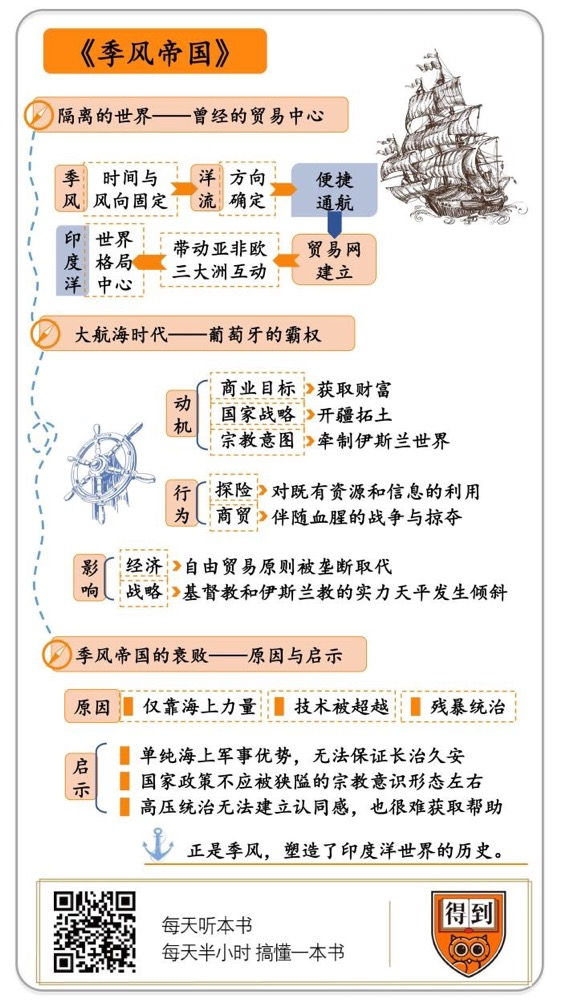

# 《季风帝国》| 曲飞工作室解读

## 关于作者

本书的作者理查德·霍尔是英国的历史作家和记者，他的人生经历非常丰富，曾在英国皇家海军服役，还曾经作为记者，在非洲工作、生活多年。

## 关于本书

本书重新展现了印度洋地区的文明，以及在西方入侵者的掌控下它逐渐衰亡的历史。作者着重讲述了从16 世纪起，欧洲人的出现如何不可逆转地改变了印度洋沿岸地区人们的生活：繁盛的王国被征服，以往的宗教与种族关系陷入混乱；而且，随着西方资本主义的出现，古代的贸易模式很快就灭绝了。本书从一个细微而无阻碍的视角重现了作者对于异域文化的理解。

## 核心内容

这本讲述印度洋的专著，全景式地呈现了环印度洋地区近一千年来的历史。书名中的“季风”是北印度洋地区标志性的气候特征，这种周期性的气候使印度洋的风向、水流都很有规律性，从而方便了周边各地区的航海交流，可以说正是季风，塑造了印度洋世界的历史。本书可以帮你修正很多似是而非的固有认识，比如，它能让你重新认识印度洋的历史地位、重新认识大航海时代等等。

## 前言

你好，欢迎每天听本书。本期为你解读的书是《季风帝国：印度洋及其入侵者的历史》。

本书的作者理查德·霍尔是英国的历史作家和记者，他的人生经历非常丰富，曾在英国皇家海军服役，还曾经作为记者，在非洲工作、生活多年。他说自己一生中差不多四分之一的时间都是在印度洋边上度过的，所以专门写下这本讲述印度洋的专著，用六百多页的篇幅，全景式地呈现了环印度洋地区近一千年来的历史，堪称这个领域难得的佳作。

这本书的名字之所以叫《季风帝国》，是因为季风是北印度洋地区标志性的气候特征，可以说正是季风，塑造了印度洋世界的历史。

那这段历史，能带给我们什么收获呢？我想，它能够填补我们的很多知识空白，帮我们修订很多似是而非的固有认识，概括起来大致有这么三个方面：

第一，它能让你重新认识印度洋。印度洋地区在今天的世界政治格局中，地位好像比较边缘，但你能否想象，曾经，在欧洲人到来之前，这里堪称“世界的中心”？这本书的一个价值就是带你认识这段不太为人所熟知的印度洋历史。

第二，它还能让你重新认识世界历史上一个划时代的重大事件：大航海。比如欧洲人航海，就只是为了经商赚钱吗？大航海真的是促进交流、传播文明，让世界变得更进步了吗？除此之外，大航海还对世界历史产生了哪些影响？

第三，葡萄牙人建立的遍布印度洋的殖民帝国，为什么最后会瓦解？从中我们能看到哪些启示？

下面我就围绕这三个方面，分三部分，来给你讲讲《季风帝国》这本书。

## 第一部分

第一部分，我们先来了解一下，欧洲人到来之前的印度洋世界，到底是什么样的。

印度洋处在几块大陆之间，西面是非洲；西北是阿拉伯半岛；东北是南亚次大陆，也就是印度半岛，包括今天的印度、巴基斯坦、孟加拉国等等；东面是中南半岛以及印度尼西亚；南面，就是南极了。

看起来这些地方被大洋隔绝，但其实除了南极之外，其他各个地区在古代就建立起了很频繁的交往。那么在那个技术落后的年代，他们是怎么突破大洋阻隔的呢？这就要说到印度洋地区一个标志性的气候特征了，也就是本书书名里的“季风”。

所谓季风，就是季节性的风，一般到了什么季节就会刮什么风，全球都这样。而在印度洋北部，季风的时间和风向都特别固定，每年的10月到第二年3、4月，刮东北风；5月到9月，刮西南风，非常准时。风向也会影响北印度洋洋流的方向，在东北风季节，海水向西南方流动；而西南风季节，海水向东北方向流动。

在风帆时代，掌握了这个气候规律，那在北印度洋上就可以畅行无阻了：东北风盛行的季节，商船从印度或东南亚启航，向阿拉伯半岛和非洲东海岸行驶，一路顺风顺水；西南风季节正好反过来，从东非和西亚地区顺流向东，很方便就到达了印度和东南亚。

到了公元10世纪以后，随着航海技术的进步，印度洋周边各个地区的彼此联系也就更紧密和频繁了。书里的一个例子可以说明这种交流的活跃程度：14世纪有位著名的阿拉伯旅行家伊本·白图泰，他生在非洲西北部的摩洛哥，曾经乘船横渡印度洋，游历了波斯、印度，还到过中国。而最令人吃惊的是，他在福建还遇到了一位摩洛哥老乡，在当地经商。可以想象，如果不是有相当的基数，这种超小概率事件是很难发生的。可见，有多少没有被历史记下名字的人，借助季风和印度洋的航线来往于世界各地。

如果把印度洋世界看成一张网的话，那么这个网的中心连接点就在印度半岛，因为它的地理位置，到西亚、非洲、东南亚、中国都很方便。所以，当时世界上最紧俏的商品，像东南亚的香料，中国的丝绸、瓷器、茶叶，来自西亚地区的纺织品和工艺品，来自非洲的黄金、象牙，还有作为劳动力的奴隶，再加上印度出产的棉花、珠宝，这些大宗的商贸活动都在印度交汇。

而且难得的是，当时印度洋世界奉行的理念是自由通航、自由贸易，并不会受宗教之类因素的影响，比如在印度西南沿海一个叫卡利卡特的著名城市，是14-15世纪印度洋的商贸中心。卡利卡特的统治者虽然信奉印度教，但这座城市里有很多穆斯林和犹太商人，大家基本都能和平相处，这种包容的氛围在当时的欧洲是很难想象的。

卡利卡特在中国史书上被称为“古里”，郑和七次下西洋每回都要来到这儿，而最终郑和也是在这里去世的。这也让我们看到，贸易往来，除了能产生巨量的财富，还能带动政治和文化交流。

当时的印度洋世界，欧洲人其实也是参与者之一，只不过是最不起眼的那一个。欧洲人通过阿拉伯中间商，每年从印度洋地区进口香料。而这点贸易份额对印度洋地区的贸易总量来说，是不值一提的。就像本书作者说的，如果当时印度洋周边的各民族了解欧洲的情况，他们会惊诧于欧洲的贫穷落后。

欧洲人习惯把地中海看成是大航海时代之前的世界中心，因为地中海的航线可以让周边各地进行贸易和文化交流。所以这个眼光看来，印度洋不就是一个放大了N倍的地中海吗？当时世界上的几大文明区都通过印度洋相互连接，无论从贸易的规模，还是从文化交流的广度上来比较，印度洋的体量都远远大于地中海。

所以，在大航海时代之前，谁才更有资格被称为“世界的中心”呢？我想答案是显而易见的。

好，上面说的就是大航海时代之前，印度洋世界的真实情况。我们可以这样总结：印度洋周边的各地区虽然相隔遥远，但是能借助季风很便捷地通航，这就形成了一张发达的贸易网，带动了亚非欧三大洲的互动。所以说在当时的世界格局中，印度洋是处在事实上的中心地位的。

## 第二部分

作者在写作本书时，为我们刚才讲的这部分内容，取了个标题叫“隔离的世界”。但通过上面的介绍，我们可以说，这完全是欧洲人的视角，并不是印度洋真的与世隔绝，而是欧洲人被隔离在这个世界的边缘地带。而接下来，在15-16世纪，欧洲开始了大航海时代，欧洲人闯入这个世界，印度洋的游戏规则就被改写了，古老的自由通航与贸易原则被打破，印度洋变成了欧洲强权轮番把持的殖民帝国。

所以在第二部分，我就带你通过还原这段历史，来重新认识一下大航海时代。

为什么说是重新认识呢？大航海是欧洲从中世纪迈向近代的重要一步，关于这段历史，传统的描述是这样的：在公元15世纪，欧洲人为了寻找新的贸易路线，深入未知的海域，历经各种险阻，最后，西班牙人发现了美洲新大陆，葡萄牙人发现了通往印度的新航线。同时欧洲人也传播了文明，建立起了全球化体系最早的雏形。

你看，这么说来，欧洲人航海的动机，就是商业利益；他们的行为，就是各种不畏艰险的探索；产生的影响呢，就是促进了交流和商贸繁荣，让世界变得更文明、更进步。反正大致就是这么一个叙述模式，非常简单，也非常正面。

这样的描述不能说不对，但是它把历史给简化了，掩盖了这段历史的很多侧面：比如说，欧洲人航海就只是为了商业目的吗？他们真的是凭借一己之力解锁了印度洋这个前所未见的世界吗？还有关于他们的评价，他们真的是这个传播先进文明的使者吗？

下面我就结合本书的内容带你从大航海的动机、行为和影响这三个方面，来重新认识一下大航海时代。

我们先说动机，欧洲最早开始航海的是葡萄牙，那他们航海的目的仅仅是“下海赚钱”吗？

当然商业目的可以说是首要的，但葡萄牙人的航海还有国家战略层面的目的。葡萄牙人的航海，可以看作是伊比利亚复地运动的延续。

伊比利亚就是西班牙和葡萄牙所在的那个半岛，公元8世纪初，来自北非的穆斯林民族摩尔人，渡海征服了伊比利亚半岛，几个信奉基督教的小政权，被挤压到半岛西北边缘地带。从那时起，他们就一直谋划收复失地，这就是伊比利亚复地运动。13世纪，葡萄牙最先光复，但是土地还是太狭小，没有足够的纵深空间来保障安全，所以葡萄牙的国家战略就是，要到海外开拓新的领地。

而且，经过几百年复地运动的斗争，葡萄牙人对伊斯兰世界的敌视情绪已经很深，所以他们的航海其实还带着一个很有针对性的宗教和战略意图：绕到伊斯兰世界的身后，牵制，甚至打击他们。

所以说，当葡萄牙人进入印度洋世界的时候，他们不单单是我们传统上认为的那种探险者或者生意人，同时还带着很明确、很有针对性的战略使命。这一点，是一般的书上很少提到的。只有明白了这个背景，才能理解他们在印度洋地区和东方的所作所为。

下面我们再说说葡萄牙人进入印度洋之后，都干了些什么。

1488年，葡萄牙著名航海家迪亚士发现了非洲大陆的尽头：好望角，这下总算找到了从大西洋到印度洋的入口。

1497年，另一位葡萄牙航海家瓦斯科·达伽马奉国王之命，率领三艘全副武装的商船，绕过好望角，向印度进发。

当时印度洋周边大多是伊斯兰教国家，达伽马和他们彼此敌视，但也有人把葡萄牙人的到来，看成翻身的机会。比如位于今天肯尼亚的港口城市马林迪，他们就想跟葡萄牙人合作，借助他们的力量来对付竞争对手。等到1498年4月，达伽马的船队来到马林迪时，当地统治者殷勤接待，还提供了一个达伽马急需的专业人才：阿拉伯老水手伊本·马吉德。

这个阿拉伯老水手大半辈子都在印度洋上航行，对风向、洋流这些情况了如指掌。他告诉达伽马说，你们不要顺着海岸线向北行船，而应该向东北，驶向大洋深处。他为什么这样建议呢？因为当时已经是4月了，还记得前面说的北印度洋地区季风的特征吗？印度洋上就要刮西南风了。

果然达伽马4月24日离开马林迪，朝东北方行驶，由于搭上了季风的便车，不出一个月就到达了印度。

那说到这儿，我们再看“达伽马发现新航路”这件事儿，固然主要是他的成就，但同时也离不开两个条件。首先是，印度洋地区已经是一个成熟的贸易区了，有完备的口岸、航线和贸易网络；第二，就是印度洋地区居民的经验分享，如果没有老水手的指点，葡萄牙人怎么敢贸然把船驶向未知的大洋深处呢？所以，与其说是达伽马带队发现了一条“新”航路，不如说是他们在当地老水手的指点下，走上了那条早已存在的印度洋季风航路。

好，再说回达伽马，他在印度的停泊之处，就是我们前面说过的卡利卡特。卡利卡特的统治者叫作“扎莫林”，这不是名字，而是称号，意思是“海洋之王”。

双方的会面起初很愉快，但扎莫林在阿拉伯商人的鼓动下软禁了达伽马，虽然很快又释放了他，并且赔偿了大量的香料来道歉，但是为时已晚，这个仇已经结下了。

当葡萄牙人准备离开的时候，阿拉伯人再次劝扎莫林把他们干掉，因为现在葡萄牙人已经知道了来印度的路线，一旦他们回到欧洲，很快就会有更强大的欧洲舰队来到。

但是扎莫林没有同意，因为他认为这样会违背印度洋地区长久以来的自由贸易原则。写到这儿，作者评价说：“如果扎莫林采纳了阿拉伯人的建议，那么印度洋周边各民族的悲惨命运也会晚一点才来。”然而，这个一念之仁，最终就导致了传统的印度洋世界被彻底颠覆。

果然，1499年达伽马的船队返回里斯本，虽然船员死了一半，船也只剩下两艘，但葡萄牙人还是不虚此行，因为印度洋的秘密已经被揭开。葡萄牙国王组织了一支规模大得多的舰队，命令他们再次前往印度。这一回的目的就不再是地理探索，而是在印度建立永久性的贸易据点，准备彻底征服印度洋。

由于实力今非昔比了，这一次的葡萄牙舰队在印度洋上，那就是横扫而过，一路上遇到不够顺从的港口就大肆抢掠，遇到伊斯兰国家的船只就杀人越货。再次来到卡利卡特的时候，很快用武力逼迫扎莫林跟他们签订独家的贸易协定，驱逐其他一切竞争对手。

这样，葡萄牙人在南非、东非和印度，都取得了立足点，这就保证了他们可以控制印度洋的贸易航线。他们规定在印度洋海域活动的各国船只，必须持有葡萄牙颁发的通行证才可以航行。这样一来，印度洋世界的游戏规则就被葡萄牙人改写了，原本的自由贸易原则就被葡萄牙人的垄断给取代了。

这件事产生的影响，不光体现在经济层面，更让基督教世界和伊斯兰世界的实力天平发生了倾斜。这也是大航海时代若干重大影响当中，比较容易被忽视的一个方面。下面我们就来展开说说。

你可以想一下，葡萄牙人进入印度洋，最着急的人是谁呢？不是印度人，而是埃及的马穆鲁克王朝，还有威尼斯人。因为15世纪，东非印度洋沿岸的各个贸易港口，都在埃及马穆鲁克王朝的控制和保护之下。葡萄牙人来了之后，这些港口就派人到开罗去找马穆鲁克王朝的苏丹诉苦，请他驱逐葡萄牙人。

而威尼斯是地中海首屈一指的商业城邦，虽然威尼斯人也是基督徒，但是考虑问题特别现实，对于跟穆斯林做生意这件事儿，毫无心理障碍。他们通过跟埃及的合作，收购来自东方的香料，再转手卖回欧洲，这一项贸易的利润，就让威尼斯富甲一方。而现在葡萄牙人进入印度洋，就意味着他们可以直接从东方的香料货源处拿货。威尼斯人这个中间商没得赚了，这就触动了他们的根本利益。于是就出现了一个非常戏剧性的情况：威尼斯人主动找到埃及苏丹，提出跟他联手对付葡萄牙人。

于是，埃及出人，威尼斯出船、出钱，再加上印度西部一些伊斯兰教城邦，大家一起组建了一支庞大的舰队，有大小船近200艘，搭载兵力超过2万。然而跟葡萄牙人一交手，军事水平上跨时代的差距，立刻就显现出来了。

1509年，葡萄牙的印度总督阿尔梅达率领18艘战舰，在印度西部港口第乌附近海域，跟埃及人的联合舰队开战。葡萄牙人的船都是专为海上作战设计的，装配着多层甲板，侧舷上有成排的火炮，是真正的船坚炮利；而威尼斯人提供的船都是地中海式的帆桨并用船，侧舷上要留出船桨的位置，没法安置火炮，只在船头和船尾装了炮，印度人的战船更是只配备了弓箭。这一对比，高下立判，埃及人和印度人的联军很快被葡萄牙人的炮火摧毁。

这一战之后，葡萄牙人确立了在印度沿海的霸权。他们夸耀说，第乌海战拯救了欧洲，因为要不是他们凭借这场胜利控制了印度洋，从海上威胁着奥斯曼帝国的后方，那土耳其人可能会征服整个中东到印度，获得巨大的人力、财力资源，那样欧洲就再也没有跟他们抗衡的可能了。

好，以上我们依次讲了大航海时代三个有别于固有印象的侧面，它们分别是大航海的目的、行为和影响。目的方面，欧洲人寻找新航线，并不仅仅是出于商业目的，还有国家战略层面的考量；行为方面，他们的探险行为，离不开对印度洋世界既有资源和信息的利用，他们的商贸行为，也伴随着非常血腥的战争与掠夺；影响方面，大航海的影响，除了体现在经济层面，也深远地关乎基督教世界和伊斯兰世界之间的战略态势。

## 第三部分

在16世纪，葡萄牙人通过控制非洲和印度的贸易港口，并且借助季风的便利条件，成了印度洋的主宰，把这个一直以来相对平静、自由的贸易区，变成了由他们统治的“季风帝国”。那么这个帝国后来又是怎么衰败的，我们从中能看到哪些启示呢？本期的最后一个部分，我们来谈谈这个话题。

葡萄牙人统治的季风帝国之所以会衰败，首要原因是他们在非洲和印度的统治，是以沿海港口的堡垒为据点，很少深入内陆，也就是说他们完全依靠着海上力量来维持印度洋的统治。

这就导致一个问题，葡萄牙本身国土面积就很狭小，人力资源是它的短板，如果没法让它的统治在殖民地扎根的话，他们就没法吸收当地的人力资源来作为补充，只能等待本土的输血。而到16世纪末，葡萄牙本土又出事了。1581年，葡萄牙被它的邻国西班牙吞并，东方殖民地断了跟本土的联系，生存空间又恶化了。

葡萄牙人统治的季风帝国衰败还有一个原因是，葡萄牙人的技术被人超越了。在欧洲，荷兰人改良了新式的远洋航船，运载量和火力都超过了葡萄牙和西班牙；而在亚洲，处在葡萄牙人殖民统治下的阿曼人，也渐渐学会了葡萄牙的航海和造船技术。17世纪中叶，阿曼亚里巴王朝崛起，把葡萄牙人赶出了阿拉伯半岛，更进一步夺取了葡萄牙人在东非的一个个贸易据点。

那葡萄牙人的技术为什么会被赶超呢？这一点特别值得关注。前面我们提到过，葡萄牙人有非常强烈的宗教情结，这有助于他们保持民族的凝聚力，但同时也有一个副作用，一旦这种宗教热情过头了，就会产生偏执，包容不了任何跟他们信仰不同的人和事，最终走向固步自封。

其实，在大航海时代之初，葡萄牙人的航海科研机构还允许很多犹太人、摩尔人、阿拉伯人存在，葡萄牙的航海技术，很多都是这些异族、异教的工匠和学者帮助他们完成的。而后来葡萄牙和西班牙都出于宗教原因，驱逐迫害过异教徒，这些人被赶走，就等于他们的技术层面出现了很大的空缺。

季风帝国衰败的第三个原因是，葡萄牙人的残暴统治，他们平时横征暴敛，在战时更是动不动就屠城、虐杀俘虏。所以在非洲沿岸和印度，除了早期跟他们建立友好关系的几个城邦，其他地区的人都非常痛恨葡萄牙人。所以葡萄牙人没有向内陆发展，一方面是满足于自己的海上力量，同时，也是因为知道自己的人缘不太好。

17世纪，正当阿曼人一点点从葡萄牙人手里夺取东非的同时，英国人也已经来到了印度洋，他们先后打败葡萄牙人和荷兰人，接手了他们建立的印度洋贸易帝国，而葡萄牙在非洲东海岸的势力范围，就退缩到了他们最早到达的莫桑比克一带。

好，以上是我们总结的葡萄牙人的印度洋帝国衰落的三个原因，从中我们也能看出三个启示：

第一，单纯的海上军事优势，无法保证一个帝国的长治久安；第二， 当一个国家的政策被狭隘的宗教意识形态所左右，那这个国家的前途就很难乐观；第三，一味的高压统治，无法在被统治的群体当中建立认同感，也就很难真正把当地的资源收为己助。

再说深一层，这三方面其实说的是一回事儿，它们是一条互为因果的逻辑链。因为葡萄牙人碍于宗教偏见，无法在统治的地区真正建立根基，让自己融入当地，所以他们就只能把统治建立在海岸要塞和战舰上。而他们的统治方式，可选择的余地就非常少了，只能采取高压的方式，而高压会激起被统治者的记恨，一旦军事技术差距被抹平，那么被统治者必然就要用武力进行反抗了。

这也就是葡萄牙人统治的季风帝国衰败的原因。

这些原因，不是我们今天用“事后诸葛亮”的眼光总结出来的，而是在当时就被英国人看到了。所以，当英国人在印度洋地区取代葡萄牙人，建立“第二代”季风帝国的时候，他们很有针对性地改弦更张，把葡萄牙人犯过的错一一修正过来了。

比如，虽然英国人也传教，但是他们就不像葡萄牙人那么偏执，他们对印度的宗教信仰，给予相当宽松的自由。再比如，英国对殖民地虽然也有残酷的镇压，但是他们也有相配套的怀柔手段，像在印度建立全印度人班底的基层管理机构、招募印度人当兵入伍等等。所以，英国人在印度洋地区的“季风帝国2.0版本”，要比葡萄牙人成功得多。

不过到了二战之后，殖民地独立已经是大势所趋。印度、非洲等列强曾经的殖民地纷纷独立，印度洋世界就出现了很多新兴的国家，特别是印度洋西岸的非洲地区，正在从一个沉默的看客，变成印度洋世界越来越重要的参与者。作者把这称为“历史的季风又重新吹起来了”。

## 总结

好，上面我们跟随着《季风帝国》这本书，快速浏览了印度洋地区一千多年来的历史。

第一部分，我们讲了印度洋世界能够借助季风实现便捷通航，形成了发达的贸易网，带动了亚非欧三大洲的互动。所以在大航海之前的世界格局中，印度洋是处在事实上的中心地位的。

第二部分，我们从大航海的动机、行为和影响三个方面，依次讲了大航海时代三个有别于固有印象的侧面，带你重新认识了大航海时代。

第三部分，我们总结出了葡萄牙人统治的季风帝国，之所以会衰落的三个原因，以及带给我们的启示。

最后我想再补充一点，谈谈现在中国跟印度洋世界的关系。世界上最主要的石油产区，就集中在印度洋沿岸，所以今天印度洋对世界经济来说，仍然是一个巨大的动力区，对中国来说更是这样，这也是为什么从印度洋通向中国的马六甲海峡，以及建设中的巴基斯坦瓜达尔港对我们如此重要。虽然进入蒸汽动力时代以来，季风对海上航行的重要性已经减弱了很多，但是季风带给印度洋地区的独特气质：联通、自由、顺势而为，仍然堪称有益的启发。

撰稿：曲飞工作室

脑图：摩西脑图工作室

转述：徐惟杰