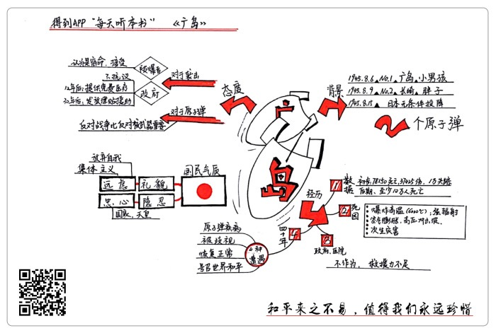

# 《广岛》| 张晓琳解读

## 关于作者

约翰·赫西是美国的知名记者和作家，曾经获得普利策奖。他出生在中国天津，10岁回到美国。1939年，赫西被《时代》杂志派到重庆，此后，他一直都在二战的主要战场进行采访报道。他的报道风格对美国的新闻报道产生了很大影响，耶鲁大学设立了“约翰·赫西奖”，来表彰学生的新闻作品。   

## 关于本书

《广岛》这本书基于作者对广岛原子弹爆炸做的两次调查，详细记录了在广岛原子弹爆炸中，六个普通人的真实经历，讲述他们在爆炸当天的身体和心理感受、爆炸后他们的所见所闻，还有他们后来四十年的人生轨迹，清楚地展现了那一代人的创伤记忆，引起对核武器和战争的思考，被评为“美国20世纪最杰出的新闻作品”。   

## 核心内容

原子弹爆炸给广岛民众的生理、心理都带来了很大的伤害，这种影响伴随他们一生。而日本人放弃自我的“远虑”精神，让他们认为遭到原子弹袭击是战争的宿命。很多广岛民众认为，更重要的是反对战争，而不仅仅是反对核武器。  

## 前言

你好，欢迎每天听本书。

今天为你解读的是《广岛》。这是第一本调查日本广岛原子弹爆炸的非虚构类作品。这本书的中文版大约10万字，我会用25分钟左右的时间，为你讲述书中精髓：日本广岛原子弹爆炸对普通民众产生了怎样的影响？如何看待战争和原子弹的道德问题？

提到原子弹，很多人第一时间就会想到日本。我们知道，1945年8月6日这天早上，美国在广岛投下第一枚原子弹，三天后，又在长崎投下了第二枚原子弹。这两枚原子弹，一个叫做“小男孩”，一个叫“胖子”，听上去一点都没有攻击性，但是，却在一瞬间把广岛和长崎变成了废墟。仅仅在爆炸当天，这两个城市死亡的人数，加起来大概就有15万，受伤的人数更是多得没法计算。长崎被袭击后的第六天，也就是8月15日，日本天皇宣布无条件投降。可以说，日本政府投降，是这两次原子弹爆炸直接促成的。

二战结束后，美国接管了日本，这个国家就突然变成了美国人迫切想要了解的对象。而经历过原子弹爆炸的民众，他们有世界上最特殊的经历，可是却没有人知道他们的故事。1946年，世界第一次知道了他们的经历，就是因为《广岛》这本书。

《广岛》这本书记录了在广岛原子弹爆炸中，六个普通人的真实经历，我们先来认识一下他们，这六个人分别是：女职员佐佐木敏子、家庭主妇中村初代、德国神父克莱因佐格、医生藤井正和、牧师谷本清和医生佐佐木辉文。对于世界上大部分人来说，原子弹可能就是一个武器的名字，毕竟离自己太遥远了。可是，对于广岛的那些亲身经历者来说，原子弹爆炸的影响是非常具体的，他们一生都摆脱不了这种影响。书中详细记录了这六个普通人的经历，交叉叙述他们在爆炸当天的身体和心理感受，爆炸后他们的所见所闻，还有他们后来四十年的人生轨迹。

这本书被评为“美国20世纪最杰出的新闻作品”，影响非常大。作者的文字始终都保持着清晰、冷静、克制，书中内容画面感很强，阅读时像在看一场电影，能使人清楚感受到那一代人的创伤记忆，引起对核武器和战争的思考。书中的记录这么详细、生动，是因为作者约翰·赫西，对广岛原子弹爆炸做了两次调查。第一次在1946年，也就是事件发生的第二年，赫西深度采访了六个原子弹爆炸亲历者，美国知名杂志《纽约客》用整期的版面刊登了赫西的文章，当天就卖出了30万份，引爆了美国舆论。第二次是广岛原子弹爆炸四十年后的1985年，赫西对这六个人进行了回访。

现在我们来了解一下这本书的作者约翰·赫西。赫西是美国的知名记者，曾获得过普利策奖。他其实算是半个中国人，他在天津出生，最先学会说的语言不是英语，而是汉语，10岁时才回到美国，后来成为了一名记者。1939年，赫西被《时代》杂志派到重庆，报道中日战争。后来，赫西一直都在二战的主要战场进行采访，西西里、莫斯科、东京，他都去过。为他赢得普利策奖的小说《钟归阿达诺》，就是以西西里战役为背景的。赫西很懂得用写小说的手法写新闻报道，场景、心理和细节描写特别丰富，所以他的作品感染力很强。《广岛》这本书就是很好的代表。

好了，介绍完这本书的基本情况和作者概况，那么下面，我就从三个方面来为你讲述这本书的精华：第一，原子弹爆炸使广岛民众经历了什么；第二，日本人有怎样的国民气质；第三，日本人对原子弹爆炸的态度。

## 第一部分

我们先来说第一个内容，原子弹爆炸使广岛民众经历了什么？

我们来看一组数据。广岛当时的人口不到25万，原子弹爆炸后，统计学家们初步统计，有78150人死亡，37425人受伤，还有一万多人失踪。这是美国采用的官方数据。过了没多久，人们在废墟下挖出了更多尸体，统计学家们这才开始承认死亡人数至少有十万。

任何灾难发生，我们最关注的就是伤亡数字，总觉得，伤亡多，说明灾情严重，伤亡少，就说明不严重。可是，数字是冷冰冰的，经历原子弹爆炸的，却是一个个活生生的人。对广岛的每个人来说，不管是原子弹爆炸后的避难和救援过程，还是接下来四十年间的遭遇，都非常痛苦和漫长。下面，我将从爆炸后不久，和后来的四十年间，这两个阶段，向你介绍广岛民众的经历。

首先，我们来了解一下原子弹爆炸后不久，广岛民众是怎样避难和救援的？

我们知道，原子弹的原理是，利用核裂变反应产生爆炸，爆炸时会释放出巨大的能量。投放在广岛的这枚原子弹“小男孩”，它爆炸时产生的能量，相当于14000吨TNT炸药，有很多人在爆炸发生瞬间当场死亡。其中一个原因是爆炸瞬间的温度非常高，地面的中心温度高达6000摄氏度，相当于太阳的表面温度，空气受到高温的加热和压缩，急速膨胀，产生高压冲击波，这样的毁灭性可想而知。还有一个原因是，原子弹爆炸时形成火球，会发出很强的光辐射，核裂变反应还产生各种射线和放射性物质碎片，这些射线会破坏人体细胞，辐射量太大的时候，人在短时间内就会死亡。统计学家算出，大概有四分之一的死者直接死于爆炸造成的烧伤，还有四分之一死于核辐射。

有些广岛民众比较幸运，逃过了原子弹爆炸时的那一劫，只是受了伤，爆炸发生后，这些幸存者纷纷跑出门避难。可是，有一些人是在避难的时候死亡的。我们刚才提到，原子弹爆炸时，产生高压冲击波，还产生高温和辐射。许多广岛民众被烧伤，伤势严重的血肉模糊、皮肤脱落，甚至有些防空兵的眼睛都被烧掉了。在避难时，有些民众因为伤势过重死去了。还有一些民众，身上没有明显的外伤，可是一夜之后，突然就死了，这是因为吸收了太多辐射造成的。还有一个情况是，爆炸带来了次生灾害。广岛市区里很多地方都燃起了大火，尘土中升起一股股烟柱，防空洞附近的南瓜甚至都被烤熟了。火还借着风不断向周围蔓延，烧到了民众避难的浅野公园，两个小时后才被扑灭。大火之后开始下雨，雨又带来了强旋风，树木、房屋碎片和避难民众，都被卷进了河里。次生灾害使更多人死亡和受伤，人们变得更加恐慌。

好了，我们现在知道，有一些在爆炸时幸存下来的人也在避难时死亡，城里还发生了次生灾害。而救援和避难几乎是同时进行的，在这么糟糕的情况下，广岛的救援也很不顺利。医生佐佐木辉文戴着借来的眼镜，在医院里连续工作了三天三夜，只睡了一个小时。他帮伤者缠绷带、涂药水，累到虚脱。病人在医院里成百上千地死去，尸体却没人处理。女职员佐佐木敏子腿被压断了，在大棚下躺了两天两夜，一直没有等到治疗。你可能会问：为什么医院的救援力量这么弱？这是因为，广岛大约有150名医生，65名在爆炸时死亡，活下来的大部分人也受了伤，整个城市93%的护士都已经死亡或者因为重伤没办法工作，医院很多设备也被毁掉了。很多人没有得到及时的专业救援，只能靠其他民众帮忙。

书中记录的六个人中，牧师谷本清和德国神父克莱因佐格，就不断地跑来跑去，给伤者打水喝，把他们运送到安全的地方。也就是说，爆炸发生后，广岛的救援主要是民众之间的互助和少数医生的治疗，救援力量比较弱。

你可能会问了，日本的政府和军队就不管他们吗？在当时的救援中，日本政府和军队确实是缺位的。广岛的军队曾经承诺海军医疗队救援船马上到，没想到竟是一张空头支票。当时德国战败，日军在战场上被中国军队牵制，美国和苏联还不断施加压力，日本政府怕引起全国恐慌，军队士气下降，所以爆炸后，日本政府基本上是不作为的，不仅救援不到位，还一直对这次袭击含糊其辞。直到爆炸一个星期以后，“原子弹”这个词才传到广岛，但因为相关的报道非常少，广岛的民众都理解不了这个词的意思。

在提起经历过原子弹爆炸的人时，日本人常常会回避“幸存者”这个称呼，用“被爆者”，也就是“被爆炸影响的人”，来称呼他们。因为他们认为，“幸存者”这个词强调的是活着的人，对逝去的人有所怠慢。

那么，我们现在就来了解一下，这些“被爆者”在爆炸后四十年间的遭遇。

把书中介绍的六个人作为代表来看，“被爆者”后来的生活基本上有四种遭遇：第一，患上原子弹疾病；第二，被歧视；第三，生活顺利走上正轨；第四，致力于号召世界和平。

我们先来说第一种遭遇，患上原子弹疾病。无论爆炸后有没有受伤，“被爆者”们都有一段类似的经历，就是发烧、呕吐、掉头发，这些症状有轻有重，持续时间有长有短。他们患上的，就是原子弹疾病。德国神父克莱因佐格是病情严重的典型代表。他在四十年间频繁生病住院，变得非常虚弱，他觉得自己不是吃药，而是拿药当饭吃。

日本医生总结说，原子弹疾病有三个阶段。第一个阶段，就是身体对射线最直接的反应，也就是细胞被破坏，然后死亡。第二个阶段，最开始的症状是脱发，然后出现腹泻和高烧，血液紊乱，白细胞数急剧减少。白细胞是干什么的？它是人体的守卫，可以吞噬进入人体的病菌。白细胞少了，打不过病菌了，人的免疫能力下降，很多伤口反反复复愈合不了，还会引起很多其他的病症，就可能发展到第三个阶段，也就是身体免疫系统对疾病的反应，很多患者死于胸腔感染之类的并发症，很多人终生被病痛折磨。

好，接下来我们来说第二种遭遇，被歧视。一种是工作上的歧视。没有经历过原子弹爆炸的老板会歧视这些“被爆者”，不愿意给他们工作机会，因为有传言说他们容易得各种疾病。家庭主妇中村初代就因为被歧视，所以直到爆炸八年后，才找到一份稳定的工作，在那之前，她送过面包，收过报纸投递费，还卖过鱼，每份工作都很短暂。还有一种歧视是婚姻上的。举个例子，医生藤井正和的女儿在爆炸时还是个婴儿，后来这个姑娘到美国读书，和一个华裔相爱，但男友的爸爸拒绝了这门婚事，认为她受过原子弹辐射，不能生育正常的孩子。

和前两种遭遇相比，第三种和第四种是我们更乐于看到的：“被爆者”的生活走上正轨、致力于号召世界和平。他们随着战后日本经济复苏，过上了平静、舒适的生活。他们经历过战争带来的最可怕的后果，所以更渴望和平。日本在广岛原子弹爆炸四周年时，决定把广岛建设成和平纪念城市。

好了，现在我们来回顾一下这本书的第一个内容，原子弹爆炸使广岛民众经历了什么？原子弹的威力太强大，在爆炸时造成了非常严重的伤亡，避难过程中也不断有人死去，广岛的救援力量比较弱，日本政府和军队在救援中是缺席的。在接下来的四十年中，有些“被爆者”遭到了就业和婚姻上的歧视，被原子弹疾病折磨，也有人的生活顺利走上正轨，致力于号召世界和平。

## 第二部分

现在，我们来看看这本书的第二个内容，日本人有怎样的国民气质？

说到日本人的国民气质，我们可能马上会想到《菊与刀》这种专门研究日本的书。其实，我们从《广岛》这本新闻作品里，也能看出日本人独特的气质。了解了他们的气质和精神世界，那么，他们的各种态度和行为，就不是那么难以理解了。

日本人给世界的一个很普遍的印象就是，他们非常有礼貌，各种敬语挂在嘴边，经常对人鞠躬表示感谢和尊重。那么他们到底能礼貌到什么地步呢？举个例子，在原子弹爆炸后，很多人被埋在废墟下，没办法逃出去避难。他们在求救时，喊的是：“如果可以的话，请您救救我！”即使是在这样危险的情况下，他们的呼救仍然带有日本人特有的一种礼貌。牧师谷本清没有受伤，在面对伤者时，他一直重复说的是，“原谅我没有像你们一样受伤”，他因为自己没有受伤而感到惭愧。这种礼貌是非常惊人的，日本人好像在最危难的时候，也不忘记考虑到其他人的感受。

这就反映出我们要说的，日本人的国民气质。在日语中有一个词，叫做“远虑”，被看做是一种日本精神。这里的远虑，不是指深谋远虑，而是指放弃自我，把别人的愿望放在首位。我们可以把远虑的日本精神，看做是一种“集体主义”，个人的价值和诉求是不被重视的。这种集体主义使日本人既有冷静的一面，又有狂热的一面。

我们先来说冷静的一面。远虑使日本人有着惊人的隐忍。你能想象一群人受了重伤，在避难时还能一声不吭吗？广岛原子弹爆炸后，几百个受了重伤的人一起躺在竹林里，没人哭泣、抱怨、喊疼。他们脸被烧得血肉模糊，可是当有人喂水时，他们都还微微起身，点头致谢。很多人死的时候，都没有发出声响。隐忍到这种地步，可以说是太可怕了。他们害怕自己的叫嚷会影响到别人，所以干脆就忍着，每个人都这样想，就造成了这样令人震惊恐惧的惨烈场景。归根到底，还是他们放弃了个人的诉求，考虑的是一起避难的整个“集体”。

除了冷静到可怕的隐忍，日本人国民气质中还有狂热的一面，表现在他们对国家和天皇的绝对忠诚，这是另一种“放弃自我”的“集体主义”。原子弹爆炸后，有这样一件事，几个女高中生被压在佛寺的围墙下面，没法动弹，大火的烟雾飘进废墟底下，女孩们逐渐呼吸困难。一个女孩带头唱起了日本国歌《君之代》，其他女孩跟着她一起，唱着唱着就死了。还有个例子，一对父子被压在房子里，不能脱身，他们在废墟里高喊“天皇万岁！”那位父亲说，在那一刻，他尝到了一种从未有过的美妙感受。这样的狂热并不难理解。我们知道，天皇一直是日本的国家象征，相传是日本神话中创世之神的后裔，号称“万世一系”，也就是没有改换朝代，世世代代都是这一家人坐上皇位。1868年明治维新之后，天皇“万世一系”被写进了日本宪法，国家权威变得空前强大，在民众的眼里，天皇就等于神。他们相信，自己死了，是在为天皇献身。他们为了这个“神”和“神”的国家，甘愿放弃自己的价值和诉求，保持绝对的忠诚，这也是日本的武士道精神之一。

好了，我们现在回顾一下这本书的第二个内容，日本人的国民气质。他们一方面很冷静，有着惊人的礼貌和隐忍；另一方面，他们也很狂热，对国家和天皇表现出绝对的忠诚。这就是日本人的远虑精神，是一种集体主义。忽视个人的价值和诉求，成全了这种集体主义，反过来，集体主义的力量，使放弃个人价值成为了日本人对自己的要求。

## 第三部分

那么，有着这样国民气质的日本人，对原子弹爆炸的态度又是怎样的呢？这就是我们要讲的这本书的第三个内容。

其实，二战时，日本国内也有原子弹研究计划，但仅仅处在研究阶段，科学家们不太重视，都觉得短时间内造不出来。可美国不同，1939年，爱因斯坦给美国总统罗斯福写信，建议研制原子弹。日本偷袭珍珠港之后，美国参战，动用了60万人，投资了20多亿美元，来研制原子弹，这也就是著名的“曼哈顿计划”。

美国向日本投下原子弹，是出于战略考虑的。他们要逼迫日本尽快投降，这样才能赶在苏联向日本出兵之前结束战争，争取占领日本的主导权，来遏制苏联。也就是说，原子弹现在造出来了，就非投不可。

你可能有个疑问，这第一枚原子弹，美国为什么偏偏投在了广岛呢？这是因为，广岛在二战时称得上是日本的“军事首都”，它是日本最重要的军事指挥和联络中心之一，当时最重要的日本军工企业三菱重工也在这里。如果日本被全面入侵，首都东京被占领，广岛就会成为日本帝国的指挥总部。袭击广岛，相当于砍断日军的营养来源和后路。就因为这样，广岛成了世界上第一个被原子弹摧毁的城市。

对于这次“非投不可”的原子弹袭击，“被爆者”的普遍态度是，接受宿命。日本人国民气质中的隐忍，使“被爆者”把这个劫难当成是命中注定的。家庭主妇中村初代就一直说，“命该如此”。战争就是战争，所以民众不得不承受战争带来的后果，这是很多日本人的想法。另外，还有一个原因是日本人对天皇的忠诚。天皇发动战争，日本就全民投入，帮着打仗；天皇宣布投降，大部分民众感叹的是，自己竟然听到了天皇的声音！他们从天皇的声音中获得了平静，接受现实，开始重新建设日本。

因为接受了这样的宿命，所以，一直到今天，日本政府从来没对美国正面提出过直接的抗议。同样，“被爆者”们很少进行控诉，也一直没有为自己争取更多的权益。他们大部分都受到原子弹疾病的影响，但是日本政府却不愿意承担原子弹爆炸的道德责任。直到爆炸十二年后，日本政府才向“被爆者”提供免费的医疗服务。爆炸三十年后，日本政府开始给“被爆者”发放津贴，作为健康保护援助。

前面我们介绍了对于遭受原子弹袭击，日本人的态度。那么对于原子弹这种大规模杀伤性武器本身，日本人又是怎样看待的呢？

在战后很长的一段时间里，日本人很少考虑到原子弹的道德问题。广岛民众在被原子弹袭击后，非常憎恨美国，但也没有怎么讨论过原子弹这种武器本身。德国神父克莱因佐格倒是经常会和其他神父讨论这个问题。我们知道，毒气弹也是一种大规模杀伤性武器。第一次世界大战时，毒气弹被大规模使用，后来多个国家签署《海牙公约》，同意禁止使用毒气弹。有人说，原子弹和毒气弹一样，都不该在平民身上使用。但是，一个神父认为，二战时日本和德国一样，都是在进行总体战争，也就是，综合国家一切力量进行战争，整个国家都为战争服务。那么，如果一个人在理论上支持总体战争，他就不该抱怨原子弹造成的平民伤亡，因为在总体战争中，平民和士兵是没有区别的。

总的来说，日本人并没有经常讨论原子弹这种武器，一直到广岛原子弹爆炸十周年纪念日的时候，才有大规模的人明确表示反对。1955年，日本渔船遭到美国氢弹核试验辐射，有船员死亡，这个事件引发了和平运动，第一届世界反对核弹和氢弹大会在广岛召开，有五千名代表参加。不过，日本的反核运动受到美苏冷战的影响，不同派别之间一直在争吵，最后分裂了。这让广岛的“被爆者”们很反感，他们觉得这些反核抗议活动的政治色彩越来越浓。到底是什么人在关注原子弹呢？他们认为是那些受爆炸影响不大的“被爆者”，和追求权力的政治家。这些人太过关注原子弹，对战争的思考却远远不够。战争才是伤害的源头，没有战争的话，原子弹这个议题就不存在了。战争之下人人都是受害者，人们应该更关注对战争的思考，而不是抓着战争武器不放。

所以，对于原子弹的道德问题，“被爆者”们并没有深入思考，他们排斥反核政治活动，认为反对战争比反对核武器更重要。

好了，我们来总结一下这本书的第三个内容，日本人对原子弹爆炸的态度。美国有组织、有预谋地向日本投下原子弹，不过，有过惨烈经历的“被爆者”们却很快接受了宿命，很少进行控诉，这是日本人的国民气质导致的。日本人对原子弹这种核武器本身的讨论不多，认为更有价值的是对战争的思考，更重要的是反对战争。

## 总结

说到这里，《广岛》这本书就跟你讲得差不多了。我们再来回顾一下这本书揭露的三方面内容。

第一，原子弹爆炸使广岛民众经历了什么？整个广岛几乎被瞬间毁灭，很多人死亡、被烧伤，救援力量非常弱，“被爆者”在此后的四十年间，有人患上原子弹疾病，被歧视，也有人生活顺利走上正轨，致力于号召世界和平。第二，日本人的国民气质是怎样的？他们礼貌、隐忍，忠诚于国家和天皇，有放弃自我的远虑精神，可以理解为一种集体主义，个人的价值和诉求被忽视。第三，日本人对原子弹爆炸的态度是什么？他们认为，遭到原子弹袭击是宿命，更重要的是反对战争，而不仅仅是反对核武器。

《百年孤独》的作者马尔克斯也是一名记者，他说，《广岛》是一篇罕见的作品，是新闻杰作。我们没办法看到广岛原子弹爆炸时的情况，再加上日本政府不想承担责任，“被爆者”能发出声音的机会非常少。这就显示出《广岛》这本书的可贵。作者约翰·赫西用简洁清晰的语言，展示的原子弹爆炸场景非常具有画面感，我们能从他冷静的文字中，感受到当时的惨烈和绝望，体会到这个国家复杂的国民性。

战争带来的杀戮和毁灭，我们只通过伤亡数字，是没办法深切感受的。无论战争是不是正义的，也无论最后谁取得了胜利，战争之下，每个人都是受害者，有的人在身体上受到伤害，有的人一生都背负着心理阴影。我们生活在和平年代，往往会认为平安的生活是理所当然的，但是，和平其实来之不易，值得我们永远珍惜。

撰稿：张晓琳

脑图：刘艳

转述：于浩