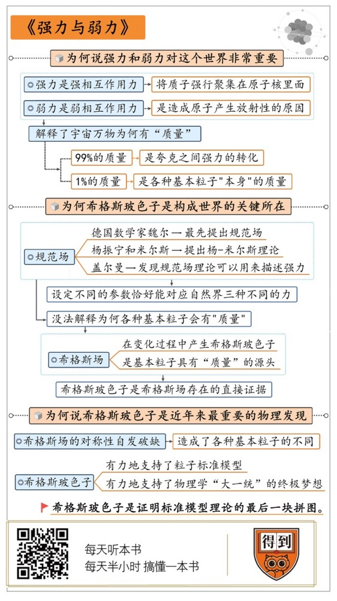

# 《强力与弱力》| 曹天元解读

## 关于作者

本书作者是日本理论物理学家大栗博司。他是加州理工大学的教授，同时也是东京大学物理研究所的主任。大栗博司写过多本关于理论物理的科普书，除了这本《强力与弱力》之外，还有《引力是什么》《超弦理论》等等，他的作品有一种非常独特的“日式科普”的风味，曾获得过日本讲谈社的科学出版奖。

## 关于本书

本书以“强力和弱力”为切入点切入，实际上讲述的是希格斯玻色子的发现以及它在粒子标准模型中所扮演的重要作用。这本书从最基本的概念开始，讲述了现代物理学关于物质结构的前沿理论，以及人们为了统一大自然全部四种作用力而做的努力。通过这本书，你可以大致弄明白希格斯玻色子和希格斯场究竟是个什么东西，理解它为什么会是近年来最重要的物理发现之一，同时也对粒子标准模型的理论框架有一个基本的理解。

## 核心内容

大自然里有四种不同的“力”，除了我们熟悉的引力和电磁力之外，还有两种叫做“强力”与“弱力”。强力与弱力不但是原子聚合和衰变的根本原因，同时还解释了为什么万物会有“质量”。原来在我们的宇宙里，到处都充满了叫做“希格斯场”的东西，它与不同的粒子发生反应，就赋予各种粒子不同的质量。

更重要的是，从希格斯场的假设出发，我们可以推断，强力、弱力和电磁力在宇宙诞生之初，很有可能是同一个东西，这就让我们向物理学“大一统”的目标迈出了坚实的一步。为了把强力、弱力和电磁力结合在同一个框架之下，物理学家打造出了被称为“粒子标准模型”的理论，这是现代物理学最辉煌的成就之一。

## 前言

你好，欢迎每天听本书。本期音频我们要解读的这本书叫做《强力与弱力》。这两个物理概念你可能不太熟悉，但在中学里，你一定学过万有引力，也学过电磁力。这四种力合在一起，被称为自然界的四种基本力。没有它们，就没有我们今天的这个宇宙。

虽然强力和弱力和我们今天要说的内容也有关系，但是要我说，这本书的书名其实应该用另一个物理学名词来命名，那就是“希格斯玻色子”。这是这几年科学界非常火爆的一个名词。在很多新闻里，它还被称为“上帝粒子”。这个名字你可能有点耳熟，因为2012年，欧洲核子研究中心宣布，他们证实了希格斯玻色子的存在，成为了当时的一个爆炸性新闻。但是为什么这是个爆炸性新闻，希格斯玻色子到底重要在哪儿，你可能还不太清楚。

咱们可以类比一下，另一个曾经被媒体争相报道的物理学名词，引力波。2016年初，美国航空航天局宣布，人类第一次捕捉到了引力波信号。当时人们都说，引力波是证明广义相对论的最后一块拼图。希格斯玻色子也是这样的存在，它也是最后一块拼图。

不过，它证明的是一个叫作标准模型的理论。你可能对这个理论不太熟悉，但标准模型是物理学里面最精巧、最复杂的理论，可以说是人类智慧的顶级杰作之一，有几十个诺贝尔奖都是围绕着这个模型而诞生的。引力波的发现证明了广义相对论的正确，而希格斯玻色子的发现，证明了标准模型的正确。

这两个发现，都是理论先于实验，科学家先猜测，应该有这么个东西，然后事实证明，还真有。可以说，引力波和希格斯玻色子，这是近十年来，物理学界最为重要的两个发现。

关于引力波，“每天听本书”曾经解读过同名的图书，欢迎你搜索收听。那在这期音频里，我们就来围绕希格斯玻色子来详细地讲一讲。这本书的作者是一位日本物理学家，叫大栗博司。大栗博司是加州理工学院的物理学教授。说到加州理工，那可是物理学家的圣地。美剧《生活大爆炸》里的那位科学奇人谢尔顿，就是加州理工的。当然，谢尔顿只是电视剧里的虚拟人物，我们后面会讲到，和我们今天这个故事息息相关的几位真正的著名科学家，他们也都来自加州理工。由一位加州理工的物理学教授来为我们讲这个故事，那是再适合不过了。

接下来，我将从三个方面来为你解读这本书。第一，咱们先从书名入手，说说为什么强力和弱力对这个世界非常重要？第二，希格斯玻色子在这里面担任了什么样的角色？第三，为什么说希格斯玻色子是近年来最重要的物理发现？

## 第一部分

首先我们来看看，为什么说强力和弱力对这个世界非常重要？

我们知道，这个世界是由物质组成的，而在不同的物质之间，有着各种相互作用，这种作用，物理学家就用“力”来表示。不过长期以来，人们只知道两种“力”的存在，就是我们之前说的，我们在中学里学到的两种。一种是万有引力，任何两个有质量的物体之间，都存在着相互吸引的万有引力。还有一种就是电磁力，它和引力有点不一样，不但会吸引，还会排斥。你肯定知道磁铁之间同性相斥，异性相吸，这中间就是电磁力的作用。

不过20世纪以来，物理学家发现了“原子”的存在，这就为我们认识世界打开了一扇新的大门。但物理学家发现了一个很奇怪的现象。在高中物理课上，咱们都学过，原子核是由质子和中子组成的，其中中子不带电，质子带正电。但你有没有想过，电磁力是同性相斥啊。那为什么那么多的带着正电的质子，都挤在原子核里面，却没因为电磁力互相排斥而弹开呢？这里肯定有一种全新的，我们不知道的力，它比电磁力还要强。只有这样，才能把很多同样带正电的质子，强行聚集在原子核里面。这种比电磁力还要强的力，科学家就给它起了一个名字，叫作“强相互作用力”，简称“强力”。

发现强力之后不久，人们很快就又发现了另一种力。它的强度比电磁力要弱，所以自然而然，大家就顺理成章地给它起名叫作“弱相互作用力”，也就是弱力。弱力有什么作用？科学家发现，它是造成原子产生放射性的原因。比方说，我们知道著名的放射性元素镭，就是居里夫人发现的那个。它的原子核会不断放射出射线，然后裂变成其他元素的原子。为什么原子核会发生这种变化呢？这就是弱力在其中作用的结果。

到此为止，科学家就发现，原来在宇宙里存在着4种不同的力：引力、电磁力、强力和弱力。其中任何一种力，对这个世界来说都是很重要的。引力就不说了，我们都很熟悉。电磁力呢，是电力和磁力的统称，它能让原子聚拢成分子，分子聚拢成物质。如果没有电磁力，我们的身体都会四分五裂。

强力和弱力同样也不可或缺。没有强力，质子就根本不可能被聚集在原子核里，也就不能形成绝大多数的物质。至于弱力，也同样重要。比方说，太阳之所以能够稳定地持续燃烧，为地球的生命提供源源不断的能量，那就主要依赖于弱力的作用。

因为太阳的燃烧实际上是一种核聚变。在太阳内部，两个质子聚集到一起，变成了氦的原子核，同时释放出能量。在这个过程里，两个质子都带有正电，本来很难撞到一起。但是多亏弱力的作用，其中的一个质子会偶然变成中子，这才能跟另一个质子结合起来，走出聚变的第一步。

而且，我们还要感谢弱力非常之“弱”，所以这种转变只能慢慢发生，太阳才有长达一百多亿年的寿命，不至于一下子就燃烧殆尽。总而言之，没有了任何一种力，我们的宇宙就不会是这个样子，我们也就不可能存在。

更有意思的是，强力和弱力解释了一件非常重要的事情。就是为什么宇宙万物会有“质量”？这个质量，差不多就是我们平时所说的“重量”，咱们在这里不细抠概念。比方说，为什么一个人体重是150斤？你可能从来也没想过这个问题，这不是天经地义吗？有什么值得问的？

但实际上，在物理学家眼里，“质量”是一个很神秘的东西。在宇宙里，大部分的质量都集中在原子的原子核里面，而原子核又主要是由质子和中子构成的。所以，如果不算暗物质的话，可以说质子和中子集中了宇宙里绝大多数的质量。

然而，质子和中子并不是最基本的，后来人们发现，它们都由一种更加基本的粒子组成，这种粒子叫作“夸克”。做出这个发现的物理学家叫作盖尔曼，他就是加州理工出来的。盖尔曼就发现，不管是质子还是中子，都由3个不同的夸克组成。

然而有趣的是，如果你仔细计算的话，你就会惊奇地发现，质子和中子的质量，竟然并不等于组成它们的3个夸克之和。换句话说，如果把质子的质量比作1千克，那么，组成它的3个夸克的质量加起来差不多只有10克，仅占质子质量的1%。这就奇怪了，那质子其他99%的质量是从哪里来的呢？

答案就是强力。我们99%的体重，实际上就来自于夸克之间强力的转换。在质子内部，强力以非常巨大的能量把3个夸克聚合在一起。我们知道，爱因斯坦有一个著名的质能方程E=mc^2，也就是能量等于质量乘以光速的平方。能量和质量可以相互转换。强力的这些能量，根据公式，就可以计算为对应的质量。这就是质子和中子99%质量的由来，也可以说是，我们宇宙万物99%质量的由来。

不过，这转换来的99%还不是最困扰科学家的，剩下的那1%，才是真正的麻烦。我们刚刚说，如果质子的质量是1千克，那组成它的3个夸克的质量只有10克。那为什么说这10克的质量才是真正的麻烦呢？因为在物理学家看来，这些粒子根本就不应该有质量！按照物理学家的理论预言，夸克也好，电子也好，统统都应该是质量为0的基本粒子！这是一个长期困扰物理学界的难题，而它的最终解决，就牵涉到我们最开始讲的那个神秘的名词，希格斯玻色子。接下来就是我们要讲的第二部分，什么是希格斯玻色子？为什么它是构成我们世界的关键所在？

## 第二部分

前面说了，世间万物99%的质量，实际上是夸克之间强力的转化，而剩下的那1%，才是各种基本粒子“本身”的质量。不过，物理学家一直想不通一个问题，就是为什么基本粒子会有“质量”这个东西？

你可能觉得，这是一个无理取闹的问题，“质量”难道不是宇宙万物最基本的性质之一吗？可是，在物理学家看来，还真不是这样。这里牵涉到一个很基本的物理学理论问题，就是物理学家认为，各种基本粒子，它们实际上都可以用同一个理论框架去描述，这个理论框架叫作“规范场”。

“场”在物理学里面，是一个非常重要的概念。比方说引力其实是通过引力场发生作用的，电磁力则是通过电磁场。规范场也一样。在这里，咱们不详细解释什么叫作规范场，因为里面牵涉到非常高深的数学理论。简单而言，你可以想象这是一套通用的规则，只要设定不同的初始参数，这套规则就可以对应于各种不同的对象。

比如说，最先提出规范场的是一个叫作魏尔的德国数学家。他就发现，给规范场理论设定某一种参数，它就可以描述麦克斯韦的电磁场。这是规范场理论的开始。然后到了1954年，杨振宁和他的学生米尔斯做出了一个更加重要的贡献。他们发现，把规范场的那个初始设定参数改成另外一种，这个理论同样可以用来描述弱力！他们提出的理论叫作杨-米尔斯理论，是近代物理学最重要的成就之一。然后，在杨振宁后面，我们前面说到的，发现了夸克的盖尔曼，又推进了一步。盖尔曼又发现，如果把杨-米尔斯理论的参数再扩展一下，规范场理论还可以用来描述强力！

所以你看，这个理论框架非常神奇，只要设定不同的参数，它就恰好能够对应自然界的三种不同的力。也正因为此，物理学家毫不怀疑，这个框架肯定是正确的。

然而呢，这个理论有一个致命的缺陷。就是它没法解释为什么各种基本粒子会有“质量”！比方说，在规范场的理论框架看来，各种力的作用模式其实是类似的，它们都类似于把某种粒子扔来扔去而造成的结果。比方说，电磁力的本质，就是两个电子之间互相把光子扔来扔去。类似的，强力是把称作“胶子”的东西扔来扔去。所以把胶子互相扔来扔去，产生的强力就像胶水一样把夸克粘在一起。同样道理，弱力是把两种称为W和Z的玻色子扔来扔去。你看，原理都是差不多的。

既然原理差不多，各种不同的力对应的粒子，它们的性质也应该差不多。比如科学家已经知道，在电磁力里面，被扔来扔去的光子，是一种静质量为0的粒子。那按照规范场理论，弱力里面相对应的、被扔来扔去的那两种玻色子，质量也应该为0。但奇怪的是，事实并非如此。在弱力里面，被扔来扔去的玻色子是有质量的，而且质量还不小。正因为这样，弱力没法传递得很远，它只有在很近的距离上才能发生作用，而不像电磁力那样，有着很远的传播范围。

这就让科学家百思不得其解了。理论和事实不符，是规范场理论错了吗？为此，科学家不得不假设，在宇宙里还存在着一种我们以前不知道的，神秘的场。各种不同的粒子与这个场发生作用，于是就产生了不同的质量。这个场，就被起名叫作“希格斯场”。

那这个“希格斯场”，是怎么让各种基本粒子有了质量的呢？你可以想象一个很大的音乐广场，里面到处都站着狂热的粉丝。不过，这些粉丝对于不同的人会做出不同的反应。如果你只是一个路人小透明，你大可以安安静静地穿过这片广场，不会受到任何阻碍。粉丝们压根就懒得理睬你。不过如果你是一个大明星，那情况就完全不同了。不论你走到哪里，狂热的粉丝都会扑到你的身边。你的名气越大，扑上来的人就越多。

从物理上讲，静质量为0的光子就相当于一个毫无名气的小透明。它跟希格斯场不发生任何作用，所以可以自由穿梭在空间里，始终保持本身静止质量为0。而电子和夸克就不一样了，它们是有点“名气”的人。所以希格斯场会在它们身上产生效应，就像是粉丝扑到你身上一样，于是就产生了不同的“质量”。名气越高，扑上来的粉丝就越多，你的质量也就越大。如果都是明星，那夸克的名气就比电子大，所以它的质量也比电子大。

就这样，通过希格斯场的假设，物理学家们解释了各种基本粒子质量的由来。但是科学最重要的是讲证据。我们还需要切实的证据，才能证明这个希格斯场真的存在。这个证据是什么？这就是我们一直提到的，很重要的那个粒子，就是希格斯玻色子。

希格斯玻色子是什么东西？它其实是希格斯场在变化过程中，产生的一种粒子。我们还是把希格斯场想象成广场上的粉丝，这些粉丝会原地转来转去，寻找明星的出现。每个粉丝手上都拿着一根荧光棒，随着他们的转动，你在各个方向上都可以不断地看到荧光棒发出的闪光。这种闪光就是希格斯玻色子。总而言之，希格斯玻色子是希格斯场的产物。如果我们发现了希格斯玻色子，就可以直接证明希格斯场的存在，这就是它的重要意义所在。

不过，发现希格斯玻色子可不是一件容易的事。因为这种粒子衰变得很快，它一出现，迅速就会变成其他粒子。而且，我们并不知道希格斯玻色子本身的质量到底是多少，所以它究竟会衰变成什么粒子，我们也不能确定，只好一个个地去试。这好比大海捞针，你要把所有的可能性都检查一遍，可想而知是多么困难。

科学家提出希格斯玻色子的猜想是在1964年，然后整整有48年的时间，科学家一直在苦苦寻找这个粒子的踪迹。因为等待的时间实在太漫长了，诺贝尔物理学奖得主莱德曼甚至在他的书里，把这种粒子称为“该死的粒子”。该死的，英文就是Goddamn，但这是个粗话，所以在出版的时候，编辑把这个词改了。把后面的damn去掉，只剩下God。God就是上帝，所以希格斯玻色子就莫名其妙地被叫作了“上帝粒子”。实际上它跟上帝半点关系也没有。

不过有意思的是，这个词在大众中间却非常受欢迎。大家虽然不知道“希格斯玻色子”是什么东西，但一听“上帝粒子”，就觉得很高大上。你可别小看这个绰号，之前美国议会曾经投票否决了超级加速器的建造，就是因为议员们根本不理解希格斯玻色子究竟是个什么东西，为什么要花100多亿美元造个机器来发现它。而自从它有了“上帝粒子”这个称号之后，加速器在欧洲通过审核就顺利了很多。大家一听，这个加速器原来可以发现“上帝粒子”，不得了，虽然有点贵，但也值了。所以，为什么大型强子对撞机不造在美国，而是欧洲，最后也是欧洲核子研究中心发现了希格斯玻色子，跟它这个拉风的绰号还真不能说没有关系。

以上是我们解读的第二部分，我们讲了希格斯玻色子可以证明希格斯场的存在，而希格斯场是基本粒子具有“质量”的源头。不过，除了解释质量之外，希格斯场在物理学上还有更重要的意义，这就是我要为你解读的第三部分：为什么说希格斯玻色子是物理学最重要的发现之一？因为它是物理学走向“大一统”的关键所在。

## 第三部分

我们中国人向来有着“大一统”情结，其实物理学家也有。物理学家的“大一统”是什么？就是想把所有的物理现象，都统一到同一个理论框架里面去，用一个万能的方程去解释宇宙里所有的事情。不过呢，我们前面说过了，宇宙里存在着四种不同的力，对吧？引力，电磁力，强力和弱力。这四种力要用四种不同的物理理论来描述。比如引力要用到相对论，电磁力要用到麦克斯韦电磁理论，强力和弱力也各有自己的方程。这就让物理学家很不爽，在他们看来，这显然是不合理的：为什么大自然要多此一举，创造四种不同的力呢？

但自从希格斯场的理论提出之后，人们逐渐意识到了问题所在。我们前面提到了，在电磁作用里，被扔来扔去的交换粒子是光子，而弱力的交换粒子是W和Z两种玻色子。光子没有质量，而W和Z玻色子有质量，这就造成了电磁力和弱力的不同。那么，为什么光子会没有质量，两种玻色子却有质量呢？我们前面也说了，这是因为它们在希格斯场里造成的反应不同，光子是“小透明”，两种玻色子则有点“名气”，所以有了质量。现在关键来了，为什么希格斯场会造成这种区别？这里的机制到底是什么？

20世纪60年代之后，科学家想到了一种非常巧妙的解释，叫作“对称性自发破缺”。这个概念听起来有点难，我们还是用粉丝来打比方。你可以想象在最开始的时候，每个粉丝都闭着眼睛，而且面向不同的方向。这时候，任何明星对他们来说都没有区别。但是，接下来产生了一次关键变化，所有的粉丝都随机转向某个方向，并且睁开眼睛。这个关键变化，就是对称性自发破缺。变化发生后，就有了区别。如果粉丝恰好转向东边，那么，只有东边来的明星才会被他们看到，并且扑上去产生质量。而其他方向过来的明星他们是看不到的，就不会有什么反应。

希格斯场就是这样，最开始的时候，它对所有的粒子都不理不睬，可谓一视同仁。然而，在宇宙诞生后很短的时间里，希格斯场发生了一次对称性自发破缺。这之后，它对不同的粒子就开始“区别对待”了。有些粒子可以和希格斯场发生反应，就被赋予了质量，有些粒子一直被冷淡对待。这就造成了各种基本粒子的不同。

这个解释后来被三位物理学家，温伯格、萨拉姆和格拉肖分别证明，光子和W、Z玻色子的区别，其实就来自于对称性自发破缺。证明它有什么用呢？用处就在于，这说明在对称性自发破缺发生之前，电磁力和弱力实际上并没有区别，它们根本就是同一种东西！ 

这个理论叫作“电弱统一理论”，“电”就是电磁力，“弱”就是弱力。这是物理学上至关重要的一步。它第一次证明了，在大自然的四种力里面，有两种其实是完全一样的，只是由于希格斯场的对称性自发破缺，才变成了看起来不同的两种东西。可以说，这给物理学家“大一统”的信念打了一剂强心针。从此以后，绝大多数人都开始相信，在最早的时候，宇宙里实际上只有一种力，只不过随着时间流逝，它们才逐渐分化成了四种看上去不同的形式。这样一来，物理学家就有了一个终极的追求目标，就是找到那个可以统一描述所有四种力的理论。这是我们宇宙的终极奥秘，也可以说是物理学的最高荣誉。

在统一了电磁力和弱力之后，科学家逐渐开始把强力也拉到这个框架里来。我们前面说过了，这三种力都可以用一种叫作规范场的理论框架来描述，只不过各自需要设定不同的参数。在电弱统一理论的基础上，人们把三种不同的参数联合起来，得到了一个可以同时描述三种力的模型，叫作“粒子标准模型”。这个模型可以精准地预言，在我们的宇宙里，一共存在着61种基本粒子。其中物理学家已经发现了60种，而剩下的那最后一种，就是希格斯玻色子。

所以现在你可以理解，为什么2012年，欧洲核子研究中心宣布证实希格斯玻色子的存在，会成为爆炸性新闻了吧？因为第一，它证实了希格斯场的存在，解释了万事万物质量的来源。第二，它有力地支持了粒子标准模型，从而让物理学向着大一统的目标又迈进了坚实的一步。

不过，物理学的万里长征这才刚刚开始，摆在我们眼前的道路其实还很漫长。因为标准模型其实并没有完全统一电弱力和强力。如果把三种力比喻成三个国家，那么，电磁力和弱力这两个王国已经是完全合并了，而强力仅仅只是跟它们组成了一个紧密的联盟，并没有完全合并成一个国家。而且还有一些实验证据，并不支持标准模型。所以这个模型是不是肯定正确，我们现在还不得而知。

更重要的是，我们对引力仍然束手无策，还没有很好的办法把引力和其他三种力彻底结合起来。如果你对物理很感兴趣，一定听说过所谓的“超弦理论”或者“M理论”。这都是在物理学界很火爆的名词。它们就是研究如何把引力和其他三种力统一起来的理论。不过到现在为止，我们还没有办法证明这些理论是正确的。所以，把宇宙里所有的四种力统一在一起的目标，目前仍然还是一个遥遥无期的前景。如果有朝一日，有人能够完成这个终极目标的话，那么他在物理学历史上的地位，肯定可以媲美牛顿和爱因斯坦。

## 总结

这本书的解读就到这里。最后，让我们回顾一下本期音频的内容。

咱们今天说了很多物理学里非常重要的概念，像是强力、弱力、质量、标准模型等等。但是我觉得如果听完这本书，最值得你记住的概念，那应该是希格斯玻色子。它就像一个枢纽，能把这一堆概念都串起来。

你看，我们在第一部分讲到，强力、弱力、电磁力，看起来是完全不同的三种力，但是其实，它们是因为希格斯场的“对称性自发破缺”，才造成的区分。本质上，它们是同一种东西。我们在第二部分，用强力和弱力解释了世间万物“质量”的来源。如果把这个问题往下深挖，还是会回归到希格斯场。希格斯场对不同粒子的不同态度，让不同粒子有了不同的质量。而我们在新闻上经常看到的“希格斯玻色子”，就是希格斯场的产物，也是它存在的直接证据。

最后在第三部分，我们说到了最重要的部分。希格斯玻色子的发现，有力地支持了粒子的标准模型。为什么说希格斯玻色子是近年来物理学最重要的发现之一？就是因为它有力地支持了物理学“大一统”的终极梦想，让我们向这个目标又迈进了决定性的一步。

虽然粒子标准模型还不是宇宙的终极理论，但可以说，这是有史以来人类智慧最伟大的构建之一，也是人类文明发展到现在为止的最高成就之一。我今天为你介绍的，其实还不是这个理论的全部。你可以去看一看今天介绍的这本书。请相信，如果真的能够深入了解这个理论，你一定会跟大栗博司在前言里写的那样，从内心里发出由衷的赞叹：“人类，真了不起！”

撰稿：曹天元

脑图：摩西脑图工作室

转述：徐惟杰