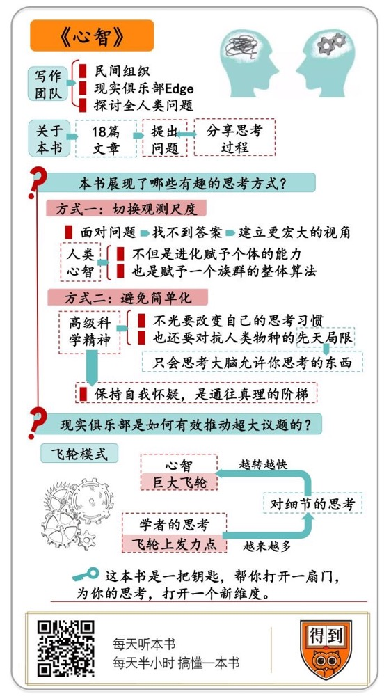

# 《心智》| 李南南解读

## 关于作者

约翰·布罗克曼，美国著名的文化推动者、出版人，“第三种文化”领军人。“世界上最聪明的网站”（《卫报》赞誉）Edge的创始人。他旗下汇集了一大批世界顶尖的科学家和思想家，每年就同一话题进行跨学科讨论。

## 关于本书

约翰·布罗克曼汇集了伟大的科学家和思想家，用简短易懂的文章介绍了涉及人类心智、意识和大脑的深刻思想和前沿理论。书中一共收录了18篇文章。这些文章，大多数只是提出问题，分享思考的过程，并没有给出确切答案。但这正是这本书有意思的地方。现实俱乐部的发起人布罗克曼曾经说过，我们对聪明的思考颇有兴趣，对标准化的智慧意兴阑珊。他关心的不是一个绝妙的答案，而是思考的过程。他希望用一个思考，启发更多的思考。这本《心智》，不是一本答案之书，而是一把钥匙，帮你打开一扇门，为你的思考，打开一个新维度。

## 核心内容

第一，号称最聪明的大脑，是怎么想问题的？第二，怎么推动一个超大议题？

## 前言

你好，欢迎每天听本书。

今天为你解读的，是一本很有来历的书，叫《心智》。怎么个有来历？我觉得可以用两个“最”来形容。这是世界上也许最聪明的一群人，对人类最本质问题的思考。

为什么说这是世界上最聪明的一群人？得先介绍一下作者。它不是一个人，而是一个民间组织，叫现实俱乐部，英文名叫 Edge。它是做什么的？哲学家拜尔斯说过，要想抵达知识的边界，就要寻找最复杂，最聪明的头脑。把他们关在一个房间里，让他们互相讨论各自不解的问题。现实俱乐部，做的就是这件事。

1981年，美国出版人约翰·布罗克曼发起了现实俱乐部。它的拥趸包括凯文·凯利、史蒂芬·平克、塔勒布，等等。他们经常在博物馆、客厅、餐馆举办一些聚会。每一年，他们还会发起一个年度命题，一起讨论。

都是些什么样的命题呢？借用雨果奖获得者，作家郝景芳在推荐序里说的，现实俱乐部探讨的，是关于全人类的问题。比如心智、文化、生命，等等。成员根据这个主题，说出自己最关心的问题，和对这个问题的思考。最终，这些问题和思考集结成册。

现实俱乐部曾经出版过6本书，而这本《心智》就是现实俱乐部丛书的第一本。书中一共收录了18篇文章。

说到这，你可能会以为，这18篇文章，一定汇集了有关心智这个问题，最深刻的答案吧？很遗憾，并没有。这些文章，大多数只是提出问题，分享思考的过程。并没有给出确切答案。

但这正是这本书有意思的地方。现实俱乐部的发起人布罗克曼曾经说过，我们对聪明的思考颇有兴趣，对标准化的智慧意兴阑珊。他关心的不是一个绝妙的答案，而是思考的过程。他希望用一个思考，启发更多的思考。

换句话说，这本《心智》，不是一本答案之书，而是一把钥匙，帮你打开一扇门，为你的思考，打开一个新维度。

其实，以前也存在过类似现实俱乐部的组织。比如17世纪初，英国有一个无形学院。无形，就是没有形状的意思。成员包括物理学家罗伯特·玻意耳，数学家约翰·沃利斯。这个无形学院，就是英国皇家学会的前身。再比如，一些新工业时代的文化领袖，曾经组建过一个叫伯明翰月光社的组织，詹姆斯·瓦特、本杰明·富兰克林都是其中的成员。

现实俱乐部将来会长成什么样？咱们不知道。但可以确定，有机会见证这样一个组织的诞生，和他们在同一个时代共同思考，是一件很有趣的事。

有关背景信息，咱们就说到这儿。那么，这本书到底说了什么呢？前面说过，这是一本文集。里面的18篇文章没有统一的主题。它们只是在某些方面，跟心智这个大命题相关。有人研究的是性选择，有人研究的是语言学，甚至还有人专门研究一种叫弓形虫的寄生虫。

虽然就心智这个专业领域而言，书里的内容很散。但对于咱们普通读者来说，我认为，这本书的价值，主要集中在两点。

第一，它展现了很多有趣的思考方式。也就是，号称最聪明的大脑，是怎么想问题的？你会发现，虽然大家研究的领域不一样，但在思考方式上，有很多共通点。而且这些思考方式，对我们理解其它问题也很有启发。

第二，我们跳出每篇文章，把这本书作为一个整体，它还回答了一个很重要的问题。那就是，怎么推动一个超大议题？你看，心智、文化、生命，都属于跨专业，涉及学科极多，信息量极大的超大议题。对于这类议题，现实俱乐部提供了另一种，推动它的思路。我觉得，有一个最近的流行词，很适合描述这种方式，叫飞轮模式。

接下来，我就从这两部分出发，为你解读这本书。

## 第一部分

首先，第一部分，我们说说，这些聪明的大脑，是怎么思考的？我从书里为你总结出了两种，对我们启发比较大的思考方式。

第一种思考方式，叫切换观测尺度。也就是，当面对一个问题，你找不到合理的答案时，假如建立一个更宏大的视角，也许就会获得一个新的解释。

在这本书里，著名的心理学家，史蒂芬·平克，就提出了这么一个问题。那就是，一个人为什么会杀死旧爱？说白了，就是情杀。这听起来像是法制小报最喜欢的题材。作为心理学大师，平克为什么会关心这件事呢？

因为这个行为太反常了。进化论告诉我们，人类的一切情感，其实都是一套有利于个体生存的快捷方式。也就是你一启动这个情感，就会做出对自己有利的行为。比如恐惧，看见老虎转身就跑，是为了躲避危险。再比如爱吃甜食，看见甜食会高兴，是因为甜食的能量高，能帮我们补充能量。

但是，杀死旧爱，或者威胁另一半，分手我就杀了你，这种情感冲动，它有什么好处呢？是为了赢回芳心？不对。是为了发泄？这个解释也显得有点苍白。

你看，站在个体的立场上，解释不了杀死旧爱这个冲动。这时，我们就得换个更大的观测视角。平克告诉我们，他在遇到这种问题时，从来不会把自己当成一个人。而是把自己当成，设计人类这个物种的总设计师。你想象一下，假如你是这个总设计师，你的最高目的，是确保人类的繁衍。你会把人类的心智，设计成什么样？ 

你可能会想，为了更好的繁衍，男人和女人在一起的时间必须要足够长，这样才能生儿育女，不能三天两头闹分手。但是，一方单方面想分手怎么办？想彻底杜绝不可能，但是，你可以降低这件事的成功率。也就是，让一方想分手时，会有所顾虑。怎么办？你可以建立一种可信的心理威慑机制。也就是当一方发出威胁时，另一方会被镇住。怎么镇住？未必每个人都要把威胁付诸行动，但至少得有人会这么做，这个威胁才会生效。你看，到这一步，杀死旧爱，这个情绪冲动，就找到合理的解释了。

从个体上看，它是非理性的。但对全人类而言，它又是理性的，可以增强伴侣关系的稳定性，让族群更好地繁衍。

你看，当我们切换更大的观察视角时，就会发现，人类心智，不光是进化赋予个体的能力，也是赋予一个族群的整体算法。

同样，用这套思考方式去想别的问题，也能找到答案。

比如，在这本书里，伦敦政治经济学院的心理学家，尼古拉斯·汉弗莱，也提出了一个类似的疑问。他发现，人体有一种不正常的节俭。怎么不正常？当一个人死于癌症的那一刻，他仍然有大量可以抵御癌症的免疫资源被储存着。当一个马拉松运动员累趴下时，他的肌肉里，仍然有大量的能量储备。

假如我们体内的能量和免疫资源都是为了生存，那生死关头时，它们为什么没有被调用呢？这就像开车，明知道可能要撞死了，刹车却没有踩到底。

这时，我们还得建立一个更大的视角。假如你是大自然，你会把人类设计成什么样？因为你不知道明天会发生什么，跑马拉松，万一你跑过终点时，那里有只狮子等着你呢？对癌症患者来说，万一第二天有更猛烈的病毒呢？你必须得让人类给自己留个后手。

大自然必须得在人类的身体里，植入一个资源管理系统。它会分析自我治愈的机会和成本，分析未来的危险，并且决定保留多少资源。这是被上百万年的漫长进化塑造出来的一种能力。

你看，站在进化的大视角上看，人类对自身资源的调配，不仅不反常，而且很合理。

再比如，明尼苏达大学的行为遗传学家，戴维·吕肯，也使用了这种思考方式。他发现，同样是伴侣出轨，但是，男人和女人的态度很不一样。女人发现丈夫出轨，最关心的是，丈夫会不会把家里的钱分给外人。而男人发现妻子出轨，更在意的是，妻子有没有跟外人发生性关系。

为什么会有这种差异？咱们还得换个视角来解释。假设你不是某个人，而是基因本身。你的最高目的，是完成自己的复制。怎么复制？必须得生育自己的后代。而在生育后代这件事上，男女差异就出现了。你看，女人直接生孩子，她们可以百分百的确定，不管孩子的父亲是谁，自己都是孩子的母亲，孩子身上都有自己的基因。这时，她最关心的，就是怎么养育这个孩子。她肯定会更在意资源。而在基因检测出现之前，男人没法确定孩子是不是自己的。为了完成生育后代的目标，他们必须得首先确保，女性不会跟别人发生性关系。

你看，换个视角，这个问题也解释通了。当然，这些解释并不一定全面。但是，这种来自心智科学的思考方式，对我们还是很有启发的。

好，这是第一种思考方式，切换观测视角。遇到一个解释不通的疑问时，你可以切换思考的尺度，也许就会获得新的解释。

第二种思考方式，叫做避免简单化。也就是，凡事避免想当然，在下结论之前多问一句，我能确定，这是事实的全部吗？

听到这，你可能会认为，这不是最起码的科学精神吗？我们很早以前就听过。比如有个苏格兰黑山羊的故事。说的是20世纪70年代，三个数学家，在苏格兰看到一只黑山羊。第一个人说，苏格兰的山羊全都是黑色的。第二个说，不对，这只能说明，苏格兰至少有一只黑山羊。第三个说，你们两个都不对，这只能说明，这一只羊，冲着我们的这一面，是黑色的。这个小故事是要说明，不要被自己的偏见左右。

这个故事当然也表达了一种科学精神。但是，这只是科学精神的最初级。深入这本书，你会发现，高级的科学精神，不光是要改变自己的思考习惯，而是要对抗人类这个物种的先天局限。

在这本书里，加州大学伯克利分校的认知科学教授，史蒂夫·莱考夫，写了一篇文章，叫《肉身哲学》，就对这个问题做了深入研究。他认为，我们的大脑有一个天然局限，那就是，你只会思考那些，大脑允许你思考的东西。

乍一听，你可能会说，不对，想象力天马行空，怎么会受局限呢？要想理解这个观点，我们得先知道，大脑里储存着什么？你可能会说，当然是信息了。没错，但是，信息从哪来？大脑本身不跟外界直接接触，它从身体的其他部位获取信息。而我们的身体，有自己的功能局限。它接收信息的方式，也有局限。这就导致我们大脑里储存的信息，还有大脑的思考方式，都受到了身体的某种局限。

比如，爱因斯坦在描述时间时，他把时间看成一种空间维度，然后像描述空间坐标一样，划定了一条时间轴。每时每刻，都是时间轴上的一个点。但是，这个时间轴的模型，能反应真实的时间逻辑吗？我们不好说。毕竟，我们的感官局限已经决定了，我们只能用这种方式去思考时间。

换句话说，你以为的很多真理，其实都存在某种，把事实简单化的嫌疑。这里的简单，不是简化，而是它可能丢失了事实的某个维度。这是人类的构造，导致的先天局限。那么，怎么突破这种局限？这已经不是改变思考方式的问题，必须要借助新技术、新工具。

比如，X光技术、引力波、声呐，都在打开某种感知世界的新维度。而且在打开这些维度的同时，我们还要追加一句，即使有新视角，但是，这是事实的全部吗？

当然，在分析这个问题的同时，心智领域的专家们，自己也在面对类似的问题。比如在书中，不止一位学者指出，目前的心智科学研究中，建立类比模型，是一个重要的方法。比如，在水力机械设备快速发展的时期，人们觉得大脑像一台液压机。后来电话交换机诞生，人们觉得大脑是一台交换机。现在，有了计算机，我们又认为大脑其实更像一台计算机，把其中的神经结构叫做神经回路。

换句话说，我们研究心智的模型，也受到了科技的局限。每当技术更新换代，这些模型可能也会跟着变。而且，这些模型准确吗？它们能反映事实的全部吗？科学家们必须时刻保持这种怀疑精神。

好，以上就是第一部分内容。我们说了两种，来自科学精英们的思考方式。第一种思考方式叫，切换观测尺度。当你在一个问题上找不到答案，可以切换观察尺度，也许就会获得新的解释。第二种思考方式，其实更偏向精神，叫做避免简单化。保持自我怀疑，也许是通往真理的阶梯。

## 第二部分

前面我们深入细节，从书里挑选了一些思考片段，你可能觉得不过瘾。接下来，我们建立一个全景视角。把这本书当成一个整体来说说。你会发现，在推动“心智”这个超大议题上，现实俱乐部提供了一种新的思路。第二部分，我们就说说，现实俱乐部，是怎么有效推动一个超大议题的？

在正式开始之前，我先分享一个最近的经历。最近，我们公司请来了教育行业的权威专家，共同策划一个针对教育行业的知识产品。希望通过这个产品告诉用户，教育行业正在发生哪些转变，从中看看未来的趋势。

乍一听，你可能会说，这有点像教育行业的蓝皮书。没错，有点这个意思。但问题是，当我们用蓝皮书的逻辑去策划这个产品时，又发现，有点行不通。因为现在的教育行业，牵扯的因素太多了。包括很多艺术学科的教育，还有科学方面的潜能开发，还有很多实验性的新方法。

你看，一提到蓝皮书，我们首先想到的是高度概括，大数据，大图表，大趋势。也就是，用抽象化的方式，去呈现一个大议题。但是，抽象化，就意味着你难免会丢失某个细节。尤其是那些没法纳入现有类别的个案。但问题是，未来的趋势有可能就隐藏在这些无法被明确分类的个案里。

比如，你穿越回600年前，在古腾堡印刷术发明的第二天，去做一份15世纪信息产业的蓝皮书。因为古腾堡印刷机的份额太小，你没准会忽略。你可能会把整个行业分成两大类，抄写和雕版印刷。然后抄写工人分成多少种，这个行业的人员构成如何。但是，也许就在你做完这份蓝皮书不到一年，抄写这个行业，很大程度上就已经被印刷代替了。换句话说，对过去的抽象总结，第一，它可能丢失了细节。第二，因为细节的缺失，导致它不能完全代表未来的趋势。

这时，我们可以换一种思路。把观察的重点，从信息的广度，转变成观点和事实的锐度。也就是，我只呈现，当下正在发生的，新思考、新发现。它们未必是确定性的结果，但思考的力道很深入，而且能启发更多的思考。你看，现实俱乐部，用的就是这个方法。

我们可以用一个最近流行的词，来描述这种方式，叫飞轮模式。你把心智这个命题，当做一个巨大的飞轮。每个学者的思考，都是在飞轮的某个点上发力。一开始，飞轮可能动得很慢。但随着发力点越来越多，这个飞轮会越转越快。这个超大议题，就被有效地推动起来了。

换句话说，《心智》这本书里的话题，看似五花八门，但当我们用飞轮这个模型去观察时，你会发现，每篇文章，都是在某个方面，对着心智这个大飞轮发力。

比如，加州大学圣迭戈分校的大脑认知中心主任，叫拉马·钱德兰，为了讲述方便，咱们就他叫兰教授。兰教授研究的重点，是大脑里，一个叫镜像神经元的区域。镜子的镜，影像的像。这个区域其他灵长类动物也有。它的作用，就是像照镜子一样，让生物有模仿同类，并且感知同类感受的能力。你看，当你在电视上看到有人在悬崖上走钢丝，下面是万丈深渊。你虽然没在现场，但你也会觉得腿发软。这就是你的镜像神经元，在模拟同类的感受。

换句话说，是镜像神经元，让我们能更好的理解同类的意图。这是沟通的基础。在这个基础上，人类才发展出了语言。而有了语言之后，人类才能深入交流思想成果，文明才能快速发展。所以，兰教授认为，镜像神经元，是人类心智的重要组成部分，深入研究它，是很有必要的。

再比如，新墨西哥大学的进化心理学家，杰弗里·米勒，专门研究人类的性选择行为。他认为这是破解人类心智奥秘的关键。他还为此专门写过一本书，叫《交配脑》。他的研究灵感，来自于达尔文的一本书，叫《人类的由来及性选择》。

米勒认为，人类的进化是围绕性选择展开的。也就是，人类的很多能力，并不是为了生存，而是为了求偶进化出来的。

比如语言，我们都觉得，语言是用来沟通的。但米勒发现，在英语词汇里，常用词只有5000个，此外还有几万个装饰性词汇，平时很少用到。那么，我们为什么要进化出这么大的词汇量？他认为，这很大程度上是为了求偶。丰富的词汇量，能让我们在异性面前，展示自己的学习能力。这是一种性选择优势。再比如艺术天赋、善良的品格，某种程度上，都是为了求偶进化出来的。当然，这些解释不一定全面。但是，它却提供了一个发力点，推动了心智这个大飞轮的转动。

当然，在这个飞轮上，还有更冷门的研究。比如，斯坦福大学的生物学家，罗伯特·萨波尔斯基，专门研究一种叫弓形虫的寄生虫。因为弓形虫有一种罕见的能力，它能操控宿主的心智。

我们都知道，猫是老鼠的天敌，老鼠的本能是躲着猫。但是，被弓形虫感染的老鼠，不仅不怕猫，还会特别喜欢猫尿的味道。像被感染的公老鼠，在闻到猫尿的味道时，睾丸会变大，这说明它的性欲被激发了。

那么，弓形虫是怎么做到的？你可能会说，它是不是破坏了老鼠的恐惧神经，让它感觉不到害怕？显然不全是。实验员观察了被感染的老鼠，结果发现，它们依然害怕强光，而且别的大脑机能都正常。弓形虫只是不知道用什么方法，非常精确的，只破坏了老鼠大脑里，跟猫有关的这部分恐惧。并且改变了老鼠的多巴胺系统，让它一闻到猫尿，就觉得快乐。

换句话说，在操控心智这件事上，弓形虫在某种程度上，比人类还厉害。这就是为什么有人要专门研究弓形虫。只要破解了它的能力来源，我们就有可能在某种程度上，进一步揭开心智的奥秘。当然，这项研究目前还在推进中。没准将来的某一天，弓形虫真的会成为打开心智大门的一把钥匙。

同时，这项研究也提供了另一种解决问题的思路。以往我们都觉得，要想解决一个问题，最直接的办法是正面强攻，集中精力研究这个问题本身。但是，对弓形虫的研究告诉我们，你还可以向大自然取经。自然界的每个物种，都有自己的生存解决方案。每个方案，都是一张现成的施工图。只不过它经过加密，你需要破解。一旦破解成功，你就掌握了这个物种的能力。

当然，类似的研究，书里还有很多，咱们就不多说了。

以上就是第二部分内容：现实俱乐部是怎么推动一个超大议题的？我们借用了飞轮这个模型。假如把心智这个命题看成一个巨大的飞轮，你不一定要一上来就转动轴心。你可以在飞轮周边寻找不同的发力点。通过对某个细节的思考，来转动它。随着思考越来越多，飞轮早晚会转起来。

## 总结

到这里，这本《心智》的精华内容，已经为你解读完了。回顾一下，今天我们一共说了两个重要内容。第一个是，学习科学精英们的思考方式。我们说了两种思考原则，分别是建立不同的观测尺度，和避免把事物简单化。第二个重点是，现实俱乐部是怎么推动一个超大议题的？我们建立了一个飞轮模型。这部分刚说完，就不多说了。

假如你对这本书有兴趣，可以直接去看看原书。《心智》这本书里，一共收录了18个精彩的研究报告。每份并不长，也就十来页，你上下班的工夫，就可以完成一次跟顶尖头脑之间的同步思考。这本书的电子书版本，现在已经上线，在首页搜索“心智”，就可以看到。

撰稿：李南南

脑图：摩西脑图工作室

转述：怀沙