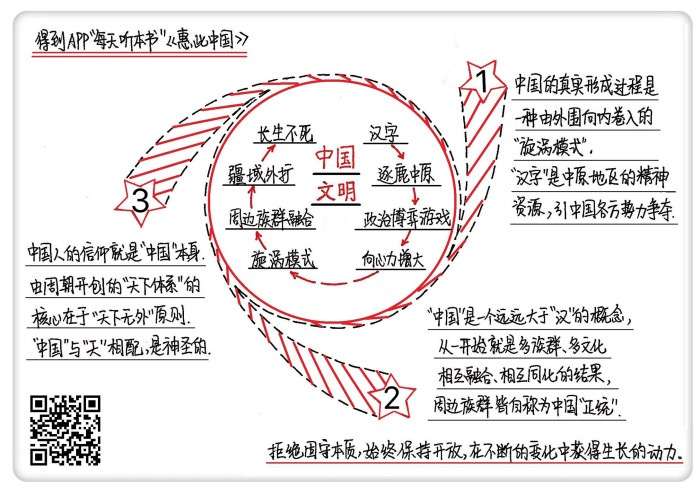

# 《惠此中国》| 徐玲解读

## 关于作者

赵汀阳，中国当代著名哲学家。他的哲学思想被公认为极具独创性，同时融会贯通了中西方哲学。甚至有人认为，在中国当代思想界，赵汀阳已经一骑绝尘，形成了“赵汀阳与所有其他人”的二分格局。 

## 关于本书

本书是继2005年的《天下体系》之后，赵汀阳最重要的一本政治哲学专著，他希望通过此书来“重构中国的历史性”。这是因为，在现代之前，中国拥有独立发展的历史；但进入现代之后，中国历史变成西方征服史的一个分支。一百多年来，我们已经习惯于用西方视角来看待自身，失去了用中国方式来讲述自己历史的能力。如今，随着中国的再次崛起，我们急需重新找回这种能力，从祖先留给我们的遗产中寻找中国持续生长的动力。 

## 核心内容

一、中国的真实形成过程是一种“旋涡模式”，它不是由中心向外扩张，而是由外围向内不断卷入。

二、“中国”是一个远远大于“汉”的概念，中国历史绝不等于汉族史。

三、为什么中国文明没有一个统一的宗教信仰？这其实是我们日用而不知，中国人的信仰就是“中国”本身。

## 前言

你好，欢迎每天听本书。这期音频为你解读的是《惠此中国》，副标题是“作为一个神性概念的中国”。这本书大约10万字，我会用大约24分钟的时间，为你讲述这本书的精髓：中国文明是世界四大古代文明中唯一一个延续至今的文明，它“长生不死”的秘密究竟是什么呢？

你肯定听说过一个词，叫“逐鹿中原”，说的是在早期中国文明的核心地带中原地区，也就是黄河中下游一带，曾经反复出现群雄并起、争夺天下的历史局面。史书上有记载的最早的战争，就是黄帝与炎帝两大部落进行大规模火并的阪泉之战；后来黄帝、炎帝两部落又联合起来，与蚩尤部落进行大规模火并，有了涿鹿之战。通过这两次战役，三大部落完成了族群融合，形成了最早期中国文明的主体。逐鹿中原也成了之后中国政权更迭的基本模式。

这本书里，把这种模式称为“旋涡模式”。所谓旋涡，是指早期中国形成了一个具有巨大诱惑力的政治博弈游戏，各方势力为了争夺生存的最大利益，都选择主动加入这个游戏。更重要的是，各方势力一旦卷入这个游戏，就被吸进来，跑不出去，最终变成这个“文明旋涡”的一部分。随着卷入的族群越来越多，旋涡的规模就越来越大，向心力也越来越强。这个不断强化的博弈游戏，让中国文明始终处于一个不断生长的状态，这就是它长生不死的终极秘密。

这本书的作者赵汀阳，是中国当代著名哲学家，他的哲学思想被公认为极具独创性，同时融会贯通了中西方哲学。甚至有人认为，在中国当代思想界已经形成了一个二分格局，一边是赵汀阳，另一边是其他人，赵汀阳的思想遥遥领先。那么，赵汀阳为什么要写《惠此中国》这本书呢？用他自己的话说，是“试图重构中国的历史性”，也就是要对中国的历史性作一个哲学解释。他认为，在现代之前，中国拥有独立发展的历史，但进入现代以来，中国历史变成西方征服史的一个分支。一百多年来，我们已经习惯于用西方视角来看待自身，失去了用中国方式来讲述自己历史的能力。如今，我们急需重新找回这种能力，从祖先留给我们的遗产中寻找中国持续生长的动力。

好了，介绍完这本书的基本情况，下面，我就为你来详细讲述书中内容。这本书主要讲述了三个重点内容：第一，中国的真实形成过程是一种旋涡模式，它不是由中心向外扩张，而是由外围向内不断卷入。第二，“中国”是一个远远大于“汉”的概念，中国历史绝不等于汉族史。第三，为什么中国文明没有一个统一的宗教信仰？这其实是我们日用而不知，中国人的信仰就是中国本身。

## 第一部分

好了，下面我们就先来说第一点，中国的真实形成过程是一种旋涡模式，它不是由中心向外扩张，而是由外围向内卷入。

当代最重要的历史学家汤因比认为，中国文明是世界上唯一一个从古到今从未中断的文明。古巴比伦文明被波斯人所灭，古埃及文明被希腊人所灭，古印度文明被雅利安人所灭。中国文明同样历经战乱，但不仅没有中断，而且还处于不断的生长变化之中，到现在仍然具有生机勃勃的活力。这在世界文明史上是一个奇迹。俗话说“人生无常”，历史命运更加无常，奇怪的是，在无常的命运面前，中国文明总有办法让自己活下来，保持一种近乎“不死”的存在状态，这是任何文明都梦寐以求的成就。

那么，中国文明长生不死的秘密，到底是什么？有个答案说：中国因为有儒家传统的显著道德优势而得以长生。但仔细想想，这种说法非常可疑。任何一种文明都有自己的文化传统和道德追求，儒家伦理其实与其他文化所提倡的道德也是大同小异。明朝万历年间来到中国的意大利传教士利玛窦，他就发现，儒家伦理其实和天主教伦理差不多，当时他认为中国可以成为传播天主教的沃土，特别激动。

如果不是儒家伦理的道德优势，该怎么理解中国文明长生的秘密呢？从根本上说，人们之所以选择遵循一种传统，从长远来看一定是这种传统更符合人们的生存利益，否则这种传统就不可能持续。所以要探究历史的真实过程，就应该从历史行动者的切身利益出发。假定我们的先祖和我们一样，是具有理性思维能力的行动者，那么，中国的演化过程，可以看做是他们考虑利益后而选择参与的一个博弈游戏。

这就要问一个问题，什么样的游戏可以一直玩下去？如果游戏是一种通关模式，先打小鬼，再打大鬼，最后打大BOSS，那么杀完BOSS当然就game over了。于是就会出现政治学家福山所说的“历史的终结”，也就是文明和历史在完成既定使命之后就不再发展变化。而中国人不这么认为。你看西方文明认为历史进程有一个终极目标，但是中国的历史进程只设定了游戏规则，却没有预设终局，是一个情节无限展开、可以一直玩下去的长期重复博弈游戏。

早期中国的博弈中心是在中原一带，也就是黄河中下游地区。可以合理推断，一定是中原地区存在着某种具有巨大诱惑力的生存资源，所以那些本来分散在四方的各种势力，为了谋求自己的最大利益，才会纷纷选择加入争夺“中国之主”的博弈游戏，也就是逐鹿中原。随着卷入博弈的族群规模越来越大，向心力越来越强，最终形成了一种稳定的动力结构，类似于一个不断扩大的旋涡，所以叫做旋涡模式。古代中国并不是扩张型的帝国，历史上几次大规模的领土扩张，比如汉代、唐代和清代，都是对抗入侵的自卫反击战取得的结果。古代中国之所以总体上一直在向外扩展，根本原因就在于旋涡模式。也就是说，这并不是自内向外扩张的结果，而是外围竞争势力不断向内卷入旋涡所带来的红利。

那么，接下来你肯定会问，中原地区到底有什么非争不可、无法替代的特殊资源，能吸引各方势力都来加入竞争呢？

有人认为是经济因素。这种观点认为，当时中原的生产技术最为先进、地理资源最为优越，属于古代中国的经济发达地区，所以吸引各方来争。但是，这其实只是一种主观猜测。根据考古发现，长江流域的生产技术和物质条件与同时期的中原地区差不多，但长江流域没有成为中心，而且直到春秋时期还被视为蛮夷之地，可见经济因素并不是主要原因。

也有人认为是交通条件。这种观点认为，中原地区正好处于从漠北到江南、从东海到西域之间广大地域的核心地带，四通八达，是交通、物流、情报的汇集中心。谁占有中原，谁就占据了政治、军事上的战略制高点。可惜的是，这种说法同样经不起推敲。如果从亚欧大陆这个更大的地域范围来看，西域才是连接东西方各种文明的物流中心和信息中心。根据考古发现，中原的很多重要技术和物资，比如铜和铁的冶炼术、玻璃、小麦等等，都是从西域传入的。然而西域也没有成为各方来争的宝地，可见交通条件也不是主要原因。

如果我们穷尽了物质世界的所有条件，仍然不能找到合理答案，那么就必须换一种思路，从精神世界的资源去寻找。就古人的生存条件来说，物资资源是生存之本，但精神资源对生存来说同样重要。古人眼中的世界是一个无法支配也不可预测的生存环境，为了能够在某种程度上把握自己的命运，他们发明了最早的“魔法”，也就是巫术和占卜术。通过巫术和占卜术，古人得以和强大的自然神灵进行沟通、谈判，关于神灵的知识就成为早期最重要的精神资源。

接下来，古人发明了比巫术和占卜术更强大的魔法，那就是文字。在文字发明以前，关于所有事物的知识只能口口相传，几乎无法积累。而文字可以把所有重大事物记录在案，即使事物消失，信息仍然存在。这就创造出了一个独立于物质世界的精神世界。精神世界规定了现实世界中是与非、善与恶、美与丑的标准，能影响身在其中的所有人如何想、如何做，因此精神世界对现实世界拥有强大的支配权。同时，使用它的人越多，这个精神世界也就越发达，从而也就能吸引更多的人。

这么一解释就很清楚了：古代中原无可替代、诱惑巨大的宝贵资源，毫无疑问就是汉字，以及以汉字为载体的精神世界和知识生产系统。中原最早发明了作为书写文字的汉字，这是早期中国最为成熟的文字。汉字是象形文字，能够独立于语音存在，所有族群都可以无障碍地理解和使用。这就使以汉字为载体的精神世界成为一个开放的、共享的、不断丰富的精神世界。由于精神世界占据对现实世界的解释权、立法权和支配权，拥有汉字精神资源的中原当然就成为各方势力志在必得、非争不可的宝地。这才是逐鹿中原的根本动机，也是形成旋涡模式的核心动力。

这就是第一个重点，古代中国的真实形成过程是一种旋涡模式，它不是由中心向外扩张，而是由外围向内卷入。

## 第二部分

说完古代中国的真实形成过程，再来说说中国历史的概念。中国历史绝不等于汉族史，中国是一个远远大于汉的概念。

说到中国的概念，我们可能会有一种错觉，那就是：汉民族构成了中国历史演化的主体，历史上不断发生的少数民族入侵、割据甚至建立中央王朝，只是一种例外状态。然而，历史的真相正好相反。中国从一开始就是多族群、多文化相互融合、相互同化的结果，并不是单向度的汉化。事实上，中国历史上并不存在一个纯粹的汉族。最古老的中原“本地”族群是什么样的，谁也说不清。对中原之外的周边族群，也只有一个笼统的称呼，一般把东部族群称为东夷，西部族群称为西戎，北部族群称为北狄，南部族群称为南蛮。

我们都自称为炎黄子孙，但其实炎帝才是农耕部族，打败了炎帝的黄帝是属于北狄的游牧部族，《史记》上记载他们“迁徙往来无常处，以师兵为营卫”。意思是，没有固定的住所，带兵走到哪里，就在哪里安营扎寨。中国最早的中央王朝夏、商、周三代，对中原来说也是外来户，商源于东夷部族，周源于西戎和夏的混合。再说春秋战国时期的争霸诸侯，楚国、吴国、越国是长江流域的蛮夷诸侯，齐国是汉人与东夷的混合，秦国是汉人与西戎的混合，晋国和燕国则是汉人与北狄的混合。再往后看，创造了中国历史上著名的隋唐盛世的隋朝和唐朝，他们的皇室都是鲜卑族。当然，就更不用说元朝和清朝了。

总之，如果严格算起来，中国有几乎一半历史都是由周边族群主导的，总不能把中国的一半历史都剔除出去。中国的真实生长过程，是先占据中原地区的部族，与后来不断加入博弈旋涡的周边族群不断融合的过程。这些族群包括匈奴、鲜卑、突厥、西羌、契丹、女真、蒙古等等。卷入博弈旋涡的族群最后大多数都融合为了中国人，成为现代所命名的汉族；而他们的原住地也随之并入中国，让中国的疆域得以不断外扩。

再来看，历史上那些周边族群建立的王朝，究竟是怎样认定自己与中国的关系的呢？是外部征服者，还是内部继承者？你会发现一个有意思的现象：所有能够入主中原的族群，从来不会把自己看作是一个外来的征服者；恰恰相反，他们无一例外都自认为是中国“正统”的继承人，把自己接入到自黄帝以来的中国正统历史序列当中。

以最典型的元朝和清朝为例。现代史学界有种观点，认为元朝和清朝不属于中国王朝，而是征服了中国的外国王朝。这种说法非常可疑，是现代人用现代观念去想象古人。前面我们说过，要理解古人的真实意图，必须从他们自身利益出发去看。周边族群逐鹿中原的根本目的，就是为了获得以汉字为载体的精神世界。这个精神世界中的天命观和大一统观念，是元朝和清朝当时最急需的政治资源。只要加入了这个精神世界的正统叙事，就可以名正言顺地获得中国的最大权力和最大资源，显然任何成熟的统治者都不可能拒绝。元朝和清朝为了保证万世基业，必然选择成为“中国王朝”。反过来说，如果元朝和清朝把自己定性为入侵的“征服王朝”，那么他们就无法证明自己统治的合法性，将面临无穷的挑战和麻烦。这就是为什么，元朝和清朝的历代皇帝都认定自己是“中国皇帝”，甚至兵败退回漠北的元顺帝，仍然认为自己是中国的元朝皇帝。

事实上，不仅是入主中原的周边部族认同自己属于中国，后来的历史书写者也同样这么认为。比如，南北朝时期，南北双方都说自己是正统，骂对方为野蛮人，但到了唐代李延寿写南北朝史，就一视同仁，承认双方都是中国的一部分。再比如，在长达300年的辽宋对峙时期，辽和宋就到底谁才是中国的正统争吵不休。为此辽甚至宣称自己获得了秦始皇留下的传国玉玺，以证明自己是正统。但是到了元朝人写这段历史，就不理会这段争执，把辽和宋以及同时期并存的其他王朝，比如金和夏，一样看成中国王朝。而接下来，推翻了元朝的朱元璋，也并没有把元朝看作是一个外国王朝，反而追认了元朝的正统地位。

总之，只要卷入了逐鹿中原的博弈游戏、被中国旋涡所吸附的部族，都成为了中国的一部分，都共同分享中国的历史。由于中国旋涡的巨大向心力，不允许存在一个长期均衡的分裂状态，对所有逐鹿中原的竞争者来说，割据一方都只不过是实力不足时的权宜之计；一旦实力足够，必然坚定地追求统一。这就解释了为什么在中国“合久必分、分久必合”的循环模式中，追求合始终是历史的大趋势。

## 第三部分

好了，上面就是为你讲述的第二个重点，中国是一个远远大于汉的概念，中国历史绝不等于汉族史。你可能会有一个疑问，为什么这些部族都理直气壮地说自己是正统，谁也不拿自己当外人呢？这就要说到这期音频的第三个重点内容，中国人的信仰就是中国本身。

周公开创了一个政治制度，叫“天下体系”。天下体系的政治结构包括三层，也就是“齐家治国平天下”中的家、国、天下。家，是指家族；国，是指诸侯国；而天下，是指全世界。天下体系就是一个以“和谐万邦”为目标的世界政治秩序。当然了，周朝人眼中的世界并不是真正的全世界，但这并不妨碍他们想象一个可以容纳天下所有人的政治格局。

天下体系的核心理念在于“天下无外”原则。就是说，天下是所有人的天下，天下政治不拒绝任何人的参与、不会把任何人排除在外。只要“有德”，就有机会获得天命而主政天下，这等于是论证了逐鹿天下的合法性。这跟西方不一样。西方人自认为是“上帝选民”，将其他族群排除在外，而天下无外原则显然具有更大的兼容性。无论中国的政权格局如何变化，这个原则一直保留在中国的政治基因当中，让中国一直保持着开放性和兼容性。由秦始皇所开创的大一统国家，就是指以天下为尺度、内含天下格局的国家。

那么，这个内含天下格局的中国，为什么可以成为中国人的精神信仰？

《道德经》里有一句话：“人法地，地法天，天法道，道法自然。”这意味着，对于中国古人，最具神性的概念首先是“自然之道”，其次就是“天”。古人相信天是神圣的，如果有什么事物可以与天同构、与天相配，也就是“配天”，那么，这个事物也就分享了天的神圣性。比如，中国的传统建筑样式，就体现了典型的配天观念。其中飞檐斗拱的顶盖象征天，厚实的基座象征地，人居于屋内也就是象征性地居于天地之间，中轴线对称布局是表明敬天之意。

天的根本特征是“无外”，无外就是无所不包，没有任何事物被排除在外。内含天下格局的中国，也是无外的，是能包容所有人和谐共存的。这样的中国，当然就足以配天，当然也就具有了天的神圣性。这本书的副标题《作为一个神性概念的中国》，就是这个意思。

这就解释了史学界一直以来的一个重大困惑：为什么中国文明和世界上其他重要文明都不一样，竟然没有产生出一个原生的超越性宗教？近代以来很多学者试图解决这个问题，比如梁漱溟提出中国文明是“道德代替了宗教”，蔡元培提出是“美育代替了宗教”等等。事实上，没有建立超越性的宗教，并不代表中国文化中没有宗教感或者神性。中国文化里确实不存在人与神的约定，因此没有西方意义上的宗教。但是，中国人相信自然之道是最高存在法则，人道必须与天道相配，只要达到配天就具有了神圣性。所以，以配天为根本原则，内含天下格局而具有无限开放性和兼容性的中国，当然就成了中国人的神圣信仰。

好了，上面就是为你讲述的第三个重点，中国人的信仰就是中国本身。

## 总结

说到这儿，这期音频的内容就聊得差不多了。下面来简单总结一下今天为你分享的内容。

第一，中国的真实形成过程是一种旋涡模式，它不是由中心向外扩张，而是由外围向内卷入。中原地区最先发明了汉字，以汉字为载体的精神世界和知识生产系统，是古代中国各方势力非争不可的优势资源，因此形成了一个逐鹿中原的长期博弈游戏。随着卷入博弈旋涡的族群越来越多，向心力越来越强，中国的边界也不断向外扩展。

第二，中国是一个远远大于汉的概念，中国历史绝不等于汉族史。中国从一开始就是多族群、多文化相互融合、相互同化的结果，并不是单向度的汉化，中国历史上也不存在一个纯粹的汉族。几乎一半中国历史是由中原以外的周边族群主导的，这些族群建立的政权无一例外都把自己定性为中国王朝，并把自己接入到自黄帝以来的中国正统历史序列中。

第三，为什么中国文明没有一个统一的宗教信仰？因为中国人的信仰就是中国本身。由周朝开创的天下体系的核心在于天下无外原则，这个原则一直保留在后世中国的政治基因中。在中国文化中，天是神圣的，中国“内含天下格局”，与天相配，当然也是神圣的，因此中国本身成为了中国人的精神信仰。

最后说一点，这本书讨论的是古代中国文明长生不死的秘密，但现代中国和古代中国出现了文化上的巨大断裂，有人认为文明意义上的中国已死，现代中国的崛起，不过是让自己成为了另外一个西方。对此，这本书的作者赵汀阳却持一种乐观态度。他认为，古老中国的秘密其实已铸成一种长久的方法论，那就是旋涡的存在方法：拒绝固守本质，始终保持开放，在不断的变化中获得生长的动力。从这个意义上说，现代中国是古代中国的顽强延续，是中国文明不死神话开启的一个新篇章。

撰稿：徐玲

脑图：摩西

转述：于浩