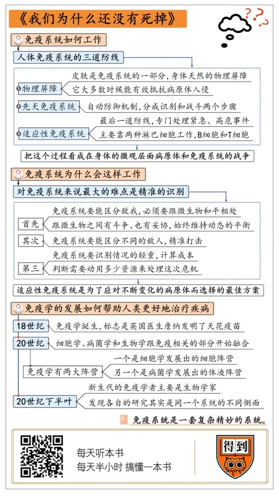

# 《我们为什么还没有死掉》| 刘玄解读

## 关于作者

伊丹·本-巴拉克（Idan Ben-Barak），耶路撒冷希伯来大学医学科学的学士、微生物学硕士，悉尼大学科学历史与哲学博士。他的第一本书，《奇妙的微观世界：微生物是如何统治世界的》已译成5种语言，并获得2010年美国科学促进会的优秀科学图书奖。

## 关于本书

伊丹·本-巴拉克向我们展示了免疫系统是如何运作的，它是如何摧毁病原体的，我们为何会对某些致病体产生免疫，探讨了免疫系统的演化以及我们关注的抗生素与疫苗的功能，并展望了免疫的未来。本书将带领读者展开一场有趣的免疫系统漫游。

## 核心内容

首先，我们跟随作者的指南，来一场免疫系统的漫游，看看免疫系统如何工作。第二部分，我们来看看，免疫系统为什么会这样工作。第三部分，我们来看看人类如何利用对免疫系统的认识来应对疾病。我还采访了免疫学专家李先亮医生，请他从更专业的角度帮我们理解这个问题。

## 前言

你好，我是刘玄，欢迎每天听本书。今天为你解读的书叫《我们为什么还没有死掉》，副标题是“免疫系统漫游指南”，是一本关于免疫系统的科普书。

我们都知道，免疫力很重要。免疫力强的人不容易生病，就算有点感冒发烧，也很容易好。但是我们对免疫系统其实有很多误解，比如很多人经常挂在嘴边的“提高免疫力”，这本书的作者就不太赞同。免疫系统是一套复杂精妙的系统，只看力量强弱，就把它想得太简单了。有些疾病甚至是免疫力“太强”造成的，比如过敏，就是因为免疫系统反应过度了。现代人的很多常见病，像I型糖尿病，就是因为免疫系统功能失调，攻击了身体正常的细胞。对我们普通人来说，想要更健康，首先要做的不是忙着“提高免疫力”，而是了解跟免疫系统相关的知识。这时候，再看这些跟免疫系统有关的病，我们才知道怎样做对健康更有帮助。

一百多年来，正是因为人类越来越了解免疫系统，我们才攻克了很多医学难题。比如，免疫学的诞生，就是因为人们发现利用疫苗来激活免疫系统可以对抗传染病。未来，免疫学很有可能帮助我们对抗癌症。2018年，诺贝尔生理学或医学奖授予了两位免疫学家，他们提出了一种治疗癌症的新方法——免疫疗法。过去，治疗癌症的基本思路都是杀死癌细胞，但是，如果治疗手段的杀伤力太大，也会伤害病人的身体，杀敌一千，自损八百。免疫疗法的思路正好相反，它的原理是帮助免疫系统，因为杀死癌变的细胞就是免疫系统工作的一部分。

这本书的作者是澳大利亚学者**伊丹·本-巴拉克**，他不仅是微生物研究的专家，同时也是科学史与哲学博士。他写这本书，就是想要让更多的人了解我们人体的防卫体系。解读中，我会分三个部分来讲这本书的观点。首先，我们跟随作者的指南，来一场免疫系统的漫游，<u>看看免疫系统如何工作</u>。第二部分，我们来看看，<u>免疫系统为什么会这样工作</u>。第三部分，我们来看看<u>人类如何利用对免疫系统的认识来应对疾病</u>。我还采访了免疫学专家李先亮医生，请他从更专业的角度帮我们理解这个问题。

## 第一部分

我们可以把自己的身体想象成一个王国。这个王国想要在这个世界上存活，要面对很多敌人。在微观层面上，主要就是细菌、病毒和寄生虫，一般会把它们统称为病原体。为了抵御病原体，我们在数十亿年中进化出了一套复杂、精密的免疫系统。这就像一个王国要保卫自己的领地，不能只有冲锋陷阵的军队，还要有武器制造部门、侦查部门等等，共同构成一套完整的防卫体系。

下面，我们从身体的敌人病原体的视角来看看，突破免疫系统的重重防线到底有多困难。在描述中，我稍微会牺牲一点严谨性，尽量少用专业术语，把这个过程看成在身体的微观层面病原体和免疫系统的战争。

病原体想要在人体内安营扎寨，需要突破三道防线。

第一道防线是物理屏障。**皮肤是身体天然的物理屏障**。作者说，广义来看，我们也可以把皮肤看作免疫系统的一部分，它大多数时候能有效抵抗病原体入侵。病原体想要突破各种物理屏障进入我们体内，概率真的很低。它们中的绝大多数都死在了入侵途中，死在地板上、桌面上、手帕上；死于不适合的温度、皮肤上的化学物质，以及胃酸和肠道菌群的攻击等等。那些能够成功进入人体的病原体，可以说是入侵者中的佼佼者。但是，这些病原体可想不到，真正的战斗才刚刚开始。这时候，它们会遇到人体的第二道防线——“先天免疫系统”。

你可以把“先天免疫系统”理解成一种<u>自动防御机制</u>，就像是一套预设好的程序，一旦识别出敌人，就会发出危险信号，然后用预设的方法消灭入侵者。在病原体看来，这简直就是刀山火海。这个过程可以分成识别和战斗两个步骤。

如果病原体是细菌，先天免疫系统识别出来之后，会在分子之间进行一连串的信号传递，直到各个环节互相确认了，感染正在发生，并确定感染位置，各种细胞和分子就从四面八方赶来作战。比如，某些蛋白质会黏附在细菌表面把它们标记出来，供专门猎食细菌的吞噬细胞食用；吞噬细胞会赶来把整个细菌吞下去，然后用化学武器分解它。当然，免疫系统还有很多其他的对敌策略，用哪种策略取决于预设程序。

如果病原体是病毒，它会入侵到人体细胞内部。这时候，被感染的细胞会选择自杀。人体要依靠细胞之间的信任才能正常运行，一旦细胞感染或者受重创无法修复，身体就会期待它发出信号，通过特定的方式通知免疫系统：求助求助，我被感染了，请马上杀死我！免疫细胞就会过来杀死感染细胞。这时候，没有感染的细胞也会提高警惕、严阵以待，防止自己中招。

这样的战斗，每时每刻都可能在我们的身体里发生。但是，先天免疫系统虽然很厉害，病原体也在不断进化。有些病原体变得越来越狡猾，它们携带特殊的工具，而且身手不错，能够逃过先天免疫系统的追杀。比如引起肺结核的结核分枝杆菌，它被肺部的吞噬细胞吞噬以后，会欺骗吞噬细胞，不让自己被分解。它还会在吞噬细胞里获取营养，繁殖自己，把捕猎者变成自己的猎物。当它繁殖到一定程度的时候，就会耗尽吞噬细胞的资源，细胞就会破裂，这种细菌就可以继续传播。很多其他病原体也有类似的诡计，所以我们才会听说肺结核、疟疾、艾滋病等等疾病。

可以说，先天免疫系统的每一种防御策略，总有一些病原体能够躲开、摧毁甚至利用它。这时候，就<u>需要“适应性免疫系统”</u>登场了，它是<u>身体的最后一道防线</u>。如果说先天免疫系统是身体常备军，适应性免疫系统就是特种部队，专门处理紧急、高危的事件。从病原体的角度来看，它们好容易穿越刀山火海，以为快要胜利了，结果又迎来了更厉害的对手。

适应性免疫系统主要靠两种淋巴细胞工作，B细胞和T细胞。它们俩有明确的分工，<u>B细胞负责分泌抗体</u>，也就是专门抵御某种病原体的大分子蛋白，你可以把B细胞看作重型武器战略部队；而T细胞更像陆军部队，负责杀伤等其他所有的工作。

在先天免疫系统打仗的时候，适应性免疫系统已经获得信号，进入戒备状态了。某种特定细胞（抗原呈递细胞）会把病原体的信息送给适应性免疫系统来分析，万一需要出动，就可以精准打击。细胞送来的病原体的信息，叫做抗原。抗原这个概念比较重要，这里我稍微解释一下。抗原指的是各种能够激活适应性免疫系统的外来物质，除了病原体，还包括花粉之类没有生命的物质。我们可以把适应性免疫系统识别抗原的过程，想像成一个人拿着无数不同的钥匙想要试试哪一把钥匙能打开眼前这把特定的锁。T细胞的就相当于那把钥匙，抗原就是那把锁。每个T细胞身上都有一种独特的受体分子，也就是专门识别抗原的物质，就像每一把钥匙只能开一个特定的锁。一旦抗原和T细胞受体匹配上了，就会激活适应性免疫系统，这就是“免疫应答”。在免疫应答过程中，T细胞会把自己转化成特种兵（效应T细胞），然后快速复制自己，生成一个特种部队投入战斗。接下来，复制出来的T细胞还会进一步形成分工，有的负责杀死病原体，有的负责指导工作，有的负责避免失控，有的负责记忆，为下次感染做好准备。

同时，更强大的B细胞会接受抗原刺激，分泌免疫系统的终极武器——抗体。这个过程非常神奇。B细胞会快速随机重新排布基因，产生一系列成熟的细胞，这些细胞会分泌出不同的抗体。然后，T细胞就会筛查出更有效的B细胞，再复制它。作者说，B细胞随机重新排布基因的过程是无序的，但是这整个过程又有严格的调控，这简直就是一次身体内的小型演化。在这之后，B细胞分泌的抗体会通过血液来到感染的地方。你可以把抗体想象成一个精准制导的导弹，它会阻断病原体的活性，最终消灭它们。

经过通力合作，T细胞和B细胞终于成功消灭病原体。不过，对身体来说，启动适应性免疫系统非常劳民伤财。等到打赢了，为了打仗动员出来的这些T细胞和B细胞，也会启动程序性自杀，只留下记忆细胞。如果这种病原体再入侵，适应性免疫系统就能更容易地识别出这种病原体，更高效地防控。这就是疫苗的原理：通过有控制地接触病原体，形成免疫记忆。

了解了免疫系统的工作，你应该发现了，对免疫系统来说，战斗本身并不难，它有军队，有武器，难点是识别出未知的敌人。所以我们才会演化出这么复杂的适应性免疫系统，随时迎战可能出现的新敌人。

## 第二部分

那么，适应性免疫系统是人类特有的吗？作者告诉我们，不是的，很多生物都有类似的机制。如果从演化史的角度来看，适应性免疫系统是人体为了应对不断变化的病原体而选择的最佳方案。这就是第二部分要说的内容。

在生物演化史上，脊椎动物的演化有一个分岔点，分出了两条支线。从大白鲨到人类，长着上下嘴巴的脊椎动物被称为“有颌类”。另外一个分支就是“无颌类”，它们后来发展得不太好，只有七星鳗和盲鳗等少量物种。可以说，在这两条分支上，免疫功能是独立演化的。研究者发现，无颌类也有跟有颌类类似的适应性免疫系统，只是机制不太一样，比如没有T细胞和B细胞。但是，它们的免疫系统也跟B细胞一样，会利用基因随机重排的机制，增加抗原受体的多样性，而且，同样有效。

你看，在生物演化的历程中，适应性免疫系统出现了两次，而且是独立演化出来的。这是典型的趋同演化，就像鸟和蝙蝠各自以不同的方式演化出了翅膀。我们至今不知道这个过程如何发生，为什么发生。我们只能假设，这是多细胞生物应对不断变化的病原体的最佳选择。

为什么这么说呢？对免疫系统来说，面对不断变化的病原体，它既要随时准备迎战，又不能消耗人体太多的资源；既要顾全大局，不能把所有外来生物都当作敌人，又要精准打击，不放过任何潜在的敌人。所以最大的难点不是战斗，而是精准的识别。

首先，免疫系统要能区分敌我。人体中本来就存在着很多微生物，适应性免疫系统必须要跟它们和平相处。据估计，生活在人体表面和人体内部的微生物数量，和人体细胞数量差不多。它们大多数生活在肠道，肠道菌群有差不多10万亿个细菌，上万个物种，总重量大概2Kg。有人甚至说，肠道菌群几乎等于人体的一个器官了，而且，它确实参与到了我们身体运作中，甚至会影响我们的体型和情绪。肠道表面的免疫系统的任务就不是彻底消灭敌人，而是怎么和微生物和平共处。总之，免疫系统跟微生物之间不仅有斗争，也有妥协，它们彼此塑造，始终维持着动态的平衡。

其次，免疫系统要能区分不同的敌人，精准打击。病原体和病原体之间的差别很大，甚至不亚于病原体和我们的区别。细菌是一种单细胞生物，它的细胞结构跟我们人类的不一样，所以免疫系统想要认出它相对还比较容易。而病毒根本没有细胞结构，就是一团被蛋白质外壳包裹的核酸（基因组），为了复制，它必须进入宿主细胞，从内部挟持细胞，把它变成生产病毒的工厂。免疫系统想要识别它就难得多。还有的时候，人体自身的细胞有可能发生癌变，失去自我控制能力，过度生长、增殖。免疫系统也要负责处理这些失去控制的细胞。这么多不同的情况，免疫系统不可能用同一种方式对付，必须区别对待。免疫系统面对的挑战就是要对每一种威胁做出针对性的反应。

第三，免疫系统还要识别情况的轻重，计算成本，判断需要动用多少资源来处理这次危机。但是，越复杂的系统，越容易出错，免疫系统也会出错。有时候，它判断错误，用的资源太少了，比如记忆细胞会认错病原体，采用了之前的应对方案，却没办法消灭敌人。有时候，它会过度反应，耗费过多的资源，比如过敏就是因为病原体本身没那么有害，但免疫系统反应过度了。甚至有时候，免疫系统还会攻击人体细胞，如果它攻击胰岛细胞，那就有可能造成1型糖尿病。

但是大多数时候，免疫系统都能好好工作。这已经很难了。我们的免疫系统虽然很强大，但是它并不完美。

## 第三部分

每一个生物都在维持它自身的完整性和稳定性，同时又要适应不断变化、充满挑战的环境，随时准备打一场与未知敌人之间的战争。适应性免疫系统就是在微观层面已知的、最好的策略。但是，随着人类对免疫系统的了解越来越深入，我们已经可以通过干预、调控适应性免疫系统来更好地迎战这种微观层面的战争。下面我们就来看看，免疫学的发展如何帮助人类更好地治疗疾病。

总体来说，免疫学的发展让我们看到，免疫系统是一个复杂、精妙的整体，器官和组织都不是独立工作的，而是一个密切协作的整体。不同学科和阵营相关的新发现、新研究是在帮我们搞明白这个整体的某一个侧面。这些成果共同推进了我们对免疫系统的了解。这个道理看似简单，其实关系到我们对人体认识的底层框架。

免疫学很年轻，在18世纪才诞生，它诞生的标志是英国医生詹纳发明了天花疫苗，让天花病的死亡率降低了差不多90%。不过，当时人们并不知道天花疫苗为什么有效。天花疫苗似乎只能说是医学史上一次幸运的意外。那个时候，科学家和医生普遍认为疫苗是一种迷信，而今天他们成了疫苗最坚定的支持者，这都是因为19世纪三种科学的发展——细胞学、病菌学和生物学。一开始，这三个领域的人互相看不上。比如说，病菌专家巴斯德就实名反对达尔文的演化论，认为那根本就是诡辩。

到了20世纪，这三个学科里跟免疫相关的部分开始融合。当时，免疫学有两大阵营，1908年的诺奖就同时颁给了这两个阵营的研究成果。一个是细胞学发展出的细胞阵营，他们发现白细胞会在特定条件下攻击、吞噬、消化侵入者，保护身体免受感染，为免疫学问题提出了一种统一的解释。另一个是病菌学发展出的体液阵营，他们发现了血清中可以杀死细菌的有效成分抗体。体液阵营的人很乐观，他们觉得人类有能力针对各种疾病生产出对应的抗体。但后来他们不得不承认，抗原的种类几乎可以说是无限的，不可能生产出这么多的抗体。于是，他们开始吸收生物学演化论的成果，这时候他们才真正明白，免疫系统有多么复杂。到了20世纪下半叶，新生代的免疫学者主要是生物学家了。70年代的时候，他们搞明了淋巴细胞的功能，体液阵营和细胞阵营不再冲突，他们发现各自的研究其实就是同一个整体的不同侧面。

就像前面提到的，历史上不同学科和阵营的发现都是帮我们了解了免疫系统这个整体，这其实关系到科学家对人体认识的底层框架，就是用系统的思维来看待人体。今天，很多新进的研究告诉我们，免疫系统也不是独立运作的，跟神经系统、内分泌系统也有复杂的协作。我们已经发现人体对痛觉的识别机制和免疫系统的识别机制是一样的；感知和思考会对免疫功能产生影响，比如多巴胺可以调节T细胞的行为。今天，科学家越来越以系统的思维来看待人体。系统意味着连贯、交流、调控、整合，以及共同的目标或功能。如果不知道这一点，我们对很多疾病的理解都是片面的，也就很难攻克这些难题。

就拿癌症来举例。在解读之前，我采访了免疫学家李先亮医生，他的专业领域就是通过调节免疫功能来治疗癌症。他告诉我，这种新的治疗方法能够实现，正是因为我们对免疫系统的了解越来越多。我们已经知道，癌症的恶化有一个重要的原因就是免疫系统保护能力下降。正常情况下，免疫系统其实自己就会攻击突变的癌细胞，防止肿瘤形成。所以，如果能人为帮助免疫系统提高免疫状态，让它更好地工作，癌症就有可能治愈。这个原理也能解释为什么很多癌症病人会不治自愈。在我国，用免疫疗法治疗癌症已经进入临床试验阶段。

李医生还说，免疫学发展到今天，能做的已经不只是通过疫苗来预防传染病。像SARS、MERS以及新冠病毒这样的传染病，在治疗中，因为免疫学研究的进展而产生的新治疗法也已经能够发挥很多作用。了解免疫系统，我们就能通过人为干预帮助免疫系统，更好地应对人体和病原体的战争。

## 总结

好，这本书，我就讲到这里。

最后，跟你分享一下李医生给我们普通人提出的一些提高免疫状态的建议。免疫系统就像是我们身体的防卫系统，我们不用加强军备，只是需要让它保持良好的状态。首先要尽量改掉很多会影响免疫系统的坏习惯，比如大量抽烟、严重酗酒、过度焦虑等。另外，我们最好也能定期监测免疫系统的状态，现在已经有专门检测免疫功能的体检项目了，主要就是检测淋巴细胞相关的指标。这样做的好处，就是能够识别出很多过去医学领域无法识别的不健康的状态，不治已病，治未病。如果发现免疫系统不那么健康，我们也可以选择药物和其他治疗方法，比如回输免疫细胞，帮助免疫系统恢复更好的状态。

撰稿、讲述：刘玄

脑图：摩西脑图工作室