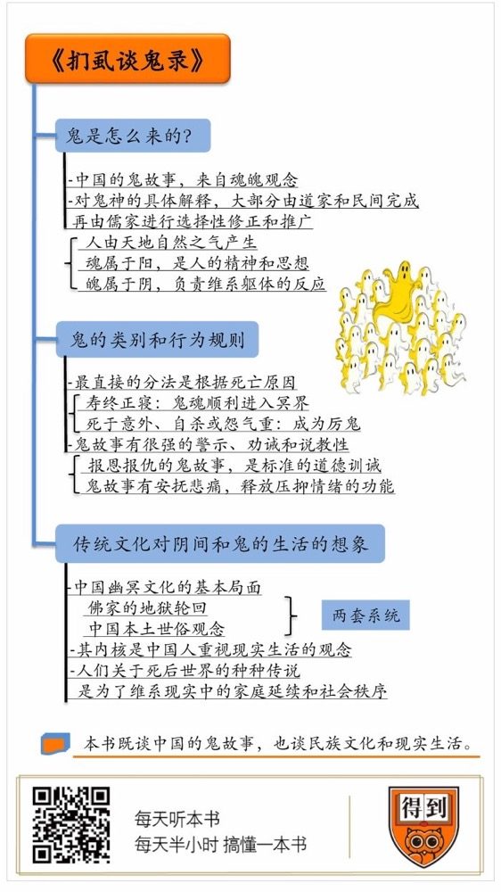

# 《扪虱谈鬼录》｜贾行家解读

## 关于作者

栾保群，知名历史文化学者，曾长期从事古典文学编辑工作，点校整理了大量历史典籍。曾出版过《中国神怪大辞典》《中国神谱》《历史上的谣与谶》等幽冥文化专著，被称为“当代谈鬼第一人”。

## 关于本书

本书专门讲解了中国的鬼神和幽冥文化，作者将深厚的考据功力融汇在轻松的讲述之下，从古代魂魄观念、鬼的分类和行为、幽冥世界的发展和构成、鬼在阴间的生活等许多生动有趣的角度，讲解诠释鬼文化的发展脉络，梳理中国传统社会和现实生活的真实状态。这本书既是谈鬼说怪，更是讲述中国人和中国现实。

## 核心内容

鬼故事里记录和反映着中国社会的真相。中国人对鬼的认知，来自于古代的魂魄观念，主宰思想意识的魂构成了鬼，而魄会引起尸变。鬼故事大多有现实功能和说教劝谕作用，例如，古人对淹死鬼、吊死鬼必须拉替代的说法，其实是为了警告人们远离危险、不要轻易自杀。中国的阴间是由佛教的地狱轮回和本土的世俗延续这两套概念组成的，主要承载的是中国人重视现世的观念。人们对死后世界的种种传说，是为了维系现实中的家庭延续和社会秩序。

## 前言

你好，欢迎每天听本书。今天我为你解读的是《扪虱谈鬼录》。这是本很有意思的传统文化笔记，专门讲中国的鬼怪和阴间世界。

人对鬼神的想象，来自于解释世界的冲动。听一个民族的鬼故事，就像听一个人讲述他的梦境，只要留意观察，就能发现他隐藏在日常表象下的心理秘密。当然，我们爱听鬼故事，主要还是因为它吸引人，好奇心和恐惧感是最强烈、最原始的情绪。在鬼故事面前，我们重新变得像孩子一样天真。

不知道你发现没有，中国的鬼故事听得越多，就会越迷茫：这些故事对鬼和阴间的描述，说法不一，彼此矛盾，接不到一块儿去。这本《扪虱谈鬼录》，把这些矛盾和联系说得很清楚。它搜集了从先秦至清代的各类古籍，用很多有趣的主题，讲述了鬼怪传说和阴间世界的发展渊源。书名里的“扪虱”，意思是一边抓虱子一边说闲话，是个谦虚幽默的典故。

本书作者栾保群，是当代知名的文化学者，也是位资深古代文学编辑，点校整理过很多历史典籍。他的研究方向挺冷门的，专搞中国幽冥文化课题。幽冥这个词的意思是一片昏暗，既看不见也听不见，后来就成了地府和阴间世界的代称。栾保群编写过《中国神怪大辞典》《中国神谱》《历史上的谣与谶》这些幽冥文化专著，被称为“当代谈鬼第一人”，他的文字潇洒，见解通透，把很强的考据功力融汇在轻松的讲述之下。

《扪虱谈鬼录》既是在谈中国的鬼，也是谈中国的民族文化和现实生活。借着解读这本书的机会，咱们可以把从小听过、看过的鬼故事都翻出来，解决掉几个长期的困惑：鬼是从哪儿来的？鬼和鬼有什么分别，按照什么规矩活动？中国的阴间世界大体是什么样的，鬼怎么在阴间生活？更重要的是，我们知道这些有什么现实意义？

## 第一部分

那就先打头讲讲鬼是怎么来的。你可能会说，鬼不就是死人变的吗？没这么简单，鬼的来历决定了很多现象，比如说，为什么有的人死后会闹鬼和诈尸，有的人就不会？昏迷不醒的人会不会变成鬼呢？

这就要说到中国文化里的魂魄观念了。说实话，中国人是不太关心灵魂问题的，所说的魂，几乎就是指死后的鬼魂。大多数民族都相信，人的肉体内居住着灵魂，肉体死亡以后，它会继续活动，这种想象来自于梦境，或者酒精之类的迷幻经验。不过，中国的魂魄观念要比一般民族的灵魂说复杂。你一定听过李商隐一首咏贾谊的绝句，后两句是“可怜夜半虚前席，不问苍生问鬼神”，惋惜汉宣帝不向贾谊请教治国安邦的正经事，空谈了一宿的鬼神问题。其实，从先秦到汉代，有关鬼的问题，还真就是事关重大、会被写进正史里的正经事。

春秋时期郑国的贵族子产，是孔子最推崇的政治家，儒家经典专门记载过他谈论鬼魂的一番话。当年，郑国的都城在大白天闹鬼，一个死去了七八年的贵族在街市上显形，向仇人复仇。子产在国事访问里专门解答了这个问题，他说，人死后，游魂不会马上消散，如果生前已经气息衰弱，魂灵也会很快耗尽，但如果是突然或意外死亡，魂灵就比较强盛，匹夫匹妇横死，都会变成害人的厉鬼，何况是含恨而死的大贵族呢？这番话影响了中国知识分子几千年。

其实，儒家对魂魄和鬼神的态度很暧昧：一方面，儒家一直在和从商代流传下来的崇拜鬼的观念斗争，认为社会沉迷于这类话题，就无法推行理性的等级社会制度，必须要把它清除出政治领域；另一方面，否定鬼神存在，又没法确立君权神授和崇拜祖先的孝道——假如承认人死了就什么都没有了，那为什么还要守孝、还要搞祭祀，还要继续遵守祖宗定的规矩呢？所以，对这类话题儒家一直采取实用主义态度，不做明确判断。

对魂魄的具体解释，就大部分由道家和民间来完成了，再由儒家进行选择性的修正和推广。这套观念基本上是这样的：人是由天地自然之气所产生的，天气生出了魂，魂属于阳，就是人的精神和思想；地气生出了魄，魄属于阴，负责维系躯体的反应。道家认为，魂是善的，有思想能力，魄是恶的，没有思想能力。鬼是由魂形成的，而诈尸或者僵尸，是只有魄没有魂的身体，不能进行思想和感情交流，所以，尸变和闹鬼完全是两码事。

我们常听的“三魂七魄”，是南北朝时候道士的修炼理论。这种修炼法叫“炼三魂”，让魂离体升天，留下魄来看守躯体。这也能解释长期昏迷现象了，昏迷就是魂离开身体而只有魄留守。三魂七魄的说法，很快就被民间传说加以具象化了。在一些鬼故事里，人有三个和自己长得一模一样的魂，魂的思想、感情和记忆也都和本人一样，能代表本人去阴间受审，阴间拘走了三魂中的两个，剩下的那个变成了在人间出没作祟的鬼。

唐代一则志怪故事说，长安城里有个善于占卜算卦的术士叫柳少游，一天来了一个客人，请他推算自己还有多少阳寿。柳少游布卦后说，“这一卦太不吉利了，您今晚就会离世。”客人悲叹着走了。仆人在客人走后说，刚才他在献茶时看到了诡异的一幕：屋子里竟然有两个柳少游在说话。柳少游这才知道原来那个客人就是自己的一个魂，果然他在当夜就死掉了。这就是个标准的采用三魂说法来编的鬼故事。

民间有种说法叫“吓掉魂了”，说的也是这类现象。好几部明代的笔记都记载了明太祖朱元璋的一件事迹：有一天，他被一个突然出现在面前的扫地太监给吓了一跳，生气地命人把太监拉到金陵闹市里斩首。围观的人群亲眼见到，在法场上，从那个跪着的太监身体里，站起来另一个太监的影子飘走了，这就是被吓掉了的魂。正在这时，圣旨又到了，赦免了这个太监。朱元璋也挺幽默的：你不是吓我一跳吗？那我也吓你一跳。但这一吓，太监从此就少了一个魂。按照过去的说法，精神疾病或者痴呆就是因为掉了魂，所以才有收魂之类的民间巫术。还有个版本说，这个太监的魂并没走远，而是混进了人群，也跟着津津有味地看死刑，这就有点儿批判味道了：看客式的麻木，居然到了可以围观砍自己脑袋的程度。

到了清代，鬼故事又发展出一套理论，说这三个魂在死后的功能也不一样：一个负责在阴间受罪，一个会被派往阳世转世投胎，还有一个守在死者的坟墓里，接受后人的祭祀。这个说法看起来既生硬又无聊，但是大有深意，它能解答民间对儒家礼法的一个困惑：如果祖先已经转世投胎去了，我为什么还要再上坟祭祀呢？在儒家看来，维持祭祀礼仪可是件有政治意义的大事。儒家有个逻辑，凡是遵守礼法的孝子，就不会犯上作乱、破坏社会安定，所以，这类说法不仅受认可，还有发展：鬼魂不仅会常驻祖坟，还要附在祠堂或者家里的牌位上，这就等于在每个家族里安了一个摄像头，时刻监督着孝子贤孙们是否遵纪守法。

说完魂，再简单说说魄。我们刚才说了，中国人崇拜祖先的灵魂，但是并不欢迎魄，认为魄是在人死后专门捣乱的，所以在丧礼中，最理想的状态是让魄安全地从尸体上散去，以免出现尸变。中国丧葬传统是逢七为忌日，一直到七七结束，就是因为在鬼神理论里，人生下来，魄是在七七四十九天里逐渐健全的，死时，七个魄也是每逢七天散掉一个，一直到四十九天散尽，只剩下一具尸体。所以古代停灵，要停满四十九天才出殡。

## 第二部分

说清了鬼是怎么来的，咱们再来说说鬼的几个主要类别和行为规则。当然，鬼故事是古人编出来的，光说鬼只是猎奇，我们要说的是古人为什么要这么编，这涉及到了哪些古代社会真相。

对鬼的分类，最直接的分法是根据死因。如果是自然死亡，也就是所谓寿终正寝，鬼魂会顺利走进冥界，进入审判、受罚或者轮回这个阴间司法体系，在滞留期里正常生活，不跑到阳间来。而死于意外、自杀或者临死时怨气很重的，就会成为厉鬼。

淹死鬼是最常见也最有代表性的厉鬼。人类早在进化初期就形成了对水的本能恐惧，民间有句话叫“远怕水，近怕鬼”，就是说出门在外时，对不了解的湖泊河流，绝不要轻易涉水进入，这是很必要的安全意识。佛教传入中国以后，民间接受了轮回概念，逐渐把鬼魂与溺水结合起来，形成了一套淹死鬼必须要再拉一个替代下水才能转世投胎的说法。古人编这类故事，不是因为愚昧无聊，而是在进行安全教育，提醒人们在危险的水边，一定要格外小心。另外，还有很多淹死鬼在水边强拉硬拽或诱骗人下水的故事，是告诫人们提防藏在水边的强盗。这些故事的传播效果，远远比插一块警示牌好。被老虎吃掉的、从山崖上掉下去的、误食了野外有毒植物而死的人，也都会化身伥鬼，要拉到替代才能投胎转世，这也都是为警告人们远离日常的危险。现在，只要遵守动物园管理规则就不会遇到老虎攻击，但在古代，丧生于猛兽之口是最常见的意外死因。

在民间传说里，吊死鬼也和这些鬼一样，也是要拉到替代才能超生的，这类故事的意义，主要是劝阻自杀。宋元以后的理学，把上吊自杀描述成一种实现节烈忠义的简易手段。理学家们倒是不直接杀人，可是像找替死鬼一样，爱变着法地劝别人自杀。在他们的描述里，改朝换代时想做忠臣，受辱以后想当烈女，用不着起诉告发、奋起抵抗，只要找根绳子上吊就行，朝廷和家乡父老会立牌坊表彰，还把他们写到地方志里，这类畸形景象成了明清流行的保留节目。

在民间纠纷里，上吊自杀也是积累道德资本的手段，在家庭纠纷或者民事纠纷里，只要拼出一死，就会让自己成为绝对受害者，把对手钉死在不利的局面上，地方官几乎都会作出有利死者的判决。这类轻视自己生命的态度和越过事实和稀泥的逻辑，在今天也屡见不鲜。这时候，吊死鬼不得超生的鬼故事，就显得用心良苦了。清代文学家袁枚在《子不语》里专门写了个鬼故事，说一代才女柳如是为保护夫家产业上吊自缢而死，竟然也成了专门引诱他人的厉鬼，害死了好几条人命。这个故事表面上很冒犯人，实际目的却是善意的：按道学家的理论，柳如是这样的才女节妇上吊后，在人间会受表彰，上天也要格外开恩，优先安排她投胎转世，或者直接封神，但袁枚故意打破了这个特权，警告说上吊会变厉鬼是连柳如是也不能例外的，千万别为贪图五星道德好评枉送性命。

除了警示和劝诫，鬼故事还有很强的说教性，最常见的情节就是报恩报仇。从明末清初开始，科举考场里有个不成文的仪式，考生入场的前一夜，试院要举行祭祀各路鬼神的仪式，不是为了驱鬼，而是召唤与考生有恩怨的鬼魂到场，军卒们会摇着旗子为这些鬼魂引路，高喊“有冤的报冤，有仇的报仇”。科举考试为书生提供了进入官僚系统的机会，而按照民间信仰，一旦做了官，鬼怪就难以侵犯了，有冤屈的鬼魂会在考场竭力阻挠他中举。考场里不避鬼神，是种很聪明的选拔策略：为国取士要德才兼备、以德为先，让鬼神自行通过报恩报仇来干预考试结果，等于完成了一轮政治和道德审查。康熙年间，有个考生的卷子莫名其妙地裂开，飞到另一个场地，考生要求换卷子重答，监考官直接拒绝说：“这里有鬼神，换卷子也没用。”

超自然现象，对人有很强的心理暗示作用。美国法院在审理案件时，会要求证人在作证前先把手按在《圣经》上发誓，根据心理学家的研究，这个程序确实很有用。对古代考生来说，效果当然更强烈了。有则笔记记载，乾隆年间在江南的一个考场，试卷刚发下来，就有考生被女鬼附体，又唱又跳，在墙上题写了“误尔功名亏我节，当初错认是良缘”的诗句，很明显，这个考生曾经背叛了一名女子，直接或间接地导致她死亡，今天女鬼来寻仇了。考生第二天清醒过来，就狼狈退场了。如果不把它当作鬼故事看，说这个考生是由于害怕鬼神复仇的心理压力而精神崩溃，是不是也说得通？

还有种恩怨是前世的经济纠纷。民间有句俗话叫“无债不成父子”，也就是说父子关系就是上辈子的债务。《聊斋》里有个故事：有人梦见一个人闯进来说“你欠我四十贯钱，现在该还了”，这时候，他老婆生了个儿子，他就知道这个儿子是个专业讨债的，于是存了四十贯钱，到这笔钱花完，孩子就死了。这种故事不只是警告“老赖”用的，而且有一种特殊的安抚作用：“白发人送黑发人”是人生最大的感情痛苦，如果不幸遇上了，有这么一套虚构的债务关系理论来缓解自己的悲痛，也是有效果的。普通中国人很难从信仰和思辨里获得情感慰藉，就得靠这么一种简易世俗的方法了。

鬼故事对现实的另一种关照形式，是“生有拘束，死无禁忌”。清代的思想禁锢最严格，各种鬼故事也就最流行，这些故事表达的主要是被压抑的思想情感。在《聊斋》故事里，人一旦变成了鬼，就可以不再受什么门第、礼教、法制的约束，大胆地追求恋爱和婚姻自由，可以无所顾忌地向人间的恶霸酷吏复仇。夸张一点儿说，在当时的各类文字里，几乎只有鬼故事才传达人性。

## 第三部分

从咱们刚讲的这些鬼故事里，你也看出来了，鬼的行为规则其实就是人间的延伸影射。中国幽冥文化的基本局面就是如此：同时存在着佛家的地狱轮回和中国本土世俗观念这两套系统。

在先秦，人们认为死后世界和人世间是相通接壤的，后来逐渐产生了天界在人间之上、冥界在地面以下的概念。死人在地下的生活也和地上基本一样，所以要在坟墓里埋很多生活用品、珠宝钱币当殉葬品，一度还有活人殉葬制。阴间和阳间也没有固定的界限，在魏晋的鬼故事里，还有死人被埋到地下几十年又复活了的情节。佛教传入中土后，地狱的观念和景象，通过细致的宗教画、通俗押韵的变文开始在民间普及，道家也参与了进来，和中国本土的幽冥文化一起拼接成复杂的阴间世界。

比如说，民间传说阴间有座奈何桥，是一条难走的独木桥，架设在苦海上。在更早的唐代传奇里，这个名字不是桥，而是一条叫奈河的血污之河。而奈河原本的意思，既不是河也不是桥，而是梵文里“地狱”的音译，也就是说，奈河就是地狱，桥和河都是附会出来的。望乡台、恶狗村之类的阴间景点，也都是这样发展出来的，在不同故事里的说法都不一样。

再比如，关于阴间就在四川酆都的说法，也是由讹传形成的。两晋时期，道士们为了和佛教抗衡，又设计出一套冥府机构，安排汉高祖刘邦、三国的孙策、徐庶等等一百多个帝王将相充当冥界官吏，地点就设在一个叫罗酆山的地方。罗酆山是存在于虚无中的，据道家典籍里记载，它的方圆是三万里，高有三千里，位于长江边上的丰都县，怎么可能装得下这么一座山？

今天民间对阴间的具体印象，来自一本叫《玉历宝钞》的通俗小册子，这本书出现于清中期，表现出的阴间世界是三教九流的大杂烩。本来是佛教系统里的十殿阎王，被安排了一个道教的酆都大帝做顶头上司，当时还要向地藏王汇报工作。所以，越梳理历朝历代对阴间的说法，情况就会越乱。

这个成分复杂的系统，内核仍然是中国人重视现实生活的观念。基督教认为，死后世界和现实世界截然不同，人在现世和罪捆绑在一起，信徒所追求的是灵魂得救，进入完全圣洁的天国。佛教把地狱描写得那么可怕，是为了说明轮回和现世都很痛苦，人需要从中超脱出去。而中国人觉得，要是能顺利通关，再次托生为人，就像在春运时抢到一张火车票，是很理想的结果了，很少有人真会对极乐世界感兴趣。

中国人对死后生活的想象，一直是非常世俗化的。在鬼故事里，鬼魂在阴间过着和阳世差不多的生活。阴间同样流通货币，这些货币来自后代烧的纸钱。纸钱可以在阴间消费，也可以买通冥府里的鬼差和官员，用于行贿和打通关节。鬼魂到阳间作祟时，会使用障眼法拿纸钱当真钱花。鬼魂也同样有吃饭穿衣需要，所以子孙要在丧葬期间烧纸衣、送冥器，今后得定期上坟或在家供奉。在鬼故事里，鬼享用祭品的方式也有变化，在魏晋时期的故事里，鬼真的能够把酒肉吃掉，后来改成了鬼只吸收食物的精华，类似于吸收掉食物上空的一股热气。这个道理很简单，因为上供结束以后供品并不会减少。而那些没有后人祭祀的饿鬼，会在阴间永远游荡，找机会偷些食物果腹。

这些好像很琐碎的说法，其实和前面说到的鬼魂附身在牌位上一样，都是儒家礼法对世俗的干预和规范。世俗的孝道，不仅仅是生前赡养，也包括死后祭祀。有的鬼故事提到，“人得一饱，可耐三日；鬼得一饱，可耐一年”，这就是委婉地提示人们：祭祀祖宗，至少得一年一次，否则祖宗就要在地下挨饿。

鬼故事有个基本守则，这个准则是特别重要、不能动摇的，就是鬼魂只能享用直系后代香火，接受不了外姓人祭祀。东汉有个故事，说一个人有能看见鬼的特异功能，他的上司就派他查看自己家祭祀的情况。只见上司的儿子上香跪拜以后，登上祭坛大吃大喝的，却是一个不认识的屠夫模样的人，那些穿着官服的本家祖宗，都在屋檐下面彷徨徘徊。他的上司逼问老婆才知道，当年他老婆生的是个女孩，怕丈夫不高兴，才和一个屠夫家的男孩调了包。现在，你就知道传统观念为什么对生儿子有这么深的执念了吧？所谓“不孝有三，无后为大”这类话，在民间的理解里，就是一旦绝了后嗣，整个家族的祖先都会变成孤魂野鬼，要在地下永远忍饥挨饿。

从儒家的立场来看，这套说法很聪明很实用，如果你去对普通人讲三纲五常，他根本就不感兴趣，要是拿死后会变成饿鬼来威胁他，他就非常重视了，他的妻子也会积极配合。在儒家礼法里，如果正妻生不出儿子，男人就要纳妾；纳妾也生不出儿子，就要在本族中过继一个儿子。这套由人伦和鬼话共同看管的规范，维系了古代家族的延续和秩序。

你看，当我们讲鬼故事时，说来说去，原来是在讲这些很现实的东西，真把它们清理出来以后，显得有点儿扫兴。我的个人阅读口味是：一个好的鬼故事，可以不理睬任何意义，专注于把故事讲好听就足够了。魏晋和唐代的志怪故事，因为阴间架构还不完善，而且没有经过这类观念驯化，大多是只反映神秘未知世界的鬼故事，虽然多数都不完整，但却更神秘、更好看，更接近艺术的天真本质。

当代恐怖幻想小说有个流派，代表人物主要是美国和日本作家，他们创立了一个叫“克苏鲁神话”的架空体系，基本观念就是：宇宙中存在着强大到超乎想象、无法探知的恐怖力量，在这些存在面前，人类是毫无意义和价值的。我觉得这种听上去消极的设定，反倒代表着20世纪的科技成就。人们在新探索中发现，原来世界如此浩瀚、物质如此微茫，就像苏格拉底一样，终于知道自己是多么无知了。

未知总是引起恐惧，人类就是伴随着这样的恐惧一路过来的，未知世界也是无从建立意义的。古代中国人的一个毛病，就是总认为掌握了终极真理和万用法门，总要为新出现的、尚不明确的事物赋予意义，所以鬼故事也越来越不好听。前途未卜，意义不明，同时又充满了惊奇感和行动力，这才是文化有活力的表现，你觉得呢？

## 总结

本期内容差不多就是这些，我们再来回顾一下，本期一共聊到了三个话题。

第一，中国的鬼故事，来自于魂魄观念。魂主宰思想意识，魄指挥身体。离开身体的魂构成了鬼，魄没有散去的尸体，就会出现尸变。由于道家的修炼学说，民间普遍接受了三魂七魄的说法，关于吓掉了魂、招魂、叫魂等等说法，都来源于此。

第二，我们通过鬼的行为规则，分析了鬼故事后面的古代社会现象。古人对淹死鬼、吊死鬼必须拉替代的说法，其实是出于警告人们远离危险、不要轻易自杀的善意。报恩报仇的鬼故事，是标准的道德训诫。另外，鬼故事还有安抚悲痛、释放压抑情绪的功能。

第三，我们讲了传统文化对阴间和鬼的生活的一些想象。中国的阴间是由佛教的地狱轮回和本土的世俗延续这两套概念组成的，主要承载的，还是中国人重视现世的观念。人们对死后世界的种种传说，是为了维系现实中的家庭延续和社会秩序。另外，我个人觉得鬼故事没必要都有意义，能满足和传达恐惧和好奇的故事，就是好故事。

撰稿：贾行家

脑图：摩西

转述：宝木