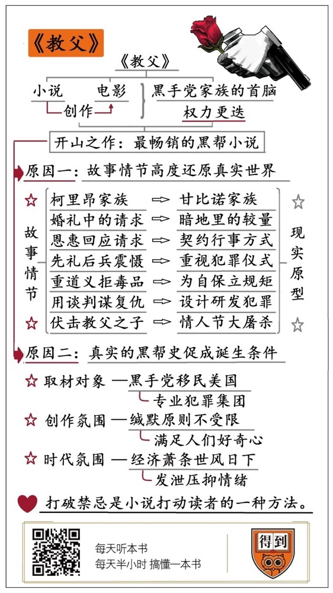

# 《教父》| 李南南解读

## 关于作者

马里奥·普佐（1920—1999），生于纽约。1955年普佐出版了他的小说《黑暗的剧场》，故事背景是被占领的德国。1965年普佐出版了小说《幸运的流浪者》。由于普佐负债累累，45岁那年他决定要做一个畅销书作家，接受传统作家写法去赚一大笔钱，这样他写出了《教父》这本书。这本书使他赚了一百万美元，并改编成电影。电影拍出后，获六项学院奖。

## 关于本书

《教父》出版于1969年，半个世纪以来，被翻译成37种语言，畅销全世界。《纽约时报》曾经断言，《教父》将永远畅销下去。1972年，《教父》搬上大银幕。原作者马里奥·普佐担任编剧，科波拉担任导演。次年的奥斯卡，影片斩获了最佳男主角、最佳影片、最佳改编剧本，成为当年奥斯卡最大赢家。2007年，《教父》被美国电影协会评为“百年百佳电影第二名”。

## 核心内容

《教父》讲述了一个发生在黑手党家族里的，权力更迭的故事。老教父遭受暗算，他的儿子复仇，摆平了所有仇家，接班成为新一代的教父。其中，教父这个称谓，指的就是黑手党家族的首脑。英文是“Godfather”，也就是上帝和父亲这两个词的组合。同时，在情节设计上，小说高度还原了真实世界里黑手党。再加上当时美国的社会环境，人们需要这样的作品，来发泄压抑的情绪。这些因素都决定了，《教父》将成为一部独一无二的著作。

## 前言

你好，欢迎每天听本书。

今天为你解读的，是美国出版史上最畅销的小说之一，马里奥·普佐的著作，《教父》。

《教父》出版于1969年，半个世纪以来，被翻译成37种语言，畅销全世界。《纽约时报》曾经断言，《教父》将永远畅销下去。1972年，《教父》搬上大银幕。原作者马里奥·普佐担任编剧，科波拉担任导演。次年的奥斯卡，影片斩获了最佳男主角、最佳影片、最佳改编剧本，成为当年奥斯卡最大赢家。2007年，《教父》被美国电影协会评为“百年百佳电影第二名”。顺便说一下，第一名是1941年的《公民凯恩》。这部电影很特殊，因为它有很大的开创性意义，业内普遍把它当做现代好莱坞的起点。后面的电影就算再好，排名也不可能比它高。所以，在影迷中也有另一种说法，认为《教父》才是有史以来最伟大的电影。

那么，《教父》的小说和电影，到底哪个更出色呢？其实，这个问题根本没有争论的必要。因为《教父》的电影和小说，从一开始就是一体的。这得从作者马里奥·普佐的身世说起。普佐是一个意大利移民，从小爱好文学。在20世纪初的意大利移民里，有大量的黑手党分子。普佐一直觉得，他们的故事，非常适合写成小说。但是，一直没想好怎么写。

后来，普佐沉迷赌博，欠下大笔赌债。情急之下，他决定试一把，把黑手党的故事写出来，卖给好莱坞的派拉蒙影业，用稿费偿还赌债。1968年，普佐拿着故事提纲，找到了派拉蒙的高管，结果对方并不是很上心。给了普佐1万多美元的预付稿酬，跟他说，先回去把小说写完，然后再来谈电影。这个只有几页提纲的故事叫作《黑手党》。一年之后，普佐把它写成了小说，并改名《教父》。小说出版之后，火得一塌糊涂。同时，派拉蒙的竞争对手，环球影业也找到了普佐，想买下小说的改编权。直到这会儿，派拉蒙才意识到，自己捡到宝了。他们快马加鞭，把电影拍了出来。

所以，从最开始，《教父》很大程度上，就是一部为电影而创作的小说。二者的故事完全一致。只不过，电影因为时长和分级限制，把一些细节一笔带过，并且隐去了一些情爱描写。好莱坞影星汤姆·汉克斯说过，《教父》是男人的圣经，是智慧的总和，是一切问题的答案。前黑帮头目，后来成为 FBI 线人的亨利·希尔说过，他曾经看过无数遍《教父》。但是，以他自己为原型，拍摄的另一部黑帮片《好家伙》，他一次都没看过。

那么，《教父》到底伟大在哪呢？假如用一句话总结，《教父》，奠定了黑帮文学的叙事风格和美学基础，是现代黑帮小说和电影的开山之作。几乎全世界的黑帮片，比如《无间道》《英雄本色》《美国往事》等等，都或多或少受到了《教父》的影响。

但是，这也引出一个疑问。你看，《教父》讲的是黑手党移民美国之后的故事。而在西西里，黑手党已经存在了至少几百年。为什么在这几百年里，意大利却没有出现《教父》这样的小说？要知道，这个国家的文学基础并不差，欧洲文艺复兴运动的曙光，就是在意大利出现的。而且在美国，黑手党直到20世纪初才形成规模，和19世纪就已经壮大的爱尔兰黑帮、犹太黑帮比起来，他们算是晚辈。那么，其他黑帮的故事，为什么无人问津呢？

要想解答这个问题，我们把《教父》还原到真实的黑帮史上。你会发现，《教父》的诞生，其实是一系列偶然造就的结果。马里奥·普佐恰好生活在黑帮史上，最特殊的一个时期，一部黑帮小说需要的所有要素，都恰好在这个时期出现了。这些要素成了普佐的取材对象，促成了《教父》的诞生。

接下来，我将给你带来两部分内容。第一部分，我们介绍一下《教父》这个故事本身。说说它在现实世界中的原型。第二部分，我将把《教父》还原到真实的黑帮史上，说说它到底是怎么诞生的？把这两部分内容连在一起，你就明白，《教父》为什么会成为20世纪最畅销的小说之一。

## 第一部分

首先，第一部分，我先给你讲讲《教父》这个故事。

假如用一句话概括，《教父》讲述了一个发生在黑手党家族里的，权力更迭的故事。老教父遭受暗算，他的儿子复仇，摆平了所有仇家，接班成为新一代的教父。其中，教父这个称谓，指的就是黑手党家族的首脑。英文是“Godfather”，也就是上帝和父亲这两个词的组合。

故事发生在20世纪40年代的纽约，二战刚刚结束。当时，现实中的美国有很多黑帮组织。这些黑帮共同组成了全美黑帮协会。协会的最高权力，由纽约的五个黑手党家族掌控。在五大家族里，势力最大的，是甘比诺家族。《教父》中的柯里昂家族，原型就是甘比诺家族。顺便一说，这个家族今天仍然存在。2015年，当时甘比诺家族的教父还向恐怖组织 IS 喊话，说只要他们还在纽约，IS 就别想在这里开分店。

《教父》的故事从一场婚礼开始。柯里昂家族的教父叫维托·柯里昂。他有三个儿子，大儿子桑尼，脾气暴躁，像个火药桶，一点就着。二儿子叫弗雷德，性格胆小懦弱。唯独小儿子麦克，上过大学，参过军，继承了父亲维托的聪明冷静。但是，他却从不参与家族的生意。这天，是维托女儿的婚礼。到场的宾客把柯里昂家族的庄园填得满满登登，比舞会还要热闹。来宾里什么人都有，有好莱坞的电影明星，有依附于柯里昂家族的黑帮，也有接受家族庇护的生意人。

说到这，你可能会问。一部黑帮小说，为什么要以婚礼作为开场呢？在当时人们的想象里，黑帮故事应该充满枪战、暴力、尔虞我诈，开场应该很刺激才对。其实，这正是《教父》的特别之处。小说里有一句话，叫“地狱血流成河，而他不必在场”，是对这种叙事方式最好的诠释。意思是，一切的血腥、诡计、杀戮，都是在暗地里展开的。

咱们回到这场婚礼。表面上看，宾客是来祝贺的。但是，其中有不少人，都遇到了麻烦，而且这些麻烦没法通过法律解决。他们想趁这个机会，来恳求维托·柯里昂帮忙。他们知道，维托是个老派的西西里人。而西西里人有个传统，他们不会在自己女儿结婚这天，拒绝任何请求。

小说的前1/4，就围绕这些请求展开。比如，一个棺材铺的老板，女儿被两个富家公子强暴。这两个公子哥买通了法官，被判无罪。他希望维托替他主持公道。再比如，好莱坞的影星，事业走下坡路。他看中了一个角色，只要能出演，事业就能重回第二春，但电影公司的老板却百般阻挠。

作者通过描写维托回应这些请求的方式，从侧面刻画了维托这个角色，以及柯里昂家族的行事作风。比如，维托对棺材铺的老板说，假如你愿意称我为教父，你就会获得我的友谊，我会还你公道。但是，相应的，你欠我一个情。也许有一天我会找你帮个忙，也许不会。在这一天到来之前，请收下这份友谊。

你看，这段台词，处处渗透着契约精神。其实，这正是真实的意大利黑帮的行事方式。在意大利黑帮里，通用的货币不是钱，而是恩惠。说白了，就是情分。你帮我，我帮你。柯里昂家族也靠这种方式，汇集了大量的资源。你可以把它看作是一个联通黑白两道的资源平台，很多富商、议员、政客都欠柯里昂家族的情。只要维托一句话，他们就不能拒绝。

当然，维托也很守承诺，他派打手教训了那两个公子哥。而对待明星的请求，他先礼后兵。先是派人去和电影公司的老板谈判。对方拒绝之后，再派出杀手。而且，你肯定想不到，杀手会怎么做。不是去直接拿着刀子威胁这个老板，而是把他最心爱的马杀了。把马头割下来，放到正在熟睡的老板的被窝里。老板醒来，发现被窝里有一个血淋淋的马头，吓得魂飞魄散，马上就答应了维托的要求。

你看，这其实和现实中的黑手党作风很像。和其他犯罪团伙不同，现实中的意大利黑手党，很重视犯罪的仪式感。比如他们会在杀完人之后，像判官一样在现场留下字据，说明这个人犯了什么错，为什么会被杀。再比如，有的黑手党会把尸体全身的骨骼打碎，塞进酒桶里，并且故意丢弃在闹市区，来震慑别人。

当然，维托·柯里昂也不是什么要求都答应。在婚礼结束之后，他接到了一个请求。对方是一个刚刚来到美国的毒贩子，想借助维托的资源渠道，打开纽约的毒品市场。作为回报，他会分一部分利润给维托。这是一项非常赚钱的生意，一年至少能赚三四百万美元。但是，面对巨大的诱惑，维托还是拒绝了。因为柯里昂家族的规矩是，不碰毒品。

你可能会觉得，这只是普佐虚构出来的，盗亦有道的桥段。其实，在现实世界里，美国黑帮协会确实有这个规定。但不是出于道义，而是为了利益。1920年，美国实施了长达十年的禁酒令，期间大量的黑帮通过酒品走私，赚到的钱几辈子都花不完。按说，钱赚到了，大家应该满足才是。但是，偏偏有一些不识趣的人，非要去搞一些枪杀、毒品之类的勾当。这就触怒了当时的美国政府，胡佛总统曾经亲自下令，要根除黑帮。为了自保，美国的24个黑帮家族，召集了全美黑帮峰会。会上确定了三条规矩：不贩毒、不杀警察、不内讧。总之，一切能惹毛政府，或者触犯众怒的事情都不做，只要闷声发大财就好了。

但是，禁酒令结束之后，走私酒这条财路也就不存在了。很多帮派蠢蠢欲动，重新打起了毒品的主意。现在，回到小说，这个来主动找维托·柯里昂的毒贩子，其实早就和其他几个家族达成了协议，他们早就串通一气要贩毒。但是，又害怕被警察抓住，所以想借柯里昂家族在政府的资源，作为保护伞。

这些小把戏，当然瞒不过维托。维托知道自己拒绝之后，其他家族会找自己的麻烦。但是，他没想到，麻烦会来得那么快。而整个柯里昂家族的命运，也因此发生了天翻地覆的改变。

在拒绝毒贩之后，其他五大家族派出杀手。圣诞节前夕，趁维托在路边买水果的时候，朝他的后背连开几枪。维托身受重伤，昏迷不醒。维托昏迷期间，大儿子桑尼当家作主。前面说过，桑尼是个火药桶。眼看父亲受伤，他马上向其他家族宣战。派出了几百个杀手，天天去街面上巡逻。原本相安无事的纽约，从这个圣诞节开始，风声鹤唳。

其他家族眼看事情不妙，开始盘算着和谈，希望能跟柯里昂家族和解。但是，桑尼却有另一番打算。他想借着和谈的机会，干掉仇家。那么，谁来动手呢？柯里昂家族的每个男人都是老道的黑帮，仇家会对他们严加防范。全家上下的成年男丁，只有小儿子麦克从来没有参与过家族生意，没有任何帮派经验。仇家也知道这点，不会对他那么警惕。所以，麦克将代表柯里昂家族参加和谈。当然，和谈只是幌子，真正的目的是干掉对方。

这次谈判，是《教父》这个故事的高潮，也是黑帮文学史上，最精彩的桥段之一。柯里昂家族知道，对方一定会搜身，不能把枪带在身上。怎么办？麦克想了个办法。由柯里昂家族先确定谈判地点。他们选了个意大利餐厅，然后，提前把手枪藏在餐厅厕所的水箱后面。等谈判到一半时，麦克找机会去洗手间。把枪拿取出来，干掉对方。在行动之前，家族里的长辈嘱咐麦克。从厕所里出来后，马上开枪。记住，朝每个人的头上开两枪。开完枪之后，不要跑，因为奔跑会引起别人的注意。一定要用走的，快步离开餐厅。注意，不要和任何人对视，也不要表现出胆怯。只要你表现得自然些，没人敢盯着你看。

你看，这段剧情，和以往的犯罪场景很不一样。柯里昂家族，在像设计一项精密的工程一样设计犯罪。每一个环节都反复推敲，而且不掺杂任何情感。感觉他们不是在策划谋杀，而是在设计大楼施工图一样。其实，真实的意大利黑手党，就是这么做的。这得从意大利的国情说起。意大利曾经长期分裂，国家职能缺失，监狱人满为患。国家只能把多出来的罪犯，流放到意大利南部的岛上。而其中最大的一个岛，就是黑手党的发源地，西西里。同时，这些岛也成了犯罪的研发基地。罪犯在岛上，每天都在钻研犯罪的技巧。他们已经习惯了像设计工程一样，去设计犯罪。

回到《教父》的故事。这次谈判，是整个故事的分水岭。维托受伤，标志着老一代权力的衰落。而麦克报仇，标志着新一代权力正在萌芽。

复仇之后，为了保护麦克的安全，家族把他送回了西西里老家。老教父维托出院，但身体大不如前，家族的事情，继续交给大儿子桑尼打理。当然，这场火并没有就此结束。

还记得开篇说过，维托有个女儿，也就是桑尼的妹妹吗？其他家族的人，买通了这个妹妹的老公，让他殴打妹妹。挨打之后，妹妹肯定会向桑尼诉苦。而桑尼是个暴脾气，一定会第一时间去找自己的妹夫算账。五大家族的杀手，就埋伏在桑尼前往妹妹家的路上。他们用冲锋枪，把桑尼的车子，连同桑尼一起，打成了马蜂窝。这个桥段，取材于一个真实事件。这就是曾经震惊全美国的，由号称“芝加哥之王”的阿尔·卡彭发动的情人节大屠杀。有关这段故事，你可以去听我解读的另一本书，叫《美国黑帮》。

桑尼刚死不久，躲在西西里的小儿子麦克，也被杀手找上门。杀手在他的车里安装了一枚炸弹。但没有炸死他，却炸死了他的妻子。

眼看着两个儿子相继出事，老教父维托终于妥协了。他主动发起和谈，跟其他五大家族的首领，定下了和平协议，并且同意为他们的毒品生意提供支持。和谈结束后，麦克回到了美国，并继承了教父的位置。老教父维托正式退休。但是，此时此刻，麦克只是继承了教父的名分，权力的根基很不稳。这也是柯里昂家族最艰难的时刻。其它家族想趁机吞掉柯里昂的生意。而柯里昂家族内部，也出了奸细。

接下来的故事，就是新任教父麦克指挥柯里昂家族，和其他五大家族开战。从这里开始，麦克的人性分裂成了两面。一面是杀伐果断的黑帮头目，一面是宽容可靠的家族教父。他一面用仁厚的姿态，去处理家族内部的关系。一面又用凶悍的手段，杀掉外面的仇家。在小说里，作者花了很大的篇幅，描写这场黑帮大战。但是在电影里，这段故事被大大压缩，只占全片的不到1/4。这是普佐和导演一致同意的改动。他们都认为，《教父》要表现的重点是一个家族的故事，而不是黑帮之间的仇杀。

最后，麦克赢得了这场战争，干掉了其他五大家族的首脑。肃清了家族内部的奸细。其中还包括他的姐夫。当家人质问麦克，到底有没有杀死姐夫时。麦克冷静地回答，没有。眼神当中没有一丝愧疚。因为他知道，自己的身份是柯里昂家族的教父。而在教父眼里，家族高于一切，任何背叛，都不能容忍。

同时，麦克已经意识到，要想永久的避免纷争，就必须彻底从黑道生意中脱身。他决定，放弃黑道的生意，让家族的事业走上正轨。在后来的几年里，柯里昂家族在麦克的操办下，离开纽约，前往拉斯维加斯，从事赌场生意。而老教父维托，退休后没多久，就心脏病突发去世了。发病时，他正在跟自己的孙子在花园玩耍。他倒下时，孙子以为他在开玩笑，还围在他身边奔跑嬉笑。换句话说，维托是在孙儿的笑声中，离开这个世界的。对一个黑手党家族的教父来说，这也许是最好的结局。

以上就是第一部分内容。我们介绍了《教父》这个故事本身，还有它在真实世界中的原型。接下来第二部分，我们跳出故事，回到真实的黑帮史上，说说《教父》到底是怎么诞生的？前面说过，《教父》恰好集齐了一个优秀的黑帮故事，需要的所有条件。包括取材对象、创作氛围和时代氛围。

## 第二部分

先说第一个，取材对象。1922年，墨索里尼出任意大利首相，开始大范围清除黑手党。很多黑手党成员，被迫离开意大利。当时，正好赶上美国的第三次移民潮，大量外国移民涌入，这给了黑手党一个新的选择。美国也就成了黑手党分子的首选。显然，假如没有这次清扫行动，黑手党就不会在美国壮大，普佐也就没了取材对象。

同时，这里面还有另一个疑点。当时美国的移民潮，催生了很多外国黑帮。比如爱尔兰黑帮，是早期最大的帮派，它难道就不能成为小说的取材对象吗？不是不能，而是不合适。爱尔兰黑帮，其实就是一群地道的爱尔兰农民。1845年，爱尔兰的马铃薯染上了枯萎病，导致大范围的饥荒。他们为了一口粮食逃荒到了美国。后来又在一些腐败的政客唆使下，组成了帮派，为政客卖命。同时，他们的犯罪手法，也很简单粗暴。在他们看来，最高级的犯罪，就是拿着冲锋枪扫射。而在意大利黑手党看来，这种做法跟没文化的暴发户没什么区别。

比如，当时最大的爱尔兰黑帮叫死兔帮。他们的标志，是一个鲜血淋漓的死兔子。看起来是不是很吓人？但是，你要是知道这个名字的来历，就不会这么想了。最早，爱尔兰黑帮因为脾气暴躁，人高马大，给自己取了个绰号，叫暴躁的大块头。注意，这个名字是用爱尔兰语发音的。恰好，这个发音，和英语里的死掉的兔子，特别像。爱尔兰人觉得，死兔这个名字好像更酷，就把死兔帮，作为帮会名称。而且他们还会在自己的地盘上，找个显眼的地方，挂上一只死兔子。

其他的帮派也是类似的情况。在黑手党看来，这些同行不是太土，就是不够酷。说白了，就是太业余。只有黑手党，是有着悠久历史的专业犯罪集团。他们有着严密的组织信条，和强烈的犯罪仪式感，自带故事属性。这是催生《教父》的第一个因素，黑手党移民美国，给作者提供了最合适的取材对象。

第二个因素，是创作氛围。你可能一直觉得奇怪。黑手党在意大利已经存在了那么多年，为什么没人写？其实，不是不想写，而是不敢写。意大利黑手党有一个至高无上的信条，叫缄默原则。任何人，敢谈论帮派的任何事，都会遭到灭门之灾。后来，黑手党到了美国。一来，这不是自己的地盘。二来，美国政府不像意大利那么无能，不会坐视不管。所以，他们对缄默原则，也就没法彻底贯彻了。

换句话说，《教父》这部小说，可以说恰逢其会。因为在普佐这个年代之前，美国还没有出现规模化的黑手党组织，普佐没有取材对象。同时，在意大利本地，缄默原则恐吓着人们，让人不敢染指黑手党题材。这就导致，在此之前，世界上一部黑手党题材的小说都没出现。而《教父》，也就成了这个题材的开山之作。它极大限度的满足了人们对黑手党的好奇。当然，《教父》之所以畅销，也跟当时美国特殊的社会环境有关。这就是接下来要说的第三个因素，时代氛围。

《教父》诞生于1969年。当时，恰好赶上美国经济大萧条，失业率居高不下，许多家庭没了收入来源，有的甚至因为还不起贷款，被银行收回房产，无家可归。

越来越多的年轻人，对未来感到迷茫。曾经人人挂在嘴边的“美国梦”，遭到了前所未有的质疑。

在这种充斥质疑、前路不清的时代氛围里，美国诞生了一大批带有浓重批判色彩的电影作品。比如1967年的《邦妮和克莱德》，讲述了一对雌雄大盗，浪迹天涯的故事。他们抢劫了很多银行，其中有不少次只是为了发泄。再比如1969年的《逍遥骑士》。讲述了两个美国小伙子，骑着哈雷摩托走遍美国，寻找美国梦的故事。但一路上，他们却看到很多跟他们一样，对美国梦感到迷茫的人们。比如在教堂里经营色情生意的老鸨，整天和大麻为伴的嬉皮士等等。当然，这批电影中最杰出的作品，就是1972年的《教父》。

表面上看，《教父》讲的是黑帮的故事，其实其中处处流露出对政府的不信任。比如开篇的棺材铺老板。假如法官公正，他根本不可能找维托帮忙。再比如有一场对白，维托对麦克说，自己这一生都在受人摆布。假如人生重来一次，他不想当柯里昂教父。他想成为柯里昂议员、柯里昂州长，成为在背后摆布一切的人。言外之意，所有的黑帮，幕后的大老板，都是腐败的政客。同时，这句简短的台词，也是《教父》的点睛之笔。因为它诉说了一生冷静的老教父维托，被压抑在内心深处的冲动。那就是，摆脱被人控制的生活，成为规则的掌控者。

显然，在当时，这种设定很对美国人的胃口。这就为《教父》畅销，奠定了扎实的读者基础。

以上就是第二部分内容。《教父》的诞生需要哪些因素？我们从黑帮史的角度，解释了《教父》的成因。它恰好集齐了一部畅销小说，所需要的所有条件。黑手党移民美国，为普佐提供了最合适的取材对象和不受限制的创作空间。同时，美国的社会氛围，又给《教父》奠定了充分的心理基础。这些因素一起成就了这部著作。

## 总结

到这里，这本《教父》的精华内容，已经为你解读完了，我们再来回顾一下。

《教父》是有史以来最畅销的黑帮小说。它讲述了一个发生在黑手党家族里的，权力更迭的故事。同时，在情节设计上，小说高度还原了真实世界里黑手党。再加上当时美国的社会环境，人们需要这样的作品，来发泄压抑的情绪。这些因素都决定了，《教父》将成为一部独一无二的著作。

在读完这本书之后，我一直有一个感觉。《教父》其实和咱们中国的武侠小说，有很大的相似之处。它们都用了同一种方法，来打动读者。这种方法就是，打破禁忌。把那些你想做，却因为种种原因不敢做、不能做的事，付诸行动。

你看，武侠小说讲究快意恩仇，想干什么就干什么，不受任何规则的约束，只遵循自己内心的价值观。注意，武功高强，行为上不受约束，只是打破禁忌的初级阶段。更高级的侠客，打破的不仅仅是行为的禁忌，更是某种价值体系的约束。比如，金庸的很多作品，主角的一生，都是在试图打破某种根深蒂固的价值体系。《天龙八部》里的乔峰，认为汉人是人，契丹人也是人，生命不分贵贱。他打破的是传统的，以国家民族为单位的价值观。《笑傲江湖》里的令狐冲，认为正邪不是一个简单的门派标签，人性的好坏不能以门派而论。他打破的是一个门派之间标签化的价值判定方式。

咱们再看《教父》。两代教父，维托·柯里昂和麦克·柯里昂，他们都在试图打破规则的约束。维托想摆脱政客的操纵，而麦克想摆脱黑帮规则的束缚。换句话说，他们都在努力从规则的参与者，变成规则的制定者。成为自己命运的主宰，这大概是我们内心深处，最底层的渴望吧。

撰稿：李南南

脑图：摩西脑图工作室

转述：徐惟杰