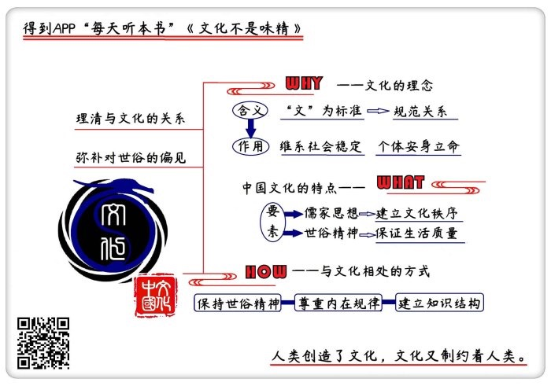

# 《文化不是味精》| 贾行家解读

## 关于作者

阿城，著名作家、编剧、摄影师、文化项目策划。二十世纪八十年代以小说《棋王》《孩子王》轰动中国文坛，其它主要文学作品有《遍地风流》《威尼斯日记》《闲话闲说》等，此外，阿城还创作了大量剧本、杂文、评论。各个艺术门类，阿城几乎都有所涉足，且达到了很高水平。华人文化圈里许多艺术家都对阿城的文化观点、文艺观点推崇备至。

## 关于本书

在本书里，阿城通过文化专题讲座、电影评论、美术和摄影评论、音乐评论、人物评述和散文杂文等形式，既广泛评述了各个艺术门类的具体问题，又系统传达了对中国文化、中国艺术的整体认知，反映了他对文化这一命题长达三十年的思考成果。

## 核心内容

文化是用规范文明的方式来维系人与人、集团与集团的关系，在人类社会中发挥着维持稳定、保证人们安身立命的作用。中国的文化有自身的特点，既受儒家思想的影响，又有世俗生活的一面。生活在这种文化氛围下的我们，应该顺应中国文化的内在规律，同时，也要积极建立开阔的视角和知识结构。

## 前言

你好，欢迎每天听本书。本期为你解读的是《文化不是味精》，这本书共有410页，我会用大概27分钟的时间，为你讲述如何认识中国文化，如何在文化中更好地生活。

有很多我们几乎天天都用的词，但未必清楚它的真正意思，比如说文化。习惯上，我们觉得文化好像就是知识的意思。最开始，说一个人有文化，就是说他识字，让大家都识字，就叫普及文化；现在的文化程度，是说一个人的学历情况。对文化这个词的另一类理解，是泛指经验和习惯，做什么事情，各行各业都可以说自己形成了文化。按照地域，各地都有饮食文化：粤菜文化，鲁菜文化，川菜当然更是文化，还有火锅文化和麻辣烫文化。喝茶有茶文化，喝酒有酒文化，那么吃粽子，也该有粽子文化了，于是，关于粽子里该放枣还是该放肉的辩论，好像就是文化争议了。何况，连在夜市上卖油炸臭豆腐，宣传口号也是“传承中华传统臭豆腐文化”。

按照本书说法，用起文化这个词来，像做菜放味精，频繁到了滥用的地步。文化这个词，泛滥到了这个程度，是不是有点儿开始不对劲了？所以，我们有点儿怀疑：文化的实际意义是什么？它究竟有什么样的形式和作用？《文化不是味精》这本书，讲的就是这件事。

本书的作者是阿城。说起他的身份，真是很多重。他是上世纪八十年代引起中国文学界轰动的小说《棋王》《孩子王》的作者，是与侯孝贤、李安、田壮壮、陈凯歌这些大导演长期合作的编剧和艺术顾问，还是中国美术界知名的摄影师、画家、策展人，同时，也是文化项目策划者和民俗学家。各个艺术门类，阿城几乎都涉足，而且都达到了很高的水平。中国最有影响力的作家、画家和导演，几乎都对阿城推崇备至，说他是通人，是传统精英文化的传承者。

照作家王朔的话说，“阿城的见识显然在我辈之上。要是全国每人都必须追星，我就追阿城。”这些中国各个艺术领域里的代表人物谈论文化话题时，常常会引用阿城的观点和判断。因为他的文化思索，并非基于某种学术理论，而是来自对中国现实的理解和艺术创作实践，既简洁明了，又直抵要害。可以毫不夸张地说，阿城的文化观点，在影响着中国文艺界。

《文化不是味精》这本书是2016年版七卷本《阿城文集》的第六卷，这套文集是由阿城亲自选编的。值得一提的是，在他自己编选文集的过程中，还要求把过去发表时删去的字数，都用方块重新标注了出来。本书所收入的六十余篇文章都是首次集结，共分为六个板块，分别是：文化专题、电影评论、绘画和摄影评论、音乐评论、人物评述和散文杂文。

这些文章的形式，既有图书的前言、评论文章、散文，又有专访、讲座稿和对话录；内容也是旁征博引、触类旁通，从中国文化的历程，散射到当代电影、中国文学，从刘小东、陈丹青的油画到陕西农民的剪纸艺术，从相机镜头光圈如何调整，到音响器材的动态范围，既有宏观视角，又充满了细节，生动地反映了阿城广泛的艺术活动和知识构成。而贯穿其中的线索，正是他对中国文化的系统认识与解读。

关于“什么是文化”这个命题，阿城整整思考了三十年。1985年7月，他在《文艺报》上发表了一篇叫做《文化制约着人类》的文章，从高于文学、绘画、电影等具体艺术门类的视角，讨论了文化如何影响中国人的生活。那篇文章在当时的文艺界和理论界引起了很大反响，被认为是上世纪八十年代中国“文化讨论热”的起点之一。其后，随着广泛参与世界文化交流，阿城对文化的思考不断系统、深入和清晰。他近年评论文学艺术的许多文章，包括对民俗学的研究，都与他的文化命题息息相关。

文化是一个非常大的命题，人类创造了文化，文化又制约着人类。近代以来，对于中国的文化反思，往往因为急于改变落后局面，围绕着该如何引进西方文化改造中国文化来展开。阿城则认为，中西文化的发生和发展，各有不同的面貌，虽然说可以进行交流，但从某种意义上说，文化并不能互相指导。

这个结论，来自于下面这三个问题，也是我们这期音频要重点讨论的三个问题：第一个问题是：文化的本意是什么，文化在人类社会中究竟起到了什么样的作用？第二个问题是：我们认识文化，当然首先要认识中国文化，中国文化具有什么样的要素和特点？第三个问题：既然说文化制约着我们，那么身处中国文化中，应该如何处理自己与文化的关系？

## 第一部分

首先来看看文化的本意是什么，有什么作用？在阿城的定义里，文化就是用规范的、文明的方式维系人际之间、利益体之间的关系，文化在社会中发挥着维持稳定的基础作用。

文化这个词有很多种定义，阿城从文化的作用出发，认为真正意义上的文化，是指人与人、集团与集团间的一种关系。所以，文化是个大概念，既不等同于知识，也不等于各行各业对自己的修饰。关于像使用味精一样滥用文化这个词的做法，阿城觉得，最不恰当的例子就是“军事文化”，因为与文化的本意完全相反。在阿城的观察里，文化这种关系，含义非常明确，就是与冲突斗争的“武化”相对立。

武化产生于文化之前，是一种原始的本能关系。在二十多年前，阿城曾在《收获》杂志上发表了名为《常识与通识》的系列文章，其中介绍过诺贝尔奖得主、现代动物行为学之父康拉德·洛伦茨对人类本性的研究。现代动物行为学认为，人类的本性根源在于动物性，其中，以攻击性最为重要。攻击性是用于侵犯同类、对抗同类的战斗本能。这一本性，在人类社会中以暴力、掠夺和压迫等形式广泛存在。如果对这样的人类本性做后天道德判断，那么武无疑代表着恶。武化的逻辑就是：只要我的力气大、实力强，就可以把你的资源都抢过来，你没有办法保护自己。

那么文化呢？就是人类在社会发展中，发展和建立起来的抑制攻击本性的方法，通过对社会伦理法则的广泛遵从，形成文的关系，实现长期和平共存。在文化这个词里，文字的本意就是花纹，引申为人类按照一定规则制定的制度和契约；化字的含义，可以参考过去的一句话，叫“融化在血液里，落实在行动上”，是说这种东西本来不是血液里有的，是后天融入的。也就是说，文的内容，并非人的本能，是后天规定出来的。文化的过程，就是经过化的方式，使人类的行为细节，包括思想细节，都逐渐符合文的要求。

所以，按照阿城的解释，说一个人有文化，并非是说他有知识，而是能将自己与他人的关系处理成文，而不是武。这里就需要说一说阿城的个人经历了。

他生于1949年，高中一年级下乡插队，一去十一年，到1979年才回到北京。整个青少年时期，他对中国特殊历史时期的武化景象的记忆深刻而沉痛，了解了这些，我们也就能理解，他为什么要一直思考中国文化这个命题。他举例说，那时候，街道居委会的老太太们是既没有知识又武化的，谁家的门都是一把推开就进，根本没有敲门征得同意这样文的概念。上世纪八十年代初，他家附近的餐厅告示上写着“本店不打骂顾客”，我们现在觉得好笑，但在那时，饭店打骂顾客是常见现象。他觉得，那个时代的人际和群体之间的关系，就是完全的武化，以至于有着几千年文化历程的国家，曾一度连请、谢谢和对不起，都要重新学着去说。

所以说，文化在社会中的作用，绝不是修饰性的味精，而且是维系稳定的基础，是人们安身立命的保障。这个作用非常明显，比如说，许多人坐在一个屋子里争论问题，如果实行武化的丛林法则，争着争着可能会打起来，就会有人走不出去了；只有文化的关系，才能保证每个人的安全。2016年迪士尼的热门动画电影《疯狂动物城》里，设定了一个所有哺乳动物都进化出高级智能的世界。能让食草动物和食肉动物同处一座城市，遵守一样的社会规则，动物建立了权利平等的关系，就是实现了文化关系。片子里，动物中了“午夜嚎叫”的毒，变回自然界里的野兽，我们觉得这是退化，是因为承认了动物作为社会人的身份，这种身份，就是文化身份。相反，我们遇到不懂敲门、随便干扰公共秩序、你看他一眼他就恶狠狠地质问“你瞅啥”的行为，会觉得比动画片里的动物难以接受，这种不基于种族而是基于观念和行为的认同标准，就是文化认同。

说起文化认同，我们还常听到文化多元性的说法。承认文化多元，就是承认国家地区间、民族间的不同文化可以平等交流和共存。这就需要区分文化与文明这两个不同概念：文明是人类发展的水平，主要包括所积累的经验和科学技术等，有统一的价值标准，具有程度高低之分，是一元性的。所谓拿来主义，指的是拿来先进文明在科学技术等方面的成果。落后就要挨打，也是指军事文明的落后。文化则因为不同人群、不同环境，拥有不同的风格和特征，文化有强势和弱势，但不能武断区分高下，也不能生硬移植。在多元的人类文化中，我们当然还是最关心中国文化。那么，中国文化具有哪些要素？

## 第二部分

阿城在探究中国文化构成时，主要分析了由儒家传统制定的文化秩序和生活观念中的世俗精神。

中国文化里，最显著的因素当然是儒家思想。这还是要从孔子说起。孔子生活在春秋晚期，在他眼里，当时的文化局面是“礼坏乐崩”，已经快要变成糟糕的武化时代了。他的理想社会，是周代早期的社会，因为周初建立了文的制度，既有秩序又发展旺盛。在儒家的文化构成里，最首要的是建立和维护秩序。这一秩序以伦理为根本，家族内部人人要遵从血缘决定的伦理，相应的，在政治中就要遵守政治伦理，每个人都要依据由所处地位所规定的权利义务行事。

孔子认为重建文化的路径，是制礼和作乐。礼是文化关系的规范，身处不同的社会等级，要遵守不同的礼仪，不能越雷池半步。音乐是实践礼、抑制本性的重要手段。孔子时代还是巫术时代，孔子反对巫术手段，靠音乐来调节人的精神状态。我们读《论语》就知道，孔子在课堂上，总是一边讲课一边弹琴唱歌，像脱口秀节目，这就是在帮助学生进入听课的精神状态。

中国文化的最明显特点，是产生了孝的概念，孝在西方语言里几乎找不到对应的单词。孝并不是自然本能，自然界生存法则很残酷，动物一旦衰老，就失去了资源分配的资格。由儒家提出的孝的概念，正是为了抑制这种动物本性，建立牢固的秩序。从社会关系上说，当时的孝是一种老年保险制度，将后来出现的社会化养老分散到了不同的家庭里去，朝廷就可以不具体负担了。“人人都有老的时候”，所以孝这个概念，看起来对所有人都有利，特别有人情味儿，很容易被广泛认同。而且孝还能延伸，“老吾老以及人之老”，就将有亲疏、有等级的儒家文化观念潜移默化地推广开了。

在古代，孝的义务里包含着对君主的忠诚义务，所以皇权乐于使用儒家的文化系统调整社会关系。后世观察儒家文化要素，发现它们因为早熟而被严重异化。特别是宋明时期的儒家，将孔子的思想改得面目全非，比如，被后世反感的“天下没有不是的父母”这样的说法，出自宋儒道学家，与孔子的孝道无关。儒家文化的主要问题，是被异化的问题。

阿城在对中国文化的观察过程中，非常强调另一个文化要素：世俗精神。他的观察是，中国文化有艰深的形而上学内容，但本质上是世俗性格和世俗精神。儒家思想负责着中国的文化秩序，世俗精神则负责中国人的生活质量。所谓世俗，就是专注于现实生活，非常迷恋生命。在小说家余华的代表作《活着》里，主人公福贵经过坎坷苦难的一生，在晚年失去了支撑他生活的人和信念，虽然既没有希望也没有信仰，但他仍旧坚韧地活着。用世俗生活来解读，这是理所当然的选择，世俗的核心精神，就是“好死不如赖活着”。中华民族能够在历经千年的灾荒战乱后，仍作为一个文化群体延续，靠的就是这种世俗精神。

中国世俗精神的主要特点是自我净化：就是用现实的方法，来解决现实的问题。比如，劝一个悲痛的寡妇，不会说你丈夫上了天堂、往生极乐之类的话，而是会说“你哭坏了身体，以后可怎么办呢，孩子谁来带”，被劝的人想想还要活下去，也就不哭了。世俗精神，决定了中国人从传统到现实都不会沉浸于注重彼岸的宗教信仰。许多试图改变中国人精神面貌的外来文化，结果是被中国世俗所同化。比如印度佛教并不承认现世，主张离开现实世界，到了中国，则被改造为通过信佛行善，在来世得到更好的生活。

佛教在日常活动上，与道教儒家合流，一起服务于中国人的世俗生活，人们烧香、拜佛、许愿也都是要求神佛解决现实中的麻烦。明代来到中国的天主教传教士利玛窦，遇到中国人问他能不能拜祖先的问题，由于他了解中国文化，就回答说可以。因为他知道，如果按照教义回答说不能，中国的教徒就会立刻减少。世俗生活的内容，不外乎吃喝拉撒，婚丧嫁娶，生老病死；在感情体验上，就是悲欢离合，悲和离也是世俗的自我净化，是为了更好地体验欢与合。世俗精神虽然看似琐碎肤浅，乃至粗鄙，但生命力极顽强。中国近现代为了改造文化，有过许多对世俗精神的系统批判，并从国家层面推动社会改造，试图扭转中国人的旧传统旧风俗，彻底切断世俗文化。

这些尝试，或者很快销声匿迹，比如上世纪三十年代，民国政府推行的艺术化、生产化、军事化的新生活运动，试图用基督教徒的生活方式，改造中国人旧有的世俗生活，结果是草草收场；或者造成了文化断裂，比如民国时期，知识分子对国民性和中国文化进行了彻底批判，试图既引入西方文明，又引入西方文化，但文化无法直接置换，结果是留下了中国文化中的一个断层。按照阿城的定义，毁坏文化本身，可能会让社会退回到武化关系里。即便认为世俗精神中有许多保守和落后成分，但它就是中国文化的底色，不能被随意替代。遵从儒家思想的秩序，顺应世俗精神的需要，才是维系中国人生活观念和文化关系的有效方法。

所以，阿城对文化的讨论，不是从权力角度讨论如何管理社会，也不是从反思的角度批判国民性，而是乐于承认中国文化的各种因素，主张深入地认识文化，保护世俗经验，维护文化的生机勃勃。他强调文化的重要，更强调要尊重人在文化之下的自主生活。相对于文化使命，他更喜欢从个人角度谈论身处中国文化氛围中，如何与文化相处，如何更好地生活？

## 第三部分

我们刚才说到，文化是人们安身立命的保障。在文化这个大环境和系统关系里，我们时时面对着如何在文化中自处、如何生活的问题。阿城首先强调，必须要维护自己的世俗生活空间。

对“礼不下庶人”这句话，有过许多理解，比如钱文忠教授在《百家讲坛》里解读为“礼不以庶人为下”，意思是不能把老百姓排斥在礼仪之外。阿城对这句话的理解则是：礼的范围是针对权力阶层，不包括俗世。这能够让世俗有宽松变通的余地，保持自身的生命力。礼一旦下到庶人中间，老百姓的日子就不好过了。比如，最初的礼法并不约束民间妇女改嫁，贞节牌坊之类的东西就是到了礼下庶人之后才盛行的，直到开始要求妇女裹脚。阿城主张建立和保护由人们自主打理的世俗生活。

对世俗生活样本的描述，他选择了两座发达城市：上海和香港。上海繁华的标志就是建立了规模庞大的世俗生活，从开埠时期、租界时期一直到现代，各种各样的文化要素都能在上海蓬勃发展、相安无事。比较极端的例子是，租界时期，高级妓女流行穿皇家专用、民间禁用的黄颜色、龙凤图案的衣服，而妓院的马车夫则穿着朝廷大臣受到赏赐才能穿的黄马褂，因为这是在租界里，英国人不管，而清政府管不了。始终居于世俗文化的前沿，相对缺少禁忌，也是上海经济繁荣的基础之一。

香港的世俗化更为完整，连许多清朝时期的文化元素都被直接保留了下来，在内地消失的习俗，香港几乎都保存着，比如香港的中文既中英夹杂，又保存了古文习惯，流行歌词中很少有“的”字，公文里还有“尔等居民”这样的字样。

一同被保存下来的，也包括巫术迷信等成分，比如闹市的天桥下，还有代人“打小人”下诅咒的地摊，至今仍在市民中流行，在金融区工作的白领下班后常去光顾，发泄对同事和上司的不满。对于香港是“文化沙漠”的说法，阿城也有不同看法，他觉得，在香港热闹到被认为俗气的另一面是：喜欢音乐和阅读的人，可以方便地购买到世界上任何地方的任何唱片和书刊，主要看你如何选择。所以说，文化具体到个人生活，最需要坚持的，是由自己选择、由自己负责的精神。

在维护世俗精神的同时，对待文化秩序的态度，应该是顺应内在规律。在阿城看来，文化保守是个褒义词，先要保住守住，才能将进步落实下来，形成文化中的化。在英国文化发展中，保守派起到了重要作用，他们将每次进步都保持了下来，不使其后退。在社会操作上，每次处理过一个社会矛盾，就将经验固定为法律条文，以后再碰到这样的问题，可以直接引用判例。对于文化中形成的规则和禁忌，不能轻易触犯。原始民族拥有很多禁忌，这些禁忌的起源，都是曾经把这个氏族或周边氏族毁灭的东西。这些东西作为文化记忆保持下来，和感情直接相关，一旦冒犯了文化禁忌，人际之间、群体之间就会出现关系裂痕，可能永远修复不了。

在遵从和顺应的同时，还要清醒地认识到，文化是建立在人的动物本性上的。限制和抑制的同时，要依靠文化所确定的渠道，合理释放本能。比如对抗性的体育运动，就是释放攻击本能的有效途径。北欧、荷兰这些国家和地区，对艺术中的暴力、色情因素容忍度相对比较高，他们认为，文艺能够发散动物本能，反倒有利于保持社会心理健康。

强调顺应文化的保守性，但不等于停滞不前，更不等于在知识上的自我封闭，而是更需要建立开阔的知识结构，提升对文化的鉴别力。有生命力的文化会一直发展，构成应该是越开阔越好的。对文化的辨别，需要个人眼界开阔，能够对各种因素做出判断。

顺应中国文化特点，首先要了解西方文化。如果以民族主义为借口排斥西方文化，也至少要知道，民族和主义这两个概念都产生自西方，连这两个词也是从日语里拿过来的。在建立自己的知识结构时，不必追求统一的教育模式和现成的标准答案。比如读书，不要才看一眼就判断是好书还是坏书，先什么都看，看它说什么，再和自己积累的东西进行思想对谈。眼界和知识开阔之后，才能找到自己的模式，不至于看什么都觉得新鲜而又抓不住核心，这是学习的必经过程。

说到知识构成，阿城还特地说到，要有世俗的社会经验。说起世俗经验，容易联系到江湖气。阿城说，江湖气是人情世故，可不是流氓气，但有了江湖气，才能学会应对流氓。世俗生活中的人际关系是中国的文化氛围，能够处理人情和预测人情变化，也就是“世事洞明皆学问，人情练达即文章”，是与中国文化相处的重要能力。

## 总结

这本书关于文化的重点内容，就说到这里，下面来简单回顾一下刚才聊到的三个问题。

第一个，文化的含义，是用文的标准来规范人与人、集团与集团之间的关系。文化的作用，是维系社会稳定，确保人在社会中能够安身立命。

第二个，中国文化最重要的两个要素是儒家思想和世俗精神，儒家思想负责建立文化中的秩序，世俗精神负责保证人的生活质量。

第三个，我们身处中国文化氛围，如何与文化相处、更好地生活？要在文化中，维护个人的生活空间，保持必要的世俗精神。同时，要尊重文化秩序的内在规律。要建立开阔的视角和知识结构。

以前，我们提到中国文化时，既觉得概念模糊，又有隐约的束缚感和沉重感，好像文化对我们来说，要么是继承发扬的重任，要么就是批判与反抗的对象。这一次，阿城简洁明确地还原了文化的本意，梳理了文化的内在。不过，他把文化视作一种关系的观点，并不是政治学、社会学中的定论，而更像是阿城的文化“私房菜”。对于这类见解，他也没有写成专著来系统论述，在本书中，阿城谈文化，也是散落在多篇访谈和讲座稿中的。我们对待他的看法，最好也像他讲到如何不预判观点地多读书时所说的：先看看它说的是什么，再和自己积累的东西相对照，丰富我们的知识结构。

对照过后，我们发现，阿城的文化解读，至少有两方面意义：一方面，去掉了附着于文化概念上的许多似是而非的东西，帮助我们理清了个人与文化，特别是中国文化的关系；另一方面，他的观点，弥补了中国文化讨论的一个空白。

过去，讨论文化建设，特别是艺术理念，总要强调培养超越世俗的精神，但很少有人像阿城一样认识到世俗是中国文化的底色，文艺创作应该恢复传统中的世俗精神和世俗性格。世俗生活并不会与高雅的艺术、卓越的思想相对立。中外历史都证明，当人类世俗生活呈现出繁盛和多样性时，思想和艺术才会找到土壤，迎来机会。

撰稿：贾行家

脑图：摩西

转述：徐惟杰