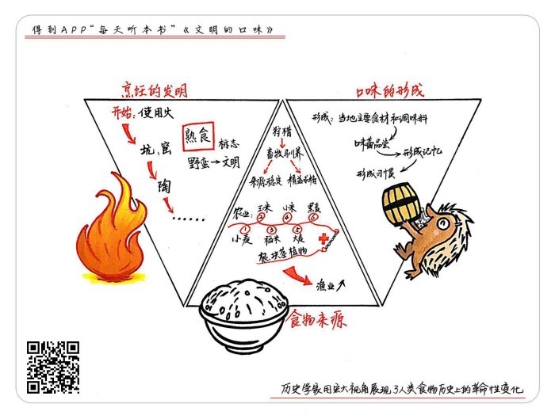

# 《文明的口味》| 苗炜工作室解读

## 关于作者

菲利普·费尔南多-阿梅斯托，英国著名历史学家。在牛津大学任教多年，还经常给《纽约时报》和 BBC 撰稿。有关海洋与殖民史的著作，为阿梅斯托赢得不少荣誉，他被称为世界上最好的历史学家之一。

## 关于本书

本书的英文版首次出版于2001年，获得了国际烹饪专业协会的最佳饮食写作奖。本书中文版由台湾著名美食作家韩良忆翻译，也是一大亮点。阿梅斯托写食物的历史，没有从某一种食材出发，而是提供了一个大视野——在人类吃饭的历史上，究竟有哪几件事算得上是革命性的。通过本书，我们可以从餐桌上认识整个世界。

## 核心内容

在食物的历史上，发生了八次重要的革命，决定了人类如今的饮食及生活方式。本期音频从烹饪的发明、食物的主要来源和口味的形成三个方面讲述人类食物的历史，看我们是如何一步步吃到了今天。

## 前言

你好，欢迎每天听本书。本期要讲的这本书叫《文明的口味》，副标题是“人类食物的历史”。作者在这本书里研究的就是，在人类吃饭的历史上，究竟有哪几件事算得上是革命性的。

如果我们去书店转转就会发现，美食类的书是非常重要的一个门类，有大量的食谱、美食游记，也有食物的历史。食物的历史其实很有意思，比如有本书叫《中世纪的饮食》，讲的是在食物特别匮乏的中世纪，人们是如何吃饱饭的。有的书是讲某一种食物的历史，书名就叫《西红柿》《土豆》或者《鳕鱼》；还有从味觉出发的书，比如《甜与权力》研究的是蔗糖在历史上的地位，《盐的历史》通篇说的都是酱油和腌菜的事。其实不论从哪个角度切入，讲述食物的历史都有一个隐含的主题，那就是人类是如何吃饱饭，又是如何吃得好一点的。说白了，食物进化的历史，也就是人类进化的历史。

我们今天要讲的《文明的口味》这本书，跟刚才我们提到的这些书都不太一样。它没有从某种食材或者味道出发，而是从一个非常大的视角和结构来研究食物的进化。作者从人类开始学会用火，一直讲到现代化的食品工业，用一本书勾勒出一幅完整的食物进化地图。

这么大的话题驾驭起来并不容易，这就要说到本书的作者菲利普·费尔南多-阿梅斯托。他是一位非常著名的英国历史学家，在牛津大学任教多年，经常给《纽约时报》撰稿，还是很出名的 BBC 节目主持人。他最出名的研究领域其实是航海与殖民史，因为他的父亲是西班牙人，曾当过记者，受父亲的影响，他的很多历史作品都跟大航海和西班牙有关。说到写这本《文明的口味》，可能也是受了西班牙美食的启发。刚才我们说到阿梅斯托是个英国人，而吃饭这件事，西班牙可比英国要讲究多了。后来，西班牙政府还特意给阿梅斯托颁发了一个国家奖章，表彰他在地理写作和美食写作方面对西班牙的贡献。

接下来就让我们进入这本历史学家写的关于食物的书吧。刚才我们提到，本书从人类开始用火一直讲到现代化的食品工业，而我们今天的解读就取其精华，选取书中最核心、跟我们关系也最密切的三个方面来说：第一，烹饪的发明；第二，食物的主要来源；第三，口味的形成。在讲述过程中，我也会列举几个大家熟悉的菜，没准哪天你就可以在饭桌上跟人聊一聊。

## 第一部分

首先，我们先来说第一部分，烹饪的发明。

你吃过牡蛎吗？换成我们熟悉的词，就是生蚝。生蚝这个“生”字，就暴露了吃生蚝的方式，我们有时候会把生蚝烤了吃，有时候会蒸了吃，更多的时候，我们就是生着吃，打开壳，嘴靠上去，吸，这个软体动物就直接滑入了你的喉咙。有一位牡蛎专家是这么说的，吃生蚝就是在吃大海的味道，就是在接受海草和大海上的风，就是吞下的那一口海水中飘散出来的味道。这么一说，吃生蚝还真多了几分诗情画意。

牡蛎可以说是西方饮食里最接近天然的食物了，听到这你可能不大同意，说我们平常吃苹果、吃山楂，那不也是天然的食物吗？其实，我们吃的蔬菜水果早就经过人类千百年的改良和培育，就算你从山野郊外的树上摘下来的浆果，也一样如此。而天然的牡蛎是没有经过改良的，它的味道会随着海域的不同而有显著的差异。还有一点，我们是趁着牡蛎还活着的时候把它吃掉的，这种吃法在我们的饮食中确实已经不多见了。

除了牡蛎，在一些韩国餐馆，我们还会吃到生拌牛肉。西餐中也有一道生拌牛肉的菜，叫鞑靼牛肉。从名字上讲，鞑靼是蒙古部落中的一支，是西方人眼中的野蛮人，把生牛肉和野蛮人联系在一起，似乎吃生肉是野蛮人的行径，可是鞑靼牛肉的料理过程非常讲究，有时候厨师就在你的桌边表演：先把肉绞碎，再把新鲜的香草、青葱、洋葱、酸豆、胡椒、橄榄和鸡蛋拌进去，再浇上一点儿伏特加。我们会发现，越是生吃的菜，越讲究料理过程的细致，比如日本菜里的刺身，也就是生鱼片，厨师料理鱼肉的过程刀工娴熟，摆盘讲究，充满了仪式感。

可是早期的人类，吃生肉的时候可不像现在这么讲究。1540年，一位西班牙骑士来到了美洲大陆，他记录下了印第安人吃肉的场景：狩猎者杀死野牛后，先剖开牛腹，挤出牛胃里还没完全消化的草，并喝掉其中的汁液，据说这是胃的精华，然后吃生肉。怎么吃呢？切下来直接放到嘴里嚼两下就吞下去。然后把牛的内脏清理干净当作容器，给里面灌满牛血，路上渴了就喝牛血。可以说，这才是真正的鞑靼牛肉呢。

真正的生肉是不好消化，也很难下咽的，我们学做饭，就是要让东西好吃一点。人类最开始的烹饪技巧，就是学会用火。可以说，学会用火在人类吃的历史上是一个重大的里程碑。火是如此重要，在全世界各个民族、各种文化中都有自己的火神。希腊神话中是普罗米修斯盗来了火种，印第安部落的传说是美洲豹的爪子在地上摩擦引起了火花。

其实，在学会用火之前，原始人已经知道烧熟了的东西更好吃。因为在远古时代，森林野火是一种常见现象，在野火熄灭之后，人们会发现，那些被火烧过的豆子变得更好吃了，如果有动物被野火烧熟了，它的肉也更好消化。于是，人类在学会了用火之后，烹饪变成了人类进行的第一项化学活动。古希腊一位美食家写下过一个烤鱼的菜谱。把捕获的鲣鱼撒上香料，然后用无花果叶包起来，放到火堆的余烬中焖烤，直到叶子焦黑，就算熟了。类似的做法，我们在云南餐馆或者是泰国餐馆中还能吃到。这种做法和传说中的叫化鸡很相似，都是直接用火，而没用到其他的厨具。

有些食物直接用火烤，或者用烟熏，就可以食用了，但人们并没有满足，掌握了火之后，人们就开始研究厨具了。考古发现，人类最先使用的厨具就是石头。先把石头加热，然后在热石头上把食物烤熟，接着就发明了烹调坑洞，在地上挖一个洞，把加热的石头放进去，这就形成了最初的烤炉。如果不小心挖到了地下水，给水里加入热石头，就成了另一种烹饪方式，那就是煮。既然烤和煮这两种烹饪方式有了，更多的厨具也相应地出现了，大一些的贝壳能当锅用，一些动物内脏也可以当容器。直到现在，我们依然能看到动物内脏当容器使用的情况，比如最好的香肠和血肠必须用动物的肠衣来包裹；再比如有一道苏格兰名菜，就是用羊肚儿做容器，把羊心、羊肝、羊肺等杂碎连同羊血装进去，一起煮熟。

大约一万年前，人类终于做出了不怕火烧也不会漏水的陶器，此后的一万年里，人们只不过是在不断改良这些厨房用具，烹饪方式并没有发生什么实质性的变化，直到微波炉的出现。微波炉可以说是一个跨时代的变革，它不再用火，而是用电磁波。1989年，法国只有两成的家庭拥有微波炉，到1995年，拥有微波炉的家庭就达到了五成以上。可以说，微波炉的普及速度相当快。可人们也发现微波炉做出来的菜都不怎么好吃，它唯一的好处就是方便，大多数家庭主要用它来热剩饭。

我们来总结一下第一部分的内容。人类掌握了火，开始用烧烤及烟熏的方式料理食物，而后又发明了坑和窑，学会了烤和煮，大约一万年前，人类掌握了制陶，开始用锅碗瓢盆来处理食物。到这里，食物历史上的第一次革命已经完成，人们用火来做饭，千百年来都没有改变。烹饪把文明人和野蛮人区别开来，有了火，有了厨具，有了烹饪方法，人类不再茹毛饮血，走向了文明。

## 第二部分

接下来我们讲述第二部分，食物的来源。

我们的食物来源自然是畜牧业和农业，我们先说畜牧业。畜牧业起源于人类开始驯养动物。从狩猎到驯养，是人类食物来源的一大变革。还是从一道名菜开始吧。法国蜗牛，这本来是一道不登大雅之堂的菜，类似于我们的小龙虾，但巴黎的餐厅大力推广这种乡土气息的蜗牛，把它变成了法国美食的一道代表菜。考古学家在许多远古遗迹中都发现了蜗牛壳，这说明蜗牛和贝类很可能是人类最早养殖的动物，它们个子小，不需要太多饲料，对人也没啥危险，还能大量繁殖。

以往我们说人类饮食经历了采集、狩猎、畜牧这样的发展过程，但作者阿梅斯托却认为，这几种手段是同时存在、互相补充的。比如在人类历史上有一段时期，狩猎和驯养是混杂的，北美的牛和北欧的驯鹿都有这样的过渡期。人们为什么要由狩猎转为驯养呢？既然外面动物多，我们出去打猎既锻炼了身体，也比较好玩，干嘛要弄个牲口棚来养动物呢？

要知道，没有好处的事，人是不会干的。由狩猎转为驯养，最大的好处是可以获得稳定的食物来源，第二个好处是精益求精，选择特别符合人类口味的肉食。比如，阿根廷的高楚人有一道名菜叫初生小牛肉，美国怀俄明州有一道名菜叫牧人炖肉，都是用还没断奶的小牛肉和内脏作为主料的；我们的连锁品牌小肥羊，也可以专门涮小羊羔来吃，这就是驯养的好处。而在打猎的时候只能打到什么吃什么，不可能天天碰到没断奶的小嫩牛。到了现代，人们反而喜欢吃野味了，并不是新鲜的猎物有多好吃，而是野味比养殖场出来的动物更罕见、更贵罢了。

畜牧还有第三个好处，就是把奶制品带入人们的饮食中。但其实并不是所有的人类都适合奶制品，只有欧洲、北美以及中东和中亚一部分地区的人，才能更好地消化动物的乳汁，而其他地方的人，对乳制品既不太感兴趣，也不能很好地消化。奶酪是欧洲最重要的一类食品，而在丰富多彩的中国饮食中，就很少有用奶制品做成的菜。日本刚开始接触西方文明时，也不太喜欢西方人，认为他们身上有一股“牛奶的臭味”。

从狩猎转为驯养这件事，不仅仅是在陆地上发生，也包括海洋。

实际上，20世纪可能是人类历史上狩猎量最多的时代，因为人类的捕鱼量比上一个一百年增加了至少40倍。整个20世纪，我们从大海里捞捕上来30亿吨的鱼，这种疯狂的捕捞让地球上的许多渔场彻底消失了。加拿大1996年关闭了鳕鱼渔场，大西洋鳕鱼的存量只剩下历史平均水平的十分之一。加州沙丁鱼和北海鲱鱼已经成为稀有鱼种。在上世纪30年代，日本拥有全球最大的沙丁鱼渔场，但到1994年，日本沙丁鱼几乎灭绝了。

海里的鱼少了，水产养殖便越来越发达，也就是说，人类从狩猎到驯养这个食物来源的革命性变化还在继续。1980年，人类有500万吨食物来自于养殖渔业，到21世纪增加到了2500万吨。在野生环境中，每100万个卵才有一条鱼存活，而人工受精可以确保八成左右的鱼卵受精，六成可以孵化成鱼，还可以用荷尔蒙来增加种鱼的繁殖能力。养殖鱼能比野生鱼长得快、长得大。养殖鲑鱼，也就是三文鱼，每公倾可以生产300吨的肉，比肉牛的产量要多15倍。

说完了畜牧业，再来说农业。

人类本来靠狩猎和采集来吃饭，这是向大自然的索取，在这个索取的过程中，人们学会了种地。作者阿梅斯托在书中探索了一个问题，人类在什么情况下开始了农业革命。他的结论是，人类在农业种植之前也经历了与植物共生的阶段，缓慢地掌握了农作物的知识。人类在大地上耕耘，伟大的禾本植物是最了不起的成就，它们的颗粒包含油、淀粉和蛋白质。其中，对人类文明意义最大的有六种农作物：小麦、玉米、稻米、小米、大麦和黑麦。这就是主食的构成，或者我们通常用的一个词，粮食。在基督教文明中，人们把小麦做成的面包当做圣餐，美洲人在圣殿附近会专门留一块地种植玉米，这都是一种主食崇拜，因为正是这些粮食能让更多的人吃饱。

我们就来认识一下这六种农作物，按照反序来，越往后说到的农作物，对人类文明的贡献越大。

先说黑麦。黑麦的好处是能够适应气候寒冷和土地贫瘠的地区，从公元前一千年开始，黑麦就是欧洲北部的主要作物，田地是人们从森林中开垦出来的，阴冷潮湿。黑麦颗粒略带一些苦味，做成的面包发粘。要是在以前，黑麦面包都是给穷人吃的，但现在反过来了，人们想吃得健康，崇尚返璞归真，越来越多的中产阶级开始喜欢黑麦食品了。

比起黑麦，大麦对环境的适应力更好。西藏高原从5世纪开始种植大麦，现在的西藏地区，人们喜欢把大麦粉烘烤了以后做成糌粑吃。考古证据显示，一万三千年前，居住在叙利亚的先民就采集了不少的野生大麦，大麦不适合做面包，一般是整粒放到汤里吃。它是古希腊最早的主食，在最古老的雅典钱币上还可以看到大麦的图案。

小米也是一种生命力很强的谷物，与黑麦喜欢寒冷不同，小米适应的环境是炎热干燥的。小米油分充足，蛋白质含量高过小麦，它在西方文明中没什么存在感，但这种营养丰富的主食养育了黄河流域的中华文明。《诗经》里就有这样的诗句，“楚楚者茨，言抽其棘。自昔何为？我艺黍稷。我黍与与，我稷翼翼。”意思是说，田野里的杂草荆棘我都要拔掉，因为我要种糜子和谷子，糜子长势很茂盛，谷子排列很整齐。这里的谷子就是指小米。远在商朝时期，小米就养育了当时世界上最稠密的人口。到公元前五六百年的时候，大豆传入了黄河流域，小麦则来得更晚一些。不过，黄河流域一直不太适合种植稻米。

那我们就来接着说第四种农作物，稻米。稻米为现代人提供了20%的热量和13%的蛋白质，目前全球有20亿人以稻米为主食。在小麦得到科学改良之前，稻米一直是世上最有效率的食品，传统品种的稻米一公顷可以养活5.63个人，小麦可以养活3.67个人，玉米可以养活5.06个人。以稻米为主食的东亚和南亚，从来都是世界上人口最多的地方，也是创造力最强的地方。吃小麦的欧洲以往都是落后的，直到最近五百年才兴起，到19世纪才赶上中国。考古证据显示，八千年前，在长江中下游地区就有人在湖边种植稻米；大约在五千年前，华北最靠南的地区，就有人以雨水灌溉来种植旱稻。随着中国版图的扩张，黄河流域和长江流域两种环境产生交汇，在这个过程中，稻米成为富足的象征，也成为中国人的主要食物。

在中古世纪，欧亚大陆的农作物是这样分布的，东方人吃稻米，西方人以小麦为主食，中亚地区产大麦，另外一些条件艰苦的地方有小米和黑麦，而美洲大陆是玉米的天下。玉米的营养价值并不丰富，而拉丁美洲的原住民很早就知道要注意饮食均衡，玉米、南瓜、豆类这三种食物最好搭配在一起吃。

这六种农作物我们最后说到的是小麦。小麦分布在地球表面超过六亿英亩的土地上，它能适应各种不同的环境，而且经过改良占领了更多的地方，以更快的速度生长。日常生活中有两种产品跟小麦紧密相关，一是啤酒，二是面包。有一种观点认为，人类之所以搞农业、种粮食，就是为了酿酒喝。这不是开玩笑，这种饮料能让人酣醉，让人出神，让人忘乎所以，啤酒是人类历史上很关键的一个产物。但是与啤酒相比，面包可能更关键。作者认为，面包帮助小麦成为了一种全球性的作物。小麦有一个特点，就是麸质的含量比其他禾本植物都高。麸质加了水会让面团变得柔软，这种粘度能让发酵过程中产生的气体被封锁在面团里，说白了就是，小麦的特质特别适合做面包。要烘焙出好吃的面包其实并不容易，需要精良的技术，人类很早就有出现了专业的面包师傅，而没有小米粥师傅或者爆米花师傅，可以说，面包是最讲究烹饪技术的主食。不过啊，那些爱吃面条的人肯定不这么认为。

我们上面介绍了对人类有重要意义的六种禾本植物，按贡献大小的排序分别是小麦、玉米、稻米、小米、大麦和黑麦。那么，有了这六种作物是不是就能喂养全人类了呢？其实并没有，我们还需要根茎植物与块茎植物。

人类最先掌握的农业技术是种芋头。芋头好消化，老少咸宜，而缺点是不易保存。早期农业社会的主食有一个特点是需要经得起长期储存，所以，芋头的地位渐渐被山药、红薯和土豆取代了。已知的最早的土豆种植开始于七千多年前的秘鲁，而后这种神奇的作物在安第斯山脉蓬勃发展。它有两个特点，一是能适应高海拔，二是营养丰富，只要你吃得够多，土豆就能供应人体所需的一切营养素。随着大航海时代到来，欧洲人到达美洲，率先学会了这片新大陆上的农作物种植，但欧洲的大部分地区并不适合种玉米，更适合种土豆，再加上土豆营养丰富，热量比大部分主食还高，所以欧洲有些地方的人就把土豆作为主食，一旦土豆欠收，就发生饥荒。1845年的爱尔兰大饥荒就是这样产生的。有意思的是，欧洲一旦有战事发生，土豆的种植范围就随之扩大，它实在是一种有益于贫困人口的食物。

说完了土豆，再来看看番薯。番薯是跟玉米一起来到中国的。“番”这个字就表明它是外来的，关于番薯的记载最早出现在1560年。但这些外来的食物在中国的推广还是慢了一些，如果玉米、土豆、红薯在明代就能广泛种植，可能就没有后来的饥荒和农民起义了。时至今日，玉米在中国的消耗量已经超过了小米，但它和红薯一样，始终是副食的角色，不能取代稻米的地位。顺便说一句，还有一样原产巴西的作物传遍世界，始终处在边缘地位，而在中国一直被当作美食，这就是花生。中国人给它的名字就充满诗意，落花而生，这可比苞谷好听多了。

到这里我们的第二部分就讲完了，这部分我们讲述的是人类的食物来源。人类从采集和狩猎，逐步过渡到农业种植和畜牧。我们会错以为由狩猎到畜牧的过程早完结了，可实际上，人类在20世纪的渔获量超过以往世纪的总和，野生鱼会逐渐灭绝，我们将吃到越来越多的养殖鱼。所以，从狩猎到畜牧仍然是一个正在进行中的过程。接下来我们讲了有六种禾本植物养育了我们的文明。除此之外，人类也离不开根茎和块茎植物，特别是土豆。尽管土豆总是被视为低级食品，但它具有人体所需的一切营养素。

## 第三部分

接下来我们进入第三部分，口味的形成。

《文明的口味》这本书毕竟不是一本农业历史书，它讲食物就肯定离不开所谓的饮食文化。现在是全球化的时代，我们很容易就能吃到世界各地的菜，但人们还是习惯自己的家乡菜，习惯那种自小形成的口味，早餐尤其如此，爱吃谷物的就只吃谷物，爱吃煎蛋的就只吃煎蛋。法国口味和英美口味之间有分歧，复杂的中国美食自认天下第一，这都说明食物和语言、宗教一样是具有文化差异的，而且饮食文化是非常保守的。传统菜必然包含当地的主要食材和调味料，这些材料已经深深地渗入到当地大众的口味，味蕾一次次尝到这样的味道形成记忆，就会对其他味道无动于衷，甚至有些排斥。

不过，有两种力量可以打破食物间的壁垒，那就是战争和殖民。比如在埃及有一种小吃叫“库休利”，用稻米、扁豆、洋葱和香料做成，它与印度的小吃“基契利”差不多，大概可以推断这是英国军队从印度带到埃及的。而英国人在巴基斯坦也留下了两道菜，是烤鸡配面包和烤牛肉配约克夏布丁。此外，中世纪的时候穆斯林占领了西班牙，后来西班牙大多数地区做菜的时候都从猪油改用了橄榄油。

说到口味的形成，也要说到食物的迁徙与融合。

玉米、蔗糖、番薯这些食材在全球的迁徙都有自己清晰的路线，菜品的交融与变化也是有一定脉络的，只是略为隐秘。美国有一种菜叫德墨菜，是美国德克萨斯州和墨西哥混杂而成的。德克萨斯的土地大多是美国从墨西哥手中巧取豪夺来的，墨西哥则用他们标志性的食物重新夺回了德克萨斯。标准的墨西哥食材构成了美国西南部的菜色，辣椒就是其中最主要的标记，此外还有玉米和黑豆。德州的州菜是就辣肉酱，有肉末、黑豆、辣椒和孜然，其中孜然的使用可能是早期的西班牙殖民者传到墨西哥的。

我们再来看看亚洲。几乎每一道菲律宾菜都离不开用蕉叶调味的白米饭，白米饭是华人口味的标志，而蕉叶是菲律宾的马来根基。但菲律宾菜也会以面包为主食，面包又会用椰子来调味，菲律宾菜中有烤乳猪、海鲜饭，名称虽然不同，但这两种菜都是鲜明的西班牙菜；菲律宾的厨房用语中也有一些西班牙语单词；他们还喜欢一道甜点，焦糖布丁，这道甜点正是发源于西班牙、后来风靡全球的。从这些菜我们可以看出，华人文化在菲律宾的影响以及菲律宾被西班牙殖民的历史。稻米在东南亚会加入一些当地特色以调味，而在伊朗，稻米原本是皇室饮食。他们从印度进口优质稻米，料理过程特别复杂，用两个小时先泡再煮到弹牙的程度，然后再拌上油脂蒸半个小时，接着加进烤羊肉、樱桃、藏红花等香料，这样麻烦地做一道米饭，是因为伊朗不适合种稻米，能吃到米饭是一种权力的象征。

再看看欧洲。荷兰菜的难吃是天下闻名的，但荷兰也有两道所谓的国菜，其一是米饭餐，另一种是薯泥杂拌儿。米饭餐是荷兰在印度尼西亚殖民时代发明的菜式，主食是白米饭，搭配的菜多达十余种。主要的酱料是炒辣椒酱，用多种香料制成；主要的菜有印尼炖牛肉，炖牛肉要事先腌过，用生姜、沙兰叶等苏门答腊特产的香料；上桌的菜还有乌贼、豆腐等等。听起来所谓的米饭餐很像是我们旅游时在国外中餐馆吃的团餐，白米饭配上一些炒菜，但荷兰这道国菜还比较有仪式感，这些菜都要放到黄铜容器中，下面有酒精灯来保温。薯泥杂拌儿这道菜，原料就是土豆加胡萝卜加洋葱，放到锅里煮烂即可，现在的菜谱中都注明要加上牛肉或者香肠。历史上，这道菜与荷兰城市莱顿有关。1574年，莱顿遭到西班牙侵略者的围困，城中粮食短缺，人们就把能找到的块茎植物都放到锅里炖，围困时期是否有牛肉或香肠真的不好说。这道菜和我们云南菜中的“大救驾”有点儿相似。这两道荷兰国菜，一个是纪念荷兰殖民印尼的历史，一个是纪念自己的独立与解放，可以说是很有情怀了。

## 总结

说到这，本期的分享就差不多了，我们来总结一下《文明的口味》这本书。作者从人类开始学会用火，一直讲到现代化的食品工业，描绘了我们是如何一步步吃到今天的。

第一，使用火，就是烹饪的开始。我们一直用火做饭，厨具与厨房的多种变化都是改良。而实质性的改变是微波炉，让我们学会了用电磁波做饭，虽然味道很一般。烹饪让人类吃熟食而不是吃生肉，这是人类从野蛮进入文明的标志。尽管我们还会吃生蚝吃刺身，但这种生食也是强调制作过程和餐桌礼仪的。

第二，人类在狩猎过程中逐渐学会了驯养动物，也在与植物的共生中开始了农业革命。有六种禾本植物养育了人类文明，但人口增长也离不开土豆和番薯的帮助。这些作物都有各自的原产地，但随着人类的活动，它们在世界上找到了更多适宜的土壤。

第三，我们的口味由当地的主要食材和调味料形成，味蕾一次次尝到这样的味道，形成记忆，就会对其他味道产生排斥。饮食和语言一样有文化属性。战争与殖民的历史促进了一些菜式的交融，让我们的口味更加丰富多彩。总之，从我们吃的每一道菜品中，都能看到人类文明的进程。

撰稿：苗炜工作室

脑图：刘艳

转述：成亚