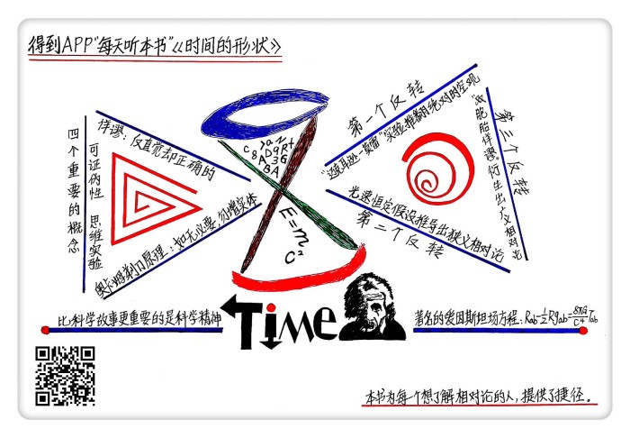
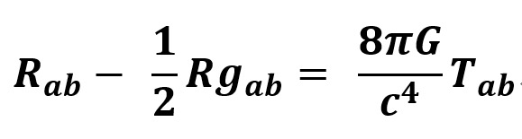

# 《时间的形状》| 汪诘解读

## 关于作者

汪诘，“科学声音”组织首届轮值秘书。其代表作《时间的形状：相对论史话》获第八届国家文津图书奖，另著有《星空的琴弦》《外星人防御计划》《科幻世界漫游指南》等作品。自媒体节目《科学有故事》主播，全国各科技馆、中小学人气演讲嘉宾。

## 关于本书

这是一本读着像小说一样的科普读物，作者按照时间顺序，从伽利略、牛顿的经典物理学理论开始说起，再讲到光速测量，以及困扰经典物理学界很多年的光速不变之谜。一个接一个的悬念推动物理学的发展，直到爱因斯坦横空出世，用相对论破解有关时间、空间、运动和引力的谜团，为读者打开一个看待世界的全新视角。

## 核心内容

我们今天所知道的现代物理学知识并不是某一个科学家拍脑门的产物，而是一代又一代科学家们传承的结果。新的物理学知识并不是完全推翻了旧有的物理学知识，而是对旧有知识在更高精度上的修正，新知识体系必须兼容旧知识体系。现在，“上帝”留给我们的两道新思考题又摆在了人类面前，等待着我们去破解下一个自然规律之谜。

## 前言

你好，欢迎每天听本书。本期音频为你解读的是《时间的形状》，副标题是“相对论史话”，这本书大约20万字，我会用大约23分钟的时间给你说说：大名鼎鼎的相对论到底是一个怎样的理论，爱因斯坦又是如何提出的。

说到相对论，有些人觉得，相对论的意思就是，世界上没什么是绝对的，都是相对的。这完全就是胡说八道，其实爱因斯坦晚年的时候，非常不喜欢别人把这个理论叫相对论，他觉得应该叫不变论才对。因为爱因斯坦最自豪的就是他发现了宇宙中的那些永恒不变的东西，比如在真空中光的传播速度是不变的。除了这种印象之外，在大多数人的印象中，爱因斯坦的相对论是一个非常高深难懂的理论。而《时间的形状》这本书，就为每一个想了解相对论的人，提供了一条捷径。

那到底相对论是个什么理论呢？相对论是研究时间、空间、运动、引力这四者关系的理论体系的总称，它是这一百多年来人类最伟大的两个理论之一，另一个理论是量子力学。在科学史上，曾经有一些理论没有获得诺贝尔奖，并不是这个理论的遗憾，而是诺贝尔奖的巨大遗憾，相对论就是它们的代表。

本书的作者汪诘自称是一个从小热爱自然科学的文科生，我们很难想象一个文科生去写一本讲相对论的科普书，但汪洁居然凭借着这本书一举拿下了第八届文津图书奖，这个奖项被誉为中国出版界的奥斯卡奖。当年和他一起获奖的另外一本科普书，就是“得到”订阅专栏《吴军的谷歌方法论》主理人吴军老师的《数学之美》。

好了，以上就是这本书的基本情况和作者概况，在正式开讲相对论是怎么被提出的这段历史之前，我们还要先来学习四个很重要的概念，可以说，这四个概念不仅对于了解相对论有帮助，对于了解所有科学理论都会有帮助，也可以加深我们对科学精神的理解。

作者汪诘有一句名言，也是他所有自媒体科普节目的总纲，这句名言是：比科学故事更重要的是科学精神。好，我们来把这四个概念的要点勾一下：要判断一个理论是不是科学理论，著名的科学哲学家波普尔提出了一个被广泛接受的标准，那就是看它是不是具备“可证伪性”，也就是说，是不是具备被证明是错误的可能性。比如说，天下乌鸦一般黑，想证明这句话是不是科学理论，你就得满世界去抓乌鸦，如果你抓到一只白色的乌鸦，那就证明这句话是错的，这就是可证伪性。而且科学理论还应该可以做出预言，比如有人说他抓住了一只乌鸦，你都不用看就知道，乌鸦应该是黑色的。

科学界有一个比较推崇的哲学原则，这个原则叫做“奥卡姆剃刀原理”。原文比较文绉绉，是这样说的：如无必要，勿增实体，想解释一个现象，假设最少的解释往往最接近真相。比如咱们都听过的《皇帝的新装》这个童话，除了那个说真话的小孩，其他人可能都做了这么几个假设：假设皇帝穿了一件漂亮的衣服，假设只有聪明人才能看到，假设我比较蠢，所以看不到那件衣服。这是三个假设。但那个孩子呢，他的假设只有一个，就是：皇帝根本没穿衣服，所以我看不到。这就是最接近真相的解释。

在物理学的发展史上，有一种特殊的实验起到了至关重要的作用，这就是“思维实验”，也就是不需要任何实验设备，只需要在头脑中想象一个实验就行。这听上去很违反常识，怎么只靠想就能做实验呢？这还真不是骗人的，相对论的最终建立，思维实验起到的作用可以说是居功至伟。

在物理学中，有一个很拗口的术语，叫“佯谬”。什么意思呢？就是反直觉，乍一听肯定是错误的，但是没想到却是正确的。在相对论的发现过程中，人们发现了非常多的佯谬，也就是反直觉、彻底颠覆我们三观的现象。

好了，这四个基本概念就是本书第一章的内容。作者说，如果跳过不看第一章，完全不影响你看懂全书，但如果你认真吃透了上面四个概念，会让你站在一个更高的层次去欣赏全书。我们这就开始跟随作者，在波澜壮阔的物理学发展史中跌荡起伏。说实话，这本书的阅读体验非常像看一部美剧，一个接一个的反转剧情让你欲罢不能。我们接下来就通过三个反转剧情，把它当成一个完整的悬念故事来给你讲。

## 第一部分

毫不夸张地说，绝大多数人的世界观是停留在三四百年前的伽利略和牛顿时代的，如果你不信，你听听看我下面的这些说法是不是属于“常识”或者说“直觉”。

时间虽然看不见摸不着，难以准确定义，但牛顿说，时间是它自个儿的事，它真实存在但又与外在的一切事务都无关，它绝对地、均匀地流逝，不与任何性质相关，任何力量都无法改变它绝对不变的频率。这就是牛顿经典物理中的绝对时空观。时间对于世间万物都是公平的，上帝他老人家就既像一个慷慨的施主又像是一个超级吝啬鬼，不论你是国王还是乞丐，他从不多给一点也不少给一点。在爱因斯坦成名之前，人人都认为这个绝对时空观是天经地义的常识，难道还会有什么错吗？

第一个反转出现了，当19世纪末，一系列的物理实验都得到了让人匪夷所思的结果，物理学家们甚至怀疑自己的实验设备是不是出了问题。但是所有的实验被一再地重复，而且实验结果都在无情地推翻着牛顿的世界观，整个物理界都开始陷入了疯狂，物理学遇到了前所未有的危机。在所有这些实验中，最出名的一个就是迈克耳逊—莫·雷实验，它被誉为“科学史上最成功的失败”，这个实验是在十九和二十世纪之交做的，也可以看作是新旧物理学的分水岭，极具象征意义，因此，也是几乎所有的科学史书必然要提及的一个实验。这是怎样的一个实验呢？

迈克尔逊和莫·雷是当时两位著名的实验物理学家，他们是测量光速的泰山北斗。他们要做的这个实验就是测量地球在绕日公转中光速的变化。我们都知道，地球绕着太阳公转，如果把地球想象成一艘宇宙飞船的话，如果它绕太阳公转的速度是1的话，那么，根据伽利略的相对性原理，如果有两束光，一束朝着地球运行的方向射出去，另一束背对着地球运行的方向射出去，那么这两束光的运动速度应该相差2。可是，让所有人都大跌眼镜的是，实验的结果却是两束光的速度竟然完全一样，没有任何差异。这和我们的常识可不一样。为了解释这个现象，当时的物理学家们想出了五花八门的解释，但就是没有一个人敢于真正否定原来的看法。

好，这就是故事的第一个反转。之前人们相信的都是牛顿和伽利略的观点，认为时间是绝对的，不受其他因素的影响。但到了19世纪末，一系列的实验推翻了人们的这个看法，其中最出名的就是“迈克耳逊—莫·雷”实验，它被称为“科学史上最成功的失败”。

当时间走到了1905 年，这一年被后人称为物理学的“奇迹年”，在任何一本讲相对论的书上，都一定会提到这个年份。在这一年，年仅26岁的爱因斯坦登上了历史的舞台，他当时只是瑞士伯尔尼专利局的一位小职员，在物理学界没有任何名号。然而就是这位年轻人，在头脑中做了一个伟大的思维实验，就像闪电划破黑夜，突然照亮了新物理学的大门。这个思维实验就是：假如我和光飞得一样快，那么我会看到什么？

请你也在头脑中和爱因斯坦一起来做这个思维实验。假如我们和光飞得一样快，如果经过一个手电筒，在我经过的那个刹那，手电筒打开，我将看到什么？这个问题，折磨了爱因斯坦很久，如果按照人们对运动的传统认知，那么我将看到一束相对于我来说是静止的光。但是，爱因斯坦觉得这根本不可能啊。因为光是一种电磁波，什么是波啊？

举个例子，你拿着一根长绳子，然后抖一下，是不是会看到在绳子上形成一个凸起的波峰一直传递下去？就是绳子上一个点的运动，必然会带动下一个点跟着运动，于是这么传递下去就形成了波。光波的本质就是电场和磁场的交替感应，有点像无数个军人在报数，一定是1、2、3、4这么持续报下去的，这是不可破坏的规则。爱因斯坦为什么觉得一束静止的光不可能呢？因为这就好比报数到了某个军人那不报了，这就破坏了大自然的规矩。

于是，第二个反转剧情就出现了。

## 第二部分

爱因斯坦做了一个大胆的假设：光速相对于任何观察者来说都是不变的，手电筒打开，无论你是静止的，还是在以光速飞行，光速都是不变的。在这里，爱因斯坦就运用了“奥卡姆剃刀原理”，其他的物理学家为了解释迈克耳逊·莫雷实验中没有测出光速的变化，都不得不做了很多假设，比如仪器在光的运动方向上会收缩，地球运动会拖拽光的传播介质等等，当时的人们还没有认识到光不需要传播介质。但是，到了爱因斯坦这里，他拿起了奥卡姆的剃刀，果断地将这些假设全部刮去，他直接假设：光速本来就是不变的。这就是少到不能再少的假设了。

这在当时看来，是不可思议的，没人这么想过。但是爱因斯坦想，先不管这个假设有多荒谬，我们不妨以这个假设为前提，往前继续推导，看看能不能推导出什么可以被实验检验的结论出来。好，下面请你来跟我一起做一个非常颠覆常识的推演。注意，我们又开始思维实验了。

现在，假设我坐在一艘接近光速运动的飞船上，我拿着一个手电筒，在驾驶舱中按下开关，一束光从船头照射了出去。你站在地面上观察飞船和这束光。现在我们来分别想一下我眼中的这束光和你眼中的这束光有什么差别。请记住，我们现在有一个基本假设，那就是光的速度相对于任何观察者来说都是不变的。

好，在你的眼中，因为飞船的速度也是接近于光速的，所以，飞船会和那束光几乎是齐头并进，可能过了一个小时才慢慢地拉开了一些距离。但在我的眼中看到的却不是这样的景象，因为光速相对于我来说依然是每秒30万公里，所以，我看到的是，那束光在一瞬间就与我拉开了几十万公里。这不是很矛盾的一件事情吗？到底谁看到的是真实的景象呢？地面上的你看到我和那束光过了一个小时都没有拉开多少距离，而我自己却看到一瞬间光就跑得没影了。如果我们俩看到的都是真实的景象，那么，只有一个合理的解释，那就是，我的一秒钟等于你的一小时，我们俩感受到的时间是不同的。这完全颠覆了牛顿的绝对时空观，牛顿不是说，对任何人来说时间都是一样的吗？但在这里完全不是这样了啊。但是，它又确实是光速不变推导出的必然结论。

这就是爱因斯坦狭义相对论的核心观点，时间是相对的，没有什么绝对的时间，它与运动密不可分。只要宇宙飞船运动得足够快，宇宙飞船上的一年可以相当于地球上的一百年。1905 年，也就是我们刚刚说的物理学奇迹年，爱因斯坦写了一篇论文，发表了这个观点，而且爱因斯坦还给出了数学公式，可以精确地计算速度和时间之间的关系。换句话说，只要知道宇宙飞船的速度是多少，代入公式，就能计算出宇宙飞船上的时间会慢多少。这就是我一开始提到的科学理论具备可证伪性，爱因斯坦能提出一个精确的预言，你把一只钟放到宇宙飞船上，让它飞一圈回来，我可以预言这只钟慢了多少，不信可以做实验来检验，如果预言错误，那么我的理论就被证伪了，我也就不瞎想了，认输。

可惜，遗憾的是，在1905年，这个实验做不了，两个原因，一是没有那么精确的钟，二是没有足够快的交通工具。直到60多年后，人类发明了每600万年才会误差一秒钟的铯原子钟，再加上我们有了能够环球飞行的飞机，才终于用实验的方式证明了狭义相对论的正确。这已经是爱因斯坦去世很多年后的事情了。

这就是相对论被发现的第二个反转剧情。面对颠覆认知的实验结果，爱因斯坦没有像其他科学家一样，给实验找各种理由假设，而是挥起奥卡姆剃刀，刮掉了几乎所有的假设，只剩下一条，那就是光速本身就是不变的。他不仅用思维实验推断出，时间和物体的运动密不可分，还给出了精确的数学公式，计算速度和时间之间的关系。这就是他的狭义相对论。

## 第三部分

虽然我们现在知道，爱因斯坦提出的相对论是划时代的理论，但是我们刚刚也说了，在爱因斯坦去世的很多年后，他的理论才被实验证明。所以，当狭义相对论刚诞生的时候，几乎没有引起什么轰动，除了少数几位大物理学家意识到了它的重要性之外，绝大多数物理学家都无视了爱因斯坦，一方面是因为爱因斯坦是无名小卒，另一方面是他这个理论太过于反常识。不过就在这时，第三个反转剧情来了，在所有的反对声中，也有以理服人的，在狭义相对论发表后的没多久，就有人提出了一个绝妙的思维实验，让爱因斯坦也大为头疼。

这个思维实验是这样的，假如一对双胞胎兄弟分别坐在两艘宇宙飞船上，一个朝左飞，一个朝右飞，于是，在弟弟的眼里，哥哥以飞快的速度远离他而去，那么根据狭义相对论，哥哥的时间应该比弟弟慢。可是，同样的情况也发生在哥哥的眼里，在哥哥看来，是弟弟在以飞快的速度远离而去，也根据狭义相对论，岂不是应该弟弟的时间比哥哥的慢。那么，这就产生矛盾了，到底谁会变得更年轻呢？这就是著名的“双胞胎佯谬”。

还记得我们之前提过的佯谬吗？就是你乍一听肯定是错误的，但是没想到却是正确的理论。这是很犀利的一个问题，它把反常识推向了极致。谁老谁年轻总应该是绝对的吧？难道这也可以相对？

答案可能会让你大吃一惊，的确反常识，但它确实是真实存在的现象。无论在哥哥的眼里还是在弟弟的眼里，他们的时间真的都比对方过得慢。书里给出了详细的推导过程，我们这里不展开讲了。

对于双胞胎问题的思考，最终让爱因斯坦打开了广义相对论的大门。相对论为什么要分成狭义和广义呢？其实，狭义相对论是英文 Special Relativity 也就是特殊相对论，而广义相对论则是 General Relativity 也就是普遍相对论。狭义相对论特殊在什么地方呢？有两个地方，一个是狭义相对论公式所能处理的运动全都是匀速直线运动，这在物理术语中被称为“惯性系”。第二个是，狭义相对论没有把万有引力，这个宇宙中普遍存在的研究对象纳入到理论中。

经过了十年的漫长努力，爱因斯坦终于丢掉了惯性系，搞定了引力，把特殊相对论升级为了普遍相对论，从此，相对论就可以适用于一切时间、空间、运动和引力这四者的相互关系。更加神奇的是，它几乎是爱因斯坦一个人潜心修炼的成果，如果没有爱因斯坦，我们可能今天还在等待这个理论。在一本美国人写的科学史书中，广义相对论被评价为“这无疑是人类历史上最高的智力成就”，它也被众多物理学家称为“世界上最美的理论”。

为什么美？因为相对论是公理演绎思想的极致体现，它从三个最基本的公理出发，也就是三个无法证明，但又找不到任何反例的假设出发，一步一步，就像证明几何题一样推导出了整个理论大厦，令人叹为观止。这三条基本公理是： 第一，对于任何参考系，真空中光速保持不变；第二，对于任何参考系，普遍的物理规律保持不变；第三，引力和加速度局域等效。这三条公理你不理解没关系，我们来看看爱因斯坦根据它们推演出了什么。爱因斯坦告诉我们，只要以上三条公理是正确的，那么下面这些推论也就一定是正确的。

这些推论有：时间是相对的；质量是相对的；质量和能量是可以相互转换的，这就是著名的质能公式 E=mc2 。这些推论，我估计你听到就能联想到相对论。但是，还有一些推论，你听着会非常熟悉，但是你可能没想到，它们也是从那三条最基本的公理出发推导出来的。比如黑洞。熟悉吧？用相对论的观点来看，黑洞就是因为时间和空间都是有形状的，它们会被引力弯曲，甚至打结，黑洞就是时间和空间的一个死结。再比如，宇宙大爆炸也是相对论的产物，他不是科学家们的凭空想象，而是用相对论的方程式计算出来的。还有一个这两年被刷屏最多的科学名词——引力波，它也是从上面三条公理推导出来的，从本质上说，引力波就是时空的涟漪，新闻报道上说，双黑洞并合产生了引力波，这个双黑洞并合就好像在水中扔下一颗石子，引力波就是水中泛起的阵阵涟漪。爱因斯坦在1916年作出的引力波预言，终于在100年后的2016年被证实，这又是一次相对论的伟大胜利。

相对论还有很多有待证实的推论，比如，在宇宙中可能存在“虫洞”，它可以让我们跨越时空，就像电影《星际穿越》中描述的那样，实现超远距离的星际旅行。什么是虫洞呢？根据相对论的观点，时空是可以被弯曲折叠的，原本两个相距十分遥远的点一折叠就靠近了，就好像从上海到纽约，不是从地球表面飞过去，而是在地球上打一个洞，穿过去，这就大大缩短了路程。毫不夸张地说，我们在太空宇宙题材的科幻电影中，那些令人脑洞大开的奇思妙想，大多数都是相对论的推论。

好了，这就是第三个反转剧情，在这个剧情里，因为反对相对论者提出的双胞胎思维实验，爱因斯坦终于提出了广义相对论。这个理论从三个基本公理出发，推导出了整个理论大厦。在这个理论大厦里，很多爱因斯坦的预言都被找到了证据，也许未来，还会有更多的推论被验证。

总之，如果要把相对论总结成最抽象的一句话，那么就可以这样来理解：爱因斯坦的研究告诉我们，我们身处的这个宇宙，它的时空结构符合一个方程式，这个方程式就是著名的爱因斯坦场方程，它是迄今为止人类找到的最深刻的一个方程式。我附在了本期节目的文稿中，你可以点开看一看：

## 总结

好，以上这些是本书的精华内容，我们通过三个反转剧情，把爱因斯坦提出相对论的故事说完了。不过在最后，我们根据音频一开始提出的四个概念，再为你重新梳理一下知识点。

第一，所有的科学理论都需要具备**可证伪性**，具有可证伪性的理论才算是科学理论。任何科学理论都要能在适用领域中准确预言，而且这个预言还是可以被检验的。爱因斯坦提出的相对论也不例外。为什么说相对论是科学理论呢？因为无论狭义还是广义相对论，爱因斯坦都给出了精确的公式，公式所作出的预言，比如黑洞、宇宙大爆炸、引力波，都被事后的科学实验、天文观测证实，这就是可证伪性。

第二，在科学思维中，有一个重要的思想叫**奥卡姆剃刀原理**，如无必要，勿增实体，也就是我们要尽可能地减少假设前提。当年，面对颠覆认知的实验结果，其他科学家都在不停给实验找各种理由假设，而爱因斯坦却挥起奥卡姆剃刀，刮掉了几乎所有的假设，只剩下一条，那就是光速本身就是不变的。间接地帮助他提出了狭义相对论。

第三，在物理学的发展史上，有一种只在头脑中进行的实验起到了至关重要的作用，这就是**思维实验**。相对论的最终建立，思维实验起到的作用可以说是居功至伟。他想象自己如果和光速一样快会发生什么，也想象过宇宙飞船上的双胞胎谁更年轻，想象这些在现实条件下完不成的实验，帮助他看破了宇宙背后的逻辑。

第四，在物理学中，有一个术语叫**佯谬**，就是乍一听肯定是错误的，但是没想到却是正确的理论。在相对论的发现过程中，人们发现了非常多的佯谬，比如说双胞胎佯谬：一对双胞胎兄弟分别坐在两艘宇宙飞船上，一个朝左飞，一个朝右飞，那按照狭义相对论，在两个人眼里都是比对方年轻的。

撰稿：汪诘

脑图：摩西

转述：江宁