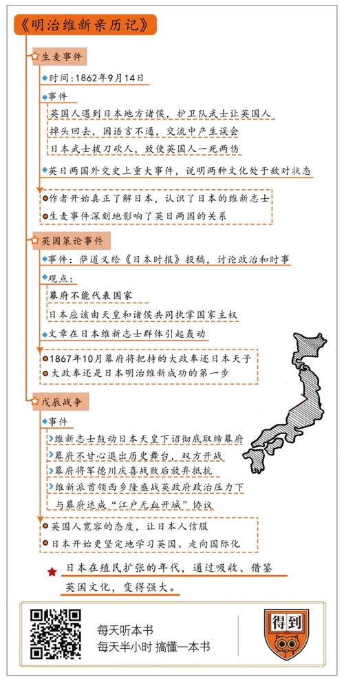

# 《明治维新亲历记》| 青年维也纳解读

## 关于作者

萨道义在19世纪末曾经两次出任英国驻日公使，在成为英国驻日公使之前，萨道义一直在日本做翻译。他是当时唯一通晓英、汉、日三国语言的翻译，所以有机会广泛参与明治维新前后的很多重大事件，和明治维新的核心人物多有交往。萨道义既是明治维新的亲历者、也是参与者。他的一生经历也是19世纪英日关系的缩影。

## 关于本书

《明治维新亲历记》这本书是英国驻日公使萨道义晚年根据自己年轻时候的日记整理而成的，记录了1862至1869年日本明治维新期间之个人见闻，这本书第一次面世时就有“西方知日第一书”的美誉，它让西方人第一次认识日本。全书充满了真实感的描述，用第一手资料，忠实记录了日本各阶层在大变革中寻找出路的艰难历程，从中我们也能看到萨道义这个西方人眼中的日本人、日本精神和日本文化的特质。

## 核心内容

明治维新是日本近代历史上的转折性关键事件，在整个明治维新的过程中，日本的主要学习对象是英国，萨道义等英国人阴差阳错、或是有意为之的参与，或多或少的建构和改变了明治维新的全貌。明治维新令日本在19世纪末国际地位陡然提升，成为东亚唯一逃脱殖民的国家。

## 前言

你好，欢迎每天听本书。本期要解读的，是英国著名外交家萨道义根据自己在日本时的日记编辑而成的一本书——《明治维新亲历记》。

说到明治维新，你肯定不会陌生，这是改变日本历史的一场改革。我先带你简单回顾一下这段历史。1853年，美国军舰打开了日本国门，在随后的十几年里，西方资本主义和工业文明剧烈冲击着古老的日本，日本底层的志士们联合起来，希望振兴国家。1868年，他们武装颠覆了统治日本200多年的江户幕府，开始了维新改革。经过几十年的政治和经济体制改革，日本各项产业蓬勃发展，为振兴国力打下了坚实的基础。

明治维新之后，日本在军事上先后打败了清代的中国和沙皇俄国，他们废除了和列强之间的不平等条约，成了二战以前白人世界之外唯一的列强。所以一般认为，是明治维新改变了日本发展的走向，也改变了日本和整个世界的关系。在《明治维新亲历记》中，你会通过萨道义的经历，看到这种改变在那个西方文明冲击着全世界其他文明的时代，是怎么一步一步发生的。

跟其他关于明治维新的书相比，萨道义的这本《明治维新亲历记》胜在真实。19世纪末，萨道义曾经两次出任英国驻日公使。在成为英国驻日公使之前，萨道义一直在日本做翻译，他是当时唯一通晓英、汉、日三国语言的翻译。萨道义的语言能力，让他有机会广泛参与到明治维新前后的很多重大事件里，他写的《英国策论》也成为推动明治维新的重要文章。

这本书就来自他当时在日本生活时写的日记。这些日记不仅是这段历史重要的一手资料，而且，从萨道义身上，我们还可以看到西方世界在这场改革中起到的重要作用。此外，萨道义在日记里也记录了好多明治维新元勋人物的早年经历，因为太过真实，这本书甚至还在二战时期的日本被禁过。

这本《明治维新亲历记》第一次面世时，就被西方人称为“西方知日第一书”，它让西方人第一次认识日本，就像《马可波罗行纪》让西方人开始认识中国一样。当然，这本书是日记改编的，所以很难提炼出一个明确的主旨，我会根据三个和明治维新有关的重要事件，把萨道义在日本的经历拆成三个阶段来讲。第一个事件，是“生麦事件”，发生在萨道义最初到日本的时候，这个事件不仅让他认识了日本的维新志士，也深刻地影响了英日两国的关系。第二个事件，是“英国策论事件”，当时萨道义发表了几篇无心插柳的文章，却无意之中对整个日本产生了巨大的影响，萨道义个人也因为这件事，参与到了明治维新中。第三个事件，就是戊辰战争，我们说说萨道义和整个英国是怎么卷入到了日本的明治维新之中，发挥了哪些作用。

## 第一部分

在萨道义刚到日本的时候，英国和日本就像两个陌生人，完全不了解对方。在这段时间，萨道义对日本的了解逐渐加深，这也体现出日本和英国这两个国家对彼此的了解逐渐加深。

应该说，萨道义对日本的第一印象很不好。在日本当时的通商口岸横滨，经常发生日本人蒙骗外国人的事情，萨道义本人就有过这种经历。有一次，他想买一本日语标注的汉字字典，身边的日本随从主动要求帮忙，于是萨道义用四个银币买到了这本书。然而一个半月之后，萨道义自己去买书的时候，发现这本汉字字典的价格只有一个半银币。这件事情让他很恼火，自认为是绅士的他对这种“毫无廉耻”的行为非常不满，对日本的最初印象也很不好。

所以，你会发现在《亲历记》前半部分里，萨道义一提到日本人就没什么好话。他说日本人“随便撕毁合同、搞些商业欺诈简直是家常便饭”。但他也提到，刚来闯荡日本的欧洲人其实普遍素质也不高，所以当时日本人形容欧洲人在横滨的聚集区是“欧洲的垃圾堆”。一边是“骗子”，一边是“垃圾”。总之，双方都觉得对方很“野蛮”。

这种误解，必然会让生活在那里的英国人和当地的日本人发生矛盾和冲突。影响最大的一个，就是发生在1862年9月14日的“生麦事件”。这是日本人和英国人之间的第一次大规模冲突，之所以叫“生麦事件”，是因为事发地点叫生麦村，就在今天的横滨市郊。事情的经过很简单，有4个英国人遇到了日本地方诸侯——萨摩藩的诸侯护卫队，护卫队里的武士让英国人立刻掉头回去，然而双方语言不通，交流中有误会，导致萨摩武士拔刀砍人，4个英国人一死两伤。

在日记中，萨道义觉得这个事件黑白分明：野蛮的日本武士上来砍人，文明的英国绅士受害了，日本方面应当负有完全的责任。当时的英国人也普遍持这种观点。生麦事件成了日英两国外交史上一次重大事件，说明两种文化正处于敌对状态。

从萨道义的日记中，我们可以看到，那时候典型的西方人眼中的野蛮、落后的东方。但是，实际上，明治维新之前的日本并不完全像萨道义看到的那样。比如，江户城的卫生条件其实非常好，大街小巷都遍布公共厕所，还会有人专门收纳秽物、回收卖给农民做肥料。想想同一时期，欧洲各大城市还缺少公共卫生设施，随地排泄，如此说来，日本这方面其实胜过欧洲。

所以，如果我们把这次冲突还原到历史背景里，就会发现萨道义口口声声说野蛮的日本人，并不是不分青红皂白地砍人。在冲突发生一年之后，美国《纽约时报》就提出了完全不同的看法，他们说：“这件事错在英国人……错在他们对日本的主要贵族如此无礼……虽然条约给了英国人居住和贸易的自由，却没给他们冒犯日本法律和习惯的权利。”

为什么这么说呢？萨道义写道，“日本平民见到日本诸侯出行都要跪在路边迎接”，但是因为萨道义自己是外国人，就只需要站立在一旁即可。所以，在日常生活中日本和英国两种文化的差异非常明显。我们有一句话叫“入乡随俗”，但是这些在日本的外国人却搞特权，甚至挑战当地的习俗，所以这件事当然可以说是英国人的不对了。

“生麦事件”把两种文明之间的差异暴露出来了，同时，也促使双方不得不更进一步适应对方。你会发现，在“生麦事件”之后，萨道义对日本的态度开始变化了，这种前后对比才是这本书最有价值的地方。这种变化向我们展示了两个文明在最初遭遇的时候，从误解到认识，从偏见到理解的过程。从这里，萨道义开始真正地理解日本，他就像适应日本料理一样开始适应整个日本的文化。

下面我们就来看看后来发生了什么。为了给惨死的本国公民讨回公道，英国人在一年后的1863年8月，把7艘英国军舰开进萨摩藩，想要用武力威慑对手。但是英国人没有预料到，萨摩藩竟然用陈旧落后的沿海炮台给了英国舰队猛烈的打击。萨摩藩沿海炮台区区十多门火炮，却给三艘英国战舰造成严重损伤，60多名英国军人伤亡。虽然这件事最后以萨摩藩赔偿给英国25000英镑告终，但是萨摩藩这种英勇，让英国人对日本人多了一些忌惮，也多了一些好奇。

一年以后，类似的事情在日本另一个维新重镇长州藩发生，英国舰队联合法国、美国、荷兰舰队组成四国舰队，摧毁了长州藩所有的沿海炮台。这个时候，刚从英国留学归来的长州藩志士伊藤博文担任英语翻译主动与英国联络，协调双方停战。伊藤博文大家应该不会陌生，后来中日甲午战争的时候，他就是日本首相，同时也是日本创建宪法、开设议会的核心人物。

在这次交涉中，萨道义因为通晓日语，所以担任翻译。在接触中他发现，日本人虽然一开始“表现得像魔鬼一样凶横强硬”，但很快就态度“和缓”，对各种要求“一一接受”，也“忠实地遵守了协议的规定”。

在跟日本萨摩藩、长州藩的两次战争谈判中，萨道义也深入到一线，和参与到历史进程中的日本武士有了直接的接触。在谈判中，他进一步改变了对日本人的看法，他甚至认为这些维新的日本武士很像“英国绅士”，评价他们“言出必行，值得信赖”。

所以说，两次严重的军事冲突并没有让英国和日本的地方藩国渐行渐远。相反，这个故事有点“不打不相识”的意思。在这次的事件中，萨道义和英国都开始认识了日本的维新志士。萨道义和幕府末时期两大雄藩——萨摩和长州志士从此展开了交往，还成为了朋友。

## 第二部分

接下来，我们说说萨道义在日本真正产生影响力的事件，就是他那篇后来被称为《英国策论》的文章。他这篇无心插柳所写下的文章将影响日本的国体。

尽管萨道义在《亲历记》里表示自己选择前往日本，是受了当时两本著名的东方游记影响，对日本产生了“年轻英国绅士都有的那种冒险主义热情”。但是抛开自我美化的成分，萨道义更现实的考虑应该是要寻找上升空间，因为英国政府给在海外工作的公务员准备了丰厚的薪水。萨道义作为普通翻译，在日本一年能挣400英镑，而伦敦的熟练技工才挣50英镑。

但是很快，萨道义就觉得这样的工资安排也不公平，因为他发现，虽然自己能够直接翻译日语和英语，但是其他不懂日语的翻译居然挣得比他还多。在加薪的请求被拒绝之后，萨道义就开始悄悄地给日本横滨的英文报纸《日本时报》投稿赚稿费。他发现《日本时报》的很多读者其实是日本人，所以写了两三篇以后，他果断地把文章内容从旅游文化转到了政治时事，著名的《英国策论》就是从这些文章中出现的。

萨道义的政论文章，主要是从他自己在工作中观察到的现象出发，讨论日本当时的政治和时事。萨道义发现，西方国家跟日本定立条约的对象都是幕府，但是幕府旗下的各藩诸侯其实对幕府的管辖不怎么服气，都想单独和英国签订条约。同样，即使幕府与英国签订了有关某些藩的条约，这些藩也往往以这件事不知情为借口，拒绝执行条约。所以，萨道义在文章中提出：幕府将军并不是日本国家主权者，而是诸侯的首领，与幕府签署的条约缺乏合法性。西方国家的当务之急是废除所有现行条约，然后和天皇以及诸侯开会，共同订立新的条约。

萨道义肯定从来没想过做明治维新的导师，他只是写了一点自己的工作感悟。可是，由于文章里提到“幕府不能代表国家”，日本应该由“天皇和诸侯共同执掌国家主权”，这些观点特别符合当时日本改革志士的想法。所以萨道义的文章刚一发表，就立刻在日本维新志士心中激起波澜，他们干脆把萨道义的三篇政论文章翻译整理成册，起名《英国策论》。《英国策论》迅速在维新志士之间传播开，一时间几乎人手一册。这篇《英国策论》也被明治维新里的另一个大人物西乡隆盛称为“明治维新原型之文”。

这里我们再简单说一点当时的背景。在明治维新中，日本首先需要解决的问题就是幕府在“集权”跟“联合议政”之间的矛盾。幕府当然不想丧失200多年的政治权力，想把政权捏在自己的手中，但维新志士却不想再听从幕府号令，主张全国300多个诸侯“联合议政”，让天皇做国家的最高统帅。所以说，萨道义在文章中不仅发现了当时日本政治局势的主要矛盾，还代表西方世界，提供了一种解决办法。萨道义这几篇文章横空出世，给“集权”与“联合议政”两股潮流提供了一个折中提案：幕府将军要重新回到一般诸侯的位置，和所有诸侯一同议政，但是，幕府将军还可以继续做个“诸侯首领”，主导新政府的政治决策。

萨道义的文章之所以能在当时日本维新志士群体中引起那么大的轰动，主要原因有三点。第一，19世纪是东西方大交流的时代，日本已经看到东方霸主中国被英国打败了两次，所以有识之士早就准备为日本找一条出路，找一个新的学习对象，而他们找的这个对象就是英国。第二，日本的社会把人分为四个等级，分别是天皇、幕府、诸侯、平民，这种社会形态和英国社会很像，所以日本人对萨道义介绍的英国制度接受起来很快。第三，当时日本维新志士急需外国势力支持，他们以为萨道义的文章，代表了以英国为首的国际社会支持他们推倒幕府的主张。当时，萨道义的这个折中提案让维新志士直接学走了。

1867年10月，在维新志士的建议下，幕府将军宣布关闭幕府，把一直以来把持的“大政”奉还给了天皇。“大政奉还”正是明治维新走向成功的第一步。

## 第三部分

接下来我们进入第三部分。由于《英国策论》广泛流传，萨道义在日本名声大噪，他也因此参与到幕府末期的纷争当中。这可以说是萨道义的人生巅峰了，他的意见将要决定最后一代幕府将军的生死。

萨摩藩维新志士认为，英国支持他们推翻幕府统治的行动，所以他们尽全力想推动新任英国驻日公使巴夏礼访问萨摩藩。这次访问中，萨道义作为巴夏礼的翻译跟萨摩藩维新志士的领导者西乡隆盛见了面，两人相谈甚欢，结下了深厚的友谊。

到这里，萨道义已经彻底成了日本人的朋友。在之前说的第一部分中，他和日本人之间还存在很大的隔阂，如今已经惺惺相惜，甚至成为挚友。这种转变，除了因为两种文化遭遇过程中逐渐相互理解，还有萨道义个人的原因。他在日本这些维新志士身上看到了自己的影子，所以对以西乡隆盛为首的维新志士抱有一种同情和鼓励的心态。正因如此，他开始更多地介入到了明治维新，甚至参与到1868年的“戊辰战争”之中。

当时，德川幕府虽然宣布“大政奉还”，自己退居二线，但是这样也没有让维新志士感到满意。维新志士追求的是让德川幕府彻底退出日本政治舞台。所以在1868年2月，维新志士鼓动天皇下诏进行“王政复古”，也就是彻底取缔幕府，重塑天皇权威。幕府当然不甘心这么退出历史舞台，所以双方就开战了。

萨摩、长州等藩兵组成的维新军队获得天皇下诏认可，士气极高，而旧幕府军队看到自己失去大义名分，节节败退。对于维新派来说，整场战争极为顺利，短短三个月时间，新军就从京都一路东进，逼近幕府的大本营江户城，而原幕府的将军德川庆喜在经历了一系列失败以后，公开声明放弃抵抗。

维新派首领西乡隆盛希望“武力讨伐德川庆喜”，但如果是那样，德川家必然会依托江户城和维新军队打巷战，江户城肯定要遭遇战火浩劫。而且，日本也很可能因此爆发更大规模的内战，那么整个日本历史恐怕都要改写了。

就在这个关键时刻，英国公使巴夏礼站了出来。他强烈反对西乡隆盛的武力讨伐，认为从国际法角度看，已经放弃抵抗的德川庆喜不应再受到攻击。他甚至以拿破仑举例：日本不应该处死德川庆喜，就像西方国家不处死拿破仑一样。他告诉西乡隆盛，这种文明人的做法更容易获得西方国家的接受，那样的话，西方国家也会更容易接受日本的维新政府。

对于巴夏礼的劝诫，西乡隆盛一开始有些不以为意。但随后，由于英国公使馆派遣萨道义监视维新军队的行动，新军感受到了巨大的国际政治压力。面对这种压力，西乡隆盛迅速做了一个180度的转变，从“武力讨伐德川庆喜”转为“和平解放江户城”，维新军队与幕府最终达成“江户无血开城”的协议。维新军队进驻江户城，德川庆喜也仅仅遭到流放处理。

虽然英国政府要求英国驻日公使坚持“局外中立”原则，但从《亲历记》来看，你会发现这种“中立”只是表面说说，英国公使的态度会直接影响到日本维新派的决策，甚至是像是否进攻江户，是否严惩德川庆喜这样的重大决策。同时，英国人这种宽容的态度，也让日本人更信服他们了。而且这种态度也在客观上降低了日本维新派和英国全面合作的戒心，所以，日本开始更坚定地学习英国，走向国际化。

## 总结

讲到这里，本期关于萨道义和日本明治维新的故事就告一段落了。下面，我们来简单总结一下：

《明治维新亲历记》是19世纪英国外交家萨道义用自己的日记编辑成的。这本书用第一手资料，忠实记录了日本各阶层在大变革中寻找出路的艰难历程，从中我们也能看到萨道义眼中的日本人，日本的精神和日本文化的特质。

萨道义运气很好，他正好在日本幕府风云激荡的时代来到了日本，他经历了开放通商、内战爆发到天皇亲政等一系列日本近代史上的重要事件。这本书最重要的意义，就是向我们展示了这个意外影响了日本明治维新的英国外交官的亲身经历。我们能够从中看到他眼中变化的日本，看到文化偏见是怎么消除的。更能从他的视角，反观在殖民扩张的年代，日本是怎么吸收、借鉴了英国的文化，又怎么通过这种学习变得强大。

你会发现，在整个明治维新的过程中，日本的主要学习对象是英国，两国的关系也很友好。1894年7月，在日本跟中国打响甲午战争之前的半个月，英国宣布在5年内废除与日本的不平等条约，重新制定平等的《日英航海通商条约》。日本首先从这个“日不落帝国”手中收回了治外法权。到1899年，已经升任英国驻日公使的萨道义，也见证了英国治外法权在日本的消失。

在19世纪末，日本的地位陡然提升，这两个岛国之间更加“惺惺相惜”。1900年中国爆发义和团之乱，当时英国正深陷南非布尔战争的泥潭里无暇顾及。这时候，萨道义已经转任英国驻华公使，在他的大力要求下，英国邀请日本，作为“远东宪兵”，来保护在华英国官民的安全，日本马上就加入了，成了“八国联军”的一部分。以英日同盟为基础，日本最终通过日俄战争的胜利，跻身世界强国之林。1910年，英国甚至专门在伦敦办了一场日本博览会，给全体英国人介绍这位新加入国际社会的东方面孔。到1912年，日本结束了和美国的不平等条约，成为东亚唯一一个逃脱殖民的国家。

撰稿：青年维也纳

脑图：摩西

转述：李璐