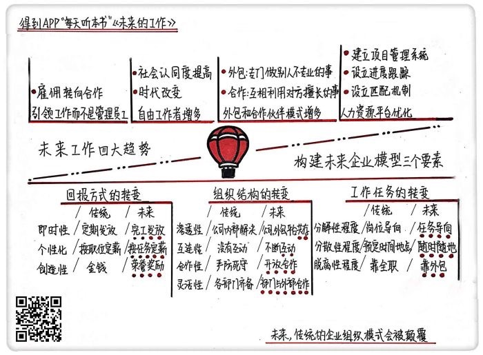

# 《未来的工作》| 时康洁解读

## 关于作者

约翰·布德罗，南卡罗莱纳州大学马歇尔商学院的教授、高效组织研究中心主任。他在人力资源管理方面研究成果颇丰，在《应用心理学》、《人事心理学》、《哈佛商业评论》等期刊杂志上发表过多篇文章。

瑞文·杰苏萨森，认证会计师，韬睿惠悦咨询公司人才管理实践部门的全球业务主管。

大卫·克里尔曼，克里尔曼研究中心的首席执行官。

## 关于本书

这是一本关于未来工作趋势的书，告诉我们将来的企业人力资源管理和工作模式会有哪些变化。

## 核心内容

本书的作者认为，现在90%的全职工作岗位在未来20年会消失，全职的员工会变成自由工作者，企业也会把工作的重心逐步转移到外包公司和合作伙伴中去，传统的企业组织模式会被颠覆。

核心内容分为两部分：一、<u>未来工作的四个趋势</u>；二、<u>未来企业模型的选择</u>。 

## 前言

你好，欢迎每天听本书。今天说的这本书叫做《未来的工作》，副标题是“传统雇用时代的终结”，本书一共348页，我会用大概20分钟的时间为你讲述书中的精髓：理解在未来，企业和我们的工作会有哪些变化和趋势。

这本书的作者认为，未来20年，现在90%的全职工作岗位将会消失，全职的员工会变成自由工作者。企业也会把工作的重心逐步地转移到外包公司和合作伙伴中去，传统的企业组织模式会被颠覆。

现在有一个词特别流行，叫斜杠青年，意思就是一群不再满足单一职业，拥有多重职业和身份的人。这些人既可以是公司的职员，同时也可以是摄影师、美食编辑等身份。特斯拉的 CEO 埃隆·马斯克就是一个标准的斜杠青年，他既是工程师、慈善家，又创立了特斯拉、支付巨头Paypal、太空探索公司 SpaceX 、家用光伏发电产品 SolarCity 等4家不同类型企业的硅谷钢铁侠。

为什么个体可以在这个时代崛起，脱离雇佣独立生存呢？是因为服务业正在成为最大的产业，它不需要机器大规模的生产，你自己只需要拥有知识和技能，就可以成为一个生产者。同时，现在的很多工作也不需要工厂那种环环相扣、每个人只负责一部分，缺少了哪个环节都不行的流程，你只要有一台电脑，保证它联网，甚至只有一个手机都可以让你完成基本的工作。

所以现在，只要你是一个技能拥有者，不管这个技能是什么，比如写作、烹饪、烘焙、做手工，这些你都可以通过自己，或者是通过某些平台，直接给用户提供服务，而不用被固定的工作给束缚。那对于这些人来说，自己的职业就不再局限于某一个公司，对于企业来说，员工队伍和雇佣模式就变得越来越多元化。

这本书的作者分别是约翰·布德罗、瑞文·杰苏萨森和大卫·克里尔曼三个人。约翰·布德罗博士是南卡罗莱纳州大学马歇尔商学院的教授、高效组织研究中心主任，在人力资源方面有特别多的研究成果，在《应用心理学》《人事心理学》《哈佛商业评论》等期刊杂志上发表了很多文章。瑞文·杰苏萨森，是一位认证会计师，是韬睿惠悦咨询公司人才管理实践部门的全球业务主管。大卫·克里尔曼，是克里尔曼研究中心的首席执行官。这三个人都是研究人力资源管理的大师。

在这本书里，作者就告诉了我们，未来工作的4个趋势，和作为管理者应采用什么样的人力资源模型来应对变化。

## 第一部分

作者把我们正在经历的和马上要经历的时代叫做超职场时代。之前我们的工作方式基本都是全职工作，朝九晚五每天上班打卡下班回家。在哪个公司我就为哪个公司服务，每个月按时领工资。但是现在随着互联网的发展，我们很多坐在工位上的传统工作开始发生变革了，有的人不愿意再接受这种被公司买断的束缚感，有的人发现自己可以同时胜任不同的工作。于是很多新的工作趋势就出现了，主要表现有4个：

第一个趋势，<u>引领工作而不是管理员工</u>。之前的管理理论，都在教我们怎样提高员工的效率、怎样激发他们的积极性，因为人是公司里最宝贵的财富，能为公司创造出工作成果。这个思路，其实是从工业革命后的机器化大生产演变出来的。那个时候，人是机器的延伸，需要天天待在机器旁边工作，与其说是雇佣了工人，不如说是雇佣了他们的双手和时间。但是企业发展的根本核心还是在于拿出过硬的产品，现在工作的地点不再受影响了，那为什么不把能创造出这个产品的人，都拿来为我所用呢？

美国的一家基因测序公司，就遇到了一个难题，怎样来管理自己的海量数据库。自己公司的员工，要么没有额外的时间，要么没有相应的技术，但是这个问题不解决，公司的发展就会受到极大的阻碍。传统的解决方法就是两种，一个是培训自己的技术人员学会新技能，但是我们都知道，程序员的工作强度都是非常大的，让他们额外去解决一个自己本来并不擅长的问题，肯定会影响到本来的工作任务，并且等培训完黄花菜都凉了。第二个方法就是招聘到合适的人才，可是从人才招聘、面试入职到真正上手工作，也需要一大段的时间，并且招聘过来的人到底真实水平什么样，还存在着不确定性。

最后他们的管理者想到了一个很好的办法，就是到编程大师网去寻求帮助。这个网站其实就是一个很松散的组织，上面有很多注册过的程序员，网站在接到其他公司的需求后发布任务，通过竞赛的方式，吸引很多人来参加，到最后谁的解决方案最完美，谁就可以获胜拿到这次任务的奖励，于是这个公司的数据库管理问题，就用这样的方式迅速完美地解决了。是不是比传统的招聘人才和技能培训要有效率得多？

这种思路就把企业的最终目标落实在了工作而不是员工身上。不管你是不是我公司的员工，只要是能够解决问题的人，都可以想办法进行合作。并且，雇佣就意味着企业和员工是不平等的，一方要受到另一方的管理，而合作是双方基于契约而进行的互利活动。

既然有编程大师网这样的平台存在，就意味着有<u>很多的自由工作者存在</u>，这也是未来工作的第二个趋势。我们可能觉得朝九晚五的工作制度是很理所应当的，作者就说了，其实全职工作也是某一个时期的产物，既然是历史造就的，也肯定会随着历史的发展出现变动。因为过去在农耕经济时，也没有全职工作，大家都是根据季节和庄稼的收获时间进行工作，农忙时候干活，农闲的时候休息，也不是每天按时去田里工作8小时。

后来机器生产出现了，因为机器很大，没办法来回移动，所以只好让工人们都来到工厂里，进行固定地点固定时间的工作。但是现在不一样了，你完全可以自己在家里的电脑上做很多的工作，再也不用每天早起挤地铁忍受早晚高峰上下班，也不用忍受不必要的职场规则，只需要把手头的工作按时高质量完成就可以。

从美国劳工统计局近20年的就业率就可以看出来，从1990年到2014年，全职员工的比例下降了一半，而临时工作者，也就是自由工作者的比例却翻了倍。中国的自由工作者至少也达到了300万，有机构就预测，到了2020年可能会有43%的人都是自由职业者。现在全职员工自由化的趋势越来越明显了，我们可以去领英或者是脉脉上面看，很多人都有不止一个头衔，比如说有一个公司的什么职位，还有另外一个公司的什么头衔，这就说明他不只是在为一个公司服务。

自由工作者的兴起，还有一个原因就是，社会对自由工作者的认同度也越来越高了。之前很多人都觉得自由工作者是不稳定的代名词，没有公司给交保险，随时可能会遇到断粮的情况，接不到活就没法过日子。如果你告诉别人说我在家里工作，他们觉得你要么是啃老，要么是游手好闲，但是现在各种平台越来越规范，推销自己的渠道也越来越多。领英的一个报告就显示，自由职业者在领英平台拥有的人脉数量，是其他职业者人脉数量的2.5倍，自由工作者并不比全职员工的工作资源少。

公司把重点放在引领工作之后，就出现了第三种趋势：<u>外包和合作伙伴的兴起</u>。外包就是把最专业的事情，交给最专业的人来做，把非核心业务外包出去，可以提升公司的效率还可以减少成本。合作伙伴模式是说，企业与企业之间建立联系，互补双方缺少的东西。

先说说在外包方面的例子，华为拥有优秀的管理实践与信息和通信技术市场领导地位，他的外包公司软通动力呢，则在技术与通信领域有纵深服务能力。通过建立战略关系，软通动力变成了在通信及高科技领域全球领先的服务品牌，华为也提高了高效优质的信息化服务能力，因为把非核心的业务外包出去，华为就可以把重心放在优势领域钻研，提升自己的效率。

再来看看合作伙伴模式方面的例子。西门子和迪士尼就曾经建立起了合作伙伴关系，乍一看这两个公司感觉从风格到主营业务都没啥交集，但是因为一款儿童助听器，两个公司达成了合作伙伴关系。西门子负责助听器的设计和生产，迪士尼负责来营销，因为迪士尼的受众群体中儿童占了大多数。在这里要明确一点，虽然两个公司是协同合作，但是迪士尼的营销人员依然以自己本公司的任务为首要目标，不能因为合作耽误了自己的本职工作。

外包和合作的区别就是，外包专门做别人不专业的事情，合作是相互利用对方擅长的事情。外包和合作不仅是为了优化成本，更重要的是为了优化工作。

麦德龙超市就联合了很多家专业公司，共同打造出了未来超市。我们印象中的超市就是一排排的商品，排队结账时候要等长长的队伍，好像每一家都差不多。麦德龙超市就想打破这个方式，在未来超市里，你可以用智能秤自动识别称重产品、自助结账系统、电子导购机器人等很多种新的科技，让购物变得更轻松。

在开始这个项目的时候，虽然公司财大气粗，可以自行解决很多困难，但还是遇到了不少问题。比如说很多计算机方面的问题、人工智能的问题，自己的公司里没有足够的专业人才，要是把现有的员工调离去新的项目，之前的工作该怎么运转呢？所以在这里，他们就选择了与各行业的知名公司进行合作，他们和VISA、IBM、英特尔等大公司都建立了很好的联系，也正是因为有这些专业的公司，才能够让未来商店顺利实现。

最后一个趋势是<u>人力资源平台的优化</u>。这里的人力资源平台，指的就是能够为各个企业和各个求职者提供信息的平台。虽然现在我们的各大招聘网站，都会发布各种全职、兼职的信息，但大部分的招聘介绍还是对于岗位要求的描述，比如你是学什么专业的、有哪方面的素质，却很少有对某一项工作任务的具体描述。所以自由工作者就算是想做，也比较难直接找到符合自己的任务，企业也没有办法第一时间直接找到能解决问题的人。

现在出现了很多自由工作者的平台，它就像一个任务发布广告栏一样，帮助雇主和自由工作者之间牵线搭桥。国外有自由工作者之家、Upwork之类的网站，国内也有像威客、猪八戒网等平台，上面会发布具体的任务和要求，你可以根据自己的能力去匹配，做完之后，经过对方验收，获得报酬。

而且人力资源平台不只是人才超市，让公司去里面挑挑拣拣。他们还主动设立了各种机制，让雇主和工作者能又快又精确地进行匹配。比如说众包竞赛机制，我现在需要做一个视频广告，大家都可以参与，我从中选取最满意的支付报酬。第一个阶段，就和海选差不多，只要你有创意就发给客户，然后客户挑选出来最喜欢的3个，第二个阶段是视频展示，把上一轮的3个创意拍成广告，最后从这三个广告中选出来最好的那一个，作为最终的产品。在这个竞赛的过程中，客户想要的方案就已经出现了。

作为雇主，如果担心任务的进度怎么办？人力资源平台有一个工具，可以在自由工作者工作的时候，从他的电脑上截屏，客户就能直接了解他的进度。同时平台还有项目管理系统，工作者需要定期以项目节点的方式持续汇报工作的进度，这样公司可以更加放心大胆地把工作外包出去。

## 第二部分

上面我们介绍了作者认为今后未来工作的4大趋势。那么作为企业的管理者，面对这么多的变化，到底要怎样把握这个趋势，应该使用什么样的模式来管理自己的公司？在这里作者提供了三个要素，它就像是密码锁的密码，只要将这三个要素正确地排列组合，就能打开手里的锁。

这三个要素分别是：<u>工作任务、组织结构和回报方式</u>。它们分别有左右两个极端，最左边是传统的工作方式，最右边是正在转变的、未来的工作方式。对于不同的公司，我们需要根据具体的职位和工作，在左右两种完全不同的方式中选择最适合自己的。

第一个要素是工作任务，就是被雇佣的工作者交给客户的产品。比如说你做出来的程序、写好的文案、做好的广告视频等等。

工作任务中有三种转变，分别是分解性程度、分散性程度和脱离性程度。

对于分解性程度，传统的方式是按照不同的职务、岗位分配任务，未来的趋势是把工作任务分成小的项目，找到最合适的人来做，实现从岗位导向到任务导向的转变；分散性程度，传统的方式是在预定的时间、地点完成，比如手术、聚会，未来的方式是可以随时随地完成工作。脱离性程度指的是工作内容到底是依靠公司的全职员工来做，还是依靠外包的自由工作者。

第二个要素是组织结构，指的就是工作、工作者和客户三者之间的关系。传统的组织结构就和高墙大院一样，你进去得要通行证，不是这个公司的人就进不去，在这个院子里的人，每个人就待在自己的房间里，没有事情也不轻易走动。

组织结构也有四种转变，分别是渗透性、互连性、合作性和灵活性。对于渗透性，传统的组织形式就是把公司的事情在内部解决，未来的趋势是外包公司和人力资源平台与企业共同存在，不断互动，互连性是渗透性的补充。合作性在传统的组织中是很低的，因为要保护自己的公司机密，公司会把自己的行动隐蔽起来，严防死守，但是未来的趋势中，组织开放性会越来越高，公司与外部之间会有更多的合作，甚至说客户都可以参与进来。灵活性主要适用于部门之间，每个部门就像是一套乐高积木中的零件，传统的做法是一个也不能少，全部都用起来，未来的趋势是把自己的零件送出去，和另一套乐高积木合作，也可以借用其他公司的零件，来回地组合，只要保证组织的高效率运转就可以。

第三个要素是回报方式，就是工作者获得的报酬和激励。这里的劳动回报不一定是金钱，还包括经验、自豪感和炫耀资本等等。

回报方式也包含了三个转变的趋势，分别是即时性、个性化、创造性。

即时性指的是发放报酬的时间，传统的方式是长期模式，按照每个月或者是定期发放，未来的趋势是每完成一个工作，工作者就可以得到一笔报酬。个性化指的是薪酬制度要为每一个人量身定制。传统的薪酬制度中，职位类似的人，工资结构也差不多，但是在未来，自由工作者每次的工作任务都是多样的，发放的报酬也应该按照具体任务的不同来安排。创造性简单来说就是把报酬的方式多样化，因为有的人并不只是为了获得金钱而工作，在未来，他们可能是为了兴趣、获得经验而工作，所以只用工资是无法满足他们的，公司可以通过荣誉奖励、称号认定等方式，让工作者收获更多样的回报。

上面的这三个要素，适合所有的传统企业和未来企业，这是一个组织必不可少的几个部分，作为管理者，需要按照自己的实际需求，把握三个要素的具体转变方向。

对于上面模型的使用，IBM就做了一次大胆的尝试，在企业内部建立起来了新的模型，用来适应未来的工作趋势。IBM的历史已经有100多年了，大家都知道，越是历史悠久的组织，越难改革，IBM它们的组织已经很完善了，形成了很固化的系统，员工也接受了这些规定，想要转变就需要很长时间。就好比我每天都吃夜宵，连续了10多年，你忽然让我戒掉，我就需要克服自己已经建立起来的饮食习惯。

2014年 IBM 和苹果公司达成了合作关系，要知道这两家以前可是出名的死对头。之前乔布斯就嫌弃 IBM 又“大”又“慢”，还跑到 IBM 公司的 logo 下面竖中指，还说最不希望苹果成为 IBM 的样子。但是嫌弃归嫌弃，苹果虽然是一家很酷的公司，每次发布会都有新的黑科技，拥有很多创意和远见，但是在企业级市场的占有率一直上不去，所以两个公司准备来个强强联合，合作开发容易上手的企业级别应用。

在合作的时候双方的员工每天都在一起工作，这样在遇到问题的时候就可以随时进行讨论。在它们合作之前，就先签订了协议，对很多问题就已经达成了共识，比如说双方的员工如果想跳槽去对方公司，这个就不算是挖墙脚，双方都不能翻脸，尊重对方的企业文化等等。就这样双方互补，到了2015年底，苹果和 IBM 已经合作完成了100个 App 。

在这一场合作里面， IBM 自己的人才市场和员工调配中心发挥了很大的作用。

 IBM 的人才市场其实就是内部的人力资源平台，项目经理把工作的项目分解成多个小项目，每个项目大概是半天到1周就可以完成的，然后把具体的任务投放到人才市场上去，大家都可以报名参加。领取任务的方式有两种，第一种就是作品海选，在规定的时间里提交你的结果，方案最佳的人获胜，还有一种是人才竞争，就是你先说明准备怎样完成任务，项目经理从竞选人中挑一个最满意的。这个人才市场不只针对内部员工，它还会根据任务的不同内容，选择性地投放给经过IBM认证的自由工作者。

人才市场是一个发布工作的平台，员工调配中心就是一个专门为了优化工作管理的部门。专门为不同的任务，调配合适的人才。其中的蓝云平台，主要为短期任务物色远程的工作人员，还有一个对外临时调配平台，为外部的合作伙伴和客户，临时安排 IBM 的工作人员。调配中心的主管就说，“我们的目标是成为内部人才安排的伙伴，我们是所有员工人力资源的整合中心，我们不单单是为了分配工作，更是为了给员工提供更适合的工作任务和发展前景。”

 IBM 的整个人才市场和调配中心就把传统的工作任务分散，扩散到每个可以胜任的员工身上，让不同部门、不同身份的内部、外部员工可以直接灵活地合作，模糊公司内部和外部的边界，形成新的组织结构，适应新的工作模式。

## 总结

我们回顾一下，在这本书里，作者给我们梳理了在个体价值迅速崛起的时代，未来的工作出现了4种趋势，分别是引领工作而不是管理员工、自由工作者的增加、外包和合作伙伴模式越来越多、人力资源平台越来越完善。公司管理者为了顺应这个趋势，可以从工作任务、组织结构和回报方式三个要素来建构自己的工作模型，来满足人力资源工作的未来需求。

一直以来，人力资源专家都在寻求怎样管理员工的好办法，直到现在我们才发现，分解、优化工作才是关键，而我们需要做的，就是成为能够高效优化工作的独立个体。

撰稿：时康洁

脑图：摩西

讲述：杰克糖  