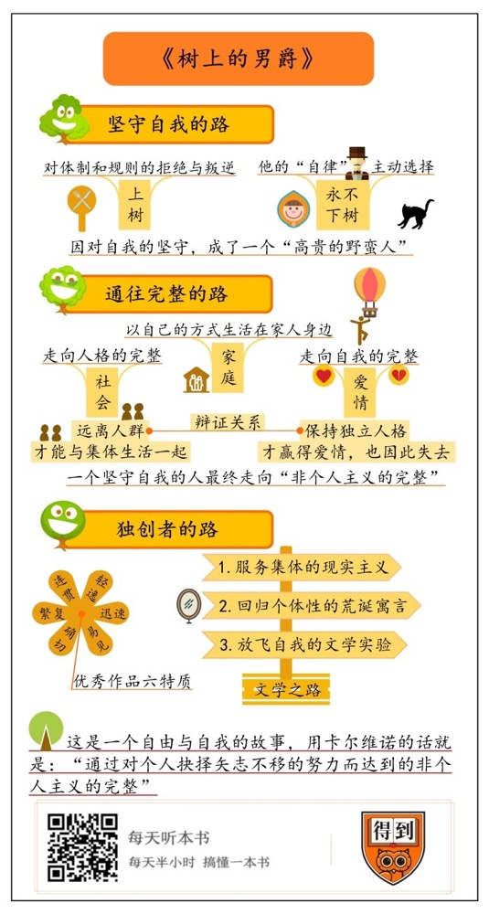

# 《树上的男爵》| 李迪迪解读

## 关于作者

意大利当代最具有世界影响的作家。于1985年获得诺贝尔文学提名，却因于当年猝然去世而与该奖失之交臂。他的作品融现实主义、超现实主义与后现代主义于一身，以丰富的手法、奇特的角度构造超乎想像的、富有浓厚童话意味的故事，深为当代作家推崇，并给他们带来深刻影响，被誉为与博尔赫斯齐名的“作家们的作家”，代表作有《我们的祖先》三部曲、《看不见的城市》、《寒冬夜行人》《命运交叉的城堡》等，达到惊人的艺术高度和思想深度。他的作品以特有的方式反映了时代，更超越了时代。

## 关于本书

一次倔强的反抗，让柯希莫决定永不下树。从此，他一生都生活在树上，却将生命更紧密地与大地相连。这是一个关于自由与自我的故事，用卡尔维诺的话说就是：“通过对个人抉择矢志不移的努力而达到的非个人主义的完整”。

本书是“祖先三部曲”中最长的一部，三部曲中其他两部是《分成两半的子爵》和《不存在的骑士》。“祖先三部曲”的三个故事代表通向自由的三个阶段，关于人如何实现自我的经验：在《不存在的骑士》中争取生存，在《分成两半的子爵》中追求不受社会摧残的完整人生，在《树上的男爵》中有一条通向完整的道路。

## 核心内容

这是一本关于自我与自由的书。主人公为了反抗家庭体制，爬上了树，还给自己立了个Flag：绝不下树。结果，他真的在树上生活了一辈子，度过了传奇的一生。上了树的主人公没有退化成猴子，反而活成了一个人真正应该有的样子。这不是一个关于远离尘嚣的故事，不是一个意大利版的桃花源、鲁滨逊和“瓦尔登湖”故事，而是对它们的超越。用卡尔维诺的话说，这本书讲的是通过对自我的个人主义的坚持，而达到了通往非个人主义的完整。这是什么意思呢？树上的道路究竟是一条怎样的路呢？

带着这个问题，本期音频将从三个方面为你解读这本书的主要内容。首先是“坚守自我”，因为对自我的坚守，主人公成了一个“高贵的野蛮人”；然后是“自我的完整”，如果不将自己与他人相连，个人仅通过自身无法达到完整；最后是“独创者的路”，我们来聊聊卡尔维诺的艺术之路。

## 前言

你好，欢迎每天听本书。这期为你解读的是卡尔维诺的长篇小说《树上的男爵》。

卡尔维诺这个名字，你应该不陌生。他是王小波最推崇的作家，无论在小说还是杂文中，王小波都曾多次赞叹卡尔维诺那“天外飞龙般澎湃的想象力”，和荒诞、奇趣与孩子般的天真。今天我要讲的这本书，就是王小波最喜欢的卡尔维诺的一个作品系列“祖先三部曲”中的一部，也是其中最长的一部。当然，选这本书还有更重要的原因。你也许听说过这位作家的其他作品，比如《看不见的城市》，《寒冬夜行人》等等。没错，这些是他最有名的作品，但它们实验性太强，比如《看不见的城市》是由哲学化的碎片组成的，而《寒冬夜行人》是由十个不同的小说开头组成的，说实话，它们是你亲自去读才能体会乐趣的作品。相比之下，《树上的男爵》更像一个寓言故事，书中的主人公与卡尔维诺本人也非常贴近。除此之外，这本书在卡尔维诺的创作生涯中就像一个里程碑，正是从这本书开始，他开辟出了一条特立独行的创作之路，可以说，这本书是理解卡尔维诺创作的最佳入口。

卡尔维诺是意大利当代最具世界影响力的作家。1985年获得诺贝尔文学奖提名，但就在那一年，他不幸突然去世了。从文学地位上说，卡尔维诺和博尔赫斯一样，都是那种“作家们的作家”，是作家们学习的对象，他对当代文学的影响是非常深刻的。

《树上的男爵》这本书的故事很简单，就是一个叫柯希莫的孩子在12岁那年爬到了树上，给自己立了个Flag：绝不下树。大家都以为这个孩子只是在赌气，没想到，他真的在树上生活了一辈子，度过了传奇的一生。你可能会想，猴子才住树上呢，人类祖先花了那么多年才下了树，学会了直立行走，成为文明体面的人类，为什么柯希莫又上了树呢？这不是退化成猴子了吗？这是一个关于远离尘嚣，一个意大利版的桃花源、鲁滨逊和“瓦尔登湖”故事吗？并不是。柯希莫的故事，恰恰是对它们的超越。用卡尔维诺的话说，这本书讲的是自由的一个阶段，主人公通过走出了一条“树上的道路”，通过对自我的个人主义的坚持，而达到了通往非个人主义的完整。这是什么意思呢？“树上的道路”究竟是一条怎样的路呢？

首先，**树上的道路是一条坚守自我的路，因为对自我的坚守，主人公成了一个“高贵的野蛮人”；第二，树上的道路是一条通往完整的路，这一部分，我要说的是个人与社会的辩证关系；最后，树上的道路是一条独创者的路**，我们来聊聊卡尔维诺的在艺术上的独创性。

## 第一部分

首先我们说第一个主题：对自我的坚守。我们来讲故事。

故事发生在18世纪意大利翁布罗萨的一个贵族家庭，我们的主人公柯希莫是个12岁的男孩，是家中的长子和爵位继承人。叙事者“我”是柯希莫8岁的弟弟彼亚乔。故事开始于一场寻常的家庭午餐，这一餐吃的是蜗牛。柯希莫最讨厌吃蜗牛了，为了表达自己对蜗牛的坚决拒绝，他爬到了树上。

我们的叙事者比亚乔弟弟说，这是一次造反运动。为什么这么说呢？我们来看看这兄弟俩的家庭氛围。他们的父母都是意大利王位继承战争时代的遗老。母亲是个女将军，父亲是男爵，为了得到更高的爵位娶了母亲，对他来说最要紧的就是光耀门厅，他对两个儿子的期望就是他们都能娶到某位显赫的公爵家的小姐。当时时局激烈动荡，父亲总时刻准备着应邀上访朝廷，因此，在家过日子就变成了上访朝廷的大演习。孩子们和大人见面的唯一时机就是吃饭的时候，于是饭桌就成了大人检验孩子是否符合宫廷礼仪的唯一时机，怎么吃，怎么坐，怎么打扮，每个细节都要接受大人检阅。就拿这顿午饭来说吧，父亲端坐在首席，头上戴着路易十四式的垂至耳下的长假发，柯希莫头戴三角帽，身穿燕尾服，戴领带，穿护腿套，带一把佩剑，头发上还要扑粉。

显然，这是一个令人窒息的家庭。在这种环境下，孩子们无法彰显自己的天性。不仅如此，有的孩子还出现了扭曲。兄弟俩还有个姐姐，叫巴蒂斯塔，她因为早恋，过早失去了贞洁，被父母禁足在家，成了居家修女，专门负责做饭。姐姐其实是个桀骜不驯的女孩，她被强制成为修女后，心情非常恶劣，便把自己的一腔怒火和可怕的想象力都倾注到了烹饪上。老鼠，蚱蜢，猪尾巴，蜗牛，都是她的烹饪食材，不仅如此，这些食物在造型上也是屡屡给人惊吓，简直倒足胃口。

在这种情况下，饭桌就成了暴露一家人对立和矛盾的场所，也成了柯希莫发起造反运动的地方。对一个孩子来说，家庭就是他全部的体制和规则所在了，柯希莫为拒绝吃蜗牛而爬到树上，宣告着他对体制和规则的拒绝与叛逆。

不过，上树是一回事，永远不下树又是另一回事。让柯希莫坚定永不下树的决心的，是他当天下午的一次邂逅。那天，柯希莫顺着自家院里的大树，爬到了邻居家院里的树冠上，这可是他第一次踏足邻居家的花园。他们的邻居是翁布罗萨的另一个世袭贵族，两家相互仇视，在别墅之间筑起一道高墙，老死不相往来，然而，对树上的柯希莫来说，围墙根本不存在。在侯爵家的树上，柯希莫撞见了一个荡秋千的小女孩，她叫薇莪拉，10岁，后来成为柯希莫一生的挚爱。

薇莪拉这个小姑娘很有意思，她长得非常美，性格却很桀骜，还有很强的控制欲。她虽然出身于当地最高贵的贵族家庭，却喜欢跟一群流浪的野孩子玩，她组织流浪儿偷树上的果子，骑一匹小马给他们放哨，威风凛凛地发号施令，还喜欢用卖弄风情捉弄他们，让他们互相争风吃醋，总之，这个贵族小姑娘成了一群流浪儿的女王。薇莪拉见到树上的柯希莫，吓了一跳，然后哈哈大笑起来，她一眼看出这是个贵族孩子，却像野孩子一样在树上爬来爬去，实在有趣。小姑娘对柯希莫说，你一辈子别下树啊，树下都是我的领地，你只要一只脚踏上我的领地，就要成为我的奴隶。

这是柯希莫上树后遇到的第一次考验。这时候柯希莫已经对小姑娘一见钟情了，他完全可以选择下树，但他说，我不会下树的！他这么说，是因为他虽然喜欢这个小姑娘，但他不想成为她的奴隶，他只想成为他自己。

当时的翁布罗萨树木异常繁茂，一望无际，据说，一只猴子假若从罗马出发，从一棵树跳到另一棵树脚不落地往前走，可以到达西班牙。大地上的世界被私有制分割成一个个被高墙围绕的花园，而在地面之上，连绵的树木却联结起了城镇和山谷，构成了一个乌托邦般的树上的世界。这一天，柯希莫选择了树上的世界，这当然是不容易的，首先，地面上平直的道路不再存在了，树上的道路只有曲折和繁复；其次是睡眠，他会在清晨湿冷的露水中颤抖着醒来，浑身僵硬，腿脚发麻；然后是自然中时刻潜伏的危险。

在树上生活没多久，柯希莫就遇到了第二场考验。他遇到了一只极其凶恶的野猫。不知为什么，在他与野猫正面相逢时，野猫变得像老虎一样可怕。柯希莫没有野外生活的经验，并不是野猫的对手，他完全可以下树，等野猫走了再上去。但他没有。他与野猫展开了殊死搏斗，直到浑身鲜血淋漓。最后，柯希莫终于用自己的佩剑杀死了野猫。胜利的那一刻，他明白，他从此踏上了自己所选定的道路，就再也没有了失败者的退路。他立即带着猎物去找薇莪拉，但不幸的是，薇莪拉正被家人送往寄宿学校，离开了别墅，两人就此分别了。为了纪念自己的第一场胜利，柯希莫把野猫皮做成了一顶帽子戴在头上，这是无人欣赏的他对自己的加冕。

慢慢地，柯希莫在树上的生活实现了自给自足。他在连绵的树冠上跳来跳去，学会了打猎和钓鱼。他睡在皮囊里，用猎物的皮毛做衣服，做鞋，用羊毛编织裤子，他把打来的猎物烤了吃，多余的就拿去跟农民换蔬菜和水果。他用树皮做了个空中水渠，把悬崖上的山泉水引过来，这样就可以喝水、洗澡、洗衣服。但他并没有因此成为真正的野蛮人。他还是像一个绅士那样生活。他遵从着自己和邻人的行为规范，他会去排污河边的树上上厕所，不随便吃树上的果实。他还是一个求知者，他让弟弟从家里不断拿书、从书店买书给他读，最后成了百科全书式的知识分子，还跟当时的大哲学家伏尔泰、狄德罗通信……

总之，像鲁滨逊一样，柯希莫成了一个生活在自然世界中的“高贵的野蛮人”。不过，与鲁滨逊不同的是，他不是被迫生活在一个与世隔绝的荒岛上，而是主动选择生活在树上的。而且，树上与树下，一步之遥，生活中有什么不方便，生命安全遇到威胁，或者受到爱情的诱惑，又或者家人需要他的帮助，他都可以从树上下来。但是，你想，一旦柯希莫下了树，他之前所做的一切还有意义吗？这就好比一个行为艺术家，他要做的行为就是把自己关在笼子里一个月不用手机。这时候，突然有人告诉他，你家人给你打电话了，有急事。他是接还是不接呢？如果接了，不仅意味着这个作品失败了，还意味着对这个艺术家来说，艺术不是他的首要原则，生活是重于艺术的。对柯希莫来说，树上的世界就是这个行为艺术家的笼子。这是他选择的，一个“自律”的世界。这个自律不是我们通常所说的时间管理、节食减肥的自律，而是相对于“他律”来说的，这种“自律”的意思是，这个人所遵从的不是外界强加给他的律法，而是他内心中的道德准则。对柯希莫来说，不下树，就是他的“自律”，这不是小孩过家家，而是一项崇高的事业，要用无比坚定的意志去完成。

这样看，柯希莫就是另一个鲁滨逊，只不过他是主动选择了孤绝的生活。然而，这并非故事的全部。

## 第二部分

第二部分，我们来说说树上的道路是一条通往完整的路。一个人要怎样才算完整呢？我们可以从柯希莫与家庭、社会和爱情的关系来寻找答案。

接着讲故事。首先是家庭，这是现代人最难以彻底摆脱的关系。你可能会想，柯希莫这么叛逆，他一定像一个出家人那样彻底斩断尘缘了吧。其实并没有。相反，他一直与家人保持着联系，以他自己的方式生活在家人身边。他会与家人一道去做弥撒，当然，他是站在树上做的；节日时，他也会穿出节日的盛装，当然就是他出走时穿的那件已经破旧的燕尾服；他还是会让自己的家庭教师和神父给自己上课，后来因为他精进太快，反倒成了神父的老师，老神父一天到晚往树上爬，听他讲授最新的学问；怪咖姐姐终于出嫁了，他也偷偷在树上“参加”了姐姐的婚礼；母亲临终前，他悲痛又温柔地陪伴在母亲身边，当然是蹲在母亲窗口外的树枝上。他用剑挑起母亲需要的生活物品送到她面前，日夜守护着她。你看，柯希莫不是一个疯癫成魔的叛逆者，他依然真诚地履行着家庭的责任和义务。

不仅如此，他还履行着自己的社会责任。弟弟比亚乔说，柯希莫“是一个不回避人的孤独者”，他心中只有众人。在树上，他长久地看农民干活，为他们指出田垄锄直了还是弯了，向他们报告地里的西红柿已经熟了，有时还帮他们跑跑腿，比如去告诉一个割草人的妻子送块磨刀石来，或者通知人们给菜园浇水，当他看见麻雀停在麦田里，就会挥动帽子大声叫嚷，把它们轰走。这是他走在地面上时从未做过的事情，因为那时他是一个贵族少爷，从没有与村民和仆人说话的机会。后来，他开始帮翁布罗萨的农民摘水果，修剪树木，还帮他们修建了水渠，扑灭了森林大火，打败了狼群，成了颇受当地人敬仰的怪杰侠士。柯希莫的父亲老男爵去世后，他被授予了男爵爵位，成了人们心服口服的“树上的男爵”。

除了农民，柯希莫服务的对象还有住在森林里的流浪者。那时候，四处流浪的穷人都到森林里安身，他们在露天里设立作坊，用铁皮盖简陋的房子睡觉。柯希莫同这些人结下了友谊。他长时间地观看他们干活，替他们传递消息。晚上他们坐在篝火边时，他就坐在很近的枝头上，听他们讲故事。有一次，他意外发现了海盗的藏宝地点，那些宝贝很可能是本地贵族和商人的财产，但柯希莫却干了件劫富济贫的事儿，他通知这帮森林里的朋友跟自己一起去打海盗，结果他们成功打败了海盗，夺走了宝藏，一群人在森林里开开心心地大吃了几天。

后来还发生了好多精彩的冒险故事，我就不一一介绍了，简单来说就是，柯希莫用自己的智慧和勇气，成了翁布罗萨的庇护者，也成为了他自己，一个百科全书式的知识分子。大哲学家卢梭在《爱弥儿》中曾经说过一句话，他说，人不能同时做一个好的人，也做一个好的公民。这句话说的是坚守自我与服务社会之间的矛盾。但柯希莫用自己的实践推翻了这个说法。他爱邻人、爱自然，也爱自己，他既是一个拥有完善自我的好人，也是一个好的社会人。而且，他也反驳了“穷则独善其身，达则兼济天下”这种说法，他不需要“达”，就可以兼济天下。

听到这里，你可能会想，这个柯希莫是个完人啊。但其实不是的。卡尔维诺没有一味拔高柯希莫，他把柯希莫写成了一个人，一个有七情六欲的人。这就要说到人人都逃不开的爱情了。还记得那个叫薇莪拉的贵族小姑娘吗？我们说过，她是柯希莫一生的挚爱，自从她被送去寄宿学校，俩人就没再见过。薇莪拉成人后，父母觉得她太爱卖弄风情，就逼她嫁人，在所有求婚者中，她选择了最衰老的一个，结婚的时候，那人已经八十岁了。婚后第二年，老头就死了，薇莪拉如愿以偿成了自由的寡妇。她继续自己童年的游戏，让围绕身边的男人为她赴汤蹈火，争风吃醋，却对谁也不付出真心。这一天，她回到旧宅，还是在那棵树下，与柯希莫相遇了，这一次，他们相爱了。这份爱让两个特立独行的孤独者都感到了完整。通过薇莪拉，柯希莫第一次认识了自己。

听到这里，你可能会想，柯希莫的人生已经圆满了，但卡尔维诺没有这样写。薇莪拉这个姑娘和柯希莫一样，个性也很强烈，有她自己坚持的东西。她追求极致的爱，觉得爱情就是要绝对献身，牺牲自我的。当年，她让柯希莫永不下树，柯希莫做到了，她因此而爱他。现在，她又想让柯希莫下树，也就是放弃自我，这样她才能相信柯希莫是真的爱自己。这时，柯希莫非常痛苦，但他拒绝了。他说，“如果不充满力量地保持自我，就不可能有爱情。”

就这样，薇莪拉走了。柯希莫失去了爱情，他极度痛苦，爱情的失败导致他在疯癫中度过了后半生。不过，疯癫的他似乎也更有智慧了。他开始继续印刷一份周刊，里面写的是他对于人类的理解，开始他把这刊物叫作“两足动物观察”，后来改名为“有理性思维的脊椎动物”。从这个名字，你就能看出他与人类所保持的距离。就像他所说的：“谁想看清尘世就应当同它保持必要的距离。”

晚年的柯希莫心中始终放不下他的社会理想。他总是在黑夜里把人们集合到森林中，围坐在一棵树下，他就在那棵树上演讲，往往，他会从一种手工技艺的简单规章制度，慢慢谈到建立一个公正、自由、平等的树上的理想国。在他的想象中，他创立了在树顶上的一个完善国家，说服全人类在那里定居并且生活得幸福，而他自己却走下树，生活在已经荒芜的大地上。这里，卡尔维诺还写了一个小插曲，他讲到，在拿破仑征服欧洲、所向披靡的年代，柯希莫声名远播，连拿破仑都专程去翁布罗萨拜访柯希莫。拿破仑说：“如果我不是拿破仑皇帝的话，我很愿做柯希莫的公民！”

在柯希莫生命的最后时刻，弟弟比亚乔找到他，对他说，你在树上生活了一辈子了，现在可以下来了吧，就是一艘船，也有靠岸的时刻啊。但柯希莫没有说话。翁布罗萨的百姓等候在他的树下，准备在他死后接住他坠落的身体。但就在他奄奄一息的时刻，一只热气球飞过了那棵树，柯希莫一跃而起，抓住了热气球的绳索，就这样飘走了，飞上了天空……

就这样，柯希莫度过了“自律”的一生，到死也没有把脚踩在地上。他的墓碑上刻着他一生的总结：“柯希莫——生活在树上——始终热爱大地——升入天空。”当然啦，坟墓里没有他的身体，他的坟墓是天空和大海。

故事到这里就结束了。因为服务集体，柯希莫走向了人格的完整，因为与薇莪拉的爱情，柯希莫走向了自我的完整。这就是卡尔维诺所说的，一个坚守自我的人最终走向“非个人主义的完整”的含义。这里存在着个人与集体的辩证：柯希莫正是因为远离人群，才能与集体生活在一起的；同样，他也是因为保持了独立的人格，才赢得了薇莪拉的爱情，当然，也因此失去了她。显然，这不是一个桃花源、“瓦尔登湖”或鲁滨逊的故事，而是一个超越它们的故事。

## 第三部分

说完了对自我的坚守，以及自我与他人的关系，现在来说最后一点，树上的道路也是一条独创者的路，是卡尔维诺本人所选择的文学之路。

卡尔维诺这个作家，写的所有作品都有强烈的寓言色彩，这本书也不例外，它可以看作是一个作家对艺术与现实的关系的思考。关于艺术与现实的关系，卡尔维诺经历过一场重大的转变。年轻的时候，他经历了二战，作为意大利共产党参加了反法西斯运动。在创作早期，他写了大量现实主义的作品，主要内容是底层人民的反法西斯革命，有点像“革命文学”，这种创作很大程度上是为了服务现实，在当时的文学环境中也并不特别。这是卡尔维诺献身集体主义事业的时期。

战争结束后，他开始了反思，他开始寻找“个人良知与历史进程之间的正确关系”，也因此进入了创作的第二个阶段。这个阶段的卡尔维诺重新成了一个写作上的个人主义者，一个独行者。他的作品变得更像是寓言和童话，非常奇幻并荒诞。不过，卡尔维诺并没有弃绝现实，只是换了一种方式去观照现实。他有一本著名的文学讲稿，叫《未来千年文学备忘录》，在那里他说，在希腊神话中，有一个长着蛇发的女妖叫美杜莎，倘若直接注视美杜莎，你就会变成石头；但如果你能飞起来，并拿着一面镜子去看她，就可以杀死她。这个有着残酷目光的美杜莎，就是现实。直接写现实，艺术就会变成石头。而用镜子折射现实，艺术就可以获得生命。这个镜子，就是艺术家对现实的变形处理。对卡尔维诺来说就是，用奇幻荒诞的方式去观照现实。

“祖先三部曲”就是卡尔维诺这个阶段的代表作。我们讲的这本书就是其中最长的一部。在谈到这本书时卡尔维诺曾经说过：“我过去现在一贯的真正主题，就是一个人甘心情愿地给自己立一条严格的规矩，并且坚持到底，因为无论对他还是对别人，没有这条规矩他将不再是他自己。”可以说，这本书就是卡尔维诺坚定地回归自我，并开辟出一条独创性的文学之路的标志；树上的男爵，就是卡尔维诺自己。此后，他的创作进入了第三个阶段，也就是我们前面所说的，以《看不见的城市》《寒冬夜行人》为代表的，探讨文学写作的无限可能性的阶段。

在《未来千年文学备忘录》中，卡尔维诺讲了自己心中优秀的文学作品应该具有的六个特质，分别是：轻逸（轻重的轻，飘逸的逸）、迅速、易见、确切、繁复，以及连贯，最后一篇“连贯”没来得及动笔写，他就突发脑溢血死去了。这是他总结出的，可以交付给21世纪的人类的六项文学遗产，也是他自己的创作所严格履行的原则。

什么是轻逸呢？卡尔维诺有过一番解释。他说，就是去“减轻分量”。他说，自己写了四十年小说，探索过各种道路，进行过各种实验，总结起来，自己的工作其实就是为了“减轻分量”，有时，他尽力减轻人物的分量，有时尽力减轻天体的分量，有时尽力减轻城市的分量。

王小波说过，包括《树上的男爵》在内的“祖先三部曲”，正是“轻逸”的典范。你想，柯希莫在树上跳来跳去，简直像是鸟儿在飞翔。这是一个无比自由的形象，好像摆脱了万有引力，摆脱了大地和人生的重负一般。这是人物的轻。但倘若仅仅如此，柯希莫这个人物就会成为轻飘飘的远离尘世的幻象，这并不是卡尔维诺心中的“轻逸”。在他心中，真正的轻逸是辩证的。他说，就像昆德拉在《不能承受的生命之轻》表达的那样：我们在生活中选择与珍惜的一切轻松的东西，将来都不可避免地会变成沉重的负担，那么，怎样才能摆脱现代生活中的沉重呢？对卡尔维诺来说，绝不是切断一切与现实的牵连，躲到乌托邦里去，而是从另一个角度去观察这个世界，以另外一种逻辑、另外一种认识与检验的方法去看待这个世界。于是我们看到，在小说中，柯希莫虽然是凌空漫游的，但也是有根的，系在大地上。这是柯希莫的人生选择，也是卡尔维诺的艺术选择。

## 总结

好，这本书的内容就说为你解读到这里了。

一次倔强的反抗，让柯希莫决定永不下树。从此，他一生都生活在树上，却将生命更紧密地与大地相连。柯希莫上了树，却并没有像猴子一样生活，相反，他活出了一个人本应该有的样子：他同时是一个好的人，也是一个好公民。这是一个关于自由与自我的故事，用卡尔维诺的话说就是：“通过对个人抉择矢志不移的努力而达到的非个人主义的完整”。对柯希莫来说，“一个人只有远离人群，才能真正和他们在一起。”同样，一个艺术家只有远离人群，才能去书写关于人类的故事。

撰稿:李迪迪

转述:杰克糖

脑图:刘艳导图工坊