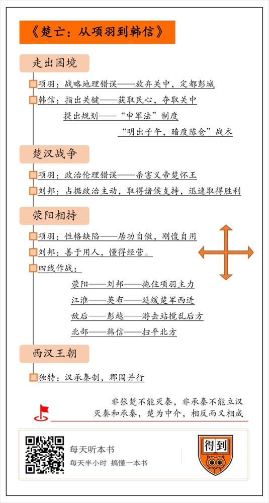

# 《楚亡》| 高新原解读

## 关于作者

李开元，毕业于北京大学历史系，东京大学的文学博士。他师从中国史学大师田余庆先生，去日本留学时又与日本史学大师西嶋定生结下渊源。两位史学大师的指点，让李开元有了坚实的学术功底。而他的写作风格不同于一般的学院派，他师法司马迁，力求打通文史哲。李开元的代表作有《秦谜》《秦崩》《楚亡》三部曲，其中，《秦谜》被他本人称为逻辑思维的历史推理类书籍，《秦崩》和《楚亡》则是人文主义的历史叙事类书籍。

## 关于本书

本书以楚汉战争的五年历程为主线，分析了刘邦崛起和项羽灭亡的原因，并重点讨论了这期间中国国家制度的演变过程。这本书是李开元先生对“打通文史哲”的一次尝试。在本书中，他借用文学的方式进行叙述，并用推理和想象的方式构筑和填补了历史的空白。

## 核心内容

在楚汉战争的过程中，刘邦集团完成了对秦朝三公九卿制、郡县制，皇帝制等制度的继承，同时也接收了项羽所创立的封王建国制。两者结合到一起，就构成了西汉王朝的独特体制，即中央政府、诸侯国、郡县和乡亭里四级构成的联合帝国体制。

## 前言

你好，欢迎每天听本书。本期为你解读的是《楚亡：从项羽到韩信》，本书大概25万字，我会用大约30分钟的时间为你讲述书中的主要内容：在刘邦战胜项羽的过程中，刘邦集团自身也完成了由楚制到秦制再到汉制的转变，进而建立了中国历史上第一个联合帝国，也就是汉帝国。

公元前206年，中国第一个统一王朝秦朝灭亡，而取代秦朝的，我们知道是项羽主导的霸王政治。秦朝灭亡后，项羽将原有的战国七国，全部重新分割，改为十九国，而他本人，则以西楚霸王的身份成为天下诸侯的领袖。项羽的这种霸王政治被本书作者李开元称作是以霸王主导的封王建国制。但是我们知道，项羽主导的霸业并没有维持多久，五年后，刘邦就战胜了项羽并建立了西汉王朝。那么我们应该怎么去评价项羽建立的这短短五年的霸业呢？

李开元先生在他的另一本著作《秦崩》中曾经做过这样的评价：项羽所开创的以霸王主导的封王建国制，其实是西汉联合帝国体制的先行实验。我们知道刘邦建立的西汉王朝有两个独特之处，第一是汉承秦制，也就是说西汉有许多制度是从秦朝继承下来的，比如皇帝制、郡县制、三公九卿制等等；第二就是西汉初年推行了郡县与分封并行的郡国制。而这两点加在一起就构成了西汉王朝的四级联合体制。也就是三公九卿代表的中央政府为一级，诸侯王代表的诸侯国为一级，郡县为一级，县以下的乡、亭和里，也就是相当于我们现在的乡和村为一级。

那么项羽的封王建国与刘邦的联合帝国这两种体制之间是如何转变的呢？答案就在本书的标题中，也就是“楚亡”。其实项羽以及他所代表的楚国灭亡的过程就是两种制度的转化过程。楚汉战争五年中，刘邦不断利用项羽的政治失误，将项羽的政治过失转化为自己的政治优势。而在楚汉两国这种此消彼长的过程中，刘邦集团自身也完成了由楚制到秦制、由霸业到帝业的转变过程，最终结果就是汉朝联合帝国体制的诞生。

本书作者李开元先生，毕业于北京大学历史系，此外他还获得了东京大学的文学博士。他师从中国史学大师田余庆先生，去日本留学时又与日本史学大师西嶋定生结下渊源。有了两位史学大师的指点，让他有了坚实的学术功底。李开元先生的史学研究有一个很大的特点，那就是他非常喜欢走进历史现场。在写作这本《楚亡》时，他亲自探访过韩信故乡，调查过荥阳战场，还到去过项羽自刎的乌江边。可以说这本书里的很多细节，都是他在现场亲身体会后还原出来的。

此外，他的写作风格也不拘一格，用李开元先生自己的话说，他是在师法司马迁，力求打通文史哲。就像他的代表作《秦谜》、《秦崩》、《楚亡》三部曲，在写作《秦迷》时，他尝试通过侦探推理的方式复原历史。而在写作《秦崩》和这本《楚亡》的时候，则更多地借助了文学手法。在《楚亡》的序言中，他写到：历史是记述已经发生的事，而文学是描述可能发生的事。面对历史上肯定有过而史书没有记载的事情，究竟是沉默不语，用严谨的态度束之高阁，还是打破沉默，用推测和想象将其构筑出来？最后，李开元先生选择了后者，他说他的叙述就是为了填补历史的空白。

介绍完作者和作品的一些概况，接下来我们就详细了解下这本书。本期音频中，我将分四个部分为你解读这本书：第一部分，韩信如何帮助刘邦走出最初的困境，他的规划又为何会成为汉承秦制的起点？第二部分，为什么楚汉战争是在楚怀王死后才算正式拉开帷幕？第三部分，楚汉荥阳相持阶段，刘邦所推行的四线作战的战略部署如何帮助他取得战争的胜利？第四部分，汉朝的联合帝国国家体制是如何在楚汉势力此消彼长的过程中形成的？

## 第一部分

我们先来说说韩信如何帮助刘邦走出最初的困境，他的规划又为何会成为汉承秦制的起点？我们开始说秦朝灭亡，项羽主持重新分封天下诸侯。而在项羽的分封名单中，有一个人显得尤为特殊，这个人就是刘邦。我们知道在反秦战争中，刘邦是第一个攻入关中的诸侯，秦政权就是被刘邦亲手终结的。因此按照当初诸侯盟主楚怀王与诸侯们的的约定，刘邦应该被封为关中王，并且继承战国时期秦国的领土。

关中地区相当于现在的陕西省中部，以咸阳为中心，富裕丰饶，又有崤山函谷关这个天然屏障，易守难攻，如果真让刘邦占据这个战略要地，那么这无疑会威胁到项羽的霸主地位。于是在谋士范增的建议下，项羽将刘邦改封到巴蜀地区。巴蜀地区也是秦国的领土，秦国在这里经营了一百多年，将巴蜀打造成了天府之国。但是巴蜀地区四面环山，环境闭塞，交通不便，项羽将刘邦分封到巴蜀，就是想将他困死在这里。不但如此，项羽还将关中地区一分为三，把以章邯为代表的三位秦国降将分封到了这里，来监视刘邦。同时关东地区的韩国、魏国也都是项羽的盟国，可以说刘邦进入巴蜀之后，根本就是动弹不得。

那么刘邦是如何突破这个困境的呢？答案就在我们非常熟悉的一个人身上，这个人就是韩信。我们知道韩信早年在项羽手下做事，因为不得志，投靠了刘邦集团，然后跟着刘邦来到巴蜀地区，之后经过萧何的引荐成为了刘邦集团的三军统帅。那么韩信是如何帮助刘邦打开局面突破项羽的封锁呢？

韩信在为刘邦分析天下形势时指出了项羽一条关键的决策失误，就是项羽放弃关中这个战略要地而选择定都彭城，也就是现在的徐州。项羽在反秦战争中曾经杀害过20万秦军降卒，之后又诛杀了秦国嬴姓宗族，然后纵容诸侯联军抢劫秦国宫室的财宝和美女，焚毁咸阳宫和阿房宫。这一系列举措都让项羽在关中大失民心。而章邯等人投降项羽后被分封到关中，自然也就遭到秦人怨恨，可以说项羽集团已经失去了在秦地的立足点。而相对的，刘邦进入关中时，秋毫不犯，还与民约法三章，这就让刘邦在关中深得民心。所以只要刘邦可以夺取关中，就可以接收秦国的遗产，占据昔日秦国的有利地位，东出函谷关，与项羽一决高下。

那么刘邦又要如何夺取章邯等人把守的关中地区呢？韩信为刘邦提出了两条非常重要的规划，一条是制度性的，叫作“申军法”；一条是战术性的，叫做“明出子午，暗度陈仓”。这两条规划不但帮助刘邦走出了开始的困境，同时也帮助刘邦集团完成了由楚制到秦制的转变。

我们先来分析下第一条“申军法”，什么是“申军法”呢？字面翻译过来就是重新申明军法，韩信以秦国的军事制度为基础为刘邦集团重新制定了军法。我们知道战国时期，秦国在商鞅变法后，制定了一套完备的军事制度，这个军事制度，是以二十个等级的军公爵为中心，包括了军队的编制、奖惩激励制度、退役抚恤制度，还有军人转业成为政治官僚的制度等等。秦国凭借这套军法，战无不胜，这可以说是当时最先进、最高效的军事制度。而韩信“申军法”所做的，就是将秦国的这套军法推广到刘邦的汉军中。

当然，韩信的这个主张也并非只是军事改革这么简单，这改革更重要的一点是他为刘邦完成一个重要的制度转变，那就是改楚制为秦制。刘邦集团从参加反秦斗争开始，就是楚国的一部分。刘邦本人是楚国人，他东进灭秦是执行楚怀王的命令，而他的部将，也几乎都是出身楚国。所以刘邦现在来到秦地建立汉王国后，必须做出一个决定，是迎合出身楚国的将士，继续保留楚国制度，争取打出关中，早日回家？还是改用秦国制度，以秦地为根基，一切重新开始？

可以说韩信是以军事改革为开端，帮助刘邦确立了全面继承秦国的国土、人民和制度的秦本位国策。我们常说汉承秦制，其实刘邦继承秦国制度，就是从此刻开始的，而这一基本国策也正是日后刘邦可以战胜项羽的关键。

“申军法”帮助刘邦完成了制度上的转变，但是关中地区，还有章邯等人把守，要夺取也绝不容易，所以韩信这时又为刘邦提出另一条规划，那就是“明出子午，暗度陈仓”。当时刘邦反攻关中有三条路可选，一条是祁山道，一条是陈仓道，一条是子午道。韩信当时采取的策略就是，一边派军队在子午道修路，做出要从子午道进攻的架势，而同时又秘密派大军从陈仓道进发。结果章邯果然中计，将防守重点设置在子午道。韩信趁机一举拿下陈仓城，而当章邯此时再掉头去增援陈仓时，韩信已经严阵以待，两军交战韩信大获全胜。此后韩信一路凯歌拿下关中全境。随着关中被攻占，无论是从制度上还是从领土上看，刘邦都已完全处于战国时期秦国的有利地势。

以上就是我们要讨论的第一个话题：韩信如何帮助刘邦走出最初的困境，他的规划又为何会成为汉承秦制的起点？刘邦在公元前206年发兵，一个月就攻占了关中地区。紧接着向东方进兵，消灭了韩国并迫使魏国投降。短短八个月，项羽围堵刘邦的防线全被打破，汉军的兵锋已经直接威胁到了楚国的本土。不过虽然到目前为止汉军连战连胜，但是接下来刘邦将要直接面对楚国，因此有两个问题也就摆在了刘邦面前：第一，汉与楚战争的性质是什么，如果刘邦夺取关中是为了拿回自己消灭秦国应得的报酬，那么他现在发兵东进已经算是越界了。刘邦必须要证明汉与楚战争的正当性，因为这直接关系到第二个问题，那就是他与项羽决战，究竟能取得其他诸侯的多少支持。因为当时除了楚汉之外，还有十几路诸侯在跃跃欲试，他们的动向将直接影响战争局势的发展。

## 第二部分

也就在这个时候，项羽送给了刘邦一份大礼，这份大礼不但为刘邦解决了这两个问题，同时也让楚汉两强对立的局面彻底明朗化了。这也就是我们接下来要讨论的：为什么楚汉战争是在楚怀王死后才算正式拉开帷幕？

公元前205年，在刘邦进军洛阳途中，他收到消息，名义上的天下共主楚怀王被项羽杀害了。楚怀王是反秦斗争中的诸侯盟主，秦朝灭亡后，项羽将他架空升为义帝，楚怀王在这个时候其实已经没有任何实际权力了，那项羽为什么还要杀了他呢？

项羽与怀王之间的私人恩怨自然是原因之一，但更重要的是项羽要推行霸王主导的封王建国制度，而楚怀王作为旧体制下的诸侯盟主，自然就成了项羽霸业的最大绊脚石。不过项羽似乎没有发现，他这个时候杀了怀王其实也帮了刘邦一个大忙，因为怀王也是刘邦必须要迈过去的一个坎。那么怀王和刘邦又有什么关系呢？关系就在当初反秦战争中楚怀王与诸侯们定下的“怀王之约”。

怀王之约有一个重要内容就是率先攻入关中的人将取代秦国政权成为新的关中王。怀王之约总的来说对于刘邦是非常有利的，它为刘邦在关中称王提供了法理依据。但是从另一个角度来看，怀王之约也成了加在刘邦身上的一幅政治枷锁，因为承认怀王之约，就等于承认了楚怀王为天下共主。我们知道刘邦出身楚国，同时他又曾经是楚怀王部将。承认楚怀王为共主就意味着刘邦与项羽争夺天下霸主的战争失去了正当性。如今项羽杀了楚怀王，这就让刘邦在政治立场上得到了解脱。他可以在依照怀王之约合法的继承秦国领土的同时，毫无顾忌地与项羽展开争霸战争。

因此我们说怀王之死无论对项羽还是对刘邦来说都有积极的意义，对项羽而言，怀王死后，他所建立的以霸王主导的封王建国制度在当时已经无法改变；对刘邦而言呢，他与项羽争夺天下霸权战争的不正当性，也随着怀王的死一起消失了。换句话说，这时候的中国历史已经完全进入了楚汉两大集团所主导的列国纷争时代。摆在各诸侯国面前的只有两条路，或者依附于楚，或者依附于汉。而接下来，刘邦要解决的问题就是如何取得天下诸侯的支持。

刘邦在得到怀王被杀的消息后，就宣布为怀王发丧，同时派遣使者带着讨伐项羽的檄文通告各个诸侯，宣传项羽杀害怀王是大逆不道。如此一来，刘邦就掌握了政治的主动权。而当时除刘邦之外，对项羽不满的诸侯还大有人在，比如齐国的田荣，他不满项羽的分封，比刘邦早三个月就率先起兵。刘邦东进之所以如此顺利，也正是因为田荣在齐国拖住了项羽的主力。

所以当各路诸侯接到刘邦发出的檄文之后，纷纷响应刘邦，汇聚到刘邦麾下的诸侯联军竟然有将近六十万。刘邦率领这六十万大军兵分三路浩浩荡荡向楚国进发，而当时齐国一而再再而三的反叛，使得项羽根本无法脱身。所以刘邦率领的诸侯联军一路势如破竹，仅仅一个月，就攻克了楚国的首都彭城。到此为止，在楚汉战争的第一个阶段，可以说是刘邦占得了先机。

以上就是我们要讨论的第二个内容：为什么楚汉战争是在楚怀王死后才算正式拉开帷幕？项羽杀怀王不但让刘邦占据了政治上的主动，也让他取得了天下诸侯的支持，这让刘邦迅速取得了这一阶段战争的胜利。但是你可能也发现了，在这一阶段的战争中，刘邦至始至终都没有与项羽发生过正面交战，那么刘邦与项羽正面对决会是什么结果呢？答案是刘邦惨败。项羽得知彭城沦陷后，火速率领三万骑兵回师救援。项羽和他的三万人马昼伏夜出，避过汉军的侦查，如神兵天降一般出现在刘邦面前，结果刘邦的六十万诸侯联军一片混乱，交战中联军死伤近二十万人。刘邦在警卫骑兵的护卫下才得以逃脱。这次惨败让刘邦认清了自己与项羽在军事指挥能力上的差距，此后他只能退守荥阳，准备与项羽进行长期拉锯战。而楚汉战争到这个时候也就进入了第二个阶段，也就是相持阶段，这也就是我们接下来要谈论的话题：楚汉荥阳相持阶段，刘邦所推行的四线作战的战略部署如何帮助他取得战争的胜利。

## 第三部分

刘邦虽然遭遇惨败，但是他自起兵以来的战果还是保住了，刘邦拥有关中地区，这就意味着他的后方稳定，补给充足。项羽虽然取胜，但是此时齐国、赵国、南楚纷纷独立，摆脱了楚国的控制，可以说在军事上的胜利，还不足以完全弥补项羽在政治上的损失。而刘邦此时据守荥阳，避免与项羽展开会战，这也让项羽无可奈何。

退守荥阳的刘邦算是稳住了阵脚，但是光稳住阵脚还不够，刘邦已经很明白自己在正面战场无法战胜项羽，所以他必须想办法在战略上弥补自己战术上的短板。也就是在这个时候，谋士张良向相刘邦推荐了三个人,韩信、英布和彭越。这三个人就是后来的灭楚三杰。

韩信我们知道那是刘邦的大将军，这次刘邦出征是亲自统兵，而韩信则被留在了关中。彭越是魏国将领，骁勇善战，之前与齐国田荣一同起兵反楚。而英布则是项羽手下大将，与项羽一同参加了巨鹿之战，之后被项羽封为九江王，但是此后因为与项羽产生了矛盾，正处于进退两难的境地。于是刘邦从关中招来韩信，同时派人联络彭越和英布结成同盟一同对抗项羽。这三个人的加入对日后的战争局势的发展产生了非常重要的影响。

因为这三个人的加入，刘邦集团就可以同时在四线展开作战。刘邦本人在荥阳与项羽对峙，吸引项羽的主力。南部战场，英布在江淮地区与楚军周旋，坚持了半年之久，大大延缓了楚军西进的步伐。在楚国敌后战场，彭越用游击战将楚国后方搅得鸡犬不宁，使得项羽不得不经常分心顾及自己后方根据地。而最重要的是韩信的北部战场，韩信率军先后攻克魏国、赵国、燕国，最后消灭了齐国。可以说整个中国北方，全部被韩信扫平。而韩信扫平北方则意味着，刘邦集团现在已经完成了对项羽的战略包围。项羽在前线作战，首都空虚，韩信已经随时可以从齐国地区向项羽的大本营发起进攻。

在刘邦四线作战的战略部署下，项羽的军事优势逐渐消耗殆尽。虽然在荥阳的正面战场，项羽还是占据主动，压得刘邦喘不过气来。但是刘邦却凭借关中地区坚实的后方支持，撑了下来。而从当时天下的整体态势来看，项羽此时已经完全陷入被动。在这种情况下，在公元前203年，刘邦向项羽提出了要双方罢兵平分天下的协约，这就是历史上著名的鸿沟之约。

鸿沟是当时连接黄河与淮河的一条运河，在荥阳附近。双方规定，以鸿沟为界，西面归汉，东边归楚，楚汉平分天下。项羽深知再继续与刘邦拉锯下去，对自己已经没有好处，所以他在协约签订之后就遵守约定退兵回楚国去了。但是刘邦的想法并没有项羽那么单纯，他接受张良的建议，在项羽退兵后，撕毁停战协定，突然对撤退的楚军发起进攻。楚军只能仓皇迎战，且战且退。

不过项羽毕竟是项羽，在他的指挥下，楚军渐渐稳住了阵脚。不但如此，他还重整军队给了刘邦反戈一击。刘邦遭到项羽反击，让他再一次意识到了他与项羽在军事才能上的差距，所以他不得不再一次召集彭越与韩信前来助阵。在与韩信和彭越会合后汉军的兵力扩充到了60万，汉楚两军最终在垓下平原展开决战。最终项羽的10万楚军在韩信指挥的60万汉军面前寡不敌众，几乎全军覆没，而项羽本人则在乌江边挥剑自刎。以上就是我们要讨论的第三个话题: 楚汉荥阳相持阶段，刘邦所推行的四线作战的战略部署如何帮助他取得战争的胜利？

战胜项羽的刘邦，在公元前202年登基称帝，西汉王朝就此建立。我们开始说西汉王朝有两个独特之处，第一是汉承秦制，第二是郡国并行。这两者加在一起，就构成了汉朝的联合帝国体制。而同时，我们也提到了，汉朝的这种联合帝国体制，其实就是在项羽走向灭亡、而刘邦政治资源不断扩大的的过程中形成的。那么在本文最后，我们来总结一下：汉朝的联合帝国国家体制是如何在楚汉势力此消彼长的过程中形成的？

## 第四部分

其实要对楚汉战争以及汉朝联合帝国体制的形成做总结的话，有两件事特别具有代表性，这两件事全都发生在楚汉决战阶段。第一是垓下决战前，刘邦召集韩信和彭越前来助阵时，韩信与彭越都按兵不动。后来是刘邦正式许诺册封这两个人为王，他们才同意发兵。第二件事是项羽战败后，撤退到乌江边，他被汉军包围，最后选择了挥剑自刎。当时汉军将士一拥而上抢夺项羽的尸体，项羽的尸体最终被五个人瓜分。这五个人分别是王翳、杨喜、吕马童、吕胜和杨武。当时楚汉两军一共70万人，而这五个人最终从70万人中脱颖而出，名垂史册。更巧的是这五个人全部来自秦地，他们都是在刘邦入主关中后加入了刘邦集团。

我们这里先来说下第一件事，也就是刘邦向韩信、彭越许诺封王，来获取他们的支持。其实这件事就是楚汉战争的五年间，楚汉势力此消彼长的最直接写照。我们说项羽所创立的霸王主导的封王建国制，归根到底是一种霸业政治。霸业政治的基础就是要得到天下诸侯的广泛支持，否则霸王就只是徒有虚名。而项羽刚愎自用、不懂政治上的经营，这就让天下诸侯全都投靠到刘邦阵营，如此一来，霸权也开始从项羽一方向刘邦一方过渡。

刘邦在楚汉战争末期所处的位置，其实与项羽在秦朝灭亡时所处的位置非常相似。我们知道，秦帝国灭亡的同时，被秦国灭亡的诸侯国也随之复兴了，所以项羽在做战后处理时就不能忽视各诸侯国的利益。而刘邦在楚汉战争末期也不得不面对类似的问题。刘邦封韩信、彭越为王来换取他们的支持，这件事就表明，刘邦此时已经拥有了凌驾于其他诸侯之上的霸权，但同时这种霸权又必须要得到其他诸侯的支撑。所以就刘邦与诸侯之间的这种关系来看，刘邦已经继承了项羽所设立的封王建国制，并且掌握了霸权。

但是刘邦不是项羽，项羽迷信武力，刚愎自用，所以项羽的成就最终止步于霸王。而刘邦是政客，他人生的最高境界是获取天下，是执掌最高权力，做秦始皇第二。

我们不知道刘邦是什么时候有了当皇帝的想法的，但是刘邦确确实实从一开始就取得了秦国的遗产。我们刚才提到的第二件事，也就是瓜分项羽尸体的五个人全部来自秦地，这五位秦人的出现看似巧合，其实是有他的必然性的。我们说刘邦不断将项羽在政治与战略上的失误转换为自己政治与战略的优势。而项羽的第一个失误就是他放弃了关中地区，这就给了刘邦汉承秦制的机会。刘邦夺取关中后，他以韩信的“申军法”为开端，开始逐步推行秦朝制度。这就让刘邦从楚本位过渡到了秦本位。此后秦国出身的将士也开始源源不断地加入到刘邦的军团中，成为汉军的中坚力量，那五位秦人就是其中的代表，而这五个人本身就是汉承秦制的产物。

刘邦继承了项羽的封王建国制，分封了韩信、彭越、英布等九人为诸侯王，但他同时又成了秦朝的继承者。他以秦朝军制为开端，将郡县制、三公九卿制也一并沿袭了下来，当然最重要的还有皇帝制度。公元前202年，刘邦正式登基称帝，西汉王朝正式建立，而中国历史则进入了一个新的时代，一个以中央、诸侯国、郡县、乡里四级构成的联合帝国时代。

## 总结

以上就是我就《楚亡》这本书，与你分享的内容，我们回顾一下。

司马迁在总结项羽一生功过时，指明了项羽之所以失败的四个原因：首先是他放弃关中秦国故地，而选择定都彭城，犯了战略地理上的错误；此后他又杀害了当时的天下共主义帝楚怀王，这就犯了政治伦理错误；第三点，项羽居功自傲，刚愎自用，这是项羽自身性格的缺陷；最后一点，项羽自称霸王，过分迷信武力，这是说项羽不懂得政治上的经营。

而项羽的每一步失误几乎都成了刘邦前进的跳板。项羽放弃关中，给了刘邦汉承秦制的机会；项羽杀怀王，给了刘邦争夺天下霸主的机会；项羽刚愎自用、迷信武力，给了刘邦最终取得天下诸侯支持的机会。同时，在刘邦与项羽博弈的过程中，刘邦集团自身则完成了由楚制到秦制、由霸业到帝业的转变过程。

刘邦以秦朝军制为基础，将国家根本制度由楚制转变为秦制，郡县制、三公九卿制、皇帝制也一并沿用下来。而当天下诸侯全都投靠到刘邦阵营，天下的霸权也从项羽一方向刘邦一方过渡。结果就是刘邦继承了秦朝的郡县制与皇帝制，同时又继承了项羽所设立的封王建国制度。而两种制度结合到一起就是西汉王朝的雏形，汉朝的联合帝国体制也因此诞生。

从秦朝崩塌到汉朝建立一共经历了十年时间，中国历史在这十年之间曲折前行，从帝业到王业、从王业到霸业、从霸业再回归帝业，华夏世界在这十年的时间里一次又一次被重新洗牌。但是不知道你注意到没有，在这期间不断主导华夏世界变革重组的都是楚国，无论是陈胜吴广，还是项羽刘邦，他们都是出身楚国政权。而这段曲折道路的终点，就是出身楚国的刘邦，同时继承了楚与秦两份遗产，最终创立了以帝业为基础的联合帝国，也就是汉帝国。田余庆先生在《说张楚》一文中有这样一句话： “非张楚不能灭秦，非承秦不能立汉。灭秦和承秦，相反而又相成，期间都有楚作为中介。” 这句话应该是对这个历史时期最好的总结。

撰稿：高新原

脑图：刘艳

转述：宝木