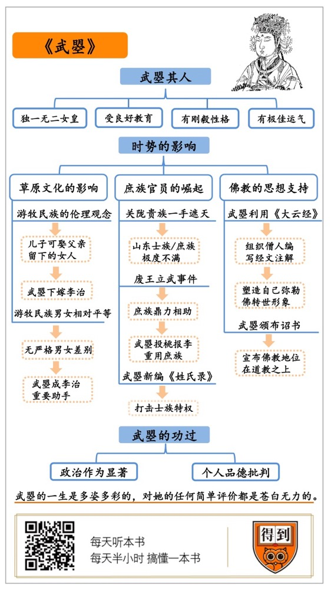

# 《武曌》| 卞恒沁解读

## 关于作者

罗汉，美国著名汉学家，毕业于哈佛大学，后在布朗大学研习唐宋史，现任北佛罗里达大学教授。研究主要集中于唐史领域，对于武则天生平有深入研究。罗汉的著作大多深入浅出，既有深厚的文献基础，又充满趣味。

## 关于本书

武曌为何能够成为中国历史上独一无二的女皇？罗汉的这本著作全方位展现了这位传奇人物的一生：武则天是怎样凭借个人的才干以及时代的恩赐，从一个第十五级的才人，成为唐高宗李治的皇后，继而开创了新的王朝——大周。在本书中都有精彩而详尽的解读。

## 核心内容

武则天的成功既由于她的个人才干，也由于时代的赐福。唐代相对宽松的伦理和性别观念、庶族官员的崛起，以及佛教的影响，共同为武则天铺就了通往皇位的荣耀之路。

## 前言

你好，欢迎每天听本书。

今天我会通过讲一个人，为你展现一个时代。这个人是谁呢？她叫武曌。这个“曌”字并不多见，上面是一个明亮的“明”字，下面是一个天空的“空”字，合起来就是日月当空，普照大地的意思。这个字是专为武则天造出来的，武则天称帝以后，把它用作自己的名字，所以武曌就是女皇武则天。

今天要给你讲的这本书，书名就直接用了人名，也叫《武曌》。作者是美国著名的汉学家罗汉，他是北佛罗里达大学的教授，研究武则天的资深学者。

这本书的副标题是“中国唯一的女皇帝”，这个标题看上去平平无奇，但仔细琢磨一下，这个说法其实又很有意思。

我们都知道，古代中国其实有过不少掌握大权的女性。从汉朝的吕后，一直到清朝的慈禧太后，可以说是层出不穷。这也很容易理解，如果老皇帝去世了，新皇帝年龄还太小，太后性格又强势一点，就很容易出现太后掌权的局面。而且儒家文化最讲孝道，小皇帝听太后的话，在政治伦理上并没有什么问题。

武则天和慈禧太后这些人相比，存在一个根本的区别，那就是她迈出了称帝这一步，是一位名副其实的女皇。她还在世的时候，就获得过一个尊号，叫“则天大圣皇帝”。

你看，在中国历史上，掌权的女性是很多的，但是登基称帝这件事只有武则天干过，不仅空前，而且绝后。那么，武则天为什么能够成为中国历史上独一无二的女皇呢？

要回答这个问题，我们首先想到的是武则天本人的素质。武则天从小就接受过良好的教育。她拥有刚毅的性格，我们都听说过她14岁时为唐太宗驯服烈马的故事；她还拥有不屈不挠的意志，一步步从唐太宗身边的才人成长为女皇；她还拥有非同寻常的运气，才能在一个个重要的关口逢凶化吉。但是，这些因素在很多成功者的身上都可以看到，并不是独一无二的，也不足以回答前面提出的问题。塑造女皇武则天的不仅是她的个人素质，还有时代的大势。俗话说，时势造英雄，相比于个人素质，这些时代大势可能更为重要。

换句话说，通过武则天的成功，我们可以非常清晰地看到唐朝的一些时代特征。今天我将用三个关键词，来为你归纳这些时代特征，这三个关键词分别是草原文化、庶族崛起和佛教。说得更具体点，就是以下三个方面：第一，草原文化的影响给唐朝带来了怎样的伦理和性别观念，从而为武则天参与权力角逐提供了可能性？第二，庶族官员的崛起是怎样把武则天推向权力中心的？这里的庶族是和士族对立的，所谓庶族官员，就是平民出身的官员。第三，佛教的影响是怎样为武则天称帝提供思想支持的？

## 第一部分

我们先来看一个方面，草原文化在当时对伦理和性别观念的影响。

武则天成功道路上的重要一步，是她从感业寺回宫，被唐高宗李治封为昭仪。如果没有这一步，那后面的故事也就无从说起。武则天原本是唐太宗李世民的才人，和李治隔着辈分，这要放在其他朝代可能就会被说成是乱伦，但武则天幸运地生在了唐朝。南宋著名思想家朱熹曾经说过：“唐源流出于夷狄，故闺门失礼之事不以为异。”意思是唐朝和游牧民族有很深的渊源，所以并不把乱伦太当回事。这里的游牧民族指的是鲜卑族。

西晋灭亡以后，中国北方经历了一段被称作“五胡十六国”的历史时期，就是五个少数民族进入中原地区，建立了大大小小的政权。这五个少数民族分别是匈奴、鲜卑、羯族、氐族和羌族。这五个民族中，对后世影响最大的是鲜卑族。中国北方经过五胡十六国的长期战乱，先后出现了北魏、北周这两个统一北方的王朝，而这两个王朝都是鲜卑族建立的。隋唐两代都和北周王朝有着很深的渊源，隋唐的皇室原本都是北周的臣子，还与鲜卑族相互通婚。隋炀帝杨广的母亲和唐高祖李渊的母亲，都是鲜卑贵族独孤信的女儿。所以，隋唐皇室都有鲜卑族的血统，唐高祖李渊和隋炀帝杨广其实是表兄弟。

正因如此，隋唐皇室的伦理观念受到草原文化的深刻影响，和传统的中原王朝很不一样。对草原上的游牧民族而言，儿子继承父亲留下的女人，是一件很正常的事情。汉朝的王昭君嫁给了匈奴单于，在单于去世以后，她不得不下嫁给单于的儿子，这在汉人女子看来是一种屈辱，但在游牧民族看来却是天经地义的。所以，唐代吸收了游牧民族的伦理观念，这为武则天回宫参与权力角逐提供了前提条件。

除了伦理观念，草原文化还给隋唐时期带来了与众不同的性别观念。游牧民族并没有汉人儒家社会那样严格分明的男女差别，在辽阔的草原上，并没有“男主外，女主内”的划分，女子也可以骑马打猎，牧马放羊，和男子一样生气勃勃。这种性别观念渗透进了中原文化，所以唐朝的两性关系也比其他朝代更平等，更开放。当时的女性比此前和此后都更为强势，出现了不少“怕老婆”的故事，甚至连皇帝也不能幸免。

隋文帝杨坚就是个出了名的“妻管严”。在他的后宫里，他只有独孤皇后这么一位配偶。有一次杨坚忍不住临幸了一位姓尉迟的宫女，独孤皇后知道了，就趁杨坚上朝的时候，下令把这个宫女打死了。杨坚敢怒不敢言，只好赌气离家出走，最后被大臣们追了回来。你看，杨坚和独孤皇后的关系，都快赶上今天的一夫一妻制了。更重要的是，独孤皇后还很有政治才能，杨坚对她几乎是言听计从，朝中大臣们就把杨坚和独孤皇后合起来称为“二圣”，这个称号意味着独孤皇后的政治地位和杨坚已经非常接近了。

“二圣”这个称号后来再次出现，就是在唐高宗李治时期。李治并不是一位懦弱无能的君主，他很有才干，开创了“永徽之治”的局面，但他的身体不大好，经常头晕目眩，视力也严重下降，用现代医学的话说，他可能患有心脑血管疾病。后来，李治的身体越来越差，终于到了不能办公的地步，就只有找一个最信任的人来帮自己处理政务，这个人就是皇后武则天。

武则天虽然是女子，但接受过很好的家庭教育，加上她长期在李治身边耳濡目染，对于政治很有心得。于是，武则天就成为李治最重要的助手，甚至在上朝的时候，她也经常坐在李治的身边，一起议论朝政。于是大臣们就把李治和武则天也称为“二圣”，这等于承认了武则天拥有和李治相近的政治地位，可以看成是武则天后来独揽大权的前奏。而且这段经历，也帮武则天积累了丰富的政治经验。武则天做皇帝只有15年时间，也就是从公元690年登基到公元705年退位，但在此之前，她已经在政治舞台中心活跃了35年之久。她能够获得这样的机会，和唐代相对平等的两性观念是分不开的。

公元666年新年到来之际，武则天又向全天下展示了她的政治地位。这一年，李治在泰山进行了封禅大典。“封禅”这两个字是有讲究的，“封”就是祭天，“禅”就是祭地。封禅仪式通过祭祀天地，一来可以夸耀皇帝的功德，二来可以显示君权神授，强化皇帝的合法性。

在以前的封禅仪式中，执行仪式的是皇帝和公卿大臣，但武则天却提出，天代表阳，地代表阴，所以祭天的仪式应该由皇帝来主持，祭地的仪式应该由皇后来主持。李治同意了武则天的要求，于是在这次封禅大典上出现了这样的景象：祭天仪式结束以后的第三天，举行了祭地的仪式。祭地仪式分为初献、亚献、终献三个步骤，李治象征性地执行了初献的步骤，武则天随即登台主持了亚献，把祭酒洒入礼器，在雅乐的伴奏下完成了仪式。随后，又由后宫佳丽和重臣们的妻子来完成了终献。武则天通过封禅大典，给世人一种印象，自己并不是皇帝的附庸，而是一支独立的政治力量。

又过了几年，这种印象又通过称号上的改变固定了下来。公元674年，李治和武则天的称号分别改为“天皇”和“天后”，“天后”并不仅仅是皇帝的配偶，她和皇帝一样，同样代表上天的意志。传统中国政治最看重“名号”，所谓“名不正则言不顺”，“天后”这个名号，成为武则天的重要政治资本。

在当时，这种平等的性别观念并不局限在皇室内部，还影响了整个中国社会。公元653年，也就是武则天刚刚从感业寺回宫的时候，民间出了一位女皇帝。这一年，东南沿海地区发生了一次农民起义，起义军领袖是个女人，名叫陈硕真，她以太上老君为号召，吸引信徒，发动起义，还自称皇帝。陈硕真这个女皇，比武则天出现得更早，虽然不被主流史学界承认，但至少说明，当时的男人们并不觉得为女性首领效力是什么羞耻的事。

## 第二部分

不过，这种性别观念虽然很重要，但只是为武则天的回宫和掌权提供了前提条件。武则天能够一步步走上女皇的宝座，还由于她找到了权力的基础。下面我就为你讲讲，唐代庶族势力的崛起，是怎样把武则天推上女皇宝座的？

所谓“庶族”，它有一个对立的概念，我们可能更熟悉，就是“士族”。所谓的士族，就是世代为官的名门望族，本质上是学者、官员和地主的三合一，比如东晋的宰相谢安、著名的书法家王羲之，都是士族的成员。

士族的势力在魏晋时期发展到了顶峰，他们垄断了当官的门路。当时有一句话叫“上品无寒门，下品无士族”，就是寒门子弟都当不了大官，大官的职位都被士族占据了。这里的“寒门”，还有另一个名字，叫做“庶族”，就是没有士族背景的家族。

士族势力到了唐朝受到一定的抑制，这主要是因为科举制度为寒门子弟做官提供了机会，庶族势力开始走上政治舞台。但是士族势力并没有完全消失，于是士族和庶族势力之间开始明争暗斗，这也为武则天上台提供了机会。

唐代前期，有两股士族势力最大：第一股叫“山东士族”，就是太行山以东地区的士族，这批士族是在北魏孝文帝改革的时期形成的，唐太宗时期的重臣房玄龄就出身于山东士族。第二股叫做“关陇贵族”，就是居住在今天陕西关中到甘肃陇西一带的士族。关陇贵族源于关陇集团，关陇集团是陈寅恪先生提出的一个概念，主要是指西魏的宇文泰建立的一个军事政治集团。隋唐皇室的祖上都是这个集团的成员，所以隋唐两朝都和这个集团有很深的渊源。

如果用一句话概括，山东士族是旧士族，关陇贵族就是新士族。唐朝皇室原本也属于关陇贵族。唐太宗在位期间，既提高了关陇贵族的地位，也注意维持和山东士族之间的关系。但在唐太宗去世以后，长孙无忌当政，由于长孙无忌也是关陇贵族的成员，他做事比较极端，专门培养关陇贵族的亲信，打击山东士族出身的官员。至于那些庶族出身的官员，就更要统统靠边站了。所以，唐高宗李治上台以后，面临的就是关陇贵族一手遮天的局面。虽然唐朝皇室自己也属于关陇贵族，但朝堂上关陇贵族一家独大，缺乏制衡，对皇帝终究是不利的。李治和关陇贵族之间的矛盾，终于在“废王立武”的事件上爆发了。

所谓废王立武，就是废掉王皇后，改立武则天为皇后。王皇后是李治的原配皇后，她也出身于关陇贵族，是长孙无忌的一颗重要棋子。也许正因为如此，李治和她的感情并不好，加上武则天入宫以后又为李治生了一个儿子，于是李治就想把王皇后废掉，改立武则天为皇后。这可就引起了轩然大波。武则天的父亲叫武士彟，原本是一个木材商人。武则天在长孙无忌看来，就是一个不入流的寒门女子，李治你居然想将她立为皇后，这还得了？

武则天下决心要扳倒长孙无忌，就开始向其他人寻求帮助。当时朝廷上的山东士族和庶族寒门都对长孙无忌敢怒不敢言，由于山东士族有一定的家族背景，比较看重脸面，所以不肯轻易出来冲锋陷阵，但庶族寒门却不一样，他们没什么背景，光脚的不怕穿鞋的，看准了这是个翻身的好机会：要是在武则天身上下注，只要赌赢了，那一定能获得回报。于是他们就纷纷跳出来表示支持。

比如当时有一个大臣叫李义府，他就是庶族出身，担任中书舍人，主要负责诏书的起草。他因为得罪了长孙无忌，正要被贬到地方上去做官。他很着急，就和一个朋友商量对策，朋友对他说，我听说皇上有意立武昭仪当皇后，你赶紧表态支持，说不定还有救。李义府觉得有道理，于是晚上紧急求见李治，递上一份表章，请求废掉王皇后，改立武昭仪为皇后。李治大喜，就让他官居原职。武则天当上皇后以后，就投桃报李，一步步把李义府提拔到宰相的高位。

再比如还有个大臣叫许敬宗，他也是庶族出身，看准了这个机会，经常自告奋勇去劝说长孙无忌答应立武则天为后，结果每次都被骂得狗血淋头，所以武则天对许敬宗特别感激。许敬宗这个人还公然放出话来：一个庄稼汉遇上丰年，多收了几斗麦子，还会琢磨着换老婆，天子要换个皇后，那是天子自己的事，大臣们哪有资格去干涉呢？他说这话就是在鼓励李治，你想做什么就做吧，于是李治就坚定了废王立武的决心。许敬宗后来也一直当到了宰相。

李义府和许敬宗都是庶族出身，为武则天冲锋陷阵，才有了后来的地位。武则天也投桃报李，特别注意重用庶族，建立了以庶族官员为核心的政治班底，也就是所谓的“北门学士”。唐高宗李治在位后期，身体越来越差，武则天已经成为实际的掌权者，这时她以组织撰写《列女传》等儒家典籍为由，起用了一大批文人学士担任她的智囊班子。这批人平常经由皇宫北门进入大内，所以被称为“北门学士”。北门学士基本都是庶族出身，武则天对这些人非常重视。北门学士当中的代表人物比如范履冰、刘祎之这些人，还一直做到了宰相。可以说，武则天能够掌权，是因为她和庶族官员结成了政治同盟。

李治去世以后，武则天独揽大权，并开始削弱唐朝皇室的力量，清除朝中的异己势力，为后来称帝做准备。这时，武则天使用了一种非常手段，也就是“酷吏政治”。她起用了周兴、来俊臣等一大批酷吏，专门罗织罪名、陷害大臣，以达到清除异己的目的。这时，朝中已经无人敢反对武则天的统治，唐朝皇室也对武则天表示臣服。武则天最后称帝也就水到渠成了。

酷吏政治固然是一种恐怖手段，但它同时也是庶族崛起的一种极端形式。周兴、来俊臣这些人，都是庶族官员出身，也只有庶族才愿意去担任酷吏，因为士族顾忌到自己家族的名望，是不会去做这些事的。可以说，是庶族官员们将武则天捧上了女皇的宝座。

武则天和庶族官员之间的联盟并不仅仅是一种政治策略，还有深远的历史意义，那就是进一步打击了士族的特权。庶族官员追求的并不仅仅是官位，还包括和士族同等的政治身份。当时，庶族出身的官员即使做到了宰相，还是会遭到士族的鄙视。前面说到的李义府，他在做到宰相以后，就要求重新修订《氏族志》。

所谓《氏族志》，就是当时各大士族家谱的汇编。一个人是不是士族出身，只要翻开《氏族志》查一下就清楚了。武则天当政期间，面临一个严重的问题，她自己的武氏家族并不在《氏族志》里面，她所依靠的李义府这些大臣也是一样。这样在士族们看来，武则天的政治势力就是一群不入流的庶族集团，显得很没有地位。于是李义府等人就提出，重新修订《氏族志》，把武则天和他们的家族统统放进去。

这个建议正合武则天的心意。于是在公元659年，武则天授意一群大臣编成了一本新的家谱汇编，取名叫《姓氏录》，这本书有一个重要特点，那就是不以士族出身，而以官职高低为划分等级的标准。只要是五品以上的官员，都可以列入其中。如果没有五品以上的官职，哪怕是士族出身，也没资格列进去。《姓氏录》颁布以后，庶族官员们欢呼雀跃，从此对武则天死心塌地，成为支持她做女皇的关键力量。

从大历史的角度看，武则天这个人出现得非常及时。在唐高宗的时代，长孙无忌为首的关陇贵族一家独大，如果不是武则天率领庶族官员与之对抗，那么唐朝很可能会走回“上品无寒门，下品无士族”的老路。庶族势力的崛起，是塑造女皇武则天的第二个因素。

## 第三部分

武则天虽然获得了庶族官员的支持，但要想成为女皇，还缺少一个关键的因素，那就是思想上的支持。我们都知道，在古代中国的大部分时间里，皇帝都是从儒家那里获得思想支持的，但这对武则天并不适用。因为儒家思想当中存在非常明显的男权主义色彩，女人当皇帝，这在儒家看来就叫“牝鸡司晨”，就是说母鸡早上打鸣，根本就不正常。武则天只好另辟蹊径。下面我就为你讲讲，佛教是怎样为武则天称帝提供思想支持的？

在当时，佛教已经传入中国五百多年，无论是在高层还是在民间，佛教都非常盛行。李世民九岁的时候，眼睛得过病，他的父亲李渊就亲自前往长安草堂寺祈祷，希望获得佛祖保佑。记录隋朝历史的《隋书》里面也说，隋炀帝当政期间，全国佛经的数量要比儒家“六经”的数量多上几十上百倍。到了唐太宗李世民在位的时候，玄奘法师从天竺求法归来以后，组织翻译了一大批佛经，佛教的影响力就更大了。

武则天曾在感业寺出家为尼，或许是这段经历让她对佛教产生了认识。到了她开始图谋称帝的时候，她敏锐地意识到，佛教是可以利用的思想资源。因为佛教讲究“众生平等”，并没有儒家那么强烈的男权主义色彩。

武则天是怎样利用佛教的呢？她把自己塑造成了弥勒佛的转世。武则天当政时期，有一部重要的佛教经典叫做《大云经》，这部佛经的来源说法不一，有的人说这部佛经早就存在，也有人说这部佛经根本就是武则天授意一批僧人伪造的。但无论如何，《大云经》这部经典对于武则天登基称帝都起到了不可替代的作用，因为《大云经》里提到了这么一个故事：一位菩萨化身成净光天女，佛祖预言净光天女将来会成为国王，如果有人胆敢反抗，就将受到惩罚。

武则天看到这段经文，如获至宝。她有一位男宠叫薛怀义，公开的身份是一位僧人。薛怀义就投武则天所好，组织僧人编写了一部《大云经疏》，就是对《大云经》的经文做出了解释。《大云经疏》里面又作了各种牵强附会的联系，说这位净光天女就是弥勒佛的化身，弥勒佛将要转世为王，武则天就是弥勒佛的转世。

薛怀义等人之所以要强行把《大云经》里的净光天女解释成弥勒佛，又把武则天说成弥勒佛的转世，是因为在当时，弥勒佛是最深入人心的佛教形象，尤其在民间有很多百姓家都供奉弥勒佛。武则天被包装成弥勒佛的转世，这使她获得了巨大的威望。终于在公元690年，武则天在佛教的加持下登上了皇位，把国号改为“周”。她的尊号是“慈氏越古金轮圣神皇帝”，这里面的“慈氏”就是弥勒佛。武则天就是以弥勒佛转世的形象成为女皇的。

在即位以后，武则天还不忘颁布一道诏书，宣布佛教的地位在道教之上，这一举动除了吸引佛教对她的支持以外，还有更深层的含义：唐朝皇帝自称是老子也就是李耳的后代，奉道教为国教。武则天把佛教抬到道教之上，其实也是在向天下宣示自己已经取代了唐朝的天命，历史已经进入了新的时代。可以说，没有佛教就没有女皇，佛教是塑造女皇武则天的第三个因素，它对武则天的政权提供了思想上的支持。

有趣的是，武则天到了晚年，却又信起了道教，求仙问药，追求长生，甚至经常离开宫廷，前往嵩山道观寻求清静。这也从侧面说明，武则天对于宗教采取的是一种实用主义的态度，佛教对于她而言，只是一种政治工具。唐代的思想界出现了儒、释、道三家并举的局面，武则天得以在这三家之中从容游走，取其精华，为我所用，这也是她取得成功的原因所在。

公元705年正月，也就是武则天登基以后的第15个年头，宰相张柬之联合羽林军将领发动政变，包围了武则天的寝宫长生殿，逼迫她让位给儿子李显。已经82岁高龄的女皇没有反抗，宣布禅位。同年二月，李显宣布恢复唐朝的国号，武则天的周朝就这样结束了。这一年的十一月，武则天病逝，并被葬在乾陵，和丈夫李治长眠在了一起。

## 总结

武则天的一生经历极其复杂，后世对她的评价也是毁誉参半。

对于她的政治作为，后世的评价以正面为主。在她当政的五十多年里，社会比较安定，人口显著增长，经济较为发达，文化欣欣向荣，对外关系也相当稳定，历史学家郭沫若称赞她“政启开元，治宏贞观”，意思是她继承和发展了唐太宗的贞观之治，又为唐玄宗的开元盛世奠定了基础。

但是由于儒家文化的影响，后世对于这位女皇的个人品德，又有很多非议甚至是批判。比如五代时期编纂的《旧唐书》，就把武则天描绘成一个恶毒、淫荡、工于心计的女人；宋代的欧阳修也在《新唐书》中大发感慨，说世上大多数时候都是善有善报，恶有恶报，但偶尔也会有例外，像武则天这样作恶多端还能安享荣华富贵的，就是典型的例外了吧。

对于武则天的评价如此两极分化，以至于立在武则天陵墓前面的无字碑，也引起了许多争议。为什么武则天要留下一块没有碑文的墓碑？有人说，这是因为武则天认为苍白的语言根本不足以描述她生前的功绩；有人说，武则天自知罪孽深重，不敢留下碑文；还有人说，武则天料到自己死后会毁誉参半，所以干脆留下一座无字碑，任后人评说。

其实，对于无字碑的各种猜测，反映的就是后人对于武则天的不同评价。武则天的一生是多姿多彩的，对她的任何简单评价都注定是苍白无力的，反倒是无字碑上的一片空白，最能描述她的一生。老子说过，“有生于无”，一片空白之中，恰恰包罗万象。

武则天一生之中，既推崇佛教，也并不排斥儒家和道教；既重用庶族，也并不对士族赶尽杀绝；既打击李唐皇室，建立了新的朝代，却又将儿子立为太子，最终把江山还给了唐朝。在她的身上，存在着无数矛盾，这些矛盾不仅属于她本人，也属于她所生活的时代。后人无法用任何标签去概括她的一生，恰恰是那座空白的无字碑，才是她一生的写照，也是那个时代的写照。

这本书就为你讲到这里。下面总结一下这本书的主要知识点：

第一，武则天能够从感业寺回宫，并参与权力角逐，背后的前提条件是草原文化给唐朝带来了相对宽松的伦理和性别观念。

第二，武则天能够战胜政敌，并一步步走到权力的中心，依靠的权力基础是庶族出身的官员。

第三，武则天最终能够加冕成为独一无二的女皇，还由于唐代佛教深入人心，为武则天提供了思想支持。武则天把自己塑造成弥勒佛的转世，在儒家的思想框架之外，找到了另一套支持皇权的思想体系。

撰稿：卞恒沁

脑图：摩西

转述：顾一菲