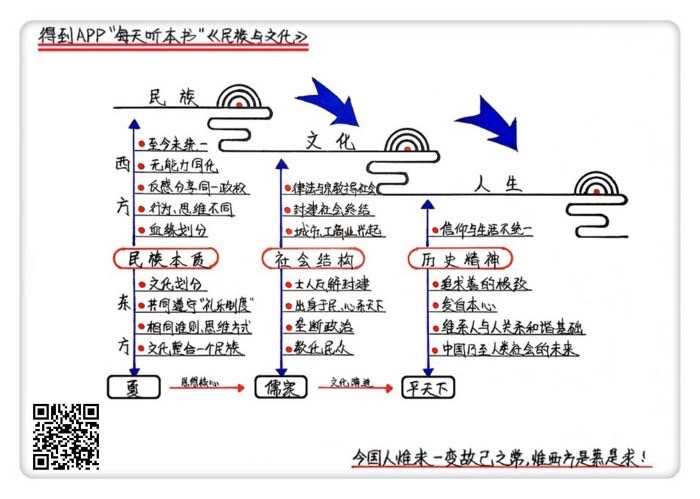

# 《民族与文化》| 闫达解读

## 关于作者

钱穆，一代国学宗师，曾历任北京大学、西南联大等多所知名高校教授。离开大陆后，创办香港新亚书院，也就是香港中文大学的前身。一生著述80余种，如《国史大纲》《民族与文化》等。因“五四”之后西风东渐，心忧中华文化消亡，所以他一生都在奔走呼号，力求为中华文化续命。

## 关于本书

《民族与文化》最早成书在1959年，当时的钱穆正担任新亚书院校长，他受邀去台湾讲学，之后亲自整理讲义与讲稿，才有了本书。全书分为两个部分，前面四分之一是讲义，后面的讲辞部分则占了四分之三，由此可见钱穆先生并非照本宣科，而是满富激情地站在讲台上。全书归纳总结了在此之前，钱穆先生对于中华文化的多次探究，可以说能够代表他的整个学术框架和方向。

## 核心内容

是民族衍生出文化，还是因文化而造就民族，是个类似鸡与蛋先有谁的问题。在本书中，钱穆先生将为我们详细分析，对于中华民族而言，民族、文化、人生的三位一体关系。也就是说民族即文化，而文化即人生。正是因为中华民族推动自身历史的核心动力蕴藏于每个中国人的人生中，所以不论民族受到何种激烈的撞击，最终都会弥合如初，长存不亡。

## 前言

你好，欢迎每天听本书。今天为你解读的是《民族与文化》。这本书大概有12万字，我会用24分钟左右的时间，为你解读其中的精髓：对中华民族而言，是由民族衍生出文化，还是因文化而造就民族，是个类似鸡与蛋先有谁的问题，而这个问题的答案，引领着中国历史的发展。

在解读前，我们先来说个故事。在晚清时，有个法国传教士来中国旅游，他惊奇地发现在这个号称被满族统治的国家，除了发型和服饰外，在其他方面却再也找不到多少与满族本质相关的文化，比如语言文字或者风俗习惯。甚至在他与一些满族人聊天时，如果不是事先就知道，那根本不会发觉这些人与汉族人有什么区别。这个传教士叫古伯察，是第一个游历中国藏区并活着走出来的西方人，刚刚说的这个故事就是出自他写的《鞑靼西藏旅行记》。让这个西方人感到惊奇的情况并不是段子，而是事实。那么，一个统治民族的存在感为何会沦落至此呢？

满族人从中国东北崛起，在明王朝手中夺下政权后，最让统治者所担心的就是满族人在人数上的劣势，会有被汉族人同化的危险。所以早期的几位皇帝都为此设立过很多限制，比如通婚等。但随着时间的流逝，政策的力量在事实面前显得微乎其微。因为很多满族人从小周围的侍从就都是汉族人，在中华文化的熏染里成长，这让他们对中华文化更感兴趣。所以时间一久，来自统治民族的满族文化，就沦落成了次文化。满族也随之被融入了中华民族。

当然，影响如此巨大的社会性事件绝不可能由单个原因造成，但中华民族在遭遇外族入侵的这种严重撞击时，依然能够保持自身的延续，并最终能将外来者同化，显然与文化有着必然的关系。而这种关系是怎样的，就是今天这本书要讲述的内容。

作者钱穆生于晚清乱世，在35岁时发表《刘向歆父子年谱》，解决了中国近代学术史上一大疑案的同时，还平息了经学界的门派之争。之后，声名鹊起的钱穆受聘进入大学任教，开始长达一生的传道授业。他曾经在好几所知名高校担任教授，包括北京大学、北平师范大学、西南联大等，1949年后，钱穆去了香港，并创办了新亚书院，也就是现在的香港中文大学的前身。在钱穆几十年的教育生涯中，出自他门下的高徒不计其数，比如余英时、严耕望、邓广铭等史学界大牛。所以，不论在学术界还是教育界，钱穆先生都称得上是一代宗师。

今天要说的这本《民族与文化》，最早成书在1959年，当时的钱穆正担任新亚书院校长，他受邀去台湾讲学，之后亲自整理讲义与讲稿，才有了本书。前面讲义部分的篇幅仅占全书的四分之一左右，显见钱穆在授课时并非照本宣科，而翻到后面的讲辞部分，仅从文字中也可感受到他在讲台上的激情。

本书虽然不是钱穆最出名的作品，但我们绝不能忽视他在当中倾注的心血。1987年时，听说这本书将要再版，当时已经92岁高龄的钱穆，还亲自参与了增补修订工作。两年后交付印刷前，他又为经过增补的版本重新作序。当时已经到了钱穆人生的最后几年，虽然他自己并不知道，但也足以见得，这本书中有着他的执念。

在本书增补版的序中，有一句话很值得我们注意，那就是“今国人唯求一变故己之常，唯西方是慕是求”。这是个钱穆从青年时代开始，就一直在担心的问题。到了近代，西风东渐，而“五四新文化运动”后，更是有越来越多的人主张全盘西化。但作为重量级学者的钱穆却在这场风暴中，坚持着不同意见，他认为中华民族如果丢掉了自己的原生文化，那民族也必将随之消亡，因为中国长达两千多年的历史，就是由这种文化构建起来的。几十年来他奔走呼号，力求为中华文化续命，就如他的弟子余英时说的：一生为故国招魂。所以哪怕只看书名，也不难理解，钱穆先生为什么在九十多岁高龄时，还要为这本书付出那么大的心血了。

好了，我们现在就一起来跟着钱穆先生的余音，来了解在他眼中的民族与文化。他认为民族、文化、人生三者是三位一体的关系，所以在这个基础上，来看看今天要说的三个话题：第一，对于民族的本质是什么，在中国有着异于西方的看法，而这，是怎样在宏观上影响历史的；第二，中国有着与西方不同的社会结构，这种不同，对历史有着怎样的影响；第三，中华民族领导自身历史的精神蕴藏在何处，这种精神又是怎样的。

## 第一部分

先来说说对于民族本质，中国与西方有着怎样不同的看法。

在中国一说起民族，大家首先想到的一定是56这个数字。但其实在古代的中国，是没有民族这个概念的。不信的话，各位可以去查查，一定不会在任何一本古书上见到这个词。说起来，民族这个词在中国出现的时间并不长，是直到近代，才从西方引进的。在西方的观念里，划分民族的标准是血统。如果按照这个标准去看，那中国在先秦时代就有着数量可观的民族。

据《春秋》记载，周王朝在建立时，分封了54个同姓诸侯，45个异姓诸侯，还有34个诸侯的姓不详。大家都知道，以中国的传统，姓代表着血统。所以，就算不考虑那34个不确定的姓，在先秦时代也至少有46个民族存在。请注意，这并不包括那些被称为蛮夷的游牧群体。而这些有着血统差异的族群中，很多在秦统一天下前，就已经存在了近千年，比如宋、楚、燕等。而其他资历浅一些的，比如赵、魏、韩，也有着三百年的历史。

与罗马帝国崩塌后，西方黑暗的中世纪一样，周王朝到了末期，血统不同的各族群也开始斗个不停，没完没了地杀来杀去。但不同的是，面积与中国差不多大的欧洲至今也没完成过大一统，虽然有过猛人去尝试，比如拿破仑等，但无一例外地以失败而告终。而中国却从秦代开始，让大一统持续了两千多年。或许你会想，这是因为秦始皇要比拿破仑更威猛。但事实是，不论一个人的能力有多大，在历史恢弘的进程中，其实都不值一提。对中国的历史进程来讲，就算秦始皇没有出现，也一定会或早或晚地诞生其他始皇。

中国与欧洲的历史走向能有这么大的差异，钱穆先生认为，根本原因在于，双方对民族观的认知不同。在古代中国，划分民族的标准并不是血统，而是文化。只要大家拥有同一种文化，那就是同一个民族，而文化不同的都会被叫做蛮夷。

说到文化为什么会影响历史，我们可以跟着钱穆先生的目光，对比东西方来看一下。在乱世爆发前，欧洲是罗马帝国，而中国是周王朝。周王朝虽然没有完成大一统，但却创立了一套大家共同遵守的文化制度，也就是所谓的“礼乐”。礼乐制度在近八百年的时光里，潜移默化地让血统相异的族群，有了相同的公共准则和思维方式，这让大家慢慢凝结成一个民族。这个被文化整合出来的民族，把自己称做“夏”。而民族所到之处，被称为“天下”。

再反观欧洲。虽然罗马帝国同样地域辽阔，但作为帝国核心的罗马城却非常小，影响力特别有限，根本没有能力去同化那些被迫臣服的民族。所以就算大家都在一个政权的统治下，各民族间却因为行为习惯和思维方式不同，互相看不顺眼。这样一来，大家就更反感与其他民族分享同一个政权了，所以欧洲在罗马帝国崩塌后，再也没有完成过统一。

但中国就不同，因为同属一个民族，所以虽然各个势力互相打来打去，可在心里却都没把对方当外人。大家都有一个共同的目的，就是完成民族统一。就像孔子是殷商后裔，却周游列国，给所有的君主出谋划策。再比如那些辅佐秦始皇完成统一大业的猛人中，李斯来自楚国，蒙恬来自齐国。可以说，大一统是当时所有人的梦想。而这所有人中，当然也包括秦始皇。钱穆先生认为，在用文化凝结民族这件事上，秦始皇对后世的功劳绝不能被忽视。

在先秦时代，虽然礼乐制度让属于“天下”的各个小政权，在很多重要的社会性活动上保持一致，比如宗法、祭祀、丧葬等，但这个规章制度并没有面面俱到。在像文字、货币等与日常生活息息相关的方面，都是不加限制的，所以各族群间又有着或多或少的差异，不同程度地保留着自己的风格。可不要小瞧这些差异，因为它们才是大一统的天敌。举个例子，你到了语言不通的异乡讨生活，本以为找个只卖力气不用说话的工作也不难，比如搬砖，结果却发现连招工启事都看不懂，你说这得多郁闷。而货币方面就更不用说，没什么会比辛苦赚来钱花不出去，更让人不爽的了。

人是安全感极差的动物，对陌生事物抱有天然的敌意。要保证大一统的持续，就必须解决这些随时会让人感到不痛快的问题。所以秦始皇一上台，立刻事无巨细地颁布法令，让天下之内的任何地方都要“车同轨,书同文,行同伦”。这都是中学历史课上讲过的，相信大家都很熟悉。车同轨和书同文当然都好理解，就是统一规范车厢宽度和文字书写。而行同伦就复杂了，这是要统一规范，天下人在行为和道德上的所有日常琐碎。这样一来，人离开家乡到了外地，就不会感到不便与不适了。毕竟人与人之间的矛盾，大多源于互相看着不顺眼。

虽然秦始皇的产业传到儿子就败了，但必须承认，中国整体上持续两千多年的大一统局面，与他有着很大的关系。是他让中华民族所包含的众多族群，被文化熔炼，彻底去除杂质，凝结为一。大家都知道在当今西方，最流行的政治理论是文明的冲突，而中国古人却远在两千多年前就抓住了重点，深知文化差异才是分别族群的最重要的因素。这让中华民族的本质，在一开始就已确立，是文化。钱穆先生简而言之，文化即民族。

到此，我们已经了解了民族与文化为何是三位一体关系中的两项。那接下来，我们再去看看文化与人生是怎样的关系。而这，要从中国与西方不同的社会结构谈起。

## 第二部分

我们都知道，中国自古根据职业的不同把民分为四类，就是“士农工商”。古代中国无论政权如何更迭，这种社会构成都没变过。而从排序，很明显可以看出，在最前面的“士”处于社会的领导阶层。士是什么？你可能会说是知识分子，或者当官的。都有一定道理，但也都不准。因为如果没有政治抱负，那再高级的知识分子也不能被称为士，而属于士这个分类的人，也不一定当得上官。

举个例子，就说孔子。根据《史记》的记载，孔子在51岁前，得到的最了不得的差事是在高官家里“料量平，畜蕃息”，说白了就是看仓库管牲畜。这种职位说到天花乱坠，也谈不上是官，而且做了不太久，他就远走他乡，开始了为期漫长的周游列国自由行。在此期间，他开班授课传道讲学，虽然不务农经商，也不在体制内，但同样有的吃有的穿有的住，还备受敬重。这时的孔子，就是一个标准的士。

士是民的一部分，虽然早期在政治上并没有什么话语权，但不要小瞧他们在民间的声望。钱穆先生认为，士人在中国社会中的作用特别重要，正是这些出身于民，却心怀天下的人，让政治与社会有了联系。士人的崛起是从东周时代的后半程开始的。

大家都知道，封建这个词在中国文化中原本就有，比如柳宗元就写过《封建论》，指的是“封土地，建诸侯”的政治制度。但我们现如今所理解的封建社会的概念，却与民族一样，都属于从西方引进来的。西方的封建社会指的是由贵族和骑士，也就是大小地主，所主导的中世纪。而中国在概念上，与之相匹配的时代是东周。当时王权崩溃，诸侯各自为政，天下混乱不堪。

在西方，因为城市与工商业的兴起，对封建社会造成了摧枯拉朽式的冲击，以贵族和骑士为代表的大小地主们开始走向没落。而在中国，终结封建社会的，却是士人。这个群体在东周后半程的崛起，彻底动摇了贵族对政治的垄断。在当时，因为君主集权的需要，贵族们成了政治毒瘤，所以贡献大需求少的士人，成了君主们的新宠。在贵族被打压后，士人进入了主流政治。

在之后的两千年里，士人这个群体再没离开过政治舞台。而在汉代之后，他们更是彻底垄断了政治。钱穆先生在书中对此有过专门的论述，我们一起来了解一下。汉朝在刚建立起来的时候，算是军人政府，体制内的所有重要职位，都由追随高祖刘邦征战天下的功臣们瓜分。很明显，这不利于国家的长治久安，所以“察举制”很快成为支撑公务员体系的新宠。所谓察举制，就是由地方政府推荐优秀知识分子到中央去培训，之后再分配到体制内工作。这样一来，就如钱穆先生所说，地方与中央、民间与政府之间的联系，就由士人们衔接起来。

不过察举制也有弊端，所以才让中国历史在后来的魏晋时代，出现了暂时的停滞。因为科技的限制，书籍在当时相当稀少，所以并非有颗向上的心，就能成为知识分子。拥有书籍的是少数家庭，它们随着时间慢慢壮大成家族，政府中的职位也开始被这些家族垄断，生命力长达几个世纪的所谓的“门阀”，就这样出现了。直到后来的隋唐时代，科举制度的诞生，才开始慢慢将这种垄断打破。

但科举制度也只是让更多的平民士人能够进入政坛，“士人政府”的政治局面并没有被改变。甚至在科举制度诞生后，士人在社会上的地位更是被推崇得无与伦比。士人能够在古代社会中，有这样重要的地位，除了垄断政治外，还因为他们承担着教化的职能。就像钱穆先生说的：往上是政治，往下是教育。我们可以看看孔子，当他在政府里工作，就会对君主的施政和德行进行劝诫；而等他到了江湖，又会去指导民众的行为和三观。所以士人才成为了连接政治与民众的纽带。这点与西方社会很不一样。

大家都知道，在西方，最重要的社会角色是牧师和神父，但他们只领导着人们的精神世界。虽然人在经历出生、结婚等人生大事时，都会有牧师和神父到场，但在日常的现实生活中，对人们起到约束作用的却不是宗教，而是律法。就像那句著名的“上帝的归上帝,凯撒的归凯撒”，这让个人信仰与社会生活很多时候会脱节，比如一个人白天因为合理避税自鸣得意，晚上可能又因为这事跑到教堂去痛哭流涕。

很明显，社会结构的不同，让中国与西方在很久之前，就走上了完全不同的发展方向。就像钱穆先生说的：社会是当下的历史，历史是过去的社会。他一直反对“五四”之后，倡导中国全面“西化”的浪潮，就是因为发现了西方的历史经验，根本没法套用在中国身上。

好，现在大家应该明白了，古代中国社会是由士人群体为中心构建起来的。而在汉武帝宣布“废黜百家，独尊儒术”后，儒学就成了士人们唯一认可的思想学说，他们也开始用儒学来领导教化整个社会。所以不论是古代中国社会的政治、经济、军事，还是文学、艺术、教育，都出自同样的思想核心。那么，可以说在社会中的每个人的每一天，都是文化的表现。

钱穆先生在他另一本书《中华文化十二讲》中，解释过他对文化的理解。钱穆先生认为，文化是社会群体人生的总合。简单说就是，人生即文化。说到这儿，民族、文化、人生的三位一体关系相信各位都清楚了，但想必大家会因此去思考另一个问题，就是：既然民族即文化，而文化即人生，那人生作为最终的落笔之处，具体又该怎样理解？这种理解与西方又有怎样的不同？而答案，就在今天要讲的最后一个话题中：中华民族领导自身历史的精神蕴藏在何处，这种精神又是怎样的？

## 第三部分

前面说过，本书的成书时间是在上世纪50年代，当时的中国确实在很多方面都要比西方落后，但如果因此就觉得中国一直不如西方，那就不对了。

中国不仅在两千多年前就完成了大一统，还一直延续了下来，这对公共设施建设和经济发展来讲，都是特别有利的，比如大运河的建造和关税壁垒的消失等，其中的任何一项都会让没到过中国的西方人感到不可思议。而科举制度的诞生，让平民获得了参与政治的机会，这在当时全世界的范围来看，都可说是非常先进的社会阶层流动模式。再说到以士人为中心的社会结构，让政治和民众有了切实的联系这点，西方是要等到法国大革命之后，才能走到这一步。所以，不能因为中国在晚清时开始的衰落，就说中国一直落后于西方。就像西方也经历过黑暗的中世纪一样，钱穆先生认为，历史并非直线向前，而是波浪式推进，在兴衰中交替前行。

不管历史前进还是起伏，都需要动力。而推动中国历史的动力，就蕴藏在人生两个字当中。大家都知道，中国人是有圣人情结的，最受推崇的圣人就是孔子。当然，在唐代以前，周公也是跟孔子并称的圣人，而到了宋以后，与孔子并称的圣人变成了孟子。周公是政治家，孟子是教育家，而孔子在政治和教育上都有建树。所以我们能看出，中国人对政治和教育都非常重视，而且认为政教一体。这也符合之前说的，士人在社会中，“上通政治下接教育”的职能。

从教育到政治，也可以说成是从个人到群体。与西方不同，个人与群体在中国是没有分别的。这么一说，或许你会产生反感，觉得这样一来，个人就被群体抹杀了，但如果换个角度来看，任何群体不都是由个人组成的吗？而且不论是家人还是朋友，甚至把范围扩大到社会，都是以个人为中心建立起的关系。这么看，每个人又都是社会的中心了。

中国人重视道德，是因为在中国人看来，道德是维系人与人之间关系和谐的基础。而圣人情结，能让每个人都向着同一个道德标准去靠拢，所以才有了“以个人为中心，以天下为终极”的精神理想。把这个理想展开来说，就是大家都熟悉的那一组词：“修身，齐家，治国，平天下”。

我们先来看看什么是修身。千万不要以为是在说身材，因为这个身实际指的是心，也就是个人的道德修养。简单讲，中国的道德可以用一个善字来概括。首先，善要发自本心，不能想一套做一套，否则哪怕做再好的事，也不能被称为善。其次，就是要以圣人的标准来追求善。这说难也不难，就像钱穆先生说的，圣人乃人中之出类拔萃者。说白了，就是圣人也是人，既然有人能达到圣人的境界，那就可以证明人人都能做到。也就是说，谁都能成为圣人。

而齐家、治国和平天下。在中国人看来，都只是修身向外的扩展而已，因为不论处理家事、国事，还是天下事，也都是在解决人和人相处的问题，这些同样离不开个人的道德修养。但对于平天下这一项我们要多说几句，因为这不只是人生的目标，还是文化的理想，更是民族的精神。民族、文化、人生三位一体的关系，在这三个字中最有体现。

前面说了，因为中国是以文化为标准来划分民族，所以天下这个概念是没有边界的，也就是说，中国文化所到之处，都可以被称为天下。这听起来有点像游戏里的无尽模式，看不到通关的希望，但在中国的文化观念中，这个目标虽然看起来很遥远，但并不是做不到。就像刚才说的，平天下也不过是修身向外的扩展而已，那么，只要在人生两字上用心去做，那成功就是必然的。

所以与西方不同，中国的现实和理想是融合在一起的，灵魂和肉体并没有分开。中国人对人生的追求，就是整个民族领导历史的精神，这种精神蕴藏在每个人的每一天当中。

说到这，钱穆先生提出，这种以善为起点，进一步扩展到天下的思想，不仅能够领导中国的历史，同时也适用于整个人类社会的演进。因为善，本身就是人类社会永恒的追求，人类的历史也一直在通往善的道路上奔跑。现在西方世界经常哀叹文明已经走到尽头，那么，平天下这个融合不同文化、弥合民族差异的路线，或许就是人类社会对未来最好的选择。而对于中国的一些陋习，比如裹小脚等，其实在整个文化体系中并不占重要的位置，就像钱穆先生说的：房子偶然在哪里有一点脏，拿扫帚一扫就行了，不能因为这一点脏，就不要房子了吧？

在过去的两千多年里，不论异族从蒙古还是满洲入侵，甚至从地球的另一边杀过来，中华民族都没有被摧毁，并且不管受到怎样的撞击，最终都会弥合如初。正是因为蕴藏在每个中国人人生中的历史精神，所以如果文化消失了，那民族也会随着消亡。因此，钱穆先生才一生都逆着“西化”的潮流呼号，为中华文化续命。

## 总结

好了，到这里，《民族与文化》这本书就聊得差不多了。现在我们来回顾一下刚刚为您分享的知识要点。

第一，与西方用血统来划分民族不同，中国的标准是文化。正是因为注意到了文化的重要性，中国才能完成大一统，并持续了两千多年。因为中华民族是由文化融凝而成，所以在中国，民族即文化。

第二，中国是以士人为中心建立起来的社会。这个群体在东周末期崛起，终结了封建社会，之后开始了对政治参与权长达两千多年的垄断，同时也影响着历史的走向。而士人们上通政治，下接教育的社会职能，让中国社会成为一个有机的整体，使其中的每个人都是文化的一部分。所以文化即人生。

第三，民族、文化、人生是三位一体的关系，而人生中蕴藏着中国的历史精神。这种精神就是相信由个人对至善的追求，最终能达至平天下的目标，它不仅是适用于中国，同样也该是人类社会对未来最好的选择。

撰稿：闫达

脑图：摩西

转述：张志华