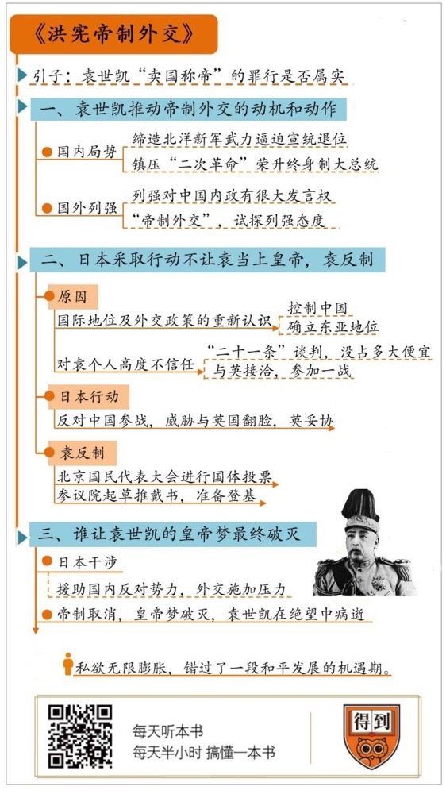

# 《洪宪帝制外交》| 大象公会解读

# 关于作者

本书的作者是著名近现代史学者、台湾东海大学历史系主任唐启华。唐教授研究历史特别推崇“实证史学”，也就是用实证的方法来研究历史，尤其擅长通过对各国档案的对照研究，来重新梳理民国历史上诸多重要事件的来龙去脉。代表作品有《被“废除不平等条约”遮蔽的北洋修约史（1912-1928）》《中华民国史外交志（初稿）》《北京政府与国际联盟，1919-1928》等。

## 关于本书

本书站在北洋政府的视角，紧扣“袁世凯称帝的外交活动”这个主题，重新爬梳档案，汇集了中、英、日国的外交档案，也参考了其他相关国家的史料，厘清了不少历史误解，补足了现有研究成果的欠缺。全书行文简洁流畅，大量档案、电报、新闻报道的全文摘引，给人以深沉厚重的历史沉浸感。受限于历史资料的短缺，作者的视野也不可避免地受到限制，本书呈现的也远非历史的全貌，但足以丰富我们对这段历史的认识。

## 核心内容

袁世凯复辟失败，除了要考虑内政的因素，外交的因素也不容忽视，而外交失败的关键在于得罪了日本。袁世凯低估了当时日本各界对他的敌意，错误理解了日本政府的运作模式，在变更政体进程遭到日本干涉时，又耍弄手腕，企图通过参加第一次世界大战来换取欧洲列强的支持，迫使日本让步。袁世凯高估了中国在欧美列强中的分量，参战企图在日本的反击下归于失败，袁世凯最终在日本接连不断地打击下退位、病逝。

## 前言

你好，欢迎每天听本书。本期为你解读的这本书叫作《洪宪帝制外交》。洪宪是袁世凯称帝时的年号，虽然称帝，但是袁世凯也只当了83天皇帝。我们一般认为他复辟失败的原因，是在政治上开历史倒车失了民心，但这本书告诉我们，其实外交上的失败也不容忽视，而外交失败的关键，是因为他得罪了日本。

在中国近代历史上，袁世凯是个不折不扣的反面人物。他在戊戌变法时背叛光绪皇帝，导致变法大业功亏一篑；他用种种卑劣手段窃取辛亥革命的胜利果实，是革命失败的元凶首恶。不过，这些都还不是最严重的指控，袁世凯的首要罪行要数“卖国称帝”，教科书上说他为了能当上皇帝，不惜大肆出卖中国国权，与日本签下灭亡中国的“二十一条”，终于招来历史的审判，在全国人民反对的怒火中绝望病死。但是，熟悉当时中日“二十一条”谈判内情的人，他们的说法就不太一样。当时任中国驻日公使的陆宗舆就认为，袁世凯从没有为了做皇帝在外交上稍微迁就日本，至于卖国，就更不可能了。

事实到底是什么样呢？一百年后的今天，随着政治敏感性的消退，尘封已久的中方外交档案也在前些年开放，史学界掀起了一股重新评价袁世凯历史功过的风潮。比如美国史学家费正清在《剑桥中华民国史》中说，虽然袁世凯有个人野心，“但他还不是极端利己主义者”。《洪宪帝制外交》这本书，就是一本从外交角度深入理解袁世凯和复辟疑案的力作。

这本书在2017年8月出版，作者唐启华是台湾东海大学历史系系主任，也是当今著名的历史学者。唐教授研究历史特别推崇“实证史学”，也就是用实证的方法来研究历史，尤其擅长通过对各国档案的对照研究，来重新梳理民国历史上诸多重要事件的来龙去脉。他在这本书里研究北洋外交史，就是站在北洋政府的视角，紧扣“袁世凯称帝的外交活动”这个主题，汇集了中、英、日国的外交档案，也参考了其他相关国家的史料，厘清了不少历史误解，补足了现有研究成果的欠缺。袁世凯为了当皇帝，到底有没有出卖国家利益？如果没有，那么他只当了两个月皇帝的原因何在？这些问题，本书都将一一给出答案。

下面我们就从三个问题出发，讲讲这本书的主要内容。第一，袁世凯推动帝制外交的主要动机是什么？为了顺利当上皇帝，他在外交上都做了哪些工作？第二，日本为什么不愿意让袁世凯当上皇帝？日本为此采取了哪些行动，袁世凯如何反制？第三，到底是谁让袁世凯的皇帝梦最终破灭？

## 第一部分

我们进入第一个问题：袁世凯为了顺利当上皇帝，他在外交上都做了哪些工作？

袁世凯1859年出生，是河南项城人。他是清代末年和民国初年政界、军界的风云人物，一手缔造了清末陆军的主力北洋新军。辛亥革命爆发后，他领导的北洋军成为清王朝赖以续命的最后希望，却又在关键时刻反戈一击，以武力逼迫宣统皇帝退位，结束了中国延续两千多年的专制帝制。

袁世凯虽然是皇帝制度的埋葬者，但又总跟皇帝宝座有一些说不清道不明的缘分。早在辛亥元年的时候，已经有不少人通过各种渠道给他提建议，这些建议措辞或明或暗，意思都差不多，就是希望袁大总统再高升一步，干脆当皇帝算了。袁世凯当时一一谢绝了这些美意，努力摆出一副要做中国华盛顿的架势。然而，仅仅过了三年，他为什么又重新惦记上了皇帝宝座？

我们当然没办法探究袁世凯内心真实的想法，不过在这本书里，唐教授讲了一个与此相关的细节。当时的英国驻华公使名叫朱尔典，跟袁世凯是很好的朋友，私下里无话不谈。据他回忆，袁世凯曾经在私底下流露出对共和制度的真实态度。他说，中国的共和制度从始至终都是个笑柄，十个中国人里有九个不把它当回事儿。可见，袁世凯其实并不太相信中国当时能推行共和制。

1913年，袁世凯轻松镇压了孙中山领导的“二次革命”，1914年又荣升终身制大总统，一连串的胜利让他膨胀，或许让他觉得，至少在国内已经没有人能阻止他称帝了。于是，在1915年的夏天，袁世凯指使手下亲信成立了所谓的“筹安会”，到处鼓吹帝制比共和制更适合中国的论调，试探民间的反应，算是迈出了复辟帝制实质性的第一步。

袁世凯相信，大部分中国人其实并不喜欢共和制，而是欢迎皇帝回来的，所以他对稳定国内局势信心十足，让他担心的只剩下列强的态度。改变国家政治体制，今天看来是一国的内政，但在清末民初那个年代，列强对中国的内政有很大的发言权。如果袁世凯不事先征求他们的意见，一旦有列强乘机支持国内反对势力，以维护共和的名义公然闹事，局面就会难以收场了。所以，袁世凯才不得不积极开展了所谓的“帝制外交”，小心试探列强尤其是英、日、美三国对帝制的态度，广泛收集各国舆论情报。

当时被袁世凯派往各国活动的外交官很多，这里举一个名人的例子。后来在巴黎和会上，以积极捍卫国权而扬名后世的外交家顾维钧，就曾被袁世凯委派到墨西哥和美国担任公使。作为袁世凯的亲信，顾维钧身负重任：一是要为袁世凯称帝在美国制造舆论，争取美方的支持；二来，当时墨西哥正爆发革命，流血冲突不断，顾维钧还要负责收集共和政体的负面材料，供国内宣传使用。虽然后来顾维钧在自己的回忆录中努力与袁世凯撇清关系，说他“竭力避免与帝制运动有任何瓜葛”，但民国《外交档案》中记录了很多由他牵头或积极参与的帝制活动，赖是赖不掉的。

当时正是1915年，欧洲列强正在第一次世界大战的战场上打得你死我活，德、英、法、俄等列强都深陷其中，分身乏术，想管中国事务也是有心无力。并且，为了把中国拉到自己的阵营，列强们还纷纷向袁世凯示好，比如德国就表示愿意率先承认袁世凯称帝。外交形势看起来对袁世凯似乎相当有利。

袁世凯首先要争取的国家是英国。英国在中国长期拥有最广泛的政治、商业利益，英国的驻华公使担任着列强驻华外交团的团长，如此重要的国家，袁世凯当然不能不重视它的态度，特别派了自己的心腹去和英国驻华公使接洽。一开始，英国是不赞成袁世凯称帝的，认为贸然改变政体和宪法可能会引发国内动乱，而英国这时候正忙于一战，自顾不暇，出了事也没有能力搭救袁世凯。英国建议，袁世凯如果一定要称帝，不妨延到战后，既然天命所归，也不急于一时。但受战争形势所迫，英国很快转变了态度。原本各方期望速战速决的第一次世界大战，逐渐发展成旷日持久的堑壕战，英国不得不满世界寻求援助，为了防止中国倒向德国主导的同盟国阵营，英国派驻华公使朱尔典在1915年10月给袁世凯带话，只要他能保证国内安定团结的稳定局面，可以接受袁世凯称帝。

当时的美国还不是世界警察，在对华外交政策的立场一贯超脱，所以袁世凯剩下要考虑的最重要的列强，就是东亚的日本。令袁世凯兴奋的是，日本政府对中国变更国体也表达了默许的态度。日本首相大隈重信在当年9月的例行演说时表示：中国人政治思想幼稚，对究竟应该实行君主制还是共和制其实无所谓，但求生活安定而已；至于袁世凯是否称帝，纯属中国内政，只要不至引发骚乱，伤及日本在华利益，日本不会干涉。日本首相的这番谈话，被袁世凯看作是日本政府支持他称帝的最终表态，让他备受鼓舞。内外形势一片大好，称帝进程当然要加快推进，当年10月6日，所谓的中华民国参议院正式启动了变更国体的法律程序，新的王朝似乎建立在望了。

但是，并不是每个人都像袁世凯这么乐观，当时的中国驻日本公使陆宗舆，一再拍电报警告袁世凯。他认为，首相虽然已经表态，但也不能认为就是日本官方的最终态度，日本国内各界对袁世凯称帝的意见其实很不统一。他劝告袁世凯，应该再观察一段时间，谨慎行事没有坏处，但袁世凯已经听不进去。结果，不出陆宗舆所料，时隔不久日本政府果然变卦，很快坏了大事。

## 第二部分

前面我们说了，袁世凯为了推动帝制外交做的行动，接下来我们看看第二个问题：日本为什么变卦了？他们为什么不愿意让袁世凯当上皇帝？

日本首相大隈重信在发表对袁世凯称帝不干涉的言论不久，就遭到了日本军部、大陆浪人等政治势力的强烈反对，他们迅速做了力量动员，推动政府反对袁世凯称帝。不过，那时候袁世凯还蒙在鼓里。这些人之所以反对袁世凯称帝，原因有两点：第一是基于与对当时日本国际地位和相应外交政策的重新认识；第二，他们对袁世凯这个人高度不信任。下面分别说一说这背后的缘由。

前面已经说过，一战爆发后，英法德俄等老牌欧洲列强都自顾不暇，无力介入东亚的事务，这让不少日本鹰派政客异常兴奋，认为没有了列强的干涉，日本就是远东之王，在东亚确立领导地位的好机会降临了，日本大国崛起的动人故事也可以翻开崭新篇章了。这时候如果不果断采取行动控制住中国，等到一战打完了，欧洲列强缓过神来，一切也就晚了，而想要控制中国，就必须要打倒袁世凯。他们指出，从清末到现在，袁世凯在诸多重大历史事件中就不断与日本为敌，可以说屡教不改，堪称是穷凶极恶的敌人。 

日本政客特别不能原谅的，是袁世凯对“二十一条”的强硬抵制。我们前面说了，历史书告诉我们，袁世凯以接受“二十一条”为筹码，换取日本对他称帝的支持，不过，唐启华教授在对各国档案做了细致对照研究后却发现，在现存的中、日、英、美等国相关档案中，不但找不到支持袁世凯卖国的证据，反而有大量证据表明，在“二十一条”谈判中，袁世凯使尽手腕把条约对中国权益的损害降到了最低。

双方谈判期间，袁世凯指示中方人员据理力争不说，还施展种种非常规手段。例如，曾无视日本方面要求会议内容保密的警告，通过各种渠道把“二十一条”谈判进程泄露给国内和欧美媒体，引起欧美列强对日本的集体警惕的同时，也引爆了中国民间的反日浪潮。历史上首次大规模的抵制日货事件就出现在这个时候，给日本商人造成了很大的损失。虽然在日本武力威胁之下，中国最后还是跟日本签订了《中日民四条约》，但相比原版的“二十一条”，危害性已经小了很多，损害中国主权最严重的一些条款被删除。这样的结果，当然不能让以谋求东亚领导者地位的日本鹰派政客满意，在他们看来，袁世凯这样的人一旦当了皇帝，日本最终吞并中国的大业将会面临更多困难。

通过短暂的政治博弈，鹰派政客的意见最终在日本国内占了上风，于是，在1915年10月28日，日本驻华公使联合英、俄两国，正式警告中国政府说：世界大战当前，中国政府不宜在这个世界危急时刻改变国体，应该暂缓。中国要维持共和制度还是请回皇帝是中国人自己的事，所谓劝告，显然是对中国内政赤裸裸的干涉。日本的这一招，让正在推进称帝事务的袁世凯一时间骑虎难下。对袁世凯来说，这时候放弃称帝，不光扫了脸面，政治上的危害也很严重，他长久以来精心塑造的政治强人形象可能会坍塌。政治威信一旦动摇，别说皇帝当不上，总统的宝座也很可能保不住。

出于这种考虑，面对三国联合警告，袁世凯态度强硬，表示称帝纯属内政，不容日本干涉。为了抵制日本的压力，袁世凯使出一招叫“以夷制夷”。他准确判断出，英国政府当时最期望的是，尽可能地拉拢一切力量打击以德国为首的同盟国，于是决定投其所好，派出亲信秘密与英国公使接洽，表示愿意加入协约国阵营参战。袁世凯的如意算盘是，参加一战一能提高中国的国际地位，二能赢得列强对帝制的支持，三能迫使日本在帝制问题上妥协，可谓一举多得。面对袁世凯的参战提议，英国政府果然满心欢喜，认为中国参加一战好处多多，不但可以压制日本独霸东亚，还可直接助力协约国打赢第一次世界大战。当时的英国外交档案对此兴奋得写道：“无论30万人还是300万人对中国都不是大问题，可保证把德国人从世界的每一个角落扫除净尽。”

中英秘密接洽的消息很快被日本察觉，实际上，机智的日本政府对中国参加一战背后的企图早已了如指掌，当然坚决反对中国参战，并威胁要与英国翻脸。在这个关键时刻，英国掉链子了。1915年底，协约国在战场上形势不利，英军在加里波利战役中死伤惨重。对英国而言，袁世凯参战当然是重大利好，但是中国和日本如果只能二者选其一，还是日本更重要。为继续获得日本的军事援助，英国选择了跟日本妥协，不但没有把中国拉进一战，还遭到日本外交官的一通教训，很没有颜面。袁世凯显然高估了中国对列强的重要性，不但没能争取到英国的支持，还把自己陷入更危险的境地。在这之后，日本朝野各界对袁世凯的敌意更深，认定这个人阴险狡诈，反复玩弄远交近攻的策术，毫不顾及日本的大国脸面，不坚决打倒不足以平民愤。

袁世凯不是个轻言放弃的人，即便外交形势大坏依然态度强硬，称帝活动也仍在有序推进。1915年12月10日，北京国民代表大会进行国体投票，一致赞成改共和制国体为君主立宪。第二天，参议院起草了推戴书并呈递袁世凯，袁世凯效仿上古贤君，装模作样再三推辞之后，接受了推戴，并准备于2月初登基。皇帝宝座似乎近在咫尺，然而几周之后，袁世凯信誓旦旦向列强保证的国内稳定局面终于被打破：在遥远的云南，炸响了一声惊雷。

## 第三部分

在第二部分，我们分析了日本不愿意让袁世凯当皇帝的政治考量、日本为此采取的行动以及袁世凯的反制，那么接下来，我们来看看第三个方面，袁世凯皇帝梦最终破灭到底是怎么回事？

推翻袁世凯称帝的是护国战争，主导人是蔡锷等人，这群人是在1915年12月下旬秘密潜回云南。关键问题是，是谁在暗中支持这些人呢？作者查阅了英国当时的档案，档案显示：这个月的24日，英国政府接到情报称，日本正支持华南一个反袁活动。第二天，果然有大事发生，云南将军唐继尧通电全国，宣布云南独立，反对袁世凯称帝，历史上赫赫有名的护国战争爆发了。很明显，支持蔡锷他们的就是日本人。

护国军最初只有云南一个省兵力，远不是强大的北洋军的对手，起义一个月内也没有其他响应者，影响力有限。但云南地处偏僻，交通不方便，政府军也无法快速镇压，双方陷入僵持。时间拖久了，对袁世凯一方是相当不利的，答应列强的稳定局面说没有就没有，答应国人2月份就要称帝登基也得推迟，列强失望，支持者们的人心渐渐散了。眼见局势严重，袁世凯只能孤注一掷，寄希望于快速取得军事胜利。1916年2月下旬，北洋军主力开赴四川南部发起猛烈攻势，收复多处战略要地，蔡锷领导的护国军抵挡不住，陷入崩溃的边缘，连留守护国军大后方的云南将军唐继尧，都受到了很大的惊吓，秘密准备流亡。

在历史的关键时刻，日本再次对护国军出手相救，一面继续出钱支持南方各地叛乱，一面提醒袁世凯政府，绝不能无视国内动乱而强行登基，否则日本政府决不予承认。3月7日，日本内阁放出一记重磅炸弹——公开发表对中国时局政策的政府文件，里面明白无误地指出，袁世凯是建立所谓中日亲善的障碍，必须让袁世凯永远退出中国政坛。消息一出，中国各派反对袁世凯的势力信心百倍。当年3月份，梁启超等人也在日本人秘密掩护下，经越南进入广西，策动了广西独立。云南护国军不再孤立，得到了日本从广西接济的大量武器弹药，死里逃生。

受此打击，3月22日，袁世凯宣布取消帝制，皇帝梦彻底破灭。此时的袁世凯，仍然幻想能够保住总统的位置，但反袁势力显然不会给他这个机会，坚持要求袁世凯必须彻底退出政坛。4月6日，广东独立；12日，浙江独立；到了5月中旬，在日本的支持下，连北方的山东都已局势不稳。濒临绝境之下，袁世凯才终于决定对日妥协，准备与日本“交换利益”，指示驻日本公使陆宗舆于5月11日拜会石井外相，请求日本扶助袁世凯。可惜为时已晚，日本政府认识到袁世凯已经丧尽权威，没有多少剩余政治价值，断然拒绝了袁世凯的和谈要求，并且不忘语带讥讽地表示：听说袁大总统打算流亡英美安享晚年，亚洲人居住英美不会愉快，不如来同文同种的日本算了。一生与日本为敌的袁世凯，在受到日本这番羞辱时不知作何感想。1916年6月6日，在绝望中，袁世凯因病去世。

## 总结

说到这儿，《洪宪帝制外交》这本书就解读完了，最后我们来回顾一下。

这本书告诉我们，袁世凯复辟失败，我们除了要考虑内政的因素，外交的因素也不容忽视。从真实的历史资料来看，当时的袁世凯对稳定国内局势信心十足，他真正担心的是列强的态度。所以，袁世凯派出亲信，积极开展所谓帝制外交，小心试探列强尤其是英、日、美三国对帝制的态度。他是在得到了列强的默许之后才最终下定决心，加快了推进称帝的进程。

然而，在日本问题上，袁世凯的判断失误了。他忘了自己曾经多次跟日本对抗，在不久之前的中日“二十一条”谈判中，也没让日本占到太多的便宜。像他这样的政治强人统治中国，并不是日本人愿意看到的，所以日本政府内部在一番博弈后，最终决定干涉袁世凯称帝。袁世凯想通过参加第一次大战来换取欧洲其他列强的支持，但在日本的反击下也失败了。

作者还指出，袁世凯彻底失败的直接原因，实际上也是来自日本的打击。袁世凯一系列自以为高明的外交，彻底得罪了日本，让日本对他是必欲除之而后快。日本政府在中国援助了大量反对袁世凯的力量，破坏中国的稳定局面，同时在外交层面施加压力，导致原本倾向承认帝制的列强各国态度转为犹疑观望。在迫使袁世凯取消帝制后，日本乘胜追击，最终在政治和肉体上都逼死了袁世凯，大获全胜。

据传说，袁世凯在临死前曾给自己留下一副挽联，是这么说的：为日本去一大敌，看中国再造共和。自清末以来日本在东亚的头号敌人败亡了，中国却没有能够“再造共和”，很快坠入了军阀混战的深渊。

袁世凯称帝的行为本身当然是历史的倒退，是个人野心和私欲无限膨胀酿成的恶果，断送了自己的性命不说，还让中国错过了一段和平发展的机遇期，可谓是祸国害己。听完本书的解读，你或许想问，作者到底是不是想给袁世凯翻案呢？历史人物是复杂的，从来都不是非黑即白的脸谱，在这本书里，作者唐教授其实只是通过档案，呈现了历史中真实的事件和它们之间的关系，因为作者知道他只能有一分证据说一分话，这样结论才能牢靠、踏实。但受限于历史资料的短缺，作者的视野也不可避免地受到限制，所以《洪宪帝制外交》这本书呈现给我们的，当然远远不是历史的全貌。至于袁世凯的功过是非，或许还要等未来才能给出更为公允的评断。

那么，作者的态度如何呢？唐启华教授在一次访谈中曾经指出：“事实上护国军在国内的反对影响并不是太大，而且非常重要的是，所有国内的反袁势力背后都有日本支持，包括护国军起义、广西的独立、广东的独立等等。从外交上来看，没有日本反袁的话，袁世凯帝制很可能会成功。”当然，也有不少历史学者并不赞同唐教授的结论，他们认为实证史学有自身的局限，将重大历史进程简单用档案来复盘，如果只是就此得出结论，未免有轻率之嫌。不过，争论推动进步，我们可以期待未来肯定会有更多优秀的研究，从更多的维度去丰富我们对这段历史的认识。

撰稿：大象公会

脑图：摩西

转述：宝木