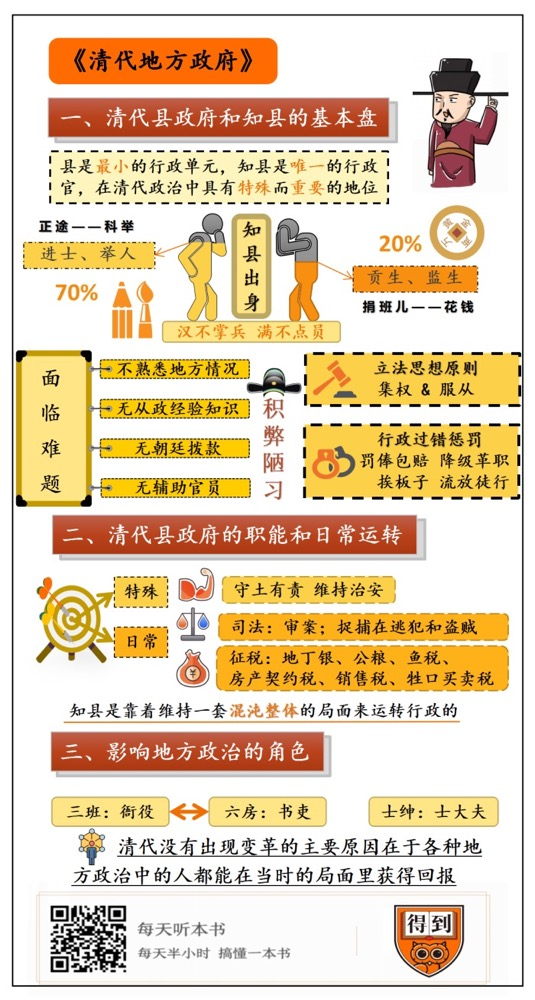

# 《清代地方政府》｜贾行家解读

## 关于作者

瞿同祖，中国当代历史学家、法学家、社会学家。从上世纪三十年代起，他先后在云南大学、西南联大任教；1945年，瞿同祖出国从事社会学研究，1965年辞去哥伦比亚大学教授一职返回祖国。在国内大学任教时，能同时开设中国经济史、中国社会史及中国法制史三门课，他对中国古代法律制度研究，在海内外颇有影响。

## 关于本书

这本《清代地方政府》，是作者六十年代在哈佛大学东亚中心做研究员时，用英文写成的。本书系统、深入地分析了清代州县官的职能及其运作，完成了关于中国古代最低层政府的第一部有意义和可靠的研究。其独树一帜的科学研究方法，一直深受学术界的赞誉。

## 核心内容

本书思想核心是：清代的县虽然是最小行政单元，但在政治序列里，知县却是唯一的行政官，在处理具体的事务。他们面临着很多难题：不熟悉地方情况、没有从政的经验知识，没有朝廷拨款，也没有辅助官员。清代的政治设计和官员的实际处境，是官场腐败风气的根源。

县衙门的主要职能是司法和税收。知县是靠着维持一套“混沌整体”的局面来运转行政的。他靠自己聘用的非正式人员师爷（幕友）来做决策。他通过税收解决个人收入和县衙的财源问题。县衙里的人员则彼此隔绝，职能重叠。县衙的底层人员包括本地的书吏、衙役等，他们实际影响着地方的政治，决定了风气的好坏。士绅阶层也在参与地方事务。这些群体都能从这种局面中获得相应回报。

## 前言

你好，欢迎你每天听本书，今天我为你解读的这本书叫《清代地方政府》。

书名就说得挺明白，它讲的是：清代的基层政府——也就是州县这一级——是怎么组成、怎么运作的？

要是你对历史感兴趣，那一定要听这本书。宫斗和战争，并不能展现过去的全貌。我们知道，中国王朝政治是“皇权不下县”的，也就是在县以下不设置行政单位。那咱们把这句话倒过来看，也就是说：老百姓能接触到的朝廷和王法，几乎都发生在小小的县衙里。这才是古代最普遍、最真实的政治生活。

就算你只是刷刷古装剧，也会遇到一些问题：比如：写八股文的秀才，怎么能治理得了偌大一个县？在电视剧里，清官于成龙当面对康熙说：“所有的巡抚、布政使，全是花钱买的”，下面的县令就更别提了。你别说，在清史里还真有这段情节。那么，政治手腕高明、长期执政的康熙，怎么连这个问题都解决不了呢？这本书也能给你说明白。

因为它不是普通的历史书。国内高校的法学专业、社会学专业，都把这本书列为研究生精读书目。本书的作者瞿同祖是历史学家，更是法学家、社会学家。从上世纪三十年代起，他先后在云南大学、西南联大任教；这本《清代地方政府》，是他六十年代在哈佛大学东亚中心做研究员时，用英文写成的。

瞿同祖的治学风格，一直很受学术界推崇：他不用现成的政治学、法学观念去硬套历史，因为那样的研究，往往得到的只是一种评价，而不是历史原貌。他的方法，是用大量官方和非官方材料，活生生地再现清代地方政府的真实状态，而且还原到个人的具体活动。也让我们看到：背后的那些政治传统，到底是怎样形成的？当然，他也有特殊的条件，他的祖父是光绪年间的军机大臣。我们说这本书是法学、史学经典，有很过硬的表现：今天研究清代政治，这本书是最可靠的工具之一；当书里的结论和新材料碰撞时，依旧有很强的解释力。

那这些结论都是什么呢？我分三部分给你介绍。第一部分是：清代县政府和知县的基本盘是什么？

第二部分是：清代县政府是主要在干些什么，是怎么运转的？我们知道的那些官场陋习，究竟为什么积重难返？

第三部分，我们再来说说清代地方政治里的几类重要角色，看清楚人的实际活动，就能看清真实的政治生活和表面的法律之间的差异。

### 第一部分

我们先来看看清代的地方行政结构和官职结构。

清末时期，中国的版图上有23个省。号称封疆大吏的总督是正二品官，一般统辖两三省的军政；总督之下，本省主官是巡抚，从二品。直隶、甘肃和四川三省地位重要，巡抚由总督兼任。河南、山东、山西三省则不设总督，巡抚就是最高军政长官。副省级文官是主管民政、财政和文官考核的布政使，主管全省司法和邮政驿站的提刑按察使、主管朝廷食盐专卖的盐运使和管科举教育的省学政。

省级之下是府和直隶州、直隶厅，大致可以理解成今天的市地级。府的主官是从四品的知府；直隶州、直隶厅是省里直辖的，主官是正五品。

再向下就是州县了。县级的州叫散州，零散的散，有一点儿像县级市的意思。散州和重要的县，主官可以“高配”到六品。康熙时期，全国有177个府，1261个县和267个散州，加起来是1528个县级单位；光绪时期是有302个府级单位，1523个县级单位。随着疆域拓展、土地开发和城市化水平提高，府县两级行政区不断增多，有的县级单位也开始升格。今天，中国有2800多个县级行政区。

县是最小的行政单元，省里的各类官员，差不多都管得着知县。除了巡抚、知州、同知等这样“主干线”上的顶头上司，还有分巡道、分守道、盐茶道这样各部门、各战线上的官儿。由中央直管的河道和漕运官员，当然也可以向他们问责，这才真叫“上头千条线，下面一根针”。所以，知县在民间被戏称为“七品芝麻官”，在各路上司面前，也都自称小小的“微末前程”。

可是瞿同祖告诉我们：千万别小看这一千五百多个知县。他们在清代政治中的地位，既特殊，又重要。用今天的政治考察方法来看：在整个清代官场，只有他们才是真正意义上的行政官。因为，只有他们负责实际事务，在和老百姓直接打交道。他们的那些上司，从总督到知府，都叫监督官，也就是只向下发号施令，向上请示汇报，处理的都是书面工作。

其实，清代人对此也有感觉。很多官员私下说：总督巡抚也不过耍嘴皮子，地方政治的好坏，全在知县手上，只有县令才是真正的“亲民之官”、“父母官”。还有种说法是，大清国只有两种文官重要：一个是参赞最高决策的内阁大学士，一个是最基层的知县。

我们知道，知县主要有两种“出身”，也就是任职途径。一种叫“正途”，就是通过科举考上来的；另一种俗称“捐班儿”，也就是先花钱捐一个贡生或者监生的头衔，再想办法运动个知县当。那么，这两种出身的比例各占多少呢？瞿同祖统计对比了清中期和清末的两组数据，看起来情况很接近：正途出身的，以进士、举人为主，占70%左右；“捐班儿”接近20%，这很可能说明朝廷对此是有控制的。其中绝大多数是汉人，占93%，满洲旗人知县只占3%——我对这个数据的理解是，清朝有句俗话叫“汉不掌兵,满不点员”，意思是旗人掌管兵权，使用汉族文人打理行政。而且你听下去会发现，知县也实在不是那么容易当的。

比如，不管是什么出身，这些知县都面临着同样的问题，我们开头就说到了：他们中的大多数人，根本没有能适用于这个直接管理老百姓职位的知识和经验。他们之前是读书人，熟悉四书五经，但没有行政和司法经验。在清代官场，从有经验的八九品僚属里提拔知县的情况很少。而且，清代还有个规定：所有地方官都不得在本省任职，在邻省当官，也要距离家乡500里。本族亲属也不能同地任职。设计这个回避制度的目的很明显，也有道理。但它肯定也加剧了这个问题：一个外来的官员，业务上本来就“两眼一抹黑”，再不熟悉当地情况，甚至连话都听不懂。那这个官还怎么当呢？

别忙，这个官儿到底多难当，我还没说完呢。做一件事的困难主要在“钱从哪里来，人从哪里来”。这两条，知县也都占。

先说钱从哪里来的难处。知县手里几乎没有任何财政拨付的公款。清朝是直到雍正年间，才给知县们发工资的，这称为养廉银，保养廉洁的意思。少的一年五六百两，多也就2000两。而知县的开支，是不分公用私用，全部自己负担。除了他本人养家，还要支付办公经费、接待上级官员的招待费这些公务开销；按清代的官场规矩，知县要定期向各级上司缴纳财物，有的是直接就在你的养廉银里扣了。另外，他们日常还要被上级衙门的跟班随从勒索。一年的花费，加起来得多少呢？面积和人口不同的县，数字当然不一样。但按清代一个御史的大致估计，少的五千两，多则上万两。

这还不一定包括雇佣幕友的费用，幕友是幕后的幕、朋友的友，就是俗称的师爷。一个好师爷，年薪就得上千两，比知县的养廉银都多。这是清代政治里的重要角色。你可能要问了：先等等吧!怎么县政府里雇人，也要知县自掏腰包？

这就要说到关于“人从哪里来”的难处了。瞿同祖给清代县政府下了一个定义，叫做“一人政府”。也就是说，分配到一个地方的权力和责任不进行分割，完全被知县独占。

大权独揽，作威作福，听着挺好的，但这也意味着要承担所有的责任，得不到其他官员的辅助。县衙里当然也有僚属官员，像县丞、主簿、负责教育的学正。但他们和现代政府中的副职、各部门负责人完全不是一个概念，他们既没有权，也没有责，平常无事可干，被称为“闲曹”，有很多县根本就不设置这些职位。而按清代的政治规则：一个县出现的所有问题，不管是税收不上来、管库出了亏空；还是盗匪没抓住、被查出冤假错案；乃至县学考试舞弊、驿站的马死了，全都要知县来负责。

瞿同祖还列举了管理知县的法律和对失职的惩处办法。这些办法制订得非常详细周密，立法思想原则是集权和服从，格外要求知县们的履职行为都一致。虽然在辖区内，他们独揽权力，但在官场序列里，他们处于上级的层层监控之下，不能做重大决策，事事都要汇报。对他们行政过错的惩罚，从罚俸包赔（也就是罚款）、降级革职，到挨板子、流放徒刑。

知县的这种处境，是清代官场许多积弊陋习的起因，我们来分析一下。清朝是个大帝国，南北差异巨大。行政法典制订得统一严苛，结果就是操作困难，效率低下，没法变通和调整。对官员的那些惩罚，又是把行政处罚和刑事处罚混在了一起，更让他们感到压力巨大。

那么，最能免除自己责任的选择就是：谨小慎微，不管实际情况如何，对上都绝对服从；清代的官员们，几乎把所有的精力都花在了循规蹈矩上。高层也一样。从乾隆到道光的三朝老臣，当了52年官的大学士曹振镛有句名言,当官就得“多磕头,少说话”。清末的大臣王文韶，自打进了军机处，就很巧妙地增添了耳聋的毛病。两个大臣在御前争执不下，慈禧问他的主意，他只傻笑不回答，慈禧也没办法，只能说：“你可真是个琉璃蛋！”在清代官场里，做官做到这种地步，未必被耻笑，反而显得老道。

你可能要说了：清朝的县官要真是这么难当，怎么还有那么多人挖空心思去做呢？这是因为：当法律太过严密，反而会没法实施，最后只流于形式。在实际的官场，通行着一套人人心知肚明的“下有对策”。也就是当时所说的陋规。虽然丑陋，但已经是规矩了。知县们只要小心地伺候好上司，就可以通过这套陋规应付差事，同时让自己牟利。

## 第二部分

这个问题，我们可以在第二部分的内容里，从县衙的日常运转当中得到答案。

作为县里的行政首脑，知县对本地的保甲、邮政、盐政、工程、教育、福利、宗教和祭祀等等都要管。但他核心任务是三条，一个是守土有责，维持治安，虽然是文官，但发生叛乱、外寇入侵的时候，知县必须守卫城池，这属于特殊情况。日常的主要两条，是收税和司法。明代小说《儒林外史》里说衙门里只有称银子的“戥子声”、收税的“算盘声”和打人的“板子声”，既是尖锐讥讽，也是客观概述。到了清代，也一样。

我们先来说司法是怎样运转的？从中你就能看出知县怎么解决没有知识、用不上其他官员的问题。清代民间的各类案件，都要先报到县衙。戏里那种“越衙上告”，上告者是要先挨五十大板的。知县作为基层法官，从权限上说，只能判决一般民事纠纷和处以打板子、枷号（也就是戴上木枷示众）的轻微刑事案件。这些案卷和笔录还要定期接受分巡道的检查。需判处徒刑以上的案件，要申报到府一级，死刑判决要由总督、巡抚重审。这个制度看上去相当合理，但我们别忘了，现场勘察验尸、口供等重要证据收集，以及早期的案卷，都是在县里完成的，这些环节可都是直接影响案件结果的。

县官为什么要花那么多的钱雇佣师爷？因为他本人不懂业务、不通法律也没关系，只要能请到好的师爷就行，自己只去负责场面上的工作。师爷是行政专家，大致分两类，参谋司法的叫“刑名”，俗称“黑笔师爷”；帮助办理钱粮税收的叫“钱谷”，俗称“红笔师爷”。他们是没有官职的非正式人员，却是知县在事务上的主要依靠。少数经验丰富、精明能干的知县，可以自己当堂对案件写出批词；大多数知县都是退堂后请师爷代办；有时候还要按师爷的交代，回去补充审理。所以李鸿章有句耐人寻味的话：“天下最好做的事，就是当官。”

好师爷的本事也真大，我看过一则古代笔记记载：有个沿海的县，从海上来了一条商船，船舱里的货物被海边居民抢光了。县里要给上面打说明报告，师爷拿过文稿来，只改了一个字，是把“海上漂来船”改成了“海上覆来船”，意思是船到岸时是底儿朝上的，那自然也就没有货物。改一个字，就抹掉了抢劫案。但师爷只能呆在幕后，不能参加庭审，这也会影响案件的办理质量。

除了审案，知县另一项重大的司法职责是捕捉在逃犯和盗贼。法律规定，案发后，县里要在四个月内逮捕强盗，超期一年降级，超期两年调离。所以，这是知县很重视的工作。于是，知县给衙役下达更短的限期，超期就要挨板子，再超期，就把衙役的家属关进牢房。也就是说，在行政工作里，使用威胁属下情感和恐惧手段。或者是走上层路线，有的县官会托请总督、巡抚，在限期到来前把自己调到其他县去。

从司法方面的情况能看出来：县官解决行政问题的方式，是非正式的、私人化的。瞿同祖将这称为“混沌整体”。它在行政运行中的表现是：县衙里没有中层权力，每个人都直接向知县负责；人员彼此之间也没有实质性分工，只有和知县的亲疏远近不同。于是，清代的县衙人员彼此隔绝、职能重叠，效率也很低下，经常出现“要么都来管，要么都不管”的状况。

接下来，我们再来说，知县是怎么行使征税职能的？在这个过程里，他也解决了自己“钱从哪里来”的问题。知县负责征收的项目有地丁银（也就是土地税、人头税），这是宫廷和军队的基本财源；还有漕粮，也就是公粮；还有渔税、房产契税、销售税、牲口买卖税等等。

县里没有法定财政收入，更谈不上经费预算决算了。那怎么办呢，就得“搭车收费”。有一种和地丁银一起征收的叫“火耗”的钱，字面意思是铸银子的损耗。这是县官自己留的办公费和私人花销。在很长一段时间里，火耗是明文法规之外的陋规，后来因为禁止不了，只好默认。火耗的比例不一定，每两地丁银收两钱，也就是八分之一的，那就算清官了；高的会到四钱五钱，将近30%。这个钱也不是县官能独吞的，它包含着办公经费，而且要按比例在县衙里分配。乾隆年间，国家承认了火耗的合法化，这笔钱不进入户部，由各省布政司掌管，可以说是演变成了地方税。

县官还可以在漕粮里增加附加费。知县和税吏有一种默契，只要他能征收上来国家要的漕粮税额和归知县所有的附加费，剩下的都不问。于是，国家法定1担粮食的税负，到纳粮农户那里就变成了2.5担。后来，有的知县嫌麻烦，可能粮食也不好保存，就要求纳粮改成交现钱，这种折算，又增加了一层盘剥。

所以，知县征税既是在完成硬性任务——朝廷对欠税地区官员的惩处相当严厉，是从总督一路罚到知县的；同时，他们也有自己的积极性。衙门里的板子声，可不是光打犯人，很多时候是在打欠税的老百姓和征不到税的里长，很多里长为此倾家荡产。不过，人也是复杂的。有的知县比较宽厚，会掏自己的钱替欠税人垫付。

从这里你也就看出来了，为什么康熙解决不了贪腐问题？因为那不是个简单的风气问题，既然朝廷没有能力安排完整、合理的地方财政制度，就只能容忍陋规的长期存在，任由县官们自己去安排自己了。

## 第三部分

正是因为的清代地方政治里存在着这么多的非正式、私人化因素，瞿同祖才坚持用具体的人的视角来做研究。这本书一共11章，其中的6章都在讲具体的人。在第三部分里，我来为你介绍这些影响地方政治的角色。

前面说了，在县衙门里，除了知县以外，其他的僚属官员不重要。重要的是书吏、衙役、长随、师爷这四类辅助人员。前面说了师爷，下面来说另外几类。你可能听过个词叫“三班六房”，这说的就是衙役和书吏。

三班就是衙役。在清代，衙役的社会地位相当于戏子、奴婢和妓女，自己和子孙都禁止参加科举，所以知县催办案件，才会连他们的家属一起抓。但你可能想不到，做这种低贱行业的人，并不都是走投无路。相反，他们中的很多人，是因为有了一定财产才来当衙役的，因为这样能熟悉官面和黑道，能免除沉重的徭役和赋税，可以保护家产。你想，衙役们既然已经身处低下，那也谈不上名誉问题了，他们会彼此学习，用肮脏的手段勒拿卡要、徇私枉法。于是，这决定了清代司法的现实风气。

六房指的是书吏，文书的书，官吏的吏。六房的设置，是对应国家吏、户、礼、兵、刑、工的六部。书吏处理的是书面文件，像草拟文件、填报报表、档案整理等等。县衙虽然是知县集权的“一人政府”，但书吏却很多，明清时代的材料显示：大县的书吏上千人，甚至有两三千的，小县起码也得两三百人。人数这么多，因为有很多只是来挂个名，这个身份在乡民面前算一种荣耀。

和外省来的知县不一样，书吏都是本地人，在本地的关系盘根错节。他们当然就会在税收、徭役和诉讼这类事上偏亲向友，也更能从中牟利。他们还常常串通起来蒙骗知县。虽然国家规定当书吏不能超过五年，但他们经常在届满后，改个名字留任。于是，县里的政治就形成了一种特殊局面：不断更换的、缺乏经验的新知县，在领导着一批在衙门里呆了几十年、老于世故的本地书吏。彼此间的关系很微妙。

在待遇方面，书吏的情况和知县很像，也是几乎没有合法薪酬，这也是为什么一个县的书吏那么多。而衙役倒是有薪水的。和前面同样的道理，知县要想让行政运转下去，也得默认书吏借公务之便牟取私利。当然了，这样不见光的钱是要层层向上孝敬的。有些知县不收的，因为收了就没法再控制书吏和衙役；但更多的是不只收、而且是一到任就主动要。这种自下而上形成的陋习，正如瞿同祖所说：真是一个“混沌的整体”。

最后，来说一类不在清代官方权力系统里，但又相当重要的社会角色，就是县里的士绅。中国传统社会的地方事务，是士绅和政府共同管理的。士绅就是住在家乡的士大夫。身份的取得来自于“士”，也就是要有功名；或者是卸任的官员。财富和土地并不是成为士绅的充分条件。在古代，商人和土财主无论财产多雄厚，也没有政治地位，商人唯一的抗议方式是罢市，没有资格申诉。直到19世纪后半叶、清代最后的几十年里，大商人才被允许和士绅一起商讨地方事务，但仍然要从属于士绅，合称为绅商。有个最明显的例子，就是《儒林外史》里的范进。乡试发榜前，他还是个屠夫都可以欺侮的穷秀才，一旦中举，立刻就成了“老爷”，进入了士绅阶层。取得这个身份之后，他也自然地获得了土地和财产。

清代的知县有句口诀，叫“宁可得罪朝廷，不可得罪士绅。”因为皇帝毕竟离得远，而士绅能给他们制造现实的麻烦。士绅拥有特权，也深受知县的礼遇，会主动向他们征询意见。毕竟，从身份上来说，他们也是一种人。

瞿同祖说，并不像有些学者认为的，士绅就能代表地方自治。这与士绅个人行为的好坏无关，而是因为他们未经选举和法律确认，而且有自己的集团利益，代表不了整体社会利益。

对士绅的利益和心态，社会学家费孝通在《皇权与绅权》里概括得很清晰他说：士绅们应科举、为皇帝当差，是没有积极目的的。他们只是在靠近自己想逃避的对象。也就是说，一个家族派个子侄出去当官，目的只是提升阶层，获得安全保障，享受免徭役等特权。从这一点上，道貌岸然的士绅，和他们看不起的下贱衙役没有区别。

在这本书里，瞿同祖详细分析了清代地方各个集团的处境，最后形成了一个结论：清代没有出现变革，主要原因在于：从官员、士绅到衙役、书吏，各种地方政治中的人，都能在当时的局面里获得回报。因此，尽管彼此间有冲突，他们却没有兴趣改变现状。于是，我们从这段历史里，看到了古代社会和政治秩序的稳定性和持续性。

## 总结

好，关于这本《清代地方政府》，就为你介绍到这儿。一起回顾一下。

第一部分我们说到：清代的县虽然是最小行政单元，但在政治序列里，知县却是唯一的行政官，在处理具体的事务。他们面临着很多难题：不熟悉地方情况、没有从政的经验知识，没有朝廷拨款，也没有辅助官员。清代的政治设计和官员的实际处境，是官场腐败风气的根源。

第二部分说到：县衙门的主要职能是司法和税收。知县是靠着维持一套“混沌整体”的局面来运转行政的。他靠自己聘用的非正式人员师爷来做决策。他通过税收解决个人收入和县衙的财源问题。县衙里的人员则彼此隔绝，职能重叠。

第三部分介绍了县衙的底层人员，那些本地的书吏、衙役，他们实际影响着地方的政治，决定了风气的好坏。士绅阶层也在参与地方事务。这些群体都能从这种局面中获得相应回报。

撰稿：贾行家

转述：成亚

脑图：刘艳导图工坊