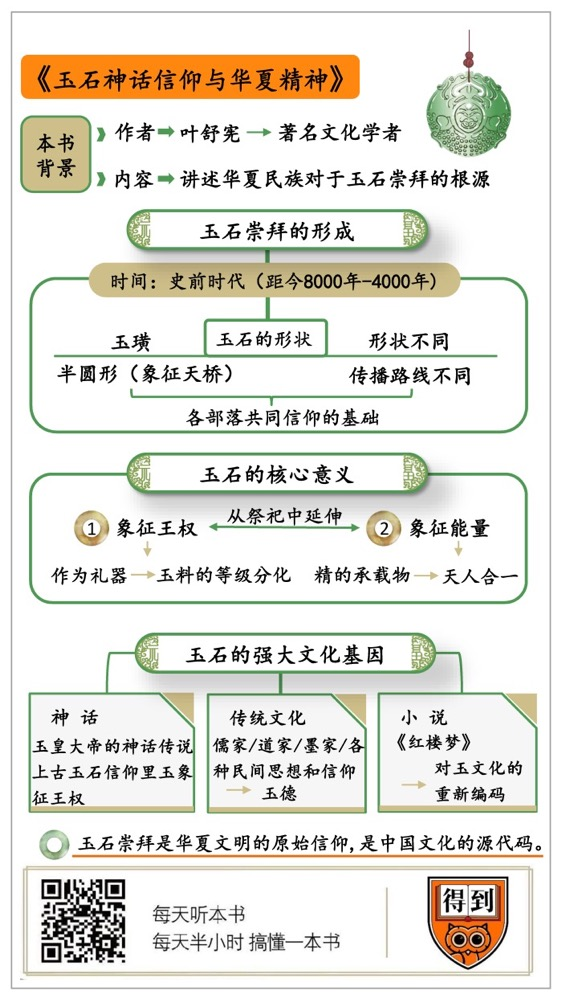

# 《玉石神话信仰与华夏精神》刘玄解读

## 关于作者

叶舒宪，著名文化学者。上海交通大学教授，首批人文社科资深教授；曾任中国社会科学院文学研究所教授；中国比较文学学会常务理事。

## 关于本书

玉石不仅是一种器物，它相当于华夏文明的原始宗教，决定了我们文明的特质。这些年来，作者叶舒宪老师不仅自己一直在研究玉石信仰，还呼吁学界都来关注这个重要的问题。这本今年出版的新书就是他在这个问题上最新的研究成果。

## 核心内容

当我们把神话和考古放到一起看的时候，“玉”的独特地位一下子就凸显出来了。因为，玉石崇拜是理解中华文明的一个关键的线索。它串起了整个华夏文明从萌芽到形成的历史，玉石成了一种强大的文化基因，一直影响着我们的语言和文字，也塑造了我们的文化和思维。

## 前言

你好，欢迎每天听本书。本期我要为你解读的书，名字叫《玉石神话信仰与华夏精神》。

听名字你就知道，这本书是讲玉的。对中国人来说，玉是一个特别常见的符号，我们很少去想，好多事怎么都跟玉有关系。

你想过没有，为什么道教的最高神要叫“玉”皇大帝呢？为什么儒家说君子人格要像“玉”一样？为什么《红楼梦》里的主要人物，名字里都有玉字？

这些问题挺有意思吧？

不过，都不太容易回答，没关系，有个人能帮忙，他就是这本书的作者，著名文化学者叶舒宪老师。叶老师他一直在研究中国神话，他发现如果把考古发掘和神话研究联系来，那好多关于玉的难题都迎刃而解了。

其实，玉石崇拜可以说是华夏文明的原始宗教，对我们华夏民族有着根深蒂固的影响。就说王字旁的字，也就是斜玉旁的字，那就多了去了，像玲珑、玛瑙、琳琅满目；再说跟玉有关的成语，像冰清玉洁，金枝玉叶，宁为玉碎、不为瓦全。你看，在中国人的眼里，玉就是完美无暇，是最好的东西。它已经成了一种强大的文化基因，影响着我们的语言和文字，也塑造着我们的文化和思维。

在解读这本书之前，我还专门采访了叶老师。接下来呢，我们就跟着叶老师一起坐上时光机，回到古代，看看玉石崇拜最初是怎么形成的，又怎么成为一种强大的文化基因，流传至今。

## 第一部分

好，我们先抵达第一站，史前时代，也就是距今8000年到4000年前这段时间，看看玉石崇拜是怎么形成的。

不知道你有没有这种感觉，到全国各地逛博物馆，看史前文化的展览，大多都有一些长得差不多的玉器。比如说，广东有石峡文化，陕西省有石峁文化，这两个地方都挖出了大量的玉器。但是，你有没有想过，这些地方距离很远啊，广东到陕西，相距快2000公里，气候条件、地理条件差异都很大，为什么那时候的人能这么有默契，不仅都造玉，而且连形状都有雷同呢？

请注意，这种默契可不是个别现象。叶老师说，差不多就是距今4000前，也就是中华文明形成之前，用玉做礼器的现象，好像突然就降临到了华夏大地（除了青藏高原和云贵高原），遍地开花。

你想想，这个现象出现至少得满足两个条件：在物质层面，各个史前部落都得有能力开采和加工玉料；在精神层面，它们都得崇拜玉石，有了这种信仰，他们才会愿意花这么大力气制作玉器。要知道，四五千年以前，切削打磨一块玉石，可能要花上好几年的时间。

这样，我们就能得出一个结论：在距今四五千年前的时候，华夏大地上的几十个史前部落文明都崇拜玉石。这种崇拜又带动了玉器的加工生产。

接下来的问题就是，为什么这些部落会形共同信仰呢？这是因为，玉石崇拜曾经以缓慢地速度在各个史前部落之间传播。

想要证明这个观点，你需要找到一个关键的线索。这个线索就是玉器的形状。

你可能会觉得，形状、颜色这些不过是玉器的物理特征而已，但是，叶舒宪老师说，在还没有文字的史前时代，一定是某一种跟信仰有关的联想，让人们决定把玉石做成某种特定的形状。

比如，玉璜是半圆形的，像一道彩虹，象征的是天桥。所谓“天桥”，就是天地之间的一条通路。史前的器物和上古的传说，都能证明玉璜和飞天有很明确的对应关系。在距今5000-6000年的内蒙古红山文化遗址，就有双龙兽玉璜，在半圆形的两端都雕着龙头。稍晚一点，在距今4300-5300年浙江的良渚文化遗址，也出土了玉璜。传说，夏朝的第一位国君夏启能够乘龙飞天，他的身上就佩戴着玉璜。这个基本的神话范式，在后来的《山海经》等等神话作品中也有回响。

玉礼器的形状可不仅是一个物理特征，它是比语言更早的表意符号，承载着华夏先民的信仰。所以说，某种形状玉礼器的传播到哪里，它承载的意义和信仰也就传播到哪里。

叶老师说，玉礼器的形状不同，传播路线和方向也不一样。他选择了四种典型的玉礼器，包括圆环形的玉璧、近似方形的玉璋、有点像齿轮的玉璇玑，还有玉人像。它们各自都有一条时间空间大体吻合的传播路线，有的是从南向北传播，有的是从东向西传播。就拿圆环形的玉璧来说吧。玉璧起源在今天的东北地区，大约是在距今9000年前的时候。之后的3000年里，它一路向南、向西传播，经过内蒙古、山西、杭州，最南到了广东，最西抵达了甘肃。

这四条路线横纵交错，几乎覆盖了整个华夏大地。这样，我们就可以得出一个结论：玉石信仰跟随这些特定形状的玉器，沿着这四条横纵交错的路线传播、交融，覆盖了华夏大地。它是现在中国版图内的、已知的、最早的、最普及的一种宗教现象。

你想想，像华夏文明、希腊文明这样的高级文明，跟史前的部落文化有什么区别呢？很重要的一点就是：史前人类走的是同样的道路，从旧石器时代到新石器时代；但是有了文明，不同地方的人类社会就有了差异，有了自己特质。这样看的话，史前华夏大地上普遍的玉石崇拜，可以说是后来夏商周三代中华文明形成的重要基础。有了相通的信仰，部落之间才有可能建立起文化的共识。文明建立的基础，不就是来自文化的共识吗？

## 第二部分

接下来，我们再坐上时光机去第二站，上古时期，也就是夏商周三代，华夏文明形成的时候，正是在这个时期，玉石获得了两个核心意义，成为一种强大的文化基因。这两个意义：一个是象征王权，另一个是象征能量，或者说生命力。

这两个意义都是从祭祀中延伸出来的。我在第一部分说了，玉石崇拜慢慢成为史前部落共同的信仰。《说文解字》解神灵的“灵”字，说灵就是巫，这些巫师最重要的特点，就是用玉石来侍奉神。这很好地说明了玉石在上古信仰中的位置——它是人和神沟通的媒介。玉可以代表神灵，代表神秘变化，代表不死的生命。大禹的儿子夏启为什么能戴玉升天？类似这样的神话，背后的意义就都可以得到解答了。

半透明的玉石能让人联想到天空，古人就会认为它们是上天赐下来的，所以玉有通达天意的神力。这种联想不是只在华夏文明才有，苏美尔文明就把天青石作为圣物放到神庙里，对他们来说，藏青色的天青石就是天空的象征。

从史前到上古，随着祭祀活动越来越成熟，玉石在祭祀中有了特定的功能。一方面，它能作为礼器，成为人和神沟通仪式中的信物；另一方面，它也能作为祭品，成为神人之间交换的能量的替代。

首先，从礼器这个功能，玉发展出了王权象征这个意义。

我想请你思考一个问题，项羽在鸿门宴上为什么不杀刘邦？你可能会说，因为项羽性格优柔寡断，刘邦又放低了姿态啊。这么说当然没错。不过，很多人都没有注意到一个细节。就是刘邦带给项羽的礼物是一对白玉璧，给范增的礼物是一对玉斗。玉斗被范增击碎了，但是白玉璧却被项羽欣然收下了，放在了座位上。从鸿门宴的故事情节来看，项羽接受了白玉璧，就是后来他没有杀刘邦的铺垫。

为什么项羽不像范增那样把礼物打碎呢？叶先生说，白玉璧向项羽传达了一个信息，刘邦愿意承认项羽是天子，因为《礼记》规定只有天子才能佩白玉。项羽当然知道化干戈为玉帛的道理，在得到信号之后，就没有道理再动杀机了。

你可能不信，一块玉石怎么可能有扭转乾坤的力量？

你不相信，是因为今天的人已经很难理解玉跟王权之间的象征关系，但是这在周朝到秦汉的古人眼里是不言自明的。你想想，玉和王这两个字，是不是长得挺像的？

叶舒宪说，玉和王权的象征关系在周朝形成。夏商周三代，华夏大地上有了统一的王朝，玉石信仰也发生了一次根本的变化。夏朝不可考，我们暂且不提，直接说商朝。殷人好鬼，祭祀、巫术是殷商的统治方式，玉石信仰也和玉礼器一起延续到殷商的信仰体系里。你可能会说，商朝不是已经进入青铜时代了吗？那些青铜的鼎啊、锅（釜）啊，才是祭祀的礼器吧。实际上，在青铜时代，玉石崇拜并没有消失，青铜礼器和玉礼器都同时存在。河南安阳的殷墟，除了青铜器，还出土了上千件玉器。传说，武王伐纣，牧野之战中，商纣王看到大势已去，最后自焚而亡，死得悲壮。不过，史料中还有一个经常被忽视的细节，商纣王是全身缠满玉自焚的。这正好可以证明，玉石崇拜从史前延续下来了，商朝人也同样相信，玉能够通天，是天人合一的象征。

这时候，玉的符号意义也延伸了，从天人沟通的媒介，延伸到权力的象征，尤其是君王权力的象征。文字的演化可以印证这个观点。在甲骨文和金文中，玉璧的“璧”字还没有下面的“玉”字底，这两种文字中的“璧”字写法的差别也很大，甲骨文是人字加上（辛苦的）辛字，这个“辛”应该也是玉斧一类的玉礼器。到了金文中，下面又多了一个圆形的玉璧，象征一个人拿着两件玉礼器。这个手执玉礼器的人，肯定不是一般人。所以没有玉字底的“辟（bì）”这个字，第一个意义是君王或者说天子。后来，“辟（bì）”的意义分化了，加上玉字底，就专指玉璧，没有玉字底的“辟（bì）”还保持君王的意义。《诗经》里就提到过“辟（bì）王”（济济辟王，左右趣之），辟（bì）王就是君王。

由商到周，玉石象征王权的意义越来越明确，这一点从玉料的选择上就能看出来。史前时代，各个部落制造玉器基本上是就地取材。到了商朝，有了把各个部落统一起来的王朝，玉料就不再就地取材，可以集中起来了。河南安阳殷墟妇好墓中，就出土了来自很多不同地方的玉，有今天河南本地的南阳玉，东北地区的岫岩玉，还有新疆地区的和田玉。这些玉料放在一起，自然就会有等级之分。质地越好、越稀少的玉料自然越名贵了。到了周朝，玉料的等级分化更加明确了，开始有了白玉独尊的观念。周朝的出土文物中，有和田白玉制造的大型白玉璧。和田白玉绝对是玉中极品。周朝有规定，只有天子才有资格佩戴纯色的白玉。这种稀有、贵重的大型白玉璧，绝对是周朝这个华夏统一大帝国最重要的玉礼器，也是帝王贵族生死相伴的圣物。

周朝有一个传说。说周穆王跑到昆仑山会见西王母。从西安到昆仑山，三四千公里，他怎么去？所以过去很多人都觉得，这不过是文学的浪漫想象。如果联想周朝才开始有的大型白玉璧，还有白玉璧的象征意义。你就会明白，周穆王和西王母的故事，有更深层的象征意义：中原文明的最高统治者占有了西部昆仑的玉石资源。

周朝以后，白玉成为王权的象征。秦始皇进一步强化了这种象征意义。传说，秦王嬴政攻陷赵国的时候，在王宫缴获了和氏璧。7年之后，天下平定，他当上了始皇帝，命玉工把和氏璧雕琢成了传国玉玺，丞相李斯用小篆写下了8个字：“受命于天，既寿永昌”。玉璧、白玉，传国玉玺，通过着层层转化，玉是王权的象征这个观念又延续了2000多年，直到中国最后一个古代王朝清朝结束。

说完了王权象征这个意义，我们再来说说玉的第二层象征意义，能量。它是从玉作为祭品的功能延伸出来的。这个能量，古人叫作“精”（精神的精）。古人祭祀，有一个重要的原因就是相信上天和祖先会庇护人间。按照叶舒宪老师的说法，神庇护人有一种方法，就是赐给人间一种能量。人领受了神恩赐的能量，也要回报神，回报神的也是这种能量，这种能量就是“精”。所以精既是神的恩赐，你可以理解成自然界中勃发的生命力，又是人体的根本动力。你可以把它理解成电能，来自大自然又可以被人所利用。而且，在古人看来，精这种能量是可以转化和循环的，就像电能可以转化为动能，动能也可以转化为电能。它背后就是天人合一的思维。

但是，精看不见摸不着啊，怎么用来祭祀呢？古人找到了精的一种承载物，就是玉石。在他们看来，玉石是上天恩赐人间的，所以它肯定承载着上天赐给人的能量“精”。精和玉的关系，你可以想象成电能和电池的关系。祭祀的时候，人就会把玉作为精这种能量的替代品献祭给神。周穆王的传说中，就提到了把玉璧沉到黄河中祭祀河神的仪式。为什么玉璧沉河是祭祀河神？产玉的昆仑山，在那个时候已经是仙境的象征，昆仑山又是万河之源，玉璧沉河就代表人把神恩赐给人间的精，又通过河流祭献给天神了。这就是古人的能量循环思维。

今天，玉这个王权象征的意义，你可能觉得有些隔膜，但是能量象征的意义，你应该熟悉。我们佩戴玉，说人养玉，玉养人，背后就是这种能量循环的思维。

## 第三部分

一个文化符号能够有持久的生命力，需要后人不断在它本身的意义之上不断叠加新的意义。玉的这两层意义，涉及华夏民族对自然、生命和权力的理解，都是人类社会最最根本的问题。所以玉能够叠加的意义就无限的丰富，以至于今天，我们已经很难理清它演变的脉络了。下面，请跟我一起第三次回到时光机上，驾驶它快速穿梭找到其中一些可以观察到的线索，让你就会对玉这种强大而文化基因有一个直观的感受。

回到我开头问你的那个问题？玉皇大帝为什么要叫“玉”皇呢？叶老师是专业研究中国神话的，他发现在神话传说中，很难找到解释。最早关于玉皇大帝的传说，在唐代成书的道经中。书里说，远古的时候，有个光严妙乐国，国王和王后没有孩子。一夜，王后梦见太上老君抱着一个婴儿入怀中，12个月之后，生下了太子。这个太子自幼聪慧，长大后辅助国王，勤政爱民。但是，等到国王驾崩之后，太子却没有继承王位，而是禅位给大臣，遁入深山修道，最终修成真道，飞升九天，成为玉皇大帝。

你看，这个故事跟玉没什么关系吧？这说明，玉这个名字，不是根据玉皇这个人物的特点定的，它就是代表绝对权力的一个称号。这不正是上古玉石信仰里玉象征王权这个意义的回响吗？

实际上，道教以及各种民间信仰从玉石信仰里继承下来的东西很多。假如你翻开道教经典，里面用玉命名的东西有一大堆，比如道教三位至高神，有一位就叫玉清。这也会影响到古人的日常表达，天宫或者最为华美的宫殿，不就叫“琼楼玉宇”吗？

还有一个你肯定会好奇的问题，就是儒家的玉德观念。孔子说，君子如玉，修炼道德要像打磨玉石一样切磋琢磨，这其实也是由玉延伸出的联想。为什么要把理想的人格比喻成玉呢？要知道，在儒家看来，修炼君子人格就是最核心的问题。你发现了吗？君子和德关系，跟玉和精那种能量转换的关系很相近。我们可以说，这是儒家把原始的玉石信仰向伦理、道德的方向转化了。

叶老师说：你看，儒家也好，道教也好，都是玉石信仰大树上长出来的两个分叉。过去，关于两家谁是思想主干的争论很多。现在找到了玉石信仰，我们就能看到没有文字记载以前的信仰脉络，之前的争论自然也就化解了。不光儒和道，还有墨家和各种民间思想和信仰，都可以回溯到玉石信仰这个根。

千年来，华夏文明这棵树已经枝繁叶茂。欣赏树叶的美，好像也不用非得去看清楚它是怎么从树根那里吸收养分的，是吧？这么想当然没错。不过我觉得，如果换个角度，你想理解树叶，甚至自己描画树叶，这样的回溯就显得很有必要了。

举个例子你就明白了。叶老师的书里有一个很大的脑洞，他认为清代的《红楼梦》这部小说，就是这颗大树上开出的一朵美丽的花。《红楼梦》跟玉的关系太明显了，不用我说你也想得到。故事里大部分主要人物，名字都是从玉的。它开篇从女娲补天留下的那块顽石讲起，这块顽石就是幻化成玉到人间历练，才有了后面的故事。这块通灵宝玉，又是主人公贾宝玉从胎里带来的，跟宝玉的生死息息相关。

听到这里，你应该不会反对，《红楼梦》是一部用玉的隐喻构思的小说。但是，这种隐喻到底怎么理解呢？叶老师的观点，就能给这个问题提供解题思路。就拿核心的意象——宝玉来说吧。通灵宝玉从补天石转化而成，又跟宝玉的生命息息相关。这不就是把前面我们讲的“精”背后所体现的那一套天人合一能量循环的思维，给故事化了吗？

这就是小说对玉文化的重新编码，就像乔伊斯的《尤利西斯》是重新编码了荷马史诗《奥德赛》一样。过去，《红楼梦》这个深层的文化编码不好解释，因为远古的信仰和思想没有文字记载，可能只是一种集体无意识。就像我们用手机、电脑，用软件，但是我们不知道程序员是怎么编写程序的。但是，当我们了解了原始的玉石信仰，就像你学了一点编程，也就能看懂一点背后的门道了。

这样看，你是不是就更能理解这本书的价值了？虽然叶舒宪老师的理论很新颖，现在来看体系似乎还不够完备，他自己也说，这只是阶段性的研究成果。但是，他给中国文化研究打开了一个全新的世界。

得到App上的课程主理人华杉老师有一个著名的观点，就是要回到文化的母体。套用这句话，玉文化，就是那个历史最悠久的、最根本的母体。

在叶老师看来，研究玉文化还有一个宏大的理论使命，就是构建中国自己的文化研究理论。做人文学科的人，听了之后应该更有感触。百年来，中国的文学、文化研究最大的困境，就是提不出本土理论。有些观点认为，中国文化重感悟不重逻辑，没办法理论化；还有的人认为西方的体系是现成的，更好用，所以直接学习西方。但是今天，考古发掘已经给我们提供了新的解题思路，我们有可能回到文明诞生之初，理解我们的文化之根，本土的理论，得从根上长出来。

## 总结

好，《玉石神话信仰与华夏精神》这本书我就讲完了。它的核心观点就一个：玉石崇拜是华夏文明的原始信仰，它比文明国家产生更早，所以它是中国文化的源代码，决定了文化的面貌。玉石崇拜是在没有文字的史前时代，通过形状、颜色等等符号传播，成了共同信仰的基础；在上古时代，因为玉在祭祀中有作为礼器和祭品的作用，获得了王权象征和能量象征这两个最重要、最根本的意义。明白了这层意义，后来的很多文化现象，你都能找到解释了。

2019年，文化圈有一件大事，杭州的良渚古城申遗成功了。故宫展出了良渚的文物，我专门跑去看了。里面有玉璧、玉璜等等玉礼器，上面还有各种神秘的纹样、符号。它们依然在向今天的我们传递远古的信息，能不能接收到这些信息，就要看我们自己怎么体悟和领会了。

你对于玉文化有什么看法呢？欢迎你留言跟大家分享。

撰稿：刘玄

脑图：摩西脑图工作室

转述：徐溟旭