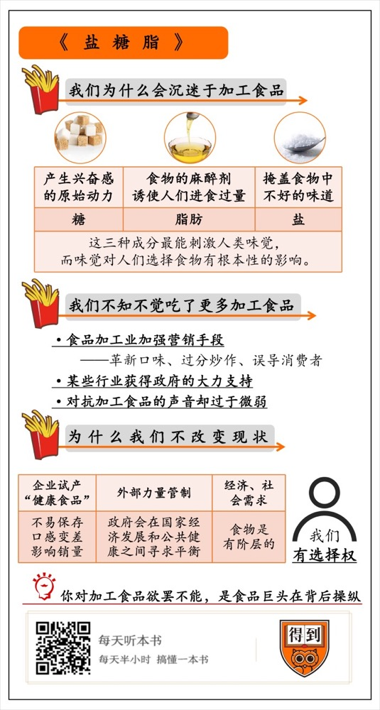

# 《盐糖脂》| 耶律瑾解读

## 关于作者

迈克尔·莫斯是《纽约时报》记者，此前曾在《华尔街日报》任职。他在1999年和2006年分别入围普利策奖评选，2010年获普利策解释性报道奖。

他花了三年时间完成了《盐糖脂》的写作。在写作过程中，他走访了卡夫、雀巢、可口可乐等知名食品公司，还采访了包括化学家、营养学家、律师、政府工作人员等等食品行业相关人士。

## 关于本书

这本书聚焦食品行业背后的力量，即食品巨头通过添加盐、糖和脂肪，让我们无法抵抗加工食物的强大魅力。书里还从社会学、心理学和市场营销的角度，揭秘加工食品如何在我们的生活中无孔不入。读完这本书，我们会知道：管不住嘴，可能真的不是我们自己的错。

本书曾获得《纽约时报》畅销书排行榜冠军。

## 核心内容

盐、糖和脂肪是三种神奇的成分，它们能让人欲罢不能。为了吸引消费者，加工食品行业巨头们想尽了办法利用这三种成分。他们的做法，毫无疑问重塑了现代人的饮食习惯：我们像“上瘾”那样，深陷加工食品用“盐糖脂”建造出来的美丽欲望之中，无法自拔。

## 前言

你好，欢迎每天听本书。本期音频要解读的这本书是《盐糖脂》，说的是盐、糖和脂肪这三种常见的食物成分。咱们都知道，这三种东西吃多了，对健康非常不好。但这并不是一本营养学的书，它的副标题就是这本书要回答的核心问题，“食品巨头是如何操纵我们的”。

如果你曾经对着薯片、比萨等垃圾食品欲罢不能，如果你因为不能成功减重而觉得是运动量不够，又或者是自责自控力不足，那听了这本书你会发现，这事儿可能还真不怪你。

这本书就从行业的角度揭示了，为了吸引更多的消费者，食品公司在产品中加入了远超出健康标准的糖分、盐分和脂肪。而且根据相关研究，习惯了吃加工食品的人想戒掉零食，就跟戒毒的难度差不多。

这本书不仅调查了很多美国食品公司的巨头，揭开行业内幕，还可以让我们了解到产品背后的配方故事和营销心理学的知识。作者迈克尔·莫斯是《纽约时报》的记者，他曾两次入围普利策奖评选，在2010年获普利策解释性报道奖。

作者的记者才能在这本《盐糖脂》中，也得到了充分的体现。在三年半的调查和写作过程中，他不仅走访了卡夫、金宝、雀巢、可口可乐等知名大公司，还采访了包括化学家、营养科学家、行为学家、营销人员、律师等等行业人士。这本书出版后，也进入了《纽约时报》畅销书排名榜。

今天的解读我将分成三个部分。

第一部分讲的是我们为什么会沉迷于加工食品？

第二部分讲的是食品加工业怎样利用五花八门的营销手段，让我们不知不觉地吃下了过量的调味品呢？

最后一部分我们来聊一聊，食品巨头攻势这么强烈，我们为什么遏制不了？

## 第一部分

我们先来看第一部分，我们为什么会沉迷于加工食品？

加工食品的范围非常大，那些添加了很多化学配方的食品，基本都在加工食品的范围里。添加了什么化学配方呢？比如说，为了让食品更好吃，人们会添加人工甜味剂；为了让食品保存的时间更长，人们就会添加防腐剂。像是饼干、方便面、薯片，它们都是加工食品。

数据表明，美国人摄入的食品有三分之二都是加工食品，这已经是一个年销售量高达一万亿美元的行业。同时，人群中过度肥胖的比例也大幅上升。公共健康领域明明一直在做各种宣传推广，呼吁人们多吃健康食品，保持健康的生活方式。那为什么效果不明显呢？

加工食品商们让消费者摆脱不掉加工食品诱惑的秘诀，就在于本书书名提到的这三种成分：盐、糖和脂肪。为什么是这三种成分？

因为这三种成分，最能刺激人类的味觉，而味觉对人们选择食物有着根本性的影响。有一本专门研究成瘾机制的书叫《上瘾五百年》，里面提到说，什么叫上瘾呢？上瘾就是化学分子刺激，让人身体产生了更多诱发快感的神经传导素。上瘾会让人有幸福感和解脱感，这和美味的食物带给我们的感觉相同。食品同样能激发大脑皮层的兴奋，让人上瘾。

食品公司的研究员们曾经总结出了一条关于“理想零食”的公式。消费者买零食，肯定会受到很多因素的影响，比如购买方不方便、价格实不实惠、食品是不是健康。但研究者发现，味道最能刺激消费者购买。只要提升风味，购买量就会上升。

就拿很多健身达人最看重的指标“含糖量”来说，人类对甜味非常敏感。研究人员就发现我们口腔的所有部位，包括上颚，都嗜甜如命。大脑对糖的反应和对可卡因的反应一样，甜食代表着能量，能带给人兴奋感和愉悦。甚至可以说，人类的历史是嗜甜的历史。所以，食品商自然很喜欢往食物中添加糖分了。糖不仅能直接吸引食物消费者，还能让他们吃得更多，帮商家卖出更多商品。

不过，食品当中的含糖量也不是越多越好。可口可乐公司就找到了一个糖分的“极乐点”。他们花费了大量的资金和精力做实验，最后发现，如果甜度超过了这个极乐点，人反而会感觉很腻，就会影响饮料的销量。因为人的大脑虽然更喜欢甜，但也更容易对强烈浓郁的味道感到疲劳，就会抑制对这种味道的渴望。这个最佳平衡点就是糖分的极乐点，按照这个比例调配好的可乐，不仅能让你感到令人愉悦的甜味，而且喝完后嘴中不会留下任何不好的味道，只会让你更加想喝。

更糟的是，甜味对于小孩子们的诱惑力，比对成年人更强。而且，研究者发现，偏爱甜味可能是一种“习得性行为”，意思是说，童年吃加工食品多的小孩，长大之后，也会更爱甜食，终其一生都无法摆脱对加工食品的渴望。所以，在给孩子们做的零食里，加工食品商们往往都会添加更多的糖分。

你可能会觉得，现在不是有很多“无糖饮料”吗？喝无糖饮料不就能减少糖类的摄入吗？作者在书里提到，这个效果可能没有你想象得那么好。因为就算饮料中不含糖，也会诱发我们对甜食的渴望，让我们摄入更多的食物，这样一来还是会导致肥胖。而且，无糖饮料当中的代糖还会欺骗人的新陈代谢系统，让身体以为自己已经吃了糖，诱发身体分泌胰岛素，从而储存更多的脂肪。

如果说大部分人对糖还是很警觉的，那接下来这个成分，就有些让人难以察觉了。这就是脂肪。脂肪和糖一样，脂肪也能刺激大脑，但是它更像一种麻醉剂，可以屏蔽食物里不好的味道，让食物的口感变得更柔和。加工食品行业还找到了让糖和脂肪协调作用的办法。他们发现，多加一点点糖时，多脂奶油会更美味。而且，脂肪隐藏得很深，很多饼干、薯片、蛋糕和派中，包括士力架和MM豆，都是脂肪在输出一多半的卡路里。但是消费者却不会认为这些是油腻的食品，最多只会对其中的糖分保持警觉。

而且更糟糕的是，无糖饮料当中的代糖还可以当作糖类的替代品，而脂肪是不可替代的。雀巢的一位食品科学家，就曾经试图用其他化学品来替代奶酪。但是他很快就意识到，奶酪中脂肪发挥的口感是化学品替代不了的。人们迷恋的是奶酪酱汁独特的口感，它既像蜜糖般黏稠，又像花生黄油般浓郁。脂肪可以促进进食，在它对大脑的麻醉作用下，人们完全吃得停不下来。而且，脂肪没有“极乐点”，食物里的脂肪含量越高，消费者的味蕾就越喜欢。

说完了糖和脂肪，我们再来看看盐。这个成分更容易令人放松警惕，毕竟，盐不会引起肥胖。但它对健康的影响也不容小视，由于钠的作用，摄入大量盐容易引起高血压。根据统计，现在有超过四分之一的美国人都有高血压。为了让人们少吃盐，健康部门的官员一度还发起一项运动，希望人们挪走美国餐桌上常见的盐罐。但他们最终却发现，这些盐罐对人们摄入钠的贡献大约只有6%，其实超过四分之三的盐分摄入都来自加工食品。番茄酱、比萨和速溶蔬菜汤里都含有大量的盐，甚至在给糖尿病人生产的低糖低脂的食品中，都含有大量的盐。

为什么加工行业也同样青睐盐呢？盐强大的吸引力一度让科学家非常费解，毕竟糖和脂肪来自动物和植物，包含了生命活动所需要的热量，而盐只是矿物质而已。虽然钠对人的生命是必须的，但是大多数人其实只需要摄入少量的钠就足够了。而现实的情况是，美国人每天摄入的盐，要比人体需要的高出十倍乃至二十倍。

后来科学家发现，问题的答案还是要回到味道，咸味也会引发大脑的快感。适当的咸度可以提升从培根、薯片到奶酪、泡茶等所有食品的吸引力。中国厨师当中不就有这样一句名言吗？盐是味中仙，盐放对了，这道菜的味道差不了。

除了增加吸引力，盐还可以作为“修复剂”，用来掩盖食物里不好的味道。加工食品常常用盐来掩盖怪味儿。处理这种怪味儿最有效的方法之一就是加入新鲜调料，但草本植物价格昂贵，所以加工商选择了更便宜的盐。

乐事薯片有一任健康总监，曾经想用静电吸附的方法减少盐的用量，这样确实能生产出低盐薯片，但是却需要额外的成本支出。盐太便宜了，直接撒上去用量容易偏大，但是成本足够低。你看，加工行业青睐糖、脂肪和盐，就是因为这几种成分能给人带来无与伦比的诱惑力。面对超市里激烈的竞争，食品商们不得不保持低成本和高吸引力的风味，而保证味觉吸引力最容易的做法，就是不断加大盐糖脂的剂量、加强刺激。

## 第二部分

但是我们都知道，不管是这三种成分的哪一种，吃多了都对身体特别不好。所以为了让我们放松警惕，食品加工业尝试了各种五花八门的营销手段，让我们在不知不觉中吃下了更多的加工食品，陷入甜蜜柔软的陷阱之中。这就是我们要说的第二部分。

在这方面，可口可乐公司可谓是营销典范。作为行业第一，他们一直有非常明确的敌人：百事可乐。为了赢得市场，他们首先在味道上做出革新。我们刚刚说到了，糖类的“极乐点”就是他们找到的。可口可乐很甜，但不会让你觉得感官过饱，喝完后不会腻，嘴里不会留下任何不好的味道。

不过，不管广告怎么夸他们的口味配方，可口可乐的发展壮大，根本在于实行了一种“赶尽杀绝”式的市场营销。

可口可乐的营销人员发现，可乐消费符合“二八定律”，就是世界上80%的可乐，被20%的重度使用者消费。所以，他们采用各种办法，培育可口可乐的重度使用者。比如他们发现，相比中老年，青年人更容易建立起长期的品牌忠诚度，所以他们就投放了大量针对年轻人的广告。虽然可口可乐承诺了不会在12岁以下的儿童观众节目里打过多的广告，但他们对12岁以上的小消费者，那广告可谓铺天盖地、穷追猛打。他们的广告策略还区分不同的人群。比如他们在发现非裔美国人更爱甜味更浓的饮料之后，他们也策划了一些更针对非裔美国人的广告。

除了在广告上下功夫之外，本地销售人员还会研究超市货架摆放、商场布置，为可口可乐选择最佳的位置。他们会在街头门店进行推广，激发人们的购买偏好。可口可乐去到巴西后，为了符合当地贫民区的要求，甚至了推出了一种全新的、更便宜的小包装可乐。

通过上面这些营销方式，可口可乐稳坐了行业第一，但百事可乐也一直稳居其后。这两家公司的可乐大战没有明确的结果，但同心协力地带动了汽水消费。书里统计发现，从1980年以来，可口可乐的销量开始飙升，一同飙升的还有美国的肥胖率。汽水含糖量高，又有大包装，是引起肥胖病最重要的原因。

在消费者心中打品牌战当然是一种方法，还有很多食品公司用的是另一种营销方式，你一定也很熟悉。那就是把产品和“健康”绑定起来，做和“健康”有关的形象营销。

就比如，水果一直是健康的象征，顺带着连果汁也被划入了健康食品的阵营。但你可能不知道，很多果味汽水根本不含水果，而某些所谓“纯天然”的浓缩果汁，真正的果汁含量少到可怜。一瓶里大概只有两汤勺，还不到配方的5%。这么一点果汁，最后却成了营销中打造健康形象的重点。

而且，就算这份果汁真的是水果榨出来的，营养也没有水果那么高。在果汁浓缩汁的制作过程中，加工工人会先给水果去皮，这就去除了水果里大部分的有益纤维和维生素；再从果肉中提取果汁，又会让水果失去更多的纤维。他们还要添加去除苦味的化合物，通过混合来调节甜味，最后再蒸发掉果汁内的水分。最后得到的浓缩果汁基本上就是糖，纤维少得可怜。所以作者甚至说，浓缩果汁其实只是糖的另一种形式。

但是，由于食品公司的营销，“果汁是健康饮料”已经深入人心。很多人为了保证健康放弃汽水而喝果汁，但他们想不到，这样的生活方式同样会让他们发胖。

再比如“低脂牛奶”这个产品吧。脂肪的公众名声一直不好。脂肪这个词不仅本身不吸引人，出现在食品上也很不讨人喜欢。在70年代，美国牛奶的销量一度锐减，就是因为人们担心牛奶中含有的脂肪会带来过高的卡路里。那该怎么办呢？乳制品业发明了“低脂牛奶”这个概念，化解了危机。这种低脂牛奶的包装上，还会打上“2%”的标签。很多人看到这个标签，就认为这是说明牛奶中98%的脂肪都被去除了。但其实这个“2%”，就是一个营销策略。因为全脂牛奶中的脂肪量是3%，低脂牛奶只降低了1%而已。

为了让自己家的产品销量更好，食品商甚至会赞助那些对自己有利的研究。比如家乐氏的糖霜燕麦片，就在 2008 年初推出了一个广告，广告告诉大家：一项临床研究显示，早餐吃糖霜迷你燕麦片的孩子，他们的注意力都提高了近20%。但是，这个临床研究其实是家乐氏公司自己支付资金做的。而且回看这个实验的真实数据，也只有七分之一的孩子的注意力程度提高了18%。但在被告发、勒令下线之前，这个广告已经帮助糖霜燕麦片占有了很大一部分的市场份额。

还有另一些食品加工业积极创造出的、看似更健康的食品，比如酸奶、高纤饼干，但这些食品是不是真的健康还要打上一个问号。我们就这么一直被加工食品深深诱惑，不能自拔。

## 第三部分

你看，糖、盐和脂肪魅力无穷，营销攻势更令人无法拒绝，诱惑着消费者们吃下更多的加工食品，维持不健康的生活习惯。为什么我们不改变这种情况呢？在第三部分，我们就来说说这个问题。

既然大家都知道，吃多了糖、盐和脂肪对身体不好，那食品公司这么多，难道就没有一家真正的“良心企业”，带头做一些真正健康的食品吗？其实，生产趣多多和乐之的卡夫公司，还真的曾经有过减少产品脂肪含量的尝试。他们想看看能不能既解决人们肥胖问题，还能保证自己公司产品的销量。

这个尝试可不容易，因为脂肪之于食品加工业，正如尼古丁之于烟草，很难戒掉。卡夫特地成立了健康和营销专家小组，研制了更健康的产品。他们尝试往里面加入健康的搭配，比如新鲜胡萝卜，还推出过低脂配方的午餐。

就算做了这么多，也没达到卡夫公司想看到的效果。比如新鲜的果蔬实在难以保存，低脂配方的午餐口味没那么好。要知道，加入过量的盐、糖和脂肪不仅可以增加食物的诱惑力，还可以让食品储存期变长，更有利于销售。这些健康食品因为销量惨淡，很快就停止生产了。所以卡夫公司内部对这项工作有疑惑，觉得这种做法影响了食品的销售。

更重要的是，食品行业一直受到华尔街的巨大影响。金主们对企业的账面数字非常看重，不允许企业利润下滑。食品生产商们也不想冒着触怒金主的危险自我改革。 

你看，良心企业总要保证自己的生存吧，可一旦生产健康食品，销量就下滑，这让良心企业怎么活下去呢。想要改变这个情况，光靠食品公司是不行的。

你可能想到了，既然这样，那就得靠外部的力量，比如政府管制。其实，在公共健康领域，早就有很多控制加工食品滥用盐糖脂的努力了。在有些地方，控制盐糖脂的政策已经获得了成功，比如芬兰。

自1980年代以来，芬兰为了应对心脑血管疾病，开始降低国民对盐的消费量。他们利用公共教育，大力宣传过量食用盐的害处，并要求食品商在高盐食品上醒目地标注出“高含盐量”。效果很显著，2007年，芬兰人均盐消耗量降低了1/3。

但是政府不一定总是站在公共健康这边。出于对国家经济发展和平衡的考虑，政府有时也会做出一些对公共健康不利的选择。

就比如奶酪在美国的推广吧。在我们的印象中，美国人非常喜欢吃奶酪，但其实美国人在所有菜肴中添加奶酪，并不是历时已久的习惯，而完全是被广告培养的。在这个过程中，政府带来的影响就非常大。

在加工干酪发明之前，奶酪不易保存，销售也比较困难，美国人对奶酪的消费量并没有像现在这么庞大。那奶酪的消费量是怎么上升的呢？来自生产过剩的乳品业。他们受到政策保护，不用担心竞争和滞销，所以有着巨大的产能。而公众对健康日益关心，制造者生产了许多脱脂奶，脱脂奶多余的乳脂就被用于制造奶酪。为了卖出更多乳制品，政府就一直鼓励公众消费乳制品，比如牛奶和奶酪的消费，而对乳制品可能造成肥胖的危险却一笔带过。为了卖出更多的奶酪，生产商们还疯狂增加奶酪的应用场景，比如吃抓饭和意面时有不同的奶酪。原本是零食的奶酪，一跃成为美国人必不可少的厨房调料。

同样的情况还发生在美国的牛肉加工业。奶酪和红肉在人体内囤积饱和脂肪，容易引起胆固醇过高、糖尿病。但农业部健康中心隐藏了这个提醒，毫不犹豫的和食品业维持了同一战线。牛肉加工商们还联合起来发起了“代扣会费”项目，所有的供应商都提供一部分资金，用于对政府部门进行集体游说。在游说下，农业部一直都帮着加工商说话。

联邦政府对糖也非常宽容。在过去的三十年里，联邦政府甚至免除了食物中糖的最高限量，也没有强制要求那些生产厂家公布它们产品的含糖量。

在这种情况下，维护公共健康的公共力量，既没有足够的资金，也缺乏政府的支持，当然也就没办法和强大的食品加工商对抗。比如联邦贸易委员会就曾经发现，很多早餐谷物含糖量在50%以上，但食品公司却打着“健康食品”的招牌售卖着这款产品。

发现了这个情况后，联邦贸易委员会还曾经试图禁止它面向儿童的食品广告，但受到了来自食品公司、广告商、电视网络代表的抵抗。这是一个强大的行业游说团体，他们动用了高达1600万美元的资金，推翻了委员会的提案。早餐谷物的广告商依靠强大的政治游说资源取得了胜利，早餐谷物依然作为一种“健康”的食物被大量购买。

作者提到说，加工食品的流行，其实也有着现代的经济和社会因素。食物是有阶层的。可口可乐和卡夫的高管们，吃东西都非常注意，都会尽量避免吃下自己公司的食品和饮料，而是维持着健康的生活方式。因为新鲜健康的食材不仅价格更贵，而且获得的难度更高，所以越底层的人，越容易依恋加工食品提供的不健康但方便而廉价的味觉刺激。食品公司们则对自己生产的不健康的食物振振有词。他们认为，如果加工食品不生产，穷人只会选择更少、吃的更差。

不知道你听了这些有没有感觉很绝望，普通人到底有没有办法摆脱盐糖脂的控制呢？作者认为，人们还是要增加对食品健康的认识和关注程度，在购买食物时做出有意识的选择。他说，食品加工商有盐、糖和脂肪，但我们有选择的权利，这才是最强大的力量。毕竟我们可以决定自己吃什么，也可以决定自己吃多少。

就比如说盐，人对盐的渴望可以很容易地逆转。只要进行低盐饮食一段时间，人们口腔味蕾就可以重新恢复敏感。这时，人只需要一点点的盐就可以感受到愉悦。这样，人们也可以重新审视过去的饮食，是吃下了多少没有必要又有害健康的盐。

## 总结

到这里，《盐糖脂》这本书的内容已经为你介绍完了。我们来回顾一下这本书都讲了什么。

本书首先揭露了一个事实：加工食品已经充斥了我们的生活。他们用盐、糖和脂肪诱惑我们，让消费者们大量购买他们的产品。

为什么盐、糖和脂肪有这么大的诱惑力？糖是令人产生兴奋感的原始动力；脂肪是食物的麻醉剂，诱使着人们进食过量；盐则可以掩盖食物中不好的味道。

为了让这些充满盐糖脂的食物更好的诱惑我们，加工食品厂商做出了很多营销努力。而且，一些行业还能获得政府的大力支持，而对抗加工食品的声音却过于微弱，总是被掩盖。不过，普通人还是有可能抵御不健康的加工食品的诱惑的，选择的权力始终属于我们自己。

撰稿：耶律瑾

脑图：刘艳导图工坊

转述：杨婧