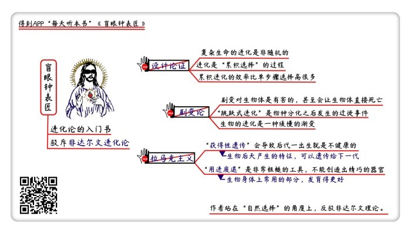

# 《盲眼钟表匠》| 柴知道解读

## 关于作者

理查德·道金斯，曾被评为英国最重要的公共知识分子，著名的达尔文进化论捍卫者和无神论者，作品《自私的基因》曾风行全世界。 

## 关于本书

《盲眼钟表匠》是理查德·道金斯捍卫达尔文进化论的代表作之一。道金斯认为，复杂生命的出现和演化，并不是因为上帝这位有目的的“钟表匠”，而是由“自然选择”这位无目的的“盲眼钟表匠”所推动的。该书被《经济学人》杂志誉为“自1859年达尔文进化论出版以来，关于进化论最可读的读本，最有力的捍卫！” 

## 核心内容

在本书中，道金斯引用各种坚实的证据，进行了详细的论证，反驳了“设计论证”“拉马克主义”等一系列非达尔文理论，并且正面回应了诸多针对达尔文进化论的质疑。最终提出，以自然选择为核心的达尔文进化论，是唯一能解释复杂生命诞生和演化的理论。

## 前言

你好，欢迎每天听本书。本期音频为你解读的是《盲眼钟表匠》，副标题是《生命自然选择的秘密》。这本书的中文版大约31万字，我会用大约30分钟的时间，为你讲述书中精髓：作者理查德·道金斯是怎么站在“自然选择”的角度上，反驳非达尔文理论的？

《盲眼钟表匠》的书名，其实来源于神学家威廉·培里的代表作《自然神学》。培里在《自然神学》的开篇说，假如你在荒野之中看见了一块石头，那你可以认为，这块石头一直就在那里，是自然存在的。但如果你在荒野中看到了一块钟表，上面有时针分针秒针，各种机械装置都非常精巧，那你肯定会认为，它不可能跟石头一样是自然产物，而一定是被一位钟表匠精心设计制造出来的。像人或者其他动植物这样的复杂生物，就跟这块表一样，一定是有人为了一个目的而精心设计的，绝不可能是自然出现的。

这个故事背后所隐含的思想，叫做“设计论证”，“钟表匠”其实就是在隐喻上帝。意思就是说，地球上的生命如此精巧，各种自然现象如此复杂，一定是上帝设计的，不可能是自然进化的。

当然了，进化论的提出者达尔文不同意设计论证，本书的作者理查德•道金斯也不同意。道金斯在书中说，培里非常聪明，他敏锐地发现，复杂生命的出现，一定有一个很特别的原因。但是呢，这个原因不是上帝这位无所不能的钟表匠，而应该是达尔文所提出的自然选择。自然选择是没有目的的，所以，它只能是一位盲眼钟表匠。虽然这位盲眼钟表匠遵循的基础规则非常简单，但却是复杂生命诞生和演化的唯一正确答案。

到目前为止，理查德·道金斯一共出版了11本书，全都是关于进化论的科普书。他是当今世界最著名的达尔文进化论捍卫者，被称为“达尔文的斗牛犬”。道金斯也是当今西方世界最为知名的学者之一，曾被读者评为英国最重要的公共知识分子，得票数甩开第二名一倍之多。

道金斯写的第一本书，也是他最出名的代表作，就是享誉世界的《自私的基因》。他在《自私的基因》里提出了“基因中心进化论”，也就是说，自然选择的对象，不是种群，而是基因。无论是人类还是其他生物，都只是用来保存基因的工具而已。这本书出版之后引起了很多争议，很多人误以为，道金斯是在说基因是有意识有目的的，或者说人都是自私的。在这本中，道金斯回应了一些由《自私的基因》所引起的争论，他在书名《盲眼钟表匠》中就强调了，自然选择是没有目的的。书里也说到，基因为了自己的利益，必须和其他基因展开合作，并不是我们想象的那种“自私”。

在二十世纪七八十年代，学术界还出现了一些对于达尔文进化论的质疑，比如有人认为，达尔文的理论虽然可以解释物种内部的微小变化，但却没有解释物种分化的过程，也没有描述复杂生命形成的详细过程，甚至有人想全盘推翻进化论，认为生物只能是上帝设计的。道金斯在《盲眼钟表匠》里，就用正宗的达尔文理论，解释了这些看起来很难的问题，用详细可靠的论证捍卫了达尔文进化论。

《盲眼钟表匠》在一开篇，就用各种坚实的证据和论证，反驳了刚才提到的设计论证。这其实也是道金斯一直以来的观点。道金斯自己说，他从小就怀疑上帝的存在，后来发现达尔文的进化论，可以非常完美地解释生命的诞生和演化，所以彻底转变成了一位无神论者，也因此成了进化论的忠实捍卫者。

你看这本书的时候会发现，道金斯从头到尾的语气都极其强硬，经常直接批评甚至嘲讽其他理论，但他并不是不讲理，而是会引用大量的证据，再通过进行严谨的推理，来证明达尔文理论的正确性。所以《经济学人》杂志在评价《盲眼钟表匠》的时候说，这是“自1859年达尔文进化论出版以来，关于进化论最可读的读本，最有力的捍卫！”

在今天，进化论既是自然科学的重要分支，也成为了人文科学的基础。但一直以来，针对进化论都有不少的误解和质疑，还有一些学者提出了其他理论，试图代替达尔文的进化论。《盲眼钟表匠》是一本进化论的入门书，目的就是要澄清针对达尔文进化论的误解，驳斥非达尔文理论，以此来捍卫达尔文进化论的正确性。所以这期音频，我们就跟随着道金斯的思路，从书中挑出三个非达尔文理论，来看看它们提出了怎样的主张，道金斯又是如何驳斥它们，如何有理有据地捍卫达尔文进化论的。

首先要来看的第一个理论是设计论证，为什么道金斯说进化论完全可以解释复杂生物的演变，无需上帝插手？第二个理论是“剧变论”，以及道金斯为什么说生物的进化一定是缓慢的渐进式变化，而不可能是激烈的剧变？第三个理论，是达尔文理论最著名的对手，“拉马克主义”进化论。道金斯为什么说拉马克主义是完全错误的呢？

## 第一部分

先来看看设计论证。为什么道金斯说进化论完全可以推动复杂生物的演变，不需要借助上帝？

设计论证的基本观点刚才已经说过了，主要就是说，像人类这样的复杂生物，是不可能通过偶然的突变诞生的。这个说法到底可不可信呢？毕竟宇宙已经诞生了大约136亿年，地球也已经存在了46亿年，在如此之长的时间跨度之下，难道就真的不可能有什么巧合，能够一下子自然形成一个复杂生物吗？

我们可以来算一算。复杂生物的例子不好算，我们换个更简单的，看起来可能性也更大的例子。有一个流传很广的说法，说如果你给猴子一台打字机，只要有足够长的时间，让猴子随便乱敲，那它早晚也能写出一部《莎士比亚全集》来。那我们就来算算，猴子要多长时间才能敲出这部《莎士比亚全集》。

道金斯自己用电脑做了一个简单的计算，假如只从莎士比亚的作品里挑出一个短句子，比如“我觉得像一只黄鼠狼”这句话，一共28个字母。那么猴子一次性敲出这句话的概率，是10的40次方分之一的概率，非常小。注意，这还只是莎士比亚作品中的一句话而已。有人还做过简单的估算，如果有100万只猴子，每只猴子一分钟打100个字，所有猴子24小时不间断工作，光打出“to be or not to be”这句话所需要的时间，就相当于宇宙年龄的500万倍。之后每增加一个字符，所需要的时间就会增加50倍，那你想想，打出一部莎士比亚全集要多久？

这个计算说明了，如果完全依靠随机过程，完全依赖运气，那么像猴子偶然敲出《莎士比亚全集》，或者一夜之间突然出现了一个复杂生物这种事，是基本不可能发生的，哪怕耗尽宇宙的寿命也不可能发生。那是不是说，生命就只能是上帝设计出来的呢？当然不是。道金斯给了一个办法，如果我们让猴子按照这个办法来敲键盘，那整件事情就完全不同了。

这个办法，就是添加一个筛选程序。道金斯设计了一个电脑程序，在一开始，这个程序会随机敲出一个由28个字母组成的序列，随后不断复制这个序列，不过在复制过程中会出现随机的错误，比如替换其中的一个字母。然后再对这些复制出来的序列进行检查，从中挑选出最接近“我觉得像一只黄鼠狼”这句话的一个字母序列，继续复制，再挑出一个最接近这句话的序列，不断重复这种过程。

道金斯把这个电脑程序运行了三次。第一次，在复制挑选了43代之后，“我觉得像一只黄鼠狼”这个句子就出现了。第二次实验，这个句子出现在第64代，第三次是在第41代。平均花费的时间，大概是半个小时。而如果不用这种方法，随便敲的话，要打出这个句子，需要的时间大概是10的30次方年，比宇宙的年龄要多得多。

道金斯所采用的这种办法，叫做“累积选择”。在累积选择的过程中，每一次变化，都会成为未来的基础，进化效率极高，能在相对短的时间内就演化出一个有秩序的复杂事物。跟累积选择相对的，就是猴子随便乱打字的方法，这种方法叫“单步骤选择”，其实就是完全靠运气乱蒙，只能是一事无成。

生命演化的过程，其实就是一个累积选择的过程，基因在复制过程里发生的突变，就像复制句子时出现的随机错误一样。不过要注意的是，跟猴子打字的例子不同，任何生物的演化，都没有一个明确的最终目标，也没有完美的选择。但是，生命的进化同样有一个筛选机制，这个机制，就是自然选择。

举个例子。假如某种生物有一个跟视觉有关的基因，这个基因在复制遗传的过程中，当然有可能产生突变。这个突变是完全随机的，既有可能导致下一代的视力变好，也有可能导致下一代的视力变差。但关键在于，自然选择的筛选机制，绝不是随机的。因为视力变好的生物个体会在竞争中处于有利的位置，可以把自己的基因遗传下去，而视力变差的个体会死掉，或者没有交配机会，它的基因根本无法继续流传。

在生物漫长的进化史中，这个突变—筛选—再突变的过程会不断重复，虽然每一次变化都很微小，但有利于生存和繁殖的特征会不断积累，所以生物的后代和祖先之间会出现巨大的遗传差异。

所以说，设计论证的支持者们，他们误以为进化论的机制，是凭借运气的单步骤选择，但实际上，进化论中导致复杂生物出现的最关键机制，是非随机的累积选择。基因的单次突变，的确是一个随机过程，但由于自然选择机制的存在，生物世代积累起来的变化绝不是随机的。渐进、逐步的累积变化，才是生命进化的关键，偶然的突变只扮演了一个次要角色。

讲到这里你就明白了，道金斯和达尔文为什么反对设计论证，认为复杂生命不需要上帝来创造，是完全可以通过进化产生的呢？因为设计论证认为，生命的进化是单步骤选择，是依靠运气的随机过程，但在达尔文和道金斯看来，复杂生命的进化，其实是一个累积选择的过程，是非随机的。二者之间的根本区别，就在于进化的效率上，累积进化的效率，要比单步骤选择高上无数倍，二者根本不能相提并论。单步骤选择无法实现的成就，如果采用累积选择的方法，就是完全有可能实现的。

刚才讲的设计论证，是对自然选择机制的误解。接下来要讲的剧变论，是对突变的误解。有些达尔文的论敌认为，进化不是一个缓慢的渐变过程，而是一个激烈的剧变过程。那接下来我们就来看看道金斯为什么说剧变论是错误的，生物的进化一定是缓慢的渐变？

## 第二部分

达尔文曾说过，进化论的基础观点就是，任何复杂的器官，都是由连续微小的改良所造成的。也就是说，生物的进化，是速度很慢的渐进式变化。有多慢呢？在生物学家看来，如果在10万年之内进化出了一种新的动物，这都能算得上是突发事件了。所以如果以人类的生命周期来看的话，生物进化的速度的确是非常缓慢的。

按照这种渐变的理论，人们可以预期，如果我们把某种生物的化石按照年代顺序排列起来，那应该能够发现某种缓慢变化的规律，而不会是杂乱无章，或者快速变化的。但问题是，早在达尔文那个年代，古生物学家们就发现，化石记录中所体现出来的变化趋势，根本就不是缓慢平稳的，而是经常会出现极其剧烈的变化，甚至是跳跃式的进化。

根据这些证据，达尔文的论敌提出了剧变论，认为生物进化的过程，根本不是达尔文所说的渐变，而是一种快速激烈的剧变。比如像眼睛这样的器官，其实只要一次突变就可以进化出来了。这种剧变，才是主导生物进化的力量。

在这个问题上，道金斯当然是支持达尔文的。他在书里直接驳斥了剧变论，认为这是完全错误的理论。道金斯认为，生物进化过程中的确有可能产生剧变，但问题是，这些剧变并不会让生物变好，反而会对它们有害。

你想想，对于某个生物来说，既然它们的上一代能活下来，就证明它们的身体构造没有什么大问题，在这种情况下，微小的变化有可能给它带来好处，但如果产生了激烈的剧变，可能它压根就活不下来了。事实也是这样，科学家们在实验室里研究过的剧烈突变，基本都是对生物体有害的。所以说，剧变虽然有可能发生，但绝对不可能推动生物的进化和发展。

但是达尔文的反对者又说，好，即使剧变论不对，但那些化石记录可是实打实地摆在那里，是不会撒谎的，有些生物就是发生了跳跃性的进化。达尔文的渐变论，到底要怎么解释这个问题呢？达尔文自己给过一个解释，说这是因为生物学家手上的化石记录不完整，所以才会产生这种跳跃的情况。这就好比是一段完整的电影画面，被人从中剪掉了几段，那你再播放的时候，就会觉得画面产生了跳跃，但如果这个胶片是完整的，就不会出现这种情况。

达尔文的解释是从化石证据本身的角度入手的，当然有道理。但道金斯的解释更进一步，因为他从理论的角度解释了这个问题。道金斯说，按照进化论，即使我们真的在某个地方找到了完整的化石记录，这个记录也可能会产生跳跃。这跟新物种出现的原理有关。

新物种出现的最主要原因，是地理隔绝。道金斯用一种叫树鼬的动物举了个例子：西班牙的树鼬，跟蒙古的树鼬之间，就无法进行交配。因为它们虽然来源于同一个祖先，但是由于离得太远，长期不交配，久而久之，它们就在不同的自然环境下，进化成了不同的物种。在自然界中，一座山、一条河，甚至一条路，都有可能造成地理隔绝，导致物种分化。比如当年达尔文在加拉帕格斯群岛上发现，虽然各个岛之间离得不太远，但不同岛上鸟的种类就不一样，这也是地理隔绝导致的。这就是新物种出现的原因。

根据这个原理，道金斯拿树鼬做了一个论证。他说假如现在有一座高山，树鼬很难翻过去，但恰好有那么一两只树鼬运气好，翻到了山的另一侧，开始繁衍。由于翻过山的树鼬必须要面对山另一侧的新环境，所以进化的速度很快，那么久而久之，翻过山的树鼬就会变成新的物种。但留在原来那一侧的树鼬，因为一直处于熟悉的环境中，受到的自然选择压力较小，所以进化的速度相对来说就慢。

好，那假如新的树鼬种群偶然间回到了它祖先生存的地方，会出现什么样的结果？从表面上看，就好像是这个地方一夜之间进化出了一个新的物种，因为你观察不到任何进化过程，这个新物种好像突然就出现了。但实际上，新物种并不是因为一次剧变而形成的，因为它的演化过程，根本就不是在这个地方进行的，而是在山的另一侧完成的。所以如果你只在这一个地方找化石，那当然会觉得这个生物好像是一夜之间就出现了，因为你在这里根本就看不到演化过程。化石记录上所出现的跳跃，根本就不是因为进化，而是因为迁徙所导致的。

讲到这里，为什么道金斯说剧变论是错的，生物的进化一定是渐变的原因，你就清楚了。道金斯承认，剧变在自然界中的确存在，但是，剧变对生物体是有害的，它不光不会推动演化，甚至还会让生物体直接死亡。至于化石记录中所出现的跳跃，其实跟物种分化的原理有关，这种跳跃表面上看起来像是剧变，但其实只是物种分化之后所发生的迁徙事件而已。生物的进化，只能是渐进式的缓慢变化，而不可能是激烈的剧变。

刚才讲的设计论证，是对自然选择机制的误解；剧变论是对突变方式的误解。而接下来要讲的这个理论，比达尔文进化论诞生的还早，而且完全没提到自然选择和突变的概念，却成了达尔文理论最出名的论敌，这就是拉马克主义的进化论学说。所以下面我们就来讲讲道金斯为什么说拉马克主义的进化论是完全错误的？

## 第三部分

拉马克也是一位法国的生物学家，还是最早提出进化理论的学者之一，对生物学的发展做出了重要贡献。拉马克比达尔文大65岁，他去世的时候，达尔文还在剑桥大学念书。他提出进化论的时间比达尔文更早，但问题是，拉马克对生物进化过程的解释，跟达尔文不同。拉马克认为，生物进化有两种主要的机制，一种叫“获得性遗传”，一种叫“用进废退”，我们在后面一个一个来解释。把这两种机制结合在一起，就能实现物种的进化。这种理论，被称为拉马克主义进化论。

拉马克主义其实很简单，有点像是民间智慧的产物。获得性遗传就是说，生物后天产生的特征，是可以遗传给下一代的，比如如果你上几代祖先脚底老茧都很厚，那你一生下来，脚底皮肤也就很厚；如果父亲的皮肤被晒得很黑，那孩子生下来肤色也偏黑。用进废退就是说，生物身体上的哪个部分用得越多，那这个部分就会发育得更好，哪个部分用得少，那这部分就会逐渐退化。比如动物经常赤脚在地上走路，那脚掌上的皮肤就会变厚；如果人的肌肉长时间不用，就会萎缩。

乍看起来，获得性遗传和用进废退都有点道理，而且这两个机制结合到一起，好像也能解释生物进化。比如说，长颈鹿的脖子为什么那么长？在拉马克主义者看来，是因为长颈鹿为了吃到更多树叶，就天天伸长了脖子去吃，久而久之，用进废退，它的脖子就变长了。之后这个长脖子又遗传给了下一代，下一代继续用，接着变长。繁殖了很多代以后，长颈鹿的脖子就变成现在这样了。至今为止，还有很多对进化论一知半解的人认为，生物是按照拉马克说的这种方式来进化的。

但实际上，拉马克主义跟科学观察的结论完全不相符。至今为止，科学家们都没有发现哪种生物后天形成的特征可以直接遗传给下一代，而且随着基因科学的发展，人们已经知道，生物的各种特征是由基因表达来控制的，后天的性状不可能直接遗传给后代。

道金斯当然知道这些道理，但是他心气高，不愿意只用现代科学观察来反驳拉马克。他声称，要从最底层的理论上来推翻拉马克主义，他要证明的是，就算拉马克所说的获得性遗传和用进废退都是真实存在的，那它们也绝不可能孕育出复杂生物。我们来看看，他凭什么做出这个断言。

先来说，如果获得性遗传是正确的，那会怎样。道金斯说，生物在后天环境中，的确会产生不少特征上的变化。但这些变化，大部分都不是改进，而是破坏和损耗。

道金斯举了个例子，说他妈妈养了一条瘸腿的小狗，恰好他邻居家也有一条瘸腿的老狗，所以他妈妈就相信，这个小狗肯定是隔壁老狗的后代，因为瘸腿这个后天特征被遗传下来了嘛。道金斯就说，如果真像拉马克说的那样，生物会把自己的后天性状遗传给下一代，那就意味着，它身上的各种伤痕、损耗甚至疾病和残疾，都会遗传给后代啊。这对于后代来说，恐怕不会是好事，因为它一生下来就是不健康的。

可能有人会争辩说，那也没关系，生物可以只遗传好的特征，不遗传坏的特征啊！但问题是，怎么判断一个后天特征是好是坏呢？唯一的标准只能是，看看这个特征是不是有利于生物的生存和繁殖，有利于生存的就遗传下去，不利于生存的就被抛弃。但你想想，这种筛选机制，不就是自然选择吗？问题是，自然选择是达尔文提出的，拉马克的理论中根本就没有包含自然选择，所以这些人的争辩可以说是自相矛盾了。

再来看看用进废退。道金斯承认，生物体在后天所产生的一些特性，的确是用进废退的结果，比如说很多健身爱好者，身上的肌肉非常发达，这就是在锻炼过程中长期使用这些肌肉的结果。但道金斯同时也指出，用进废退是一个非常粗糙的工具，不能创造出精巧的器官。

道金斯用眼睛举了个例子。眼睛可能是动物身上最精巧的器官了，有可以校准色差的晶状体，可以调整对焦距离的睫状肌，还有1.25亿个用来感知色彩的感光细胞等等。这些相互配合的复杂产物，是可以通过用进废退来产生的吗？道金斯认为，答案很明确，不可能。

比方说，视网膜上有三种感光细胞，分别用来感受红、绿、蓝这三种颜色的强弱，那这三种细胞都受到同样多的光线照射，用的次数也一样多，为什么各自进化出了不同的功能呢？这是用进废退机制所不能解释的。所以在道金斯看来，用进废退最多只能打造出非常原始粗糙的生物，而不可能打造出像眼睛这样复杂精巧的器官。

讲到这里，拉马克主义是对是错，答案已经很明显了。道金斯提出，所有严谨的科学观察，以及胚胎学和基因学的发展，都已经证明了生物不可能把后天形成的特征遗传给下一代。而且，即使拉马克所说的获得性遗传和用进废退真实存在，那也不可能推动生物的进化。因为生物后天所获得的性状，大部分都是有害的，如果不经过自然选择，那带给后代的只能是伤病和残疾。用进废退也只是一个非常粗糙原始的机制，不可能打造出精巧复杂的生命。

总结

好，讲到这里，《盲眼钟表匠》的精髓，也就是道金斯是怎么反驳非达尔文理论的。他声称以自然选择为基础的达尔文进化论，是唯一能解释复杂生物出现和演变的理论的原因，你就清楚了。我再来为你回顾一下。

首先讲到的第一个理论，是设计论证，认为复杂生命是不可能偶然出现的，只能是上帝制造的。设计论证其实是对自然选择机制的一次误解，它误以为生命的进化是单步骤选择，是完全依靠运气的随机过程。但道金斯指出，复杂生命的进化是非随机的，是累积选择的过程。而累积进化的效率，要比单步骤选择高上很多倍，单步骤选择无法进化出复杂生命，但对于累积选择来说，这就完全不成问题。

第二个理论是剧变论，有人根据生物化石等证据提出，生物的进化过程不是缓慢的渐变，而是激烈的剧变。道金斯用显微镜作为例子，说明了剧变对生物体是有害的，甚至会导致生物个体直接死亡，不可能是推动生物进化的动力。而且，他还用物种分化的原理，解释了化石记录中出现的所谓的“跳跃式进化”现象，认为那其实不是进化事件，只是物种分化之后所发生的迁徙事件而已。生物的进化，只能是像达尔文所说的那样，是一种缓慢的渐变。

最后一个理论，是最出名的非达尔文进化论，也就是拉马克主义进化论。拉马克认为，通过获得性遗传和用进废退这两个机制，就可以推动生物的进化。但道金斯指出，不光是现代的科学观察不支持拉马克的观点，而且就算获得性遗传和用进废退真实存在，它们也不可能推动生物进化。因为生物后天的性状，大部分都是损耗，如果不加选择地遗传给下一代，那只会导致下一代刚一出生就伤痕累累。另一方面，用进废退也只是一个非常粗糙的变化机制，根本不可能打造出精巧复杂的生命。

看完《盲眼钟表匠》，我有一个感想。在我们看来，达尔文的进化论，已经是无需辩驳的真理，而且好像是人人都应当理解的简单理论。但实际上，如果别人真的提出了质疑，那要想逻辑清晰地解释清楚进化论中的各个问题，还真不是一件简单的事，因为这既需要对进化论有深刻的理解，还要求有极其清晰的逻辑和辩论技巧。真理越辩越明，像道金斯那样通过钻牛角尖式的辩论来讨论问题，很可能是加深认知的好办法。

撰稿：柴知道

脑图：摩西

转述：顾一菲