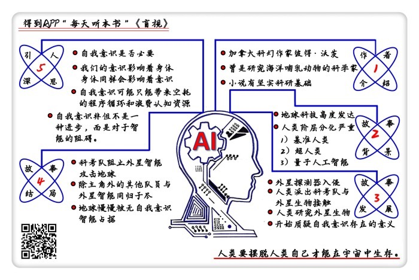

# 《盲视》| 陈楸帆工作室解读

## 关于作者

彼得·沃茨, 加拿大科幻小说家，新时代硬科幻作家中的佼佼者。曾经做过动物学家，专业是研究海洋哺乳动物。他的作品建立在缜密的科学研究基础上，主题往往是以认知神经科学为主，探讨人类的大脑和自我意识。代表作有《盲视》、“裂缝三部曲”等。

## 关于本书

小说讲的是在不远的未来，人类探测到了外星智能，派出一支科考队奔赴太空与外星智能发生接触的过程。他们接触到的这个外星智能超越了以往任何人对于外星智能的想象。他们发现，外星智能有着极高的智力，但是没有自我意识，而宇宙之中这样的智能可能才是主流。

## 核心内容

本书讲述科考队与外星智能接触的故事。随着故事的进行，作者逐步抛出关于人类的自我意识的疑问。

作者认为，自我意识和智能并不一定是一回事。“盲视”这种神经现象指人可以视而不见，某种意义上这暗示了人的自我意识是一种没有用的累赘。想要在这个宇宙进一步的进化，就要摆脱自我意识。

作者在书里的核心的猜想，就是“自我意识”在智能生物的进化上可能并没有正面作用。而他自己提出了这个问题，但是他没有办法回答。

## 前言

你好，欢迎你每天听本书。这期音频要为你介绍的是加拿大科幻作家彼得·沃茨的小说，《盲视》。这期音频有陈楸帆工作室出品，陈楸帆是著名的科幻作家他曾多次得过星云奖，银河奖等重要的科幻奖项。《盲视》是一本很硬的科幻小说，说它很硬，意思是小说情节是建立在真实科研成果的基础上，而且逻辑上十分缜密。《盲视》不仅获得了科幻界大奖雨果奖等诸多奖项提名，更被很多杂志选为新世纪最佳科幻小说之一。那这部小说好在哪里呢？

我们都知道，科幻小说有几个经典的主题，比方说人工智能，外星人，时间机器，生物变异等等，这篇小说虽然写的也是地球人与外星人第一次接触，但是塑造出前所未有的外星智慧生命的形式，并且主题也是以前的科幻小说基本没有触及的，本书提出了一个非常尖锐的问题：自我意识有什么用？。

这正是书名“盲视”所隐含的含义，它是一个认知心理学的术语，指的这样一个现象：某些盲人虽然自己看不到，但是你让他们在布置了障碍物的房间里走，他们居然可以绕开障碍物，不会被绊倒。

这意味着什么呢？这意味着，大脑看见了，自我意识认为自己看不见。但是个体自身可以绕开自我意识，凭借大脑所给出的信息做出决策。作者用这种现象当本书的标题，就在于 “盲视”这个现象所代表的意义：也就是人类的自我意识并不一定是必要的；没有自我意识，人类一样可以完成工作。人类的自我意识可能是进化上的巧合和累赘。

我们先介绍一下这本书的作者：加拿大科幻小说家彼得·沃茨。他之前是一个科学家，专业是研究海洋哺乳动物。所以，他写的科幻小说也带有他之前的这段科学研究经历的影响：他的处女作就是一本发生在深海的故事。而这种科学家经历也让他的小说有非常坚实的科研基础。

他的每一本小说都有一个很长的后记，列出了小说中的点子来源于哪一篇研究论文，你读一遍后记，就相当于读了一个研究综述。他甚至为了《盲视》这本书做了一个虚构的研究报告，讲的是书中吸血鬼的科学设定。这在科幻小说家里不说绝无仅有，也是少之又少了。这也导致了读者对他的小说评价两极分化：很多人都看不懂；而看懂了的读者会非常喜欢。当然，这期音频就是要剥开他的小说的这层坚硬的科学外壳，去向你展示其中的杰出内核。

接下来，我们先介绍一下本书的情节，再来讨论书中所涉及到的主题。我们可以分成三个部分：

第一部分，在这个技术飞速发展的社会中，竞争的下一步，改造人类自身将是无法避免的。那么，未来的人类会是什么样？

第二部分，我们对于外星人的想象，很可能是错的，真实的外星人可能是一种完全不同的东西。为什么这么说？

第三部分，我们来讨论一个问题，自我意识有用吗？

## 第一部分

下面我们就开始先讲述这个小说的背景。

小说设定的背景在不远的未来，技术高度发达，人类也逐渐走出了地球，开始殖民太阳系。然而这个前景并不乐观，并不是一个技术发达就让所有人的生活都变得很好的世界，而是一个实际上很阴郁的未来：在那样一个技术高度发达的时代，普通的人类，在书里叫做基准人类，是没有任何生产力的，他们没有工作，没有知识，也没有技能，是赫拉利在《人类简史》中所说的“无用阶级”，只能脑后插根管子，在虚拟天堂混吃等死。因为技术发达到普通的人类已经完全跟不上了，你可能需要一个爱因斯坦那样的大脑才能理解那个时候的科技，才能真正能够在社会上出头。在这种激烈竞争的气氛下，当时还能够工作的人，全都是被改造过的超人类，以及人类所开发出的量子计算机强人工智能。

有一天，地球上来了一些外星的探测器，这些探测器现身之后，将收集到的信息发送给太阳系之外的一个坐标，便在大气层中烧毁了。这是人类第一次意识到外星智能的存在。于是人类派出了一个科考队，坐上造出来的最先进的飞船，奔赴外太空与外星人进行接触。这个科考队由什么样的成员组成呢？

严格的说来，都不是一般意义上的人类，有一个甚至就不是人：船长实际上是这艘科考船本身，它的量子AI名字叫忒休斯；而指挥官，则是一个吸血鬼；听到这里你可能会奇怪：为什么一个科幻小说里会出现吸血鬼这样的东西？这个设定很有趣，我们之后会详细说明。

再说回科考队，还有语言学家詹姆斯，她的脑袋里有多个人格可以协同工作；有生物学家斯宾德，他的大脑皮层接的全是各种各样的传感器，能够跟品尝甜味那样品尝到各种化学物质，但是代价就是几乎对自己的身体完全丧失了控制能力；还有一个特种部队指挥官，是一个类似于游戏里那样的超级战士，有各种各样的增强能力；最后就是这本书的主角，也是第一人称的叙事者，他是一个“综观者”。什么叫综观者呢？就是说，他能够将这些超人类的行动和极其复杂的事件记录下来，加以整合，这样就可以写出报告，让后面的大人物可以理解他们在做什么。

主角小时候有癫痫，被切除了一半的脑子，这让他变成了一个没有感情的孤独症和反社会人格：他没有情绪，无法与他人产生共情。而这个设定也成为了小说之后的关键。

说到这里，你应该明白了，能够参加这个科考队的，没有一个是正常人。

从小说的基本设定开始，我们可以看到，在小说里所描述的这些人，实际上都是“非人”。那么，我们就要进入关于本书的第一个主题：在这个技术飞速发展的社会中，竞争的下一步，改造人类自身将是无可避免。

这里很重要的一点，就是“基于竞争的改造”。我们现在也会改造自己，比方说，我有近视，我要去做一个手术或者戴上眼镜，这是一种广义的改造；但是这是因为我有了生理缺陷而去改造，而不是说我本来视力正常，而为了能够在某些比赛里胜出，就去让自己的视力变得超常。

而在书中，这种为了竞争获胜的改造是很正常的。比方说生物学家，就为了能够更好的操作仪器，在自己的大脑里接上了各种各样的传感器。他说过：他必须不停的做改造。如果不改造，那么就不能重新训练；不重新训练，一个月之内你就落伍了。一旦落伍，你就再也跟不上，就变成了无用的人，只能进入虚拟天堂混吃等死。

在这里，小说引入了一个关于吸血鬼的设定。在书的设定中，吸血鬼实际上是一种史前人类亚种；由于他们的基因出了一个错误，所以他的大脑产生不了人类专属的一种蛋白质，这让这种人类亚种不得不变成食人怪物。而也是因为这样，吸血鬼的大脑结构与正常人差别很大，这让他们获得了超凡的模式识别能力和智力；但同时，他们一旦看到了直角，就会引发癫痫。也正是如此，当人类进入到定居时代，大量直角出现，吸血鬼就灭绝了，这就是为什么吸血鬼会害怕十字架的原因。而先进的基因技术则将这一族群带了回来，利用他们的超凡智力，执行各种各样的任务。

更有趣的是，小说里为我们描述了一个拥有超级智力的人可能会是什么样的。或许在我们的想象中，一个非常非常聪明的人就是一个能够很快的思考，很快的解决问题的人；但是，一个有超级智力的人，可能并不是这样。他们可能是从一个完全不同的高度在观察这个世界。我们需要思考的问题，他们可能一眼就能看出答案。这就好比桌子上有四个苹果，一般人是不会去数的。你一眼就能看到这是四个。但是要做两位数的乘除法运算，就要动动笔了。而有着超级智力的人，他可能直接看到答案，就跟我们看到四个苹果不需要数一样。

这也让人思考技术的进步所导致的竞争观念。现在的家长要送小孩去学奥数，去上各种各样的补习班，他们未必不知道，这些东西很可能是没有用的；但问题在于，人家学了但是你没有学，你就要落后。实际上这就是一种军备竞赛。那么，在未来，这种军备竞赛持续下去，你就需要用技术来改造你自己。比方说你想要成为一个钢琴大师，没准你就要多接几个手指。如果你不甘愿沦为小说里所设定的在虚拟天堂里混吃等死的无用阶级，那么你就不得不改造你自己，直到自己都认不出来为止。从某种意义上来说，改造就等于进化。这样一个社会，对人类究竟是好是坏呢？或许，在这里，我们必须承认，为了在这个宇宙中生存下去，我们必须继续进化适应。

## 第二部分

那么我们再进入第二主题：我们以往对于外星人的想象，为什么很可能是错的？

小说里的这个与外星智能第一次接触的故事，与我们以往看到的科幻小说几乎是完全不同的。它描写的这个外星智能人类几乎无法理解。

我们以往看到的科幻小说和科幻影视，其中的外星智能往往就像是套了个皮套的地球人。比方说《星球大战》里那些皮肤蓝蓝绿绿的外星人。他们也是两只手两只脚，也有眼睛鼻子嘴巴。想要表现的异质一点的，就长得像昆虫或者海里的什么东西，比方《异形》那样的，长得很像昆虫，行为方式也完全是动物。在那些科幻作品里，外星人和地球人最根本的相似之处，在于他们使用的是同样的一套概念体系；外星人也有语言，有文字，是单独的、有自我意识的个体，他们与人类思考和交流的方式是相同的。

最偷懒的设定里，他们也使用声音来交流，与人类接触不久就学会了人类的语言，还基本上都是学会的英语。而这种假设实际上是毫无根基的，我们就算发现了外星智能生命，也很可能完全无法理解它们。

在小说情节里，飞船载着一船人飞到了外星智能那里，船上的语言学家开始与这个外星智能联系，这个外星智能是能够理解地球语言的，称自己为罗夏。这个名字同样是有深意的：它来自于心理学的罗夏墨迹测试。这个测试是这样的，志愿者看着一系列由墨迹组成的图片，来说出他们觉得这个墨迹像什么。而他们眼中墨迹的形象，也就代表了他们的心理活动。外星智能从地球所泄露的无线电波中挑选了这样一个名字，预示的或许是，他们只是一面镜子，而人类眼里的外星智能，都是这面镜子投射的人类自身的观念。

这里人类的自身观念，有一个典型的例子就是博弈论。说到这里，要提一下刘慈欣在《三体》里提出的“黑暗森林”理论，根据三个基本假设，可以推导出全宇宙的智慧文明的基本行动准则，这就是从博弈论里来的。而《盲视》里就认为，博弈理论仅适用于理性的参与者，或者人类参与者，对外星智能很可能根本就是离题万里。

在与外星智能联系的过程中，船员们发现，他们在回答中没有办法获得任何有效的信息，罗夏仿佛就像是一个中文屋，他能根据预订好的规则给出回复，却不能理解自己在说什么。

这里的中文屋也是人工智能和认知哲学中的一个著名的概念，是由美国哲学家约翰·赛尔提出的。它是这样的。比方说你是一个不懂中文的美国人，在一个小房子里，外面会有一个小窗口递进来一些纸片，上面有奇怪的图案；你的工作，就是依据手头的一本手册，按照规则将图案翻译成英文，并且回复，再按照规则将回复组合成另外的图案，写在纸片上递出去。这些图案其实就是中文，在外面的人看来，你是在使用中文回答问题，而实际上根本不懂中文。

而这个外星智能的表现就是这样的。其实这对于现在的读者来说很容易理解，因为它的表现实际上跟聊天机器人是一样的：聊天机器人这样的程序就是一个典型的中文屋，它能够按照规则处理语句并且给出回复，但是没有能力真正理解你的意思。

实际上，小说的主角，也自称是中文屋：对于他来说，其他人的情绪和反应都是一种规则，他可以按照规则去做出反应，但是他并不真正能够感受到他人的情绪。

说回故事情节，科考队员发现外星智能罗夏的本体处在一个小行星上。在登陆小行星进行勘查的过程中，船员们抓到了一个死的智能生物和两个活的智能生物。检查的结果是这个智能生物的构造与人类完全不同，这种生物有很多的肢体，连在一个中轴上面，更像是海洋生物，比方说章鱼和海星。作者彼得·沃茨又在这里显露了他作为海洋哺乳动物学家的专长。他在书里写到，这种生物全身上下有 30%的身体结构是神经组织，感光点也是分布在整个身体表面，感光的同时可以显示各种各样的图形。这种生物被取名为攀爬者，而队员们并不知道这种生物在外星智能罗夏那里是一种什么地位。他可能就是智能本身，可能是集群智能的一部分，也可能是智能手底下的某种自动机器，这需要更多的研究。

在研究攀爬者这个过程中，他们发现，攀爬者有着惊人的智力。他们能够解决非常复杂的计算问题，比人类强得多。但是在测试的时候，他们发现了一个奇怪的现象：队员们要求攀爬者列出向它展示的测试窗口中的一些东西的名字，攀爬者能够列出多面体，恒星，罗夏，但是不能列出攀爬者自己的名字。

这种现象非常奇怪。实际上这就好像是这种生物是盲视的，大脑能够处理信息，能够看见，但是它自己不知道自己能看见。 从本质上来说，盲视就是这么回事：运行的是大脑，而不是人的自我意识。而对于攀爬者来说，盲视侵蚀了它的每一种器官。它自己知道答案，但是它不知道自己知道答案。它有非常高的智能，但是没有自我意识。这就好像是一个梦游的人，他能够走路，能够开车，甚至能够跟人对话，但是他自己不知道。

在这里，作者是将自我意识和智能分开的，而这也正是这本书中最核心的一个观点。所有以往的科幻小说里都假设，人的智能与自我意识是一体的，所谓“我思故我在”；那么照人类的标准推理出去，外星智能生物肯定也有自我意识，能够意识到“我自己”的存在，并且依据我自己的意识去行动。任何一种智能生物，都是在个体层面上意识到“我”的存在。而科幻里的人工智能和机器人也是这样的，计算机觉醒过来，意识到了“我”这个个体的存在，并且依据个体的意识来行动。

而罗夏则是没有自我意识的。他有着极高的智能，但是意识不到自我的存在。智能在宇宙中的意义，在于模式识别，发现规律，和做出决策；而实际上这三件事情都不需要自我意识的参与；这就好比AlphaGo作为一种算法，它没有自我意识，也能够在围棋上远远超过人类。在小说的最后，吸血鬼说，这样或许才是能够在宇宙中生存发展下去的更好的形态，而自我意识实际上是拖后腿的。而这也正是小说的核心论题所在。

## 第三部分

那么到这里就进入本书的第三个主题了：自我意识有什么用？

长久以来一般人所默认接受的意识的理论，被称之为“身心二元论”：就是说，我们的意识和我们的身体是两个分立的系统，我们的意识影响着我们的身体，而反过来则不行。这个理论是很古典的，但是现如今已经被证明，这是完全错误的。不但意识会影响身体，身体同样会影响意识。身体对于意识的影响，有个专门的术语， “具身认知”。现代认知科学就有这样的实验：你心情好，所以你会微笑，但是如果把一个人的脸摆成笑脸，而人的心情也会变好。微笑和心情好实际上是个互相影响的过程。

现代的认知神经科学实际上也证实了很多书中的观点，人类的意识实际上是被潜意识所驱动。认知心理学家乔纳森·海特就有一个比喻，叫做“象与骑象人”：我们的意识是骑象人，我们的头脑是大象。骑象人偶尔能够把握大象的方向，但是大多数情况下，大象自行其是。

这里还有个很浅显的例子，就是减肥。很多人觉得，减肥的办法就是不吃饭，靠着意志力扛着 。但是认知科学说，这基本不会成功，因为你的大脑在做决策的时候就受到了整个能量系统的影响，这会扭曲你对于食物的判断，你会被饥饿感逼着不停的想吃东西。科学的减肥方式并不是挨饿硬扛，而是顺着你的身体的潜意识走，吃低热量的食物，用饱腹感来减少大脑对于高热量食物的渴望。

小说的核心论点则在这点上又进了一步，就是自我意识在演化上是个骗局。

这里就比较接近于哲学了：我们的自我意识实际上就是一个将我们所接收到的信息汇总起来的过滤器，在这个过程中我们看到的并不是真相，而是那些演化上有利于我们生存的东西。之前所说的盲视就是其中一例：你的大脑看到了，但是你的意识没有看到。而相反，有一种眼病叫安通综合症，得这种病的患者已经瞎了，但是你的大脑认定你没有瞎，于是编造出了视觉的景象。而实际上你的意识在日常生活中干的事情，跟这个也差不多。

举个例子，颜色不就是人类定义的吗？你凭什么说色盲就是一种病呢？他们仅仅是对于颜色的感知与一般人不一样，而一般人对于颜色的感知为什么就是对的呢？有很多物种可以看到紫外或者红外线，那么对这些物种来说，紫外或者红外也能算一种颜色。说到底在整个光谱中，人类能够看到的只是极小一部分，那么我们就可以说，颜色不过是一种幻觉。你看NASA发的那些哈勃望远镜拍摄出来的星云图，很漂亮的颜色，实际上都是假的，它是用了一套算法，将某个波长指定为某个颜色而渲染出来的。真实的星云或许没有那么漂亮的颜色，但是他们发出来的光本来就大多数在人类的感光波段之外，凭什么人类所看到的颜色就是全部的真实？

你看到的未必是真实的，书里说了这么一个例子。在抓捕攀爬者的过程中，主角发现攀爬者是隐形的，他看不见。后来经过研究，生物学家最终搞明白，为什么当初主角看不到那个攀爬者了：实际上人的视觉只有中央部分是清楚的，而边缘则全部是模糊的。人需要不停的移动眼球，来将整个视野的图像缝合起来。在这个过程中，人的眼球移动的时候，所形成的模糊图像大脑就直接丢弃了。而攀爬者则能够直接观察到大脑神经的冲动过程，它只在视觉的空白期运动，大脑就会对它视而不见。这种生物有着极其强大的能力，看上去是人类抓住了这两个攀爬者，实际上是罗夏故意让它们被抓的，人类才是被研究的对象。

从这里推下去，这就是小说的结论了：自我意识非但不是一种进步，而是对于智能的阻碍。在这个宇宙中，智能和技术当然是生存下去的关键，但是自我意识并不是，而智能实际上就是发现规律和模式识别。而就算是人类，也有太多的例子可以证明，没有自我意识也能生存下去。 梦游或者醉酒的人也能执行很多任务，比方说与人说话，走路，甚至是开车，当然这很危险，但是他们是在没有自我意识的情况下做这些事情的。

而很多需要极端的专注和创造力的职业，对于自我意识的需求更为淡薄：比方说一个钢琴家，他弹钢琴的时候肯定不是有意识的指挥自己每根手指的运动，如果他真的这样做了，那么他的演出注定失败。同时，很多情况下，做研究或者解决难题的灵感也不是来自于有意识的探究：你苦苦思考一个问题，得不到解答，但是你这个时候放下它，让它在潜意识里孕育一段时间，突然某天你可能就会灵光一闪，得到新的突破。最近很流行的“心流”理论实际上就是讲的一种极端专注，自我意识被抑制的状态。

小说里的吸血鬼实际上就是这样一种自我意识稀薄的生物，相比于人类，吸血鬼等于是时时刻刻都处于心流状态，能够更加客观的面对现实，做决策更快，更准。

在小说的结尾，吸血鬼队长也得出了结论：他们必须在这里阻止罗夏，否则罗夏将会攻击地球。最终，吸血鬼队长送走了主角，乘坐一个逃生舱回返地球，其余人则与飞船一起，自杀式的撞上罗夏。

为什么罗夏要攻击人类，实际上是因为他们在本质上是不能理解自我意识的：对他们来说，自我意识只能带来空耗的程序循环和浪费认知资源，所以人类的任何交流，对他们都是一种攻击。书里暗示了，这样的智能在宇宙中才是主流。而在书最后，主人公席锐逃回地球，在漫长的旅途中，他发现地球的通讯越来越少，这说明，地球也慢慢被没有自我意识的智能所占据，人类最终走回了宇宙的正轨。

《盲视》这本小说的本质是非常悲观的，某种意义上，比刘慈欣在《三体》中的“黑暗森林”理论更为悲观：刘慈欣说人类必须保留兽性才能在宇宙中生存，而《盲视》则说，人类要摆脱人类自己才能在宇宙中生存。这无疑是更加釜底抽薪的断言。

## 总结

我们再来总结一下这本书的三个重点：

一，人类文明的永恒竞争将迫使人类在改造环境的同时，也改造自己的身体，以获得优势；

二，人类对于外星智慧生命的想象，往往是基于人类自身的标准出发，就好像不同民族与文化背景的人们想象另一个民族或文化一样，容易陷入自我中心的误区；

三、自我意识与智能并不完全是一回事，有时候过强的自我意识反倒会浪费认知资源，降低效率，带来决策上的偏差。

彼得·沃茨在这本书中的看法无疑是悲观的。他在书里的核心的猜想，就是“自我意识”在智能生物的进化上可能并没有正面作用；而他自己提出了这个问题，但是他没有办法回答。就像刘慈欣所说的，下班时偶尔仰望星空。在闲暇之余，探究一下自己的内心，做一些哲学思考，也是不错的。

撰稿：邓思渊 

脑图：摩西 

转述：怀沙