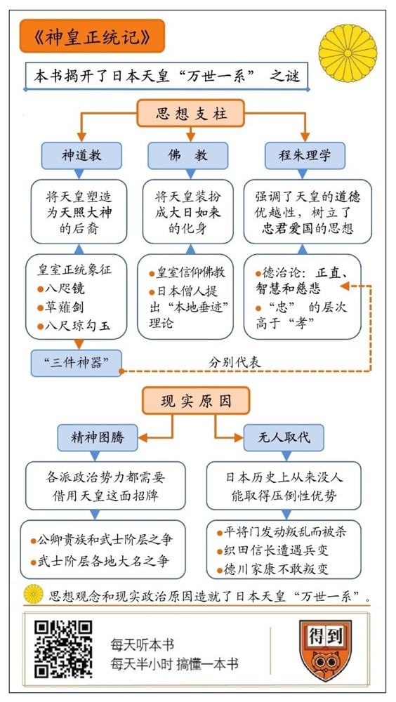

# 《神皇正统记》| 卞恒沁解读

## 关于作者

北畠亲房（1293-1354），日本南北朝时期公卿，日本后醍醐天皇的近侍亲信，曾拜在禅僧玄惠门下学习朱子学，终身致力于复兴皇室，终结武士专政。明治41年（1908年），被明治政府追赠正一位品秩。

## 关于本书

本书是北畠亲房撰写的讲述日本天皇传承谱系的历史著作。当时日本进入南北朝时期，公卿贵族拥立后村上天皇，建立南朝；武士阶层拥立光明天皇，建立北朝。北畠亲房写作此书的目的是“辨明正统”，指责武士阶层的僭越行为，论证南朝天皇才是正统所在。本书明确提出了日本天皇“万世一系”的理念，并分析了背后的思想支柱，因此具有重要历史价值。

## 核心内容

本书叙述了日本天皇的传承谱系，明确提出了日本是神国，天皇是神的后裔的理念。为了辨明日本天皇的正统所在，作者分析了天皇“万世一系”地位背后的主要思想支柱：神道教、佛教和程朱理学。同时，结合这本书的写作背景，我们还可以看出，导致日本天皇“万世一系”的现实政治原因究竟为何。

## 前言

你好，欢迎你每天听本书。

今天在我们的邻居日本，发生了一件大事，在位已有30年的平成天皇将举行退位仪式，日本即将迎来一位新的天皇。最近有很多朋友问我关于天皇的问题，我发现有一个词大家经常提到，叫作“万世一系”。意思是说，从上古时代一直到现在，日本天皇都是同一个家族的人。这在我们中国人看来，特别不可思议。因为在中国历史上，“皇帝轮流做，明年到我家”，这是再正常不过的了。那么日本天皇究竟为什么这么特殊，能够万世一系呢？

为了讲清楚这个问题，我选了一本书，就是今天要给你讲的这本《神皇正统记》。 “神皇”就是神灵和皇帝的结合体，这说的就是日本天皇。二战结束以前，日本天皇一直被看成是神。

这是日本的一本古籍，要想搞明白日本天皇是怎么回事，这本书是绕不过去的。书的作者名叫北畠亲房，他生于1293年，中国当时正处于元朝。北畠亲房生前是日本的一个贵族，他写作这本书的目的，是“辨明正统”，就是搞清楚日本天皇的正统究竟在哪边，究竟谁才是货真价实的天皇，谁才是冒牌货。

你可能会觉得好奇，难道当时还有两个天皇不成？你说对了，当时正处于日本历史上的南北朝时期，南朝和北朝各自拥立了一位天皇，相互对峙。这两位天皇都出自万世一系的皇族，血统上都具有合法性。但天皇只能有一个，到底谁才是正统呢？这本《神皇正统记》回顾了天皇皇位传承的历史，最后认为，南朝的天皇才是正统，北朝那位天皇是冒牌的。有意思的是，虽然南朝最后被北朝消灭了，但是在明治维新以后，明治天皇又重新追认了南朝天皇的正统地位。

时过境迁，哪个天皇拥有正统，已经不重要了。这本书真正的价值在于，它明确提出了“万世一系”的概念，并指出了日本天皇万世一系背后的思想支柱是什么。更重要的是，结合这本书的写作背景，还可以看出，日本天皇万世一系的现实原因又到底是什么。接下来我就从思想支柱和现实原因这两个角度，来为你解开日本天皇万世一系之谜。

## 第一部分

我们先来看思想支柱这个方面。日本天皇能够万世一系，这背后一定有着强大的思想力量在支撑。就好比欧洲国王喜欢说自己“君权神授”，给自己抹上一点神秘色彩，让自己的统治更稳固。日本天皇万世一系的背后，隐藏着三股力量，分别是神道教、佛教和中国的程朱理学。

今天这本书的一开头，就写了一句至关重要的话：“大日本者神国也，天祖肇开其基，日神统绪绵延（大日本トハ神國也。天祖ハジメテ基ヲヒラキ、日神ナガク統ヲ傳給フ）。”意思是说，日本是神建立的国度，日本天皇是太阳神，也就是天照大神的后裔。请注意，这句话揭示了日本天皇背后的第一股思想力量，也就是神道教信仰。

所谓神道教，是一种典型的多神教，它起源于日本的民间信仰。神道教的核心观念是“万物有灵”，海里面有海神，山上有山神，打雷是因为雷神，下雨是因为雨神。历史上的英雄人物，死后也被奉为神灵。日本甚至有八百万神的说法，一只狐狸、一把刀之类的，也能被当成神供起来。今天你如果去日本旅游，在各地都能看到大大小小的神社。很多神社里供奉的都是当地的守护神，这就是神道教最具体鲜活的体现。

你大概会说，我们中国也有类似的现象啊，很多地方都有山神、土地公什么的，这是不是跟神道教差不多呢？你说得没错，这两个还真差不多，都是民间的原始信仰。不过，神道教有一个鲜明的特色，那就是它具有强烈的政治性，和日本皇室的传承密切相关。

在神道教信仰中，有一个最高神，也就是天照大神（ あまてらすおおかみ）。天照大神到底是何方神圣呢？“天照”说的是太阳，天照大神就是太阳女神。为什么是女神呢？这其实是母系氏族时代的缩影。中国神话传说中的女娲，也是一位女神。在神道教的神话中，天照大神治理着天界，她派自己的孙子去治理天界。日本天皇的家族，就是从这里开始起源的。临别之前，天照大神赐给孙子三件宝贝，这就是日本历史上的“三件神器”。哪三件呢？分别被称作八咫镜、草薙剑和八尺琼勾玉。说得明白一点，就是一面镜子、一把剑和一块玉。这三件神器后来世代相传，成为日本皇室的信物。

你看，在神道教的信仰中，日本皇室是天照大神的后裔，三件神器则是这种神圣血统的象征。所以，神道教和日本皇室的神圣性是相互绑定的。在今天这本书里，作者北畠亲房就指出，虽然日本分为南北朝，但正统在南朝天皇这里，因为三件神器都在南朝。北朝天皇手上没有神器，那当然是冒牌货。不过请注意，神话毕竟是神话，三件神器也不会真的是神的信物，多半是日本社会早期某个氏族部落领袖打造出来的权力象征，并在上面附着了一层神秘色彩。尽管如此，神道教作为一种信仰，确实为日本天皇的神圣地位提供了思想上的支持。

说完神道教，我们再来看佛教。《神皇正统记》里面还提到，天皇能够万世一系，是因为获得了佛祖的庇佑。天皇和佛教又是怎么扯上关系的呢？

佛教大约是在公元6世纪中期传入日本的，那时候我们的隋朝已经快要建立了。佛教刚刚传入日本的时候，并没有引起太大波澜。这也很容易理解，神道教本来就是一套开放的多神信仰，佛祖也无非是一尊新的神。在当时的日本，佛被称为“蕃神”，就是外国的神。如果只是这样，那么佛教对日本的影响终归是有限的。但到了后来，佛教却对日本政治产生了巨大的影响，甚至有几任天皇都主动退位，选择出家为僧。如果你看过金庸小说《天龙八部》，应该记得，大理国的皇帝就有退位出家的习惯。日本天皇一度也跟他们差不多。那么佛教为什么会影响到日本的政治呢？这跟日本的地方豪强有关。

你可能听过豪强这个词，他们说白了就是地方上有钱有势的大地主。在日本的奈良时代，差不多是咱们的盛唐时期，天皇为了加强中央集权，开始限制地方豪强的土地兼并，对豪强的土地征收赋税，甚至直接没收豪强的土地，分给无地的农民。这时，地方豪强就想到一条对策。当时国家有这么一项规定，寺院的土地可以不用没收，而且可以不用向国家交税。于是一些豪强就把自己的土地捐给寺院，供养僧人，其实暗中仍然从这些土地上获取收益。为了证明自己信仰的虔诚，这些地方豪强还经常捐钱建造佛寺，举办法事。于是，佛教也就成为日本上流社会的普遍信仰，位于上流社会顶端的天皇，为了安抚豪强，巩固统治，最后也不得不跟着信仰佛教了。

同时，天皇信仰佛教，还有另一个重要原因。佛教是从中国传入日本的，和佛教一起传来的，还有中国的技术和文化。我们知道，日本为了引进古代中国的先进文明，曾经向中国派出大批留学生。比如著名的阿倍仲麻吕，他有个汉名叫“晁衡”，还和李白成了好朋友。其实当时担负起文化交流使命的除了留学生，还有不少僧人。比如高僧空海，他为日本带回了关于中国语言文字的大量资料，一些学者认为，日文的平假名就是空海根据汉字的草书发明出来的。还有一位高僧名叫圆尔辨圆，他在南宋时期来到中国，长期在临安一带学习佛法。后来他把茶树的种子带回了日本，日本的“茶道”就这么起源的。你看，僧人们在当时掌握了核心科技和先进文化，那天皇当然要尊崇佛教，重用僧人。

后来，日本的僧人们为了抬高佛教在日本的地位，还弄出一套理论，叫作“本地垂迹”。“垂迹”是一个佛教名词，意思是佛向世人展现出化身。这套理论认为，神道教里的那些神灵，都是佛在日本展现出的化身。佛的化身是千变万化的，所以神道教的神灵也就千姿百态了。这套理论把神道教纳入了佛教的轨道，还使佛教压过神道教一头。

佛教享有如此崇高的地位，天皇为了巩固统治，也不得不利用佛教。日本历史上有一位名叫慈圆的高僧，编造出这么一套说辞，说神道教的天照大神是佛教的大日如来在日本的化身，日本天皇和大日如来是一体的。这样，天皇就获得了佛教的加持。我在前面提到，某些天皇主动选择了退位出家，这可不是因为他们看破红尘，背后其实是一种政治谋略。当时天皇受到贵族和武士的威胁，就主动让位给儿子，避开锋芒。退位以后，他又以佛教领袖的名义，辅佐自己的儿子，其实仍然掌握实权，这时他又被称为“法皇”。比如日本历史上有一位著名的后白河法皇，就在出家以后，在朝廷上各种势力中间挑拨离间，维护自己的权力。

你看，神道教和佛教相互融合，共同塑造了天皇的神圣形象。这还不够，《神皇正统记》里面还借用了中国的儒家思想，尤其是宋朝以来的程朱理学，这在日语中被称为“朱子学”（しゅしがく）。作者提到这么一段话，三件神器被视为正统的象征，是因为它们代表了三种品德：剑代表智慧，玉代表慈悲，镜子代表正直。这段话看上去平平无奇，其实其中暗含了一个重要的思想，叫作“德治”，就是统治应该以道德为基础，天下归属于有德之人。这种德治论是儒家一贯的观点，在南宋的朱熹那里更是发展到了极致。朱熹认为，君王合法性的根源在于道德，君王拥有道德，才有资格进行统治。《神皇正统记》里指出，日本历史上那些安定的时期，都是因为天皇有德。那些混乱的时期，都是由于天皇无德。现在南朝的天皇有德，北方的天皇无德，所以南方才是正统。你看，这种说法显然是受到了朱熹的影响。

不过，朱熹为代表的儒家思想到了日本，却又发生了很大的变异。在今天这本书里，这体现得非常明显。在儒家的道德伦理中，“忠”和“孝”是两种最重要的价值。在中国这边，“孝”是更为根本的价值。儒家经典《孝经》里开篇就说“夫孝，德之本也。”意思是说，“孝”是一切道德的根本。我们常说的“百善孝为先”，就是这个意思。至于对君王的“忠”，其实是对孝的延伸。一个人对父母孝顺，对君王自然就忠心。但在《神皇正统记》中，作者却认为，对于天皇的“忠”才是第一位的，“孝”是从属于“忠”的。在作者眼里，所谓的“孝”，最多不过是辞官不做，回家尽孝。而对于天皇的忠，却是要不惜生命去完成的。相对于“孝”，“忠”的层次更高。

所以，《神皇正统记》虽然强调儒家的德治，但它的根本出发点仍然是强调效忠天皇，维护天皇的权力。日本儒学的这种倾向，在另一个故事里有更生动的体现。在17世纪，也就是中国明朝的时候，日本有一位叫山崎闇斋的儒学家，他是朱熹的信徒。有一次在讲学的时候，山崎闇斋问了一个惊世骇俗的问题：要是哪天明朝派孔子为大将，孟子为副将，率领军队来攻打我们日本，那我们这些成天学习孔孟之道的人，应该怎么办呢？弟子们都答不上来，山崎闇斋严厉地说，要是真有那么一天，我们都应该披挂上阵，擒拿孔孟，报效国家，才算是不违背孔孟之道啊！你看，山崎闇斋表达的显然不是中国儒学，而是日本化的儒学。这种儒学又是以对君王的“忠”为中心的。

总之，日本天皇万世一系的背后，有三股思想力量在加持：神道教、佛教和程朱理学。这三种思想的最大共识，就是维护天皇的神圣地位。不过，光是这些，还不能解释天皇为什么能够万世一系。中国历朝历代的皇帝身上，也有类似的思想在加持。比如《史记》里说，汉高祖刘邦的母亲曾经和蛟龙交合，才生下了刘邦，其实就是在说刘邦是蛟龙的后代，根本不是凡人，这和神道教的神话就很相似。再比如，女皇武则天登基的时候，就说自己是弥勒佛的转世，这借助的就是佛教的力量。再比如，明太祖朱元璋即位以后，就宣布以程朱理学为正统思想，还差点认朱熹做了祖宗，这也是在利用理学为自己服务。那问题就来了，日本天皇身上有的那些思想光环，中国皇帝身上经常也有。那为什么日本天皇能够万世一系，中国却经常是“皇帝轮流做”呢？这是因为日本天皇万世一系的背后除了思想上的加持，还有现实政治的原因。下面我就带你看看，这个现实原因到底是什么？

## 第二部分

这个原因可以归结为两句话：一来留着天皇对大家都有利，没必要推翻。二来日本历史上从来没人能取得压倒性的优势，可以取天皇而代之。

为什么说留着天皇对大家都有利呢？在日本历史上的大部分时间里，天皇的地位都跟欧洲的教皇差不多。我们知道，教皇是欧洲的宗教领袖。欧洲的那些诸侯们要登基为王，都需要教皇认定，并主持加冕。教皇一般也不参与诸侯们的争霸战争，所以诸侯们谁也不会动推翻教皇的心思。日本天皇也与此类似，他是神道教的领袖，号称是神的后裔，扮演着精神图腾的角色。日本列岛上的各大政治势力，为了获取合法性，都需要借用天皇这个图腾，也就没必要推翻天皇了。

那问题就来了，日本历史上究竟有哪些政治势力呢？这就要回到今天这本书的写作背景了。我在开头提到，这本书写于日本的南北朝时期。日本为什么会出现南北朝，还冒出来两个天皇呢？因为南朝和北朝背后存在不同的势力。南朝背后是公卿贵族，这在日本被称为“公家”。北朝背后是武士阶层，这被称为“武家”。

公家和武家为什么会不共戴天呢？这说来话长，我带你来回顾一下这段历史。日本天皇其实曾经也和中国皇帝一样，大权在握。在中国唐朝的时候，日本发生了一次改革，叫作“大化改新”，主要内容是学习唐朝的制度，建立以天皇为首的中央集权。这种政治体制维持了四百多年，终于出现了危机。当时朝廷上有不少公卿贵族，也就是“公家”。他们在地方上都拥有自己的庄园，实力逐渐膨胀，甚至可以架空天皇。中国的东晋时期也曾出现过“门阀政治”，皇帝要看门阀的脸色，日本当时的情况就和这个差不多。天皇当然不甘心受公家摆布，他决定找一个同盟，一起对付公家。当时公家的手下有一些看家护院的侍卫，这就是所谓的武士阶层。在日语里，武士是用一个汉字来表示的，那就是“侍卫”的“侍”，读作Samurai（さむらい），这是因为武士们本来就是给人当侍卫的。武士的身份一般又是世代相传的，父亲是武士，儿子还是武士，这些世代当武士的家族也就成为所谓的“武家”。

在当时的日本，公家生活奢侈，腐败堕落。武家却长期习武，生机勃勃。天皇觉得武家可以利用，于是就拉拢武家，一起对付公家。前面提到的后白河天皇，他就拉拢了当时的两大武士集团：一支叫源氏武士集团，就是《源氏物语》的那个源氏；另一支叫平氏武士集团。后白河天皇利用这两大集团，沉重打击了以藤原氏为首的公家势力。从此，武士阶层开始崛起。武士的领袖甚至设立了自己的权力机构，这就是所谓的“幕府”。幕府本来指的是将领们讨论军情的营帐，后来成为正式的政府机构。日本历史上的第一个幕府叫作“镰仓幕府”，建立者是源赖朝，也就是源氏武士集团的领袖。

不过，公家并不愿意自动退出历史舞台，他们与武家进行了长期的斗争。到了《神皇正统记》这本书写作的时代，双方进行了一次内战。内战的结果是，公家拥护原来的天皇逃到了奈良，建立了南朝。武家在京都拥立了一个新的天皇，建立了北朝。所以，日本的南北朝其实是公家和武家斗争下的结果。今天这本书的作者北畠亲房就属于公家，他站在公家的立场上，主张南朝才是正统，愤怒地指责武家扰乱朝政。你看，从这本书的创作背景，我们已经可以看出日本天皇“万世一系”的现实原因。公家和武家相持不下，双方都需要借用天皇这个招牌，于是天皇家族的地位自然也就长期延续了下来。

日本南北朝时期持续了56年就宣告结束，最后结局是北朝消灭了南朝，南朝天皇被迫将三件神器交给了北朝天皇。这也标志着武家最终赢得了对公家的胜利。当时武家的领袖名叫足利义满，也就是《聪明的一休》里面那个喜欢搞怪的足利将军。他统治下的幕府被称为“室町幕府”，这是日本历史上的第二个幕府。

你看，日本并不是没有改朝换代，只是更换的不是天皇，而是幕府将军。不过幕府将军和中国皇帝不同，他们并不能派遣官僚，对全国各地进行直接统治。在幕府统治下，日本只是获得了形式上的统一。各地还存在大大小小的武士家族，扮演着地头蛇的角色。这些家族一般被称为“大名”。大名为了争夺最高统治权，经常相互厮杀。最后的胜利者将接受天皇的册封，就任“征夷大将军”职位，开设幕府，进行统治。所以，天皇这时又成了各地大名们利用下的招牌，地位反而更稳固了。谁要是对天皇不敬，那各地大名就会群起而攻之。

比如在15世纪后期，也就是中国明朝的时候，室町幕府走向解体，日本开始进入赫赫有名的战国时代，各地大名们打成一团。一些著名的日本游戏，比如什么《战国无双》，《信长之野望》，《太阁立志传》啊，讲的都是这个时期的故事。某些大名翅膀硬了，就会惦记一件事，叫作“上洛”。这个词要解释一下，当时的日本人经常把天皇所在的京都称为“洛阳”，这也可以理解，日本人仰慕中华文化嘛。所谓“上洛”，就是大名率领军队开进京都，朝拜天皇，宣示自己的霸主地位。你看，获得天皇认可，才能成为霸主，那谁还敢对天皇不敬呢？中国历史上的“春秋五霸”，也要获得周天子的认可，才能成为霸主。日本天皇的地位也和周天子差不多。

那你大概要问了，周朝最后被秦朝给取代了啊，秦始皇成了新的天子，为什么日本历史上就没有出现过秦始皇这样的狠角色呢？这是因为在日本历史上，从来没人能取得秦始皇这样的压倒性优势。制造秦始皇是一个漫长的过程，需要很复杂的历史条件。从商鞅变法开始，秦国内部不断集权化，结果就是秦王大权独揽，不用看贵族的脸色。秦始皇统一天下以后，又把这种秩序推向全国，消灭了大大小小的贵族和地头蛇。秦始皇能够取代周天子，归根到底是因为他取得了这种压倒性的优势。

但是在日本历史上，从来没人能成为秦始皇。请注意，日本历史上其实有人动过取代天皇的心思。比如在公元940年，也就是中国的五代时期，日本有一个叫平将门的人，发动了叛乱。这个人比较猛，他公然自称“新皇”，也就是新的天皇。日本天皇这时就发出号召，让地方豪强们都起来打倒平将门，谁能取得平将门的首级，谁就可以破格成为贵族。结果，平将门就陷入地方豪强的围攻，最后被杀死了。你看，平将门造反失败，归根到底是因为没能摆平地方豪强，没能取得压倒性的力量优势。

我再给你说一个更有名的人，日本战国时代后期出现了一位霸主，那就是大名鼎鼎的织田信长。这个人狂放不羁，很有魅力。他打败了各路诸侯，成为日本实力最强的大名。当时天皇主动提出，要封他做“征夷大将军”，可织田信长居然拒绝了。一些日本历史学家推测，织田信长这是不肯做天皇的臣子，他恐怕已经动了取代天皇的心思。可是，不久以后，织田信长就在京都的本能寺遭遇了兵变，最后自杀了。兵变的发动者是织田信长的家臣明智光秀。明智光秀为什么要杀死织田信长呢？历史学家又推测，天皇感到了来自织田信长的威胁，就暗中联系明智光秀，让他取代织田信长的地位。后来的历史似乎也印证了这一点，明智光秀干掉织田信长以后，马上获得了天皇的认可，官拜征夷大将军。可惜才过了十二天，织田信长的另一位家臣丰臣秀吉就打败了明智光秀。丰臣秀吉短暂地统一了日本，在他死后，日本又一度陷入内战，最后德川家康胜出，建立了江户幕府。德川家康虽然成了日本最有权力的人，但他还是不敢把天皇怎么样，毕竟天皇的神圣地位已经深入人心，而且当时日本国内还有一些大名，只是表面上臣服于德川家康，暗地里其实各怀鬼胎。比如在日本西南部的九州地区，就有几家大名，和江户幕府貌合神离。260多年后，这些大名成为推翻江户幕府的主力。江户时代结束以后，日本进入了明治维新的时代，建立起以天皇为首的中央集权体制。

总之，日本天皇能够万世一系，背后有着很现实的原因：一是日本的各派政治势力都需要借用天皇这面招牌。二是日本历史上从来没人能取得压倒性优势，取天皇而代之。于是天皇家族就作为宗教领袖和精神象征，长期延续了下来。甚至在第二次世界大战结束以后，美国占领军也意识到，只有保留天皇这个精神图腾，日本才不会发生内乱。在今天的日本，天皇虽然没有实权，但很有存在感。每逢重要节日，天皇都要出来露个脸，与民同乐一番。日本天皇的万世一系看似是历史的奇迹，但我们知道了背后的原因之后，又会发现一切都顺理成章。

## 总结

好的，今天这本书就为你讲到这里，下面总结一下今天的知识点。

日本天皇能够万世一系，背后既有思想观念上的原因，又有现实政治中的原因。就思想观念来说，日本天皇背后有三股思想力量在加持：神道教、佛教和程朱理学。神道教将天皇塑造为天照大神的后裔，佛教将天皇装扮成大日如来的化身。日本化的程朱理学则强调了天皇的道德优越性，同时树立了忠君爱国的思想。

就现实政治来说，日本历史上一直存在各派政治势力的争斗。先是公卿贵族和武士阶层的争斗，后是武士阶层内部各地大名之间的争斗。任何一方要想取胜，都需要借助天皇这面招牌。同时，任何一方都不能像中国的秦始皇那样，取得压倒性的优势，然后取天皇而代之。所以，天皇家族也就得以万世一系了。

撰稿：卞恒沁

脑图：摩西脑图工作室

转述：金北平