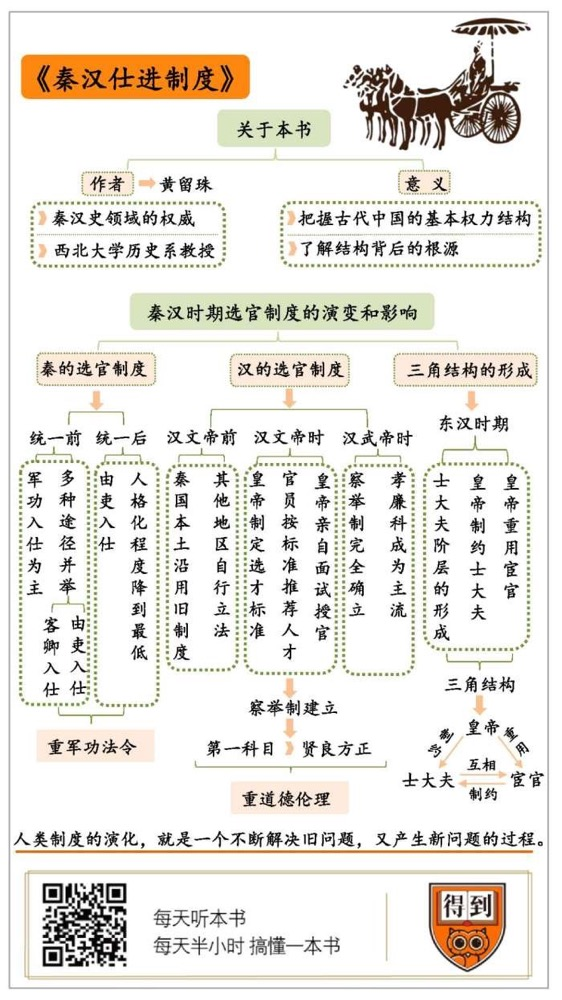

# 《秦汉仕进制度》| 卞恒沁解读

## 关于作者

黄留珠，西北大学历史系教授，博士生导师，曾任中国秦汉史研究会副会长。主要研究秦汉思想文化、中国古代政治制度史等。代表作包括《秦汉仕进制度》《中国古代选官制度述略》等。

## 关于本书

本书是黄留珠先生的代表作，对秦汉时期的选官制度进行了全面而详尽的论述。秦汉时期是大一统国家的奠基阶段，这一时期的选官制度对于了解传统中国政治的基本特征，把握行政管理的基本规律，具有深刻的借鉴意义。

## 核心内容

秦国在统一天下的主要选官途径是“军功入仕”，在统一以后，由吏入仕逐渐成为主流，要求官员忠实执行法令。这导致官员认法不认人，秦朝的灭亡也与此有关。为了解决秦朝遗留的问题，汉代开创了并完善了察举制，但这又导致官员获得了地方势力的支持。皇帝为了制约士大夫，经常拉上宦官做帮手，“皇帝—宦官—士大夫”的权力大三角也就成型了，这成为中国古代政治的基本权力结构。

## 前言

你好，欢迎每天听本书。今天给你讲的这本书叫《秦汉仕进制度》。

这个“仕进”需要解释一下，“仕”就是士大夫的“士”旁边加个单人旁，“学而优则仕”的那个仕；“进”就是进步的进，“仕进”就是出来做官的意思。仕进制度就是选拔读书人出来做官的制度，所以它还有个名称，叫“选官制度”。顾名思义，这本书讲的是秦汉时期的中国是怎样选拔官员的。为什么要把秦汉两朝合在一起讲呢？因为汉朝的选官制度对秦朝有一定的继承，又做出了很多创新。

了解秦汉的选官制度，可以帮助我们理解一个现象，那就是古代中国的宦官经常发挥很大的作用。我们有时会在影视剧中看到宦官和士大夫之间的矛盾，比如徐克的电影《新龙门客栈》里面，一上来的情节就是明朝东厂的太监在迫害大臣。其实，这种现象的背后，隐藏着古代中国的一个基本权力结构，也就是皇帝、宦官和士大夫相互制衡的大三角。那这个大三角是怎样形成的呢？这就要一直追溯到秦汉时期的选官制度。

秦朝是中国历史上的第一个大一统王朝，但秦国创立的选官制度，却成为秦朝灭亡的原因之一。汉朝为了解决秦朝遗留下来的问题，创造了新的选官制度，这套制度在当时运行得很成功，但留下了一个后遗症。为了解决这个后遗症，皇帝不得不拉上宦官做帮手，前面说的大三角结构也就出现了。所以，今天这本书可以让你迅速把握古代中国的基本权力结构，还可以帮你了解这种结构背后的根源。

《秦汉仕进制度》这本书是研究秦汉选官制度的开山之作，也是经典之作。作者是黄留珠先生，他是我国秦汉史领域的权威，长期担任西北大学历史系教授。黄先生的这本书出版以后，几乎所有研究秦汉选官制度的学者，都会在论文里引用这本书。今天我就从三个方面，来为你讲讲秦汉时期选官制度的演变和影响：第一，秦朝的选官制度是怎样的，这套制度和秦朝的灭亡又有什么关系？第二，汉朝为了解决秦朝遗留的问题，又创造了怎样的选官制度？第三，汉朝创造的选官制度，为什么会推动皇帝、宦官和士大夫大三角结构的形成？

## 第一部分

我们先来看秦朝的选官制度。我们都知道，秦朝的前身是战国七雄中的秦国，所以要讲秦朝的事情，需要先从秦国讲起。战国时期著名的思想家荀子曾经去秦国游览，记录下了在秦国的见闻。在他的笔下，秦国的官僚们做事严谨负责、公私分明，可见，秦国的选官制度在当时是很成功的。那么，秦国到底建立了一套怎样的选官制度呢？这套制度可以用一句话概括：军功入仕为主，多种途径并举。

所谓军功入仕，就是凭借军功出来做官。这个制度是在商鞅变法时期建立的。在变法以前，秦国和其他诸侯国一样，贵族世代为官，这样显然不公平，而且贵族的势力强大，也不利于国君的统治。于是商鞅就规定，在作战中砍下敌人的头颅，就可以获得爵位。这个规定出台以后，秦军士兵作战异常英勇，在战场上经常出现这样的景象：秦军士兵杀死敌人以后，就砍下敌人的首级，系在自己腰间作为战利品，然后继续投入战斗。秦军的勇猛让山东六国深感畏惧，秦国于是被称为“虎狼之国”。

除了军功入仕，当时的秦国还存在一些其他的做官途径，比如“客卿入仕”。“客卿”是秦国专为外来人才设置的官职。秦国的位置比较偏僻，文化教育也长期比较落后，所以秦国政府特别重视招揽外来人才。秦穆公时期有一位著名的大臣名叫百里奚，被称为“五羊皮大夫”，他本来是晋国陪嫁的奴隶，中途不堪受辱，逃到楚国，帮楚人放牛。秦穆公听说他很有本领，就用五张羊皮的价格，从楚人手上把他赎了出来，任命他做了秦国的大夫。在百里奚的辅佐下，秦国开始了崛起的进程，秦穆公也成为春秋五霸之一。

不过，在百里奚生活的时代，秦国虽然重视外来人才，但并没有建立相关的制度。商鞅变法以后，秦国才建立了“客卿”制度，外来人才可以先在秦国做客卿，等到为秦国立下了功劳，就可能被委以更重要的官职。

战国时期著名的纵横家张仪，就曾在秦国担任客卿。后来他帮助秦国制定了“连横”政策，还利用外交手段，帮秦国获得了不少土地，于是被拜为秦国的国相。协助秦始皇统一天下的丞相李斯，原本是楚国的小官吏，后来也来到秦国担任客卿。当时还出了一件事，韩国派遣了一个叫郑国的间谍，到秦国来修建灌溉水渠，表面上是帮助秦国发展水利，其实是想耗费秦国的国力，让秦国顾不上攻打韩国。后来，这个阴谋被秦王政，也就是后来的秦始皇发觉了。秦王政非常愤怒，就下令驱逐国内的所有客卿。李斯当时也在要被驱逐的名单上，他就给秦始皇写了一篇上书，这篇文章很有名，叫作《谏逐客书》。大意是秦国之所以强大，就在于能够吸收各国的人才，现在要驱逐客卿，这对秦国是极为不利的。秦王政看到了这篇上书，立刻冷静下来，撤回了驱逐客卿的命令，李斯也因此受到秦王政的赏识，走上了人生的快车道。

除了客卿入仕，秦国还有一个重要的选官途径，叫作“由吏入仕”。就是先当一个小吏，然后再做官。官、吏这两个字经常并称，其实官和吏是不一样的，官是有级别的，吏却没有级别，属于官府里面的底层办事人员。不过在秦国，“吏”这个群体却很受重视，因为秦国自从商鞅变法以来，就实行严格的法治，所有事情都要依据法律来决断，迫切需求通晓法令的人才。“吏”这个群体对法令很熟悉，平时很多法令都需要他们去解释和推行，所以秦国就对吏这个群体大开方便之门，允许他们通过一定的程序当上官。

既然是先当吏，再当官，那要怎样才能当上吏呢？可以通过推选的途径。推选是指地方官员向国家推荐人才，人才要满足一定的标准：年龄要超过三十岁，平时在地方上口碑不错，家里也要有点底子，太穷也不行。要是觉得推选的要求比较高，那也可以通过考试。秦国在地方上设置了学校，学校里主要教学童认字，学童年满十七岁以后就可以参加考试，考试主要考认字和书写，通过以后也能当上一个小吏。

当上了吏，要怎么才能当上官呢？主要的途径是“考课”，相当于我们今天说的业绩考核。当时每到年末，县里的小吏就要统计本县今年的新增人口、新开垦的土地、财政收支，以及治安状况，报到县衙，由县里统一报到郡里。郡里根据材料加以考核，发现有业绩表现一贯优秀的，就会上报国家，把他提拔成正式官员。

刚才说的这些都是秦国在统一天下以前的选官制度。秦始皇建立了秦朝以后，又改革了选官制度。这也是必然的，你想啊，天下统一了，不需要打仗了，军功入仕当然就行不通了。天下都是一家了，也就没有了本土人才和外来人才之分，客卿制度也没有存在的必要了。况且，秦朝担负着创造新世界的使命，秦始皇统一天下以后，就开始着手统一文字、货币和度量衡，建立联系全国各地的交通网络，巩固来之不易的大一统。然而，要完成这件前无古人的事业，需要付出一定的代价。这个代价就是：秦朝把制度中的人格化程度降到了最低，这又和秦朝的灭亡有密切关系。

所谓“人格化程度”，就是允许个人发挥多大的主观能动性。苏东坡曾经对秦朝提出了很尖锐的批评，他说秦始皇不重视人才，只重视法令。官吏不必有什么才能，只要能忠实执行法令就可以了。这个批评很有道理，秦朝官员确实只会机械地执行命令，就好像机器上的零件一样。对秦始皇来说，这种制度设计是很有必要的，因为他要在短时间内完成许多前无古人的事业，这时容不得太多争论。如果争论来争论去，很多事情就执行不下去了。

秦朝刚建立的时候，朝廷上就发生了一场大争论。儒家大学者淳于越反对在全国实行郡县制，要求恢复周朝的分封制。而且他认为，秦始皇要多听读书人的意见，不要一意孤行。丞相李斯却认为，读书人议论国事，这会干扰国家的行政，破坏秦朝的统一大业。于是秦始皇在李斯的建议下，下令焚毁诸子百家的著作，只保留医药、占卜、种树之类的实用性书籍。百姓能够学习的最重要的知识，就是秦朝的法令。想要学习法令，就要拜官吏为师。这个政策就叫“以法为教，以吏为师”。法令在文化教育中占据了统治地位，自然也会在选官途径中占据主导。前面提到的“由吏入仕”这时就变成了选官制度的主流。

但是，这种制度中潜伏着巨大的危险。官员在行政中认法不认人，缺乏人情味，这就容易造成底层民众的反抗。陈胜、吴广在大泽乡发动起义，就是因为他们耽误了去戍守边疆的日期，按秦朝法律是要杀头的。而且陈胜、吴广心里清楚，秦朝法律丝毫不讲情面，逃跑也是死，造反也是死，还不如造反，或许还有一线生机。于是陈胜吴广振臂一呼，天下响应，秦朝就这样土崩瓦解了。这背后反映的问题是，在那个交通和通讯技术还不发达的时代，光靠刻板的法律来进行自上而下的统治，这是行不通的。因为当时的国家无法及时有效地掌握民意，如果法律规定不合理，国家也无法及时修改。这时，官员如果强制执行法律，就可能激发民变。

## 第二部分

好的，关于秦朝的选官制度，我就为你讲到这里，下面我们再来聊聊汉朝。

秦朝灭亡以后，类似的问题又留给了汉朝。汉朝初期基本继承了秦朝的主要制度，也这叫“汉承秦制”，所以当时汉朝的选官制度也和秦朝差不多。那汉朝为什么不像秦朝那么短命呢？因为汉朝初期实行了一种权宜之计，在全国各地实行不同的法律。在原先秦国的本土，也就是关中和巴蜀地区由中央政府直接管辖，继续沿用秦朝留下的法律。其他地区分封给姓刘的诸侯王，他们在各自的封国内部，可以根据当地风俗来自行立法。

这套制度比较有弹性，避免了汉朝重蹈秦朝的覆辙。但这是以降低国家的统一程度为代价的，终究不是长久之计。汉文帝即位以后，开始着手改革选官制度。他在公元前178年下了一道诏书，要求政府官员向中央推荐品德高尚，又敢于向皇帝提意见的人才。到了公元前165年，汉文帝又下了一道类似的诏书，而且还亲自对各地推荐来的人才进行面试。这次获得推荐的有一百多人，其中有一个人在面试中表现特别出色，于是直接被任命为中大夫。这个人就是汉朝的名臣晁错。就是这个晁错，后来建议汉景帝颁布削藩的命令，打击地方诸侯王的势力，于是诸侯王起兵造反，爆发了著名的“七国之乱”。

可见，在汉文帝时期，已经产生了一种新型的选官制度，这个制度包括以下三个步骤：首先是皇帝下诏书，制定选择人才的标准；接着就是政府官员按照标准，向皇帝推荐人才；最后皇帝亲自对推荐过来的人才进行面试，根据他们的表现授予不同的官职。这套制度就是后世所谓的“察举制”。察举制下，针对不同领域的人才，制定了不同的选人标准，这些标准就形成了各种“科目”。汉文帝要找的都是人品正直，敢于向皇帝提意见的人才，这个标准就变成了察举制的第一个科目，叫作“贤良方正”，就是品德高尚，又敢于提意见的人。你看，这个标准刚好和秦朝对官员的要求是反的。秦朝要的是纯粹的办事机器，汉朝却开始注意适度发挥官员的主观意志。而且，一个人能够被推荐上来，说明他在地方上很有道德声望。一个拥有道德声望的人，做官以后也更可能受到百姓的欢迎。

察举制的完全确立，是在汉武帝的时候。因为察举制当中最重要的科目“孝廉科”是在汉武帝在位期间确立的。“孝”就是孝顺父母，“廉”就是清廉正直。公元前134年，汉武帝在儒家大学者董仲舒的建议下，颁发了一道诏书，命令全国各郡的地方长官都要向朝廷推举孝廉两人，所谓的“举孝廉”就这样开始了。孝廉是察举制当中最重要的一个科目，因为“举孝廉”是定期的，每年都会进行一次，这说明察举制已经成为一项正式的制度。

除了“贤良方正”和“孝廉”以外，察举制在当时还发展出了一些其他科目，有的科目是选拔某些领域的专门人才。比如“明法”科，选拔的是熟知法律的人才；“廉吏”科，选拔的是地方官吏当中有功劳的人。各种科目相互配合，察举制度也就得到了完善。

“孝廉”这个科目自从诞生以来，就一直是察举制的主流。这背后其实反映了儒家思想地位的上升。儒家最看重的品德就是“孝”，儒家经典《孝经》开篇就说“孝，德之本也”。意思是说，孝顺父母是道德的根本，一个人如果孝顺父母，就很少会去做坏事。汉朝皇帝实行“以孝治天下”的国策，注意在社会上弘扬孝道，甚至皇帝的谥号前面，也要加个“孝”字。比如汉武帝的谥号就是“孝武皇帝”。

察举制度确立以后，汉朝终于解决了秦朝留下的问题。察举制度一直延续到魏晋南北朝时期，有许多著名的大臣都是通过举孝廉走上了仕途。《三国演义》中有一个精彩片段叫“武乡侯骂死王朗”，诸葛亮舌战王朗，上来一句话就掀了王朗的老底：“你世居东海之滨，初举孝廉入仕。”意思是你世代居住在东海旁边，当初是通过举孝廉，才成为了汉朝的大臣。言下之意是说，你原本是汉朝的臣子，却背叛了汉朝，投靠了曹魏。这一段是小说家虚构的，不过历史上的王朗确实曾经被举为孝廉。其实，许多我们熟悉的人物，比如曹操、孙权、袁术、公孙瓒，都曾有举孝廉的经历。甚至到了明清时期，科举制已经实行了很久，民间仍然习惯性地把举人称为“孝廉”，这就是察举制在语言中留下的痕迹。

察举制的出现不仅是选官制度上的改革，也标志着古代中国的统治策略发生了变化。秦朝的选官制度重视军功、重视法令，汉朝建立的察举制却更重视道德和伦理。这说明统治者开始有意识地利用道德力量来为自身服务，这种道德力量的代表就是儒家，儒家士人也逐渐成为政治舞台上的主要角色。

不过，察举制在东汉逐渐发生了变异。东汉是一个豪族社会，所谓豪族，就是拥有很大社会势力的家族，当时全国各地都分布着豪族势力。你想啊，在察举制中，谁更容易获得官员的推荐呢？当然是有钱有势的人。而且对于官员来说，推荐豪族的子弟，也就跟豪族交上了朋友，对自己也有好处。

所以，到了东汉中期以后，察举制就渐渐被豪族把持，越来越不公平了。当时有一首民谣是这么唱的：“举秀才，不知书；举孝廉，父别居。”意思是说，察举上来的秀才，根本没学问；察举上来的孝廉，却连父亲都不肯赡养。到了魏晋时期，豪族世代为官，也就成为所谓的“士族”，察举制度发展成了“九品中正制”。九品中正制规定，在地方上的州郡设置一个“中正”，中正根据家世、德行等标准，给当地的士人确定等级。当时把人才分为九个等级，中正负责确定某个人才属于哪一等。担任中正的一般是地方的士族，他们在评定等级的时候当然也会偏向士族的子弟。更何况，“家世”在九品中正制中已经成为评价人才的公开标准，士族操纵选官的现象也就被合法化了。所以，在九品中正制下，出现了“上品无寒门，下品无士族”的局面。九品中正制是察举制的变异，也是察举制走向衰落的标志。到了隋唐时期，察举制就逐渐被更为公平的科举制取代了。

好的，到这里我已经为你讲完了汉朝在选官制度上的创新和突破，也就是察举制的产生和发展。察举制实行自下而上的推选，看重官员的道德品质，这解决了秦朝选官制度遗留的问题，那就是只重视自上而下的控制，官员不讲人情味。但是，汉朝的选官制度也引发了新的问题，那就是官员背后拥有地方势力，威胁到皇权的统治。皇帝为了解决这个问题，又开始寻找新的对策，这就回到了本期音频开头提出的那个问题，汉朝确立的选官制度，为什么会推动皇帝、宦官和士大夫大三角结构的形成？

## 第三部分

前面我们讲到，汉朝的察举制中规定，地方长官要向中央推荐人才。全国那么多地方，每年各地推荐多少人上来，这个你得一碗水端平吧？汉武帝当年强制规定，全国各郡的行政长官必须每年推举孝廉两人。可问题是，各地经济发展和人口增长并不均衡，这样搞平均主义，显然是不公平的。自从这个制度实行以来，就开始有人抱怨。到了东汉第四位皇帝汉和帝在位期间，这个问题已经非常突出了。当时全国比较大的郡，人口多达百万以上，小郡不过几万人。终于在大臣们的建议下，汉和帝下令，按照各郡人口来确定举孝廉的名额。人口不满二十万的郡，两年举一个孝廉；二十万人以上，一年一个；四十万人以上，一年两个，依次类推。如果是拥有百万人口的大郡，一年就可以举五个孝廉。一个人即使才华出众，要是他生在一个人口不满二十万人的小郡，那要每隔两年才能等到一次举孝廉的机会。

这里面可大有学问，暗含了一个重要的问题，叫作“代表性”。中央政府要想控制全国，就要从全国各地选拔官员，让他们代表地方说话，担任中央联系地方的纽带。对于中国这样一个大国来说，官员的代表性，那可是事关国家统一的大事。不过，重视官员的代表性，造成了一个严重的问题，那就是朝廷上的官员们往往在地方上都有自己的势力，有时连皇帝也不敢得罪他们。尤其是在地方豪族的势力崛起以后，朝廷官员事实上就成了豪族的代表。这种现象在东汉表现得尤其明显。东汉的光武帝刘秀就是在豪族的支持之下，才建立了政权。所以，东汉从建国之初就确立了皇权与豪族共治的传统。朝廷上的官员很多都有豪族背景，这些官员在朝廷上做官，在地方上也有自己的家族势力，一个上通下达的“士大夫”阶层也就形成了。一些士大夫家族甚至可以长期占据高位，比如东汉末年的袁绍，家里号称“四世三公”，就是连续四代人都位列三公，可见他们的政治势力有多大了。

士大夫势力膨胀，皇权就受到了威胁，于是皇帝就给自己找了一个帮手，也就是宦官。宦官成天住在宫里，背后没有地方势力做后盾，也就只能听命于皇帝。所以，士大夫经常说自己“以国为家”，这其实最多只是一种情怀，士大夫很多都有家族势力，怎么可能以国为家呢？真正以国为家的其实是宦官，他们没有家族势力，只能做皇权的寄生虫。于是，东汉的宦官就经常在皇帝的授意下，和士大夫发生冲突。

汉桓帝在位时期，宦官的势力很大，朝廷上的士大夫对宦官很不满，就集体上书，抨击宦官。宦官们骗取了桓帝的支持，对士大夫进行大规模迫害，这就是著名的“党锢之祸”。党锢的意思就是把士大夫一党都禁锢起来。党锢之祸发生以后，士大夫对汉朝离心离德，埋下了东汉灭亡的祸根。有的士大夫甚至还编造了一个预言，叫“汉行气尽，黄家当兴”。这里的“汉行气尽”就是汉朝气数已尽，“黄家当兴”的“黄”是黄色的黄，意思是以黄色为标志的势力即将崛起。

为什么是黄色呢？因为黄色在五行中代表土。当时习惯用五行相生来解释王朝兴亡，东汉对应的五行是火，所以又叫“炎汉”，炎就是两个火嘛。在五行中，火可以生土，因为火烧出来的草木灰那就是土嘛。所以“汉行气尽，黄家当兴”就是利用五行相生理论，诅咒东汉王朝快点灭亡。一些历史学家指出，这两句话和黄巾起义的口号“苍天已死，黄天当立”非常相似，黄巾起义很可能不是纯粹的农民起义，农民其实是受到了士大夫的挑唆才造反的。

你看，汉朝确立的选官制度，特别重视官员的代表性，这是治理大一统帝国的必然要求，但也导致朝廷的士大夫背后总会存在一定的地方势力，皇帝就要经常需要重用宦官，对他们进行制衡。

在中国历史上，有所谓“三次宦官专权时代”的说法。第一次就是刚才说的东汉末年。第二次宦官专权时代是唐代后期，当时地方士族的势力很强大，成为士大夫的主要来源。士大夫仗着自己有地方势力撑腰，对皇帝若即若离。公元783年，也就是唐德宗在位期间，军队因为不满朝廷的赏赐，发生了哗变。叛军攻陷了长安，唐德宗仓皇逃跑。在这场叛乱中，士大夫纷纷逃跑，有的甚至还投降了叛军。反倒是宦官一直守在唐德宗身边，让他很感动。于是在叛军被平定以后，唐德宗大肆重用宦官，甚至把保卫皇帝的神策军交给宦官掌控。宦官掌握了神策军，也就掌握了皇帝的生死，甚至可以反过来威胁皇权。后来在唐敬宗在位期间，宦官甚至发动政变，把唐敬宗给杀了，另立新君，也就是唐文帝。唐文帝不甘心受宦官的操纵，就暗地里联合士大夫，准备通过政变把宦官一网打尽。结果计划泄露，政变失败，宦官们在长安城中大肆屠杀士大夫，光是受到株连的就有一千多人。你看，在皇帝、宦官和士大夫的大三角关系中，皇帝也不是只会联合宦官对付士大夫。如果宦官的势力大了，皇帝也会反过来，联合士大夫对付宦官。

第三次宦官专权时代是明代晚期，也就是电影《新龙门客栈》故事发生的背景。当时以东林党为代表的江南士绅开始崛起，于是以魏忠贤为代表的宦官势力也逐渐抬头，双方打得你死我活。所以，中国历史上的宦官，很少有名声好的，因为他们对士大夫而言，是不共戴天的仇人，而史书偏偏又都是由士大夫来写的。皇帝、士大夫和宦官，形成了一个相互制衡的大三角，这就是中国古代政治的基本权力结构。

## 总结

这本书就为你讲到这里，下面总结一下今天的知识点。

第一，秦国在统一天下以前，实行军功入仕为主，多种选官途径并存的制度。在统一天下以后，由吏入仕逐渐成为主流。精通法令，能够忠实执行命令，成为选官最重要的标准。这导致官员在行政中认法不认人，缺乏人情味，秦朝的灭亡和这一点有密切的联系。

第二，为了解决秦朝选官制度的问题，汉文帝开创了察举制。汉武帝又创立了一年一度的举孝廉制度，察举制于是走向了成熟。察举制在东汉时期逐渐被豪族把持，在魏晋时期发展成了九品中正制，这标志着察举制的变异和衰落。

第三，汉朝创立的察举制又导致官员和地方势力相结合，成为一个上通下达的士大夫阶层。皇帝为了制约士大夫，经常拉上宦官做帮手，“皇帝—宦官—士大夫”的权力大三角也就成型了，这成为中国古代政治的基本权力结构。中国历史上的三次宦官专权时代，也就是东汉末年、唐朝后期和明朝晚期，背后都是这个权力大三角在起作用。

你看，汉朝为了解决秦朝的问题，创立了察举制。察举制虽然解决了旧问题，又产生了新问题，留待后人去解决。人类制度的演化，就是这样一个不断解决旧问题，又产生新问题的过程。

撰稿：卞恒沁

脑图：摩西脑图工作室

转述：李璐