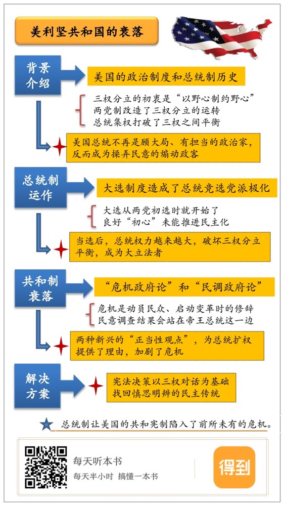

# 《美利坚共和国的衰落》|《读书》杂志社解读

## 关于作者

布鲁斯·阿克曼，美国当代杰出的宪法学家与政治理论家。1987年，44岁的阿克曼受聘为耶鲁大学最高级别的斯特林讲席教授，是近半个世纪以来最年轻的一个。阿克曼在政治理论、美国宪政与比较宪法领域内均有卓越的原创学术贡献。他的代表作品《我们人民》多卷本，被认为是“过去半个世纪在整个宪法理论领域内所进行的最重要的工程”。2010年，阿克曼因《美利坚共和国的衰落》的出版而入选《外交政策》评选的全球百大思想家。

## 关于本书

作者发展了施莱辛格的“帝王总统论”，认为美国总统在过去半个世纪已经成为美国宪制内最危险的分支，水门事件、伊朗门事件和反恐战争只不过是更深层病理的症候而已。阿克曼梳理了总统初选的兴起、民调专家和“媒体化妆师”的角色，还有白宫“沙皇”的集权、军队的政治化，这些变化造成了宪法的危机。

## 核心内容

这本书讲了三部分内容。第一部分是讲美国总统不断扩大权力的历史，探讨了一个问题，为什么美国总统不再是顾大局、有担当的政治家，反而成为了操弄民意的煽动政客。在特朗普入主白宫的新时代回头看，我们无法不敬佩阿克曼在2010年的先见之明。第二部分讨论的是宪法正当性的观念。阿克曼敏锐地提出两种新兴的正当性观点，分别名之为“危机政府”和“民调政府”，前一种观念让总统借着反恐战争的名义扩大自己的权力，后一种观念让总统用民众情绪一时的波动，取代了人民在深思熟虑后做出的理性判断。在第三部分里，阿特曼希望在还没有为时晚矣的时候，能找到行之有效的药方。

## 前言

你好，欢迎每天听本书。今天为你解读的是一本讨论美国宪法的著作，《美利坚共和国的衰落》。我先解释一下这本书的题目，作者所说的不是美国在综合国力上的衰落，不是说美国走上了下坡路，他说的是“共和国”这种政治传统的衰落。自从美国建国以来，共和政治持续了两个世纪，它的两大支柱是理性政治和法治，现在这两个支柱已经摇摇欲坠，共和政治还能存续多久，这才是作者内心深处的忧与思，他认为是总统制让美国的共和宪制陷入了前所未有的危机。

这本书的作者布鲁斯·阿克曼教授，是美国当代最杰出的宪法学家，出生于1943年。1987年，44岁的阿克曼受聘为耶鲁大学最高级别的斯特林讲席教授，是近半个世纪以来最年轻的一个。阿克曼研究美国宪法的历史有40多年，在他的理论中，总统的宪法领导权是人民民主在美国宪法内的制度保障，而在这本2010年的新书《美利坚共和国的衰落》里，阿克曼却将批判的手术刀对准了总统制，认为正是总统制威胁到了美国的共和制度。这个观点，正是基于他几十年来对美国政治和宪法的深入研究。

这本书是阿克曼在普林斯顿大学的讲稿。因为这本书，阿克曼在当年入选了《外交政策》杂志的年度全球百位思想家，致敬语是他“敲响了美国激进主义的警钟”。书篇幅不大，哈佛原版的正文只有188页，但注释长达70页之厚，因为阿克曼必须要为他的惊人之论做出令人信服的论证。毕竟，在美国这样一个被宪法凝聚起来的政治共同体里面，将建国宪法请下神坛，甚至要打破宪法这尊偶像，所需的不能只是无知者无畏的胆量——唯有艺高者才能胆大。

这本书分三部分。第一部分是讲美国总统不断扩大权力的历史，探讨了一个问题：为什么美国总统不再是顾大局、有担当的政治家，反而成为了操弄民意的煽动政客。在特朗普入主白宫的新时代回头看，我们无法不敬佩阿克曼在2010年的先见之明。第二部分讨论的是宪法正当性的观念。阿克曼敏锐地提出两种新兴的正当性观点，分别名之为“危机政府”和“民调政府”，前一种观念让总统借着反恐战争的名义扩大自己的权力，后一种观念，让总统用民众情绪一时的波动，取代了人民在深思熟虑后做出的理性判断。在第三部分里，阿特曼希望在还没有为时晚矣的时候，能找到行之有效的药方。

接下来的讲述，我会围绕着总统政治的实践，而不是总统研究的理论，给你分享这本书的三个要点：首先，我会先做一个背景介绍，简单说一下美国的政治制度和总统制的历史；然后，我们讨论一下美国总统制度，重点给你讲明白，总统制在现实政治中的运转和机制，以及它有什么问题；最后，我们说说今天美国政治中危机政府和民调政府这两种论调，以及阿克曼是怎么把美国宪法请下神坛的。

## 第一部分

下面，我先来做个背景介绍。美国是一个三权分立的国家，立法、行政和司法三权分别由国会、总统和联邦法院行使。按照立宪者的设想，三种权力相互制约，彼此平衡，这种分权理念就是《联邦党人文集》所讲的“以野心来制约野心”。上述三权中，掌握司法权的最高法院被认为是“最不危险的分支”，既不控制钱袋子，也不指挥枪杆子；要说哪个分支最危险，在18世纪末的立宪者看来，应该是行使立法权的国会，所以，他们才会把国会一分为二，由参议院和众议院分享立法权，同时授权总统否决国会立法。总统四年一届，由选民选举产生，按立宪者最初的设想，总统之所以当选，主要是基于他为合众国立下的汗马功勋——就像开国总统华盛顿那样，而不是因为他在竞选中对选民所许下的承诺。

看起来，美国宪法的这种设定保持了极高的稳定性，但是，三权分立的宪制却没有按照立宪者既定的方针来走。比如说，美国建国一代的政治家都是把政党当作洪水猛兽，在麦迪逊写的《联邦党人文集》第十篇中，就把政党和派系等同起来。他认为，共和宪制要想长存，那就必须对派系严加防范。但是，政党政治在制宪建国以后很快就成型了，两党制在很大程度上改造了三权分立的运转。甚至有学者说，美国宪制与其说是“权力的分立”，不如说是“政党的分立”。

进入20世纪，总统的集权更是打破了三权之间原有的均衡。在现实中，总统一步步把大权集于一身。可以从两个方面来看，首先，总统领导的执法分支夺取了越来越多的权力，尤其是在国家安全事务上，国会和法院都只能靠边站；其次，在执法分支内部，总统不再通过建制的内阁以及行政各部来治理，而是在白宫内聚集起规模庞大的总统府官员。内阁高官要经参议院批准才得任职，所以他们并不完全唯总统马首是瞻，但白宫内的影子政府却像极了总统的“家臣”，他们完全听命于总统个人。

回顾20世纪，在总统扩权的路线图上，罗斯福新政是一个坐标，从那以后，无论民主党跟共和党有何政见分歧，但都坚定不移地走在总统扩权的道路上。到了尼克松执政时期，总统专权达到了历史新高度，水门事件绝不是一桩偶发事件。正是在水门事件调查期间，历史学家施莱辛格出版了《帝王总统》这本书，他认为美国总统已成为共和宪制内的无冕之王。从那以后，帝王总统这个命题就成了美国政治研究绕不开的问题。阿克曼的这本著作也是帝王总统命题在新时代的延伸。9.11恐怖袭击让总统可以运用战争当借口，主张单边的独断权，紧急状态从例外变为常态，总统权力只能放，却不能收，在恐怖主义威胁常在的时代，扩权似乎成为了一条不归路。

## 第二部分

下面进入第二个问题，美国总统制度到底是怎么运作的。我们先来说说总统是怎么选出来的。你可能会觉得，这个问题好像没有什么可讨论的吧，毕竟我们每四年都会凑上去看那一两个月的热闹。但实际上，两党候选人最后一两个月的角逐，只不过是漫长总统竞选季绚烂的收尾而已，总统大选实际上从大选年度两党初选的时候就开始了。

初选是怎么回事呢？初选是以州为单位的，由本党群众推选候选人。设立这个制度，本来是为了让人民更好地行使权利，把候选人的选择权交给本党群众在光天化日下的投票，而不是党内大佬在“烟雾缭绕之密室”内的暗地里磋商。如果从初心来看，初选是为了推进政党组织的民主化，是值得欢呼的变革，但好心也可能办了坏事，在阿克曼看来，正是初选制度造成了总统竞选的党派极化。

这其中的原因虽然复杂，但并不难理解。美国选民投票率之低众所周知，即便是总统大选也只能维持在50%上下，所以，在初选露面的党员，你基本上可推定都是忠实的追随者，因为温和的群众往往没有兴致参加初选。这样的选民结构就决定了从初选过程中最先出线的，是更激进的候选人。至少，在初选过程中，他们得表现得更情绪化些，因为游走在极端路线的边缘，反而是一种“理性”的选择。

阿克曼写作这本书的时候，正赶上奥巴马在2008年民主党的初选，奥巴马以黑马的姿态战胜了建制派力挺的希拉里。对于出身草根的奥巴马来说，互联网是他逆袭的武器。借助互联网，奥巴马以前所未有的个人魅力出现在本党群众的面前，反建制的小清新形象，再加上出身哈佛法学院的精英气质，一下子就赶上了志在必得的希拉里。他在民主党的左翼活跃分子那里甚至更受追捧。正如阿克曼在书中感叹的，“超凡的魅力起作用，碎片化的政治宣传起作用，但政治经验却很少起作用。”

那么，总统一旦当选，会发生什么呢？按照美国宪法第二条的规定，总统应当“确保法律得到忠实执行”。作为执法分支的统领，总统的职责就是要让整个政府机器运转起来，执行国会制定的法律。在1787年费城会议的制宪者看来，三权分立就应当这么运作，像牛顿物理学中的机器那样，实现力量的均衡。但是现实却是，总统的权力越来越大，破坏了三权分立的平衡，因为总统是全国民众选出来的，是一个代表着人民的职位，尤其是到了20世纪之后，总统动不动就自命是人民的声音。时势造英雄，伟大的总统出现在民众需要知道这个国家要往何处去的历史时刻，也就是说，总统成了大立法者，成了历史进程的舵手。

为什么会出现这种现象呢？我们可以从总统这个人、这个职位、这个分支的三种特质来思考这个问题。

首先，你想，总统不仅是一个官职，还是一位活生生的人。国会每年都要休会，最高法院也有年度休庭期，而“总统却从不睡眠”，他不是朝九晚五地工作，而是每周7天、每天24小时地为国家服务。在国家事务要求当机立断的决策时，只有总统是靠得住的。举个例子，林肯是在1861年3月4日宣誓就职，而过了一个多月，南方叛军4月12日炮击联邦驻防时，新一届国会还没有集中起来呢，难道真要让林肯等到各州代表姗姗来迟以后才行动起来？这还是在政治信息基本要靠口耳相传的19世纪，在我们当下的时代，恐怖主义袭击的画面可以立刻出现在我们的手机上，民众更是要求政府刻不容缓地回应。

其次，从职位来看，美国的官员千千万，但只有总统这个职位是由全国人民选出来的。国会议员只是代表他们所来自选区的选民，只有总统，可以自我宣称为人民全体的代言人。以人民的名义，这在现代政治中就具有了无上的权威。

最后，总统是三权分立中的一个分支，国会和法院都是多人决策机构；众议院按各州人口数来分配议席，是个四百多人的议事机构；最高法院共九人，被称作“装在一个瓶子里的九只天蝎”；而总统只是一个人，整个执法分支也是总统一人负责制，这就让总统在需要立刻反应的政策领域有了单边行动的先手优势。反恐战争开始后，有人甚至鼓吹，在国家安全问题上，分权宪制应当让位于总统的独断专行，国会只是总统军事行动的“橡皮图章”而已。

阿克曼在书里，还用了相当大的篇幅批判了司法部里的年轻人。在司法部里，有一个叫法律意见办公室的机构，里面有超过20多个由总统任命的年轻法律人，他们不是传统意义上政治中立的公务员，他们的工作是给总统的行为出具法律意见，和最高法院的判决书一样符合标准。但是问题是，他们的结论是已经给定的，如尼克松当年说的：“只要是总统的所作所为，就不可能是不合法的”。为总统提供法律服务的，不只是司法部里的年轻人，还有白宫的法律顾问。小布什执政的时候，司法部炮制出的“酷刑备忘录”也是一个例子。这些工作人员没有独立性可言，他们的所谓法律意见，只是在给总统文过饰非而已。

到这里，你可以发现，这种总统集权，也是总统规避分权制衡所导致的结果。20世纪以前，总统只是白宫内的孤家寡人，通过内阁各部进行统治，直到1939年，新政改革大获全胜的罗斯福总统才得到任命6位总统助手的机会，但从那以后，总统开始在白宫内集权的历史进程。现在，每任总统都在白宫内掌控着所谓的影子内阁。这些宫内官员不需要参议院的批准，所以对总统绝对效忠，某种意义上说，他们是总统个人的“家臣”。最高法院现任大法官卡根，之前先后当过克林顿白宫的法律顾问和哈佛法学院院长，他曾发表过《总统府政府》的长篇文章，分析内阁建制被架空、总统通过白宫“沙皇”对行政各部发号施令的现状。阿克曼在书里忧心忡忡，他说，“白宫官员已经变成了一个权力大本营。白宫‘沙皇’有时候要比内阁阁员更有权力。”本来，法律是什么是由法官说了算的，这种对法治的想象确实构成了法律人信仰的前提，但是，当总统的法律顾问也开始强势介入，主张对法律的解释权时，法治的传统就已经岌岌可危。

## 第三部分

最后，我们看看美国政治的现状怎么加剧了这个危机，也就是前面我们说到的，阿克曼提出的两种新兴的正当性观点，危机政府和民调政府。

写这本书的时候，美国的反恐战争正在进行时。为了给总统扩权提供理由，危机政府论作为一种权力正当性的论证模式，成为了盛极一时的学说。法律人有一句谚语：“枪炮有言，则法律无声。”当一个政治民族遭遇颠覆性的危机，甚至面临生死存亡而前途未卜的时候，为了保卫共同体本身，政府可以动用超常规的权力。“宪法并不是一部自杀契约”，在这些危机时刻，共同体持续存在，政治必要是会压倒作为一纸文件的宪法的。这种“必要之法”的论证传统，从美国建国以来就始终存在，每当国家进入某种例外的危机状态时，这种说法就登堂入室。最具破坏力的危机不是别的，当然是战争。在美国政治传统中，战争作为政府扩权的正当根据从没退场过，甚至不只是国与国之间的战争，关于战争的隐喻更是无处不在：向贫穷宣战、向犯罪宣战、向毒品宣战。“战争”历来都是动员民众、启动变革时习以为常的修辞。

但在阿克曼看来，反恐战争只是徒有战争之名，并不是真正的战争，因为美国在这场战争里的对手不是某个国家，而是恐怖主义组织。反恐战争的问题在于，它永远不可能划上休止符。既然这样的战争会无休无止地进行下去，只要恐怖组织不被消灭，那么战争就不会结束，那么，总统的扩权也就会成为常态。

不仅如此，总统还可以在市场上雇佣职业的“媒体化妆师”和民调专家，操控、塑造、煽动并最终放大群众的恐惧心理，宣扬国会缺乏决断行动的能力和专业知识，最终操纵民意。所以，数字化的民意调查里呈现的民意，也会站在帝王总统这一边。这就是民调政府论。

民意调查是20世纪的产物，用数字化的民调结果来模拟政府的民意基础，显示的是社会科学对美国人生活的全面统治。阿克曼将民调比作“一种私有化的选举制”，“一种关于总统民主声望的滚动式复决”。这种方法看似科学，能拿出一套精确到百分比的数字，但却掩盖了一个硬性事实——大多数美国人对政治的无知，令人吃惊。在接受民调时，民众所表达的并不是深思熟虑之后的理性判断，而是非理性的反应。阿克曼用了“抽搐”这个词，他的意思是，在政治共同体生死存亡的关头，总统在广场上振臂一呼，在场群众应者云集，发出狂热的呼喊。这种群情激奋状态下的集体呼喊，在阿克曼看来，只是狂飙突进的广场政治。

阿克曼在中文版的序言里讲到，宪法时刻并不是一个转瞬即逝的时刻，它要持续十多年，因为立宪政治要求既定的宪法规范必须保持高度的稳定性。而人民出场就意味着，高级法到了必须要变的时刻，只有在基于宪法观的对抗造成宪法危机之时，人民才能在下一次选举中用选票给出自己在慎思后的判断。呼喊民主论之所以危险，就在于它表达的只是某个歇斯底里时刻的激情而已。同样，民调即便看上去多么冷静、理性、客观，它以数据呈现出的结论，其实也只是政治意志在某个时点的抽搐而已。

## 总结

这本书讲到这里，阿克曼的关怀就已经很清楚了，我们来回顾一下。

20世纪之后，总统的集权打破了美国原本三权分立的政体，反恐战争成了总统扩权的借口，总统动用“家臣”律师为他夺权的行为做合法性的辩护，所以，美国的政治情况越来越不好：当总统动不动就走极端的政治路线时，民主政治要求的慎思明辨就成为一句空话，官员们也心安理得地为总统的违法行为做辩护，也就打破了由最高法院说了算的法治模式。近年来，民调政府和危机政府这两种论调更是加剧了这种危机。

总统的扩权，共和制的衰落，是不是不可逆转了呢？阿克曼也提出了他的解决方案。他希望，美国的宪法决策过程能找回二元民主的历史传统，反对总统动不动就自命为人民的代言人。他要让人民民主不要成为一种在战争时刻歇斯底里的广场政治，而回到在更长时间里以三权对话为基础的慎思明辨的民主传统。阿克曼在全书结语里说：“宪政民主的伟大斗争不是发生在伊拉克、阿富汗或者某一个遥远的国境内。它将发生在我们的国家，而且它将是一种精神上的斗争：我们是否继续在自我陶醉的合唱中歌颂我们伟大的传统？还是说，我们会冷静地审视正在发生的现实，在一场宪政复兴的运动中担当起我们的责任？”正是因此，有学者将阿克曼称为“美国宪法偶像的破坏者”。

最后，我还想说一下我个人的一些体会。我2010年在耶鲁法学院毕业，然后回国教书。那一年，这本书英文原版刚出版，我就着手翻译了这本书。我之所以迫切地要把这本书介绍给中文读者，主要是希望借阿克曼的权威来打破当时在中国学界流传的美国宪法神话。10年前，宪法学界和公共知识界常常讲述美国宪法的种种神话，这背后，其实是历史终结论在宪法学中的表现。他们认为美国宪法是中国宪法应当模仿的蓝图，是应予以膜拜的偶像。那几年，美国年轻一代的保守派法学家，也在全球鼓吹输出宪法。有人说，美国现已成为人类历史内最大的公法输出国，这不会是偶然。成文宪法、联邦制、权力分立、权利法案、司法审查在世界各处生根发芽。这种论调的实质，是想把美国的民主自由宪政作为福音，去启蒙那些愚昧未开化的民族，而这正是阿克曼在全书中着力批判的一种胜利主义的叙事。

这本书出版已经近10年，今天，已经有很多的宪法学者加入了“偶像破坏者”的队伍，这让阿克曼当年的惊人之论，至少在美国宪法学界来说已经不那么振聋发聩了。在介绍这种批判论的时候，我自己也经常会开句玩笑：在如今美国自由派的宪法学者圈子里，如果你不出本书来批判美国宪法，都不好意思说自己还有独立精神和自由思想。但无论如何，回到这本书出版时，再来思考美国宪法这10年的发展，我们不得不称赞阿克曼的学术洞察力，阿克曼在这本书里的论断成为了一个不幸被言中的预言。也是因此，我作为这本书的译者，非常希望这本书的中文版能有更多读者关注，让我们更好地理解美国宪制，更好地理解我们自己。

撰稿：《读书》杂志

脑图：摩西

转述：徐维杰