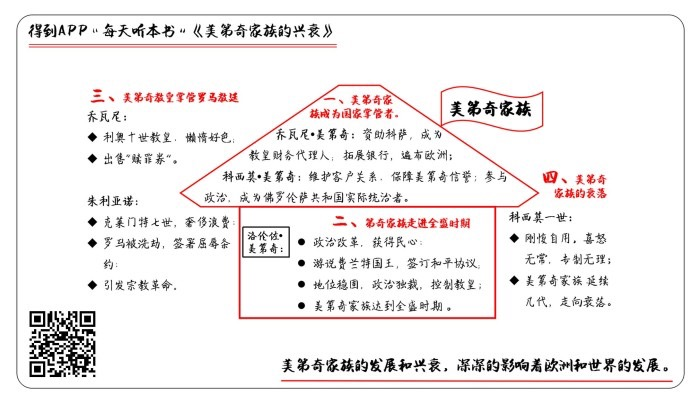

# 《美第奇家族的兴衰》| 三木解读

## 关于作者

克里斯托弗·希伯特，当代英国炙手可热的历史学家和传记作家，也是欧洲王室贵族的御用传记作家，一生写下了五十多本历史巨制，如《英格兰史》《法国大革命》《维多利亚女王传》《拿破仑传》《教皇家族：波吉亚家族传》。希伯特文笔通俗流畅，对史实的考据深入充足，因此，从专业学者到普通读者都非常推崇和喜爱他的作品，英国《泰晤士报》赞美他是“我们这个时代最具天才的通俗历史学家”。

## 关于本书

在近现代的欧洲史中，美第奇是个绕不开的姓氏，但是全面描写这个家族的著作并不多见，《美第奇家族的兴衰》是填补这一空白的总结性著作。在本书中，作者俯视美第奇家族的历史，条理清楚，详略得当，为读者展示了这个家族兴衰的曲折过程以及对于整个世界的影响。

## 核心内容

在古代的欧洲社会有几个不同的阶层：平民、商人、教会和王室。本书的主角美第奇家族属于每一个阶层。他们出身于佛罗伦萨的平民，之后开始经商，通过几代人的努力，不仅积累了巨额财富，控制着整个欧洲的金融，而且以商人的身份统治了佛罗伦萨将近300年。这个家族最传奇的地方在于，在欧洲走向近代化过程的三大思想运动中，美第奇家族跟其中的文艺复兴和宗教改革都有着直接关系。

## 前言

你好，欢迎每天听本书，本期为你解读的是《美第奇家族的兴衰》。美第奇家族，是一个兴起于意大利佛罗伦萨的家族，但它却影响了整个欧洲的政治、文化甚至历史进程。不过完整讲述这个家族历史的著作却不多，这本书完成了这个工作，所以显得十分可贵。这本书的中文版大约32万字，我将用27分钟的时间，为你讲述美第奇家族极具传奇色彩的故事。

当我们说起欧洲历史的时候，往往会在心里勾起这样印象：古代的欧洲社会里，有这么几个不同的阶层：平民、商人、教会和王室，而这本书的主角美第奇家族属于每一个阶层。这话怎么讲？他们出身于佛罗伦萨的平民，之后开始经商，通过几代人的努力，不仅积累了巨额财富、控制着整个欧洲的金融，而且以商人的身份掌管着佛罗伦萨共和国，在15到18世纪，美第奇家族统治了佛罗伦萨将近300年。除此以外，这个家族还产生过三位罗马教皇、两位法国王后。值得一说的是，这两位法国王后可不是花瓶，而是在成为王太后以后垂帘听政、直接掌管法国大权的人物。

对于美第奇家族，如果只用“有钱有势”四个字来形容，还远远不足以说明这个家族的影响力。要知道，欧洲走向近代化的过程里有三大思想运动，也就是文艺复兴、宗教改革和启蒙运动，而美第奇家族跟其中的文艺复兴和宗教改革都有直接关系。

比如说文艺复兴，美第奇家族长期为艺术事业投入金钱。达·芬奇、米开朗基罗、拉斐尔是我们熟知的文艺复兴三杰，而他们全都是美第奇家族发掘和资助的。甚至连“文艺复兴”这个词，也是美第奇家族资助的艺术家瓦萨里提出的。美第奇家族兴建了教堂、大学和图书馆，还支持哥白尼、伽利略做科学研究。如果没有美第奇家族的慷慨，文艺复兴就没有我们所看到的那样蓬勃、辉煌，整个欧洲走出矇昧的中世纪，迈向近代的时间，还不知要推迟多少年。

虽然美第奇家族已经消失了两百多年，但是在欧洲，说起它的名号，仍然是人尽皆知的，因为众多的文化名城都深深刻下了美第奇家族的痕迹。尤其是佛罗伦萨，它的命运一直跟美第奇家族绑在一起。如今你到佛罗伦萨去旅游，还是能在这个城市的各个角落看到美第奇家族的影子：乌菲兹美术馆、圣母百花大教堂、圣马可修道院、碧提宫，还有各处散落的美第奇家族徽章，都在诉说着这个家族往日的荣耀。

可以说，近现代的欧洲史上，“美第奇”是个绕不开的姓氏。但是，全面描写这个家族的著作却并不多见，直到1909年，第一部关于这个主题的英文著作才出现，但是以今天的眼光看，这本书缺点明显，包含了太多的主观感情。好在后来的1个世纪里，对于美第奇家族的研究越来越细致，终于出现了总结性的著作，也就是本期为你讲述的这本《美第奇家族的兴衰》。在本书之中，作者俯视美第奇家族的历史，条理清楚、详略得当。为读者展示了这个家族兴衰的曲折过程，以及对于整个世界的影响。

这本书的作者叫克里斯托弗•希伯特，这个人是谁呢？他可是当代英国最炙手可热的历史学家和传记作家，一生写下了五十多本历史巨制，有诸如《英格兰史》《法国大革命》《从大英帝国看美国革命》《罗马史》这样的历史专著，也有欧洲历史上风云人物、传奇家族的传记故事，比如《维多利亚女王传》《乔治四世传》《拿破仑传》《教皇家族：波吉亚家族传》，以及今天咱们要解读的这本《美第奇家族的兴衰》，从这个角度看，说他是欧洲王室贵族的御用传记作家一点都不夸张。同时，希伯特的文笔通俗流畅，对史实的考据又深入充足，因此，从专业学者到普通读者，都非常推崇和喜爱他的作品，英国《泰晤士报》赞美他是“我们这个时代最具天才的通俗历史学家”。

介绍完本书和作者的基本情况，接下来，我会通过四个部分来介绍这本书的主要内容：第一部分，美第奇家族是如何从一个普通商人之家，崛起成为佛罗伦萨实际统治者的；第二部分，洛伦佐·美第奇是如何带领美第奇家族走进全盛时期的；第三部分，两任美第奇教皇如何掌管罗马教廷，又是如何引发宗教革命的；第四部分，盛极一时的美第奇家族，是如何走向衰落，最终退出历史舞台的。

## 第一部分

我们先来看看美第奇家族的兴起，它是如何从一个普通商人之家，崛起成为国家掌管者的。

今天佛罗伦萨是意大利中部的历史名城、旅游胜地，而在几百年前，它可是个独立、富裕、强大的国家。这要从公元476年说起，当时西罗马帝国灭亡后，意大利分裂了一千多年，佛罗伦萨也是众多小国里的一个。到了15世纪，佛罗伦萨共和国变得越来越繁荣，很多家族依靠贸易发展起来，美第奇也位列其中。

说到贸易，15世纪早期，哥伦布还没开始大航海，亚欧大陆的商品想要进行交易，就得经过漫长而复杂的路途，而佛罗伦萨正是其中重要的一站。既然重要，那么赚钱也就容易。佛罗伦萨靠着商人富了起来，又没有专制的君主，所以商人地位就高了起来。就连当时的哲学家都觉得，只有做大买卖的商人才值得受人瞩目和尊重，甚至有人说：“不经商的佛罗伦萨人，无论如何也抬不起头。”

就是在这样的时代浪潮里，一位叫做乔瓦尼•美第奇的人出现了。他出生于1360年，因为父亲死得早，从小生活贫穷，但是他立志要通过经商发财致富，而且还要能守住这份财富，最终做个体面的佛罗伦萨人。为了实现这个目标，他特别低调，专心赚钱，根本不参与那些公众事件。1406年，也就是乔瓦尼46岁的时候，佛罗伦萨在地中海上占了个出海口，这可是个大好的商机。乔瓦尼利用这个机会大搞羊毛加工业，赚了不少钱。不过，让他真正发大财的，是一次赌博式的投机。

当时有个叫科萨的那不勒斯人，想要去罗马竞选教皇。不过，他虽然出身贵族，可一直在当海盗，出了名的放荡不羁爱自由，所有人都觉得他这是寻找刺激，根本不认真。这时候，只有乔瓦尼觉得科萨奇货可居，还拿出了一万金币资助他，这在外人看来，简直是一场血本无归的赌博。但是大家都没想到，科萨在1410年真的当选了教皇，成为了约翰二十三世。乔瓦尼也得到了回报，他成为了教皇的财务代理人，帮整个教廷打理钱财，不但收获了巨额利润，顺便还把自家的银行开遍了欧洲。就这样，没用几年时间，美第奇银行就成了全欧洲最能赚钱的家族产业。

家族式经营的问题在于，如果继承人不行，那就很容易一头栽倒。幸运的是，精明的乔瓦尼有个更精明的儿子，他叫做科西莫•美第奇。科西莫是个出色的银行家，特别擅长商业管理。选分行经理的时候，他提拔年轻人，然后悉心培养，这就让分行对他保持了绝对忠诚。在客户方面，科西莫不会为了短期利益，放弃有忠诚度的客户，他仔细维护和每个客户的关系，这些关系向外延伸，便形成了巨大的关系网，不但持久，而且稳定。

就这样，美第奇银行成了欧洲绝无仅有的庞大机构，分行遍布欧洲各个主要城市，而美第奇的名号也就成为了信誉的保障。科西莫不光巩固了家族的经济地位，还走上了政治舞台。不过，有趣的是，科西莫在银行业务上做得顺风顺水，本来没有野心去搞政治。他希望像父亲乔瓦尼一样，做个低调的银行家，可是树大招风，就在美第奇家族蒸蒸日上的时候，对手出现了。佛罗伦萨城里有个阿尔比奇家族，一直想铲除美第奇家族的势力，他们陷害科西莫，说他要收买雇佣军来推翻共和政府，结果科西莫被判处流放10年。眼看美第奇家族就要被连根拔起了，可是呢，科西莫才出发前往流放地没多久，佛罗伦萨共和政府就发现，没了美第奇银行就真的没钱花，再加上打仗输给了米兰，老百姓对政府的不满情绪达到了高潮。

别忘了，教皇一直跟美第奇家族关系好，就这样，在教皇和民意的支持下，判决被取消了，科西莫回归了佛罗伦萨，一路上，乡亲父老都在向他欢呼致敬。经过陷害的科西莫反而威望更高了。他意识到，作为佛罗伦萨最富有的人，想避免参与政治是不可能的，既然人民拥戴自己，干脆，我来当这个最高领导人吧。于是，科西莫在佛罗伦萨搞起了僭主政治，本质上是一种独裁，跟君主的差别，就差一个名号。

他本人不担任任何政府职务，但是所有政治决策都要经过他的同意才能执行，科西莫很少去市政厅，执政团的官员要到他家里来征询意见，各国的使节来访也会直接到科西莫家里拜会。科西莫成了佛罗伦萨共和国的实际统治者，被人民尊称为“国父”。

就这样，在乔瓦尼和科西莫父子的努力之下，美第奇家族变得富可敌国，注意，这并不是比喻，而是字面意思上的富可敌国，不仅在经济上，就是在权力的实际应用上，美第奇家族也真正掌握了一个国家。如果从1406年乔瓦尼抓住机会搞羊毛生意开始，到1464年科西莫去世结束，美第奇家族只用了58年就做到了这一切。

## 第二部分

我们接下来看看美第奇家族的全盛时期。伟大的“国父”科西莫饱受痛风的折磨，而他的儿子皮耶罗也一样，皮耶罗在掌管家族不到5年之后就去世了。这样，科西莫的孙子洛伦佐•美第奇登场了，他获得了美第奇家族全部的金钱和权力，带领美第奇家族走进了全盛时期。

这时候，洛伦佐才刚满20岁。他虽然年轻，却极富政治天赋，他刚一上台，就进行了政治改革，这次改革让老百姓得到了好处，于是洛伦佐获得了民心。但也正是因为这次改革，教皇不高兴了。于是，教皇和反对美第奇家族的人联合起来，对洛伦佐进行暗杀。洛伦佐的亲弟弟朱利亚诺惨死，但是洛伦佐幸运地活了下来。之后洛伦佐团结各方力量、清除政敌，这让洛伦佐获得了前所未有的声望，成为了佛罗伦萨实际的领导人，他的名字被人们冠以“豪华者”的名号，也就是伟大的意思。

但是教皇依然没有死心。这时的教皇是西克斯图斯四世，在历史上是出了名的残暴贪婪，他利用职权为几个外甥谋求利益，肆意侵占意大利邦国的土地。洛伦佐拒绝了教皇的无理要求，这也是他遭到暗杀的原因。没想到洛伦佐不仅逃过一劫，更让佛罗伦萨上下团结一心，获得了比以前更大的声望，这让教皇恼羞成怒，他游说一直跟佛罗伦萨有矛盾的那不勒斯王国，纠集了一支军队，要荡平佛罗伦萨，战争迫在眉睫。本来呢，那不勒斯军队是不足为惧的，因为老朋友米兰公国肯定会来帮忙，可这时候的米兰公国，因为公爵遭到暗杀，国内一片混乱无暇驰援。可还有30英里，敌人就要兵临城下，佛罗伦萨处在前所未有的危机边缘。

洛伦佐决定，他要一个人去那不勒斯王国游说国王，这让所有佛罗伦萨人非常震惊，这等于羊入虎口啊。但洛伦佐知道那不勒斯国王费兰特的软肋：因为一些历史原因，法国国王一直认为自己有权力占有那不勒斯，这让费兰特国王深感威胁，更不用说还有土耳其的舰队，他们一直在那不勒斯南部沿海游荡。也就是说，洛伦佐深深地知道，那不勒斯王国同样被强敌环绕，如果佛罗伦萨和那不勒斯能够成为盟友，这是双赢的局面。不过，费兰特国王机敏狡猾、精于算计，还特别善于掩饰真实想法，跟他谈判难度可不小。

但是洛伦佐有办法，他首先找到自己和费兰特国王的共同点。他俩都喜欢乡村生活，喜欢驯鹰和打猎，而且他们对诗歌的品位很相近，对于古典作品和人文主义看法也很相似。所以在你来我往的谈判里，洛伦佐不是只顾眼下的局势，而是委婉地提到古典时期，那个时代有很多通过结盟实现和平的君主，他们同样被后人传诵，这是对费兰特国王的暗示。

至于眼下的政治局势，洛伦佐同样见解深刻。他告诉费兰特国王，虽然教皇近年来扶植那不勒斯，比如提拔费兰特国王的儿子做主教，但是教皇只是为了实现个人目的，对那不勒斯只是暂时的利用，但是佛罗伦萨不一样，它可以成为那不勒斯真正的朋友。洛伦佐隐藏着内心的焦虑，依靠自己出色的口才，在那不勒斯宫廷周旋了很久，最终，两国签订了和平协议，那不勒斯撤军，教皇被孤立了，而战争终于结束了。

1480年洛伦佐回到佛罗伦萨，他受到极为热烈的欢迎，甚至比46年前他爷爷科西莫回来时的场面更胜一筹。经历这次事件之后，洛伦佐在佛罗伦萨的统治就更加稳固了，这个时候佛罗伦萨名义上还是共和国，但是洛伦佐事实上已经成为了独裁者。虽然他没有任何头衔，可是他的意见全都被执行了。这种政治体制让外国的使者非常困惑，因为洛伦佐一再向他们解释，自己只是个普通市民。

虽然在政治上获得了很大的胜利，但是洛伦佐经商的才能很差，美第奇银行被他搞得濒临破产。于是，洛伦佐先是侵占了堂弟的钱财，之后又挪用了国库。这当然不是一个“普通公民”该做的事情，有人称呼他是暴君，但是洛伦佐毕竟有威望、有魅力，所以另一些人说：“如果佛罗伦萨注定被暴君统治，那绝对找不到比洛伦佐更优秀、更令人愉悦的人选了。”在他们的眼里，洛伦佐是一位“温柔的暴君”。

之后，残暴的教皇西克斯图斯四世去世了，继任者是性格温和的英诺森八世。洛伦佐看到这个好机会，积极地和教皇搞好关系，他用钱收买了教皇的亲信，经常给教皇写信、送礼。在信里，洛伦佐会表示自己的好意和鼓励，然后仿佛不经意地加入自己的观点。就这样，洛伦佐用非常温和的方式逐渐控制了教皇，除了金钱之外，美第奇家族找到了另一种影响欧洲的方式。

自从1469年洛伦佐成为家族的掌门人，直到1492年去世，这23年里，美第奇家族达到了全盛时期。洛伦佐支持了大批的艺术家，是当之无愧的文艺复兴最伟大的赞助者，而在他去世之后，美第奇家族在佛罗伦萨的统治被推翻，文艺复兴的中心也从佛罗伦萨转移到了罗马。这就是本期节目的第二部分。

## 第三部分

下面，我们来看看两任美第奇教皇掌管教廷的时代。

刚才说到，美第奇家族在佛罗伦萨的统治被推翻，但其实这个时间并不长，在洛伦佐去世20年之后，也就是1512年，美第奇家族重新掌握了佛罗伦萨。不过，金融危机和战争拖垮了这个国家，从那时起，佛罗伦萨再也没有恢复当初的活力，也不再是重要的国家了。那么，美第奇家族就此衰落了吗？还没有，他们将在另一个更重要的城市继续影响欧洲，这个城市叫做罗马。

罗马是教廷所在地、教皇居住的地方。而在前面的讲述里，我们已经知道，美第奇家族和不止一位教皇打过交道，恩怨纠葛非常复杂。伟大的洛伦佐认识到，如果自己的儿子能在教廷里身居高位，那么毫无疑问对于家族非常有利。事实上他也是这么做的，他知道在法国获得神职比意大利更容易，于是他让美第奇银行在法国的分行密切关注神职空缺。在洛伦佐的预先安排之下，他的儿子乔瓦尼8岁就接受了削发礼，法国国王亲自推荐乔瓦尼进入修道院，还让他担任了20多个重要职务，包括很多修道院的院长，但是伟大的洛伦佐对儿子的期望比这些要高得多。

前面讲到，洛伦佐和教皇英诺森八世关系很好，于是他让教皇封乔万尼当枢机主教。这个枢机主教，用咱们熟悉的话说就是红衣主教，是教廷之中仅次于教皇的重要职务。在洛伦佐去世前3个星期，乔瓦尼终于成为了枢机主教，当年他才16岁，是有史以来最年轻的枢机主教。不过，有这样的职务并不代表他道德方面多高尚，乔瓦尼不但懒惰，而且好酒、好色。

只是，那又如何？事实上当时的罗马就是一座堕落的城市，整个城市的人口不到5万人，而妓女的数量将近7千。乔瓦尼在这里如鱼得水，安安稳稳地当了20多年枢机主教。他的优点在于和蔼可亲、平易近人，因为这些优点，乔瓦尼被选为了教皇，也就是利奥十世。这样一个人成为教皇以后，当然会大肆享乐。

据说他对自己的堂弟朱利亚诺说：“既然上帝让我成为教皇，那我们就好好享受吧。”这位朱利亚诺是谁呢，前面讲到洛伦佐的弟弟被刺杀身亡了，这位朱利亚诺就是他的遗腹子。后来这个堂弟朱利亚诺成为了教皇克莱门特七世。

克莱门特七世登基的时候，教廷已经是个烂摊子了，因为堂哥；利奥十世实在是太能花钱了。他的父亲、伟大的洛伦佐在佛罗伦萨资助艺术家，而利奥十世在罗马继续为艺术家花钱，拉斐尔是他最喜爱的画家，利奥十世甚至让拉斐尔给自己的大象画像。就是因为利奥十世投资艺术，还修建了圣彼得大教堂，真是花钱没数。为了凑钱，教廷大肆出售“赎罪券”，这成为了宗教改革的直接原因。

而克莱门特七世接过堂哥的烂摊子，继续花钱，毫不吝惜。他聘请拉斐尔画画、聘请米开朗基罗雕刻、给达·芬奇提供住宅，还资助哥白尼进行天文研究。本来这些事情还都影响不到他的地位，但是，跟神圣罗马帝国打仗，就要出问题了。在1527年，神圣罗马帝国的军队入侵了罗马，进行了惨无人道的洗劫，克莱门特七世签署了屈辱的条约，而罗马的文艺复兴也就此终结。

不过，克莱门特七世并不是毫无谋略。在此之后，他采取了极为巧妙的外交手段，在1533年，他把14岁的凯瑟琳·美第奇嫁给了法国王储，后来凯瑟琳成了法国王后、王太后，开启了美第奇家族统治法国的时代。而这一切，都得益于克莱门特七世的深谋远虑。以上美第奇家族掌管教廷的时代。

## 第四部分

接下来，我将为你讲述美第奇家族的衰落。

前面讲到，虽然美第奇家族实行独裁统治，但是佛罗伦萨在名义上还是个共和国。然而，在伟大的洛伦佐去世以后，美第奇家族经历了被推翻又回归的历程，他们对这种“挂羊头卖狗肉”的做法厌烦了，共和国被变成了大公国，美第奇家族的继承人终于告别了平民和商人的身份，彻底地承认自己是贵族了。完成这个过程的人是科西莫一世。

科西莫一世的名字是教皇利奥十世取的，正是为了纪念“国父”科西莫。虽然名字一样，可是科西莫一世跟自己的祖先完全不同。他受过很好的教育、举止优雅，而且记忆力非常棒。但是，他的兴趣是成为军人，而不是治理国家，同时他根本不相信任何人，所以也就刚愎自用。科西莫一世最亲密的两个人，一个是母亲、一个是秘书，可是就算是面对这两个人，他也不会透露自己的想法，更不会跟他们商量什么，他自己做出所有事情的决定。

社会底层的老百姓支持科西莫一世，但并不是因为他能带来什么好处，而是之前的共和国没带来好处。另外，科西莫一世还得到了西班牙的支持，当时西班牙国王就是神圣罗马帝国的皇帝查理五世，而且因为哥伦布的远航，西班牙国力强盛。因此，有了西班牙的帮助，消灭反对者也就不在话下。只是请神容易送神难，查理五世也想把佛罗伦萨并入自己的版图。但是科西莫一世很幸运，这个时候查理五世和教皇的关系不好，查理五世认为如果佛罗伦萨公爵能够支持自己，那么这是非常重要的优势，就这样，美第奇家族的贵族头衔被神圣罗马帝国承认了。

到了1569年，教皇也承认了科西莫一世大公的身份。就这样，美第奇家族成为了佛罗伦萨名正言顺的主人，但此时的佛罗伦萨已经不是充满活力的城市了，科西莫一世也根本得不到伟大的洛伦佐那样的声望。科西莫一世非常严厉，对手下的任何错误都不放过，甚至在宫廷仪式和服装方面，也都制定了严格的标准。他的性格喜怒无常，他努力让自己变得神秘起来，所有的行程都是保密的，就连他的仆人都不知道。

为了防止被刺杀，科西莫一世聘请了米开朗基罗的学生瓦萨里，让他设计了一条长廊，好让他安全地穿过城市。换句话说，专制君主的种种特点都出现在了美第奇家族，把自己当成是公民的传统已经不复存在了。从科西莫一世开始，美第奇家族的统治又延续了好几代，但是已无可避免地走向了衰落。1743年，美第奇家族的最后一个成员去世，传奇就此谢幕。

当然，在美第奇家族让人惋惜的衰落过程里，并不是完全没有故事可讲。科西莫一世的儿子叫做费尔南迪多二世，他曾经聘请了一位科学家，给自己的儿子当家庭教师，这位科学家就是伽利略。后来，当教会迫害伽利略的时候，美第奇家族接纳了他，让伽利略可以在佛罗伦萨安静地进行研究。1610年，伽利略在自己的著作里提到了新发现的行星，他将其命名为“美第奇星”。

仰望星空，美第奇星依然闪耀，仿佛纪念着美第奇家族的传奇故事。

## 总结

说到这里，《美第奇家族的兴衰》这本书我们就讲完了。我们一共讲了四部分内容。

第一，美第奇家族的兴起，通过乔瓦尼和科西莫父子的努力，美第奇家族从一个普通商人之家，崛起成为佛罗伦萨的实际统治者；

第二，美第奇家族的全盛时期，伟大的洛伦佐维护了国家的统一，并且对教皇加以控制，将家族影响扩大到全欧洲，美第奇家族也因此走进了全盛时期；

第三，两任美第奇家族的教皇，利奥十世和克莱门特七世掌管罗马教廷，他们的奢靡引发了宗教改革；

第四，盛极一时的美第奇家族走向衰落，最终退出了历史舞台。

这本《美第奇家族的兴衰》所讲述的，是欧洲曾经最有影响力的家族。美第奇家族的故事充满了传奇色彩，尽管我们总是把这个家族和佛罗伦萨联系起来，但是事实上，美第奇家族的影响力绝对不仅限于佛罗伦萨，整个欧洲乃至整个世界的发展，都曾经被这个家族深深地影响了。

更有意思的是，哪怕直到今天，我们的身边还经常能看到美第奇家族的影响。比如说，被刺身身亡的朱利亚诺，他的墓地上有他的大理石头像，这是米开朗基罗的作品。因为和著名的《大卫》出自同一人之手，而且比《大卫》线条简单，所以这个雕像被中国人亲切的成为“小卫”，只要是学习过绘画的人，就一定临摹过这座雕像的素描。

朱利亚诺的儿子，也就是教皇克莱门特七世，曾经授予英国国王亨利八世一个称号，叫做“信仰守卫者”，缩写是“FD”。亨利八世把 FD 这两个字母铸造在了英国的硬币上。几百年过去了，今天在英国的硬币依然能看到这两个字母。

如果你到欧洲旅游，那么美第奇家族的痕迹更是随处可见。梵蒂冈的城墙上，有美第奇家族的徽章；法国的卢浮宫里，有大画家鲁本斯为玛丽·美第奇绘制的1组21幅的画像；至于佛罗伦萨，那更不用说，因为美第奇家族的最后一位成员把家族所有的文物收藏都捐献了出来，她在遗嘱里提到，这些文物永远不能离开佛罗伦萨，它们就应该在这里，供全世界的人来参观。

撰稿：三木

脑图：刘艳

转述：徐惟杰