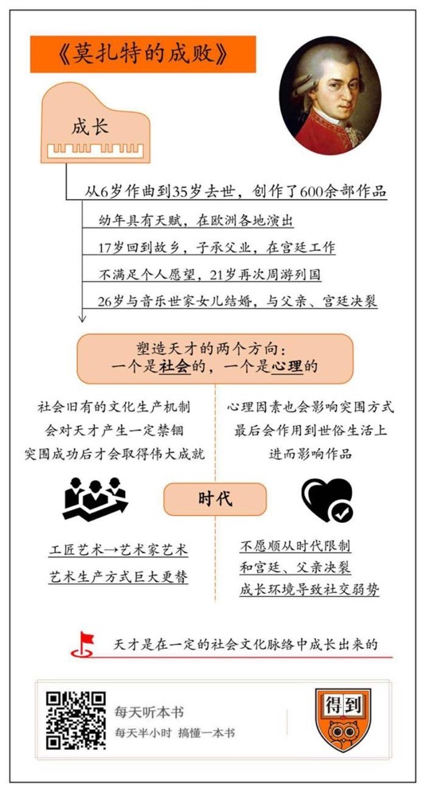

# 《莫扎特的成败》| 陆晶靖解读

## 关于作者

诺贝特·埃利亚斯，犹太裔社会学家，1897年出生于德国布里斯劳。他是贯穿古典社会学与当代社会学的关键人物，一生致力于“人的科学”的研究，试图综合社会学、心理学、历史学等学科，并以“形态社会学”来整合微观什会学与宏观社会学，“心理发生”层次与“社会发生层次”的问题。这位百科全书型的大师，一生著作颇丰，比如《文明的进程》等。

## 关于本书

埃利亚斯提出，文明是一个逐步演化的过程，社会的内部演化，和人的情绪变迁，共同塑造了文明。这本《莫扎特的成败》，是埃里亚斯生前最后一部著作。它其实也是秉承了《文明的进程》的思路，以莫扎特为标本，揭示了塑造天才的两个方向的因素，一个是社会的，一个是心理的。这两个因素，都驱动着天才在一个个人生节点去做出选择，或者是正向的反应，或者是逆向的反抗，最终，他才成了我们看到的样子。

## 核心内容

很少有人会想到天才在他们那个时代，也是活生生的人，需要吃饭穿衣服，需要社会关系，也需要遵守社会规范。很多天才，李白、达芬奇，莫扎特也一样，都必须戴着镣铐跳舞。这种镣铐，对他们个人来说，肯定是不舒服，甚至非常痛苦的。但是，天才的价值就在于，他凭借自己的才华和意志，对镣铐做出了超越常人的反抗。天才最终的成就，是他挣扎和奋斗过的成果。这本书关注的就是，神童莫扎特，历尽艰辛，突围变成伟大艺术家莫扎特的过程。

## 前言

你好，欢迎每天听本书，今天为你解读的是一本社会学的著作，《莫扎特的成败》。

你也许感到奇怪，莫扎特不是音乐家吗？他从6岁开始作曲，到35岁去世，写出了600多部极其优美的音乐，他的手稿非常干净，几乎没有涂改，可见写作非常顺畅，一气呵成。有人说，他作曲的速度比别人抄写他的乐谱的速度还快，这当然是夸张的说法，但也可见他在人们心中，是一个非常才思敏捷的作曲家。飞利浦公司曾经录制了一套莫扎特全集，总共有180张 cd。即使是资深乐迷，也很少会购买这套全集，因为，实在是听不过来。

回答一下开头的问题，为什么一本社会学的著作要关注音乐家呢？因为在这本书里，莫扎特不是作为音乐家，而是作为天才来被研究的。

我们都很敬佩天才，回头看，他们都是历史上的异类。很少有人会想到天才在他们那个时代，也是活生生的人，需要吃饭穿衣服，需要社会关系，也需要遵守社会规范。很多天才，李白、达芬奇，莫扎特也一样，都必须戴着镣铐跳舞。这种镣铐，对他们个人来说，肯定是不舒服，甚至非常痛苦的。但是，天才的价值就在于，他凭借自己的才华和意志，对镣铐做出了超越常人的反抗。天才最终的成就，是他挣扎和奋斗过的成果。这本书关注的就是，神童莫扎特，历尽艰辛，突围变成伟大艺术家莫扎特的过程。

这本书的作者是德国社会学巨匠诺贝特·埃利亚斯，他的著作《文明的进程》是社会学里的一部非常有名的经典。埃利亚斯提出，文明是一个逐步演化的过程，社会的内部演化，和人的情绪变迁，共同塑造了文明。这本《莫扎特的成败》，是埃里亚斯生前最后一部著作。它其实也是秉承了《文明的进程》的思路，以莫扎特为标本，揭示了塑造天才的两个方向的因素，一个是社会的，一个是心理的。这两个因素，都驱动着天才在一个个人生节点去做出选择，或者是正向的反应，或者是逆向的反抗。最终，他才成了我们看到的样子。

我们接下来就从社会和心理这两个方面开始解读这本书。具体地说，作者选择的天才样本莫扎特，要在两个方面突围。一个是艺术家的地位，一个是“神童”的人设。

## 第一部分

一切都要从老莫扎特开始讲起。老莫扎特是一个成就不高的宫廷乐手，在儿子很小的时候就发现了他的音乐才能，于是这一家子就开始在欧洲巡演，所到之处，都会造成轰动。莫扎特6岁在慕尼黑的宫廷里演奏，7岁和法国国王王后同桌用餐。到了英国，国王偶然在大街上遇到莫扎特一家，竟然让马车停下，亲自向他们鞠躬。

不过社会学家要问问背后的细节。老莫扎特到底赚了多少钱呢？很可能并不多，以当时的交通条件而言，带着一家人在欧洲各地旅行，是非常辛苦的。如果他们的进账远大于开销，应该早就回到故乡萨尔茨堡了。

这和宫廷的付费机制有关系。在当时，音乐家的地位远远没有今天那么高，国王和贵族为他们的表演付费，带有很强的恩赐性质，说白了就是打赏。有些人确实很大方，有些人却相当吝啬。有时候一场演出，只能得到两个金币，而购买一辆旅行用的马车，需要花120个金币。莫扎特固然有“神童”的美名，但是贵族们分给孩子的时间是有限的。换句话说，每个宫廷对这种巡回演出的兴趣都相当短暂，他最多在一个地方待几周时间就不得不离开。到他十几岁的时候，这种方式就难以维持了。当神童成长为少年，许多乐趣也自动消失了。根据茨威格在一本书里的记载，6岁的莫扎特很知道怎么在成年人面前卖萌，当他演奏完一曲，奥地利女皇问他要什么奖赏，他指着7岁的玛丽公主说，以后想和她结婚。周围人都哈哈大笑。很明显，这样的话他到了十几岁，就不能随便乱说了。说到玛丽公主，她的全名叫玛丽·安托瓦内特，后来嫁给了路易十六。她的一生有两句话非常著名。有一次，大臣告诉她人民没有面包吃了，她说：“那他们为什么不吃蛋糕”？后来法国大革命爆发，把她送上断头台，她踩到了刽子手的脚，这时候她说，“哦，对不起，我不是故意的”。就是这么一个玛丽王后，莫扎特和她在童年时代有这么一次交集。

老莫扎特对儿子寄予厚望，希望在自己的基础上更进一步。他自己的最高世俗成就，是萨尔茨堡宫廷乐队的副指挥，当时萨尔茨堡是神圣罗马帝国中的一个独立的教区，政教合一，有点类似于自治区，大主教也是最高的统治者。但是萨尔茨堡的宫廷太小，机会不多，远不能和慕尼黑、巴黎乃至维也纳的宫廷相比。同时，他带着儿子在欧洲各地演出，赚了一些钱，也遭到乐队同事的妒忌。后来他干脆放弃了作曲，专心带儿子到处演出，希望最后能在这些大城市获得一个稳定的职位。可惜进展得很不顺利，在当时，招聘乐师这件事，对于各国宫廷来说都不是什么特别大的事情，王公贵族们随随便便的一句话，就可能导致他们几个月的旅行徒劳无功。而且当时的宫廷也不能真正认清莫扎特的才华。

莫扎特父子离成功最近的一次是在维也纳，费迪南德大公希望留住莫扎特，但是他的妈妈，著名的玛丽亚·特蕾莎女皇说，不要雇用这些没用的人。特蕾莎是一个强硬的政治家，这也反映在她对莫扎特不念旧情的态度上。我们上面讲了莫扎特童言无忌，要娶玛丽公主为妻，而问出那个问题的人，正是特蕾莎女皇。她一辈子都和俄国的叶卡捷琳娜女皇为敌，也和普鲁士的腓特烈大帝关系很差，有个事实很残酷，我们现在都觉得莫扎特的艺术成就非常高，但是和女皇当时操心的事情比起来，他找工作这件事情，确实不太重要。

总之，神童莫扎特和历史上许多早慧的天才一样，逐渐到了尴尬的年纪。如果不能获得社会进一步的认可，别人很容易觉得他江郎才尽，他自己也可能会在挫败中沉沦下去。同时，旅行演出带来的收入越来越少，以至于故乡的妈妈会写信来问，为什么在慕尼黑三个星期，一分钱也没有往家里寄。

于是，当莫扎特17岁的时候，不得不回到故乡，继承了父亲的事业，在小小的萨尔茨堡宫廷里找了个工作。当生活稳定下来以后，他的创作也取得了一定的进展。今天还在被广泛演奏的五部小提琴协奏曲，就是在这个时期写出来的。但是萨尔茨堡财政很紧张，支付的薪水很少，而且宫廷乐队的编制太小，只能演出很室内乐和简单的协奏曲作品，而莫扎特想写歌剧。于是几年后，他又踏上了周游列国找工作的旅程。这一年，他已经21岁了。

这时候的莫扎特，已经对自己的才华有充分的确信，这种强烈的自我意识，让他无法容忍在一个在文化和经济上都很闭塞的地方生活。在萨尔茨堡，大主教只把他当作音乐上的仆人，所以他到慕尼黑、巴黎这些大城市去找机会。但实际上，宫廷之间并没有本质的差别。贵族们倒不是刻意蔑视莫扎特，这种地位上的差别，对他们来说，是自然而然的，但是却给了莫扎特巨大的打击。在整个欧洲，愿意花钱购买他的作品的，只有王公贵族，可是这些人并不真正在乎他。在他们眼里，莫扎特和一个后宫的厨师没有什么区别。

莫扎特的这种尴尬是特定的历史时期造成的。这本书把欧洲的艺术家分为两类，像达芬奇、巴赫，乃至和莫扎特几乎同时代的海顿，都是工匠艺术家。工匠艺术家是为特定的主顾创作的，需要遵循他们的指示和要求，用我们今天通俗的话说，就是要按照甲方的要求来。但是这也并不意味着，工匠艺术家没有创作的自由，他们可以在遵守规则的前提下，局部地实现自己的想法。像巴赫的《哥德堡变奏曲》以及达芬奇的《蒙娜丽莎》这样的作品，都是受委托生产的。

我们假设当年的甲方都很懂艺术，但是他们的懂，比起艺术家本人尤其是一位天才对于艺术的理解，相差何止十万八千里。他们眼中艺术品的价值，是通过和以往作品的相似度来判断的。莫扎特少年时代的很多作品，属于工匠艺术，比如我们前文提到的五部小提琴协奏曲，就是非常精致的作品。但是不管是因为宫廷的蔑视，还是因为澎湃的艺术创作冲动，这种生产方式已经开始束缚他的手脚。他渴望摆脱旧的艺术发展脉络，跳出当时的艺术标准，自己走出一条道路来。

这种渴望和单一的甲方市场之间的冲突严重折磨着莫扎特。在他之前，巴赫、海顿这些工匠艺术家一直习惯于这样的生产模式，没有什么其他的想法。而在他之后，市民阶层逐渐成长起来，财富也日益增多，像贝多芬这样的晚辈，可以相当自由地创作，因为市场可以给他相对稳定的回报。经济上不依赖宫廷，就可以让贝多芬尽情地展现他的傲气。而我们的天才莫扎特，恰恰生活在时代变迁之前这个尴尬的节骨眼儿上。鄙视宫廷贵族，又却不得不依赖他们。

相对于工匠艺术，埃里亚斯提出了另外一个概念，艺术家艺术。这正是莫扎特渴望的生活形式。艺术家艺术是为了市场创作的，艺术家在创作的时候有更多的自由，他只需要杰出的艺术表现打动消费者，一系列艺术商人和演出商就会保证他生活无忧。在这种生产模式里，天才艺术家有可能通过创新，把艺术的标准纳入新的轨道，换句话说，他们可以教育消费者，让他们改变自己的旧观念，学着接受新的艺术。这是艺术民主化以后的生产方式，也是当今艺术生产模式。即使艺术家的作品和消费者之间有一定的距离，许多与艺术有关的外围从业者，比如文化记者，艺术评论家等也会通过自己的方式，来让公众更加熟悉这些艺术品。

从工匠艺术到艺术家艺术，反映在社会进程上，就是艺术的民主化。而艺术民主化的大前提，就是整个时代的民主化。莫扎特生活在时代巨变的前夜。1789年，法国大革命爆发，童年时代见过的玛丽公主，这个时候是路易十六的皇后，后来被送上了断头台。这是欧洲大陆资产阶级崛起的开端。资产阶级推翻了贵族，也继承了贵族的艺术品位。如果莫扎特不在1791年病死，而是像海顿那样活了77岁，很可能有数不清的人会用自己的金币来支持他的艺术。

只可惜历史没有如果。在他生命的最后十年，也就是1781年到1791年，莫扎特彻底告别了萨尔茨堡的工作，来到维也纳当一个自由艺术家。这是他创作生涯中最辉煌的十年，他终于实现了自己写大型歌剧的梦想，一些主要作品《后宫诱逃》《费加罗的婚礼》《唐璜》包括很多交响曲，都是在这个时期写成的。他最后死于贫困，是因为宫廷没办法给他稳定的收入，而市场又不健全，确切地说是付费机制不健全，哪怕歌剧再受欢迎，他也没办法靠版税来取得收入。他只能不断接零碎的订单，可是他又不愿意在这些应景之作上敷衍了事，反而写得特别认真。我们现在看来，这些也都是超凡脱俗的精美作品。但因为压力很大，在生命的最后几年，他的精神状况一直不太稳定。

1790年的一天，海顿要去英国，莫扎特去送别。分别的时刻，他流着眼泪说，这可能是他们最后一次见面了。当时别人以为他觉得海顿年事已高，恐怕不久于人世，才这么说。但第二年，莫扎特就去世了。而海顿，又活了18年。

好了，我们花了比较多的篇幅，回顾社会机制对莫扎特的影响。简单地说，他很早就意识到自己的才华，但是受制于当时宫廷的艺术品位和生产方式，他不得不突围，去开创一条前无古人的艺术道路。从某种意义上说，他当然是成功了，但是也付出了巨大的代价。我们不能说这种磨难是完全负面的，因为如果他在宫廷里享有很高的地位和俸禄，他很有可能不会投入这么多精力去创作那些伟大的作品。

## 第二部分

从莫扎特的音乐才能看，写那种人人喜欢的音乐，比如《土耳其进行曲》或者《小星星变奏曲》，对他来说，是很容易的事情。他也可以靠这种音乐获得一定的收入。当年奥地利皇帝约瑟夫二世听完他的《费加罗的婚礼》后说，亲爱的莫扎特，这音乐真美，可是音符太多了。莫扎特顶回去说，他觉得不多不少。约瑟夫二世，也就是茜茜公主的丈夫，不是一个不懂音乐的大老粗，可是莫扎特也不打算采纳他的意见。他有自己的判断。

这里就涉及到埃里亚斯说的天才的第二个条件，那就是心理因素。莫扎特为什么选择了一条明显更艰难的路呢？这里有深层的心理机制。虽然我们从他的音乐中听到的，都是非常精致、美妙、乐观的情绪，但是作为个人的莫扎特，对两个对象有很强的逆反心理，一个是我们刚才说的宫廷，另一个就是他的父亲。这种逆反心理，以及他对自己才华的自信，让他选择了后来的这种创作方式。

还得再次回到莫扎特的童年。回到那个特蕾莎女皇问他要什么奖赏的时刻。当然，他作出了一个完美的回答。可是，在人后，他根本不知道玛丽公主会不会喜欢他，甚至他都无法分辨，人们对他的喜欢是真心的，还是说说场面话。老莫扎特的一个同事曾经回忆，小莫扎特对别人的爱非常敏感，他常常缠着别人，一天要问十次，是不是喜欢他。如果说不，即使是开玩笑，也会让莫扎特立刻由笑转哭。这种心理需求一直持续到他成年，他需要人们持续的爱，当这种需求没有被满足的时候，就会立刻表现得消极和悲伤。这种极度敏感的需求刺激他在音乐上更加集中精力，因为他知道，人们爱他是因为他在音乐上的才能。在他成年以后，这种转向创作寻求补偿的心理机制，又强化了他在不作曲的时间里，在人前的自卑。

另一方面，尽管他容易惊慌失措，在人前，他又不像他的父亲那样，小心翼翼地维持着宫廷仆人的角色。成年以后，在给父亲的一封信里，莫扎特写道，他十分痛恨那种在宫中卑躬屈膝的人。我们不清楚他是不是在指自己的父亲。当然，现在我们知道，莫扎特渴望凭借自己的才能，和王公贵族平起平坐。但是这种平起平坐，不由莫扎特说了算。所以，他长期处于一种压抑的状态中，对于宫廷又爱又恨，一方面，他在那种环境里能够获得最高的满足感，因为从小他就是在这种环境里生长的；另一方面，当他不再满足于扮演一个神童的角色，而是去做一个真正的艺术家的时候，宫廷就打算对他关上门。

回到我们刚才的问题，为什么他不干脆就写宫廷音乐，好让人们继续喜欢他呢？这就是莫扎特的心结所在。他对于自己的艺术才能，有特别强的意识，他几乎把上天赋予他的才华当成了某种义务，他没有办法背叛这种义务。换句话说，这种义务已经成为他内心不可动摇的纪律，当他在世俗生活中面临的矛盾特别尖锐，以至于无法控制的时候，他还会利用这种义务来自我保护。这也就解释了莫扎特那句名言，他是这样说的，“我持续不断地工作，因为作曲花的力气比休息来得少”。与其坐在那里为生活焦虑，他更宁愿钻到音乐的世界里。正是这种对于才华的自觉和对于音乐的爱，让这种苦力一样地创作，成为了持续他一辈子的过程。

莫扎特生前的书信出版以后，人们惊奇地发现，这位天才还有不为人知的一面。他22岁那年，给自己表妹的一封信里，使用了非常多粗野的，和排泄有关的字眼。这一系列书信引发了后人的猜测，认为他在不作曲的时候，是个很粗俗的人。在电影《莫扎特传》里，莫扎特就是这么一个形象，哪怕是在皇帝约瑟夫二世面前，他也轻浮放浪，口不择言。他在电影中的对手，才华远不如他的宫廷乐师长萨列里，却老谋深算，说话十分谦卑小心。

这部电影代表了人们对莫扎特以及其他天才的一种不负责任地想象。在这种想象套路里，天才的才华是有代价的，最常见的莫过于喜怒无常，缺乏与普通人交往的能力。就好像，才华和情商的总和，遵循了某种守恒定律一样。

本书作者的观点恰好相反，莫扎特并不是缺乏内在修养，管不住自己的嘴巴，恰好相反，这种粗言秽语是有意的。在莫扎特的年代，和排泄有关的粗话，在市民阶层里还不是什么重要的禁忌，在他生活和学习的音乐家群体里，他可以任意使用这类语言来表示亲密，但是在宫廷里，没有人敢这么说。他在皇帝和贵族面前，使用这类语言，恰恰是为了表达他的高傲，表达他对于从小熟悉，却最终把他排挤在外的宫廷的亵渎。

我们知道，在他生命的大多数时光里，莫扎特并不自由，无论是在社会规范，还是作曲风格上，他都感到自己被限制。他当然知道这种限制来自什么地方，而他又不能真正地去举起武器反抗，所以只能选择口头发泄。这是一种心理防卫机制。虽然这么做有点儿孩子气，但在当时的环境里，也非常难能可贵了。

1788年，也就是莫扎特去世前三年，萨列里获得了宫廷乐师长的职位，这曾经是莫扎特梦寐以求的工作。萨列里得到这份荣誉，不是因为他的音乐才能胜过莫扎特，而是他在礼节和作曲风格上更加符合宫廷的要求。我们没有办法设想，如果莫扎特具有萨列里的社交才能，会有怎样的艺术生命，因为莫扎特根本没办法顺从那些限制。所以他后来选择了法国作家博马舍的喜剧《费加罗的婚礼》，把它改编成歌剧，这不是偶然的。这部戏讽刺的对象，就是当时的王公贵族。约瑟夫二世曾经禁止这部话剧在奥地利上演，在莫扎特完成了歌剧版本后，他也一再要求删改。今天我们知道，这已经是莫扎特最杰出的代表作之一，有数不清的演出版本。而人们已经不记得萨列里的任何作品了。

说到这儿，我想拿卢梭来和莫扎特做对照，让你对他有更深刻的理解。我们知道，卢梭是启蒙运动的重要思想家，《社会契约论》的作者。他还有另一个身份，就是不成功的作曲家。他还写过小说。当年卢梭来到巴黎，有一位比他年纪大很多的贵妇人接纳了他，把他变成了自己的情人。用我们今天的标准来看，卢梭扮演的是一个非常不光彩的角色。但他成功地安顿了下来，并且很快跻身巴黎的上流社会，可以安心地开始创作。而莫扎特缺乏卢梭的这种圆滑的社交能力，这是他的成长环境导致的。同时，他也不知道怎么和女人交往。这里就要说到莫扎特的妻子，康斯坦茨。

与其说康斯坦茨是莫扎特唯一爱的女人，不如说是他反抗自己父亲的产物。在他的童年记忆里，总是有一个父亲在身边，而当他在音乐上的成就超越了“神童”的角色，他就对当年那段关系产生了厌恶。他和康斯坦茨结婚的时候，没有通知老莫扎特，在当时的风俗环境里，是非常严重的挑衅行为。莫扎特在成年以后和父亲决裂，也是和“神童”角色的决裂。这是他不得不经历的阶段。

老莫扎特对他造成了很多不良的影响，比如他非常不善于理财，这是因为直到他21岁，所有的演出收入，都是他父亲在管理，他当然就很容易对钱没有感觉。莫扎特的妻子康斯坦茨姓韦伯，她的家族，是德国曼海姆地区重要的音乐世家。康斯坦茨的堂弟，是德国著名的作曲家，写出《魔弹射手》的卡尔·马利亚·冯·韦伯。后人认为，韦伯受到了莫扎特的影响，但莫扎特也在曼海姆磨练了自己的艺术才能。这种影响是双向的。老莫扎特反对这场婚姻，但莫扎特的这场婚姻，既是和他所认可的音乐共同体的结合，也是自己的成人礼。他打算借此宣告，自己已经摆脱了父亲的控制，选择了自己的人生。而老莫扎特直到去世，也没有从这场打击中恢复过来。

莫扎特结婚是在1782年。这时候他刚刚彻底和萨尔茨堡的大主教决裂，搬到维也纳当一个自由艺术家。他还有9年的寿命。和宫廷决裂，和父亲决裂，支撑他的力量，其实也只有他作为天才艺术家的使命感。他遵循的是艺术的规律，而不是什么外在的力量，只有这么做，才能满足他的自尊心。我们从他个人的心理角度出发，也就不难理解，为什么他不愿意屈从于我们前面说到的艺术生产机制，而非要去选择一条危险的道路。这条危险的道路通向前无古人的艺术成就，但也让他在35岁的年纪就早早去世。

后代很多作曲家，都表达过对莫扎特英年早逝的惋惜。在他的很多作品里，一个灵感常常没有得到充分的展开，就被另外一个接踵而来的灵感所取代，对于这些后代作曲家而言，光一个灵感就足以写出来一整首曲子。这当然是莫扎特在奢侈地挥霍他的才华。他没有耐心去慢慢展开和铺陈，也可能反映了他在创作上的某种着急的心态。这样做的结果，就是听众要理解他的作品，变得越来越困难。在当时的社会里，根本没有录音，人们每次去音乐会，听到的都是陌生的曲目。客观地说，他们对于音乐的接受能力，是远远不如今天的音乐爱好者的。所以约瑟夫二世说莫扎特的音符太多了，这是正常的认知负担的体现。

但是就像每个时代的天才一样，莫扎特已经跑得越来越远了。时代限制了他的寿命，但他的作品却在历史中证明了不朽的生命力。最后回到书名，《莫扎特的成败》，一句话，他在艺术上取得的成就，要远远大于在世俗生活上的失败。

## 总结

好了，这本书就为你解读到这里。简单地回顾一下今天的知识要点。

1、天才不是与生俱来的，而是在一定的社会文化脉络中成长出来的。

2、社会旧有的文化生产机制，会对天才产生一定的禁锢作用，突围成功以后，天才才会取得伟大的成就。

3、天才的心理因素，也会影响他突围的方式。这种方式最后会作用到天才的世俗生活上，进而影响到作品。

4、莫扎特生活的时代，正处于工匠艺术向艺术家艺术的转型期，这是艺术生产方式的巨大更替。

5、莫扎特晚期的作品，在艺术上取得了非常高的成就，但是也远离了当时的受众，这也间接导致了他英年早逝。

撰稿：陆晶靖

脑图：刘艳

转述：杰克糖