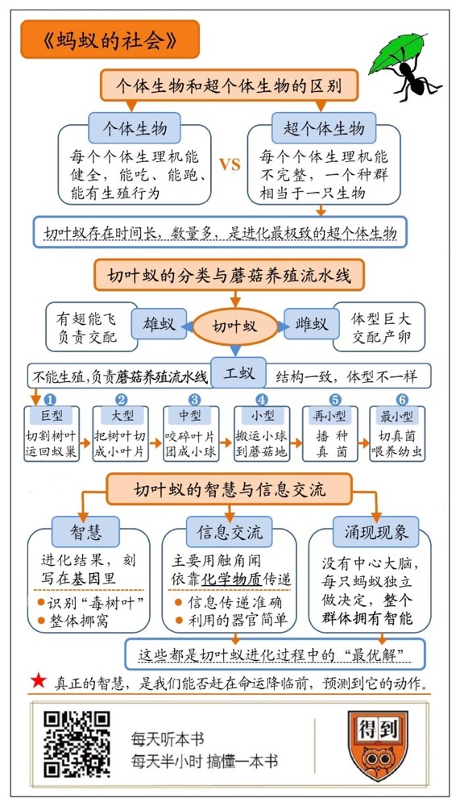

# 《蚂蚁的社会》| 怀沙解读

## 关于作者

爱德华·O.威尔逊，被誉为现代社会的达尔文。他奠定了现代物种保护的理论基础，创建了“社会生物学”这一全新学科，引发整个知识阶层与社会大众的广泛讨论。《时代》杂志评选他为“全美最具影响力的 25人之一” “世纪人物”。

## 关于本书

本书由《蚂蚁》中的一章衍生出来。这本书以地球上最完美的超个体生物南美切叶蚁为主线，对“超个体”这个概念进行了详细的阐释，是了解蚂蚁社会结构和超个体概念的科普版本。

## 核心内容

当个体进化达到其物种极限时，顽强的生命会转而在社会组织方式上继续进化出生存优势。 社会性蚂蚁正是此类进化中的佼佼者。当它们作为一个群落时，蚁群不仅是个体的集合，而是共同组成了一种被称为超个体的集群有机体。 

## 前言

你好，欢迎你每天听本书，今天的书名是《蚂蚁的社会》。

2019年，在“得到”春季知识发布会上，我们独家首发了这套书。一套书四本，分别讲了大象、蚂蚁、蜜蜂和猿猴四种动物。今天是这个系列解读的第一本，《蚂蚁的社会》。作者是哈佛大学的进化生物学家爱德华·威尔逊。

先得说一下这本书的书名，中文名叫《蚂蚁的社会》，我觉得《蚂蚁的社会》这个中文翻译，其实相对于原书的内容来说，这个书名翻译略大了一点。

其实它的英文书名叫做《切叶蚁》，副标题是“行为构成的文明”。这本书的内容，更像一本《切叶蚁正传》，它就是通过各种细节和侧面，把“切叶蚁”这个物种给说得明明白白。

你可能会问，为什么我没事要去了解一种，我听都没听说过的什么切叶蚁呢？因为通过切叶蚁这种蚂蚁，我们可以了解一个非常重要的概念——超个体生物。

我的解读会分成5个小节。先进入第1个小节：什么是超个体生物。

## 第一部分：什么是超个体生物

目前，人类知晓的地球生物有大约300多万种，其中动物有200多万种。

那怎么把这200万种动物做分类，就成为了一个很讲究的事。比如，我们可以把它们分成会飞的和不会飞的，水里游的和陆地跑的，或者有脊椎的和无脊椎的，等等。但是，还有一种你可能没听过的分类方法，是把地球的动物分成：个体动物和超个体动物。

什么意思？我们先看什么是个体动物。回答是：几乎所有动物都归于这一类。无论是人、狗、猪、牛、羊，大部分的昆虫，所有的鱼，所有的鸟，等等全都是。个体生物的特点是：每个个体，都有一套健全的生理机能，它自己能吃，能跑，能有生殖行为。

但超个体生物就完全不一样，超个体生物的生理机能是不完整的，典型的例子就是蚂蚁和蜜蜂。我们知道，工蚁、工蜂，它们是没有生殖能力的，是一个无性个体，作为一个生物，它并不完整。而蚂蚁的蚁后，它虽然有生育能力，但它没有行走能力，平时根本不动，也没有主动进食的能力，只能靠别的蚂蚁喂它。

只有把这一窝蚂蚁凑成一个整体，它作为一个生物的所有生理机能才能凑齐全。在某种程度上，我们甚至可以把这一窝几百万只蚂蚁当成一只生物来看待。像这样的生物就叫做：超个体生物。

对于超个体生命，我们的态度是两极化的。一方面，有很多人会认为，蚂蚁、蜜蜂好像代表着一种不受欢迎的价值观，因为它们太整齐划一了，太千人一面了，感觉很很压抑个性。在我们这个鼓励个性的时代，这种生存方式显然不是主流。但另一方面，我们却不得不承认，蚂蚁很成功。

所以你看，别以为人类很厉害，超个体那边的日子过得，既长久又繁荣。那我们作为地球号称最成功的个体生物的代表，是不是应该了解一下超个体生物，那边的情况呢？

今天，我们就通过“切叶蚁”这个物种，来了解超个体生物。

为什么要特意选这个物种，因为切叶蚁被科学家认为是蚂蚁种群里，进化到极致的物种。切叶蚁在蚂蚁里的地位，就相当于人类在灵长类动物里的地位。

## 第二部分：切叶蚁的流水线

切叶蚁，顾名思义，因为它们喜欢把树叶切割成一片片的，然后举着走路，所以才得到了这个名字。

但切叶蚁切树叶，不是为了自己吃，而是为了去养殖另外一种真菌，它们再靠吃真菌为生。所以，切叶蚁可以算是蚂蚁里的农民。再说得具体一点，是一群种蘑菇的农民。

当我们提到“切叶蚁”三个字的时候，是一个大门类，里面有上百个物种。就像我们提到狗这个称呼的时候，其实里面包含了很多种类的狗。但总体上，切叶蚁都过着差不多的生活。

我们绝大多数中国人，应该都没有见过切叶蚁。因为它们只分布在美洲。下面，我就从书里帮你选了一种叫名为“美洲切叶蚁”的物种，我们来近距离观察一下它们。

我们的讲述，从森林里的一片树叶开始。

首先亮相的，是一种脑袋上面长着一对大钳子的工蚁，它们是切叶蚁里干最粗重体力活的蚁种，就称它们为巨型工蚁吧，巨型工蚁的体型比同一个巢穴里最小的工蚁要大十几倍甚至几十倍。如果换算成人类的比例，那就非常吓人了，相当于我们前面站着一个身高20米的巨人。

巨型工蚁的工作，就是爬到树叶上，用头顶的大钳子把树叶切割下来，然后把叶子举过头顶，搬运回蚁巢。然后折返，继续切叶子，周而复始。这个工作就是切叶蚁蘑菇饲养产业的最开端，也是流水线的第一环。

叶子被采回来后，会进入第二个工序。负责这个工序蚁种身材稍微小一点，我们称之为大型工蚁。它们的任务是，在原地把大片的树叶切成1-2毫米宽的小叶片。

然后是第三个工序，一种体型更小一点的工蚁会接手，它们负责把叶片咬碎，然后把树叶团成一颗饱含叶子汁水的绿色植物纤维球。同时，它们还会把自己的粪便掺和到这个小球里面，这么做是为了改变小绿球的化学性质。放了粪便的小球更有营养，和我们人类种地的时候上粪有点像。

再下一个工序就是搬运这个小绿球了，由体型又更小一点的工蚁来做，你看，这是出现的第四种蚂蚁了。它们的任务是把这些加了第三种工蚁粪便的小绿球，一颗一颗地搬到蘑菇地里去。其实说是蘑菇，看起来更像是白色的棉絮，其实是一层细细的菌丝，它们才是切叶蚁的食物。这些富含营养的小绿球就会在菌丝旁边腐烂变质，菌丝就能吸收和加以利用。

而在菌丝的旁边，第五种蚂蚁出现了，它们就更小了，这帮家伙的工作是播种。它们会跑到真菌密集生长的地方，啪，扯下一根真菌的菌丝，然后把这根菌丝种植到旁边的空地上。这么一来，真菌的种植面积就扩大的了，产量就提升了。

而就在真菌菌丝的内部，还有第六种工蚁。它们是所有工蚁里最小的，任务是把真菌切成非常小的块，然后送到蚂蚁的幼虫嘴里，相当于幼儿园给孩子喂奶的工作人员。

一共六种工蚁，全部亮相完毕，它们也是流水线上的六个岗位。它们的一生都被锁定在流水线上，做一种工作，吃一种食物，过着周而复始的生活。如果把这六种工蚁一字排开，你会发现它们的身体结构完全相同，唯一不同的就是体型大小。它们身体里没有生殖系统，没有性别可言。打个比方吧，它们像一个人的很多根手指头，每只蚂蚁就是一根手指头，有的粗，有的细，动作很灵活，干活没问题，但它不能代表这个人，因为功能不完备。

好，这是工蚁。整个蚁群还有非常重要的两种蚂蚁：分别是雌蚁和雄蚁。我们都知道，它们是繁殖。

雄蚁的外形和刚才那些工蚁都不一样，它长着翅膀，能飞。它们体内有发达的生殖系统。雄蚁一点活儿也不干，它一生的任务就是交配。而雌蚁，也就是所谓的蚁后，它的特点就是身材巨大，有一些切叶蚁的蚁种，它们的蚁后身材比最小的工蚁大上百倍。这个体型的差异太大了，你可以想象一下，相当有一个人类，他趴在地上的时候，能占据一个足球场这么大的空间，身材有5层楼那么高。

当工蚁在蚁后身上走来走去的时候，就像是爬上一座小山一样。有的工蚁给它清理身体，有的工蚁在给它喂食，而雄蚁就负责和它交配，蚁后每天能跟十几只雄蚁交配。一只成熟的蚁后平均每分钟产下20个卵，每天产下28800个。算下来，一年产卵单量达到1000万个。

好，这就是切叶蚁日常工作和八个蚁种。它们的身份和岗位，我们都介绍完了。接下来，我们把焦距再调小一些，一起看看切叶蚁的这条生产流水线上还有什么值得关注的有意思的细节。

## 第三部分：刻在基因里的智慧

首先，我们来看一个实验。

科学家在切叶蚁采集树叶的某一个枝头上,涂抹了一种化学药品，叫环己酰胺。这种化学物质对蚂蚁无害，蚂蚁也识别不出来，但它不利于真菌生长。下面，我们就把这个抹了药水的枝头叫毒枝头吧。

毒枝头的叶子，就被巨型工蚁糊里糊涂地运进蚁巢了，毒叶子进入了流水线。10个小时后，科学家就发现蚂蚁的行为发生了变化：在流水线的第二个环节，大型工蚁突然开始拒绝切割这些毒叶子，无论巨型工蚁搬回来多少毒叶子，大型工蚁都不切割这些毒叶子。不一会儿，巨型工蚁也好像收到了信号一样，开始不切割毒枝头的叶子了。并且在接下来9个星期的时间里，毒枝头的叶子就像进了黑名单一样，切叶蚁切断了毒叶子的来源。

而在第10个星期，研究者把毒枝头上的药水洗掉了，再观察切叶蚁。结果发现，3个星期后，切叶蚁又重新接纳了这棵树的树叶。

这个实验就太有趣了，它能透露很多细节。

第一，说明切叶蚁虽然闻不出来化学药品，但它们一直在观察真菌的生长情况。一旦发现真菌长势不好，马上进行整改，切断树叶供应。

第二，只需要10个小时，切叶蚁就做出了反应，这个反应速度很快，说明它们对真菌生长情况的检查很频繁。

第三，切断供应是从流水线的第二个节点上开始的，并没有从最根源上切断。这个动作有一个好处，就是没有把这个叶子来源一棒子打死。就算是面对毒枝头的树叶，切叶蚁也一直给你改过自新的机会。要不为什么在毒枝头的药水被洗掉之后，切叶蚁能即时发现这个变化呢？说明它们一直在默默关注着这个毒枝头，而且偶尔还摘一片毒树叶来喂一下真菌试试，要是还有毒，就继续拒收。但是一旦发现这条供应链没问题了，就恢复采购。

我们看，这些做法都既精准又理性。要是用人类的视角来解释，可能有人会说，“你看，蚂蚁有大智慧啊，这不是给人留余地，给自己留后路，这很符合人类那些大智慧，什么李嘉诚的经营之道啊。”

切叶蚁难道真的这么聪明吗？答案是：不是。切叶蚁并没有任何智慧，它们不能做任何理性推理，一切行为，都是写在它们的基因序列里的。

那是谁把这么巧妙的应对策略刻写在基因里的呢？答应就是多年的演化。

刚才我们说了，蚂蚁早在7000万年前就存在了。这就像一个长达7000万年的蚂蚁生存技能试验场，无数蚂蚁用自己的生命为代价，左突右冲，寻找这个生物场景下的最优解。“最优解”是演化论中经常出现的一个词，它有点类似“性价比最高的解决方案”吧。

同时，昆虫又是一种身体结构相对简单的物种，我们人的一个世代是几十年，几十年对于蚂蚁来说可能是几十代蚂蚁了。所以它们身材变异和迭代都更容易，这和小公司迭代快，好调头是一个道理。

所以，蚂蚁是怎么解开这道生存难题的呢？答案是：靠命堆出来的，用技术术语说，是靠大数据暴力破解的。经过多年的误打误撞，每个细小的进步都被保留下来，刻画在了它们的基因序列里。演化是一个能工巧匠，它不光雕刻出了大自然丰富的物种，也雕刻出了物种精妙而看似有智慧的行为。

好，能够识别毒树叶，这是切叶蚁的第一个细节。下面，我们再看一个。

科学家发现切叶蚁搬家的时候，有一个奇怪的行为，它们会把蚁巢里饲养的真菌和地下的土壤，整个抬起来扛着一起搬。这个行为很奇怪，就相当于一个农民在搬家的时候，把土地和上面的作物也给铲起来背着走。同样的真菌到处都有，有必要这么连根儿都带走吗？

科学家仔细分析了真菌表面的微生物环境后，破解了这个秘密。

原来，切叶蚁是不能直接食用这种真菌的。在真菌的表面上，至少还生活着两种细菌，是这两种细菌先消化了真菌，把真菌变成了蚂蚁能利用的多糖、麦芽糖、蔗糖，然后切叶蚁才能吃。

所以，切叶蚁搬走的不是真菌的植株，而是一个生态系统。就有点像一个酒厂最值钱的，不是那个流水线，也不是一瓶瓶酒，而是那个发酵了几百年老酒曲。只有调试出一个健全的生态系统，蚂蚁的养殖产业才能正常运转，所以当然要把这个东西一起带走，这可是蚂蚁的全副家当。

当然，这个行为也是进化出来的。在漫长的进化过程中，不知道哪只蚂蚁出毛病了，非要连根儿背走，被它蒙对了，它的后代获得了生存优势，也继承了连根儿搬家的行为。

好，通过这两个小故事。我们窥见了切叶蚁内部成熟而精妙的规则。

如果用我们人类的语言来总结这些蚂蚁，我们可以这么描述它们：它们是一个团结的大家庭，每人都是训练有素的产业工人，任劳任怨，它们有危机应对能力，有长效修复机制，还有尊重传统的好习惯。它们经营着精耕细作的蘑菇生产业，是一群纯良的、勤劳的生产者。

所以，你现在知道，为什么切叶蚁被称为终极超个体了吧？这样精妙的体系是世界上任何一种蚂蚁都没达到的。

说到这，我们来给你补充一点这本书之外的知识。比如我们中国人最常见的蚂蚁，我们小时候趴在家门口看的那种黑色的的小蚂蚁，学名叫中日盘腹蚁。中日盘腹蚁要和切叶蚁比起来简直就是一群暴徒。它们出门的时候，分工是比较模糊的，说得夸张一点，就是暴徒A、暴徒B、暴徒ABCDEF，一群暴徒出门了。行动也比较粗暴，目标就是寻找一切能吃的东西，能捡的捡，不能捡的就抢。和切叶蚁比起来，乏善可陈，又粗线条，又没有什么建设性。其实，蚂蚁的进化和人类社会的进化很相似，农耕文明一定比采集狩猎的民族更文明的。

说到这，小小地感慨一下，在个体进化，也就是人类文明这条进化的任务线上，欧亚大陆战胜了美洲大陆，这个世界的主流文明是在欧亚大陆上进化出来的。但切叶蚁帮美洲大陆扳回一分，地球上最先进的超个体生物，出自美洲。

下面，我们进入第4小节，我们来说说，切叶蚁是怎么传递信息的。

## 第四部分：切叶蚁是怎么传递信息的

用一句话来回答，包括切叶蚁在内的几乎所有蚂蚁，90%以上的信息传递是通过释放化学物质来实现的。专业的术语叫释放“信息素”。

切叶蚁的眼睛退化得很严重，几乎没什么视力，它们识别敌我、走路、寻找叶子，基本都是靠嗅觉，可以说行动和工作基本靠闻。但不是用鼻子，是用头顶的那两个触角。触角上的感觉神经元非常丰富，能够探测到空气里的气味分子，并且把它传递到大脑里。

我们可以这么理解，一只切叶蚁走在路上，它是一直在释放着只有自己这个蚁种才有的化学物质 ，这就相当于它一直在喊：我是一个工蚁，我是一个工蚁。这么一来，所有同伴就都知道这里有一只工蚁爬过了。

再比如，假设现在有一只大食蚁兽来了。顺便说一句，大食蚁兽这种动物是蚂蚁的绝对天敌，你听它的名字嘛，食蚁兽，它可以用它的大长舌头伸到蚂蚁窝里，把蚂蚁都沾出来吃掉。它的出现对于蚂蚁来说就是灾难。

那每只被舔走的蚂蚁不能白死啊，它们在临被吃掉之前都会释放一种叫做4-甲基-3-庚酮的化学物质，这个信息素就相当于大喊：食蚁兽来了！食蚁兽来了！附近的蚂蚁接受到这种物质后，马上也释放相同的物质，这不就起到了狼烟和烽火的效果吗，整个蚁群很快就都知道食蚁兽来了。就能做出应对，比如把蚁后搬到更深的巢穴里。针对不同的危险，切叶蚁会释放出不同的信息素，比如食蚁兽来了，是刚才这种物质，但要是洪水来了，就是另外一种化学物质。

这是“信息素”的第一个功能，传递信息。

同时，“信息素”也是蚂蚁识别不同种群的方式。每窝蚂蚁有自己的味道，气味不同的蚂蚁，绝对不可能进一个窝。所以一旦有蚂蚁和自己的族群走丢了，它就死定了。

可能你在吃一些进口热带水果的时候，比如山竹，有过这样的经验。在掰开之后，有黑蚂蚁爬出来，蚂蚁是从马来西亚漂洋过海来到中国的。可能有人会想，它们多不容易啊，赶快放生吧。但其实这些马来西亚蚂蚁肯定活不了，除非你回到这个山竹被摘下的那棵树下放生。否则它们一旦从山竹里爬出来，就会发现周围的味道全是陌生的，它们会一直试图归巢，最后在焦虑和彷徨中死去。

但是，如果从山竹里飞出来的，不是一只超个体生物，比如是一只马来西亚果蝇。那就不一样了，如果这只果蝇一直能找到食物，它是可以一直在中国活到寿终正寝的。

这就是个体和超个体的区别，离群的个体生物虽然很孤独，一辈子打光棍，但可以活到寿命结束。而离群的超个体，就像是一个迷失在异国他乡的一个器官一样，最后是死路一条。所以说信息素，也是识别自己人的办法。

那为什么蚂蚁会使用信息素来传递信号呢？原因很明显，这是也是它的“最优解”。首先，信息素的信息交付够明确。一种化学物质的分子结构非常明晰，精确到分子级别，传递起来非常准确，没有任何歧义，特别适合在一个庞大的群体里传递。

而人类最常用的信息传递手段——声波，就不适合在很多个体分散在一个很广的范围的时候用。比如说个真事，这是两位英国旅行者在采访老红军的时候记录下来的。当时队伍的最前面向后传达一个指令：“拉开距离”，传到后面变成了“都牵上驴”。声波的好处是善于传递复杂信息，但存在信息损耗。

而我们反观信息素这种方式，非常适合蚂蚁。特别适合在很多超个体里迅速扩散，下达简单而统一的指令。而缺点是，不能表达复杂的含义，但蚂蚁也不需要人类太复杂的信息，无非就是：“我在工作。危险。不要这种叶子。”这些相当简单的指令。

使用信息素来传递信号，也是蚂蚁在漫长的进化过程里，被它们“蒙上”的最优解。

提到信息素，有个有趣的事值得一说。人类观察到，蚂蚁和很多昆虫，它们的求偶也完全是通过“信息素”来实现的。对于有的昆虫来说，只要我接受到了你身上的化学物质，我马上就和你结合。所以，人类就根据这个研究出了一种叫“佛洛蒙”的香水。

佛洛蒙的英文，就是激素的意思。据说，佛洛蒙香水除了很香之外，里面还加入了雄性激素和雌性激素，能用化学物质操纵你的约会对象，对方的身体会接收到你发出的化学物质，他就会脸红心跳，不知不觉地爱上你。

“佛洛蒙”被传得很神，好的佛洛蒙还卖的很贵，但其实这是一种心理学现象叫“自证预言”，这个逻辑是，你涂抹了佛洛蒙之后，自己认为对方已经被你拿下了，所以你变得更自信了，是你的自信吸引了异性。

但从科学的角度说，佛洛蒙就只有安慰剂效应。因为人类毕竟不是昆虫，人类获取信息的渠道太多了，择偶这种大事，我们怎么可能被简单的化学物质操纵呢？可以这么说，如果你要是想通过涂抹化学物质的方式吸引什么东西，那被你吸引的可能就只有昆虫。

好，这个小节，我们说的是信息传递。在最后一个小节，我们来讨论一个高级话题，就是蚂蚁的智能是怎么产生的。在《蚂蚁的社会》这本书里，这方面话题说得不多。下面这个小节的内容，来自另外一本讲述蚂蚁的书，《超个体》。

## 第五部分：涌现现象

你可能听说过涌现现象，英文是 emergence。它指的是，当一些物体或者生物凑到一起之后，整体上出现了一个单独个体并不具备的属性，这就是涌现。比如，很多人类聚集在一起之后，国家就出现了，这就是一个涌现现象。而蚂蚁的智能，就是一个典型的涌现现象。

首先，蚂蚁没有一个总指挥和中央大脑的。我们刚才说的蚁后，虽然叫蚁后，但是它没有决策能力，说白了，它只是一台生育机器。

那一个蚁群在面对重大事件的时候，是怎么快速做出反应和决策的呢？

我们还是回到刚才的例子里，假设森林里来了一只大食蚁兽。这只食蚁兽饱餐了一顿后，把这个蚂蚁种群里80%的巨型工蚁给吃掉了。这时候该怎么办？

接下来，切叶蚁种群会启动一系列反应来应对变化。

我们前面说过，每只工蚁在日常遇到对方的时候，都会确认对方的身份，这让它们每时每刻都知道每个蚁种的比例是否合适。一旦发现巨型工蚁数量严重缺失，首先的反应，是比它小一号的大型工蚁，它们中的一部分会补位变身成巨型工蚁，就是先顶上再说，切树叶的活儿不能没人干。但这么一来，大型工蚁不就不够了吗？接下来，中型工蚁中的一部分会变身成大型工蚁，相当于就把这个变化一层层传递下去，每种蚂蚁都向自己的上一环节的流水线补充一些蚂蚁。最后，传递到蚁后那里，导出一个很清晰很简单的动作：多生一些小蚂蚁，按照比例把缺失的各个类型的工蚁都补上。你看，整个过程没有谁下令，都是每只蚂蚁独立做决定。一次危机就被蚂蚁这么一层层的独立决策消化掉了。

这就是一次典型的“涌现”过程。整个蚁群对外表现出了很强的智能，但并没有一个中心大脑做任何决定。

同样的道理，这样的决策方式也是蚂蚁的最优解。让每只蚂蚁自己做决策，有很多好处，首先反应速度够快，没有信息传递延迟。而且特别适合智力有限的蚂蚁种群，因为它们并没有一个能够处理复杂信息的中心大脑。把决策权下发，绝对是更好的应对。

这也是超个体生物的典型表现，每个个体做出的具体动作，最终的结果都是为了让整个种群形成一个看上去有智慧的整体。

## 总结

好，说到这儿，这本书就差不多了。帮你总结一下：首先，我们说了个体生物和超个体生物的区别。第二部分，我们认识了切叶蚁的八种蚁种，和它们的蘑菇养殖流水线。在第三部分，我们讲了切叶蚁的智慧，这些智慧是刻在它们的基因序列里的。第四部分，我们讲了切叶蚁的信息交流方式，主要靠信息素来传递信息。第五部分，我们说了涌现现象。

最后，说一些我的个人感受。

我想和你探讨一个问题：精妙，能和智慧，画上等号吗？

我们平时刷朋友圈的时候，经常能看到这样一类帖子，大概是下面这种画风：“蚂蚁社会的那种智慧，至今人类都学不会。或者说，蚂蚁是非常神秘的物种，神奇的地球，神奇的自然，在帖子最后，号召我们人类不要狂妄自大，要敬畏自然。”

那今天你听我说完《蚂蚁的社会》之后，你还觉得蚂蚁世界很神秘吗？我觉得并不神秘。所有巧夺天工的设置，最优路径的达成，就是两个字：进化。如果一定要在后面加一个时间，那就是38亿年，地球38亿年的地球生命进化史。只要肯给足够试错的空间和时间，任何精妙的东西都可以被被动选择出来。

如果这么说还不透彻，我们来看一个很经典的思想实验。

炒股票，应该算是世界上最需要智慧的事情之一了，但其实猴子也能炒股票。来想象一下，现在选100亿只猴子，让每只猴子每天随机买一只股票，在晚上收市的时候，所有亏钱的猴子马上淘汰出局，这么一轮轮筛选下来。那最后我们一定能在100亿只猴子里选出一只，它选的每只股票都赚钱。如果我们把其他参赛的猴子都屏蔽掉，只看这只猴子一路走来的路径，那它简直就是股神。不过，它身上只凝结了运气要素，而没有任何智慧要素。

从这个角度说，蚂蚁也一样，它只是一个一路买彩票全中的幸运者罢了。它虽然精妙，但它完全不明白为什么要这样。

所以，在我们描述蚂蚁和其他动物的时候，一切和主动意识有关的动词都是错误的。什么蚂蚁摸索出了，蜜蜂决定怎样怎样，全是错的。我们只能说：蚂蚁蒙上了什么什么，这才符合事实。好运气，不能被称为智慧。

那谁才真的有智慧？我们人类有。为什么？因为智慧要看一个物种主动做了什么，以及悟出了什么规律。比如，人类先计算出了哈雷彗星的轨道，时间到了，它真的来了，这是智慧。我们预测出了引力波，造设备专门找它，最后找到了，这是智慧。这说明我们理解了自然，悟出了世界的规律，然后赶到它们的前面，看见它按照我们预想的方式发生了。

没错，我们当然对这个世界充满敬畏，但不是通过观察蚂蚁而感受到的。

真正的智慧，是我们能否赶在命运降临前，预测到它的动作，而不是等着命运来宣判我们的运气是否足够好。

撰稿、讲述：怀沙

脑图：摩西脑图工作室

