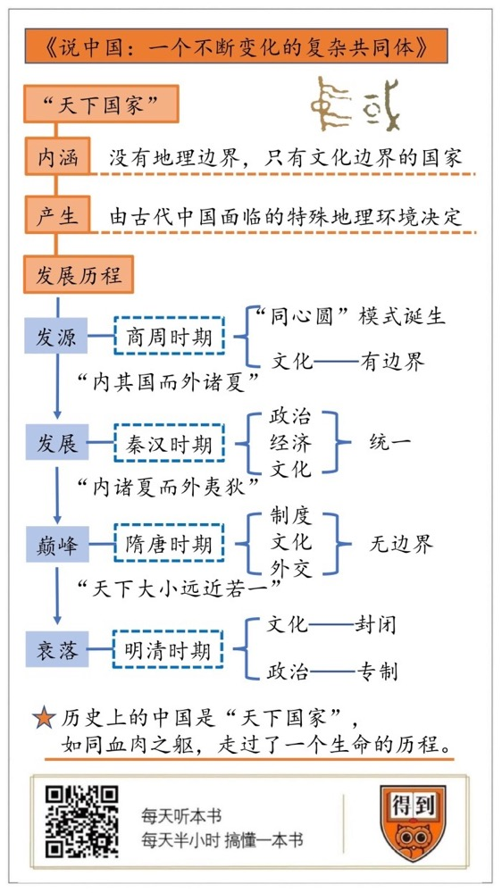

# 《说中国》| 卞恒沁解读

## 关于作者

许倬云，著名历史学家，美国芝加哥大学人文学科博士，先后被聘为香港中文大学历史系讲座教授、南京大学讲座教授、夏威夷大学讲座教授、杜克大学讲座教授、匹兹堡大学史学系退休名誉教授等职，代表作有《中国古代社会史论》《说中国》《汉代农业》《西周史》《万古江河》。

## 关于本书

许倬云教授围绕着“中国究竟是什么，我们究竟是谁”这个问题，讲述“华夏/中国”作为一个“天下国家”是如何不断发展演变的。

作者以宏大的视野，舍弃旁枝末节，始终关注中国历史上的根本特征和关键节点，围绕“天下国家”这个核心，勾勒出各个时代的风貌，使读者有酣畅淋漓之感。

## 核心内容

古代中国是一个“天下国家”，也就是就是一个没有地理边界，只有文化边界的国家，这是由古代中国面临的特殊地理环境决定的。“天下国家”发源于商周时期，发展于秦汉时期，在隋唐时期到达巅峰，在明清时期走向衰落。她就如同一个血肉之躯，走过了一个生命的历程。

## 前言

你好，欢迎你每天听本书。今天为你解读的是许倬云先生的经典著作：《说中国：一个不断变化的复杂共同体》。许倬云先生是香港中文大学的讲座教授，著名的历史学家。

这本书提出了一个非常宏大的问题：所谓的“中国”究竟是什么？对于这个问题，我们可以给出各种答案。

比如有的人会用国界去界定中国，但今天中国的国界其实只有不到70年的历史，而且在中国的历史上，各个王朝的边界其实是非常模糊的。比如有的人会用民族去界定中国，但现在生活在中国这片土地上的五十六个民族，并不是从来就有的。甚至作为主体民族的汉族，也曾经历过多次民族融合。有的人用文化去界定中国，因为西方某些国家就可以合在一起，称为“基督教世界”，那么中国能否被界定为一个“儒教国家”呢？好像也不对，在中国，佛教和道教也很兴盛，甚至基督教和伊斯兰教在中国也可以生根发芽。

那么，“中国”究竟是什么？作者把中国概括为四个字：“天下国家”。意思是，在历史上，中国这个国家是没有地理边界的，任何族群只要认同中国的文化，就可以加入中国这个文化共同体。所以，历史上的中国可以通过吸引周边地区的认同，不断扩大自己的范围。这个“天下国家”发源于商周时期，发展于秦汉时期，在隋唐时期到达巅峰，在明清时期走向衰落。她就如同一个血肉之躯，走过了一个生命的历程。

我将从下面三个方面，来为你讲清楚“天下国家”这个概念：

首先，“天下国家”的内涵是什么？它是如何产生的？

其次，“天下国家”的发展历程是怎样的？为什么说隋唐时期是天下国家的巅峰？

最后，“天下国家”又是怎样在明清时期走向衰落的？

## 第一部分

我们先来看第一个问题：“天下国家”的内涵是什么？它是如何产生的？

所谓“天下国家”，就是一个没有地理边界，只有文化边界的国家。边界外部的族群如果认同了边界内部的文化，也可以成为天下国家的一部分，天下国家因此就得到了扩大。这个听上去有点复杂，但如果追溯到天下国家的起源，我们就明白了：天下国家其实是早期中国面临的特殊地理环境塑造出来的。

我们的中华文明，是著名的古代文明之一。和中华文明同时出现的，还有印度河流域的古印度文明、两河流域的古巴比伦文明，以及尼罗河流域的古埃及文明。

如果展开一幅世界地形图，你就会发现，无论是古埃及的尼罗河文明，还是古巴比伦的两河文明，规模都比较小。印度河文明其实位于今天的巴基斯坦，西边是山脉，东边是沙漠，也是一个相对封闭狭小的空间。但黄河流域诞生的这个文明却不一样，四周相对广阔平坦，拥有很大的开发空间。我们的祖先站在这样一片土地上，举目四望，广阔无垠，这激发了他们探索的欲望，也促使他们产生一种想象：把自己居住的这片土地，看成是整个世界。这就是古代中国“天下”观念的起源。

正是在“天下”观念的影响下，商周时期出现了“同心圆”的治理模式。商朝和周朝都以黄河流域为中心，不断扩大统治的范围。

商朝曾经频繁迁都。关于这背后的原因有不同的说法，有人说是因为洪水的泛滥，有人说是因为战争。但商朝频繁迁都的结果是不容置疑的，那就是它的影响范围逐渐超出了黄河中游，开始覆盖黄河下游、淮河流域等地区，这就是所谓的“中原”。商朝后来又被周朝所取代，周朝建立起政权以后，向各地派出移民，建立起更多的城邦，覆盖了更大面积的土地。

说到这里，我们要尝试着去理解当时人们的心理。他们望着四周无边无际的土地，开始尝试着去探索未知的世界。在这个过程中，他们并不像其他文明的人类那样，走着走着就遇到沙漠、山脉、海洋等天然的地理边界，他们也就不会产生关于边界的意识。他们会愈发坚定地相信，自己所处的是一个没有边界的“天下”，所以他们为了治理这片土地而建设的制度，从一开始就不是在建设一个国家，而是为了治理整个“天下”。

商朝发明了一个“同心圆”的模式，也就是从统治中心出发，不断向外围扩展势力，形成不断扩大的同心圆。

商朝的国都是一个大型城市，外围居住着许多王族，共同保卫国都；更外围的地方是一些中小城市，由国都派出的使者负责监督；再外围是一些和商朝保持良好关系的城邦；最外围是一些被称为“方”的族群，比如“鬼方”，这个族群和商朝之间曾经发生过战争。

周朝成功取代商朝以后，取得中原地区的统治权，把统治中心放在今天的陕西关中地区，还在今天的河南地区建造了洛邑，以方便其统治中原地区。周朝继承和发展了商朝的同心圆模式，以国都为中心，通过宗法制和分封制，在全国建立了大大小小的诸侯国。诸侯国要定期朝见周天子，向周天子缴纳贡赋，派兵随同周天子作战。说白了，周朝把商朝的同心圆模式进一步制度化了，中原地区以周天子为中心，具有了一定的向心力，得到了初步的整合。

于是，周朝就成为一个以中原地区为核心的“天下”。因为缺乏地理上的天然边界，周朝人也就没有产生以地理来划分边界的意识。那他们怎么区分自己人和外人呢？主要是通过文化。

这里的“文化”也并不是特别抽象的东西，其实主要就是生活方式。黄河流域的人向四周移民，最后总会遇上一些周边地区的人，他们吃的穿的都和自己不太一样。这种“不一样”很自然地就成了区分自己人和外人的标志。

儒家经典《礼记》里面就给这些人都起了个代号：东边的叫做“夷”，西边的叫做“戎”，南边的叫做“蛮”，北边的叫做“狄”。这些字都是有讲究的。比如东边的“夷”，这个“夷”字在字形上就是一个人背着一张弓，这其实是在说他们以打猎为生。再比如北边的“狄”，这个“狄”字就是反犬旁旁边加一个火字，其实是描述了一个场景：晚上，放牧的人带着牧羊犬守在火堆旁边，防范猛兽来叼走牛羊。这说明北边的“狄”以放牧为生。

周朝人看到了这种文化上的区别，就很自然地把文化作为区分内外的边界。接受中原文化的就叫做“华夏”，不接受中原文化的叫做“夷狄”，这就是所谓的“华夷之分”。

这里所谓的中原文化，也就是周朝的礼乐文化。“礼乐”是西周的周公制定的一套制度：“礼”就是日常生活中的各种礼仪规范，可以具体到穿什么衣服，吃什么食物；“乐”就是由政府制定和颁布的音乐和舞蹈，周公相信它们具有教化人心的作用。周朝分封出去的诸侯国都奉行礼乐文化，是否奉行礼乐文化也因此成为区分“华夏”和“夷狄”的标志。

但这个区别并不是绝对的，夷狄如果接受了华夏的文化，也可以成为华夏的一部分。周朝为了开发今天的山东半岛，就曾经让姜太公去那里建立了齐国，负责同化当地的族群，也就是所谓的“东夷”。到了战国时期，原来的“东夷”就变成了齐国的百姓，也就融入了“华夏”。类似这样的例子，在当时是很常见的。通过这种文化上的同化，华夏就可以不断地扩大。中国作为一个天下国家的雏形也就诞生了。

这就是第一部分的内容，讲的是“天下国家”这个概念的起源，这是和我们的祖先生活的环境相关的。到了周朝，一个“同心圆”模式诞生了，这就是天下国家的雏形。

## 第二部分

但这个雏形还并不完善，非常脆弱。尤其是在春秋战国时期，就连华夏文化圈内部的各个诸侯国之间也不断爆发战争。这进一步唤起了人们对于“天下国家”的向往。接下来我们就谈谈天下国家的发展历程。

诞生于战国时期的《春秋公羊传》里就提出了一个宏伟的设想，要想建成天下国家，需要经过三个阶段：第一个阶段叫做“内其国而外诸夏”，就是华夏文化圈分成了许多国家，各个国家都把其他国家看成是外人，相互提防，这其实就是战国时期的状态；第二个阶段叫做“内诸夏而外夷狄”，就是华夏文化圈已经统一了，成了一家人，但还有一些周边地区的人群不肯接受华夏文化，他们也就是所谓的“夷狄”，相对华夏而言仍然是外人；第三个阶段叫做“天下大小远近若一”，就是普天之下都成了一家人，再没有什么华夏和夷狄之分，彼此之间的界线彻底消除了。

这虽然是儒家的理想，但中国的历史还真的按照这个逻辑走了下去。秦汉时期就是第二个阶段，华夏文化圈获得了统一，但和北方游牧民族仍然保持着距离；隋唐时期就是第三个阶段，东亚大陆上的各个族群都被纳入了天下国家的体系之中。

我们先来看秦汉时期。秦汉时期完成了一项重要的历史任务，那就是把华夏地区统一为一个整体。为此秦汉时期进行了一系列建设，这些建设可以分成政治、经济、文化三个方面。

在政治上，经过秦汉两代的努力，建立起中央集权的政治制度。秦汉把权力直接贯彻到基层，对居民进行管理。根据一些出土文献的记载，政府掌握了每一个基层社区的人口数字，以及每一家的产业。政府征收人头税，也是由居民社区里的官吏们负责收集。可见，政府通过基层组织，直接介入了所有人民的生活，对人民进行集中统一的管理。

在经济制度上，秦汉也追求集中统一。秦始皇统一币制，发行了“秦半两”，西汉时又发行了“五铢钱”。五铢钱重量适中，易于携带，而且币值和信用长期稳定，甚至在汉朝灭亡以后，五铢钱还一直沿用到唐朝建立。

除了货币，秦汉时期也完善了遍布全国的交通网。这个交通网在秦朝就已经建立，汉朝时进一步完善。司马迁的《史记》中描述当时中国的道路网，已经是三纵三横，覆盖全国。在这个道路网上，作为国家行政单位的郡县，也是各类商品的集散中心。这使政治和经济相互配合，发挥出强大的凝聚力。

最能反映秦汉帝国集中统一的，就是当时的思想文化。秦朝统一天下以后，就开始着手进行统一思想的工作。秦朝的做法叫做“以法为教，以吏为师”，就是禁止民间私自讲学，不许民间私藏医药、种树、占卜以外的书籍，教育活动主要通过官吏传授学徒的途径来完成，传授的内容当然主要就是国家法令了。

但这种做法的效果很不好，因为秦朝的法律只适用于秦国，和原来山东六国的民间风俗是相互违背的。比如秦朝规定实行“连坐法”，要求邻里之间相互监督，如果发现有人犯罪，要向政府主动举报，否则也要被一同问罪。但在原来的山东六国，邻里之间讲的都是互帮互助，和谐友爱。秦朝法律和民间风俗之间的矛盾，成为秦朝灭亡的一个重要原因。

到了汉朝中期，汉武帝实行“独尊儒术”的文化政策，把儒家作为统一思想的工具，这既实现了目的，也没有导致秦朝那样的问题。因为儒家本来不是国家制定出来的，而是扎根于民间风俗文化之中的。比如儒家讲对父母要孝顺，对兄弟要友爱，对邻居乡亲们要和睦，这些都是人之常情。国家宣扬这些道德，和民间的风俗没有什么抵触。国家对儒家的宣扬，也使整个华夏地区慢慢被儒家所同化，人们的思想也就慢慢被儒家所统一了。

我们可以看出，秦汉时期的主题就是“集中统一”，通过政治、经济、文化三方面的建设，把华夏文明区打造成一个具有高度凝聚力的整体，对外也具有了强大的自卫能力和吸引力。在北方，秦汉王朝防御并最终打败了匈奴。汉朝还打通了通往西域和中亚的丝绸之路，获得了新的物资，改变了中国的文化面貌。在南方，秦汉王朝不断扩大统治的范围，逐渐将东南沿海地区都纳入统治。在山地崎岖，交通不便的云贵地区，秦汉王朝也在群山之中建立了若干据点。华夏文明圈的外围因此获得了进一步的扩大。

秦汉王朝虽然使华夏文明圈获得了统一，但和理想中的“天下国家”仍有一定的差距。北方的匈奴是一个重要的威胁，直到东汉时期，中原王朝还和匈奴发生过大规模战争。最后匈奴虽然因为汉朝的压力向西逃走，但鲜卑等民族又趁机崛起，成为新的威胁。所以，在这个时期，中原王朝和游牧民族之间的界线是非常明显的，长城就是这道界线的最形象的写照。

到了隋唐时期，这道界线也消失了，唐朝建成了一个完全开放的天下国家。从东亚的浩瀚海洋到中亚的草原沙漠，各个族群都以大唐为核心，成为一个文化共同体的一员。甚至连那道划分中原王朝和游牧民族的界线长城，在唐朝也被废弃了。唐朝成为天下国家的巅峰，为什么它能做到这一点呢？

原因在于唐朝做到了三件事：制度无边界，文化无边界，外交无边界。

我们先来看“制度无边界”。所谓制度无边界，是指唐朝融合了中原王朝和少数民族的制度。在隋唐以前的魏晋南北朝时期，少数民族进入中原，导致不同的制度相互混杂在一起。所以，隋唐统一中国以后，就要从之前这些混乱的制度中选取精华，重新融合。唐朝在这一点上做得特别成功。

比如唐朝有一个重要的制度叫“府兵制”，是一种兵农合一的制度。农民们平时种田，农闲的时候就编入一个叫做“军府”的机构接受训练，到了战争时期就上马打仗。府兵制本来是鲜卑人进入中原以后建立的制度，当时建立的初衷其实是种族隔离：鲜卑人负责打仗，汉人负责务农，为了把鲜卑人和汉人分开，就专门设置了军府，把鲜卑人编入军府，担任职业军人，由鲜卑贵族来统率。

唐朝对鲜卑的府兵制做了两点改动：第一，打破种族隔离，无论汉人还是鲜卑人，既可以务农，也可以当兵，于是府兵制的性质就发生了改变，从一种种族隔离的制度，变成一种兵农合一的制度；第二，统率府兵的最高司令官从贵族变成了皇帝，只有皇帝才能对府兵进行调动。

这两点改动，本质上是往鲜卑的制度里加入了汉人制度的色彩。类似这样的例子还有很多，唐朝正是用这种开放的心胸，融合汉人和少数民族的制度，创造出一套新的制度。这套制度不仅对汉人适用，对少数民族也适用。这就是所谓的“制度无边界”。

我们再来看“文化无边界”。所谓文化无边界，是指唐朝能够主动吸纳外来文化。比如在日常生活上，唐代的服装不同于传统汉服的宽袍大袖，而吸收了胡服的窄袖、收腰等特点。饮食方面，各种带有“胡”字的食品，比如说胡椒，也上了汉人的餐桌。甚至来自印度的数学和医学、来自中亚的天文学，都被纳入中国的文化系统之内。

更重要的是在思想领域，隋唐时期并没有像汉朝那样，利用儒家思想追求思想上的集中统一，而是对于各种思想和宗教都采取宽容的态度。

比如在这一时期，佛教逐渐本土化，产生了“禅宗”，后来还传播到日本和朝鲜。中亚的摩尼教，还有基督教的一支也就是“景教”，都通过外国商人传入唐朝，这些宗教的共同特点是都相信救世主将会降临并拯救大众，这种理念后来又被中国民众吸收，产生了新的信仰。比如元明两代的“白莲教”，就是这种影响下的结果。

伊斯兰教这时也通过西亚和中亚的商人传入中国，在陕西的关中地区、沿海的泉州、扬州和广州地区，都建造了相当规模的清真寺。总之，唐朝对于宗教信仰采取了极其宽容的态度，这反映了唐代文化宏大的气度。这就是所谓的“文化无边界”。

我们再来看“外交无边界”，这是唐朝最有意思的一点，也就是对外关系上的来者不拒。如果说秦汉时期的长城还可以被视为某种边界，那么唐朝可以说是一个真正消灭了边界的“天下”。唐太宗曾被草原上的部族尊为“天可汗”，也就是说，唐太宗既是中国的皇帝，也是草原上部族的大汗，是全天下共同的领袖。

少数民族的领袖都向唐朝表示臣服，这些领袖都有“大都护”、“大都督”之类的称号，有的还被加上了唐朝的官衔。甚至当时日本列岛上掌握最高权力的将军，头上也顶着一个唐朝赐予的“大都督”的头衔。

更有趣的是，唐朝的官僚系统对所有民族都是开放的，甚至朝鲜半岛和日本列岛上的人也可以在唐朝参加科举考试。当时朝鲜半岛上的新罗王朝派了一个人叫崔致远，他就在唐朝考中了进士，还当上了县尉。日本派到唐朝的留学生阿倍仲麻吕，也考中了进士，后来做官一直做到左散骑常侍，也就是皇帝的顾问。像唐朝这样，把自己的政权也对外国人开放，允许外国人做官，这在中国历史上是非常罕见的。这就是所谓的“外交无边界”。

正是因为做到了制度无边界、文化无边界、外交无边界，唐朝才成为一个名副其实的“天下国家”。也就是说，天下体系从秦汉还是发展，在唐朝发展到了最完善的状态。这就是第二部分为你要解读的内容。

## 第三部分

接下来就进入解读这本书的第三部分，天下国家是如何衰落的。

唐朝是天下国家体系的巅峰，从此以后，这个体系就开始走下坡路了。以至于到了明清时期，中国不但不具有天下体系的包容性，反而陷入了封闭和僵化的状态。这背后的原因有两个：

在文化上，明清时期的中国文化失去了开放和包容的气度，转而走向封闭和保守。这种现象起源于宋朝。

在政治上，明清时期皇权过于强大，导致社会陷入僵化，失去了应对变化的弹性，这种现象起源于元朝。

我们先说文化。明清时期的官方哲学是程朱理学，程朱理学是一套极其严密的思想体系。它有两个核心观念，一个叫做“天理”，也就是万事万物的终极依据。无论是自然界的四季交替，还是人世间的君臣父子，归根结底都可以追溯到一个共同的道理，这个道理就叫做“天理”。我们今天还在说的“天理良心”、“伤天害理”等等，其实都是程朱理学在语言上的遗留。

另一个观念叫做“道统”。理学家们相信，中国的学问就是汉人的学问，这种学问的核心叫做“道”，这个道从上古时期的尧舜开始，代代相传，这种代代相传的传统就叫做“道统”。“道统”是区分汉人和少数民族的主要标准。

你看，程朱理学的这两个核心观念，刚好反映了它的两个特征。“天理”反映了它的“严密性”。如果把程朱理学比作一张覆盖一切的大网，万事万物都是这张网上的网眼，也就是“目”；“天理”就是提网的网绳，也就是“纲”。纲举目张，整个社会都被“天理”规定好了，你按天理的规定去做就行了，社会也就失去了弹性。

“道统”反映的是程朱理学的“保守性”。儒家学者发明“道统”这个词，是为了强调汉人文化的独特性，用汉人的文化去对抗外来文化的影响，中国文化的风格从此就从开放恢弘，变为内向保守。

程朱理学是在宋代形成的。宋代并不是一个天下国家，它只是东亚大陆上多国体系中的一员。和宋朝并立的辽、金、西夏等国，都对宋朝虎视眈眈。宋朝在这种压力下，失去了唐朝那样的自信，转而强调汉族文化的特殊性，希望能把汉族文化与少数民族文化区分开来。于是他们对中国文化重新进行“提纯”，程朱理学就是提纯以后的产物。这意味着中国文化从石墨变成了金刚石，虽然看上去更加纯粹和严密，但也失去了吸收和容纳外来文化的空间。

这种文化上的保守导致了对外关系上的封闭。16世纪以后，明朝开始实行海禁，不再鼓励海外贸易和移民，使中国开始落后于全球化的大潮。明清两朝，中国在对外科技交流上逐渐滞后，对于进入中国的外来文化，也无法像唐朝那样，对其加以吸收和转化，最终陷入落后挨打的境地。

我们再来说政治。明清时期，中国政治开始向皇权专制的方向发展。明太祖朱元璋废除了宰相制度，打破了皇权与文官系统之间的平衡，官僚系统完全成为皇权的附庸和奴仆。明朝还设立了锦衣卫、东厂、西厂等特务机关，为皇权服务。宦官当权在汉朝和唐朝都曾经出现过，但只有在明朝，宦官才作为皇帝的代表，拥有了随时随地监视官员的权力。

明朝还设立了“廷杖”制度，大臣们如果在朝堂上惹怒了皇帝，就可能当场受刑，甚至被活活打死。在以前的朝代，皇帝和大臣之间还保持着相互的尊重，但在明朝，官僚系统很难对强大的皇权形成制衡。

明朝的君主专制制度，后来又被清朝所继承。清朝以八旗武装力量为政权的基础，本质上是一个靠武力控制维持的政权。

清朝的权力核心，先是内阁，然后是军机处。基本结构都是皇帝自己掌握大权，加上一两位亲王作为帮手，再配合几位大臣，就组成了君主决策的中心。这个中心决定的事情，会直接交给政府各部门去执行，政府部门没有反驳的权力。汉代有廷议制约皇权，唐代有三省制制约皇权，这些制度在清代就完全消失了。

在作者看来，中国陷入皇权专制是因为元朝造成的恶劣影响。元朝是一个征服者建立的王朝，征服者和被征服者之间存在明显的等级之分。统治者对于人民，主要采取武力控制的方针。元朝也曾经实行科举制度，但录取的人数相比宋朝大为减少，导致汉人儒生无法承担起社会精英的功能，中国传统王朝中皇权与文官体系之间的相互制衡被打破了。

政治上的专制扼杀了社会的活力。明清时期的文人士大夫逐渐成为皇权的附庸，不再具有文化上的创造力。甚至中国的艺术，在清代也只能墨守成规，比如清代的绘画几乎都是模仿过去的作品，而缺乏原创性。清朝的艺术成就主要体现在小说和京剧，而这些基本都是社会的边缘人创作的作品，而与士大夫阶层无缘。一个僵化的社会在面对外部世界的冲击之时，无法做出有效的反应。清朝的士大夫面对西方的先进科技，第一反应不是主动学习，而是盲目排斥。能够放下姿态，主动向西方学习的只是凤毛麟角。这进一步加剧了中国的封闭和落后。

文化上的封闭和政治上的专制，都导致中国失去了天下国家的桂冠，以至于近代中国在面对西方入侵之际，失去了及时反应的能力。在西方的压力之下，天下国家成为了历史。现代中国已经是一个具有明确边界的国家，我们可以在地图上清晰地看到我们的国界，国界上也竖立了明确的界碑。而且当我们说到中国文化的时候，也更多关注它的特殊性，而不是普世性。也就是说，中国文化是“中国人的文化”，而不是一种世界性的文化。

## 总结

说到这里，我已经帮助你了解了《说中国》这本书的全貌。最后来总结一下今天的知识要点：

第一， 古代中国是一个“天下国家”，也就是就是一个没有地理边界，只有文化边界的国家。这是由古代中国面临的特殊地理环境决定的，在商周时期就露出了雏形。

第二， 天下国家在秦汉时期获得了发展，表现为政治、经济、文化上的统一，在隋唐时期到达了它的巅峰，表现为制度无边界，文化无边界，外交无边界。

第三，天下国家在明清时期走向僵化和保守，主要原因是程朱理学的出现导致文化走向保守，以及元朝的专制一直延续到了明清时期，导致社会失去活力。

撰稿：卞恒沁

脑图：摩西

转述：李璐